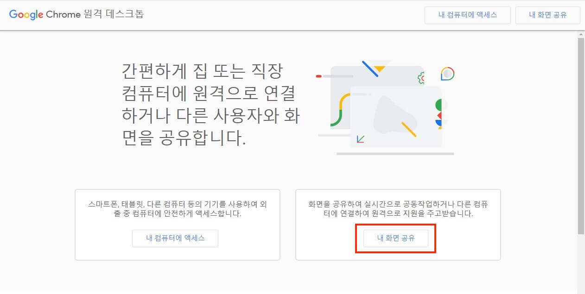
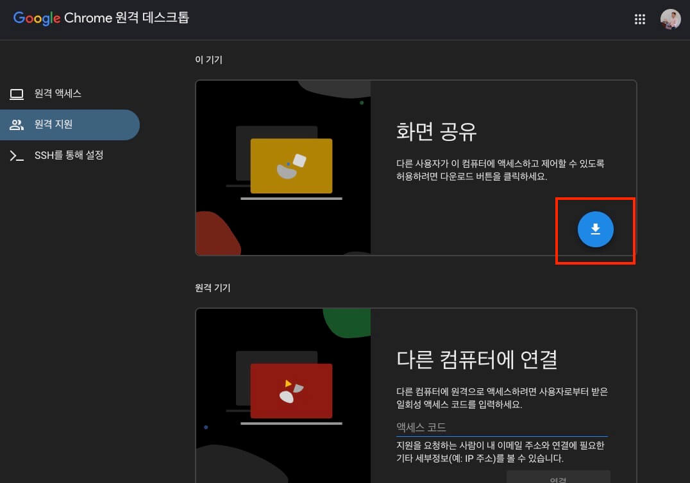
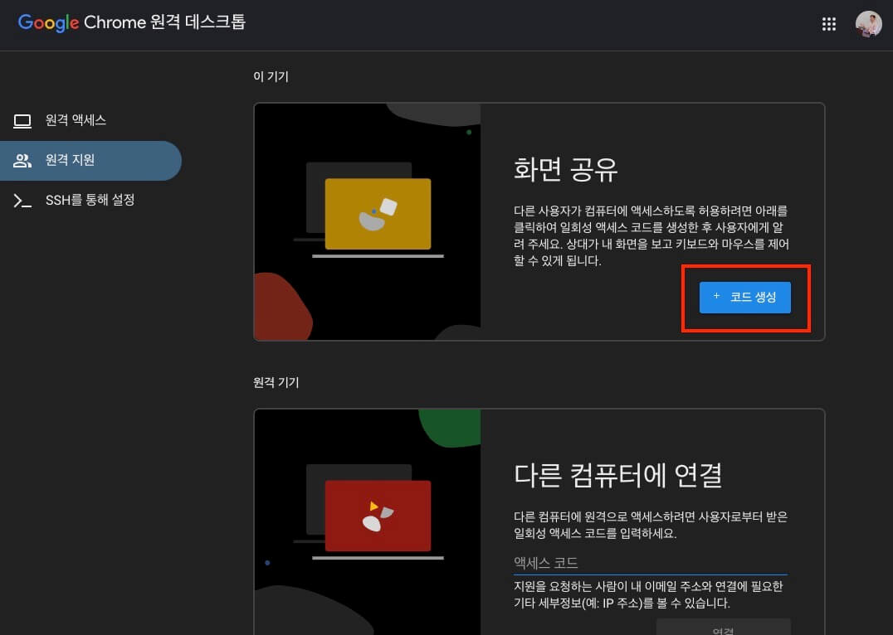
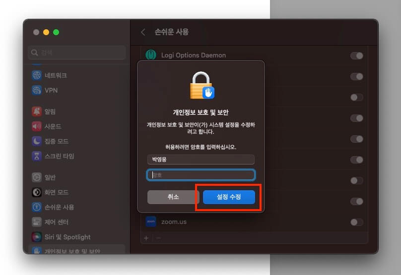
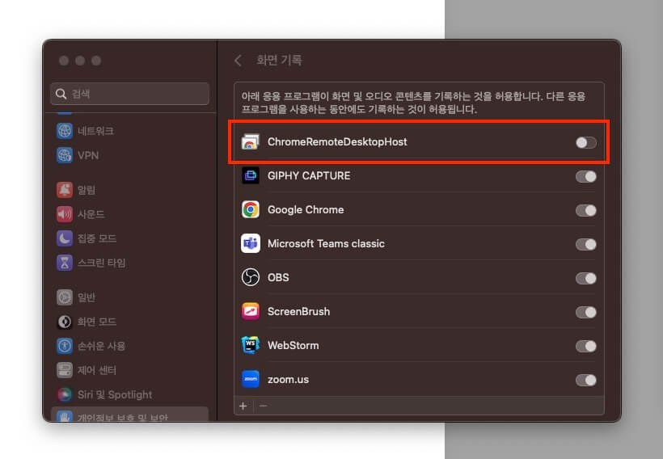
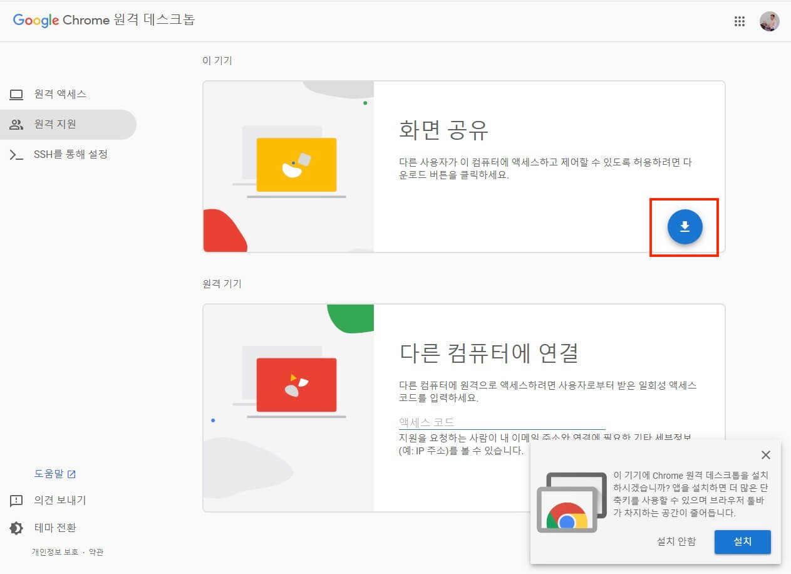
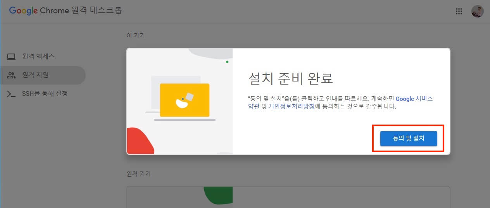
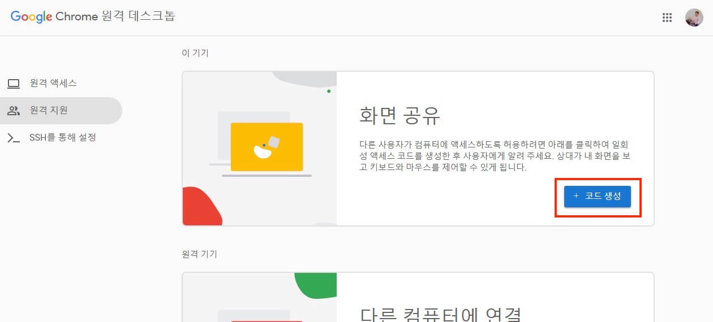

구글 크롬(Google Chrome) 원격 데스크톱을 통해 멘티(학생)의 화면을 멘토(강사)에게 공유하고 그 화면을 제어할 수 있습니다.
이하 내용과 같이 설치 및 환경 구성 등의 일부 과정이 필요하므로, 멘토링 사전에 준비하는 것을 추천합니다.

/// message-box --icon=warning --color=warning
사용자에 따라 일부 과정은 필요하지 않을 수 있습니다!
///

우선, 크롬 브라우저에서 **‘구글 크롬 원격 데스크톱’** 을 검색하고 첫 번째 링크로 접속합니다.
혹은 다음 주소로 접속합니다.
[https://remotedesktop.google.com/support/?hl=ko](https://remotedesktop.google.com/support/?hl=ko)

구글 로그인이 되지 않은 경우, 다음과 같은 화면이 표시됩니다.
**’내 화면 공유’** 버튼을 선택하고 구글 계정으로 로그인합니다.

---

## macOS 사용자 가이드

/// message-box --icon=warning --color=warning
Windows 사용자는 건너뛰세요!
///

구글 계정으로 로그인한 후,
‘화면 공유’ 영역에서 **‘다운로드’** 아이콘 버튼을 선택합니다.

새 창이 나타나면, 크롬 확장 프로그램으로 **Chrome Remote Desktop**을 추가합니다.
혹은 크롬 웹 스토어에서 직접 확장 프로그램을 추가할 수도 있습니다.

확장 프로그램 추가를 승인합니다.

확장 프로그램 추가가 완료되면, ‘다운로드’ 아이콘 버튼이 다음과 같이 **‘+ 코드 생성’** 버튼으로 바뀝니다. (혹은 새로고침이 필요할 수 있습니다)
**’+ 코드 생성’** 버튼을 선택합니다.

환경에 따라 시스템의 권한 부여가 필요할 수 있습니다. (필요하지 않은 경우도 있습니다)
macOS에서 권한 부여가 필요한 경우, 다음과 같이 권한 부여를 요청합니다.
**’접근성 환경설정 열기’** 버튼을 선택합니다.

**‘손쉬운 사용’** 에서 **RemoteAssistanceHost**를 활성화합니다.

그러면 수정을 위해 시스템 암호를 입력해야 합니다.
암호 입력 후 **‘설정 수정’** 버튼을 선택합니다.

수정이 완료되면, 다음과 같이 **‘다음’** 버튼이 활성화됩니다.

다음으로 **‘화면 기록’** 을 위한 권한을 요청할 수 있습니다.
역시 권한을 부여하기 위해 **‘시스템 설정 열기’** 버튼을 선택합니다.

**‘화면 기록’** 에서 **ChromeRemoteDesktopHost**를 활성화합니다.

활성화가 되면, 권한 부여의 **‘다음’** 버튼을 선택합니다.

마지막으로 **‘확인’** 버튼을 선택합니다.

모든 과정이 완료되면, 브라우저 화면으로 이동해서 **‘+ 코드 생성’** 버튼을 선택합니다.

다음과 같이 액세스 코드가 생성되면, 멘토(강사)에게 메신저나 문자 등으로 공유합니다.
생성한 액세스 코드는 생성 5분 후 만료되며, 멘토(강사)는 해당 액세스 코드로 5분 안에 접속해야 합니다.
혹시 액세스 코드가 만료되거나 문제가 생기면, 다시 생성해서 공유하세요.

---

## Windows 사용자 가이드

/// message-box --icon=warning --color=warning
macOS 사용자는 건너뛰세요!
///

구글 계정으로 로그인한 후,
‘화면 공유’ 영역에서 **‘다운로드’** 아이콘 버튼을 선택합니다.

프로그램을 다운로드하고 **‘동의 및 설치’** 버튼을 선택합니다.

파일 탐색기에서 다운로드한 파일을 찾아 실행합니다.

시스템 권한 허용을 물어보면, **‘예’** 버튼을 선택하세요.

프로그램 설치가 완료되면, 다시 브라우저 화면으로 이동해서 **‘+ 코드 생성’** 버튼을 선택합니다.

다음과 같이 액세스 코드가 생성되면, 멘토(강사)에게 메신저나 문자 등으로 공유합니다.
생성한 액세스 코드는 생성 5분 후 만료되며, 멘토(강사)는 해당 액세스 코드로 5분 안에 접속해야 합니다.
혹시 액세스 코드가 만료되거나 문제가 생기면, 다시 생성해서 공유하세요.

