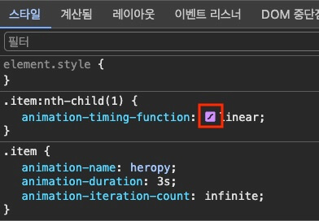

CSS Animation(애니메이션)은 여러 CSS 스타일 속성으로 요소의 크기, 색상, 모양 등을 제어해 애니메이션 효과를 부여하는 기술입니다.
자바스크립트를 사용하지 않고도 간단하게 요소에 동적 효과를 부여할 수 있기 때문에, 보다 좋은 성능으로 애니메이션을 구현할 수 있습니다.

## 전환 vs 애니메이션

CSS 전환(Transition)은 요소의 전후 상태를 부드럽게 변화시키는 효과를 제공하며, 단지 시작과 종료 상태만 고려하면 되기 때문에 간단하게 사용할 수 있습니다.
반면, 애니메이션(Animation)은 시작과 종료뿐만 아니라 중간 상태도 고려할 수 있으며, 더 복잡하고 다양한 효과를 추가할 수 있습니다.

<figure>
  <iframe height="520.9268798828125" style="width: 100%;" scrolling="no" title="Transition vs Animation" src="https://codepen.io/heropark/embed/QWRWmRr?default-tab=result&theme-id=dark" frameborder="no" loading="lazy" allowtransparency="true" allowfullscreen="true">
    See the Pen <a href="https://codepen.io/heropark/pen/QWRWmRr">
    Transition vs Animation</a> by park young woong (<a href="https://codepen.io/heropark">@heropark</a>)
    on <a href="https://codepen.io">CodePen</a>.
  </iframe>
  <figcaption>Transition vs Animation / 요소에 마우스를 올려보세요.</figcaption>
</figure>

## @keyframes

`@keyframes`는 '애니메이션 프레임'을 정의하는 CSS 규칙입니다.
`from`, `to` 키워드로 애니메이션의 시작과 종료 스타일 정의하거나, `0%`부터 `100%` 사이의 퍼센트 값으로 각 단계의 애니메이션을 정의할 수 있습니다.

```css
/* from-to */
@keyframes 애니메이션이름 {
  from {}
  to {}
}

/* percentage */
@keyframes 애니메이션이름 {
  0% {}
  50% {}
  100% {}
}
```

## animation

`animation`은 각 애니메이션 제어 속성의 단축 속성입니다.
애니메이션의 이름과 지속시간은 필수이며, 나머지 속성은 선택적으로 지정합니다.

```css
animation:  애니메이션이름  지속시간  대기시간?  타이밍함수?  반복횟수?  반복방향?  전후상태?  재생/정지?;
```

값 | 의미 | 기본값 
---|---|---
`animation-name` | `@keyframes`의 이름 | `none` 
`animation-duration` | 지속 시간 | `0s` 
`animation-delay` | 대기 시간 | `0s` 
`animation-timing-function` | 타이밍 함수 | `ease` 
`animation-iteration-count` | 반복 횟수 | `1` 
`animation-direction` | 반복 방향 | `normal` 
`animation-fill-mode` | 전후 상태 | `none` 
`animation-play-state` | 재생과 정지 | `running` 

### animation-name

사용할 `@keyframes` 규칙(애니메이션 프레임)의 이름(Name)을 지정합니다.

값 | 의미 | 기본값 
---|---|---
`none` | 애니메이션을 지정하지 않음 | `none` 
`@keyframes`이름 | 이름이 일치하는 `@keyframes`규칙의 애니메이션을 적용 |  

다음 예제에서 요소에 마우스를 올리면, `heropy`라는 이름의 애니메이션 프레임(요소의 너비가 `300px`에서 `500px`로 변화)을 적용합니다.
애니메이션 프레임이 실제 동작하려면, 몇 초 동안 지속되는지 같이 지정해야 합니다.

```css --line-active=3-4,7
.item:hover {
  /* animation: heropy 2s; */
  animation-name: heropy;
  animation-duration: 2s;
}

@keyframes heropy {
  0% { width: 300px; }
  100% { width: 500px; }
}
```

<figure>
  <iframe height="189.8870849609375" style="width: 100%;" scrolling="no" title="CSS animation-name" src="https://codepen.io/heropark/embed/poBMaWr?default-tab=result&theme-id=dark" frameborder="no" loading="lazy" allowtransparency="true" allowfullscreen="true">
    See the Pen <a href="https://codepen.io/heropark/pen/poBMaWr">
    CSS animation-name</a> by park young woong (<a href="https://codepen.io/heropark">@heropark</a>)
    on <a href="https://codepen.io">CodePen</a>.
  </iframe>
  <figcaption>요소에 마우스를 올려보세요.</figcaption>
</figure>

### animation-duration

애니메이션 프레임의 지속 시간(Duration)을 지정합니다.
지속 시간은 애니메이션이 시작하고 종료하는 데 걸리는 시간을 의미합니다.

값 | 의미 | 기본값 
---|---|---
시간 | 지속 시간을 설정 | `0s` 

```css --line-active=4,5
.item:hover {
  animation-name: heropy;
}
.item:nth-child(1):hover { animation-duration: 2s; }
.item:nth-child(2):hover { animation-duration: 8s; }

@keyframes heropy {
  0% { width: 300px; }
  100% { width: 500px; }
}
```


<figure>
  <iframe height="252.750732421875" style="width: 100%;" scrolling="no" title="CSS animation-duration" src="https://codepen.io/heropark/embed/rNbXdmg?default-tab=result&theme-id=dark" frameborder="no" loading="lazy" allowtransparency="true" allowfullscreen="true">
    See the Pen <a href="https://codepen.io/heropark/pen/rNbXdmg">
    CSS animation-duration</a> by park young woong (<a href="https://codepen.io/heropark">@heropark</a>)
    on <a href="https://codepen.io">CodePen</a>.
  </iframe>
  <figcaption>요소에 마우스를 올려보세요.</figcaption>
</figure>

만약 다음과 같이 `animation` 단축 속성을 사용하면, 기존의 속성을 덮어쓰며 애니메이션 프레임 이름이 누락되기 때문에 동작하지 않습니다.

```css --line-error=4,5
.item:hover {
  animation: heropy;
}
.item:nth-child(1):hover { animation: 2s; }
.item:nth-child(2):hover { animation: 8s; }
```

### animation-delay

애니메이션이 시작하기 전에 얼마나 기다릴 것인지의 대기 시간(Delay)을 설정합니다.
만약 음수 시간을 적용하면, 그 값만큼 애니메이션이 앞서 시작합니다.

값 | 의미 | 기본값 
---|---|---
시간 | 대기 시간을 설정 | `0s` 

```css
.item:hover {
  /* animation: heropy 2s; */
  animation-name: heropy;
  animation-duration: 2s;
}
.item:nth-child(1):hover { animation-delay: 0s; }
.item:nth-child(2):hover { animation-delay: 1s; }
.item:nth-child(3):hover { animation-delay: -1s; }

@keyframes heropy {
  0% { width: 300px; }
  100% { width: 500px; }
}
```

<figure>
  <iframe height="310.296142578125" style="width: 100%;" scrolling="no" title="CSS animation-delay" src="https://codepen.io/heropark/embed/MWRNVXR?default-tab=result&theme-id=dark" frameborder="no" loading="lazy" allowtransparency="true" allowfullscreen="true">
    See the Pen <a href="https://codepen.io/heropark/pen/MWRNVXR">
    CSS animation-delay</a> by park young woong (<a href="https://codepen.io/heropark">@heropark</a>)
    on <a href="https://codepen.io">CodePen</a>.
  </iframe>
  <figcaption>요소에 마우스를 올려보세요.</figcaption>
</figure>

### animation-timing-function

애니메이션에서 사용할 [타이밍 함수](https://easings.net/ko)를 지정합니다.

/// message-box --icon=info
타이밍 함수(Timing Function) 또는 이징 함수(Easing Function)는 애니메이션 시작부터 종료까지의 가속도와 감속도를 조정해 애니메이션의 진행 방식을 결정하는 기능입니다.
///

값 | 의미 | 기본값 | Cubic Bezier 값 
---|---|---|---
`linear` | 일정하게 |  | `cubic-bezier(0, 0, 1, 1)` 
`ease` | 빠르게 - 느리게 | `ease` | `cubic-bezier(0.25, 0.1, 0.25, 1)` 
`ease-in` | 느리게 - 빠르게 |  | `cubic-bezier(0.42, 0, 1, 1)` 
`ease-out` | 빠르게 - 느리게 |  | `cubic-bezier(0, 0, 0.58, 1)` 
`ease-in-out` | 느리게 - 빠르게 - 느리게 |  | `cubic-bezier(.42, 0, .58, 1)`
`cubic-bezier(n1, n2, n3, n4)` | 자신만의 값을 정의(`0`~<code>1</code>) |  |  
`steps(n, j?)` | `n`번 분할된 애니메이션 |  |  

```css
.item {
  /* animation: heropy 3s infinite; */
  animation-name: heropy;
  animation-duration: 3s;
  animation-iteration-count: infinite;
}
.item:nth-child(1) { animation-timing-function: linear; }
.item:nth-child(2) { animation-timing-function: ease; }
.item:nth-child(3) { animation-timing-function: ease-in; }
.item:nth-child(4) { animation-timing-function: ease-out; }
.item:nth-child(5) { animation-timing-function: ease-in-out; }
.item:nth-child(6) { animation-timing-function: cubic-bezier(0.83, 0, 0.5, 1.73); }
.item:nth-child(7) { animation-timing-function: steps(4); }

@keyframes heropy {
  0% { width: 300px; }
  100% { width: 500px; }
}
```

<iframe height="560.1094970703125" style="width: 100%;" scrolling="no" title="CSS animation-timing-function" src="https://codepen.io/heropark/embed/xxevWLb?default-tab=result&theme-id=dark" frameborder="no" loading="lazy" allowtransparency="true" allowfullscreen="true">
  See the Pen <a href="https://codepen.io/heropark/pen/xxevWLb">
  CSS animation-timing-function</a> by park young woong (<a href="https://codepen.io/heropark">@heropark</a>)
  on <a href="https://codepen.io">CodePen</a>.
</iframe>

#### cubic-bezier

CSS `cubic-bezier()` 함수는 두 개의 시작점과 두 개의 제어점으로 이루어진, [베지어 곡선](https://developer.mozilla.org/en-US/docs/Glossary/Bezier_curve)을 정의해 애니메이션의 타이밍과 속도를 제어합니다.

```css
cubic-bezier(n1, n2, n3, n4)
```

크롬 개발자 도구의 'cubic bezier 에디터'를 사용하면, 각 점의 값을 조정하며 애니메이션의 타이밍 함수를 시각적으로 확인할 수 있습니다.




#### steps

CSS `steps()` 함수는 애니메이션을 몇 단계로 나눌지 설정합니다.

```css
steps(단계, 점프타이밍?)
```

값 | 의미 | 기본값
---|---|---
`jump-start` or `start` | 시작(`0%`)을 건너뜀 | 
`jump-end` or `end` | 종료(`100%`)를 건너뜀 | `jump-end`
`jump-both` | 시작과 종료를 모두 건너뜀 | 
`jump-none` | 건너뛰지 않음 | 

다음 예제는 왼쪽에서 오른쪽으로 이동하는 애니메이션을 `steps()` 함수를 통해 5단계로 나눈 결과입니다.
각 점프 타이밍에 따라 시작과 종료 지점이 달라지는 것을 확인할 수 있습니다.

```css
.item {
  width: 150px;
  animation-name: heropy;
  animation-duration: 3s;
  animation-iteration-count: infinite;
}
.item:nth-child(1) { animation-timing-function: steps(5, jump-start); }
.item:nth-child(2) { animation-timing-function: steps(5, jump-end); } /* 기본값 */
.item:nth-child(3) { animation-timing-function: steps(5, jump-both); }
.item:nth-child(4) { animation-timing-function: steps(5, jump-none); }

@keyframes heropy {
  0% { transform: translateX(0px); }
  100% { transform: translateX(500px); }
}
```

<iframe height="397.1051025390625" style="width: 100%;" scrolling="no" title="CSS animation-timing-function" src="https://codepen.io/heropark/embed/qBGEBpw?default-tab=&theme-id=dark" frameborder="no" loading="lazy" allowtransparency="true" allowfullscreen="true">
  See the Pen <a href="https://codepen.io/heropark/pen/qBGEBpw">
  CSS animation-timing-function</a> by park young woong (<a href="https://codepen.io/heropark">@heropark</a>)
  on <a href="https://codepen.io">CodePen</a>.
</iframe>

### animation-iteration-count

애니메이션의 반복 횟수를 지정합니다.

값 | 의미 | 기본값 
---|---|---
숫자 | 반복 횟수를 설정 | `1` 
`infinite` | 무한 반복 |  

```css
.item:hover {
  /* animation: heropy 2s; */
  animation-name: heropy;
  animation-duration: 2s;
}
.item:nth-child(1):hover { animation-iteration-count: 1; }
.item:nth-child(2):hover { animation-iteration-count: 2; }
.item:nth-child(3):hover { animation-iteration-count: 3; }

@keyframes heropy {
  0% { width: 300px; }
  100% { width: 500px; }
}
```

<figure>
  <iframe height="309.9476318359375" style="width: 100%;" scrolling="no" title="CSS animation-iteration-count" src="https://codepen.io/heropark/embed/rNbXvzM?default-tab=result&theme-id=dark" frameborder="no" loading="lazy" allowtransparency="true" allowfullscreen="true">
    See the Pen <a href="https://codepen.io/heropark/pen/rNbXvzM">
    CSS animation-iteration-count</a> by park young woong (<a href="https://codepen.io/heropark">@heropark</a>)
    on <a href="https://codepen.io">CodePen</a>.
  </iframe>
  <figcaption>요소에 마우스를 올려보세요.</figcaption>
</figure>

### animation-direction

애니메이션의 반복의 방향을 지정합니다.
예를 들어 요소가 왼쪽에서 오른쪽으로 움직이는 애니메이션이 있다면, 요소가 왼쪽에서 오른쪽으로 움직이는 것이 '정방향' 동작이며, 반대로 요소가 오른쪽에서 왼쪽으로 움직이는 것은 '역방향' 동작입니다.
그리고 요소가 정방향과 역방향 모두 동작하는 것을 '왕복'이라고 하며, 왕복으로 애니매이션 하려면 `animation-iteration-count` 속성(반복 횟수)의 값이 `2` 이상이어야 합니다.

값 | 의미 | 기본값 
---|---|---
`normal` | 정방향만 반복 | `normal` 
`reverse` | 역방향만 반복 |  
`alternate` | 정방향 왕복 |  
`alternate-reverse` | 역방향 왕복 |  

```css
.item:hover {
  /* animation: heropy 2s 2; */
  animation-name: heropy;
  animation-duration: 2s;
  animation-iteration-count: 2;
}
.item:nth-child(1):hover { animation-direction: normal; }
.item:nth-child(2):hover { animation-direction: reverse; }
.item:nth-child(3):hover { animation-direction: alternate; }
.item:nth-child(4):hover { animation-direction: alternate-reverse; }

@keyframes heropy {
  0% { width: 300px; }
  100% { width: 500px; }
}
```

<figure>
  <iframe height="371.08837890625" style="width: 100%;" scrolling="no" title="CSS animation-direction" src="https://codepen.io/heropark/embed/dyLxejK?default-tab=result&theme-id=dark" frameborder="no" loading="lazy" allowtransparency="true" allowfullscreen="true">
    See the Pen <a href="https://codepen.io/heropark/pen/dyLxejK">
    CSS animation-direction</a> by park young woong (<a href="https://codepen.io/heropark">@heropark</a>)
    on <a href="https://codepen.io">CodePen</a>.
  </iframe>
  <figcaption>요소에 마우스를 올려보세요.</figcaption>
</figure>
      
### animation-fill-mode

애니메이션 전후의 요소 상태(스타일)를 지정합니다.
요소가 가진 기본 스타일과 적용된 애니메이션 스타일 중 어떤 스타일을 애니메이션 전후에 유지할 것인지 결정합니다.
애니메이션 스타일만 표시되길 원하는 경우, 기본 스타일을 무시하는 `both` 값을 지정합니다.

값 | 의미 | 기본값 
---|---|---
`none` | 기본 상태 -> 애니메이션 시작 -> 애니메이션 종료 -> 기본 상태 | `none` 
`forwards` | 기본 상태 -> 애니메이션 시작 -> 애니메이션 종료 |  
`backwards` | 애니메이션 시작 -> 애니메이션 종료 -> 기본 상태 |  
`both` | 애니메이션 시작 -> 애니메이션 종료 | 

```css
.item {
  /* animation: heropy 2s 1s; */
  animation-name: heropy;
  animation-duration: 2s;
  animation-delay: 1s;
}
.item:nth-child(1) { animation-fill-mode: none; }
.item:nth-child(2) { animation-fill-mode: forwards; }
.item:nth-child(3) { animation-fill-mode: backwards; }
.item:nth-child(4) { animation-fill-mode: both; }

@keyframes heropy {
  0% { transform: translateX(230px) rotate(0deg); }
  50% { transform: translateX(230px) rotate(360deg); }
  85% { transform: translateX(500px) rotate(360deg); }
  100% { transform: translateX(500px) rotate(360deg); }
}
```

<figure>
  <iframe height="467.7982177734375" style="width: 100%;" scrolling="no" title="CSS animation-fill-mode" src="https://codepen.io/heropark/embed/jORgKqV?default-tab=result&theme-id=dark" frameborder="no" loading="lazy" allowtransparency="true" allowfullscreen="true">
    See the Pen <a href="https://codepen.io/heropark/pen/jORgKqV">
    CSS animation-fill-mode</a> by park young woong (<a href="https://codepen.io/heropark">@heropark</a>)
    on <a href="https://codepen.io">CodePen</a>.
  </iframe>
  <figcaption>시작 버튼을 선택하면, 해당 애니메이션이 동작합니다.</figcaption>
</figure>

### animation-play-state

애니메이션 동작의 재생(Play)과 일시정지(Pause)를 지정합니다.

값 | 의미 | 기본값 
---|---|---
`running` | 애니메이션을 재생 | `running` 
`paused` | 애니메이션을 일시정지 |  

```css
.item {
  /* animation: heropy 2s infinite alternate; */
  animation-name: heropy;
  animation-duration: 2s;
  animation-iteration-count: infinite;
  animation-direction: alternate;
}
.item:nth-child(1) { /* animation-play-state: running; */ }
.item:nth-child(2) { animation-play-state: paused; }
.item:nth-child(1):hover { animation-play-state: paused; }
.item:nth-child(2):hover { animation-play-state: running; }

@keyframes heropy {
  0% { width: 300px; }
  100% { width: 500px; }
}
```

<figure>
  <iframe height="252.80126953125" style="width: 100%;" scrolling="no" title="CSS animation-play-state" src="https://codepen.io/heropark/embed/qBweMBR?default-tab=result&theme-id=dark" frameborder="no" loading="lazy" allowtransparency="true" allowfullscreen="true">
    See the Pen <a href="https://codepen.io/heropark/pen/qBweMBR">
    CSS animation-play-state</a> by park young woong (<a href="https://codepen.io/heropark">@heropark</a>)
    on <a href="https://codepen.io">CodePen</a>.
  </iframe>
  <figcaption>요소에 마우스를 올려보세요.</figcaption>
</figure>

## animation-composition

애니메이션 스타일을 어떻게 조합할지 지정합니다.

값 | 의미 | 기본값 
---|---|---
`replace` | 기본 스타일을 애니메이션 스타일로 대체 | `replace` 
`add` | 기본 스타일에 애니메이션 스타일을 더함 |  
`accumulate` | 기본 스타일과 애니메이션 스타일을 섞음 | 

다음 예제에서 요소는 기본적으로 가로 100, 세로 50 너비의 우측으로 50 이동하고 2배 크기입니다.
만약 `animation-composition` 속성의 값이 `replace`(기본값)인 경우, 기본 스타일이 애니메이션 스타일로 대체되어 우측으로 100 이동하고 2배 크기입니다.
값이 `add`인 경우, 기본 스타일에 애니메이션 스타일을 더해 우측으로 250(50+100*2) 이동하고 4(2+2)배 크기입니다.
값이 `accumulate`인 경우, 기본 스타일과 애니메이션 스타일을 섞어 우측으로 150(50+100) 이동하고 3배 크기입니다.

/// message-box --icon=info
값이 `accumulate`인 경우, 4배가 아닌 3배 크기(`scale(3)`)가 되는 이유, ['The mysterious case of using CSS animation-composition: accumulate on a scale transform'](https://www.bram.us/2023/12/18/the-mysterious-case-of-using-css-animation-composition-accumulate-on-a-scale-transform/)
///

```css
.item {
  width: 100px;
  height: 50px;
  /* animation: heropy 3s both; */
  animation-name: heropy;
  animation-duration: 3s;
  animation-fill-mode: both;
  transform: translateX(50px) scale(2);
  transform-origin: 0 0;
}
.item:nth-child(1) { animation-composition: replace; }
.item:nth-child(2) { animation-composition: add; }
.item:nth-child(3) { animation-composition: accumulate; }

@keyframes heropy {
  0% {
    transform: translateX(50px) scale(1);
  }
  100% {
    transform: translateX(100px) scale(2);
  }
}
```

<figure>
  <iframe height="643.94287109375" style="width: 100%;" scrolling="no" title="CSS animation-composition" src="https://codepen.io/heropark/embed/abxeezZ?default-tab=&theme-id=dark" frameborder="no" loading="lazy" allowtransparency="true" allowfullscreen="true">
    See the Pen <a href="https://codepen.io/heropark/pen/abxeezZ">
    CSS animation-composition</a> by park young woong (<a href="https://codepen.io/heropark">@heropark</a>)
    on <a href="https://codepen.io">CodePen</a>.
  </iframe>
  <figcaption>요소의 기본 스타일이 애니메이션 스타일과 조합된 결과 / 상단의 각 버튼을 선택해 보세요.</figcaption>
</figure>

`animation-composition` 속성은 크롬 브라우저 기준, 112 버전부터 사용 가능합니다.


## 애니메이션 예제

### Simple Spinner

```html
<style>
.hloader {
  --hloader-color: #e96900;
  --hloader-size: 80px;
  --hloader-weight: 8px;
  --hloader-duration: 1s;
  width: var(--hloader-size);
  height: var(--hloader-size);
  color: var(--hloader-color);
  border: var(--hloader-weight) solid;
  border-top-color: transparent;
  border-radius: 50%;
  animation: hloader var(--hloader-duration) infinite linear;
}
@keyframes hloader {
  0% { transform: rotate(0deg); }
  100% { transform: rotate(360deg); }
}
</style>
<div class="hloader"></div>
```

<iframe height="246.520751953125" style="width: 100%;" scrolling="no" title="Simple Loader" src="https://codepen.io/heropark/embed/jOKLPmL?default-tab=&theme-id=dark" frameborder="no" loading="lazy" allowtransparency="true" allowfullscreen="true">
  See the Pen <a href="https://codepen.io/heropark/pen/jOKLPmL">
  Simple Loader</a> by park young woong (<a href="https://codepen.io/heropark">@heropark</a>)
  on <a href="https://codepen.io">CodePen</a>.
</iframe>

### Spinner

```html
<style>
.hloader {
  --hloader-color: #e96900;
  --hloader-size: 100px;
  --hloader-weight: 4;
  --hloader-duration: 1.5s;
  width: var(--hloader-size);
  height: var(--hloader-size);
  color: var(--hloader-color);
}
.hloader svg {
  animation: hloader-svg var(--hloader-duration) linear infinite;
}
.hloader circle {
  animation: hloader-circle var(--hloader-duration) linear infinite;
  fill: transparent;
  stroke-width: var(--hloader-weight);
  stroke-dasharray: 80, 200;
  stroke-dashoffset: 0px;
  stroke: currentColor;
}
@keyframes hloader-svg {
  100% { transform: rotate(1turn); }
}
@keyframes hloader-circle { 
  0% { stroke-dasharray: 1, 200; stroke-dashoffset: 0px; } 
  50% { stroke-dasharray: 100, 200; stroke-dashoffset: -15px; } 
  100% { stroke-dasharray: 100, 200; stroke-dashoffset: -124px; }
}
</style>
<div class="hloader">
  <svg viewBox="22.857142857142858 22.857142857142858 45.714285714285715 45.714285714285715">
    <circle cx="45.714285714285715" cy="45.714285714285715" r="20" stroke-width="5.714285714285714" stroke-dasharray="125.664" stroke-dashoffset="125.66370614359172px"></circle>
  </svg>
</div>
```

<iframe height="229.656005859375" style="width: 100%;" scrolling="no" title="Loader no-js" src="https://codepen.io/heropark/embed/YzLMQor?default-tab=&theme-id=dark" frameborder="no" loading="lazy" allowtransparency="true" allowfullscreen="true">
  See the Pen <a href="https://codepen.io/heropark/pen/YzLMQor">
  Loader no-js</a> by park young woong (<a href="https://codepen.io/heropark">@heropark</a>)
  on <a href="https://codepen.io">CodePen</a>.
</iframe>

### Skeleton Loader

```html
<style>
.hskeleton {
  background-color: #222;
  border-radius: 4px;
  position: relative;
  overflow: hidden;
}
.hskeleton::after {
  content: "";
  width: 100%;
  height: 100%;
  position: absolute;
  top: 0;
  left: 0;
  background-image: linear-gradient(270deg, 
    rgba(255,255,255,0), 
    rgba(255,255,255,.1), 
    rgba(255,255,255,0)
  );
  transform: translateX(-100%);
  animation: hskeleton-loader 2s infinite;
}
@keyframes hskeleton-loader {
  0% { transform: translateX(-100%); }
  100% { transform: translateX(100%); }
}
</style>
<div class="hskeleton"></div>
```

<iframe height="549.761962890625" style="width: 100%;" scrolling="no" title="Untitled" src="https://codepen.io/heropark/embed/NWzmwNV?default-tab=&theme-id=dark" frameborder="no" loading="lazy" allowtransparency="true" allowfullscreen="true">
  See the Pen <a href="https://codepen.io/heropark/pen/NWzmwNV">
  Untitled</a> by park young woong (<a href="https://codepen.io/heropark">@heropark</a>)
  on <a href="https://codepen.io">CodePen</a>.
</iframe>
