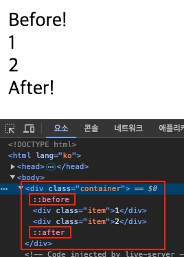

CSS의 `::before`와 `::after` 가상 요소 선택자(Pseudo Elements Selector)는 HTML의 특정 요소 안에 CSS로 내용을 추가할 수 있습니다.
HTML 구조를 변경하지 않고도 시각적 요소를 추가하거나 변경할 수 있어, 더욱 동적이고 세련된 웹 페이지를 만들 수 있습니다.

## 기본 구조

특정 HTML 요소의 내용 가장 앞(Before)이나 가장 뒤(After)에 새로운 내용(Content)을 CSS `content` 속성으로 삽입할 수 있습니다.
따라서 `content` 속성은 필수로 지정해야 합니다.

```css
선택자::before {
  content: "";
}
선택자::after {
  content: "";
}
```

요소의 모든 하위 노드(Node)는 내용(Content)이라고 부를 수 있습니다.
다음 예제에서, `.item`을 포함한 `.container` 요소 안에 있는 모든 것은 내용입니다.
CSS `::before`와 `::after`를 사용해, 대상(`.container`) 내용의 가장 앞에는 `Before!` 내용을, 가장 뒤에는 `After!` 내용을 추가합니다.

/// message-box --icon=info
HTML에서 노드(Node)는 요소(Element), 텍스트(Text), 주석(Comment) 등 구분 가능한 최소 단위를 의미합니다.
///

```html
<div class="container">
  <div class="item">1</div>
  <div class="item">2</div>
</div>
```

```css
.container::before {
  content: "Before!";
}
.container::after {
  content: "After!";
}
```

브라우저 개발자 도구의 요소(Elements) 탭에서 가상 요소의 위치를 확인할 수 있습니다.



## 주요 특징

`::before`와 `::after` 선택자의 몇 가지 중요한 특징을 살펴봅시다.

- `content` 속성을 필수로 지정해야 합니다.
- 인라인 요소(`inline`)로 생성되며, 필요에 따라 `display` 속성으로 특성(`block`, `inline-block` 등)을 변경할 수 있습니다.
- 실제 HTML 구조에 존재하지 않으므로 구조적으로 중요한 정보를 포함하지 않아야 합니다.
- 다양한 CSS(크기, 색상, 위치, 애니메이션 등)를 지정할 수 있습니다.
- HTML 구조를 수정하지 않아도 추가적인 시각 요소를 표시할 수 있습니다.
- CSS2에서는 `:before`와 같이 단일 콜론을 사용했지만, CSS3부터는 가상 클래스 선택자(Pseudo Class Selector)와 구분하기 위해 `::before`와 같이 이중 콜론을 사용합니다.

## 사용 예시

Before, After 가상 요소 선택자는 CSS에서 요소를 추가할 수 있어 매우 유용합니다.
다음의 예제들을 통해 실제로 어떻게 선택자를 활용할 수 있는지 살펴봅시다.

### 인용문 따옴표
   
`<blockquote>` 태그를 통해 인용문을 표현할 때, 자동으로 큰따옴표를 추가할 수 있습니다.

<figure>
  <iframe height="174.86553955078125" style="width: 100%;" scrolling="no" title="CSS Before/AfterQuotes" src="https://codepen.io/heropark/embed/NWQKjXQ?default-tab=&theme-id=dark" frameborder="no" loading="lazy" allowtransparency="true" allowfullscreen="true">
    See the Pen <a href="https://codepen.io/heropark/pen/NWQKjXQ">
    CSS Before/AfterQuotes</a> by park young woong (<a href="https://codepen.io/heropark">@heropark</a>)
    on <a href="https://codepen.io">CodePen</a>.
  </iframe>
</figure>

```html
<blockquote>삶이 있는 한 희망은 있다 - 키케로</blockquote>
```

`\201C`, `\201D` 유니코드는 큰따옴표를 의미합니다.
`content` 속성의 값은 큰따옴표(`""`)로 작성하므로, 큰따옴표 문자를 표현하기 위해 유니코드를 사용합니다.

/// message-box --icon=info
유니코드(Unicode)는 모든 문자를 다루도록 설계된 표준 문자 인코딩 방식으로, 모든 문자와 기호에 고유한 숫자 코드를 할당하여 표현합니다.
///

```css
blockquote {
  margin: 0;
  font-size: 30px;
}
blockquote::before,
blockquote::after {
  font-size: 3em;
  line-height: 0.1em;
  vertical-align: -0.5em;
  font-family: sans-serif;
}
blockquote::before {
  content: "\201C";
  margin-right: 0.1em;
}
blockquote::after {
  content: "\201D";
  margin-left: 0.1em;
}
```

### 간단한 툴팁
   
마우스 포인터를 특정 요소에 올리면(Hover) 툴팁이 표시되는 예시입니다.

<figure>
  <iframe height="222.99725341796875" style="width: 100%;" scrolling="no" title="Untitled" src="https://codepen.io/heropark/embed/LYwPyjO?default-tab=&theme-id=dark" frameborder="no" loading="lazy" allowtransparency="true" allowfullscreen="true">
    See the Pen <a href="https://codepen.io/heropark/pen/LYwPyjO">
    Untitled</a> by park young woong (<a href="https://codepen.io/heropark">@heropark</a>)
    on <a href="https://codepen.io">CodePen</a>.
  </iframe>
</figure>

`data-tooltip` 속성에 툴팁으로 표시될 문구를 추가합니다.
그리고 `data-tooltip-방향` 속성을 추가해 툴팁이 표시될 방향을 지정합니다.
HTML의 `data-*` 속성은 요소에 간단한 데이터를 저장하는 용도로, CSS나 JavaScript에서 활용할 수 있습니다.

```html
<div class="btns">
  <button data-tooltip="검색 결과를 표시합니다." data-tooltip-bottom>
    <span class="material-symbols-outlined">search</span>
    <span class="material-symbols-outlined">keyboard_arrow_down</span>
  </button>
  <button data-tooltip="검색 결과를 표시합니다." data-tooltip-top>
    <span class="material-symbols-outlined">search</span>
    <span class="material-symbols-outlined">keyboard_arrow_up</span>
  </button>
  <button data-tooltip="검색 결과를 표시합니다." data-tooltip-right>
    <span class="material-symbols-outlined">search</span>
    <span class="material-symbols-outlined">keyboard_arrow_right</span>
  </button>
  <button data-tooltip="검색 결과를 표시합니다." data-tooltip-left>
    <span class="material-symbols-outlined">search</span>
    <span class="material-symbols-outlined">keyboard_arrow_left</span>
  </button>
</div>
```

CSS `attr()` 함수를 사용해 해당 요소에 추가한 속성의 값을 얻을 수 있습니다.
CSS `calc()` 함수를 사용해 해당 요소의 크기와 상관없이 툴팁이 정상적으로 표시될 수 있도록 위치를 계산합니다.

/// message-box --icon=info
`[data-tooltip]`과 같이 작성하는 속성 선택자(Attribute Selector)는 해당 속성이 있는 요소를 선택합니다.
///

```css --line-active=33,41
.btns {
  display: flex;
  gap: 20px;
}
button {
  width: max-content;
  height: 40px;
  padding: 0 12px;
  border: none;
  outline: none;
  border-radius: 6px;
  background-color: royalblue;
  color: #fff;
  font-size: 16px;
  cursor: pointer;
  display: flex;
  justify-content: center;
  align-items: center;
  position: relative;
  user-select: none;
}
button:hover {
  filter: brightness(1.1);
}
[data-tooltip] {
  position: relative;
}
[data-tooltip]:hover {
  z-index: 1;
}
[data-tooltip]::after {
  --gap: 6px; /* 요소와 툴팁의 간격 */
  content: attr(data-tooltip);
  padding: 6px 10px;
  border-radius: 4px;
  background-color: rgba(0,0,0,0.7);
  color: #fff;
  font-size: 12px;
  white-space: nowrap;
  position: absolute;
  top: calc(100% + var(--gap)); /* 기본 방향 Bottom 지정 */
  left: 50%;
  transition: opacity 0.3s;
  transform: translateX(-50%);
  opacity: 0;
  visibility: hidden;
}
[data-tooltip]:hover::after {
  opacity: 1;
  visibility: visible;
}
/* TOP */
[data-tooltip][data-tooltip-top]::after {
  top: initial;
  bottom: calc(100% + var(--gap));
  left: 50%;
  right: initial;
  transform: translateX(-50%);
}
/* BOTTOM */
[data-tooltip][data-tooltip-bottom]::after {
  top: calc(100% + var(--gap));
  bottom: initial;
  left: 50%;
  right: initial;
  transform: translateX(-50%);
}
/* RIGHT */
[data-tooltip][data-tooltip-right]::after {
  top: 50%;
  bottom: initial;
  left: calc(100% + var(--gap));
  right: initial;
  transform: translateY(-50%);
}
/* LEFT */
[data-tooltip][data-tooltip-left]::after {
  top: 50%;
  bottom: initial;
  left: initial;
  right: calc(100% + var(--gap));
  transform: translateY(-50%);
}
```

### 번호 매기기

특정 요소에 순서대로 번호를 매기는 예시입니다.
`counter-reset`, `counter-increment` 속성 그리고 `counter()` 함수를 사용하여 번호를 매길 수 있습니다.

<figure>
  <iframe height="816.4964599609375" style="width: 100%;" scrolling="no" title="CSS Before/After Counter( )" src="https://codepen.io/heropark/embed/ZEdgBWO?default-tab=&theme-id=dark" frameborder="no" loading="lazy" allowtransparency="true" allowfullscreen="true">
    See the Pen <a href="https://codepen.io/heropark/pen/ZEdgBWO">
    CSS Before/After Counter( )</a> by park young woong (<a href="https://codepen.io/heropark">@heropark</a>)
    on <a href="https://codepen.io">CodePen</a>.
  </iframe>
</figure>

각 섹션은 순서대로 나열되어 있고 `<h2>` 태그로 제목을 포함하고 있습니다.
직접 숫자를 입력할 수 있지만, 만약 순서가 변경되면 순서에 맞게 숫자를 다시 입력해야 합니다.
HTML에서 직접 숫자를 입력하지 않고 CSS에서 카운터를 사용하여 자동으로 번호를 매길 수 있습니다.

```html
<main>
  <section>
    <h2>요구 사항 분석</h2>
    <p>프로젝트의 목표와 필요 기능을 정의하고, 사용자의 요구를 수집하여 명확한 요구 사항을 설정합니다.</p>
  </section>
  <section>
    <h2>설계 단계</h2>
    <p>UI/UX 디자인을 포함하여 시스템 구조와 데이터 흐름을 설계합니다. 프로토타입을 제작하여 초기 아이디어를 시각화합니다.</p>
  </section>
  <section>
    <h2>개발 단계</h2>
    <p>프론트엔드와 백엔드 개발을 수행하며, 코드를 작성하고 기능을 구현합니다. 이 단계에서 테스트도 함께 진행됩니다.</p>
  </section>
  <section>
    <h2>테스트 단계</h2>
    <p>개발된 웹 애플리케이션의 기능을 검증하고, 버그를 수정하는 작업을 진행합니다. 사용자 테스트를 통해 피드백을 받습니다.</p>
  </section>
  <section>
    <h2>배포 및 유지보수</h2>
    <p>완성된 웹 애플리케이션을 서버에 배포하고, 사용자 피드백에 따라 지속적으로 업데이트 및 유지보수를 진행합니다.</p>
  </section>
</main>
```

CSS `counter-reset` 속성을 통해 `section`이라는 이름으로 카운터를 초기화합니다. 
이때 모든 카운터 요소를 포함하는 상위 요소에서 초기화해야 합니다.
그리고 카운터 요소(`h2::before`)가 출력될 때마다 `counter-increment` 속성을 통해 숫자를 하나씩 증가시킵니다.
이후 `counter()` 함수를 사용하여 현재 카운터 값을 가져올 수 있습니다.
다음 예제에서는 `)` 기호와 조합하여 각 섹션마다 번호를 표시합니다.

```css --line-active=2,17,18
main {
  counter-reset: section;
  width: 500px;
  margin: 20px;
  padding: 10px;
  border: 10px solid;
}
section {
  padding: 20px;
}
section h2 {
  font-size: 30px;
  font-weight: 700;
  margin-bottom: 14px;
}
section h2::before {
  counter-increment: section;
  content: counter(section) ")";
  margin-right: 0.3em;
  font-family: monospace;
}
section p {
  line-height: 1.4;
}
```

### 커스텀 불릿

불릿(Bullet)은 목록의 각 항목 앞에 표시되는 기호나 모양을 의미하고, 가상 요소 선택자를 통해 원하는 모양으로 변경할 수 있습니다.

<figure>
  <iframe height="634.7039184570312" style="width: 100%;" scrolling="no" title="CSS Before/After Custom Bullets" src="https://codepen.io/heropark/embed/poMzPvM?default-tab=result&theme-id=dark" frameborder="no" loading="lazy" allowtransparency="true" allowfullscreen="true">
    See the Pen <a href="https://codepen.io/heropark/pen/poMzPvM">
    CSS Before/After Custom Bullets</a> by park young woong (<a href="https://codepen.io/heropark">@heropark</a>)
    on <a href="https://codepen.io">CodePen</a>.
  </iframe>
</figure>

목록 태그에서는 `list-style-type` 속성을 사용해 불릿을 지정할 수도 있지만, 가상 요소를 사용하면 다음과 같이 이모지나 이미지 등을 활용해 별도의 스타일을 지정할 수 있습니다.

```html
<ul class="default">
  <li>Apple</li>
  <li>Banana</li>
  <li>Cherry</li>
  <li>Lemon</li>
</ul>
<ul class="attribute">
  <li data-emoji="🍎">Apple</li>
  <li data-emoji="🍌">Banana</li>
  <li data-emoji="🍒">Cherry</li>
  <li data-emoji="🍋">Lemon</li>
</ul>
<ul class="image">
  <li>Apple</li>
  <li>Banana</li>
  <li>Cherry</li>
  <li>Lemon</li>
</ul>
```

`url()` 함수를 `content` 속성에서 사용하면 이미지가 추가되긴 하지만, 크기를 조절할 수 없습니다.
그래서 이미지를 가상 요소의 배경으로 지정하여 크기를 조절할 수 있도록 합니다.

`em` 단위를 사용하는 것이 요소의 글자 크기에 맞춰 불릿의 크기도 변경되므로 효과적입니다.

```css
body {
  padding: 20px;
}
ul {
  list-style: none;
  padding-left: 0.2em;
}
li {
  position: relative;
  padding-left: 0.6em;
  font-size: 30px;
}
/* default */
ul.default li::before {
  content: "";
  width: 0.2em;
  height: 0.2em;
  background-color: red;
  position: absolute;
  left: 0;
  top: 50%;
  transform: translateY(-50%);
}
/* attribute / attr() */
ul.attribute li::before {
  content: attr(data-emoji);
  font-size: 0.6em;
  position: absolute;
  left: -0.4em;
  top: 50%;
  transform: translateY(-50%);
}
/* image / url() */
ul.image li::before {
  --size: 0.7em;
  content: "";
  width: var(--size);
  height: var(--size);
  background-image: url(https://heropy.dev/favicon.png);
  background-size: cover;
  position: absolute;
  left: -0.3em;
  top: 50%;
  transform: translateY(-50%);
}
```

### 도형 추가

가상 요소를 사용하면 기본적인 사각형에서 벗어나 좀 더 복잡한 도형을 만들 수 있습니다.

<figure>
  <iframe height="338.9632568359375" style="width: 100%;" scrolling="no" title="Untitled" src="https://codepen.io/heropark/embed/MWNgJWm?default-tab=&theme-id=dark" frameborder="no" loading="lazy" allowtransparency="true" allowfullscreen="true">
    See the Pen <a href="https://codepen.io/heropark/pen/MWNgJWm">
    Untitled</a> by park young woong (<a href="https://codepen.io/heropark">@heropark</a>)
    on <a href="https://codepen.io">CodePen</a>.
  </iframe>
</figure>

```html
<div class="shapes">
  <div class="shape shape--large">L</div>
  <div class="shape shape--medium">M</div>
  <div class="shape shape--small">S</div>
</div>
```

CSS 변수(Variable)를 사용하면 각 요소의 크기나 색상 등을 쉽게 변경하거나 계산할 수 있습니다.
각 방향의 테두리선이 대각선으로 연결된다는 특성을 활용해 `border` 속성으로 삼각형을 만들 수 있습니다.

```css
.shapes {
  display: flex;
  flex-direction: column;
  gap: 20px;
}
.shape {
  --width: 90px;
  --height: 60px;
  --font-size: 30px;
  --color: white;
  --background-color: red;
  width: var(--width);
  height: var(--height);
  font-size: var(--font-size);
  font-weight: 700;
  line-height: 1;
  color: var(--color);
  background: var(--background-color);
  position: relative;
  display: flex;
  justify-content: center;
  align-items: center;
}
.shape--medium {
  --width: 60px;
  --height: 40px;
  --font-size: 20px;
  --background-color: orange;
}
.shape--small { 
  --width: 30px;
  --height: 20px;
  --font-size: 10px;
  --background-color: green;
}
.shape::before {
  --size: calc(var(--height) / 2);
  content: "";
  position: absolute;
  top: 0;
  right: calc(var(--size) * -1);
  /* 삼각형 만들기 */
  width: 0;
  height: 0;
  border-left: var(--size) solid var(--background-color);
  border-top: var(--size) solid transparent;
  border-bottom: var(--size) solid transparent;
}
```

### 활성화 장식

여러 탭 메뉴 중에 활성화(Active)된 탭을 표시하는 예시입니다.
활성화된 탭에 밑줄 장식을 표시하려고 하는데, 이를 가상 요소로 추가하면 구조를 변경하지 않고도 스타일을 추가할 수 있습니다.
물론 밑줄이 아닌 다른 모양의 장식을 추가할 수도 있습니다!

<figure>
  <iframe height="212.42138671875" style="width: 100%;" scrolling="no" title="CSS Before/After Tabs" src="https://codepen.io/heropark/embed/VwJojOa?default-tab=&theme-id=dark" frameborder="no" loading="lazy" allowtransparency="true" allowfullscreen="true">
    See the Pen <a href="https://codepen.io/heropark/pen/VwJojOa">
    CSS Before/After Tabs</a> by park young woong (<a href="https://codepen.io/heropark">@heropark</a>)
    on <a href="https://codepen.io">CodePen</a>.
  </iframe>
</figure>

활성화된 탭은 `active` 클래스를 가집니다.
각 탭(`li`)에 마우스를 올리면 가상 요소에 스타일이 적용되도록(표시되도록) 선택자를 조합(`li:hover::after`)합니다.
만약 `li::after:hover`로 작성하면 탭 요소가 아닌 가상 요소에 마우스를 올렸을 때 스타일을 적용하는 의미가 되므로 제대로 작동하지 않습니다.

```html
<ul class="tabs">
  <li class="active">홈</li>
  <li>게시글</li>
  <li>포트폴리오</li>
  <li>문의</li>
</ul>
```

```css
.tabs {
  display: flex;
  list-style-type: none;
  padding: 0;
  margin: 0;
}
.tabs li {
  padding: 14px 20px;
  color: #333;
  font-size: 18px;
  line-height: 1;
  background-color: #f8f8f8;
  position: relative;
  transition: color 0.3s ease;
  cursor: pointer;
}
.tabs li.active {
  color: royalblue;
}
.tabs li::after {
  content: "";
  position: absolute;
  bottom: 0;
  left: 0;
  width: 0;
  height: 2px;
  background-color: royalblue;
  transition: 0.3s;
  opacity: 0;
}
.tabs li:hover::after {
  width: 100%;
  opacity: 0.5;
}
.tabs li.active::after {
  width: 100%;
  opacity: 1;
}
```

각 탭을 선택했을 때 활성화되도록 하려면 간단한 JavaScript 코드가 필요합니다.
선택한 탭 요소에만 `active` 클래스를 추가하고 나머지 탭 요소에서는 제거합니다.

```js
const tabsEl = document.querySelector('.tabs')
const tabEls = tabsEl.querySelectorAll('li')

tabsEl.addEventListener('click', event => {
  if (event.target.closest('li')) {
    tabEls.forEach(el => el.classList.remove('active'))
    event.target.classList.add('active')
  }
})
```

### 반응형 레이아웃
   
JavaScript를 사용하지 않고도 가상 요소의 `content` 속성을 활용하여 뷰포트(Viewport) 크기에 따라 다른 텍스트를 추가할 수 있습니다.

<figure>
  <iframe height="146.39898681640625" style="width: 100%;" scrolling="no" title="Untitled" src="https://codepen.io/heropark/embed/rNXBwxY?default-tab=result&theme-id=dark" frameborder="no" loading="lazy" allowtransparency="true" allowfullscreen="true">
    See the Pen <a href="https://codepen.io/heropark/pen/rNXBwxY">
    Untitled</a> by park young woong (<a href="https://codepen.io/heropark">@heropark</a>)
    on <a href="https://codepen.io">CodePen</a>.
  </iframe>
</figure>

```css
body::after {
  content: "Desktop";
  color: red;
}
@media (max-width: 992px) {
  body::after {
    content: "Tablet";
    color: royalblue;
  }
}
@media (max-width: 576px) {
  body::after {
    content: "Mobile";
    color: green;
  }
}
```

### 그라디언트 테두리선

단일 색상의 테두리선이 아닌, 색이 자연스럽게 흐르는 그라디언트 테두리선을 추가할 수 있습니다.
물론 정확히 말하면, 선이 아니라 선처럼 보이는 착시 효과입니다.

<figure>
  <iframe height="210.32977294921875" style="width: 100%;" scrolling="no" title="CSS Before/After Gradient Outline" src="https://codepen.io/heropark/embed/oNKvWQd?default-tab=&theme-id=dark" frameborder="no" loading="lazy" allowtransparency="true" allowfullscreen="true">
    See the Pen <a href="https://codepen.io/heropark/pen/oNKvWQd">
    CSS Before/After Gradient Outline</a> by park young woong (<a href="https://codepen.io/heropark">@heropark</a>)
    on <a href="https://codepen.io">CodePen</a>.
  </iframe>
</figure>

```html
<button>Hello World</button>
```

버튼의 크기보다 약간 더 큰 크기의 가상 요소를 만들어 가운데 배치하고, `linear-gradient()` 함수로 그라디언트 효과를 적용합니다.
CSS 그라디언트 효과는 요소의 배경 색상이 아닌 배경 이미지로 지정해야 합니다.
따라서 그라디언트에는 직접적인 전환 효과(Transition)를 사용할 수 없습니다.

```css --line-active=21
body {
  --background-color: white;
  background-color: var(--background-color);
}
button {
  width: max-content;
  padding: 0.5em 1em;
  border: none;
  outline: none;
  border-radius: 999px;
  background-color: var(--background-color);
  font-size: 30px;
  font-weight: 700;
  color: navy;
  position: relative;
  display: flex;
  justify-content: center;
  align-items: center;
}
button::after {
  --border-width: 10px;
  content: "";
  width: calc(100% + var(--border-width));
  height: calc(100% + var(--border-width));
  border-radius: 999px;
  background-image: linear-gradient(to bottom right, red, blue);
  position: absolute;
  z-index: -1;
}
```
