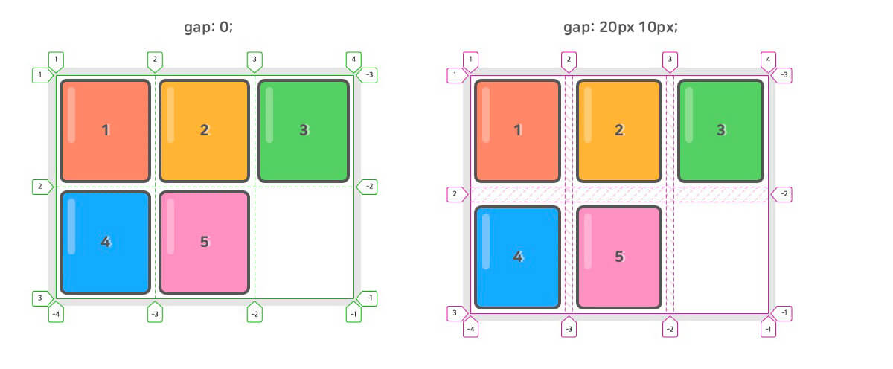
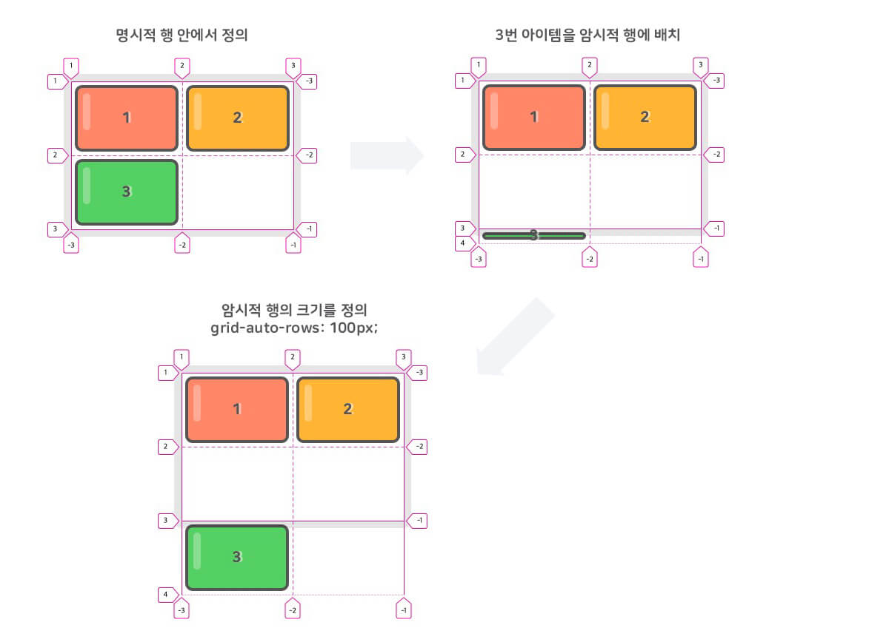
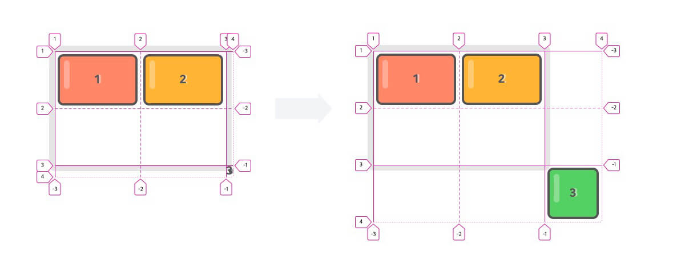
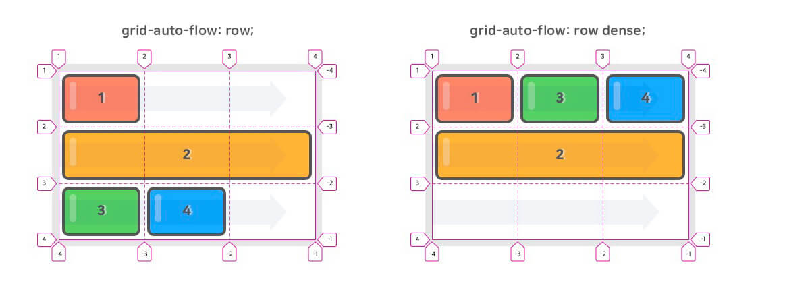
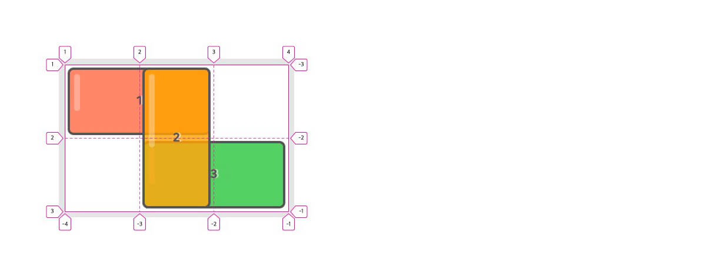
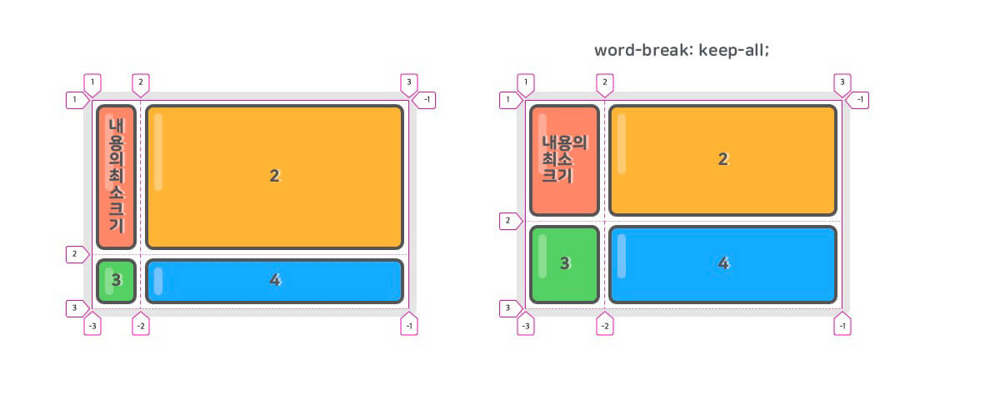
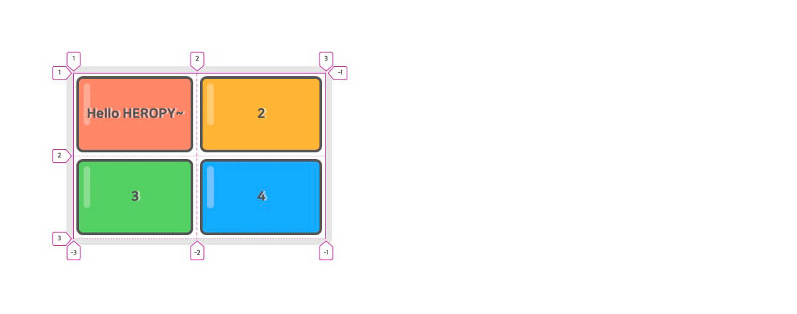
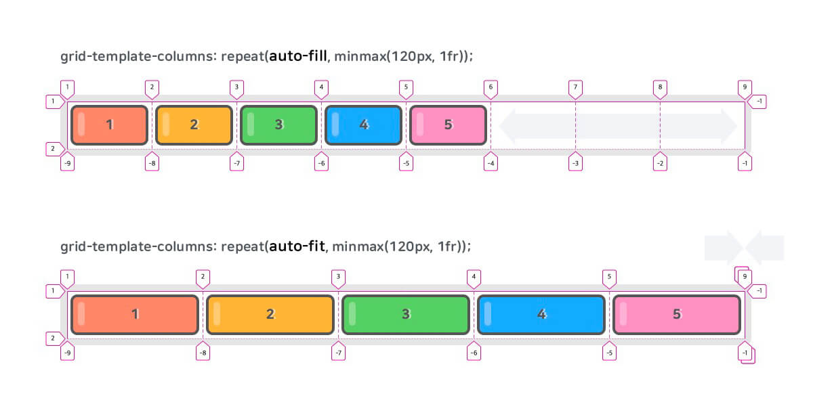

# CSS Grid 완벽 가이드

CSS Grid(그리드)는 2차원(행과 열)의 레이아웃 시스템을 제공합니다.
Flexible Box도 훌륭하지만 비교적 단순한 1차원 레이아웃을 위하며, 좀 더 복잡한 레이아웃을 위해 우리는 CSS Grid를 사용할 수 있습니다.

> CSS Grid는 예전부터 핵(Hack)으로 불린 다양한 레이아웃 대체 방식들을 해결하기 위해 만들어진 특별한 CSS 모듈입니다.

개발자 도구를 열고 요소를 검색해 표시된 `grid` 버튼을 선택합니다.


CSS Grid를 처음 시작하시는 분들을 위해 간단한 테스트 영상을 준비했습니다.

<div style="position: relative; padding-bottom: 56.25%; height: 0; margin-bottom: 50px;">
<iframe style="position: absolute; top: 0; left: 0; width: 100%; height: 100%;" src="https://www.youtube.com/embed/b0aSTppYUFE" frameborder="0" allow="accelerometer; autoplay; encrypted-media; gyroscope; picture-in-picture" allowfullscreen></iframe>
</div>

다음은 위 영상과 이하 예제들에서 사용한 샘플 코드입니다.
[SCSS](https://heropy.blog/2018/01/31/sass/)로 작성되어 있지만, CSS 문법을 포함할 수 있음으로 `// Test here!` 이하에 `.container`와 `.item`을 정의해 보세요.
혹은 새로운 환경에서 Grid를 테스트해 보세요.

<iframe height="580" style="width: 100%;" scrolling="no" title="Heropy CSS Grid Sample" src="https://codepen.io/heropark/embed/ExYKWrR?default-tab=css%2Cresult" frameborder="no" loading="lazy" allowtransparency="true" allowfullscreen="true">
  See the Pen <a href="https://codepen.io/heropark/pen/ExYKWrR">
  Heropy CSS Grid Sample</a> by park young woong (<a href="https://codepen.io/heropark">@heropark</a>)
  on <a href="https://codepen.io">CodePen</a>.
</iframe>

CSS Grid는 [CSS Flex](https://heropy.blog/2018/11/24/css-flexible-box/)와 같이 Container(컨테이너)와 Item(아이템)이라는 두 가지 개념으로 구분되어 있습니다.
Container는 Items를 감싸는 부모 요소이며, 그 안에서 각 Item을 배치할 수 있습니다.

## Grid Container Properties

Grid Container를 위한 속성들은 다음과 같습니다.

속성 | 의미
--|--
display | 그리드 컨테이너(Container)를 정의
grid-template-rows | 명시적 행(Track)의 크기를 정의
grid-template-columns | 명시적 열(Track)의 크기를 정의
grid-template-areas | 영역(Area) 이름을 참조해 템플릿 생성
grid-template | `grid-template-xxx`의 단축 속성
row-gap | 행과 행 사이의 간격(Line)을 정의
column-gap | 열과 열 사이의 간격(Line)을 정의
gap | `xxx-gap`의 단축 속성
grid-auto-rows | 암시적인 행(Track)의 크기를 정의
grid-auto-columns | 암시적인 열(Track)의 크기를 정의
grid-auto-flow | 자동 배치 알고리즘 방식을 정의
grid | `grid-template-xxx`과 `grid-auto-xxx`의 단축 속성
align-content | 그리드 콘텐츠(Grid Contents)를 수직(열 축) 정렬
justify-content | 그리드 콘텐츠를 수평(행 축) 정렬
place-content | `align-content`와 `justify-content`의 단축 속성
align-items | 그리드 아이템(Items)들을 수직(열 축) 정렬
justify-items | 그리드 아이템들을 수평(행 축) 정렬
place-items | `align-items`와 `justify-items`의 단축 속성

## Grid Item Properties

Grid Item을 위한 속성들은 다음과 같습니다.

속성 | 의미
--|--
grid-row-start | 그리드 아이템(Item)의 행 시작 위치 지정
grid-row-end | 그리드 아이템의 행 끝 위치 지정
grid-row | `grid-row-xxx`의 단축 속성(행 시작/끝 위치)
grid-column-start | 그리드 아이템의 열 시작 위치 지정
grid-column-end | 그리드 아이템의 열 끝 위치 지정
grid-column | `grid-column-xxx`의 단축 속성(열 시작/끝 위치)
grid-area | 영역(Area) 이름을 설정하거나, `grid-row`와 `grid-column`의 단축 속성
align-self | 단일 그리드 아이템을 수직(열 축) 정렬
justify-self | 단일 그리드 아이템을 수평(행 축) 정렬
place-self | `align-self`와 `justify-self`의 단축 속성
order | 그리드 아이템의 배치 순서를 지정
z-index | 그리드 아이템의 쌓이는 순서를 지정

## Grid Containers

### display

Grid Container(컨테이너)를 정의합니다.
정의된 컨테이너의 자식 요소들은 자동으로 Grid Items(아이템)로 정의됩니다.

> 그리드를 사용하기 위해 컨테이너에 필수로 작성합니다!

값 | 의미
--|--
`grid` | Block 특성의 Grid Container를 정의
`inline-grid` | Inline 특성의 Grid Container를 정의

```css
.container {
  display: grid;
}
```

### grid-template-rows

명시적 행(Track)의 크기를 정의합니다.
동시에 라인(Line)의 이름도 정의할 수 있습니다.
`fr`(fraction, 공간 비율) 단위를 사용할 수 있습니다.
`repeat()` 함수를 사용할 수 있습니다.

> 사용 방법은 `grid-template-columns`와 같습니다.

```css
.container {
  display: grid;
  grid-template-rows: 1행크기 2행크기 ...;
  grid-template-rows: [선이름] 1행크기 [선이름] 2행크기 [선이름] ...;
}
```

```css
/* 각 행의 크기를 정의합니다. */
.container {
  grid-template-rows: 100px 200px;
}
/* 동시에 각 라인의 이름도 정의할 수 있습니다. */
.container {
  grid-template-rows: [first] 100px [second] 200px [third];
}
/* 라인에 중복된 이름을 지정할 수 있습니다. */
.container {
  grid-template-rows: [row1-start] 100px [row1-end row2-start] 200px [row2-end];
}
```

각 라인은 행(Row, Track)과 열(Column, Track)의 개수대로 숫자(양수/음수) 라인 이름이 자동으로 지정되어 있어서, 꼭 필요한 경우가 아니면 라인 이름을 정의할 필요가 없습니다.

```css
.container {
  grid-template-rows: 100px 200px;
  /* grid-template-rows: [1 -3] 100px [2 -2] 200px [3 -1]; */
}
```

```css
.container {
  width: 400px;
  display: grid;
  grid-template-rows: repeat(3, 100px);
  grid-template-columns: repeat(3, 1fr);
}
```


### grid-template-columns

명시적 열(Track)의 크기를 정의합니다.
동시에 라인(Line)의 이름도 정의할 수 있습니다.
`fr`(fraction, 공간 비율) 단위를 사용할 수 있습니다.
`repeat()` 함수를 사용할 수 있습니다.

> 사용 방법은 `grid-template-rows`와 같습니다.

```css
.container {
  display: grid;
  grid-template-columns: 1열크기 2열크기 ...;
  grid-template-columns: [선이름] 1열크기 [선이름] 2열크기 [선이름] ...;
}
```

```css
/* 각 열의 크기를 정의합니다. */
.container {
  grid-template-columns: 100px 200px;
}
/* 동시에 각 라인의 이름도 정의할 수 있습니다. */
.container {
  grid-template-columns: [first] 100px [second] 200px [third];
}
/* 라인에 중복된 이름을 지정할 수 있습니다. */
.container {
  grid-template-columns: [col1-start] 100px [col1-end col2-start] 200px [col2-end];
}
```

만약 `1200px` 너비의 '12컬럼 그리드 템플릿'을 정의한다면 다음과 작성할 수 있습니다.

```css
.container {
  width: 1200px;
  grid-template-columns: 100px 100px 100px 100px 100px 100px 100px 100px 100px 100px 100px 100px;
}
```

12개의 열(컬럼) 크기를 하나씩 지정했습니다만, 이 방법은 당연히 입력도 관리도 힘들겠죠!
`repeat()` 함수를 사용하면 위 내용을 다음과 같이 간소화할 수 있습니다.

```css
.container {
  width: 1200px;
  grid-template-columns: repeat(12, 100px);
}
```

컬럼을 크기를 `fr` 단위를 사용해 다음과 같이 비율로 지정할 수도 있습니다.
각 컬럼은 비율에 맞게 출력되기 때문에 컨테이너의 너비가 가변해도 열 크기를 수정할 필요가 없습니다.

> `fr` 단위에 대한 좀 더 자세한 내용은 본 게시글 하단에 있는 'Grid Units / fr' 파트에서 확인할 수 있습니다.

```css
.container {
  width: 80%;
  grid-template-columns: repeat(12, 1fr);
}
```

`repeat()` 함수는 2번째 인수를 반복하기 때문에 다음과 같이 활용할 수 있습니다.

```css
.container {
  grid-template-columns: repeat(4, 100px 200px 50px);
  /* grid-template-columns: 100px 200px 50px 100px 200px 50px 100px 200px 50px 100px 200px 50px; */
}
.container {
  grid-template-columns: repeat(4, 1fr 2fr 3fr);
  /* grid-template-columns: 1fr 2fr 3fr 1fr 2fr 3fr 1fr 2fr 3fr 1fr 2fr 3fr; */
}
```

### grid-template-areas

지정된 그리드 영역 이름(`grid-area`)을 참조해 그리드 템플릿을 생성합니다.

> `grid-area`는 Grid Container가 아닌 Grid Item에 적용하는 속성입니다.

```css
.container {
  display: grid;
  grid-template-rows: repeat(3, 100px);
  grid-template-columns: repeat(3, 1fr);
  grid-template-areas:
    "header header header"
    "main main aside"
    "footer footer footer";
}
header { grid-area: header; }
main   { grid-area: main;   }
aside  { grid-area: aside;  }
footer { grid-area: footer; }
```


`.`(마침표)를 사용하거나 명시적으로 `none`을 입력해 빈 영역을 정의할 수 있습니다.

```css
.container {
  display: grid;
  grid-template-rows: repeat(4, 100px);
  grid-template-columns: repeat(3, 1fr);
  grid-template-areas:
    "header header header"
    "main . ."
    "main . aside"
    "footer footer footer";
}
header { grid-area: header; }
main   { grid-area: main;   }
aside  { grid-area: aside;  }
footer { grid-area: footer; }
```


### grid-template

`grid-template-rows`, `grid-template-columns` 그리고 `grid-template-areas`의 단축 속성입니다.

```css
.container {
  grid-template: <grid-template-rows> / <grid-template-columns>;
  grid-template: <grid-template-areas>;
}
```

다음과 같이 작성할 수도 있습니다.

```css
.container {
  grid-template:
    [1행시작선이름] "AREAS" 행너비 [1행끝선이름]
    [2행시작선이름] "AREAS" 행너비 [2행끝선이름]
    / <grid-template-columns>;
}
```

```css
.container {
  display: grid;
  grid-template:
    "header header header" 80px
    "main main aside" 350px
    "footer footer footer" 130px
    / 2fr 100px 1fr;
}
header { grid-area: header; }
main   { grid-area: main; }
aside  { grid-area: aside; }
footer { grid-area: footer; }
```

위 예제의 컨테이너는 다음과 같이 해석할 수 있습니다.

```css
.container {
  display: grid;
  grid-template-rows: 80px 350px 130px;
  grid-template-columns: 2fr 100px 1fr;
  grid-template-areas:
    "header header header"
    "main main aside"
    "footer footer footer";
}
```

### row-gap

각 행과 행 사이의 간격(Line width | Gutter)을 지정합니다.

> 더 명확하게는 그리드 선(Grid Line)의 크기를 지정한다고 표현할 수 있습니다.

```css
.container {
  row-gap: 크기;
}
```

### column-gap

각 열과 열 사이의 간격(Line width | Gutter)을 지정합니다.

```css
.container {
  column-gap: 크기;
}
```

### gap

각 행과 행, 열과 열 사이의 간격(Line width | Gutter)을 지정합니다.

```css
.container {
  gap: <row-gap> <column-gap>;
}
```

```css
.container {
  display: grid;
  grid-template-rows: repeat(2, 150px);
  grid-template-columns: repeat(3, 1fr);
  gap: 20px 10px;
}
/* 하나의 값으로 통일할 수 있습니다. */
.container {
  gap: 10px;  /* row-gap: 10px; + column-gap: 10px; */
}
/* 하나의 값만 적용하고자 한다면 다음과 같이 사용할 수 있습니다. */
.container {
  gap: 10px 0; /* row-gap */
  gap: 0 10px; /* column-gap */
}
```



### grid-auto-rows

암시적 행(Track)의 크기를 정의합니다.
아이템(Item)이 `grid-template-rows`로 정의한 명시적 행 외부에 배치되는 경우 암시적 행의 크기가 적용됩니다.

```html
<div class="container">
  <div class="item">1</div>
  <div class="item">2</div>
  <div class="item">3</div>
</div>
```

```css
.container {
  width: 300px;
  height: 200px;
  display: grid;
  grid-template-rows: 100px 100px; /* 명시적 2개 행 정의 */
  grid-template-columns: 150px 150px; /* 명시적 2개 열 정의 */
  grid-auto-rows: 100px; /* 그 외(암시적) 행의 크기 정의 */
}
.item:nth-child(3) {
  grid-row: 3 / 4;
}
```



### grid-auto-columns

암시적 열(Track)의 크기를 정의합니다.
아이템(Item)이 `grid-template-columns`로 정의한 명시적 열 외부에 배치되는 경우 암시적 열의 크기가 적용됩니다.

```css
.container {
  width: 300px;
  height: 200px;
  display: grid;
  grid-template-rows: 100px 100px;
  grid-template-columns: 150px 150px;
  grid-auto-rows: 100px;
  grid-auto-columns: 100px;
}
.item:nth-child(3) {
  grid-row: 3 / 4;
  grid-column: 3 / 4;
}
```



다음과 같이 아이템이 배치되는 위치에 맞게 암시적 행과 열의 개수가 생성됩니다.
암시적 크기가 적용된 행과 열은 양수 라인 번호만 사용할 수 있습니다.(음수 사용 불가)


### grid-auto-flow

배치하지 않은 아이템(Item)을 어떤 방식의 '자동 배치 알고리즘'으로 처리할지 정의합니다.

> 배치한 아이템은 `grid-area`(이하 개별 속성 포함)를 사용한 아이템을 의미합니다.

값 | 의미 | 기본값
--|--|--
row | 각 행 축을 따라 차례로 배치 | `row`
column | 각 열 축을 따라 차례로 배치 |
row dense(dense) | 각 행 축을 따라 차례로 배치, 빈 영역 메움! |
column dense | 각 열 축을 따라 차례로 배치, 빈 영역 메움! |

다음은 `row`와 `row dense`에 대한 예제입니다.

```css
/* For row & row dense */
.container {
  display: grid;
  grid-template-rows: repeat(3, 1fr);
  grid-template-columns: repeat(3, 1fr);
  grid-auto-flow: row || row dense || dense;
}
.item:nth-child(2) {
  grid-column: span 3;
}
```



다음은 `column`과 `column dense`에 대한 예제입니다.

```css
/* For column & column dense */
.container {
  display: grid;
  grid-template-rows: repeat(3, 1fr);
  grid-template-columns: repeat(3, 1fr);
  grid-auto-flow: column || column dense;
}
.item:nth-child(1) {
  grid-column: 2 / span 2;
}
.item:nth-child(2) {
  grid-column: span 2;
}
```


### grid

`grid-template-xxx`과 `grid-auto-xxx`의 단축 속성입니다.

```css
.container {
  grid: <grid-template>;
  grid: <grid-template-rows> / <grid-auto-flow> <grid-auto-columns>;
  grid: <grid-auto-flow> <grid-auto-rows> / <grid-template-columns>;
}
```

각 코드 블록 내 컨테이너(`.container`)들은 모두 같은 의미입니다.

```css
.container {
  grid: <grid-template-rows> / <grid-template-columns>;
}
.container {
  grid: 100px 200px / 1fr 2fr;
}
.container {
  grid-template-rows: 100px 200px;
  grid-template-columns: 1fr 2fr;
}
```

```css
.container {
  grid: <grid-template>;
}
.container {
  grid:
    "header header header" 80px
    "main main aside" 350px
    "footer footer footer" 130px
    / 2fr 100px 1fr;
}
.container {
  grid-template:
    "header header header" 80px
    "main main aside" 350px
    "footer footer footer" 130px
    / 2fr 100px 1fr;
}
```

`grid-auto-flow`를 작성할 때는 `auto-flow` 키워드를 사용합니다.  
`/`로 구분해 작성하는 위치가 곧 `row`, `column` 값을 의미합니다.  
따라서, `row`, `column` 값은 작성하지 마세요.  
`dense` 값은 `auto-flow` 뒤에 붙여줍니다.

```css
.container {
  grid: <grid-template-rows> / <grid-auto-flow> <grid-auto-columns>;
}
.container {
  grid: 100px 100px / auto-flow 150px;
}
.container {
  grid-template-row: 100px 100px;
  grid-auto-flow: column;
  grid-auto-columns: 150px;
}
```

```css
.container {
  grid: <grid-auto-flow> <grid-auto-rows> / <grid-template-columns>;
}
.container {
  grid: auto-flow 150px / 100px 100px;
}
.container {
  grid-template-columns: 100px 100px;
  grid-auto-flow: row;
  grid-auto-rows: 150px;
}
```

```css
.container {
  grid: auto-flow dense 150px / 100px 100px;
}
.container {
  grid-template-columns: 100px 100px;
  grid-auto-flow: row dense;
  grid-auto-rows: 150px;
}
```

### align-content

그리드 콘텐츠(Contents)를 수직(열 축) 정렬합니다.
그리드 콘텐츠의 세로 너비가 그리드 컨테이너(Container)보다 작아야 합니다.

값 | 의미 | 기본값
--|--|--
normal | `stretch`와 같습니다. | `normal`
start | 시작점(위쪽) 정렬 |
center | 수직 가운데 정렬 |
end | 끝점(아래쪽) 정렬 |
space-around | 각 행 위아래에 여백을 고르게 정렬 |
space-between | 첫 행은 시작점에, 끝 행은 끝점에 정렬되고 나머지 여백으로 고르게 정렬 |
space-evenly | 모든 여백을 고르게 정렬 |
stretch | 열 축을 채우기 위해 그리드 콘텐츠를 늘림 |

```css
.container {
  width: 450px;
  height: 450px;
  display: grid;
  grid-template-rows: repeat(3, 100px);
  grid-template-columns: repeat(3, 100px);
  align-content: <align-content>;
}
```


### justify-content

그리드 콘텐츠(Contents)를 수평(행 축) 정렬합니다.
그리드 콘텐츠의 가로 너비가 그리드 컨테이너(Container)보다 작아야 합니다.

값 | 의미 | 기본값
--|--|--
normal | `stretch`와 같습니다. | `normal`
start | 시작점(왼쪽) 정렬 |
center | 수평 가운데 정렬 |
end | 끝점(오른쪽) 정렬 |
space-around | 각 열 좌우에 여백을 고르게 정렬 |
space-between | 첫 열은 시작점에, 끝 열은 끝점에 정렬되고 나머지 여백으로 고르게 정렬 |
space-evenly | 모든 여백을 고르게 정렬 |
stretch | 행 축을 채우기 위해 그리드 콘텐츠를 늘림 |

```css
.container {
  width: 450px;
  height: 450px;
  display: grid;
  grid-template-rows: repeat(3, 100px);
  grid-template-columns: repeat(3, 100px);
  justify-content: <justify-content>;
}
```


### place-content

`align-content`와 `justify-content`의 단축 속성입니다.
하나의 값만 입력하면 두 속성에 모두 적용됩니다.

> Edge(IE) 브라우저에서 지원하지 않는 속성입니다.

```css
.container {
  place-content: <align-content> <justify-content>;
}
```

각 코드 블록 내 컨테이너(`.container`)들은 모두 같은 의미입니다.

```css
.container {
  place-content: center space-evenly;
}
.container {
  align-content: center;
  justify-content: space-evenly;
}
```

```css
.container {
  place-content: end;
}
.container {
  align-content: end;
  justify-content: end;
}
```

### align-items

그리드 아이템(Items)들을 수직(열 축) 정렬합니다.
그리드 아이템의 세로 너비가 자신이 속한 그리드 행(Track)의 크기보다 작아야 합니다.

값 | 의미 | 기본값
--|--|--
normal | `stretch`와 같습니다. | `normal`
start | 시작점(위쪽) 정렬 |
center | 수직 가운데 정렬 |
end | 끝점(아래쪽) 정렬 |
stretch | 열 축을 채우기 위해 그리드 아이템을 늘림 |

```css
.container {
  width: 450px;
  height: 450px;
  display: grid;
  grid-template-rows: repeat(3, 1fr);
  grid-template-columns: repeat(3, 1fr);
  align-items: <align-items>;
}
```


### justify-items

그리드 아이템(Items)들을 수평(행 축) 정렬합니다.
그리드 아이템의 가로 너비가 자신이 속한 그리드 열(Track)의 크기보다 작아야 합니다.

값 | 의미 | 기본값
--|--|--
normal | `stretch`와 같습니다. | `normal`
start | 시작점(왼쪽) 정렬 |
center | 수평 가운데 정렬 |
end | 끝점(오른쪽) 정렬 |
stretch | 행 축을 채우기 위해 그리드 아이템을 늘림 |

```css
.container {
  width: 450px;
  height: 450px;
  display: grid;
  grid-template-rows: repeat(3, 1fr);
  grid-template-columns: repeat(3, 1fr);
  justify-items: <justify-items>;
}
```


### place-items

`align-items`와 `justify-items`의 단축 속성입니다.
하나의 값만 입력하면 두 속성에 모두 적용됩니다.

> Edge(IE) 브라우저에서 지원하지 않는 속성입니다.

```css
.container {
  place-items: <align-items> <justify-items>;
}
```

각 코드 블록 내 컨테이너(`.container`)들은 모두 같은 의미입니다.

```css
.container {
  place-items: start stretch;
}
.container {
  align-items: start;
  justify-items: stretch;
}
```

```css
.container {
  place-items: center;
}
.container {
  align-items: center;
  justify-items: center;
}
```

## Grid Items

정의된 컨테이너의 자식 요소들은 자동으로 Grid Items(아이템)로 정의됩니다.

### grid-row-start, grid-row-end, grid-column-start, grid-column-end

그리드 아이템(Item)을 배치하기 위해 그리드 선(Line)의 '시작 위치'와 '끝 위치'를 지정합니다.
'숫자'를 지정하거나, '선 이름'을 지정하거나, `span` 키워드를 사용합니다.

```css
.container {
  display: grid;
  grid-template-rows: repeat(2, 1fr);
  grid-template-columns: repeat(3, 1fr);
}
.item:nth-child(1) {
  grid-row-start: 1;
  grid-row-end: 3;
  grid-column-start: 2;
  grid-column-end: 4;
}
```


선의 이름을 지정할 수도 있습니다.

```css
.container {
  display: grid;
  grid-template-rows: [row-1st] 1fr [row-2nd] 1fr [row-3rd];
  grid-template-columns: [col-1st] 1fr [col-2nd] 1fr [col-3rd] 1fr [col-4th];
}
.item:nth-child(1) {
  grid-row-start: row-2nd;
  grid-row-end: row-3rd;
  grid-column-start: col-2nd;
  grid-column-end: col-4th;
}
```


`span` 키워드를 사용하면 좀 더 쉽게 배치할 수 있습니다.
`span` 키워드와 '숫자'를 조합하면 '숫자'만큼 라인을 확장하는(`+`) 개념입니다.
명시하지 않으면 `span 1`이 기본값입니다.

```css
.item:nth-child(1) {
  /* Row 1번에서 3번(1+2=3)까지 */
  grid-row-start: 1;
  grid-row-end: span 2;

  /* Column 2번에서 3번(2+1=3)까지 */
  grid-column-start: 2;
  /* grid-column-end: span 1; (생략) */
}
```


`span` 키워드를 '시작 위치'에 작성하고, '끝 위치'를 명시해서 확장할(`-`) 수도 있습니다.

```css
.item:nth-child(1) {
  /* Column 3번에서 2번(3-1=2)까지 */
  /* grid-row-start: span 1; (생략) */
  grid-row-end: 3;

  /* Column 4번에서 2번(4-2=2)까지 */
  grid-column-start: span 2;
  grid-column-end: 4;
}
```


### grid-row

`grid-row-start`과 `grid-row-end`의 단축 속성입니다.
각 속성을 `/`로 구분하는 것에 주의하세요.

```css
.item {
  grid-row: <grid-row-start> / <grid-row-end>;
}
```

각 코드 블록 내 아이템(`.item`)들은 모두 같은 의미입니다.

```css
.item {
  grid-row-start: 1;
  grid-row-end: 2;
}
.item {
  grid-row: 1 / 2;
}
```

```css
.item {
  grid-row-start: 2;
  grid-row-end: span 3;
}
.item {
  grid-row: 2 / span 3;
}
.item {
  grid-row: 2 / 5;
}
```

```css
.item {
  grid-row-start: span 3;
  grid-row-end: 4;
}
.item {
  grid-row: span 3 / 4;
}
.item {
  grid-row: 1 / 4;
}
```

### grid-column

`grid-column-start`과 `grid-column-end`의 단축 속성입니다.
각 속성을 `/`로 구분하는 것에 주의하세요.

```css
.item {
  grid-column: <grid-column-start> / <grid-column-end>;
}
```

각 코드 블록 내 아이템(`.item`)들은 모두 같은 의미입니다.
음수 결과를 위해 `span` 키워드를 '시작 위치'에 작성함에 주의하세요!

```css
.item {
  grid-column-start: -1;
  grid-column-end: -3;
}
.item {
  grid-column: -1 / -3;
}
.item {
  /* Column -1번에서 -3번(-1-2=-3)까지 */
  grid-column: span 2 / -1;
}
```

```css
.item {
  grid-column-start: 2;
  grid-column-end: -1;
}
.item {
  /* Column 2번에서 끝(-1번)까지 */
  grid-column: 2 / -1;
}
```

### grid-area

`grid-row-start`, `grid-column-start`, `grid-row-end` 그리고 `grid-column-end`의 단축 속성입니다.
혹은 `grid-template-areas`가 참조할 영역(Area) 이름을 설정할 수도 있습니다.  
영역 이름을 설정할 경우 `grid-row`와 `grid-column` 개념은 무시됩니다.

```css
.item {
  grid-area: <grid-row-start> / <grid-column-start> / <grid-row-end> / <grid-column-end>;
  grid-area: 영역이름;
}
```

각 코드 블록 내 아이템(`.item`)들은 모두 같은 의미입니다.

```css
.item {
  grid-row: 2 / 3;
  grid-column: span 2 / -1;
}
.item {
  /* '시작 / 시작 / 끝 / 끝'임에 주의합시다! */
  grid-area: 2 / span 2 / 3 / -1;
}
```

다음과 같이 영역 이름을 지정해 `grid-template-areas`에서 참조할 수 있습니다.

```html
<div class="container">
  <header class="item">HEADER</header>
  <main class="item">MAIN</main>
  <aside class="item">ASIDE</aside>
  <footer class="item">FOOTER</footer>
</div>
```

```css
.container {
  display: grid;
  grid-template-rows: repeat(4, 90px);
  grid-template-columns: repeat(3, 1fr);
  grid-template-areas:
    "header header header"
    "main main aside"
    "main main ."
    "footer footer footer";
}
header.item { grid-area: header; }
main.item   { grid-area: main;   }
aside.item  { grid-area: aside;  }
footer.item { grid-area: footer; }
```


### align-self

단일 그리드 아이템(Item)을 수직(열 축) 정렬합니다.
그리드 아이템의 세로 너비가 자신이 속한 그리드 행(Track)의 크기보다 작아야 합니다.

값 | 의미 | 기본값
--|--|--
normal | `stretch`와 같습니다. | `normal`
start | 시작점(위쪽) 정렬 |
center | 수직 가운데 정렬 |
end | 끝점(아래쪽) 정렬 |
stretch | 열 축을 채우기 위해 그리드 아이템을 늘림 |

```css
.container {
  display: grid;
  grid-template-rows: repeat(2, 1fr);
  grid-template-columns: repeat(2, 1fr);
}
.item:nth-child(1) { align-self: start; }
.item:nth-child(2) { align-self: center; }
.item:nth-child(3) { align-self: end; }
.item:nth-child(4) { align-self: stretch; }
```


### justify-self

단일 그리드 아이템(Item)을 수평(행 축) 정렬합니다.
그리드 아이템의 가로 너비가 자신이 속한 그리드 열(Track)의 크기보다 작아야 합니다.

값 | 의미 | 기본값
--|--|--
normal | `stretch`와 같습니다. | `normal`
start | 시작점(왼쪽) 정렬 |
center | 수평 가운데 정렬 |
end | 끝점(오른쪽) 정렬 |
stretch | 행 축을 채우기 위해 그리드 아이템을 늘림 |

```css
.container {
  display: grid;
  grid-template-rows: repeat(2, 1fr);
  grid-template-columns: repeat(2, 1fr);
}
.item:nth-child(1) { justify-self: start; }
.item:nth-child(2) { justify-self: center; }
.item:nth-child(3) { justify-self: end; }
.item:nth-child(4) { justify-self: stretch; }
```


### place-self

`align-self`와 `justify-self`의 단축 속성입니다.
하나의 값만 입력하면 두 속성에 모두 적용됩니다.

> Edge(IE) 브라우저에서 지원하지 않는 속성입니다.

```css
.item {
  place-self: <align-self> <justify-self>;
}
```

각 코드 블록 내 아이템(`.item`)들은 모두 같은 의미입니다.

```css
.item {
  place-self: start end;
}
.item {
  align-self: start;
  justify-self: end;
}
```

```css
.item {
  place-self: center;
}
.item {
  align-self: center;
  justify-self: center;
}
```

### order

그리드 아이템이 자동 배치되는 순서를 변경할 수 있습니다.
숫자가 작을수록 앞서 배치됩니다.

```css
.container {
  display: grid;
  grid-template-rows: repeat(2, 1fr);
  grid-template-columns: repeat(3, 1fr);
}
.item:nth-child(1) { order: 1; }
.item:nth-child(3) { order: 5; }
.item:nth-child(5) { order: -1; }
```


### z-index

`z-index` 속성을 이용해 아이템이 쌓이는 순서를 변경할 수 있습니다.

```css
.item:nth-child(1) {
  grid-area: 1 / 1 / 2 / 3;
}
.item:nth-child(2) {
  grid-area: 1 / 2 / 3 / 3;
  z-index: 1;
}
.item:nth-child(3) {
  grid-area: 2 / 2 / 3 / 4;
}
```



## Grid Functions

그리드에서 사용하는 주요 함수들에 대해서 알아봅시다.

### repeat

`repeat()` 함수는 행/열(Track)의 크기 정의를 반복합니다.
'반복되는 횟수'와 '행/열의 크기 정의'를 인수로 사용합니다.
`grid-template-rows`와 `grid-template-columns`에서 사용합니다.

각 코드 블록 내 컨테이너(`.container`)들은 모두 같은 의미입니다.

```css
/* 9컬럼 그리드 */
.container {
  grid-template-columns: 100px 100px 100px 100px 100px 100px 100px 100px 100px;
}
.container {
  grid-template-columns: repeat(9, 100px);
}
```

```css
.container {
  grid-template-rows: [row-start] 200px [row-end row-start] 200px [row-end];
  grid-template-columns: [col-start] 100px [col-end col-start] 100px [col-end col-start] 100px [col-end];
}
.container {
  grid-template-rows: repeat(2, [row-start] 200px [row-end]);
  grid-template-columns: repeat(3, [col-start] 100px [col-end]);
}
.container {
  grid-template: repeat(2, [row-start] 200px [row-end]) / repeat(3, [col-start] 100px [col-end]);
}
```

```css
.container {
  /* 12컬럼 그리드 */
  grid-template-columns: 1fr 2fr 1fr 2fr 1fr 2fr 1fr 2fr 1fr 2fr 1fr 2fr;
}
.container {
  grid-template-columns: repeat(6, 1fr 2fr);
}
```

### minmax

`minmax()` 함수는 행/열(Track)의 '최소/최대 크기'를 정의합니다.
첫 번째 인수는 '최솟값'이고 두 번째 인수는 '최댓값'입니다.
`grid-template-rows`, `grid-template-columns`, `grid-auto-rows` 그리고 `grid-auto-columns`에서 사용합니다.

일반 요소에 `min-width`와 `max-width` 속성을 동시 지정하는 것과 유사합니다.

```css
.container {
  grid-template-columns: minmax(100px, 1fr) minmax(200px, 1fr);
}
```


`minmax()`를 통해 암시적 행/열(Track) 크기를 좀 더 유연하게 사용할 수 있습니다.
다음 예제는 암시적 '행/열'의 크기를 최소 '200px/300px'으로 지정하지만 `auto`를 통해 그리드 아이템의 크기에 따라 확장될 수 있습니다.

```css
.container {
  grid-auto-rows: minmax(200px, auto);
  grid-auto-columns: minmax(300px, auto);
}
```

### fit-content

`fit-content()` 함수는 행/열(Track)의 크기를 그리드 아이템(Item)이 포함하는 내용(Contents) 크기에 맞춥니다.
'내용의 최대 크기'를 인수로 사용합니다.
`minmax(auto, max-content)`와 유사합니다.

```css
.container {
  grid-template-columns: fit-content(300px) fit-content(300px);
}
```


## Grid Units

그리드에서 사용하는 주요 단위들에 대해서 알아봅시다.

### fr

`fr`(fractional unit)은 <strong>사용 가능한 공간에 대한 비율</strong>을 의미합니다.

다음 예제는 그리드 컨테이너의 3번째 컬럼에 `100px`, 4번째 컬럼에 `25%`를 사용하고 남은 공간을 1번째 컬럼에 '1/3', 2번째 컬럼에 '2/3' 만큼 사용합니다.

```css
.container {
  grid-template-columns: 1fr 2fr 100px 25%;
}
```


### min-content

그리드 아이템이 포함하는 내용(Contents)의 최소 크기를 의미합니다.

```html
<div class="container">
  <div class="item">Hello HEROPY~</div>
  <!-- ... -->
</div>
```

```css
.container {
  grid-template-columns: min-content 1fr;
}
```


```html
<div class="container">
  <div class="item">내용의 최소 크기</div>
  <!-- ... -->
</div>
```

한글을 사용하는 경우 `word-break: keep-all;`를 설정하면 정상적으로 동작합니다.



### max-content

그리드 아이템이 포함하는 내용(Contents)의 최대 크기를 의미합니다.

```html
<div class="container">
  <div class="item">Hello HEROPY~</div>
  <!-- ... -->
</div>
```

```css
.container {
  grid-template-columns: max-content 1fr;
}
```



그리드 함수들과 같이 더 유용하게 활용할 수 있습니다.
다음 예제는 총 4컬럼 그리드를 생성하며 각 열(Track)은 최대 `1fr` 크기를 가지지만, `max-content`를 통해 포함된 그리드 아이템의 내용보다 작아질 수 없습니다.

```css
.container {
  grid-template-columns: repeat(4, minmax(max-content, 1fr));
}
```

### auto-fill, auto-fit

행/열(Track)의 개수를 그리드 컨테이너(Container) 및 행/열 크기에 맞게 자동으로(암시적) 조정합니다.
`repeat()` 함수와 같이 사용하며, 행/열과 아이템(Item) 개수가 명확할 필요가 없거나 명확하지 않은 경우 유용합니다.(반응형 그리드)
`auto-fill`과 `auto-fit`은 <strong>간단한 차이점을 제외하면 동일하게 동작합니다.</strong>

다음 4컬럼 그리드 예제에서 컨테이너의 크기가 아이템들을 수용하기 충분하지 않은 경우 아이템은 넘치기 시작합니다.(아이템의 최소 크기가 `120px`입니다.)

```css
.container {
  grid-template-columns: repeat(4, minmax(120px, 1fr));
}
```


만약 4컬럼 그리드를 고집할 필요가 없다면, 다음과 같이 '반복횟수'(`repeat()` 함수의 첫 번째 인수)를 `auto-fill`이나 `auto-fit`으로 수정할 수 있습니다.
이는 컨테이너의 크기가 아이템들을 수용하기 충분하지 않을 경우 아이템을 자동으로 줄 바꿈 처리하며, 그에 맞게 암시적 행/열도 자동으로 수정합니다.

```css
.container {
  grid-template-columns: repeat(auto-fill, minmax(120px, 1fr));
}
```


#### auto-fill과 auto-fit의 차이

`auto-fill`과 `auto-fit`은 차이점은 그리드 컨테이너가 하나의 행/열(Track)에 모든 아이템을 수용하고 <strong>남는 공간이 있을 때</strong> 발생합니다.
다음과 같이 `auto-fill`은 남는 공간(빈 트랙)을 그대로 유지하고, `auto-fit`은 남는 공간을 축소합니다.

```css
.container.auto-fill {
  grid-template-columns: repeat(auto-fill, minmax(120px, 1fr));
}
.container.auto-fit {
  grid-template-columns: repeat(auto-fit, minmax(120px, 1fr));
}
```



## 주요 용어 정리

### Track

트랙(Track)은 하나의 행(Row) 혹은 열(Column)을 의미합니다.


### Line

선(Line)은 일반적으로 거터(Gutter)라고 하는 트랙과 트랙 사이의 간격을 의미합니다.


### Cell

셀(Cell)은 아이템(Item)이 배치되는 최소 단위의 영역(Area)입니다.


### Area

영역(Area)은 아이템이 배치되는, 하나 이상의 셀(Cell)로 이루어진 영역입니다.


## 브라우저 지원

https://caniuse.com/#search=grid


IE11에서는 `-ms-` 접두사를 이용해 일부 Grid 기능을 지원합니다.
다음에 [Autoprefixer](https://github.com/postcss/autoprefixer)에서 지원 가능한 속성만 정리했습니다.

속성 | IE 속성
--|--
`display: grid;` | `display: -ms-grid;`
grid-template-rows | -ms-grid-rows
grid-template-columns | -ms-grid-columns
grid-template-areas | -
grid-template | -
row-gap(grid-row-gap) | -
column-gap(grid-column-gap) | -
gap(grid-gap) | -
grid-row-start | -ms-grid-row
grid-row-end | -
grid-row | -
grid-column-start | -ms-grid-column
grid-column-end | -
grid-column | -
align-self | -ms-grid-row-align
justify-self | -ms-grid-column-align
- | -ms-grid-row-span
- | -ms-grid-column-span
