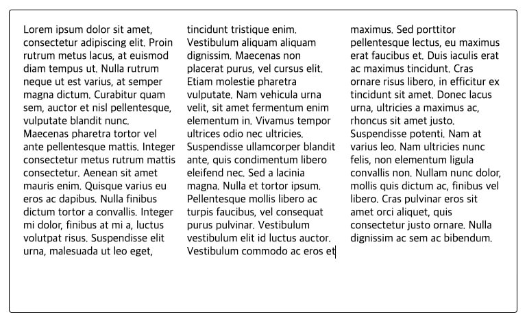
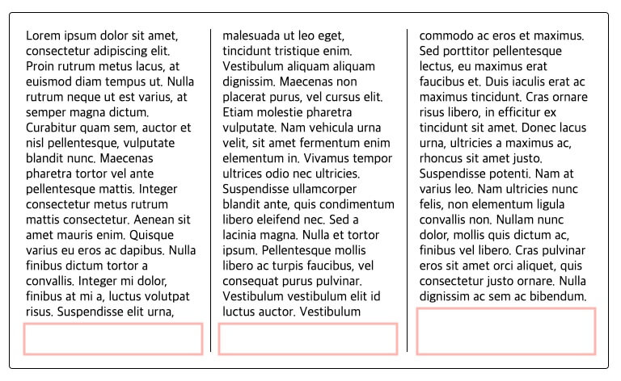
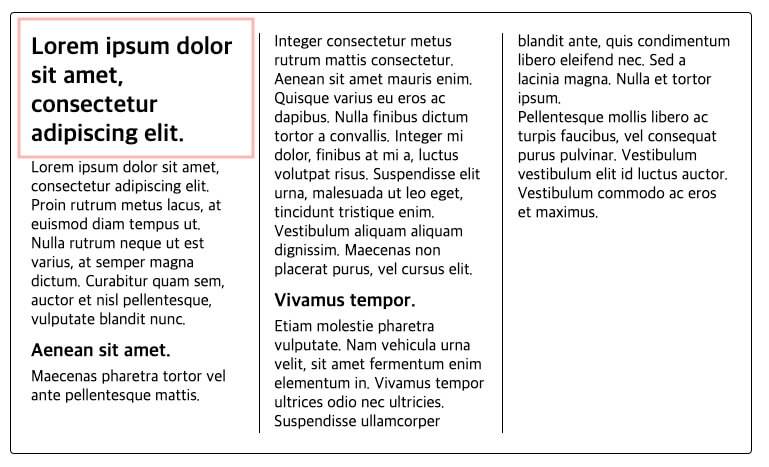
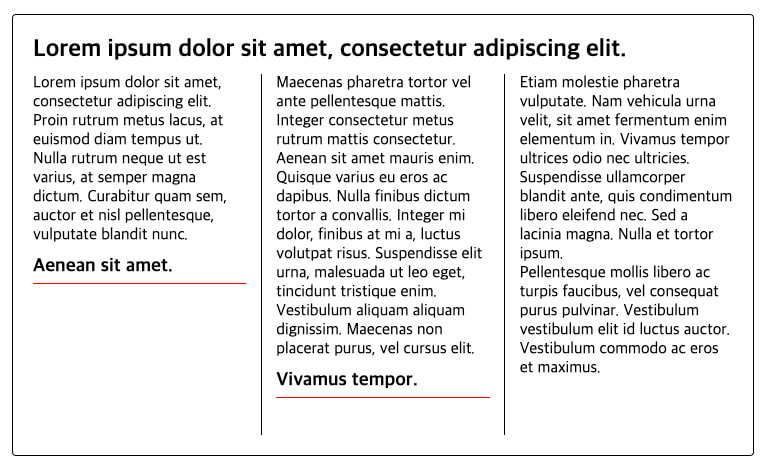
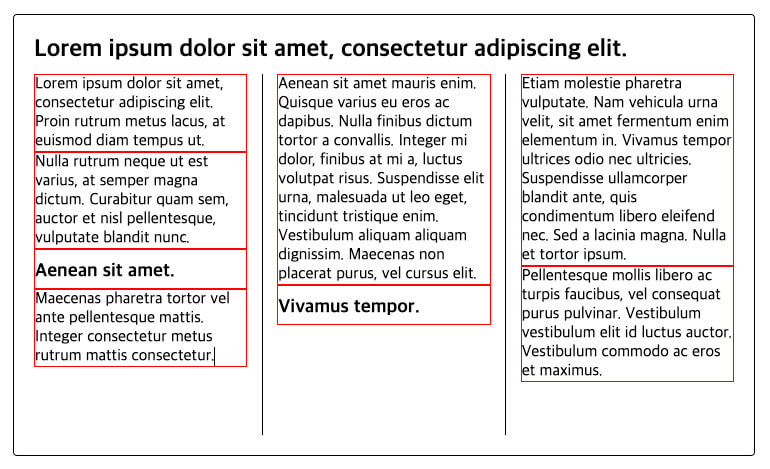

CSS 다단(Multi-Column)은 요소의 내용(텍스트 등)을 신문이나 잡지처럼 여러 단으로 나누어, 보다 많은 내용을 한눈에 볼 수 있어 가독성을 높이는 레이아웃 기능입니다.
단순하게는 단 개수만 지정하는 것도 가능하지만, 단의 최소 너비, 사이 간격, 구분선, 기타 최적화의 다양한 스타일을 지정할 수 있으며, 특히 최소 너비 지정을 통해서 쉽게 반응형 레이아웃을 제공할 수도 있습니다.

하나의 블록 요소에서 여러 단을 나눠 내용을 보여줄 수 있습니다.
인라인 요소에서는 적용되지 않습니다.

## Multi-Column Containers

다단의 기본적인 속성은 단일 컨테이너(블록 요소)에서 사용합니다.
이후 예제에서는 `<article>` 요소가 다단 컨테이너입니다.


### columns

`columns`는 단축 속성으로 단의 최소 너비(`column-width`)와 최대 개수(`column-count`)를 한 번에 지정할 수 있습니다.
기본값은 `auto`로 브라우저가 단의 너비와 개수를 지정하며, 별도의 너비와 개수를 지정하지 않으면 다단이 적용되지 않습니다.

| 값 | 의미 | 기본값 |
|---|---|---|
| `auto` | 브라우저가 단의 너비와 개수를 지정 | `auto` |
| `column-width` 속성의 값 | 단의 최소 너비를 지정 | `auto` |
| `column-count` 속성의 값 | 단의 최대 개수를 지정 | `auto` |

```
columns:  최소너비  최대개수;
```

다음은 다단 기능이 적용되지 않은 예제입니다.

```html
<article>
  <p>
    Lorem ipsum dolor sit amet, consectetur adipiscing elit. Proin rutrum metus lacus, at euismod diam tempus ut. Nulla rutrum neque ut est varius, at semper magna dictum. Curabitur quam sem, auctor et nisl pellentesque, vulputate blandit nunc. Maecenas pharetra tortor vel ante pellentesque mattis. Integer consectetur metus rutrum mattis consectetur. Aenean sit amet mauris enim. Quisque varius eu eros ac dapibus. Nulla finibus dictum tortor a convallis. Integer mi dolor, finibus at mi a, luctus volutpat risus. Suspendisse elit urna, malesuada ut leo eget, tincidunt tristique enim. Vestibulum aliquam aliquam dignissim. Maecenas non placerat purus, vel cursus elit.
    Etiam molestie pharetra vulputate. Nam vehicula urna velit, sit amet fermentum enim elementum in. Vivamus tempor ultrices odio nec ultricies. Suspendisse ullamcorper blandit ante, quis condimentum libero eleifend nec. Sed a lacinia magna. Nulla et tortor ipsum. Pellentesque mollis libero ac turpis faucibus, vel consequat purus pulvinar. Vestibulum vestibulum elit id luctus auctor. Vestibulum commodo ac eros et maximus.
    Sed porttitor pellentesque lectus, eu maximus erat faucibus et. Duis iaculis erat ac maximus tincidunt. Cras ornare risus libero, in efficitur ex tincidunt sit amet. Donec lacus urna, ultricies a maximus ac, rhoncus sit amet justo. Suspendisse potenti. Nam at varius leo. Nam ultricies nunc felis, non elementum ligula convallis non. Nullam nunc dolor, mollis quis dictum ac, finibus vel libero. Cras pulvinar eros sit amet orci aliquet, quis consectetur justo ornare. Nulla dignissim ac sem ac bibendum.
  </p>
</article>
```

```css
article {
  width: 700px;
  height: 450px;
  padding: 20px;
  border: 1px solid;
  border-radius: 4px;
}
p {
  margin: 0;
}
```


다단을 적용할 컨테이너 요소에 다음과 같이 `columns` 속성을 사용합니다.
각 단의 최소 너비는 `200px`이고 단의 최대 개수는 `3`개입니다.

```css
article {
  /* ... */
  columns: 200px 3;
  /* column-width: 200px; */
  /* column-count: 3; */
}
```



만약 컨테이너의 가로 너비가 줄어들면, 각 단의 최소 너비에 맞게 단의 개수가 조절됩니다.
주의할 부분은 요소의 세로 너비가 단의 개수를 조절할 만큼 충분해야 한다는 것이므로, 이 부분에서만 `height` 속성을 기본값(`auto`)으로 처리합니다.
요소의 세로 너비를 지정하는 `height` 속성의 기본값은 `auto`이며, 내용(Content)의 크기에 맞게 가변할 수 있습니다.

/// message-box --icon=warning
다음 제목부터는 `height` 속성을 다시 살려서 테스트하세요!
///

```css --line-error=3
article {
  width: 700px;
  /* height: 450px; */
  padding: 20px;
  border: 1px solid;
  border-radius: 4px;
}
```


#### column-width

`columns`의 개별 속성으로, 각 단이 줄어들 수 있는 최소 너비를 지정합니다.
요소의 너비 안에서 하나의 단이 최소 너비보다 줄어들 경우, 단의 개수가 자동으로 변경됩니다.

| 값 | 의미 | 기본값 |
|---|---|---|
| `auto` | 브라우저가 자동으로 지정 | `auto` |
| 단위 | `px`, `em`, `cm` 등 단위로 지정 |  |

```css
article {
  /* ... */
  column-width: 200px;
}
```

#### column-count

`columns`의 개별 속성으로, 요소에서 내용을 구분할 단의 최대 개수를 지정합니다.
최적의 단의 개수는 지정된 단의 최소 너비(`column-width`)에 따라 자동으로 변경됩니다.

| 값 | 의미 | 기본값 |
|---|---|---|
| `auto` | 브라우저가 자동으로 지정 | `auto` |
| 숫자 | 단의 최대 개수를 지정 |  |

```css
article {
  /* ... */
  column-count: 3;
}
```

### column-gap(gap)

다단인 경우, 단과 단 사이의 간격을 지정합니다.
기본 간격은 글자의 크기와 비례합니다.

/// message-box --icon=info
`gap`은 `row-gap`과 `column-gap` 속성의 단축 속성입니다.
다단 기능에서는 `row-gap`을 사용하지 않기 때문에 `gap: 30px;`과 `column-gap: 30px;`이 서로 같은 결과를 출력합니다.
///

| 값 | 의미 | 기본값 |
|---|---|---|
| `normal` | 기본 간격을 지정(`1em`) | `normal` |
| 단위 | `px`, `em`, `cm` 등 단위로 지정 |  |

```css
article {
  /* ... */
  column-gap: 30px;
  /* gap: 30px; */
  /* gap: 0 30px; */
}
```


### column-rule

다단인 경우, 단과 단 사이에 구분선을 지정합니다.
구분선은 단 사이 간격 중간에 위치합니다.

/// message-box --icon=info
`border-width`, `border-style`, `border-color` 속성과 같이 선의 두께, 종류, 색상을 지정하는 것과 비교하면, 이해하기 쉽습니다.
///

| 값 | 의미 | 기본값 |
|---|---|---|
| `column-width` | 선의 두께를 지정 | `medium` |
| `column-style` | 선의 종류를 지정 | `none` |
| `column-color` | 선의 색상을 지정 | 요소의 글자색과 동일 |

```css
article {
  /* ... */
  column-rule: 1px solid;
}
```


#### column-rule-width

`column-rule`의 개별 속성으로, 다단 구분선의 두께를 지정합니다.

| 값 | 의미 | 기본값 |
|---|---|---|
| `medium` | 중간 두께 선 | `medium` |
| `thin` | 얇은 두께 선 |  |
| `thick` | 두꺼운 두께 선 |  |
| 단위 | `px`, `em`, `cm` 등 단위로 지정 |  |

```css
article {
  /* ... */
  column-rule-width: 1px;
}
```

#### column-rule-style
  
`column-rule`의 개별 속성으로, 다단 구분선의 종류를 지정합니다.

| 값 | 의미 | 기본값 |
|---|---|---|
| `none` | 선 없음 | `none` |
| `hidden` | 선 없음과 동일(`table`요소에서 사용) |  |
| `solid` | 실선(일반선) |  |
| `dotted` | 점선 |  |
| `dashed` | 파선 |  |
| `double` | 두 줄선 |  |
| `groove` | 홈이 파여있는 모양(선) |  |
| `ridge` | 솟은 모양(선, `groove`의 반대) |  |
| `inset` | 요소 전체가 들어간 모양(선) |  |
| `outset` | 요소 전체가 나온 모양(선) |  |

```css
article {
  /* ... */
  column-rule-style: solid;
}
```

#### column-rule-color

`column-rule`의 개별 속성으로, 다단 구분선의 색상을 지정합니다.

| 값 | 의미 | 기본값 |
|---|---|---|
| 색상 | 선의 색상을 지정 | 요소의 글자색과 동일 |

```css
article {
  /* ... */
  column-rule-color: red;
}
```

### column-fill

`column-fill` 속성은 내용을 단마다 균형을 맞출지, 순차적으로 채울지 지정합니다.

| 값 | 의미 | 기본값 |
|---|---|---|
| `balance` | 균형을 맞춰 채움 | `balance` |
| `auto` | 순차적으로 채움 |  |

요소 높이(`height`)가 지정된 경우, 기본적으로 단마다 내용의 균형(`balance`)을 맞추기 위해 하단에 공간이 남을 수 있습니다.



만약 다단에서 내용의 균형을 맞추지 않고 단지 순차적으로 채우려면, `auto` 값을 사용할 수 있습니다.

```css
article {
  /* ... */
  column-fill: auto;
}
```


## Multi-Column Items

다단 기능을 적용한 컨테이너 요소의 내용(자식)으로 여러 요소가 있을 수 있습니다.
지금부터 살펴볼 속성들은 모두, 컨테이너가 아닌 내용 요소에서 사용합니다.

### column-span

요소를 모든 단에 걸쳐 확장(Span)할 수 있습니다.
다단 영역의 제목을 표시하는 용도로 사용할 수 있습니다.

| 값 | 의미 | 기본값 |
|---|---|---|
| `none` | 요소가 확장되지 않음 | `none` |
| `all` | 요소를 모든 단에 확장 |  |

다음 예제의 다단 영역에는 영역의 제목을 나타내는 `<h2>` 요소와 일부 내용의 소제목을 나타내는 `<h3>` 요소가 있으며, 각 문장은 `<p>` 요소로 구성되어 있습니다.
단의 순서대로 제목과 문장이 흘러가며 출력됩니다.

```html --line-active=2
<article>
  <h2>Lorem ipsum dolor sit amet, consectetur adipiscing elit.</h2>
  <p>Lorem ipsum dolor sit amet, consectetur adipiscing elit. Proin rutrum metus lacus, at euismod diam tempus ut.</p>
  <p>Nulla rutrum neque ut est varius, at semper magna dictum. Curabitur quam sem, auctor et nisl pellentesque, vulputate blandit nunc.</p>

  <h3>Aenean sit amet.</h3>
  <p>Maecenas pharetra tortor vel ante pellentesque mattis. Integer consectetur metus rutrum mattis consectetur.</p>
  <p>Aenean sit amet mauris enim. Quisque varius eu eros ac dapibus. Nulla finibus dictum tortor a convallis. Integer mi dolor, finibus at mi a, luctus volutpat risus. Suspendisse elit urna, malesuada ut leo eget, tincidunt tristique enim. Vestibulum aliquam aliquam dignissim. Maecenas non placerat purus, vel cursus elit.</p>

  <h3>Vivamus tempor.</h3>
  <p>Etiam molestie pharetra vulputate. Nam vehicula urna velit, sit amet fermentum enim elementum in. Vivamus tempor ultrices odio nec ultricies. Suspendisse ullamcorper blandit ante, quis condimentum libero eleifend nec. Sed a lacinia magna. Nulla et tortor ipsum.</p>
  <p>Pellentesque mollis libero ac turpis faucibus, vel consequat purus pulvinar. Vestibulum vestibulum elit id luctus auctor. Vestibulum commodo ac eros et maximus.</p>
</article>
```

```css
article {
  width: 700px;
  height: 400px;
  padding: 20px;
  border: 1px solid;
  border-radius: 4px;
  column-width: 200px;
  column-count: 3;
  column-gap: 30px;
  column-rule: 1px solid;
  column-fill: auto;
}
h2 {
  margin: 0;
  padding-bottom: 10px;
}
h3 {
  margin: 0;
  padding: 10px 0 5px;
}
p {
  margin: 0;
}
```



만약 영역의 제목을 더욱 강조하려면, 다음과 같이 모든 단에 걸쳐 확장되는 제목을 만들 수 있습니다.
해당 제목 요소에서 `column-span: all;` 속성을 사용합니다.

```css
h2 {
  /* ... */
  column-span: all;
}
```


### break-before

요소의 시작 부분(Before)에서 다음 단(Column)으로 줄 바꿈(Break) 할 수 있습니다.
기본적으로 `auto`는 `avoid`처럼 동작합니다.

/// message-box --icon=info
`break-before`, `break-after` 속성과 가상 요소 선택자 `::before`, `::after`를 비교하면 이해하기 쉽습니다.
///

| 값 | 의미 | 기본값 |
|---|---|---|
| `auto` | 브라우저가 자동으로 지정 | `auto` |
| `column` | 요소의 시작 부분에서 다음 단으로 줄 바꿈 |  |
| `avoid` | 요소의 끝 부분에서 줄 바꿈하지 않음 |  |

각 소제목의 시작 부분에서 다음 단으로 줄 바꿈 합니다.
빨간색 선은 줄 바꿈된 부분을 의미합니다.

```css
h3 {
  /* ... */
  border-top: 1px solid red;
  break-before: column;
}
```


### break-after

요소의 끝 부분(After)에서 다음 단으로 줄 바꿈할 수 있습니다.

| 값 | 의미 | 기본값 |
|---|---|---|
| `auto` | 브라우저가 자동으로 지정 | `auto` |
| `column` | 요소의 끝 부분에서 다음 단으로 줄 바꿈 |  |
| `avoid` | 요소의 끝 부분에서 줄 바꿈하지 않음 |  |

빨간색 선은 다음 단으로 줄 바꿈된 부분을 의미합니다.

```css
h3 {
  /* ... */
  border-bottom: 1px solid red;
  break-after: column;
}
```



### break-inside

요소 내부(Inside)에서의 다음 단으로 줄 바꿈 여부를 지정할 수 있습니다.
기본적으로 요소 내부에서의 줄 바꿈은 허용됩니다.

| 값 | 의미 | 기본값 |
|---|---|---|
| `auto` | 브라우저가 자동으로 지정 | `auto` |
| `avoid` | 요소 내부가 다음 단으로 줄 바꿈하지 않음 |  |

다음 예제에서 소제목과 문장의 영역을 구분하기 위해 빨간색 테두리 선을 사용했습니다.
예제의 4번째와 5번째 문장은 각각 다음 단으로 줄 바꿈되어 출력됩니다.

/// message-box --icon=warning
이번 예제에서는 `break-before`와 `break-after` 속성을 사용하지 않습니다.
///

```css --line-active=5,11 --line-error=6-7
/* ... */
h3 {
  margin: 0;
  padding: 10px 0 5px;
  border: 1px solid red;
  /* border-bottom: 1px solid red; */
  /* break-after: column; */
}
p {
  margin: 0;
  border: 1px solid red;
}
```


만약 각 문장이 단 사이에서 줄 바꿈 되는 것을 원하지 않는다면, 다음과 같이 요소 내부의 줄 바꿈을 허용하지 않도록 지정할 수 있습니다.
그러면 줄 바꿈 없이 출력될 수 없는 경우, 다음 단에서 출력됩니다.

```css --line-active=4
/* ... */
p {
  /* ... */
  break-inside: avoid;
}
```


