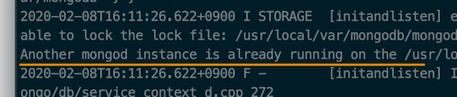
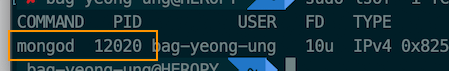
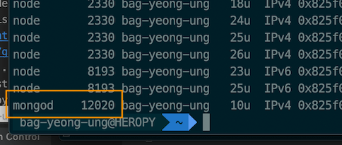

간혹 시동 중이던 MongoDB가 비정상적으로 종료된 후 다시 MongoDB를 시동하기 위해 명령어를 삽입하면 다음과 같은 에러를 반환할 수 있습니다.
이 경우 MongoDB 인스턴스로 사용되는 포트를 종료하면 쉽게 해결할 수 있습니다.

> Another mongod instance is already running on the 'xxx' directory,



## kill 명령으로 종료

다음과 같이 (슈퍼 유저 권한으로) `kill` 명령에 프로세스 종료(TERM 시그널)할 PID(Process ID)를 입력합니다.

```bash
$ sudo kill -TERM <PID>
```

## lsof 명령으로 검색 후 종료

PID를 모르는 경우,
MongoDB 기본 포트 번호(27017)를 사용해 다음과 같이 `lsof` 명령으로 검색할 수 있습니다.
`-i` 옵션으로 프로토콜(`TCP`)과 포트(`27017`)를 명시합니다.

```bash
$ sudo lsof -i TCP:27017
```

다음과 같이 PID를 찾을 수 있습니다.



하지만 포트 번호로 검색할 수 없는 경우,(포트 번호를 모르거나, 검색이 안되는 경우)
다음과 같이 `-s` 옵션을 추가해 TCP 상태가 `LISTEN`인 목록을 검색 후 COMMAND가 `mongod`인 항목을 찾습니다.

```bash
$ sudo lsof -i TCP -s TCP:LISTEN
```

역시 다음과 같이 MongoDB의 PID를 찾을 수 있습니다.



PID를 찾았다면 다음과 같이 포트를 종료합니다.

```bash
$ sudo kill -TERM 12020
```
