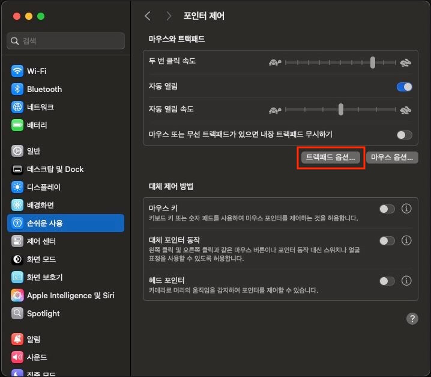
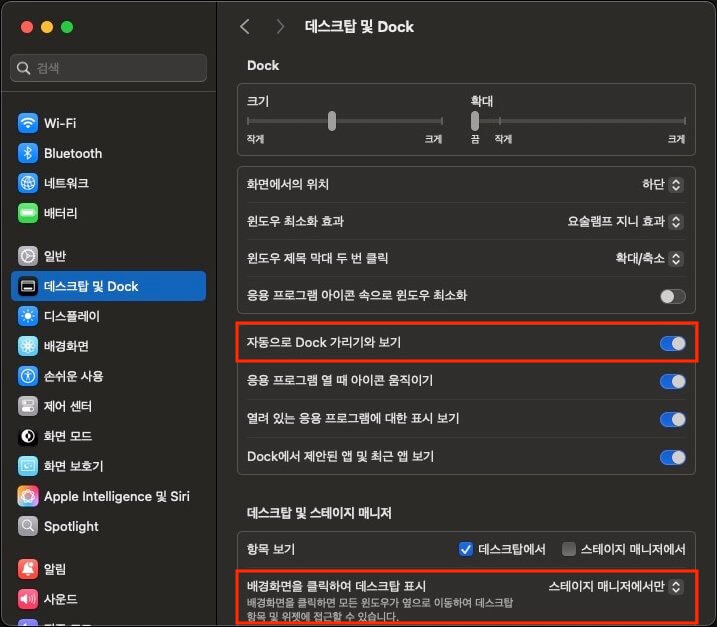
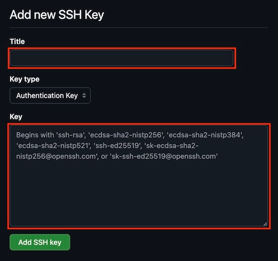
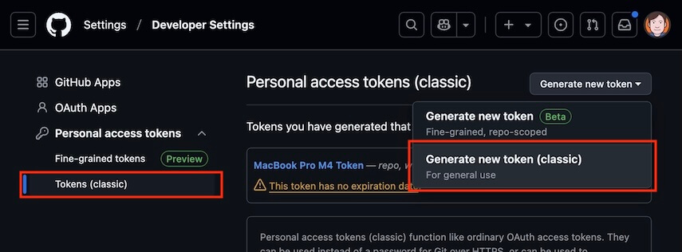
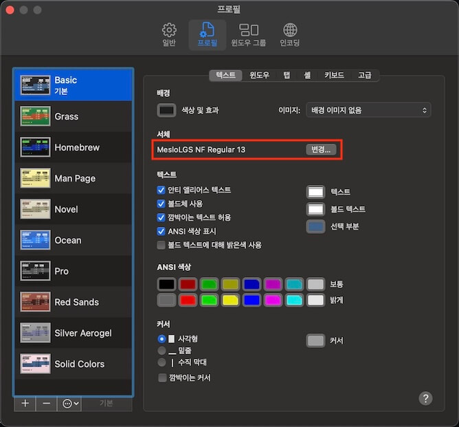
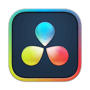
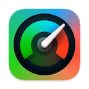
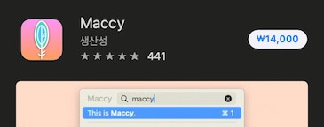

20년에 구매한 인텔 맥북 프로를 그럭저럭 사용하고 있다가, 24년 11월에 갑자기 맥북이 켜지지 않아 수리를 맡겼습니다.
메인보드 교체 진단이 나와서 일주일 정도 수리 기간을 안내받았고, 당장 다음 날부터 강의를 해야 했기에 어쩔 수 없이 당장 사용할 M3 맥북 에어를 구입해 필요한 것들을 그때그때 하나씩 세팅하면서 2개월 정도 사용했습니다.
그리고 25년 1월에 추가로 M4 맥북 프로를 구입하면서 맥북 세팅을 또 하려고 보니, 세팅 방법을 기록해 두면 좋겠다는 생각이 들었습니다.

## 시스템 설정...


### 맥북 초기화

맥북 세팅을 하다가 문제가 발생해 초기화하길 원하면, 아주 간단하게 새 맥북의 언어 선택부터 다시 시작할 수 있습니다.
iCloud, Dropbox 등의 클라우드 서비스를 사용하거나 중요 데이터의 백업만 신경 쓴다면, 가끔은 맥북을 초기화하고 새것처럼 시작하는 것도 좋겠습니다.

- 일반 >
  - 전송 또는 재설정 >
    - 모든 콘텐츠 및 설정 지우기...  


### Touch ID 및 암호

보통 오른손 검지나 중지를 사용해서 지문을 등록하는데, 오른손이 불편한 경우에 왼손을 쓸 수 있도록 추가 지문을 등록하면 편리합니다.
앞으로 세팅할 것이 많고 그때마다 대부분 인증을 해야 하니 미리 지문 등록을 해두는 것이 좋습니다.


### 키보드

- 키 반복 속도: `빠르게`
- 반복 지연 시간: `짧게`
- 키보드 단축키... >
    - 입력 소스 >
        - [Karabiner-Elements](/p/XQ4pkx#h3_KarabinerElements)를 사용하는 경우에만 구성!
        - 입력 메뉴에서 다음 소스 선택: 우측 `Cmd` (F18)
    - 스크린샷 >
        - [iStatistica](/p/XQ4pkx#h2_iStatistica)를 사용하는 경우에만 구성!
        - 선택한 영역의 그림을 클립보드에 복사: `Shift` + `Cmd` + `S`
    - 기능 키 >
        - F1, F2 등의 키를 표준 기능 키로 사용: `On`
- 텍스트 입력 / 편집... >
    - 스페이스를 두 번 눌러 마침표 추가: `Off`


### 트랙패드 

- 탭하여 클릭하기: `On`


### 손쉬운 사용

- 포인터 제어 >
  - 마우스와 트랙패드 / 트랙패드 옵션... >
    - 드래그에 트랙패트 사용: `On`
    - 드래그 스타일: `세 손가락으로 드래그하기`



### 데스크탑 및 Dock

- Dock / 자동으로 Dock 가리기와 보기: `On`
- 데스크탑 및 스테이지 매니저 / 배경화면을 클릭하여 데스크탑 표시: `스테이지 매니저에서만`



### 제어 센터

- 메뉴 막대만 / 시계 / 시계 옵션... >
  - 시간 / 시간에 초를 표시: `On`


### 잠금 화면

저는 키보드/마우스를 사용하지 않고 화면을 보고 있는 상황이 많아 각 시간을 비교적 길게 설정합니다.


### 화면 보호기

`전체 셔플`을 선택해서 배경화면과 화면 보호기를 매일 자동으로 변경할 수 있도록 설정합니다.


### 스크린샷 이미지 확장자 변경

기본 스크린샷 파일 확장자는 PNG이며, 이를 JPG로 변경하기 위해 다음 명령어를 터미널에서 실행합니다.

```bash
defaults write com.apple.screencapture type jpg
```

## Homebrew

[Homebrew](https://brew.sh/)는 macOS 패키지 관리자입니다.


다음 명령을 터미널에서 실행해 Homebrew를 설치합니다.

```bash --caption=터미널에서 실행
/bin/bash -c "$(curl -fsSL https://raw.githubusercontent.com/Homebrew/install/HEAD/install.sh)"
```

설치가 끝나면, 터미널에서 출력되는 다음 단계(Next steps)의 실행 코드를 복사해서 터미널에서 실행합니다.


마지막으로 `brew` 명령이 잘 실행되는지 확인합니다.

```bash --caption=Homebrew 설치 확인
brew -v
# Homebrew 4.4.15
```

### Git

[Git](https://git-scm.com/)은 프로젝트의 버전 관리를 위한 도구입니다.
홈페이지에서 설치 프로그램을 다운로드하지 않고, Homebrew로 Git을 설치하면 쉽게 Git의 버전을 관리할 수 있습니다.

```bash --caption=터미널에서 실행
brew install git

# 기본 구성
git config --global credential.helper osxkeychain # 자격 증명 저장
git config --global core.autocrlf input # macOS 개행 문자
git config --global user.name "ParkYoungWoong" # 이름(GitHub)
git config --global user.email "thesecon@gmail.com" # 이메일(GitHub)
git config --global pull.rebase true # 기본 리베이스 설정
```

### GitHub

[GitHub](https://github.com/)은 프로젝트의 원격 저장소를 제공하는 서비스입니다.
회원가입 후 다음 과정을 진행합니다.

#### SSH

네트워크 프로토콜 중 하나인, SSH(Secure SHell)는 안전한 원격 접속을 위해 사용합니다.

터미널에서 다음 명령을 실행해 SSH 키를 생성하고 복사합니다.
GitHub에서 권장하는 ED25519 암호화 알고리즘 유형은 주로 사용되는 RSA보다 더 빠르고 안전하다고 알려져 있습니다.

```bash --caption=터미널에서 실행
# SSH 키 생성
ssh-keygen -t ed25519 -C "thesecon@gmail.com"

# 키체인 접근 추가
ssh-add --apple-use-keychain ~/.ssh/id_ed25519

# SSH 키 복사
pbcopy < ~/.ssh/id_ed25519.pub
```

생성 후 복사한 SSH 키를 [GitHub Settings(SSH and GPG keys)](https://github.com/settings/keys)에 등록합니다.


복사한 SSH 키를 `Key` 항목에 입력합니다.



#### HTTPS

[GitHub Settings(Personal access tokens)](https://github.com/settings/tokens)에서 토큰 생성을 시작합니다.



토큰 이름과 접근 범위(Select scopes)를 선택합니다.
저장소(repo)와 워크플로우(workflow) 정도는 기본으로 하고 그 외 범위는 필요에 따라 추가 선택합니다.


생성이 완료되면, 토큰을 복사합니다.


다음 코드의 `<USERNAME>`에 GitHub 사용자 이름(ParkYoungWoong)을, `<ACCESS_TOKEN>`에 복사한 토큰을 입력하고 터미널에서 실행합니다.

```bash --caption=터미널에서 실행
printf "protocol=https\nhost=github.com\nusername=<USERNAME>\npassword=<ACCESS_TOKEN>\n” | git credential-osxkeychain store
```

### NVM

[NVM](https://github.com/nvm-sh/nvm)은 Node.js 버전 관리를 위한 도구입니다.
다음 명령을 터미널에서 실행해 NVM을 설치하고 구성합니다.

```bash --caption=터미널에서 실행
# 설치
brew install nvm

# 구성
echo 'export NVM_DIR="$HOME/.nvm"' >> ${ZDOTDIR:-$HOME}/.zshrc
echo '[ -s "$NVM_DIR/nvm.sh" ] && \. "$NVM_DIR/nvm.sh" # This loads nvm' >> ${ZDOTDIR:-$HOME}/.zshrc
echo '[ -s "$NVM_DIR/bash_completion" ] && \. "$NVM_DIR/bash_completion" # This loads nvm bash_completion' >> ${ZDOTDIR:-$HOME}/.zshrc
```

NVM 설치 및 구성이 완료되면, 원하는 버전의 Node.js를 설치합니다.

```bash
# Node.js 최신 LTS 버전 설치
nvm install --lts

# Node.js 최신 22 버전 설치
nvm install 22

# 기본 버전 설정
nvm alias default 22

# 버전 사용
nvm use 22
nvm use default
```

## Zsh

### Oh My Zsh


[Oh My Zsh](https://ohmyz.sh/)은 Zsh 구성을 관리하는 프레임워크입니다. 
다음 명령을 터미널에서 실행해 설치합니다.([Install oh-my-zsh now](https://ohmyz.sh/#install))

```bash --caption=터미널에서 실행
sh -c "$(curl -fsSL https://raw.githubusercontent.com/ohmyzsh/ohmyzsh/master/tools/install.sh
```

### Powerlevel10k

다음 명령을 터미널에서 실행해 [Powerlevel10k](https://github.com/romkatv/powerlevel10k)를 설치합니다.

```bash --caption=터미널에서 실행
git clone --depth=1 https://github.com/romkatv/powerlevel10k.git ${ZSH_CUSTOM:-$HOME/.oh-my-zsh/custom}/themes/powerlevel10k
```

Powerlevel10k GitHub 저장소에서 [MesloLGS NF 폰트](https://github.com/romkatv/powerlevel10k?tab=readme-ov-file#manual-font-installation)를 다운로드 후 파일을 실행해 시스템에 설치합니다.


터미널 설정의 프로필 탭에서 서체를 선택합니다.



`.zshrc`에서 `ZSH_THEME` 변수의 값을 `powerlevel10k/powerlevel10k`로 변경합니다.
다음 명령을 터미널에서 실행하면 자동으로 변경됩니다.

```bash --caption=터미널에서 실행
if grep -q "^ZSH_THEME=" ${ZDOTDIR:-$HOME}/.zshrc; then
  sed -i '' 's|^ZSH_THEME=.*|ZSH_THEME="powerlevel10k/powerlevel10k"|' ${ZDOTDIR:-$HOME}/.zshrc
else
  echo 'ZSH_THEME="powerlevel10k/powerlevel10k"' >> ${ZDOTDIR:-$HOME}/.zshrc
fi
```

터미널을 종료하고 다시 시작하면 Powerlevel10k 구성이 시작됩니다.
바로 구성이 시작하지 않으면, `p10k configure` 명령을 실행해 직접 구성을 시작합니다.


### Zsh-Autosuggestions

[Zsh-Autosuggestions](https://github.com/zsh-users/zsh-autosuggestions)는 자동 완성 기능을 제공합니다.

```bash --caption=터미널에서 실행
# 설치
brew install zsh-autosuggestions

# 구성 
echo "source $(brew --prefix)/share/zsh-autosuggestions/zsh-autosuggestions.zsh" >> ${ZDOTDIR:-$HOME}/.zshrc
```

### Zsh-Syntax-Highlighting
    
[Zsh-Syntax-Highlighting](https://github.com/zsh-users/zsh-syntax-highlighting)은 명령어 구문 강조 기능을 제공합니다.

```bash --caption=터미널에서 실행
# 설치
brew install zsh-syntax-highlighting

# 구성
echo "source $(brew --prefix)/share/zsh-syntax-highlighting/zsh-syntax-highlighting.zsh" >> ${ZDOTDIR:-$HOME}/.zshrc
```

## App Store 설치

App Store에서 앱을 설치하면, 이력이 남아 이후에 다시 앱을 설치하기 쉽습니다.

### ScreenBrush


[ScreenBrush](https://apps.apple.com/us/app/screenbrush/id1233965871?mt=12)는 화면에 그리기 위한 브러시나 기타 기능을 제공합니다.
기본적으로 무료로 사용할 수 있고, 저는 $4.99 가격의 Plus 버전을 사용하고 있습니다.
강의 중에 사용하는 판서 도구입니다.

- Settings > 
  - Tool Change Notifications: `Never`
  - Flashlight > 
    - Radius: `170px`
  - Zoom > 
    - Scale: `1.3x`


### DaVinci Resolve



[Davinci Resolve](https://apps.apple.com/us/app/davinci-resolve/id571213070?mt=12)는 비디오 편집 도구입니다.
강의 영상을 편집할 때 사용합니다.

### iStatistica



[iStatistica](https://apps.apple.com/kr/app/istatistica/id1025822138?mt=12)는 시스템 정보를 표시합니다.
화면 상단의 메뉴 바에서 CPU나 메모리 등의 사용량을 실시간으로 확인할 수 있습니다.
유료 앱이며, 가격은 $5.99입니다.


### GIPHY Capture


[GIPHY Capture. The GIF Maker](https://apps.apple.com/kr/app/giphy-capture-the-gif-maker/id668208984?mt=12)는 화면 캡처를 통해 GIF를 만들어주는 앱입니다.
영상으로 만들기 애매한 짧은 장면을 GIF 이미지로 캡처해 문서에 첨부하기 좋습니다.

## Homebrew 설치

Homebrew를 통해 앱을 설치하면 버전 관리와 삭제가 쉽습니다.
그리고 앱을 하나씩 찾아 설치할 필요 없이 다음과 같이 터미널에서 한 번에 설치할 수도 있습니다.

```bash
brew install --cask karabiner-elements docker rectangle maccy cursor keka appcleaner zoom dropbox logi-options+ wacom-tablet
```

### Karabiner-Elements


[Karabiner-Elements](https://karabiner-elements.pqrs.org/)는 한/영 키를 변경하기 위해 사용하는 도구입니다.
Windows `한/영` 키처럼 `Space` 키 우측에 있는 `Cmd` 키를 한영 전환키로 사용할 수 있어 편리합니다.

다음과 같이 Homebrew로 설치합니다.

```bash
brew install --cask karabiner-elements
```

키보드 타입을 물어보는 경우, 미국이나 한국에서 주로 사용하는 ANSI 타입을 선택합니다.
Simple Modifications 항목에서 `right_command`를 `F18`로 설정합니다.


### Cursor


저는 VS Code 대신 [Cursor](https://www.cursor.com/)를 유료로 사용하고 있습니다.

```bash
brew install --cask cursor
```

만약 Cursor 대신 [VS Code](https://code.visualstudio.com/)를 사용하려면, 다음 명령으로 설치합니다.

```bash
brew install --cask visual-studio-code
```

### Docker


[Docker Desktop](https://www.docker.com/products/docker-desktop/)은 도커 컨테이너를 GUI로 관리할 수 있는 도구입니다.

```bash
brew install --cask docker
```

### Rectangle


[Rectangle](https://rectangleapp.com/)은 창 크기를 단축키로 쉽게 조절하는 도구입니다.
저는 기존에 Spectacle을 사용했기 때문에, 권장 단축키 옵션 아닌 좀 더 익숙한 Spectacle 단축키 옵션을 사용하고 있습니다.

```bash
brew install --cask rectangle
```


### Maccy


[Maccy](https://maccy.app/)는 클립보드에 복사한 정보를 누적해서 원하는 결과를 쉽게 찾아 붙여 넣을 수 있는 도구입니다.
$9.99 가격의 유료 앱이지만, 오픈소스이기 때문에 Homebrew를 통해 설치하면 무료로 사용할 수 있습니다.



```bash
brew install --cask maccy
```

- 일반
  - 로그인 시 실행: `On`
  - 자동으로 업데이트 확인: `On`
  - 자동으로 붙여넣기: `On`
- 보관
  - 파일: `Off`
- 고급
  - 종료시 기록 지우기: `On`


### Keka


[Keka](https://www.keka.io/)는 폴더 및 파일 압축 도구입니다.

```bash
brew install --cask keka
```

### App Cleaner


[App Cleaner](https://freemacsoft.net/appcleaner/)는 앱을 삭제할 때 관련 데이터도 함께 삭제해주는 도구입니다.

```bash
brew install --cask appcleaner
```

### Zoom


대부분의 미팅과 온라인 강의는 [Zoom](https://www.zoom.com/ko)을 사용하고 있습니다.

```bash
brew install --cask zoom
```

### Dropbox


[Dropbox](https://dropbox.com/)는 구글 드라이브 같은 클라우드 저장소 서비스로, 파인더에서 쉽게 탐색하고 공유하도록 데스크톱 앱을 설치합니다.
저는 강의 영상 저장과 공유를 위해 2TB 용량이 제공되는 Plus 요금제를 사용하고 있습니다.
무료 플랜은 2GB 용량까지 사용할 수 있습니다.

```bash
brew install --cask dropbox
```

현재 컴퓨터와 동기화할 때 과하게 용량을 차지하지 않도록 자주 사용하는 폴더만 따로 선택합니다.


### Logi Options+

트랙패드를 주로 사용하지만, 강의할 때는 세밀하게 포인터를 제어하기 어려워서 [로지텍 버티컬 마우스](https://www.logitech.com/ko-kr/products/mice/lift-vertical-ergonomic-mouse.html?srsltid=AfmBOopFNcD3OwGgtDZAQvxmejA2i3TRwt4mt659TvQ6DhjQp-3YlPjg)를 같이 사용하고 있습니다.
드라이버를 설치하면 버튼 기능을 변경하거나 포인터 속도를 조절할 수 있습니다.


```bash
brew install --cask logi-options+
```

추가 버튼을 `포인터 속도 변경`에서 `Mission Control`로 변경합니다.


### 와콤 드라이버


대학교 4학년 때 아버지께 선물 받은 와콤 인튜어스 4 태블릿을 아직 잘 사용하고 있습니다.
디자인할 때 많이 사용했는데, 지금은 거의 강의용으로만 사용하고 있네요.
오래된 모델이라 그런지 드라이버를 설치해야 포인터 위치를 제대로 인식합니다.

```bash
brew install --cask wacom-tablet
```

직접 드라이버를 설치하는 경우, [와콤 드라이버 다운로드](https://www.wacom.com/en-us/support/product-support/drivers) 페이지에서 Intuos 4 태블릿의 모델명 `PTK-640`으로 검색합니다.


