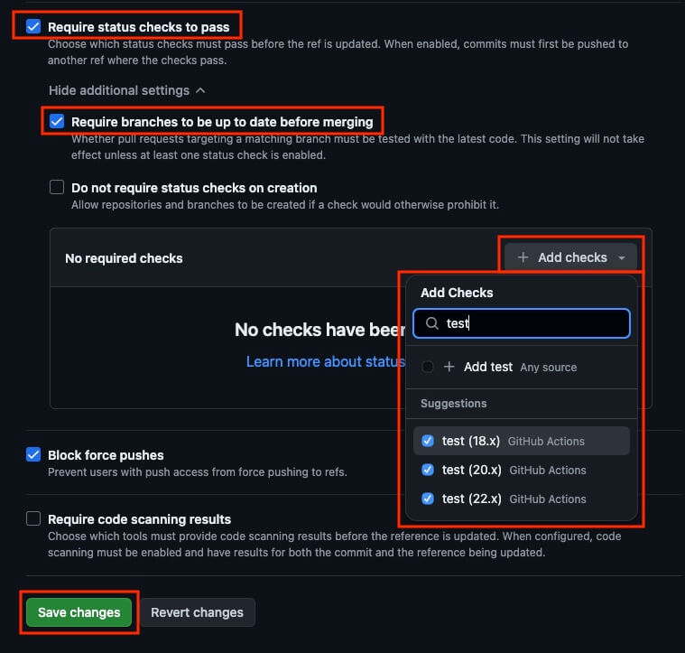

GitHub Flow는 GitHub을 활용하는 브랜치 전략으로, 브랜치를 어떻게 생성하고 병합하는지에 대한 개념입니다. 
GitHub Flow의 간단한 사용 사례를 통해 브랜치 전략을 이해해 봅시다.

## 프로젝트 초기화

NPM 프로젝트 초기화 후 타입을 모듈로 지정합니다.

```bash
npm init -y
```

```json --path=/package.json --line-active=6
{
  "name": "github-flow-test",
  "version": "1.0.0",
  "description": "",
  "main": "main.js",
  "type": "module",
  "scripts": {
    "test": "echo \"Error: no test specified\" && exit 1"
  },
  "keywords": [],
  "author": "",
  "license": "ISC"
}
```

`main.js` 파일을 생성하고, 파일 내용은 작성하지 않습니다.
이제 프로젝트 구조는 다음과 같습니다.

```plaintext --caption=프로젝트 구조
├─main.js
└─package.json
```

### 버전 관리 시작

Git으로 버전 관리를 시작합니다.

```bash
# 버전 관리 시작
git init
```

`main` 브랜치에서 최초 버전을 생성합니다.
VS Code 왼쪽 하단에서 브랜치 이름을 확인할 수 있습니다.


```bash
# 변경 사항 스테이징
git add .

# 변경 사항 커밋
git commit -m "프로젝트 생성."
```

#### main 브랜치가 아닌 경우

Git 2.28 버전부터 기본 브랜치 이름이 `master`에서 `main`으로 변경되었습니다.
만약 현재 브랜치 이름이 `master`인 경우, 다음과 같이 브랜치 이름을 변경하세요.

```bash
git branch -m main
```

만약 모든 프로젝트에서 `main`을 기본 브랜치로 사용하려면, Git 버전을 2.28 이상으로 업데이트하거나, 다음 명령을 실행하세요.

```bash
git config --global init.defaultBranch main
```

### GitHub 저장소 연결

로컬 프로젝트와 연결할 GitHub 저장소를 생성합니다.

먼저 GitHub 서비스에 로그인한 후, 화면 우측 상단의 `+` 버튼을 클릭하고 __[New repository]__ 를 선택합니다.


__[Repository name]__ 항목에 저장소 이름을 입력하고, __[Create repository]__ 버튼을 선택합니다.


다음 이미지와 같이, 생성된 저장소 화면의 중간에 보이는 URL(HTTPS, SSH)을 복사합니다.


프로젝트로 돌아와, 생성한 원격의 GitHub 저장소를 `origin`이라는 별칭으로 연결(추가)합니다.
이제 프로젝트 초기화가 끝났습니다.

```bash
# git remote add <원격별칭> <URL>
git remote add origin https://github.com/ParkYoungWoong/github-flow-test.git
```

## 개인 개발 사례

개발자 '박' 씨는 초기화된 프로젝트에서 시작해, `count` 데이터를 모듈화해 사용하는 기능을 개발하려고 합니다.
다음과 같이 진행할 수 있습니다.

`main` 브랜치를 기준으로 새로운 브랜치를 생성합니다.

```bash
# main 브랜치로 이동
git switch main

# feature-x 브랜치 생성 및 이동
git switch -c feature/count
```

그리고 다음과 같이, `count.js`에서 새로운 기능을 개발하고 `main.js`에서 사용하도록 작성합니다.
기능 개발이 끝났습니다!

```js --path=/count.js
export const count = 0
```

```js --path=/main.js
import { count } from './count.js'

console.log(count) // 0
```

개발이 끝났으니, 새로운 버전을 생성(커밋)합니다.
여기까지 진행 후, GitHub Flow를 따르지 않거나 따르는 경우로 나눠서 진행할 수 있습니다.

```bash
# 변경 사항 스테이징
git add .

# 변경 사항 커밋
git commit -m "count 데이터 모듈화."
```

### GitHub Flow를 따르지 않는 경우

/// message-box --icon=warning
우리는 GitHub Flow를 따를 것이므로, 이 주제는 참고용으로만 보세요!
///

귀찮은 개발자 '박' 씨는 GitHub Flow를 따르지 않고, 최대한 간단하게 개발 완료한 브랜치를 `main` 브랜치에 병합하려고 합니다.

`main` 브랜치로 이동해, 개발 완료한 브랜치(`feature/count`)를 병합합니다.
그리고 바로 원격 저장소로 업로드(푸시)합니다.

```bash
# main 브랜치로 이동
git switch main

# main 브랜치로 병합
git merge feature/count

# 원격 저장소에 main 브랜치를 푸시
git push origin main
```

### GitHub Flow를 따르는 경우

개발자 '박' 씨는 GitHub Flow를 따라, 개발 완료한 브랜치를 `main` 브랜치에 병합하려고 합니다.

우선, 개발 완료한 브랜치를 원격 저장소에 푸시합니다.

```bash
# 원격 저장소에 푸시
git push origin feature/count
```

#### PR 생성

푸시가 완료되면, GitHub 저장소의 __[Pull Requests]__ 페이지로 이동합니다.
그리고 __[New pull request]__ 버튼을 선택해, 새로운 Pull Request(PR) 생성을 진행합니다.


먼저 다음 이미지와 같이, `base` 브랜치를 `main`, `compare` 브랜치를 `feature/count`로 지정합니다.
이는 출처 브랜치(Source, `compare`)를 대상 브랜치(Target, `base`)로 병합하겠다는 의미로, 가운데 화살표 방향을 참고하면 이해가 더 쉽습니다.

또한 __[Able to merge]__ 표시를 통해, 병합이 가능하여 PR을 생성할 수 있는지 확인할 수 있습니다.
만약 병합 가능한 상태가 아니라면, __[Create pull request]__ 버튼이 활성화되지 않습니다.

준비가 되었으면, __[Create pull request]__ 버튼을 선택합니다.


이제 PR의 제목과 함께 설명을 추가합니다.
지금은 혼자 개발하는 경우이니, 설명을 가볍게 추가하거나 생략해도 무방합니다.
그리고 가볍게, __[assign yourself]__ 을 선택해서 PR 담당자(Assignees)를 자기 자신으로 지정할 수도 있습니다.

마지막으로 __[Create pull request]__ 버튼을 선택해 PR을 생성합니다.


#### PR 병합

이제 생성된 PR을 확인합니다.
지금은 혼자 개발하는 경우이니, 특별히 검토할 내용은 없을 겁니다.
바로 __[Merge pull request]__ 버튼을 선택해 PR을 병합합니다.
특별한 의도가 없다면, 기본 [병합 옵션](#h5_병합_옵션)으로 진행합니다.


병합이 완료되면, PR 상태가 __'Merged'__ 로 변경됩니다.


##### 병합 옵션

__[Merge pull request]__ 버튼 우측의 화살표를 선택하면, 3가지 병합 옵션을 확인할 수 있습니다.
기본적으로 __[Create a merge commit]__ 옵션이 선택되어 있습니다.


__[Create a merge commit]__ 은 출처(Source) 브랜치의 모든 커밋이 대상(Target) 브랜치에 병합되는 기본 옵션입니다.
예를 들어, 출처 브랜치에 3개의 커밋(`a`, `b`, `c`)이 있다면, 이를 병합하는 하나의 새로운 커밋(`M`)이 대상 브랜치에 추가 및 연결됩니다.
이는 병합 이력이 명확하게 남기 때문에, 추후 확인할 때 유용합니다.


__[Squash and merge]__ 는 출처 브랜치의 모든 커밋을 하나로 압축(Squash)해서 대상 브랜치에 한 번에 추가하는 옵션입니다.
예를 들어, 출처 브랜치에 3개의 커밋이 있어도, 대상 브랜치에는 하나의 병합 커밋(`M`)만 추가됩니다.
이는 중요하지 않은 작은 커밋들을 깔끔하게 정리할 수 있지만, 추후 이력을 정확하게 확인하기 어려워 주의해서 사용합니다.


__[Rebase and merge]__ 는 출처 브랜치의 모든 커밋을 그대로 대상 브랜치에 추가하는 옵션입니다.
예를 들어, 출처 브랜치에 3개의 커밋이 있으면, 대상 브랜치에 직렬로 3개의 커밋(`a`, `b`, `c`)이 추가됩니다.
이는 병합 커밋(`M`)을 생성하지 않고 커밋을 쌓아갈 수 있어서 직관적이지만, 여러 브랜치를 병합할 때 복잡한 충돌이 발생할 수 있어 주의해서 사용합니다.


## 팀 개발 사례

개발자 '박' 씨는 개인 개발 사례에 이어, 추가 기능을 개발하려고 합니다.
다음과 같이 진행할 수 있습니다.

앞서 우리는 개인 개발 사례를 통해 `main` 브랜치를 원격 저장소에서 병합했기 때문에, 로컬 `main` 브랜치를 최신 상태로 업데이트해야 합니다!

```bash
# main 브랜치로 이동
git switch main

# 원격 저장소 main 브랜치의 최신 내용 당겨오기
git pull origin main

# 추가 기능 개발 브랜치 생성 및 이동
git switch -c feature/count-increment
```

그리고 다음과 같이 `count` 데이터를 `1`씩 증가시키는 함수를 추가 개발하고, `main.js`에서 사용하도록 작성합니다.
기능 개발이 끝났습니다!

```js --path=/count.js
export let count = 0

export function increase() {
  count++
}
```

```js --path=/main.js
import { count, increase } from './count.js'

increase()
console.log(count) // 1
```

개발이 끝났으니, 새로운 버전을 커밋하고 푸시합니다.

```bash
# 변경 사항 스테이징
git add .

# 변경 사항 커밋
git commit -m "count 증가 함수 추가."

# 변경 사항 푸시
git push origin feature/count-increment
```

### 동료 개발자 초대

혼자서 외롭게 개발하던 개발자 '박' 씨는, 동료 개발자 '김' 씨를 꼬드겨 현재 프로젝트를 함께 개발하려고 합니다.
우선 해당 프로젝트 GitHub 저장소에 '김' 씨를 동료로 초대합니다.

__[Settings]__ 페이지로 이동해, __[Collaborators]__ 메뉴를 선택합니다.
화면 가운데 보이는 __[Add people]__ 버튼을 선택하고, '김' 씨의 GitHub 아이디나 이름으로 검색해 현재 저장소에 추가합니다.


그러면, 동료 개발자 '김' 씨에게 초대 메일이 발송됩니다.
메일에서 __[View invitation]__ 버튼을 선택해, 초대 수락을 진행합니다.


초대를 최종 수락하면, 저장소에 동료로 추가됩니다.


저장소의 소유자 개발자 '박' 씨는 다음과 같이 목록으로 초대 수락 여부를 확인할 수 있습니다.


만약 프로젝트 저장소를 개인이 아닌 조직(Organization)으로 관리한다면, 멤버(People)를 초대하고 여러 팀(Teams) 단위로 분류해 더욱 세부적인 권한 관리를 할 수 있습니다.


### 브랜치 규칙 추가

여러 명이 함께 개발하는 경우, 브랜치 규칙을 추가해 주요 브랜치(`main`)로의 잘못된 병합을 방지할 수 있습니다.

/// message-box --icon=warning
GitHub 무료 계정에서는 공개(Public) 저장소만 브랜치 규칙을 추가할 수 있습니다.
///

GitHub 저장소의 __[Settings]__ 페이지로 이동해, 우측 메뉴에서 __[Rules]__ 를 열고 __[Rulesets]__ 메뉴를 선택합니다.
그리고 __[New branch ruleset]__ 버튼을 선택해 새로운 브랜치 규칙을 추가합니다.


먼저 규칙의 이름(__Ruleset Name__)를 작성하고, 규칙 상태(__Enforcement status__)를 활성화(__Active__)로 지정합니다.
__[Bypass list]__ 에서는 규칙을 우회할 수 있는 역할(Role)을 지정합니다.
__Vercel__ 같이 배포할 서비스나, 저장소의 소유자 등을 지정해 해당 규칙을 우회하도록 지정할 수 있습니다.


__[Targets]__ 에서는 보호할 대상 브랜치를 지정합니다.
우측의 __[Add target]__ 에서 __[Include by pattern]__ 을 선택해, `main` 브랜치나 `release/`로 시작하는 브랜치 등 원하는 패턴을 지정할 수 있습니다.


__[Rules]__ 에서는 적용할 규칙을 선택할 수 있습니다.
기본적으로 선택된 규칙은 그대로 사용하고, 추가로 __[Require a pull request before merging]__ 규칙을 선택해 원하는 세부 규칙을 지정합니다.


세부 규칙은 다음과 같습니다.

- __Required approvals__: PR 병합에 필요한 최소 리뷰어 수를 지정합니다. 지정된 리뷰어 수 이상이 승인해야 PR을 병합할 수 있습니다.
- __Dismiss stale pull request approvals when new commits are pushed__: 출처 브랜치에 새로운 커밋이 푸시되면, 이전 PR 승인이 취소됩니다. 예를 들어, 어떤 리뷰어의 승인을 받았는데, 이후에(병합 전) 코드가 변경되면 다시 승인이 필요하다는 의미입니다.
- __Require review from Code Owners__: 특정 파일의 코드 소유자가 있는 경우, 해당 파일을 수정한 PR은 코드 소유자의 승인을 필수로 받아야 합니다.
- __Require approval of the most recent reviewable push__: 코드 작성자가 자신의 코드를 승인할 수 없고 다른 리뷰어가 승인해야 합니다.
- __Require conversation resolution before merging__: 모든 리뷰가 해결(Resolve)돼야 PR 병합이 가능합니다.

필요한 규칙을 모두 지정했으면, 하단의 __[Save changes]__ 버튼을 선택해 규칙을 적용합니다.


활성화된 규칙은 다음과 같이 초록색 아이콘으로 표시됩니다.


### PR 생성

앞서 개인 개발 사례에서 진행한 것과 같이, 출처 브랜치를 `feature/count-increment`로 지정하고 대상 브랜치를 `main`으로 하여 PR을 생성합니다.


동료 개발자에게 리뷰를 요청할 것이므로, PR 설명을 상세하게 추가합니다!
그리고 초대한 동료 개발자 '김' 씨를 리뷰어로 지정(Reviewers)합니다.
내친김에 PR 담당자(Assignees)를 '박' 씨 자신으로 하고, 라벨(Labels)을 추가해 PR을 좀 더 구체적으로 구분합니다.

/// message-box --icon=info
Assignees는 해당 PR의 전반적인 작업 책임자를 의미합니다.
///


앞서 브랜치 규칙을 추가했기 때문에, 이번에는 생성한 PR을 개발자 '박' 씨가 바로 병합할 수 없습니다.


### 코드 리뷰

이제 리뷰어로 등록된 개발자 '김' 씨는 다음과 같이 PR을 리뷰합니다.

__[Files changed]__ 를 선택해 변경된 파일과 내용을 확인하고, 리뷰를 진행합니다.
각 코드 라인에서 __[+]__ 버튼을 선택해 댓글(Comments)을 추가합니다.
그러면 댓글이 'Pending'(대기) 상태로 등록이 되는데, 모든 댓글의 작성이 끝났을 때 우측 상단의 __[Finish your review]__ 버튼을 선택해야 최종 등록됩니다.

/// message-box --icon=info
자유롭게 댓글을 추가하되, 비난하지 않고 건설적인 의견을 작성하며 대안을 제시하는 것이 좋습니다.
///


최종 의견과 함께 리뷰 타입을 선택하고 __[Submit review]__ 버튼을 선택해 리뷰를 제출합니다.
앞서 지정한 브랜치 규칙으로 인해, 병합을 위해선 승인 리뷰가 필수이기 때문에 리뷰어가 __[Approve]__ 타입을 선택해 승인해야 합니다.


각 리뷰 타입은 다음의 의미를 가집니다.

- __Comment__: 명시적인 승인이 아닌, 일반 리뷰 제출입니다.
- __Approve__: 리뷰를 제출하고 현재 PR 병합을 승인합니다.
- __Request changes__: 병합 전에 꼭 해결(Resolve)해야 하는 리뷰를 제출합니다. 만약에 앞서 __Require conversation resolution before merging__ 브랜치 규칙을 선택했다면, 이 타입을 선택했을 때 담당자는 리뷰어의 모든 댓글을 해결해야 PR을 병합할 수 있습니다.

### 리뷰 반영

승인 리뷰가 등록되어, PR이 병합 가능한 상태가 되었습니다.
하지만 PR 생성자인 개발자 '박' 씨는, 동료 개발자 '김' 씨의 승인 리뷰를 반영해 코드를 수정하려고 합니다.


다시 로컬 프로젝트로 돌아가, 코드를 수정합니다.

```bash
# 다른 브랜치에서 작업하지 않도록 주의하세요!
git switch feature/count-increment
```

```js --path=/count.js --line-active=3 --caption=리뷰 내용을 반영해 코드 수정
export let count = 0
export function increase() {
  return count += 1
}
```

다시 커밋 후 푸시합니다.

```bash
# 변경 사항 스테이징
git add .

# 변경 사항 커밋
git commit -m "increase 증가 함수가 증가된 값을 반환하도록 수정."

# 변경 사항 푸시
git push origin feature/count-increment
```

다시 PR 페이지로 돌아가 동료 개발자 '김' 씨에게 다시 리뷰를 요청합니다.
해당 리뷰(대화)의 개선 요청을 반영했으니, 하단에 보이는 __[Resolve conversation]__ 버튼을 선택해 리뷰를 해결했다고 표시합니다.


요청을 확인한 동료 개발자 '김' 씨는 다시 PR을 리뷰합니다.
__[Files changed]__ 에서는 전체 변경 사항이 표시되므로, 새롭게 수정한 내용은 __[Commits]__ 메뉴로 이동해 최신 커밋 이력으로 확인합니다.


내용이 확인되면, 리뷰 타입을 __[Approve]__ 으로 선택하고 최종 리뷰를 제출합니다.


### PR 병합

최종 승인되었으니, 이제 병합할 수 있습니다!

개발자 '박' 씨나 '김' 씨 중 권한에 문제가 없다면 모두 PR을 병합할 수 있습니다.
누구든 앞서 '개인 개발 사례'에서 진행한 것처럼, 원하는 [병합 옵션](#h5_병합_옵션)을 선택해 [PR 병합](#h4_PR_병합)을 마무리합니다.


## 테스트 기반 개발 사례

개발자 '박' 씨는 새로운 브랜치에서 개발을 완료하고 PR을 생성할 때, 안전하게 테스트 코드를 실행하고 성공과 실패 여부에 따라 PR 병합을 결정하려고 합니다.
GitHub Actions를 활용하면, 테스트 코드를 자동으로 실행하고 결과를 확인할 수 있습니다.

### 워크플로우 추가

우선 테스트 코드를 자동으로 실행할 수 있는 GitHub 워크플로우를 추가합니다.

프로젝트 저장소의 __[Actions]__ 페이지로 이동합니다.
다음과 같이 중간에 보이는 __[set up a workflow yourself]__ 버튼을 선택합니다.


다음과 같이 워크플로우 파일 이름과 내용을 작성합니다.
작성이 완료되면, 우측 상단의 __[Commit changes...]__ 버튼을 선택합니다.


`jobs` 옵션의 `test`는 임의로 지정한 작업의 이름입니다.
이 이름은 브랜치 규칙을 추가할 때 사용되니, 잘 기억해 두세요!

```yaml --line-active=13 --caption=작성할 내용
# GitHub Action 이름 지정!
name: 테스트 실행!

# 이벤트 지정!
on:
  push:
    branches: [ "main" ]
  pull_request:
    branches: [ "main" ]

# 작업 지정!
jobs:
  test: # 작업 이름!
    runs-on: ubuntu-latest

    strategy:
      matrix:
        node-version: [18.x, 20.x, 22.x] # 테스트할 Node.js 버전 목록!

    steps:
    - uses: actions/checkout@v4
    - name: Use Node.js ${{ matrix.node-version }}
      uses: actions/setup-node@v4
      with:
        node-version: ${{ matrix.node-version }}
        cache: 'npm'
    - run: npm ci # Clean Install 명령으로 의존성 설치!
    - run: npm test # 테스트 실행!
```

작성한 워크플로우 파일은 프로젝트 루트 경로 `.github/workflows` 폴더에 저장됩니다.
이렇게 변경된 내용을 `main` 브랜치로 커밋할 것인지, 아니면 새로운 브랜치로 커밋할 것인지 선택해야 합니다.
`main` 브랜치를 위한 테스트 자동화이니, `main` 브랜치로 커밋하는 것이 좋겠습니다.
__[Bypass rules and commit changes]__ 버튼을 선택해 커밋합니다.


### 브랜치 규칙 수정

원격 저장소의 `main` 브랜치에 새로운 커밋이 추가되었으니, 추가한 워크플로우를 바로 사용할 수 있습니다.
테스트가 성공한 경우에만 PR을 병합할 수 있도록, 앞서 '팀 개발 사례'에서 추가한 __[Main Protection Rule]__ 브랜치 규칙을 수정합니다.


우선, 기준을 통과했을 때만 병합을 할 수 있도록, __[Require status checks to pass]__ 규칙을 선택합니다.

세부 규칙으로 __[Require branches to be up to date before merging]__ 을 선택해, PR을 병합하기 전에 대상 브랜치가 최신인지 확인합니다.

그리고 아래 보이는 __[Add Checks]__ 메뉴에서 앞서 추가한 워크플로우의 작업 이름(`test`)을 검색합니다.
그러면 다음과 같이 추가한 워크플로우의 작업이 검색되고, 원하는 부분은 체크합니다.

마지막으로 하단의 __[Save changes]__ 버튼을 선택해 수정한 규칙을 저장합니다.



### 테스트 추가(실패)

테스트 코드를 통해 PR 병합을 결정할 준비가 되었으니, 이제 테스트 코드를 추가합니다.

```bash
# main 브랜치로 이동
git switch main

# 원격 저장소 main 브랜치의 최신 내용 당겨오기
git pull origin main

# 개발 브랜치 생성 및 이동
git switch -c feature/mocha
```

단위 테스트(Unit Test) 라이브러리인 Mocha를 설치합니다.
다른 어떤 테스트 라이브러리를 사용해도 무방합니다.

```bash
npm i -D mocha
```

라이브러리 설치로 `node_modules` 폴더가 생성되었으니, 버전 관리하지 않도록 무시해야 합니다.
프로젝트 루트 경로에 `.gitignore` 파일을 생성하고, `node_modules/` 폴더를 추가합니다.

```plaintext --path=/.gitignore
node_modules/
```

테스트 코드를 실행할 스크립트를 추가합니다.
`test` 스크립트는, `npm run test`로 실행할 수도 있고 `npm test`로 실행할 수도 있습니다.

```json --path=package.json --line-active=6,8
{
  "name": "git-test",
  "version": "1.0.0",
  "description": "",
  "main": "main.js",
  "type": "module",
  "scripts": {
    "test": "mocha"
  },
  "keywords": [],
  "author": "",
  "license": "ISC",
  "devDependencies": {
    "mocha": "^10.7.3"
  }
}
```

테스트가 실패하는 경우, 실제 PR 병합을 할 수 없는지 확인하기 위해서 다음과 같이 실패하는 테스트를 작성합니다.

```js --path=/test/count.test.js --line-error=7
import assert from 'assert'
import { count, increase } from '../count.js'

it('increase 함수를 호출하면, count 데이터가 1 증가!', () => {
  assert.equal(count, 0)
  increase()
  assert.equal(count, 7) // 실패!
})

it('increase 함수를 호출하면, count 값을 반환!', () => {
  assert.equal(increase(), count)
})
```

테스트 작성이 끝났으니, 커밋 후 푸시합니다.

```bash
# 변경 사항 스테이징
git add .

# 변경 사항 커밋
git commit -m "Mocha 테스트 라이브러리 설치 및 실패 테스트 추가."

# 변경 사항 푸시
git push origin feature/mocha
```

푸시한 출처 브랜치에서 대상 브랜치(`main`)로 PR을 생성합니다.
앞서 '팀 개발 사례'에서 지정한 브랜치 규칙에 따라 PR 병합을 위해서 테스트뿐만 아니라 승인 리뷰도 필요하니, 동료 개발자 '김' 씨를 리뷰어로 지정합니다.


PR을 생성하면, GitHub Actions가 자동으로 테스트 코드를 실행합니다.
약간의 시간이 소요됩니다.


실패하는 테스트를 만들었으니, 당연히 다음과 같이 테스트가 실패한 결과를 확인할 수 있습니다.
의도한 실패이기 때문에, 이제 테스트가 성공하도록 수정합니다.


### 테스트 수정(성공)

다시 프로젝트로 돌아와, 테스트가 성공하도록 다음과 같이 수정합니다.

```js --path=/test/count.test.js --line-active=7
import assert from 'assert'
import { count, increase } from '../count.js'

it('increase 함수를 호출하면, count 데이터가 1 증가!', () => {
  assert.equal(count, 0)
  increase()
  assert.equal(count, 1) // 성공!
})

it('increase 함수를 호출하면, count 값을 반환!', () => {
  assert.equal(increase(), count)
})
```

수정이 끝났으면, 다시 커밋 후 푸시합니다.

```bash
# 변경 사항 스테이징
git add .

# 변경 사항 커밋
git commit -m "테스트가 성공하도록 수정."

# 변경 사항 푸시
git push origin feature/mocha
```

생성된 PR의 브랜치에서 새로운 커밋이 푸시되면, 바로 다시 테스트가 실행됩니다.
역시 약간의 시간이 지나 테스트가 성공하고 이후에 승인 리뷰도 완료되면, 다음과 같이 PR 병합이 가능한 상태가 됩니다.

앞으로 `main` 브랜치를 대상으로 하는 모든 출처 브랜치의 PR은, 항상 테스트가 성공해야만 병합할 수 있습니다.


