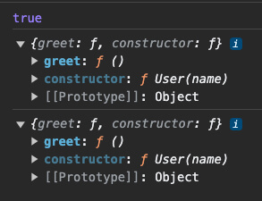
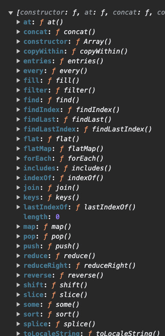
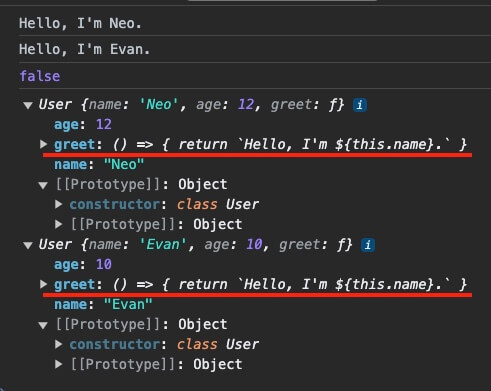

자바스크립트는 객체 지향 프로그래밍에서의 프로토타입(Prototype) 기반 언어로 ES2015부터 클래스(Class) 문법이 추가되었습니다.
하지만 자바스크립트는 여전히 프로토타입 기반으로 클래스 기반이 아닙니다.
클래스 문법은 단지 프로토타입의 간소화 문법(Syntactic sugar)에 불과합니다.

이 글을 통해 자바스크립트의 프로토타입 개념을 이해하고 클래스 문법의 핵심 패턴을 살펴봅시다.

## 프로토타입 이해하기

자바스크립트의 모든 객체(인스턴스)는 프로토타입 객체로부터 속성과 메소드를 동적으로 상속받습니다.
`new` 키워드로 호출하는 생성자 함수(Constructor Function)로부터 반환되는 데이터를 인스턴스(Instance)라고 하며, 인스턴스는 생성자 함수의 `prototype` 객체의 멤버(속성과 메소드)를 참조할 수 있습니다.

/// message-box --icon=info
일반 함수와 생성자 함수(클래스)의 구분을 위해, 생성자 함수 이름은 파스칼 케이스(PascalCase)로 작성하는 것이 관례(Convention)입니다.
그리고 이렇게 정의한 생성자 함수를 클래스(Class)라고 부릅니다.
///

생성자 함수(클래스)와 인스턴스의 기본 구조는 다음과 같습니다.

```js
function 클래스() {
  // constructor!
}
클래스.prototype.메소드 = function() {
  // ...
}
console.log(클래스.prototype) // { constructor: f, 메소드: f }

const 인스턴스A = new 클래스()
인스턴스B.메소드()

const 인스턴스B = new 클래스()
인스턴스B.메소드()
```

다음 생성자 함수 예제를 봅시다. 
`User` 함수의 `prototype` 속성에 추가한 `greet` 메소드는, 각 인스턴스(`heropy`, `neo` 객체)에 공유되는 것을 확인할 수 있습니다.
따라서, 각 인스턴스의 `greet` 메소드를 일치 연산자로 비교한 결과는 `true`가 됩니다.

/// message-box --icon=info
일치 연산자(`===`)는 좌우 피연산자의 메모리 주소가 같은지 비교합니다.
///

```js --line-active=14
function User(name) {
  this.name = name
}
User.prototype.greet = function() {
  return `Hello, I'm ${this.name}.`
}

const heropy = new User('Heropy')
console.log(heropy.greet()) // 'Hello, I'm Heropy.'

const neo = new User('Neo')
console.log(neo.greet()) // 'Hello, I'm Neo.'

console.log(heropy.greet === neo.greet) // true
```

각 인스턴스는 `__proto__` 속성으로 자신의 프로토타입 객체 참조를 확인할 수 있으며, 콘솔에서는 `[[Prototype]]`으로 표시됩니다.

/// message-box --icon=warning
`__proto__` 속성은 단순히 브라우저에서 지원하는 비표준 속성입니다.
///

```js 
console.log(User.prototype === heropy.__proto__) // true
console.log(heropy.__proto__)
console.log(neo.__proto__)
```




위 예제와 다르게, 매번 리터럴(Literal) 방식으로 생성한 각 객체의 `greet` 메소드는 서로 공유되지 않습니다.
따라서 각 객체의 `greet` 메소드를 일치 연산자로 비교한 결과는 `false`가 됩니다.

```js --line-active=16
function createUser(name) {
  return {
    name,
    greet() {
      return `Hello ${this.name}`
    }
  }
}

const heropy = createUser('Heropy')
console.log(heropy.greet()) // 'Hello, I'm Heropy.'

const neo = createUser('Neo')
console.log(neo.greet()) // 'Hello, I'm Neo.'

console.log(heropy.greet === neo.greet) // false
```

우리는 일반적으로 데이터를 생성할 때, 문법적으로 간소화된 리터럴 방식을 사용합니다. 
하지만 기본적인 데이터 생성은 생성자 함수 방식을 기반으로 하며, 대표적으로 배열 데이터를 살펴보겠습니다.

생성자 함수 방식이나 리터럴 방식으로 생성된 각 배열 데이터는 `Array` 클래스의 인스턴스입니다.

```js
const numsA = new Array(1, 2, 3) // 생성자 함수 방식
const numsB = [1, 2, 3] // 리터럴 방식

console.log(numsA.__proto__ === Array.prototype) // true
console.log(numsB.__proto__ === Array.prototype) // true
console.log(numsA.__proto__ === numsB.__proto__) // true

console.log(numsA)
console.log(numsB)
```


따라서 다음과 같이, 이미 정의되어 내장된 `Array.prototype`의 다양한 멤버를 사용할 수 있습니다.

```js
const numsA = new Array(1, 2, 3) // 생성자 함수 방식
const numsB = [1, 2, 3] // 리터럴 방식

console.log(Array.prototype.map)
console.log(Array.prototype.filter)
console.log(Array.prototype.reduce)
// ...

const doubles = numsA.map(v => v * 2)
const even = numsB.filter(v => v % 2 === 0)
const sum = numsA.reduce((acc, cur) => acc + cur, 0)
```

그리고 배열 데이터에서 사용 가능한 각 멤버는 `Array.prototype`을 통해 직접 확인할 수 있습니다.
이렇게 `prototype`을 통해 확인할 수 있는 속성과 메소드를 프로토타입 속성, 프로토타입 메소드라고 부릅니다.

```js
console.log(Array.prototype)
```



[MDN 문서](https://developer.mozilla.org/ko/docs/Web/JavaScript/Reference/Global_Objects/Array)를 확인하면, 배열과 관련된 다양한 프로토타입 멤버를 확인할 수 있습니다.


프로토타입을 활용해, 다음과 같이 배열 데이터에서 사용할 수 있는 커스텀 맴버를 추가할 수도 있습니다.

```js
Array.prototype.helloWorld = function () {
  console.log(this) // [1, 2, 3]
  return this.map(v => v / 2)
}

const nums = [1, 2, 3]

console.log(nums.helloWorld()) // [0.5, 1, 1.5]
```

## 클래스 문법

ES2015부터 추가된 클래스 문법은 프로토타입 기반 생성자 함수의 문법적인 간소화 버전입니다.
따라서 작성하는 문법만 다를 뿐, 프로토타입 기반의 코드와 같습니다.

```js
class 클래스 {
  constructor() {
    // constructor!
  }
  메소드() {
    // ...
  }
}
console.log(클래스.prototype) // { constructor: f, 메소드: f }

const 인스턴스A = new 클래스()
인스턴스A.메소드()

const 인스턴스B = new 클래스()
인스턴스B.메소드()
```

### constructor

`constructor`는 클래스 내부에서 인스턴스 객체를 초기화하는 특수한 메소드입니다.
클래스 내에 한 개만 존재할 수 있으며, 만약 명시적으로 작성하지 않으면, 암시적으로 빈 `constructor`가 생성됩니다.
따라서 초기화할 내용이 없다면, `constructor`를 작성하지 않아도 됩니다.

```js
class User {
  constructor(name) {
    this.name = name
  }
  greet() {
    return `Hello, I'm ${this.name}.`
  }
}

const heropy = new User('Heropy')
console.log(heropy.greet()) // 'Hello, I'm Heropy.'

const neo = new User('Neo')
console.log(neo.greet()) // 'Hello, I'm Neo.'

console.log(heropy.greet === neo.greet) // true
```

### 게터(Getter)

`get` 키워드를 통해, 특정한 속성의 값을 얻거나 속성을 계산해 반환하는 메소드를 정의할 수 있습니다.
이렇게 정의한 메소드를 게터(Getter)라고 부르며, 계산된 속성(Computed property)으로 이해할 수 있습니다.
게터는 함수지만, 호출하지 않고 속성처럼 사용합니다.

```js --line-active=5-7
class Counter {
  constructor(initialValue = 1) {
    this.value = initialValue
  }
  get double() {
    return this.value * 2
  }
  increase() {
    this.value += 1
  }
}

const counter = new Counter(1)
console.log(counter.value) // 1
console.log(counter.double) // 2

counter.increase()
console.log(counter.value) // 2
console.log(counter.double) // 4
```

### 세터(Setter)

`set` 키워드를 통해, 게터에 값을 할당했을 때 호출하는 메소드를 정의할 수 있습니다.
이렇게 정의한 메소드를 세터(Setter)라고 부릅니다.

다음 예제에서, `double` 속성(게터)은 `value` 속성을 기준으로 값을 계산해 반환합니다.
따라서 `double`에 값을 할당하면, 기준이 되는 `value` 속성의 값을 갱신해야 게터의 반환값도 변경될 수 있습니다.

```js --line-active=8-10
class Counter {
  constructor(initialValue = 1) {
    this.value = initialValue
  }
  get double() {
    return this.value * 2
  }
  set double(newValue) {
    this.value = newValue / 2
  }
  increase() {
    this.value += 1
  }
}

const counter = new Counter(1)
console.log(counter.value) // 1
console.log(counter.double) // 2

counter.increase()
console.log(counter.value) // 2
console.log(counter.double) // 4

counter.double = 10
console.log(counter.value) // 5
console.log(counter.double) // 10
```

### 정적 메소드

`static` 키워드를 통해, 클래스의 인스턴스 없이 호출하는 메소드를 정의할 수 있습니다.
이렇게 정의한 메소드를 정적 메소드(Static method)라고 부릅니다.
주로, 클래스 단위로 사용하는 유틸리티(Utilities) 함수를 정의할 때 사용합니다.

```js
class User {
  constructor(name, age) {
    this.name = name
    this.age = age 
  }
  greet() {
    return `Hello, I'm ${this.name}.`
  }
  static isUser(value) {
    return !!(value && typeof value.name === 'string' && typeof value.age === 'number')
  }
}

const lewis = new User('Lewis', 92)
console.log(User.isUser(lewis)) // true

const neo = {
  name: 'Neo',
  age: 12
}
console.log(User.isUser(neo)) // true

const amy = {
  name: 'Amy'
}
console.log(User.isUser(amy)) // false
```

대표적으로 배열 데이터에서 사용하는 `Array.isArray()` 메소드도 정적 메소드입니다.
배열 데이터인지 확인하는 메소드로, `Array` 인스턴스(배열 데이터)가 아닌 `Array` 클래스 자체에서 호출합니다.

```js
const arr = [1, 2, 3]
const obj = { a: 1 }

console.log(Array.isArray(arr)) // true
console.log(Array.isArray(obj)) // false
```

다음과 같이 프로토타입 기반에서 정적 메소드를 작성할 수도 있습니다.

```js --line-active=8
function User(name, age) {
  this.name = name
  this.age = age 
}
User.prototype.greet = function() {
  return `Hello, I'm ${this.name}.`
}
User.isUser = function(value) {
  return !!(value && typeof value.name === 'string' && typeof value.age === 'number')
}
```

### 화살표 함수 메소드

화살표 함수(Arrow function)를 통해, 메소드를 정의할 수 있습니다.
주의할 점은, 화살표 함수 메소드는 `prototype`이 아닌 생성된 각 인스턴스의 개별 메소드로 추가됩니다.
즉, 화살표 함수 메소드는 프로토타입 메소드가 아닙니다.

```js
class 클래스 {
  일반함수_메소드() {}
  화살표함수_메소드 = () => {}
}
```

우선, 다음은 일반 함수로 작성한 프로토타입 메소드 예제입니다.
각 인스턴스에서 `greet`은 프로토타입 메소드이기 때문에, 서로 일치하는 것을 확인할 수 있습니다.

```js --line-active=6,17 --caption=프로토타입 메소드 정의
class User {
  constructor(name, age) {
    this.name = name
    this.age = age
  }
  greet() {
    return `Hello, I'm ${this.name}.`
  }
}

const neo = new User('Neo', 12)
const evan = new User('Evan', 10)

console.log(neo.greet()) // 'Hello, I'm Neo.'
console.log(evan.greet()) // 'Hello, I'm Evan.'

console.log(neo.greet === evan.greet) // true
```


그리고 다음처럼 `greet`를 화살표 함수 메소드로 바꾸면, `greet`가 각 인스턴스의 개별 메소드로 추가되면서 서로 일치하지 않는 것을 확인할 수 있습니다.
이제 `greet`는 프로토타입 메소드가 아닙니다.

```js --line-active=3,9 --caption=화살표 함수 메소드 정의
class User {
  // ...
  greet = () => {
    return `Hello, I'm ${this.name}.`
  }
}

// ...
console.log(neo.greet === evan.greet) // false
```



그리고 일반 함수를 사용하는 프로토타입 메소드와 다르게, 화살표 함수 메소드는 `this` 키워드가 선언 위치에서 정적으로 정의됩니다.
따라서 `.call()`, `.apply()`, `.bind()` 메소드를 통해 `this`를 변경할 수 없습니다.

/// message-box --icon=info
일반 함수와 화살표 함수의 `this` 키워드 차이에 대한 더 자세한 내용은 [JS 함수 핵심 패턴 / this](http://localhost:5173/p/N6phSt#h2_this) 내용을 참고하세요.
///

다음 예제에서 `evan` 객체는 `neo` 객체의 `greet` 메소드를 빌려 호출하고 있습니다.
이때, 프로토타입 메소드인 `greet`는 `this`가 호출 위치에서 동적으로 정의되기 때문에, `evan` 객체의 `name` 속성을 참조할 수 있습니다.

```js --line-active=3,11 --caption=프로토타입 메소드의 this 정의
class User {
  // ...
  greet() {
    return `Hello, I'm ${this.name}.`
  }
}

const neo = new User('Neo', 12)
const evan = { name: 'Evan' }

console.log(neo.greet.call(evan)) // Hello, I'm Evan.
```

하지만, 화살표 함수 메소드는 `this`가 정적으로 정의되기 때문에, `greet` 메소드를 빌려 호출해도 `neo` 객체의 `name` 속성만을 참조합니다. 

```js --line-active=3,11 --caption=화살표 함수 메소드의 this 정의
class User {
  // ...
  greet = () => {
    return `Hello, I'm ${this.name}.`
  }
}

const neo = new User('Neo', 12)
const evan = { name: 'Evan' }

console.log(neo.greet.call(evan)) // Hello, I'm Neo.
```

/// message-box --icon=warning
프로토타입 메소드와 화살표 함수 메소드의 사용은, 메모리나 성능에 대한 트레이드오프(Trade-off)가 존재합니다.
기본적으로 프로토타입 메소드를 사용하되, 상황에 맞게 화살표 함수 메소드를 사용하는 것이 좋습니다.
///

### 상속

클래스 정의할 때, `extends` 키워드를 통해 다른 클래스를 상속(Inheritance)할 수 있으며, `super` 함수로 부모(슈퍼) 클래스의 `constructor`를 호출할 수 있습니다.
상속을 통해, 부모 클래스의 속성과 메소드를 자식(서브) 클래스에서 사용할 수 있습니다.

/// message-box --icon=warning
`super` 함수는 자식 클래스의 `this` 키워드 사용 전에 호출해야 합니다!
///

```js
class 클래스 extends 부모클래스 {
  constructor() {
    super()
    // ...
  }
}
```

다음 예제에서, `Admin`이나 `Member` 클래스는 상속을 통해, `User` 클래스의 속성(`name`)과 메소드(`getName`)를 사용할 수 있습니다.

```js
class User {
  constructor(name) {
    this.name = name
  }
  getName() {
    return this.name
  }
}

class Admin extends User {
  constructor(name) {
    super(name)
    this.admin = true
  }
}
class Member extends User {
  constructor(name) {
    super(name)
    this.admin = false
  }
}

const admin = new Admin('Neo')
console.log(admin.getName()) // 'Neo'
console.log(admin.admin) // true

const member = new Member('Trinity')
console.log(member.getName()) // 'Trinity'
console.log(member.admin) // false
```

`.prototype.isPrototypeOf()` 메소드를 통해 `User` 클래스가 `Amdin`이나 `Member` 클래스의 부모 클래스인지 확인할 수 있습니다.

```js --line-active=2-3 --line-error=5
// 부모클래스.prototype.isPrototypeOf(자식클래스)
console.log(User.prototype.isPrototypeOf(Admin.prototype)) // true
console.log(User.prototype.isPrototypeOf(Member.prototype)) // true

console.log(User.prototype === Admin.prototype) // false
```

다음과 같이 프로토타입 기반에서 상속을 구현할 수도 있습니다.
이를 프로토타입 체인(Prototype chain)이라고 부릅니다.

/// message-box --icon=info
`Object.create()`는 인수로 전달하는 프로토타입 객체를 상속받는 새로운 프로토타입 객체를 생성합니다.
///

```js
function User(name) {
  this.name = name
}
User.prototype.getName = function() {
  return this.name
}

function Admin(name) {
  User.call(this, name)
  this.admin = true
}
Admin.prototype = Object.create(User.prototype)
Admin.prototype.constructor = Admin

function Member(name) {
  User.call(this, name)
  this.admin = false
}
Member.prototype = Object.create(User.prototype)
Member.prototype.constructor = Member

const admin = new Admin('Neo')
console.log(admin.getName()) // 'Neo'
console.log(admin.admin) // true

const member = new Member('Trinity')
console.log(member.getName()) // 'Trinity'
console.log(member.admin) // false
```

### 정보 은닉

클래스 내부에서 `#` 키워드를 통해, 특정한 속성이나 메소드를 클래스 외부에서 접근할 수 없도록 제한할 수 있으며, 이를 비공개 필드(Private field)라고 부릅니다.
비공개 필드는 클래스 바디(Class body)에서 정의합니다.

```js
class 클래스 {
  // 클래스 바디
}
class 클래스 {
  #속성 = 초깃값
  #메소드() {}
}
```

다음 예제에서, `#age` 속성은 클래스 내부에서만 접근 가능합니다.
따라서 자식 클래스에서도 접근할 수 없습니다.

```js --line-active=3-4
class User {
  #age = 0
  constructor(name, age) {
    this.name = name
    this.#age = age
  }
  getAge() {
    return this.#age
  }
}
class Admin extends User {
  constructor(name, age) {
    super(name, age)
    console.log(this.#age) // Error: Private field '#age' must be declared in an enclosing class
  }
}

const neo = new User('Neo', 12)
console.log(neo.name) // 'Neo'
console.log(neo.getAge()) // 12
console.log(neo.#age) // Error: Private field '#age' must be declared in an enclosing class
```

### 익명 클래스

클래스 이름을 생략해, 익명 클래스(Anonymous class)로 정의할 수도 있습니다.
사용처에서 이름을 결정하는 모듈의 기본 내보내기(Default export) 같은 형태로 사용합니다.

```js --path=myClass.js
export default class {
  constructor(name) {
    this.name = name
  }
}
```

```js --path=main.js
import MyClass from './myClass.js'

const neo = new MyClass('Neo')
console.log(neo.name) // 'Neo'
```

## 인스턴스 확인

`instanceof` 키워드를 통해, 어떤 클래스의 인스턴스인지를 포함해 그 클래스의 상속 체인까지 확인할 수 있습니다.
혹은, 인스턴스의 `.contructor` 속성으로 특정 클래스의 인스턴스인지 확인할 수도 있습니다.

```js --line-active=14-16,18 --line-error=19,20
class User {
  constructor(name) {
    this.name = name
  }
}
class Admin extends User {
  constructor(name) {
    super(name)
    this.admin = true
  }
}
const neo = new Admin('Neo')

console.log(neo instanceof Admin) // true
console.log(neo instanceof User) // true
console.log(neo instanceof Object) // true

console.log(neo.constructor === Admin) // true
console.log(neo.constructor === User) // false
console.log(neo.constructor === Object) // false

console.log(neo)
```

