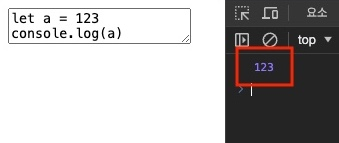

# JS 함수 핵심 패턴

자바스크립트에서 함수(Function)는 1급 객체(First-class object) 혹은 1급 시민(First-class citizen)이라고 부릅니다.
이는 함수를 변수에 할당하거나, 함수를 다른 함수의 인수(값)로 전달하는 등의 방법으로 사용할 수 있다는 것입니다.

이러한 개념에서 시작해, 함수를 사용하는 다양한 패턴을 살펴봅시다.

/// message-box --icon=info
1급 객체란, 1960대 초 도입된 용어로, 특정 요소가 특정 조건을 만족할 때 '1급'이라고 부를 수 있다는 의미입니다.
역사적으로 1급 시민이 사회, 정치, 경제 등에서 특권(대표적으로 참정권)을 가지는 것과 유사한 개념입니다.
///

우선, 1급 객체는 다음과 같은 가능 조건을 만족해야 합니다.

- 변수에 할당(Assginment)
- 인수(Argument)로 전달
- 반환값(Return Value)으로 사용
- 리터럴(Literal) 방식의 생성
- 런타임에서의 멤버(Member, 속성이나 메소드) 사용

```js --caption=1급 객체의 조건을 확인하는 예제.
const a = new Function('cb', 'return cb') // Assignment, Return Value
const b = function () { return 1 } // Literal

const c = a(b) // Argument
c.x = 'B' // set Member

console.log(b.x) // get Member
console.log(c())
// 'B'
// 1
```

## 데이터와 호출

함수는 자바스크립트 데이터이면서 동시에 `()` 기호로 호출 가능한(Callable) 객체입니다.
호출을 하기 전에는 함수 데이터이고, 호출 후에는 `return` 키워드로 반환한 데이터입니다.
따라서 함수를 사용할 때, 단순한 함수 데이터인지 호출한 후의 반환 데이터인지 잘 구분해야 합니다.

```js
function hello() {
  return 'Hello~'
}

console.log(hello) // ƒ hello()
console.log(typeof hello) // 'function'

console.log(hello()) // 'Hello~'
console.log(typeof hello()) // 'string'
```

## 선언과 표현

함수를 생성하는 방법은 크게 두 가지(선언문, 표현식)가 있습니다.

함수 선언문(Declaration)은 `function` 키워드로 시작해 생성한 기명(Named, 이름이 있는) 함수입니다.

```js
function hello() {
  console.log('Hello~')
}
```

함수 표현식(Expression)은 변수 등에 할당해 생성한 함수입니다.

```js
const hello = function() {
  console.log('Hello~')
}
```

함수 표현식은 할당하는 대상에 이름이 있으므로, 기본적으로 익명(Anonymous, 이름이 없는) 함수를 사용합니다.
만약, 기명 함수 선언과 **동시에** 변수에 할당하면, 선언 이름은 사라집니다.

```js
const exp = function dec() {}
exp() // OK!
dec() // Error: dec is not defined
```

### 호이스팅

함수 호이스팅(Hoisting)은 함수 선언부가 유효범위(Scope) 최상단으로 끌어올려지는 현상을 말합니다.
호이스팅을 활용하면, 코드에서 복잡한 함수 로직이 먼저 등장하지 않게 할 수 있습니다.

/// message-box --icon=info
`var` 키워드를 통한 변수 선언에서 발생하는 호이스팅은 대부분 단점으로 작용하지만, 함수 선언에서 발생하는 호이스팅은 상황에 따라 유용하게 활용할 수 있습니다.
///

```js --line-error=2 --caption=함수 선언문과 함수 표현식의 호이스팅 차이
const fruits = getFruits() // OK!
const movies = getMovies() // Error: Cannot access 'getMovies' before initialization
// ...

function getFruits() {
  // 함수 내용...
}
const getMovies = function() {
  // 함수 내용...
}
```

위 코드는 다음과 같이 해석됩니다.

```js --line-error=7 --caption=해석된 코드
// 선언문은 최상단으로 끌어올려짐
function getFruits() {
  // 함수 내용...
}

const fruits = getFruits() // OK!
const movies = getMovies() // Error: Cannot access 'getMovies' before initialization
// ...

const getMovies = function() {
  // 함수 내용...
}
```

## 반환과 종료

`return` 키워드를 사용해 함수를 호출(Call)할 때, 함수 안(In)에서 밖(Out)으로 데이터를 내보낼 수 있습니다.
이것은 데이터를 반환(Reaturn)한다고 표현합니다.

```js
function hello() {
  return 'Hello~'
}
const h = hello()
console.log(h) // 'Hello~'
console.log(hello()) // 'Hello~'
```

`return` 키워드는 함수를 종료하는 역할도 가집니다. 
그러므로 `return` 키워드 아래 명령은 전혀 실행되지 않습니다.

```js --line-error=3
function hello() {
  return 'Hello~' // 여기서 함수가 종료됨!
  console.log('Wow!') // 동작하지 않음!
}
console.log(hello()) // 'Hello~'
```

`return` 키워드를 사용하지 않거나 반환할 데이터 작성을 생략하면, `undefined`가 반환됩니다.

/// message-box --icon=info
보통, 아무것도 반환하지 않는 함수를 보이드(Void) 함수라고 부릅니다.
///

```js
function hello1() {
  //
}
function hello2() {
  return
}
function hello3() {
  return undefined
}

console.log(hello1()) // undefined
console.log(hello2()) // undefined
console.log(hello3()) // undefined
```

## 매개변수 패턴

함수를 호출할 때, 함수 외부에서 함수 내부로 데이터를 전달할 수 있습니다.
이때, 전달받은 데이터가 순서대로 할당돼 함수 내부에서 사용할 수 있도록 만드는 변수를 매개변수(Parameter)라고 부릅니다.

> __매개__ - '서로 떨어진 두 사이를 이어주다', '중개하다'와 같은 의미를 가집니다.

```js
function sum(a, b) {
  return a + b
}
console.log(sum(2, 1)) // 3
console.log(sum(7, 4)) // 11
console.log(sum('A', 'B')) // 'AB'
```

### 기본값

기본값(Default value)이 지정된 매개변수는 `undefined`가 전달되면, 그 대신 기본값을 사용합니다.

/// message-box --icon=info
매개변수에 아무것도 전달하지 않으면, 암시적(Implicit)으로 `undefined`가 할당됩니다.
///

```js
function sum(a, b = 1) {
  return a + b
}
console.log(sum(2)) // 3
console.log(sum(2, undefined)) // 3
console.log(sum()) // NaN <= undefined + 1
```

### 구조 분해 할당

매개변수로 객체나 배열을 전달하는 경우, 구조 분해 할당(Destructuring assignment)을 사용해 특정 멤버를 추출할 수 있습니다.

/// message-box --icon=info
구조 분해 할당 문법은 객체나 배열 데이터에서 사용하는 문법으로, 매개변수에서만 사용하지는 않습니다.
단지, 매개변수에서도 이 문법을 사용할 수 있다는 것으로 알아두세요.
///

```js --line-error=6-8,12-14
const user = {
  name: 'HEROPY',
  age: 85
}

// function getName(user) {
//   return user.name
// }
function getName({ name }) {
  return name
}
// function getEmail(user) {
//   return user.email || '이메일이 없습니다.'
// }
function getEmail({ email = '이메일이 없습니다.' }) { // 구조 분해 할당 + 기본값
  return email
}

console.log(getName(user)) // 'HEROPY'
console.log(getEmail(user)) // '이메일이 없습니다.'
```

화살표 함수 방식을 사용하면, 다음과 같이 훨씬 간결하게 작성할 수 있습니다.

```js
const getName = ({ name }) => name
const getEmail = ({ email = '이메일이 없습니다.' }) => email
```

객체와 같이 배열도 구조 분해 할당을 사용할 수 있습니다.
배열은 객체와 다르게 바로 일치시킬 키(Key)가 없으므로, 순서에 따라 매개변수를 추출해야 합니다.
비교적 간단한 구조나 첫 번째 혹은 두 번째 배열 아이템을 추출할 때 추천되는 방식입니다.

```js --line-error=4,11-13
const fruits = ['Apple', 'Banana', 'Cherry', 'Orange', 'Strawberry']
const numbers = [1, 2, 3, 4, 5, 6, 7]

// function getSecond([a, b]) { // a 변수는 사용하지 않기 때문에 생략 가능!
function getSecond([,b]) {
  return b
}
console.log(getSecond(fruits)) // 'Banana'
console.log(getSecond(numbers)) // 2

// function getFifth([,,,,e]) {
//   return e
// }
function getFifth(items) {
  return items[4]
}
console.log(getFifth(fruits)) // 'Strawberry'
console.log(getFifth(numbers)) // 5
```

### 나머지 매개변수

전개 연산자(Spread operator)를 사용해, 일치하는 순서부터 이후 모든 인수를 매개변수가 배열로 전달받을 수 있습니다.
이렇게 만들어진 매개변수를 나머지 매개변수(Rest parameter)라고 부릅니다.

> '나머지를 모두 가져온다'고 이해하면 쉬워요~

```js --caption=3번째부터 나머지 모든 인수를 배열로 전달받는 예제.
function sum(a, b, ...rest) {
  console.log(a, b, rest) // 1 2 [3, 4, 5, 6, 7, 8]
  return rest.reduce((acc, cur) => acc + cur, 0)
}
const res = sum(1, 2, 3, 4, 5, 6, 7, 8)
console.log(res) // 33
```

나머지 매개변수는 주로 `rest`라는 이름을 사용하지만, 얼마든지 다른 이름을 사용할 수 있습니다.

```js
function sum(a, b, ...xyz) {
  // ...
}
```

### arguments

`arguments`는 모든 함수 안에서 사용 가능한 내장 객체로, 매개변수 없이도 함수로 들어오는 모든 인수를 참조할 수 있습니다.
`arguments`는 배열이 아닌 유사 배열(Array-like)이므로 배열 메소드를 사용할 수 없지만, 반복 가능한(Iterable) 객체이므로 `for` 문으로 순회할 수 있습니다.

/// message-box --icon=info
나머지 매개변수를 사용하면, `arguments` 객체를 사용할 필요가 없습니다.
///

```js --line-active=1
// const sum = (...rest) => rest.reduce((acc, cur) => acc + cur, 0) // 훨씬 간결합니다!
function sum() {
  let res = 0
  for (const item of arguments) {
    res += item
  }
  return res
}

const res = sum(1, 2, 3, 4, 5, 6, 7, 8)
console.log(res) // 36
```

## 화살표 함수

화살표 함수를 사용하면, 앞서 살펴본 일반 함수보다 더 단순하고 간결한 문법으로 함수를 작성할 수 있습니다.
화살표 함수는 기본적으로 익명 함수이며 표현식입니다.

> `=>` 기호가 있으면 화살표 함수이고, 없으면 일반 함수입니다.

/// message-box --icon=warning
일반 함수와 화살표 함수는 단순히 문법의 차이만 있는 것이 아니라, 함수 내부에서 사용하는 `this` 키워드의 동작 방식이 전혀 다릅니다. 
물론 그 외 기능적인 부분은 모두 같습니다.
아래에서 따로 살펴보겠습니다.
///

```js
// 일반 함수
function hello() {
  return 'Hello~'
}
const sum = function(a, b) {
  return a + b
}
const log = function (c) {
  console.log(c)
}

// 화살표 함수
const hello = () => 'Hello~'
const sum = (a, b) => a + b
const log = c => { 
  console.log(c) 
}
```

소괄호(`()`) 생략은 매개변수가 1개인 경우에만 가능합니다.

```js --caption=소괄호 생략 패턴.
const a = () => {} // 매개변수가 없을 경우, 생략 불가.
const b = x => {} // 매개변수 1개인 경우, 생략 가능.
const c = (x, y) => {} // 매개변수가 2개 이상인 경우, 생략 불가.
```

중괄호(`{}`) 생략은 중간 로직 없이 바로 데이터를 반환할 때만 가능합니다.

```js --caption=중괄호 생략 패턴.
const a = x => { // 중간 로직이 없는 경우, 생략 가능.
  return x * x 
}
const b = x => x * x
const c = x => { // 중간 로직이 있는 경우, 생략 불가.
  console.log(x * x)
  return x * x
}

const d = () => {
  return [1, 2, 3] 
}
const e = () => [1, 2, 3] // 생략한 경우.
```

객체 리터럴(Literal)은 중괄호를 사용하기 때문에, 이때는 객체를 소괄호로 감싸줘야(Wrapping) 합니다.

```js --line-error=5 --caption=객체 데이터 반환 패턴.
const g = () => {
  return { a: 1 } 
}
const h = () => ({ a: 1 })
const h = () => { a: 1 } // Error: Unexpected token ':'
```

다음 예제에서, 객체 안의 `fnA`와 `fnB`는 일반 함수이고, `fnC`는 화살표 함수입니다.
`fnA`는 일반 함수 메소드의 축약 표현입니다.

```js
const obj = {
  fnA() {},
  fnB: function () {},
  fnC: () => {}
}
```

## 즉시실행함수(IIFE)

즉시 실행되는 함수 표현(IIFE, Immediately-Invoked Function Expression), 줄여서 '즉시실행함수'는 함수 정의와 동시에 바로 실행(호출)하는 문법입니다.
전역 범위의 변수 오염을 방지하거나 함수 외부에서 내부 변수에 접근하는 것을 차단하는 목적 등으로 활용할 수 있습니다.

/// message-box --icon=info
평소 문장이나 명령의 끝에 세미콜론(`;`)을 사용하지 않는다면, 즉시 실행 함수 앞에 세미콜론을 붙여야 이전 코드와 구분됩니다.
///

```js
// 함수 정의(표현)
const double = () => {
  //
}
// 함수 실행(호출)
double()

// VS

// 함수 정의 및 실행(IIFE)
;(() => {
  //
})()
```

즉시실행함수는 다양한 사용 패턴이 있지만, 되도록 기본 패턴(`;(함수)()`)만 사용하길 권장합니다.
화살표 함수는 기본 패턴만 사용 가능합니다.

```js
;(() => {})()        // (화살표함수)()
;(function () {})()  // (일반함수)()
;(function () {}())  // (일반함수())
;!function () {}()   // !일반함수()
;+function () {}()   // +일반함수()
```

당연하지만, 외부에서는 즉시실행함수 내부 변수에 접근할 수 없습니다.

```js
const a = 7

;(() => {
  const b = 3
  console.log(a, b)
})()

console.log(a, b) // Error: b is not defined
```

외부 변수를 다른 이름으로 내부에서 사용할 수도 있습니다.  
이 방식은 난독화 코드를 만들 때, 사용하기도 합니다.

```js
;((w, d) => {
  console.log(w.innerWidth)
  console.log(d.body)
})(window, document)
```

또한 즉시실행함수를 통해, 별도의 기명 함수를 만들지 않아도, 더 쉽게 `await` 키워드를 사용할 수 있습니다.

```js
;(async () => {
  const res = await fetch('https://jsonplaceholder.typicode.com/users')
  const json = await res.json()
  console.log(json)
})()
```

## 콜백

콜백(Callback) 함수란, 대상 함수의 인수(값)로 사용되는 함수를 말합니다.
콜백 함수를 대상 함수 내부의 원하는 위치에서 호출할 수 있기에 유용합니다.

다음 예제에서 `b` 함수는 `a` 함수의 인수로 사용습니다. 
이때 `b` 함수를 `a` 함수의 콜백 함수라고 부르고, 줄여서 '`a`의 콜백은 `b`이다'라고 표현할 수도 있습니다.

```js --caption=a 함수의 인수로 사용되는 b 함수
const a = callback => {
  console.log('A')
  callback()
}
const b = () => {
  console.log('B')
}

a(b)
// 'A'
// 'B'
```

콜백 함수를 호출할 때 인수를 전달해, 콜백 함수의 매개변수로 사용할 수 있습니다.

```js
function sum(a, b, callback) {
  // 1초 후 실행
  setTimeout(() => {
    callback(a + b)
  }, 1000)
}
sum(3, 7, function(value) {
  console.log(value) // 10 <= 3 + 7
})
```

다음은 콜백을 활용한 이미지 로드 예제입니다.
`Loading...` 텍스트를 우선 출력한 후, 이미지를 로드해 브라우저에 캐싱한 후 텍스트 대신 이미지를 출력합니다.

```html
<div class="container">
  <h1>Loading...</h1>
</div>
```

```js 
const loadImage = (url, cb) => {
  const imgEl = document.createElement('img')
  imgEl.src = url
  imgEl.addEventListener('load', () => {
    cb(imgEl)
  })
}

const containerEl = document.querySelector('.container')
loadImage('https://picsum.photos/2000/1000', imgEl => {
  containerEl.innerHTML = ''
  containerEl.append(imgEl)
})
```

## 호출 스케줄링

Web(Node) API를 통해 제공되는 타이머 함수를 사용해, 함수의 호출을 스케줄링(Scheduling, 정해진 시간 후에 한 번 호출하거나, 정해진 시간마다 반복 호출하는 함수 제공)할 수 있습니다.
그리고 필요한 경우, 각 스케줄(타이머)을 취소(Clear)할 수도 있습니다.

/// message-box --icon=warning
타이머 함수 호출 후 더 이상 필요하지 않으면, 꼭 취소해서 불필요한 메모리 누수(Meomory Leak)를 방지해야 합니다.
///

/// message-box --icon=warning
각 타이머 함수는 Web(Node) API를 통해 제공됩니다.
이는 콜 스택과 이벤트 루프(Call Stack & Event Loop)의 비동기적 특성 때문에, 시간 오차(Clock drift)가 발생할 수 있습니다.
만약 정확한 시간을 보장해야 하는 상황이라면, [TaskTimer](https://github.com/onury/tasktimer) 같은 라이브러리를 사용하는 것을 추천합니다.
///

| 함수 | 설명 | 문법 |
| --- | --- | --- |
| `setTimeout()` | 정해진 시간 후에 콜백을 한 번 호출 | `const 타이머ID = setTimeout(콜백, 시간)` |
| `clearTimeout()` | setTimeout의 타이머를 취소 | `clearTimeout(타이머ID)` |
| `setInterval()` | 정해진 시간마다 콜백을 반복 호출 | `const 타이머ID = setInterval(콜백, 시간)` |
| `clearInterval()` | setInterval의 타이머를 취소 | `clearInterval(타이머ID)` |

```js --caption=setTimeout 예제.
// 5초 후에 콜백을 한 번 호출.
const timeout = setTimeout(() => {
  console.log('Hello~')
}, 5000)

// 버튼을 클릭하면 타이머를 취소.
const btnEl = document.querySelector('button')
btnEl.addEventListener('click', () => {
  console.log('Clear Timeout!')
  clearTimeout(timeout)
})
```

```js --caption=setInterval 예제.
// 2초마다 콜백을 반복 호출.
const timeout = setInterval(() => {
  console.log('Hello~')
}, 2000)

// 버튼을 클릭하면 타이머를 취소.
const btnEl = document.querySelector('button')
btnEl.addEventListener('click', () => {
  console.log('Clear Interval!')
  clearTimeout(timeout)
})
```

## 재귀

재귀(Recursive)란, 함수가 자기 내부에서 자신을 다시 호출하는 것을 말합니다.
재귀를 사용해, 정확히 종료 시점을 알 수 없는 반복 호출 패턴을 구현합니다.

> __재귀__ - 원래의 곳으로 돌아가는 것을 말합니다.

/// message-box --icon=warning
재귀 함수는 반복의 종료 조건이 없으면, 무한 반복으로 인해 스택 오버플로(Stack Overflow)가 발생할 수 있습니다.
///

다음은 `userD`에서 출발해, 최상위 부모 객체를 찾는 예제입니다.

```js
const userA = { name: 'A', parent: null }
const userX = { name: 'X', parent: null }
const userY = { name: 'Y', parent: userX }
const userB = { name: 'B', parent: userA }
const userC = { name: 'C', parent: userB }
const userD = { name: 'D', parent: userC }

const getRootUser = user => {
  if (user.parent) { // parent 속성의 값이 참(Truthy)인 경우, 재귀 호출
    return getRootUser(user.parent)
  }
  return user
}

console.log(getRootUser(userD)) // userA 객체!
```

## 렉시컬 스코프

함수의 렉시컬 스코프(Lexical Scope)란, 정적 스코프(Static Scope)라고도 하며, 함수를 선언한 위치에서 유효하게 접근 가능한 범위(유효범위)를 말합니다.
간단하게는 전역(Global)을 포함한 선언된 함수의 상위 함수 범위로 이해할 수 있습니다.

다음 예제에서, `fnC` 함수는 렉시컬 스코프의 `window`, `a`, `b`, `c` 객체를 모두 참조할 수 있습니다.
`fnX` 함수는 `fnC` 함수의 상위 함수가 아니므로, 접근 가능하지 않습니다.

```js --line-error=14
const a = {
  name: 'A',
  fnA() {
    const b = {
      name: 'B',
      fnB() {
        const c = {
          name: 'C',
          fnC() {
            console.log(window) // window 객체
            console.log(a) // a 객체
            console.log(b) // b 객체
            console.log(c) // c 객체
            console.log(d) // Error: d is not defined
          }
        }
        return c
      }
    }
    return b
  },
  fnX() {
    const d = {
      name: 'D'
    }
  }
}
a.fnA().fnB().fnC()
```

## this

`this` 키워드는 함수 내부에서 동적으로 결정되는 특수한 식별자입니다.
`this` 키워드는 '일반 함수'와 '화살표 함수'에 따라 다르게 정의되므로, 주의해서 사용해야 합니다.

`function` 키워드를 사용하는 일반 함수는 자신을 호출하는 위치에서 `this`가 정의됩니다.
즉, 호출할 때의 상황에 따라 `this`가 달라지기 때문에 동적입니다.
따라서 호출 전에는 `this`가 무엇인지 알 수 없습니다.

반면, 화살표 함수는 자신이 선언된 렉시컬 범위(부모 함수)에서(정적으로) `this`가 정의됩니다.
즉, 선언된 위치로 고정되기 때문에 정적입니다.

| 함수 | this 정의 | 스코프 |
| --- | --- | --- |
| 일반 함수 | 호출 위치에서 정의됨 | 동적(Dynamic) |
| 화살표 함수 | 선언 위치에서 정의됨 | 정적(Static) |

다음 예제에서, 
일반 함수인 `getFullA`는 호출 위치에서 `this`가 정의되기 때문에, 호출되는 위치(`u.getFullA()`)에서의 대상 객체 `u`가 곧 `this`가 됩니다.
화살표 함수인 `getFullB`는 선언 위치의 부모 함수에서 `this`가 정의되기 때문에, `user()` 부모 함수에서의 `utils` 객체가 곧 `this`가 됩니다.

```js --line-active=13,19
const utils = {
  first: 'Neo',
  last: 'Anderson',
  user() {
    console.log(this) // utils 객체
    return {
      first: 'Heropy',
      last: 'Park',
      age: 85,
      getFullA() {
        return `${this.first} ${this.last}`
      },
      getFullB: () => `${this.first} ${this.last}` // 화살표 함수의 this가 정의되는 위치(선언할 때)
    }
  }
}

const u = utils.user()
console.log(u.getFullA()) // 'Heropy Park' / 일반 함수의 this가 정의되는 위치(호출할 때)
console.log(u.getFullB()) // 'Neo Anderson'
```

다음 예제에서, `setTimeout` 함수의 콜백은 일반 함수이므로 호출 위치에서 `this`가 정의됩니다.
`setTimeout` 함수는 Web(Node) API를 통해 제공되는 함수이므로, 정확히 어디에서 어떻게 호출되는지 알 수는 없지만, 결과적으로 `this`는 `window` 객체가 됩니다.

```js --line-active=4 --caption=일반 함수 콜백
const timer = {
  title: 'TIMER!',
  timeout() {
    setTimeout(function () {
      console.log(this.title) // undefined
      console.log(this) // window 객체
    }, 1000)
  }
}

timer.timeout()
```

다음과 같이, `setTimeout` 함수의 콜백에서 화살표 함수를 사용하면, 선언 위치의 부모 함수에서 `this`가 정의되기 때문에, `timer` 객체가 곧 `this`가 됩니다.

```js --line-active=4 --caption=화살표 함수 콜백
const timer = {
  title: 'TIMER!',
  timeout() {
    setTimeout(() => {
      console.log(this.title) // 'TIMER!'
      console.log(this) // timer 객체
    }, 1000)
  }
}

timer.timeout()
```

만약 `timeout` 함수를 화살표 함수로 작성하면, `this` 키워드의 정의가 달라집니다.

/// message-box --icon=info
자바스크립트 모듈(Module)의 최상위 스코프는 `window` 객체가 아닌 `undefined`입니다.
///

```js --line-active=3 --caption=모듈에서의 코드
const timer = {
  title: 'TIMER!',
  timeout: () => {
    setTimeout(() => {
      console.log(this.title) // Error: Cannot read properties of undefined (reading 'title')
      console.log(this) // undefined
    }, 1000)
  }
}

timer.timeout()
```

### call, apply, bind

`.call()`, `.apply()`, `.bind()` 메소드를 통해, 일반 함수를 호출할 때 `this` 키워드를 원하는 객체로 지정할 수 있습니다.

/// message-box --icon=warning
화살표 함수는 선언 위치에서 이미 `this` 정의가 끝났기 때문에, `call`, `apply`, `bind` 메소드를 사용해도 `this`가 변하지 않습니다.
///

다음 예제에서, `heropy` 객체는 `getName` 메소드가 없지만, `amy` 객체와 동일하게 `name` 속성을 가지고 있으므로, `getName` 메소드를 호출할 수 있는 구조입니다.

```js --caption=getName 메소드가 있는 객체와 없는 객체
const amy = {
  name: 'Amy',
  getName(age) {
    return `${this.name} is ${age}`
  }
}
const heropy = {
  name: 'Heropy'
}
```

그렇다면 다음과 같이, `heropy` 객체도 `.call()`, `.apply()`, `.bind()` 메소드를 통해 `amy` 객체의 `getName` 메소드를 사용할 수 있습니다.
이때, `.call()`와 `.bind()` 메소드는 인수가 필요한 경우, 두 번째부터 순서대로 전달합니다.
`.apply()` 메소드는 인수가 필요한 경우, 배열에서 순서대로 정리해 두 번째 인수로 전달합니다.

아래 예제들은 모두 `'Heropy is 85'`를 콘솔에 출력합니다.

> '객체'가 '함수'를 빌려서 사용(호출)한다고 생각하면 쉽습니다.

```js --caption=call 메소드
// 함수.call(객체, 인수1, 인수2, ...)
console.log(
  amy.getName.call(heropy, 85)
)
```

```js --caption=apply 메소드
// 함수.apply(객체, [인수1, 인수2, ...])
console.log(
  amy.getName.apply(heropy, [85])
)
```

`.bind()`는 대상 함수를 바로 호출하지 않고, 첫 번째 인수로 전달한 객체와 `this`를 연결(Bind)한 새로운 함수를 반환합니다.
따라서 그 새로운 함수를 호출해야 하고, 호출 지연(Delay)이 필요한 경우 유용합니다.

```js --caption=bind 메소드
// const 객체와_연결된_함수 = 함수.bind(객체, 인수1, 인수2, ...)
const heropysGetName = amy.getName.bind(heropy)
console.log(heropysGetName(85))
```

## 클로저

클로저(Closure)는 함수가 선언될 때의 렉시컬 스코프를 기억하고 있다가, 함수가 호출될 때 그 스코프에 접근할 수 있는 개념(특성)을 말합니다.

다음 예제를 보면, `createCount` 함수에서 반환된 `count` 함수를 호출할 때마다 자신의 렉시컬 스코프에서 `c` 변수를 참조해 값이 하나씩 증가합니다.
`createCount` 함수는 호출 후 종료되었지만, 내부 `c` 변수의 값이 사라지지 않고 계속 유지되고 있습니다.
그리고 `c` 변수는 외부에서 접근할 수 없어, Private 접근 제어 속성처럼 정보 은닉(Information Hiding)의 목적으로도 활용할 수 있습니다.

```js
function createCount() {
  let c = 0
  return function () {
    return (c += 1)
  }
}

const count = createCount()
console.log(count()) // 1
console.log(count()) // 2
console.log(count()) // 3
```

그리고 클로저는 독립적인 렉시컬 스코프를 유지합니다.
따라서 다음과 같이 여러 개의 클로저를 생성해 활용할 수도 있습니다.

```js
function createCount(start) {
  let c = start
  return function () {
    return (c += 1)
  }
}

const countA = createCount(0)
console.log(countA())  // 1
console.log(countA())  // 2
console.log(countA())  // 3

const countB = createCount(77)
console.log(countB())  // 78
console.log(countB())  // 79
console.log(countB())  // 80
```

만약 클로저가 더 이상 필요하지 않다면, 메모리 절약을 위해 함수에 `null`을 할당해 참조를 제거할 수 있습니다.
재할당을 위해선, `let` 키워드가 필요합니다.

```js --line-active=1
let countA = createCount(0)
console.log(countA())  // 1
console.log(countA())  // 2
console.log(countA())  // 3

countA = null // 참조 제거!
```

클로저를 사용하는 좀 더 유용한 예제를 살펴봅시다.
다음과 같이 HTML 구조를 가지고 있을 때,

```html
<h1>Hello world!</h1>
<h2>Hello world!</h2>
```

만약 클로저를 사용하지 않으면, 다음과 같이 각각의 이벤트 핸들러에서 사용할 데이터를 외부에서 별도로 관리해야 합니다.

```js
const h1El = document.querySelector('h1')
const h2El = document.querySelector('h2')

// 외부에서 별도의 상태(데이터) 관리가 필요!
let h1IsRed = false
let h2IsRed = false

h1El.addEventListener('click', event => {
  h1IsRed = !h1IsRed
  h1El.style.color = h1IsRed ? 'red' : 'black'
})
h2El.addEventListener('click', event => {
  h2IsRed = !h2IsRed
  h2El.style.color = h2IsRed ? 'red' : 'black'
})
```

하지만 클로저를 사용하면, 각각의 이벤트 핸들러에서 사용할 데이터를 함수 내부에서 쉽게 관리할 수 있습니다.

```js
const h1El = document.querySelector('h1')
const h2El = document.querySelector('h2')

// 하나의 함수로 정리!
const createToggleHandler = () => {
  let isRed = false
  return event => {
    isRed = !isRed
    event.target.style.color = isRed ? 'red' : 'black'
  }
}
h1El.addEventListener('click', createToggleHandler())
h2El.addEventListener('click', createToggleHandler())
```

## 함수 커링

커링(Currying)은, 여러 개의 인수를 받는 함수에서, 인수를 한 번에 하나씩 받는 함수로 나누어서 순차적으로 호출하는 기법을 말합니다.
이는 함수의 재사용성, 가독성, 유연성 등을 확보하는 데 도움이 됩니다.

/// message-box --icon=info
커링은 수학자 해스켈 커리(Haskell Curry)의 이름에서 유래했습니다.
///

다음 예제에서, `myConsole` 함수는 두 개의 인수를 받아 처리합니다.
호출할 때마다, `console` 객체의 `log`, `warn`, `error` 메소드 이름을 받아 사용합니다.

```js --caption=커링을 사용하지 않은 경우.
function myConsole(level, message) {
  console[level](message)
}

myConsole('log', 'Hello world~')
myConsole('warn', 'Danger ahead!')
myConsole('error', 'Error: system failure..')
```

위 예제에 커링을 적용해, 다음과 같이 수정할 수 있습니다.
이제 두 개의 인수를 받는 함수에서 각 하나의 인수를 받는 함수로 나눠 순차적으로 호출할 수 있습니다.
하지만 호출 방식을 보면, 커링이 여러 개 인수 방식과 비교해 특별히 유용해 보이지는 않습니다.

```js --caption=커링을 사용한 경우.
function useConsole(level) {
  return function(message) {
    console[level](message)
  }
}

useConsole('log')('Hello world~')
useConsole('warn')('Danger ahead!')
useConsole('error')('Error: system failure..')
```

위 예제의 커링을 다음과 같이 수정하면, 훨씬 유용합니다.
`useConsole` 함수 호출의 반환 함수를 각 변수에 할당해, 필요할 때마다 호출할 수 있습니다.

```js --caption=커링을 사용한 경우.
function useConsole(level) {
  return function(message) {
    console[level](message)
  }
}

const log = useConsole('log')
const warn = useConsole('warn')
const error = useConsole('error')

log('Hello world~')
warn('Danger ahead!')
error('Error: system failure..')
```

만약, 기존에 사용하던 함수를 커링으로 변경하고 싶다면, [Lodash](https://lodash.com/docs/4.17.15#curry) 라이브러리의 `curry()` 메소드를 사용할 수 있습니다.

```html
<script src="https://cdnjs.cloudflare.com/ajax/libs/lodash.js/4.17.21/lodash.min.js" integrity="sha512-WFN04846sdKMIP5LKNphMaWzU7YpMyCU245etK3g/2ARYbPK9Ub18eG+ljU96qKRCWh+quCY7yefSmlkQw1ANQ==" crossorigin="anonymous" referrerpolicy="no-referrer"></script>
```

```js --caption=Lodash curry() 메소드를 통해 커링.
function myConsole(level, message) {
  console[level](message)
}

const useConsole = _.curry(myConsole)

const log = useConsole('log')
const warn = useConsole('warn')
const error = useConsole('error')

log('Hello world~')
warn('Danger ahead!')
error('Error: system failure..')
```

## Function 클래스

`Function` 클래스의 생성자 호출로 함수를 만들 수도 있습니다.
매개변수나 기타 로직을 문자로 제공할 수 있어, 서버에서 가져온 문자, 사용자가 입력한 문자 등을 통해 동적으로 함수를 만들어 사용할 수 있습니다.

```js
const sum = new Function('a', 'b', `
  console.log(a)
  console.log(b)
  return a + b
`)

console.log(sum(1, 7)) 
// 1
// 7
// 8
```

다음은 `<textarea>` 요소에서 입력한 값으로 함수를 호출하는 예제입니다.

```js
let text = ''
const textareaEl = document.querySelector('textarea')
textareaEl?.addEventListener('input', () => {
  text = textareaEl.value
})
textareaEl?.addEventListener('change', event => {
  new Function(text)()
})
```



## 팩토리 함수

팩토리 함수((Factory function)는, 객체를 반환하는 함수를 말합니다.
팩토리 함수를 사용해 객체 생성과 관련된 세부 로직을 숨기고 사용자에게 간단한 인터페이스를 제공(캡슐화)하고 함수의 재사용성을 높일 수 있습니다.

```js
const createUser = (full, birth) => ({
  firstName: full.split(' ')[0],
  lastName: full.split(' ')[1],
  age: new Date().getFullYear() - birth,
  birth,
  greet() {
    return `Hello, My name is ${this.firstName}! I'm ${this.age}.`
  }
})
const userA = createUser('Neo Anderson', 1985)
console.log(userA.greet()) // 'Hello, My name is Heropy! I'm 38.'

const userB = createUser('Amy Pond', 1916)
console.log(userB.firstName) // 'Amy'
```

## 고차 함수

함수를 인수로 전달(콜백)하거나 반환값으로 사용하는 함수를 고차 함수(Higher-order function)라고 부릅니다.
고차 함수는 함수형 프로그래밍(Functional Programming)의 핵심적인 개념이며, 고차 함수를 통해 로직을 모듈화하고 데이터 불변성(Immutability)을 지향하도록 코드를 작성할 수 있습니다.

```js
// 모듈화
const add = (a, b) => a + b
const sub = (a, b) => a - b
const mul = (a, b) => a * b
const div = (a, b) => a / b

const calculate = (fn, a, b) => fn(a, b)

console.log(calculate(add, 1, 2)) // 3
console.log(calculate(sub, 1, 2)) // -1
console.log(calculate(mul, 1, 2)) // 2
console.log(calculate(div, 1, 2)) // 0.5
```

평소 쉽게 접할 수 있는 고차 함수로 `.map()`, `.filter()` 등의 배열 메소드를 꼽을 수 있습니다.
각 메소드는 원본 데이터를 직접 수정하지 않고, 새로운 배열을 반환합니다.

```js
const numbers = [1, 2, 3, 4, 5]

// .map()
const doubles = numbers.map(item => item * 2)
console.log(doubles) // [2, 4, 6, 8, 10]
console.log(numbers) // [1, 2, 3, 4, 5]

// .filter()
const evens = numbers.filter(item => item % 2 === 0)
console.log(evens) // [2, 4]
console.log(numbers) // [1, 2, 3, 4, 5]
```