## 개요

[Intersection observer](https://developer.mozilla.org/en-US/docs/Web/API/Intersection_Observer_API)는 브라우저 뷰포트(Viewport)와 설정한 요소(Element)의 교차점을 관찰하며, 요소가 뷰포트에 포함되는지 포함되지 않는지, 더 쉽게는 사용자 화면에 지금 보이는 요소인지 아닌지를 구별하는 기능을 제공합니다.

이 기능은 비동기적으로 실행되기 때문에, `scroll` 같은 이벤트 기반의 요소 관찰에서 발생하는 [렌더링 성능](https://developers.google.com/web/fundamentals/performance/rendering/?hl=ko)이나 이벤트 연속 호출 같은 문제 없이 사용할 수 있습니다.

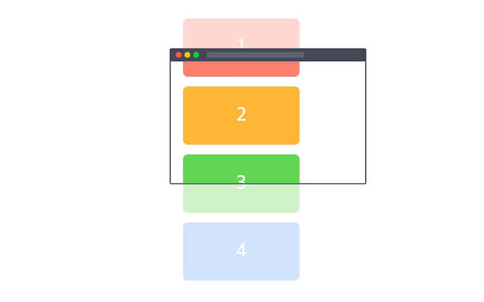

`new IntersectionObserver()`를 통해 생성한 인스턴스(`io`)로 관찰자(Observer)를 초기화하고 관찰할 대상([Element](https://developer.mozilla.org/ko/docs/Web/API/Element))을 지정합니다.
생성자는 2개의 인수(`callback`, `options`)를 가집니다.

```js
const io = new IntersectionObserver(callback, options) // 관찰자 초기화
io.observe(element) // 관찰할 대상(요소) 등록
```

## 콜백

관찰할 대상(Target)이 등록되거나 가시성(Visibility, 보이는지 보이지 않는지)에 변화가 생기면 관찰자는 콜백(Callback)을 실행합니다.
콜백은 2개의 인수(`entries`, `observer`)를 가집니다.

```js
const options = {}
const io = new IntersectionObserver((entries, observer) => {}, options)
io.observe(element)
```

### entries

`entries`는 [IntersectionObserverEntry](https://developer.mozilla.org/en-US/docs/Web/API/IntersectionObserverEntry) 인스턴스의 <strong>배열</strong>로, `.observe()` 메소드로 관찰하는 대상들을 의미합니다.
IntersectionObserverEntry는 읽기 전용(Read only)의 다음 속성들을 포함합니다.

- `boundingClientRect`: 관찰 대상의 사각형 정보([DOMRectReadOnly](https://developer.mozilla.org/en-US/docs/Web/API/DOMRectReadOnly))
- `intersectionRect`: 관찰 대상의 교차한 영역 정보([DOMRectReadOnly](https://developer.mozilla.org/en-US/docs/Web/API/DOMRectReadOnly))
- `intersectionRatio`: 관찰 대상의 교차한 영역 백분율(`intersectionRect` 영역에서 `boundingClientRect` 영역까지 비율, Number)
- `isIntersecting`: 관찰 대상의 교차 상태(Boolean)
- `rootBounds`: 지정한 루트 요소의 사각형 정보([DOMRectReadOnly](https://developer.mozilla.org/en-US/docs/Web/API/DOMRectReadOnly))
- `target`: 관찰 대상 요소([Element](https://developer.mozilla.org/en-US/docs/Web/API/Element))
- `time`: 변경이 발생한 시간 정보([DOMHighResTimeStamp](https://developer.mozilla.org/en-US/docs/Web/API/DOMHighResTimeStamp))

```js
const io = new IntersectionObserver((entries, observer) => {
  entries.forEach(entry => {
    console.log(entry) // entry is 'IntersectionObserverEntry'
  })
}, options)

io.observe(element1) // 관찰 대상 1
io.observe(element2) // 관찰 대상 2
// ...
```

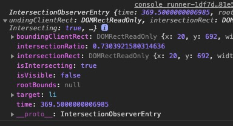

#### entry.boundingClientRect

관찰 대상의 사각형 정보([DOMRectReadOnly](https://developer.mozilla.org/en-US/docs/Web/API/DOMRectReadOnly))를 반환합니다.
이 값은, `Element.getBoundingClientRect()`를 사용해 동일하게 얻을 수 있습니다.(`getBoundingClientRect` 호출에서 [Reflow 현상](https://developers.google.com/speed/docs/insights/browser-reflow?hl=ko)이 발생합니다.)

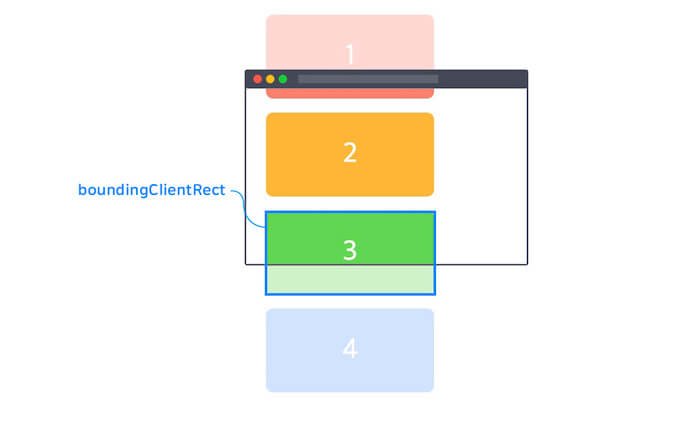
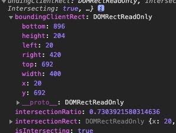
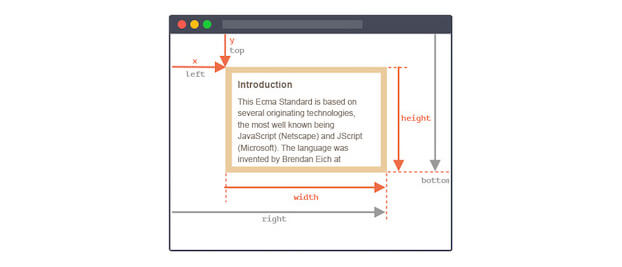

#### entry.intersectionRect

관찰 대상과 루트 요소와의 교차하는(겹치는) 영역에 대한 사각형 정보([DOMRectReadOnly](https://developer.mozilla.org/en-US/docs/Web/API/DOMRectReadOnly))를 반환합니다.

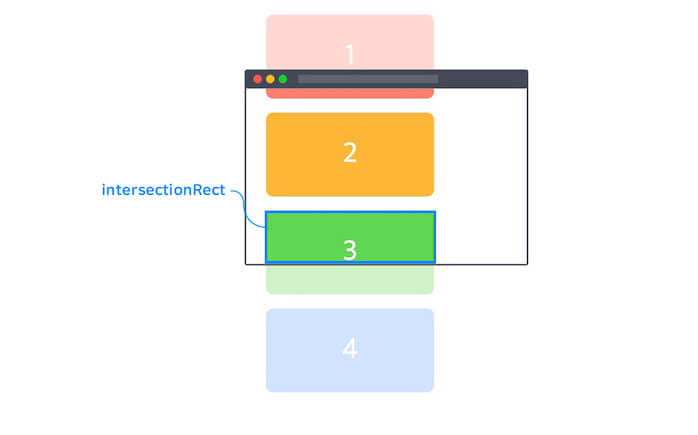

#### entry.intersectionRatio

관찰 대상이 루트 요소와 얼마나 교차하는(겹치는)지의 수치를 `0.0`과 `1.0` 사이의 숫자로 반환합니다.
이는 `intersectionRect` 영역과 `boundingClientRect` 영역의 비율을 의미합니다.

#### entry.isIntersecting

관찰 대상이 루트 요소와 교차 상태로 들어가거나(`true`) 교차 상태에서 나가는지(`false`) 여부를 나타내는 값(Boolean)입니다.

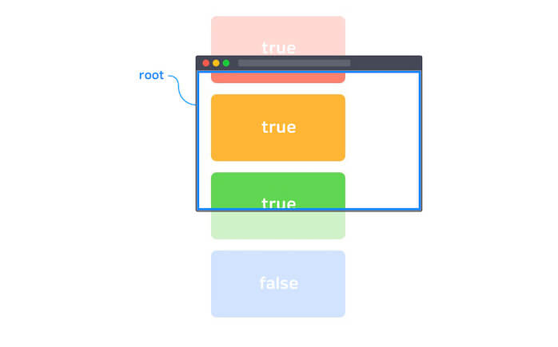

#### entry.rootBounds

루트 요소에 대한 사각형 정보([DOMRectReadOnly](https://developer.mozilla.org/en-US/docs/Web/API/DOMRectReadOnly))를 반환합니다.
이는 옵션 `rootMargin`에 의해 값이 변경되며, 만약 별도의 루트 요소(옵션 `root`)를 선언하지 않았을 경우 `null`을 반환합니다.

#### entry.target

관찰 대상([Element](https://developer.mozilla.org/ko/docs/Web/API/Element))을 반환합니다.

#### entry.time

문서가 작성된 시간을 기준으로 교차 상태 변경이 발생한 시간을 나타내는 [DOMHighResTimeStamp](https://developer.mozilla.org/en-US/docs/Web/API/DOMHighResTimeStamp)를 반환합니다.

### observer

콜백이 실행되는 해당 인스턴스를 참조합니다.

```js
const io = new IntersectionObserver((entries, observer) => {
  console.log(observer)
}, options)

io.observe(element)
```

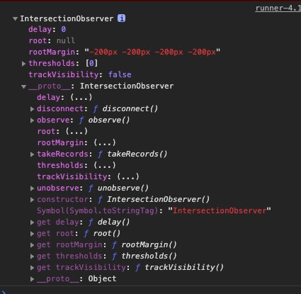

## 옵션

관찰 범위를 설정하기 위한 몇 가지 옵션을 사용할 수 있습니다.

### root

관찰 대상의 가시성을 검사하기 위해 뷰포트 대신 사용할 요소 객체(루트 요소)를 지정합니다.
관찰 대상의 조상 요소이어야 하며 지정하지 않거나 `null`일 경우 브라우저의 뷰포트가 기본 사용됩니다.
기본값은 `null`입니다.

```js
const io = new IntersectionObserver(callback, {
  root: document.getElementById('my-viewport')
})
```

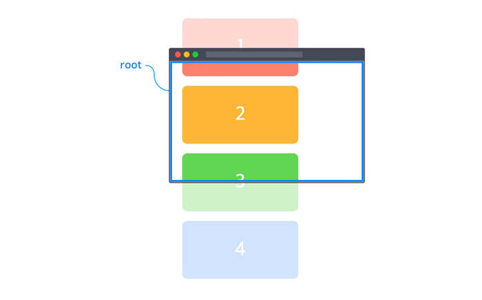

### rootMargin

바깥 여백(Margin)을 이용해 Root 범위를 확장하거나 축소할 수 있습니다.
CSS의 `margin`과 같이 4단계로 여백을 설정할 수 있으며, `px` 또는 `%`로 나타낼 수 있습니다.
기본값은 `0px 0px 0px 0px`이며 <strong>단위를 꼭 입력</strong>해야 합니다.

- TOP, RIGHT, BOTTOM, LEFT / e.g. `10px 0px 30px 0px`
- TOP, (LEFT, RIGHT), BOTTOM / e.g. `10px 0px 30px`
- (TOP, BOTTOM), (LEFT, RIGHT) / e.g. `30px 0px`
- (TOP, BOTTOM, LEFT, RIGHT) / e.g. `30px`

```js
const io = new IntersectionObserver(callback, {
  rootMargin: '200px 0px'
})
```

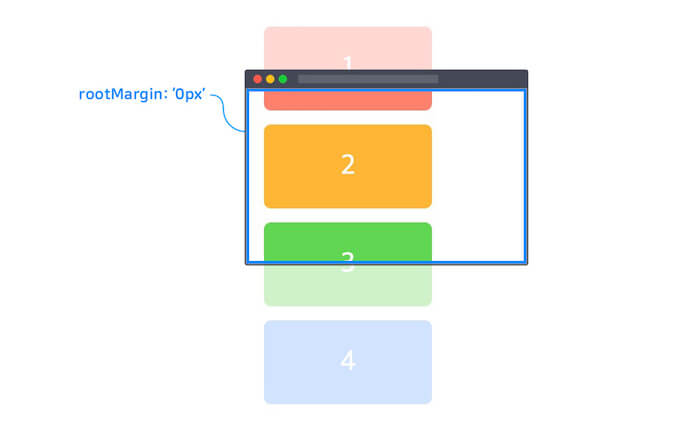
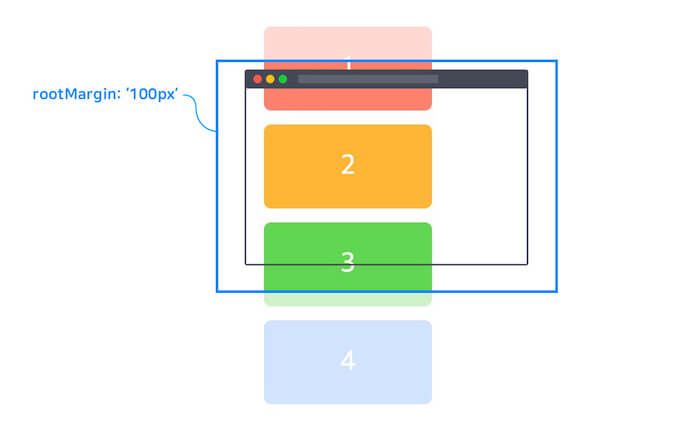
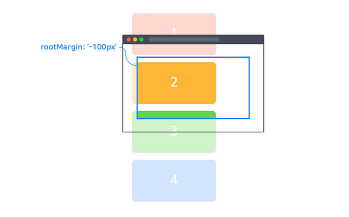

### threshold

옵저버가 실행되기 위해 관찰 대상의 가시성이 얼마나 필요한지 백분율로 표시합니다.
기본값은 Array 타입의 `[0]`이지만 Number 타입의 단일 값으로도 작성할 수 있습니다.

- `0`: 관찰 대상의 가장자리 픽셀이 Root 범위를 교차하는 순간(관찰 대상의 가시성이 0%일 때) 옵저버가 실행됩니다.
- `0.3`: 관찰 대상의 가시성 30%일 때 옵저버가 실행됩니다.
- `[0, 0.3, 1]`: 관찰 대상의 가시성이 0%, 30%, 100%일 때 모두 옵저버가 실행됩니다.

```js
const io = new IntersectionObserver(callback, {
  threshold: 0.3 // or `threshold: [0.3]`
})
```

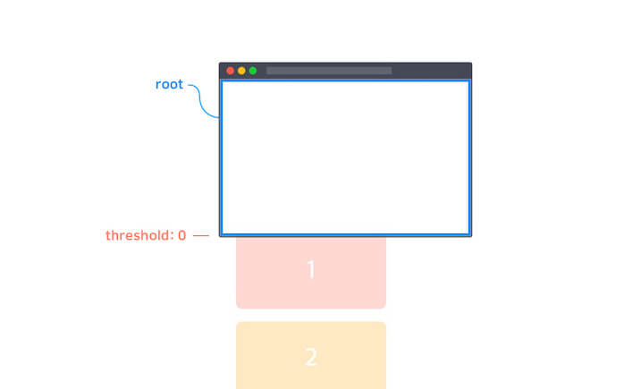
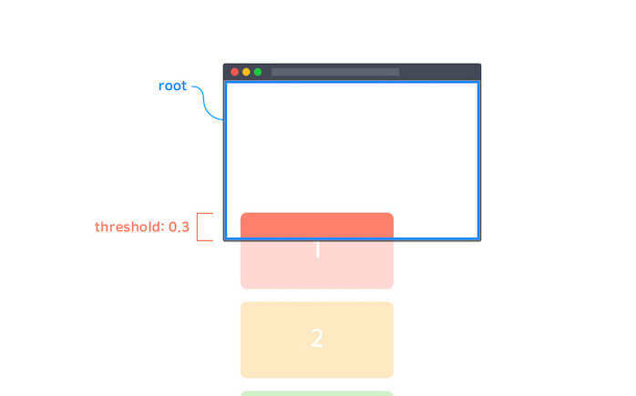
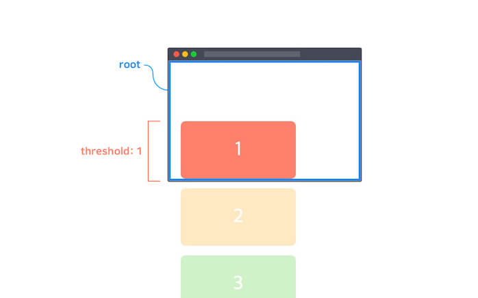

## 메소드

### observe

대상 요소의 관찰을 시작합니다.

```js
const io1 = new IntersectionObserver(callback, options)
const io2 = new IntersectionObserver(callback, options)

const div = document.querySelector('div')
const li = document.querySelector('li')
const h2 = document.querySelector('h2')

io1.observe(div) // DIV 요소 관찰
io2.observe(li) // LI 요소 관찰
io2.observe(h2) // h2 요소 관찰
```

### unobserve

대상 요소의 관찰을 중지합니다.
관찰을 중지할 하나의 대상 요소를 인수로 지정해야 합니다.
단, IntersectionObserver 인스턴스가 관찰하고 있지 않은 대상 요소가 인수로 지정된 경우 아무런 동작도 하지 않습니다.

```js
const io1 = new IntersectionObserver(callback, options)
const io2 = new IntersectionObserver(callback, options)

// ...

io1.observe(div)
io2.observe(li)
io2.observe(h2)

io1.unobserve(h2) // nothing..
io2.unobserve(h2) // H2 요소 관찰 중지
```

콜백의 두 번째 인수 `observer`가 해당 인스턴스를 참조하므로, 다음과 같이 작성할 수도 있습니다.

```js
const io1 = new IntersectionObserver((entries, observer) => {
  entries.forEach(entry => {
    // 가시성의 변화가 있으면 관찰 대상 전체에 대한 콜백이 실행되므로,
    // 관찰 대상의 교차 상태가 false일(보이지 않는) 경우 실행하지 않음.
    if (!entry.isIntersecting) {
      return
    }
    // 관찰 대상의 교차 상태가 true일(보이는) 경우 실행.
    // ...

    // 위 실행을 처리하고(1회) 관찰 중지
    observer.unobserve(entry.target)
  })
}, options)
```

### disconnect

IntersectionObserver 인스턴스가 관찰하는 모든 요소의 관찰을 중지합니다.

```js
const io1 = new IntersectionObserver(callback, options)
const io2 = new IntersectionObserver(callback, options)

// ...

io1.observe(div)
io2.observe(li)
io2.observe(h2)

io2.disconnect() // io2가 관찰하는 모든 요소(LI, H2) 관찰 중지
```

## 지원

각 프론트엔드 프레임워크에서 Intersection Observer를 보다 쉽게 사용할 수 있는 라이브러리가 있습니다.
간단한 사용법을 소개하니, 자세한 내용은 각 라이브러리 문서를 참고하세요.

### React

https://www.npmjs.com/package/react-intersection-observer

`useInView` 훅의 반환으로 `ref`와 `inView`를 사용할 수 있습니다.
`ref`는 관찰할 대상 요소에 연결합니다.
`inView`는 관찰 대상의 교차 상태(Boolean)를 나타내는 반응형 데이터입니다.

```bash
npm i react-intersection-observer
```

```tsx
import { useEffect } from 'react'
import { useInView } from 'react-intersection-observer'

export default function Component() {
  const { ref, inView } = useInView({
    rootMargin: '200px 0px',
    threshold: 0.3
  })

  useEffect(() => {
    if (inView) {
      console.log('Intersecting!')
    }
  }, [inView])

  return (
    <section ref={ref}>
      <h2>Hello Intersection Observer!</h2>
      <p>See me? {inView ? 'Yes' : 'No'}</p>
    </section>
  )
}
```

### Vue

https://vueuse.org/core/useIntersectionObserver/

`useIntersectionObserver`는 관찰 대상, 콜백, 옵션 인수로 순서대로 받아 사용합니다.

```bash
npm i @vueuse/core
```

```vue
<script setup lang="ts">
import { ref } from 'vue'
import { useIntersectionObserver } from '@vueuse/core'

const target = ref<HTMLElement | null>(null)
const inView = ref(false)

useIntersectionObserver(
  target,
  ([{ isIntersecting }]) => {
    inView.value = isIntersecting
    console.log('Intersecting!')
  },
  {
    rootMargin: '200px 0px',
    threshold: 0.3
  }
)
</script>

<template>
  <section ref="target">
    <h2>Hello Intersection Observer!</h2>
    <p>See me? {{ inView ? 'Yes' : 'No' }}</p>
  </section>
</template>
```

### Svelte

https://github.com/metonym/svelte-intersection-observer

`IntersectionObserver` 컴포넌트를 사용해, 관찰 대상 참조와 교차 상태 데이터를 연결합니다.
반응형 구문(`$:`)을 사용해 교차 상태에 따른 동작을 처리합니다.

```bash
npm i svelte-intersection-observer
```

```svelte
<script lang="ts">
	import IntersectionObserver from 'svelte-intersection-observer'

	let element: HTMLElement
	let intersecting: boolean

	$: if (intersecting) {
		console.log('Intersecting!')
	}
</script>

<IntersectionObserver
	bind:intersecting
	{element}
	rootMargin="200px 0px"
	threshold={0.3}>
	<section bind:this={element}>
		<h2>Hello Intersection Observer!</h2>
		<p>See me? {intersecting ? 'Yes' : 'No'}</p>
	</section>
</IntersectionObserver>
```

### polyfill

IntersectionObserver API를 지원하지 않는 브라우저(MSIE)에서도 사용할 수 있도록 공식적으로 [라이브러리](https://github.com/w3c/IntersectionObserver/tree/master/polyfill)가 지원됩니다.
따로 설정할 것 없이 모듈을 가져오기만 하면 됩니다.

```bash
npm i intersection-observer
```

```js
// For IE
import 'intersection-observer'

// 동일하게 사용하면 됩니다.
const io = new IntersectionObserver(callback, options)

const els = document.querySelectorAll('element')
// For IE
Array.prototype.slice.call(els).forEach(el => {
  io.observe(el)
})
```

혹은 다음과 같이 전역으로 사용할 수도 있습니다.

```html
<script src="https://polyfill.io/v3/polyfill.min.js?features=IntersectionObserver"></script>
```

## 예제

### Infinite scroll

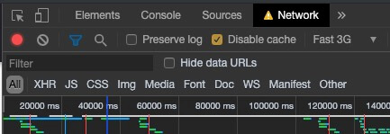

<iframe height="700" style="width: 100%;" scrolling="no" title="Infinite scroll" src="https://codepen.io/heropark/embed/LYYjMQp?height=265&theme-id=0&default-tab=js,result" frameborder="no" allowtransparency="true" allowfullscreen="true">
  See the Pen <a href='https://codepen.io/heropark/pen/LYYjMQp'>Infinite scroll</a> by park young woong
  (<a href='https://codepen.io/heropark'>@heropark</a>) on <a href='https://codepen.io'>CodePen</a>.
</iframe>
