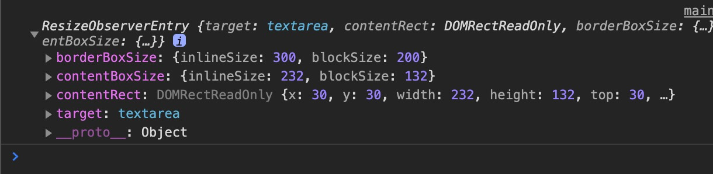
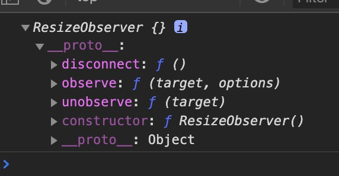

## 개요

[Resize Observer](https://developer.mozilla.org/en-US/docs/Web/API/ResizeObserver)는 대상 요소의 크기 변화를 관찰하고 콜백을 실행하는 API입니다.
크기 변화를 제어할 경우 발생할 수 있는 무한 콜백 루프나 [순환 종속성(Circular dependency)](https://en.wikipedia.org/wiki/Circular_dependency) 등의 다양한 문제 없이 사용할 수 있습니다.

<iframe height="488" style="width: 100%;" scrolling="no" title="ResizeObserver example(textarea)" src="https://codepen.io/heropark/embed/ExaYWBa?height=488&theme-id=default&default-tab=js,result" frameborder="no" allowtransparency="true" allowfullscreen="true">
  See the Pen <a href='https://codepen.io/heropark/pen/ExaYWBa'>ResizeObserver example(textarea)</a> by park young woong
  (<a href='https://codepen.io/heropark'>@heropark</a>) on <a href='https://codepen.io'>CodePen</a>.
</iframe>

`new ResizeObserver`를 통해 생성한 인스턴스(`ro`)로 관찰자(Observer)를 초기화하고 관찰할 대상([Element](https://developer.mozilla.org/ko/docs/Web/API/Element))을 지정합니다.
생성자는 1개의 인수(`callback`)를 가집니다.

```js
// 관찰자 초기화
const ro = new ResizeObserver(callback)

// 관찰할 대상(요소) 등록
ro.observe(element)
```

## 콜백

관찰할 대상이 등록되거나 크기 변화가 생기면 관찰자는 콜백을 실행합니다.
콜백은 2개의 인수(`entries`, `observer`)를 가집니다.

```js
const ro = new ResizeObserver((entries, observer) => {})
ro.observe(element)
```

### entries

`entries`는 ResizeObserverEntry 인스턴스의 <strong>배열</strong>로, `.observe()` 메소드로 관찰하는 대상들을 의미합니다.
ResizeObserverEntry는 다음 속성들을 포함합니다.

- `contentRect`(legacy): 관찰 대상의 사각형 정보([DOMRectReadOnly](https://developer.mozilla.org/en-US/docs/Web/API/DOMRectReadOnly))
- `target`(legacy): 관찰 대상 요소([Element](https://developer.mozilla.org/en-US/docs/Web/API/Element))
- `contentBoxSize`: 관찰 대상의 `content-box`(content) 크기
- `borderBoxSize`: 관찰 대상의 `border-box`(content + padding + border) 크기

```js
const ro = new ResizeObserver((entries, observer) => {
  entries.forEach(entry => {
    console.log(entry)
  })
})

ro.observe(element1)
ro.observe(element2)
// ...
```



### observer

콜백이 실행되는 해당 인스턴스를 참조합니다.



## 메소드

### observe

대상 요소의 관찰을 시작합니다.

```js
const ro1 = new ResizeObserver(callback1)
const ro2 = new ResizeObserver(callback2)

const div = document.querySelector('div')
const button = document.querySelector('button')
const textarea = document.querySelector('textarea')

ro1.observe(div) // DIV 요소 관찰
ro2.observe(button) // BUTTON 요소 관찰
ro2.observe(textarea) // TEXTAREA 요소 관찰
```

### unobserve

대상 요소의 관찰을 중지합니다.

```js
const ro1 = new ResizeObserver(callback1)
const ro2 = new ResizeObserver(callback2)

// ...

ro1.observe(div)
ro2.observe(button)
ro2.observe(textarea)

ro1.unobserve(button) // Nothing..
ro2.unobserve(button) // BUTTON 요소 관찰 중지
```

### disconnect

ResizeObserver 인스턴스가 관찰하는 모든 요소의 관찰을 중지합니다.

```js
const ro1 = new ResizeObserver(callback1)
const ro2 = new ResizeObserver(callback2)

// ...

ro1.observe(div)
ro2.observe(button)
ro2.observe(textarea)

ro2.disconnect() // `ro2`가 관찰하는 모든 요소(BUTTON, TEXTAREA) 관찰 중지
```

# 예제

<iframe height="516" style="width: 100%;" scrolling="no" title="Resize Observer example - Text overflow" src="https://codepen.io/heropark/embed/MWYgoVv?height=516&theme-id=default&default-tab=result" frameborder="no" allowtransparency="true" allowfullscreen="true">
  See the Pen <a href='https://codepen.io/heropark/pen/MWYgoVv'>Resize Observer example - Text overflow</a> by park young woong
  (<a href='https://codepen.io/heropark'>@heropark</a>) on <a href='https://codepen.io'>CodePen</a>.
</iframe>
