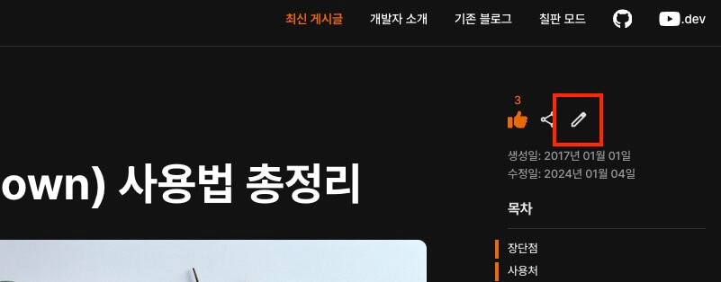

평소에 파일 확장자가 `.md`로 된 파일을 본 적이 있나요?!
개발을 공부하기 시작하면, `README.md` 이름의 파일을 한 번쯤 보게되며, 이 파일이 대표적인 마크다운 파일입니다.
마크다운과 비슷하며 문법이 좀 더 복잡한 `.adoc` 확장자의 [AsciiDoc](http://asciidoctor.org/docs/asciidoc-syntax-quick-reference/#tables) 문법도 있으며, 좀 더 다양한 형태의 문서를 만들 수 있습니다. 
다만, 문법이 훨씬 복잡하고 지원 플랫폼이 적어 사용에 제약이 많습니다.

여러분은, 쉬운 문법과 다양한 플랫폼을 지원하는 마크다운 문법을 배우세요!
30분이면 충분합니다!

## 장단점

마크다운은 다음과 같은 장단점을 가집니다.

- 문법이 쉽습니다.
- 관리가 간편합니다.
- 지원 가능 플랫폼 및 프로그램이 다양합니다.
- 표준이 없어 사용자마다 작성 문법이 조금씩 다를 수 있습니다.
- 모든 HTML 마크업을 대체하지 못합니다.

## 사용처

메모장부터 전용 에디터까지 많은 곳에서 활용할 수 있습니다.
문법이 쉬워 꼭 에디터를 사용할 필요는 없지만, [VS Code](https://code.visualstudio.com/) 같은 코드 에디터에서 편집하는 것을 추천합니다.
마크다운 문법은 지원하는 모든 곳에서 사용할 수 있으며, 일반 블로그나 워드프레스 외 [Slack](https://slack.com/)이나 [Trello](https://trello.com/) 같은 서비스에서 메세지를 작성하듯 사용할 수도 있습니다.

각 문법이 화면에 표시되는 모양은 사용하는 곳의 스타일 구성에 따라 달라지므로, 눈에 보이는 스타일이 아닌 각 문법의 의미에 맞게 사용해야 합니다.

## 문법

각 마크다운 문법은 HTML 태그로 변환되어 브라우저에 출력됩니다.
모든 HTML 태그를 대체하지 않으며, 일부 중요한 문법만을 제공합니다.
또한 일부 문법만 지원하는 플랫폼도 있습니다.

/// message-box --icon=info
각 게시물의 우측 상단에서 수정 아이콘을 선택하면, 게시물 내용(마크다운)을 확인할 수 있습니다.

///
  
### 제목

`<h1>`, `<h2>`, `<h3>`, `<h4>`, `<h5>`, `<h6>` 태그로 변환되는 '제목(Header)'을 표현합니다.

/// message-box --icon=warning
책에서 목차는 여러 단계가 있지만 책 제목은 하나인 것처럼, 하나의 마크다운 파일에서는 하나의 `<h1>`(대제목)만 사용해야 합니다.
///

```markdown
# 제목 1
## 제목 2
### 제목 3
#### 제목 4
##### 제목 5
###### 제목 6
```

`<h1>`, `<h2>`는 다음과 같이 표현할 수도 있습니다.

```markdown
제목 1
======

제목 2
------
```

### 강조

각각 `<em>`(기울임), `<strong>`(두꺼움), `<del>`(취소선) 태그로 변환되는 '강조(Emphasis)'를 표현합니다.
마크다운에서 지원하지 않는 밑줄을 추가하려면, `<u></u>`(밑줄) 태그를 직접 사용할 수 있습니다.

/// message-box --icon=warning
'__*이텔릭체*와 두껍게__ 를' 과 같이 한글에서는 강조 표현 다음에 띄어쓰기가 필요할 수 있습니다.
///

```markdown
이텔릭체는 *별 기호(Asterisks)* 혹은 _언더바 기호(Underscore)_ 를 사용하세요.
두껍게는 **별 기호(asterisks)** 혹은 __언더바 기호(underscore)__ 를 2번씩 사용하세요.
__*이텔릭체*와 두껍게__ 를 혼용할 수도 있습니다.

취소선은 ~~물결 기호(tilde)~~ 를 사용하세요.
<u>밑줄</u>은 마크다운에서 지원하지 않기에, 직접 `<u></u>` 태그를 사용하세요.
```

__출력 결과:__

이텔릭체는 *별 기호(Asterisks)* 혹은 _언더바 기호(Underscore)_ 를 사용하세요.
두껍게는 **별 기호(asterisks)** 혹은 __언더바 기호(underscore)__ 를 2번씩 사용하세요.
__*이텔릭체*와 두껍게__ 를 혼용할 수도 있습니다.

취소선은 ~~물결 기호(tilde)~~ 를 사용하세요.
<u>밑줄</u>은 마크다운에서 지원하지 않기에, 직접 `<u></u>` 태그를 사용하세요.

### 목록

`<ol>`, `<ul>`, `<li>` 태그로 변환되는 '목록(List)'을 표현합니다.
`1. `로 시작하는 항목을 작성하면 `<ol>`로 변환되며, `-`로 시작하는 항목을 작성하면 `<ul>`로 변환됩니다.
들여쓰기를 통해 하위 목록을 작성할 수 있습니다.

/// message-box --icon=warning
하위 목록을 작성할 때, 들여쓰기(Indent)가 띄어쓰기 2칸이 아닌 3칸 이상일 수 있습니다.
또한, 순서가 있거나 없는 목록을 혼합하여 사용할 수 있지만, 동작하지 않을 수 있습니다.
///

```markdown
`-`로 시작하는 순서가 없는 목록으로 구분합니다.

```markdown
1. 순서가 있는 항목
1. 순서가 있는 항목
    1. 순서가 없는 항목
    1. 순서가 없는 항목
1. 순서가 있는 항목
1. 순서가 있는 항목

- 순서가 없는 항목
- 순서가 없는 항목
    - 순서가 없는 항목
    - 순서가 없는 항목
```

__출력 결과:__

1. 순서가 있는 항목
1. 순서가 있는 항목
    1. 순서가 없는 항목
    1. 순서가 없는 항목
1. 순서가 있는 항목
1. 순서가 있는 항목

- 순서가 없는 항목
- 순서가 없는 항목
    - 순서가 없는 항목
    - 순서가 없는 항목

### 링크

`<a>`로 변환되는 '링크(Links)'를 표현합니다.

/// message-box --icon=warning
'링크'는 현재 탭에서 열리는 것이 기본이지만, 새 탭에서 열릴 수도 있습니다.
///

```markdown --caption=링크 문법 구조
[이름](링크)
[이름](링크 "설명")
[이름][참조]

[참조]: 링크
[참조]: 링크 "설명"
```

```markdown
[GOOGLE](https://google.com)

[NAVER](https://naver.com "링크 설명(title)을 작성하세요.")

[상대적 참조](../users/login)

[Dribbble][Dribbble Link]

[GitHub][1]

문서 안에서 [참조 링크]를 그대로 사용할 수도 있습니다.
다음과 같이 문서 내 일반 URL이나 꺾쇠 괄호(`< >`, Angle Brackets)안의 URL은 자동으로 링크를 사용합니다.

구글 홈페이지: https://google.com
네이버 홈페이지: <https://naver.com>

[Dribbble Link]: https://dribbble.com
[1]: https://github.com
[참조 링크]: https://naver.com "네이버로 이동합니다!"
```

__출력 결과:__

[GOOGLE](https://google.com)
[NAVER](https://naver.com "링크 설명(title)을 작성하세요.")
[상대적 참조](../users/login)
[Dribbble][Dribbble link]
[GitHub][1]

문서 안에서 [참조 링크]를 그대로 사용할 수도 있습니다.
다음과 같이 문서 내 일반 URL이나 꺾쇠 괄호(`< >`, Angle Brackets)안의 URL은 자동으로 링크를 사용합니다.

구글 홈페이지: https://google.com
네이버 홈페이지: <https://naver.com>

[Dribbble link]: https://dribbble.com
[1]: https://github.com
[참조 링크]: https://naver.com "네이버로 이동합니다!"

### 이미지

``로 변환되는 '이미지(Images)'를 표현합니다.
링크과 비슷하지만, 앞에 `!`를 추가해야 합니다.

```markdown


![대체텍스트][참조]

[참조]: 이미지주소
[참조]: 이미지주소 "설명"
```

```markdown
")
![이미지입니다!][Image]

[Image]: https://picsum.photos/500/300 "이미지입니다!"
```

__출력 결과:__

")
![이미지입니다!][Image]

[Image]: https://picsum.photos/500/300 "이미지입니다!"

#### 이미지에 링크 추가

마크다운 이미지 문법 코드를 링크 문법 코드로 감싸줍니다.

```markdown
[](https://heropy.dev/)
```

__출력 결과:__

[](https://heropy.dev/)

### 코드 강조

`<pre>`, `<code>` 태그로 변환되는 '코드(Code)'를 표현합니다.
<code>\`</code> (백틱) 기호를 사용합니다.

#### 인라인

강조할 코드를 <code>\`</code> 기호로 감싸 '인라인(InLine)' 코드를 표현합니다.

```markdown
`background` 혹은 `background-image` 속성으로 요소에 배경 이미지를 삽입할 수 있습니다.
```

__출력 결과:__

`background` 혹은 `background-image` 속성으로 요소에 배경 이미지를 삽입할 수 있습니다.

#### 블록

<code>\`</code>를 3번 이상 입력하고 언어(코드) 이름을 명시해, 코드 '블록(Block)'를 표현합니다.
코드 블록의 시작 <code>\`</code> 개수와 종료 <code>\`</code> 개수는 같아야 합니다.

`````markdown
// 연속 백틱 3개 시작, 종료 구조
```언어이름
내용
```

// 연속 백틱 4개 시작, 종료 구조
````언어이름
내용
````
`````

````markdown
```html
<a href="https://www.google.co.kr/" target="_blank">GOOGLE</a>
```

```css
.list > li {
  position: absolute;
  top: 40px;
}
```

```javascript
function add(a, b = 1) {
  console.log(a, b)
  return a + b
}
```

```bash
$ npm run dev
```
 
```python
s = "Python syntax highlighting"
print s
```
 
```plaintext
No language indicated, so no syntax highlighting. 
But let's throw in a <b>tag</b>.
```
````

__출력 결과:__

```html
<a href="https://www.google.co.kr/" target="_blank">GOOGLE</a>
```

```css
.list > li {
  position: absolute;
  top: 40px;
}
```

```javascript
function add(a, b = 1) {
  console.log(a, b)
  return a + b
}
```

```bash
$ npm run dev
```
 
```python
s = "Python syntax highlighting"
print s
```
 
```plaintext
No language indicated, so no syntax highlighting. 
But let's throw in a <b>tag</b>.
```

#### 백틱 기호 사용

마크다운에서 백틱(<code>\`</code>) 기호는 코드 강조를 표현할 때 사용하는 문법 기능을 가지므로, 백틱 기호 자체를 출력하려면 기호에 이스케이프(Escape) 처리가 필요합니다.

다음과 같이 `\` 기호와 함께 작성하면, 백틱 기호를 출력할 수 있습니다.
또는 <code>\`</code>에서 인라인 코드 강조를 하기 위해, `<code>` 태그를 활용할 수도 있습니다.

```markdown
\`
<code>\`</code>
```

__출력 결과:__

\`
<code>\`</code>

### 표

`<table>` 태그로 변환되는 '표(Table)'를 표현합니다.
테이블 헤더를 구분하기 위해, 3개 이상의 `-`(hyphen/dash) 기호를 사용합니다.
테이블 헤더를 구분하며 `:`(Colons) 기호를 추가해 셀(열/칸) 안에 내용을 정렬할 수 있습니다.

- `---`, `:---`: 좌측 정렬
- `:---:`: 가운데 정렬
- `---:`: 우측 정렬

가장 좌측과 가장 우측에 있는 `|`(vertical bar) 기호는 생략 가능합니다. (플랫폼에 따라 생략 불가한 경우도 있습니다)

```markdown
| 헤더 | 헤더 | 헤더 |
|---|---|---|
| 셀 | 셀 | 셀 |
| 셀 | 셀 | 셀 |

헤더 | 헤더 | 헤더
---|---|---
셀 | 셀 | 셀
셀 | 셀 | 셀
```

```markdown
| 값 | 의미 | 기본값 |
|---|:---:|---:|
| `static` | 유형(기준) 없음 / 배치 불가능 | `static` |
| `relative` | 요소 자신을 기준으로 배치 |  |
| `absolute` | 위치 상 부모(조상)요소를 기준으로 배치 |  |
| `fixed` | 브라우저 창을 기준으로 배치 |  |
| `sticky` | 스크롤 영역 기준으로 배치 |  |

값 | 의미 | 기본값
---|:---:|---:
`static` | 유형(기준) 없음 / 배치 불가능 | `static`
`relative` | 요소 자신을 기준으로 배치 |
`absolute` | 위치 상 부모_(조상)요소를 기준으로 배치 |
`fixed` | 브라우저 창을 기준으로 배치 |
`sticky` | 스크롤 영역 기준으로 배치 |
```

__출력 결과:__

| 값 | 의미 | 기본값 |
|---|:---:|---:|
| `static` | 유형(기준) 없음 / 배치 불가능 | `static` |
| `relative` | 요소 자신을 기준으로 배치 |  |
| `absolute` | 위치 상 부모(조상)요소를 기준으로 배치 |  |
| `fixed` | 브라우저 창을 기준으로 배치 |  |
| `sticky` | 스크롤 영역 기준으로 배치 |  |

#### 버티컬바 기호 사용

마크다운에서 버티컬바(<code>|</code>) 기호는 테이블을 표현할 때 사용하는 문법 기능을 가집니다.
만약 테이블 안에서 버티컬바 기호 자체를 출력하려면, `\` 기호와 함께 작성하는 이스케이프(Escape) 처리가 필요합니다.

```markdown
| 값 | 의미 |
|---|---|
| 버티컬바 출력 | \| |
| 인라인 코드 강조 | `\|` |
```

| 값 | 의미 |
|---|---|
| 버티컬바 출력 | \| |
| 인라인 코드 강조 | `\|` |

### 인용문

`<blockquote>` 태그로 변환되는 '인용문(BlockQuote)'을 표현합니다.

```markdown
> 인용문 - 남의 말이나 글에서 직접 또는 간접으로 따온 문장.
> _(네이버 국어 사전)_

BREAK!

> 인용문을 작성하세요!
>> 중첩된 인용문(nested blockquote)을 만들 수 있습니다.
>>> 중중첩 인용문 1
>>> 중중첩 인용문 2
>>> 중중첩 인용문 3
```

__출력 결과:__

> 인용문 - 남의 말이나 글에서 직접 또는 간접으로 따온 문장.
> _(네이버 국어 사전)_

BREAK!

> 인용문을 작성하세요!
>> 중첩된 인용문(nested blockquote)을 만들 수 있습니다.
>>> 중중첩 인용문 1
>>> 중중첩 인용문 2
>>> 중중첩 인용문 3

### 원시 HTML

마크다운 문법 대신, HTML을 직접 사용(Raw HTML)할 수 있습니다.
앞서 살펴본 밑줄 추가와 같이, 마크다운 문법에서 지원하지 않는 기능을 사용할 때 유용합니다.

```markdown
마크다운에서 <u>밑줄</u>은 지원하지 않습니다.

 태그를 사용해야 합니다.">


```

마크다운에서 <u>밑줄</u>은 지원하지 않습니다.

 태그를 사용해야 합니다.">


### 수평선

`---`, `___`, `***` 각 기호를 3개 이상 입력해, `<hr>` 태그로 변환되는 '수평선(Horizontal Rule)'을 표현합니다.

```markdown
---

***

___
```

__출력 결과:__

---

### 줄바꿈

줄바꿈(Line Breaks)을 위해서는 문장 마지막에서 `<br>` 태그를 직접 입력하거나, 문장 마지막에서 띄어쓰기를 2번 이상 입력합니다.

/// message-box --icon=warning
플랫폼 자체에서 자동 줄바꿈을 지원하는 경우, 이러한 방식이 필요하지 않을 수 있습니다.
///

```markdown
동해물과 백두산이 마르고 닳도록 
하느님이 보우하사 우리나라 만세
무궁화 삼천리 화려 강산   <!--띄어쓰기 2번-->
대한 사람 대한으로 길이 보전하세<br>
끝!
```

동해물과 백두산이 마르고 닳도록 하느님이 보우하사 우리나라 만세 무궁화 삼천리 화려 강산
대한 사람 대한으로 길이 보전하세
끝!

### 주석

`<!--  -->`, `[//]: #` 기호를 사용해, 주석(Comment)을 표현합니다.

```markdown
-- 시작 --

<!-- 안녕하세요. -->
[//]: # (안녕하세요.)
[//]: # "안녕하세요."
[//]: # '안녕하세요.'

-- 종료 --
```

__출력 결과:__

-- 시작 --

<!-- 안녕하세요. -->
[//]: # (안녕하세요.)
[//]: # "안녕하세요."
[//]: # '안녕하세요.'

-- 종료 --