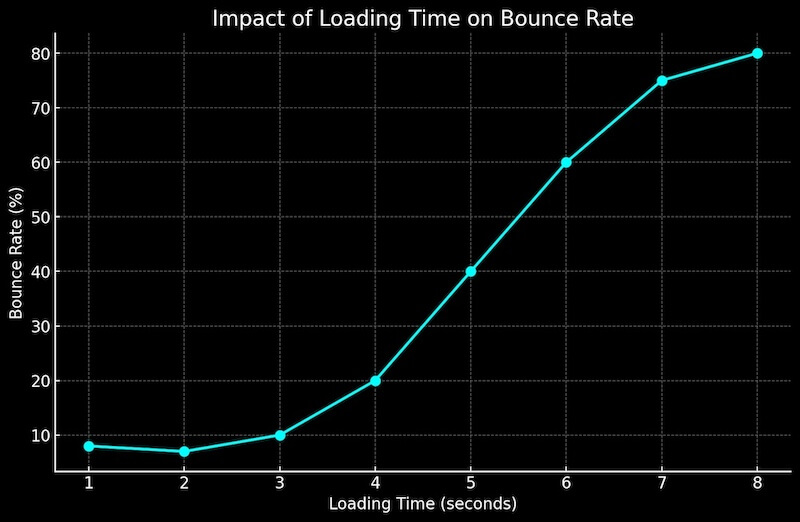
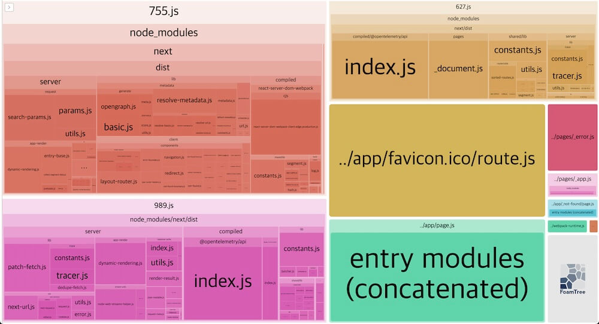
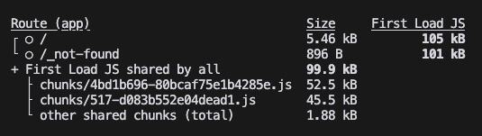
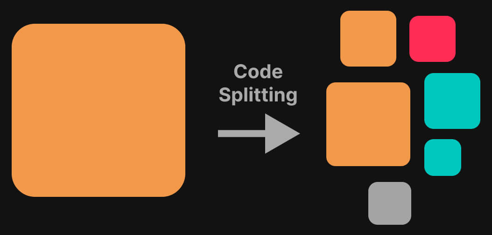
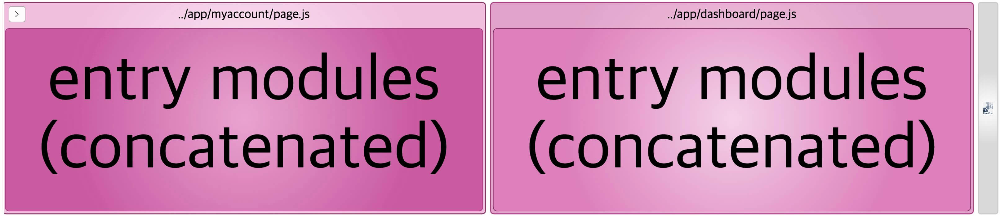
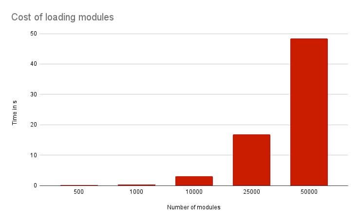
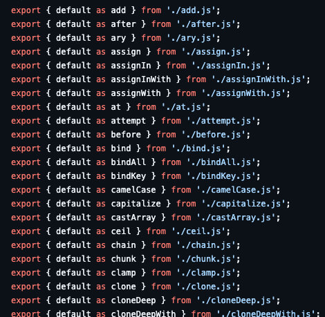

## 번들 사이즈의 중요성

번들 사이즈 최적화(Bundle Size Optimization)는 프론트엔드 개발에서 중요한 이슈입니다. 
번들 사이즈가 클수록 초기 페이지 로딩 시간이 길어지고 모바일 환경이나 네트워크 속도가 느린 환경에서는 이러한 문제가 더욱 부각됩니다. 
사용자가 페이지 로딩을 기다리다 떠나게 되는 사용자 이탈률(Bounce Rate)에 직접적으로 영향을 미칩니다.
페이지 로딩이 2초를 초과하면, 사용자 이탈률이 빠르게 증가합니다.



반대로 번들 사이즈가 줄어서 로딩 속도가 빨라지면 사용자는 더 부드럽고 빠르게 콘텐츠에 접근할 수 있습니다. 
특히, 사용자와의 첫 상호작용에서 긍정적인 인상을 남길 수 있으며, 이는 사용자 유지율(Retention Rate) 향상으로 이어질 수 있습니다.

구글은 코어 웹 바이탈(Core Web Vitals) 지표를 통해 웹페이지의 성능을 평가하고 검색 순위에 반영합니다.
특히 LCP, CLS, INP 등 로딩 속도와 관련된 요소는 번들 사이즈 줄이기로 개선할 수 있습니다.
따라서 번들 사이즈를 줄이면 코어 웹 바이탈 지표가 개선되면서 SEO(검색 엔진 최적화) 성능도 함께 향상될 수 있습니다.

- [LCP(Largest Contentful Paint)](https://web.dev/articles/lcp?hl=ko): 주요 콘텐츠가 화면에 렌더링되는 시점을 측정합니다.
- [CLS(Cumulative Layout Shift)](https://web.dev/articles/cls?hl=ko): 로드 중 예기치 않은 레이아웃 변화의 빈도와 정도를 측정하여 시각적 안정성을 측정합니다.
- [INP(Interaction to Next Paint)](https://web.dev/articles/inp?hl=ko): 사용자의 상호작용으로 화면 반응이 얼마나 빠르게 이뤄지는지를 측정합니다.

## 번들 사이즈 분석 도구

번들 크기를 효과적으로 줄이기 위해서는 현재의 번들 크기를 정확히 파악하는 것이 중요합니다. 
[@next/bundle-analyzer](https://www.npmjs.com/package/@next/bundle-analyzer)는 Next.js에서 번들 크기와 구조를 시각적으로 보여주는 도구입니다.

다음과 같이 설치합니다.

```bash
npm i @next/bundle-analyzer
```

Next.js 구성 파일(`next.config.ts`)의 옵션과 **@next/bundle-analyzer**를 통합해 번들 분석을 활성화합니다.

```ts --path=/next.config.ts --line-active=2,8-11
import type { NextConfig } from 'next'
import withBundleAnalyzer from '@next/bundle-analyzer'

const nextConfig: NextConfig = {
  /* config options here */
}

export default withBundleAnalyzer({
  enabled: process.env.ANALYZE === 'true',
  // openAnalyzer: true // default!
})(nextConfig)
```

`ANALYZE` 환경 변수가 `true`일 때만 분석이 활성화됩니다. 
이렇게 설정하면 필요할 때만 번들 분석을 실행할 수 있어 프로젝트의 개발 및 배포 성능에 부담을 주지 않습니다.

```json --path=/package.json
{
  "scripts": {
    "analyze": "ANALYZE=true npm run build"
  }
}
```

다음과 같이 스크립트를 실행합니다.

```bash
npm run analyze
```

아래 예시 이미지와 같이 브라우저와 터미널에서 번들 사이즈 분석 결과를 확인할 수 있습니다.
`openAnalyzer: false` 옵션을 설정하면, 번들 사이즈 분석 결과는 브라우저에는 출력되지 않습니다.





## 코드 스플리팅

코드 스플리팅(Code Splitting)은 애플리케이션의 코드를 하나의 번들에서 여러 개의 청크(Chunk, 덩어리)로 나누어 필요할 때만 로드하는 방법입니다. 
이는 페이지 로딩 시 한 번에 큰 용량의 번들을 로드하지 않고 청크 단위로 필요한 코드만 로드해서 초기 로드 속도를 개선하는 데 매우 효과적인 전략입니다.



### 동적 가져오기

Next.js에서는 페이지 단위로 코드 스플리팅이 적용되므로 페이지 이동 시 해당 페이지에서만 필요한 코드가 로드됩니다.
그 외에도 컴포넌트 단위로 코드 스플리팅을 적용할 수 있습니다.

/// message-box --icon=warning
컴포넌트를 동적으로 가져오도록 처리해 초기 로딩을 빠르게 처리할 수 있지만, 반대로 동적으로 컴포넌트를 로드하는 순간 네트워크 요청이 발생하며 일부 지연이 발생합니다.
따라서 주요 기능이나 즉각적인 반응이 중요한 부분에는 동적 가져오기를 피하는 것이 좋습니다.
///

다음 코드에서 `Comments` 컴포넌트는 서버에서 가져온 댓글 정보가 있을 때만 렌더링하지만, 해당 컴포넌트의 코드는 기본적으로 초기 번들에 포함됩니다.

```tsx --path=/app/dashboard/page.tsx --line-active=1
import Chart from '@/components/Chart'

export default async function Dashboard() {
  const res = await fetch('https://api.heropy.dev/dashboard')
  const { chartData } = await res.json()

  return (
    <>
      {/* ... */}
      {chartData ? <Chart data={chartData} /> : <p>데이터가 없어요..</p>}
    </>
  )
}
```

React의 `lazy` 함수와 `Suspense` 컴포넌트를 사용해 동적으로 컴포넌트를 불러오고 필요한 시점에만 로드할 수 있습니다.
`lazy` 함수는 호출로 반환되는 컴포넌트를 실제 사용하는 시점에 동적으로 JS `import` 함수로 컴포넌트를 가져옵니다.
`Suspense` 컴포넌트는 로드 중인 컴포넌트를 준비하는 동안 비동기적으로 로드 상태를 관리합니다.

초기 로딩과는 관계가 없는 페이지나 모달이나 챗봇 등의 특정 기능에서 동적 가져오기를 사용하면, 로딩 속도를 최적화할 수 있습니다.

```tsx --path=/app/dashboard/page.tsx --line-active=1,3,13-15
import { lazy, Suspense } from 'react'

const Chart = lazy(() => import('@/components/Chart'))

export default async function Dashboard() {
  const res = await fetch('https://api.heropy.dev/dashboard')
  const { chartData } = await res.json()

  return (
    <>
      {/* ... */}
      {chartData ? (
        <Suspense fallback={<p>로딩 중...</p>}>
          <Chart data={chartData} />
        </Suspense>
      ) : (
        <p>데이터가 없어요..</p>
      )}
    </>
  )
}
```

Next.js에서 제공하는 `dynamic` 함수를 사용하면, `lazy` 함수와 `Suspense` 컴포넌트를 사용하는 것과 동일한 효과를 얻을 수 있습니다.

```tsx --path=/app/dashboard/page.tsx --line-active=1,3-5,14
import dynamic from 'next/dynamic'

const Chart = dynamic(() => import('@/components/Chart'), {
  loading: () => <p>로딩 중...</p>
})

export default async function Dashboard() {
  const res = await fetch('https://api.heropy.dev/dashboard')
  const { chartData } = await res.json()

  return (
    <>
      {/* ... */}
      {chartData ? <Chart data={chartData} /> : <p>데이터가 없어요..</p>}
    </>
  )
}
```

만약 사전 렌더링(Pre-rendering)을 사용하지 않고 클라이언트 환경에서만 동적으로 가져오려면 `ssr: false`를 설정합니다.
단, 해당 설정은 클라이언트 컴포넌트에서만 동작합니다.

```tsx --path=/app/dashboard/page.tsx --line-active=1,6
'use client'
import dynamic from 'next/dynamic'

const Chart = dynamic(() => import('@/components/Chart'), {
  loading: () => <p>로딩 중...</p>,
  ssr: false
})

// ...
```

### 중복 청크 분리

Next.js는 가져온 모듈이 중복으로 사용되면 청크로 분리합니다.
다음 예제에서 `sleep` 유틸 함수는 **Dashboard** 페이지와 **MyAccount** 페이지에서 공통으로 사용하고 있어 청크로 분리되는 것을 기대할 수 있습니다.

```tsx --path=/utils/index.ts
export async function sleep(ms: number) {
  return new Promise(resolve => setTimeout(resolve, ms))
}
```

```tsx --path=/app/dashboard/page.tsx --line-active=1
import { sleep } from '@/utils'

export default async function DashboardPage() {
  await sleep(1000)
  return <h1>Dashboard!</h1>
}
```

```tsx --path=/app/myaccount/page.tsx --line-active=1
import { sleep } from '@/utils'

export default async function MyAccountPage() {
  await sleep(2000)
  return <h1>My Account!</h1>
}
```

하지만, 번들 사이즈 분석 결과를 확인해보면, 중복 청크가 분리되지 않고 각 페이지에 따로 포함되어 있습니다.



Next.js는 기본적으로 20KB 이상의 모듈이 중복으로 사용돼야 청크로 분리하기 때문에, 위 예제의 유틸 함수처럼 낮은 용량의 중복 모듈은 청크로 분리되지 않습니다.
이러한 경우, `minSize` 옵션을 조절해 청크로 분리할 최소 용량을 설정할 수 있습니다.

```ts --path=/next.config.ts --line-active=4-13
// ...

const nextConfig: NextConfig = {
  webpack: config => {
    // 코드 스플리팅 설정 오버라이드
    config.optimization.splitChunks = {
      ...config.optimization.splitChunks,
      chunks: 'all', // 모든 청크를 분리
      minSize: 100, // 최소 100B 이상의 청크만 분리, default: 20KB
      minChunks: 2 // 최소 2개 이상의 파일에서 사용될 때만 청크로 분리
    }
    return config
  }
}

// ...
```

옵션을 조절하고 다시 분석 결과를 확인해보면, 다음과 같이 중복 청크가 분리된 것을 확인할 수 있습니다.


## 트리 쉐이킹

트리 쉐이킹(Tree Shaking)은 사용하지 않는 코드를 제거해 최종 번들 크기를 줄이는 최적화 기법입니다.
Next.js는 ESM 방식(`import/export`)의 모듈을 사용하면 기본적으로 트리 쉐이킹을 지원하며, CommonJS 방식(`require`)은 트리 쉐이킹이 되지 않습니다.


### 라이브러리 최적화

외부 라이브러리를 사용할 때는 트리 쉐이킹이 가능한 ESM 방식을 지원하거나 경량화된 라이브러리를 사용하는 것을 좋습니다.

[**lodash**](https://github.com/lodash/lodash) 라이브러리는 대표적인 CommonJS 방식의 모듈로 여러 유틸리티 함수를 제공합니다.
모듈 전체를 가져오는 경우 트리 쉐이킹이 되지 않으며, Named Import를 사용하거나 정확히 해당 모듈만 가져와야 합니다.
일부 유틸리티 함수는 Named Import로 최적화되지 않을 수 있습니다.

```ts --line-active=6-8 --line-error=2-3
// 트리 쉐이킹이 되지 않는 CommonJS 모듈 전체 가져오기
import _ from 'lodash'
_.get({}, 'a.b')

// Named Import 혹은 해당 모듈만 가져와 사용하기
// import { get } from 'lodash'
import get from 'lodash/get'
get({}, 'a.b')
```

**lodash** 라이브러리에서 공식 지원하는 ESM 방식의 모듈로 **lodash-es**를 사용할 수 있습니다.
많은 경우, **lodash** 대신 **lodash-es**를 사용하는 것을 추천합니다.

```ts --caption=트리 쉐이킹이 가능한 ESM 방식의 모듈 사용
import { get } from 'lodash-es'
get({}, 'a.b')
```

[**moment**](https://github.com/moment/moment/) 라이브러리는 날짜와 시간을 처리하는 매우 강력한 기능을 가지고 있지만, 많은 기능을 제공하기 때문에 번들 크기가 18KB 이상(Parsed Size)으로 꽤 큽니다.
경량화된 대체 라이브러리로 [**day.js**](https://github.com/iamkun/dayjs/)나 [**date-fns**](https://github.com/date-fns/date-fns)를 사용할 수 있습니다.

**day.js**는 **moment**와 거의 비슷한 사용법을 제공하면서도 번들 크기가 기본 2KB로 훨씬 작지만, 추가적인 기능을 사용하려면 플러그인을 설치하고 연결해야 합니다.
**date-fns**는 Named Import로 필요한 기능만 가져와 사용할 수 있어 트리 쉐이킹이 가능하지만, **moment**와는 사용 방법이 다릅니다.

```ts
import moment from 'moment'
moment().format('YYYY-MM-DD') // 2025-12-16

import dayjs from 'dayjs'
dayjs().format('YYYY-MM-DD') // 2025-12-16

import { format } from 'date-fns'
format(new Date(), 'yyyy-MM-dd') // 2025-12-16
```

#### 사이드 이펙트 확인

사이드 이펙트(Side Effect)란 모듈 기능이 외부 환경에 의존하거나 다른 모듈에 영향을 미쳐 코드 실행 결과를 예측하기 어려운 상황을 말합니다.
`document.querySelector('.hello')` 같은 DOM 조작이나 `console.log` 같은 디버깅 작업, 전역 변수 사용, 타이머 작업 등 사이드 이펙트가 있는 코드는 트리 쉐이킹을 통해 제거되지 않습니다.
트리 쉐이킹은 사이드 이펙트가 없는 코드만 안전하게 제거할 수 있으므로, 사이드 이펙트를 잘 확인하면 번들 사이즈를 효과적으로 줄일 수 있습니다.

라이브러리를 선택할 때도 되도록 사이드 이펙트가 없는 라이브러리를 우선적으로 선택하고, 사이드 이펙트가 있더라도 명확하게 문서화된 라이브러리를 선택하는 것이 좋습니다.
사이드 이펙트가 없는 라이브러리는 `package.json` 파일을 확인하면 다음과 같이 명시되어 있습니다.
그러면 해당 모듈에서 사용하지 않는 코드는 트리 쉐이킹을 통해 과감하게 제거됩니다.

```json --path=/package.json --caption=사이드 이펙트가 없는 경우
{
  "sideEffects": false
}
```

반면 사이드 이펙트가 있는 모듈은 다음과 같이 제거되지 않아야 하는 내부 모듈이 명시되어 있습니다.
UI 라이브러리의 경우 전역 스타일을 위한 CSS 파일이 포함되는 경우가 많습니다.

```json --path=/package.json --caption=사이드 이펙트가 있는 경우
{
  "sideEffects": [
    "index.common.js",
    "polyfills.js",
    "i18n/*.js",
    "*.css",
    "*.scss"
  ]
}
```

#### 배럴 파일 지양

배럴 파일(Barrel File)은 여러 개의 모듈을 하나의 파일로 묶어 내보내는 모듈 활용 방법으로, 다음과 같이 Re-export 문법으로 만들 수 있습니다.
그러면 개별적인 모듈을 하나씩 가져오지 않고 단일 `import` 구문으로 한 번에 쉽게 가져올 수 있습니다.

/// message-box --icon=info
타입스크립트는 `index.ts` 파일을 우선적으로 찾기 때문에, 경로에서 생략 가능합니다.
///

```ts --path=/utils/index.ts
export { default as sleep } from './sleep'
export { default as format } from './format'
export { default as parse } from './parse'
```

```ts --line-active=4 --line-error=1-3
// import { sleep } from '@/utils/sleep'
// import { format } from '@/utils/format'
// import { parse } from '@/utils/parse'
import { sleep, format, parse } from '@/utils'

// ...
```

이는 쉬운 모듈 사용을 위한 한 가지 방법이지만, 배럴 파일 사용은 큰 문제가 따릅니다.
배럴 파일에서 하나의 모듈 기능을 사용하기 위해서 다른 불필요한 모듈 또한 가져오게 되며, 이는 런타임 로드와 빌드 시간을 증가시킵니다.
특히 배럴 파일이 내보내는 모듈이 또 다른 배럴 파일인 이런 중첩이 다중으로 발생하면 빌드 시간은 기하급수적으로 증가합니다.
특히 Next.js 서버 컴포넌트가 로드되는 서버리스 환경에서의 빌드 시간 증가는 더욱 문제가 됩니다.



우리가 사용할 수 있는 많은 라이브러리가 이미 배럴 파일을 사용하고 있고, 적게는 수십 개에서 많게는 수천 개의 모듈을 Re-export 하고 있습니다.
Next.js에서는 이 문제를 해결하기 위해 `optimizePackageImports` 옵션을 제공합니다.
이 옵션으로 명시하는 라이브러리는 엔트리 파일을 분석해서 배럴 파일일 때 재귀적으로 배럴 파일을 건너뛰어 필요한 모듈만 직접 가져오도록 최적화됩니다.

```ts --path=/next.config.ts --line-active=4-6
// ...

const nextConfig: NextConfig = {
  experimental: {
    optimizePackageImports: ['LIBRARY_NAME']
  }
}

// ...
```



Next.js는 기본적으로 `lodash-es`, `antd`, `@mui` 등의 자주 사용할 수 있는 라이브러리를 기본적으로 최적화합니다.
구체적인 목록은 [optimizePackageImports](https://nextjs.org/docs/app/api-reference/next-config-js/optimizePackageImports) 옵션을 참고하세요.

만약 프로젝트에서 최적화되지 않은 배럴 파일을 사용하지 않도록 설정하려면, 다음과 같이 ESLint 규칙을 추가할 수 있습니다.

```bash
npm i -D eslint-plugin-canonical
```

```json --path=/.eslintrc.json
{
  "plugins": [
    "canonical"
  ],
  "rules": {
    "canonical/no-barrel-import": "error"
  }
}
```

#### 중복 제거

프로젝트에서 의존성(Dependency) 구조가 복잡해지면, 같은 라이브러리가 여러 버전으로 중복 설치될 수 있습니다.
`npm ls`(`npm list`) 명령어로 프로젝트에 설치된 특정 의존성 라이브러리 목록을 확인할 수 있습니다.

Next.js 프로젝트를 생성할 때 Tailwind CSS 사용을 선택하면, **postcss** 라이브러리가 자동으로 설치됩니다.
`npm ls postcss` 명령을 통해 해당 라이브러리 목록을 확인하면, 다음과 같이 **postcss** 라이브러리가 `8.4.31`과 `8.4.48` 버전으로 중복 설치된 것을 확인할 수 있습니다.

```bash --line-active=4,5
npm ls postcss
    my-project@0.1.0
    ├─┬ next@15.0.3
    │ └── postcss@8.4.31
    ├── postcss@8.4.48
    └─┬ tailwindcss@3.4.14
      ├─┬ postcss-import@15.1.0
      │ └── postcss@8.4.48 deduped
      ├─┬ postcss-js@4.0.1
      │ └── postcss@8.4.48 deduped
      ├─┬ postcss-load-config@4.0.2
      │ └── postcss@8.4.48 deduped
      ├─┬ postcss-nested@6.2.0
      │ └── postcss@8.4.48 deduped
      └── postcss@8.4.48 deduped
```

`npm dedupe` 명령은 의존성 목록에서 중복 버전을 가능한 한 상위 버전으로 통합합니다. 
이를 통해 `node_modules` 폴더 내의 중복된 라이브러리를 최대한 줄일 수 있습니다.

```bash
npm dedupe
    added 1 package, removed 1 package, changed 1 package, and audited 370 packages in 2s
```

다시 목록을 확인하면, **postcss** 라이브러리가 `8.4.31` 버전으로 통합된 것을 확인할 수 있습니다.
중복 제거된 라이브러리는 모두 `deduped` 키워드가 붙습니다.

```bash --line-active=4,5
npm ls postcss
    my-project@0.1.0
    ├─┬ next@15.0.3
    │ └── postcss@8.4.31 deduped
    ├── postcss@8.4.31
    └─┬ tailwindcss@3.4.14
      ├─┬ postcss-import@15.1.0
      │ └── postcss@8.4.31 deduped
      ├─┬ postcss-js@4.0.1
      │ └── postcss@8.4.31 deduped
      ├─┬ postcss-load-config@4.0.2
      │ └── postcss@8.4.31 deduped
      ├─┬ postcss-nested@6.2.0
      │ └── postcss@8.4.31 deduped
      └── postcss@8.4.31 deduped
```

만약 버전 차이가 심하거나 버전 간의 의존성 관계가 복잡한 경우에는 중복을 그대로 남겨두기도 합니다.
**nanoid** 라이브러리의 경우, 중복 제거를 시도해도 다른 버전이 그대로 남아있습니다.

```bash --line-active=5,7
npm i nanoid
npm dedupe
npm ls nanoid
    my-project@0.1.0
    ├── nanoid@5.0.8
    └─┬ postcss@8.4.31
      └── nanoid@3.3.7
```
