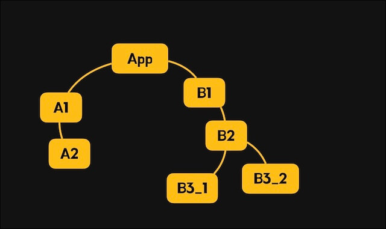
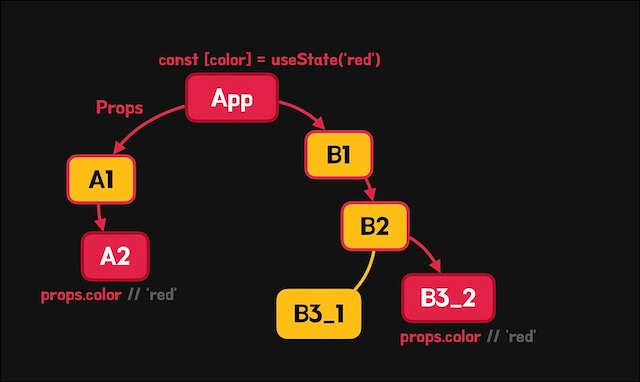
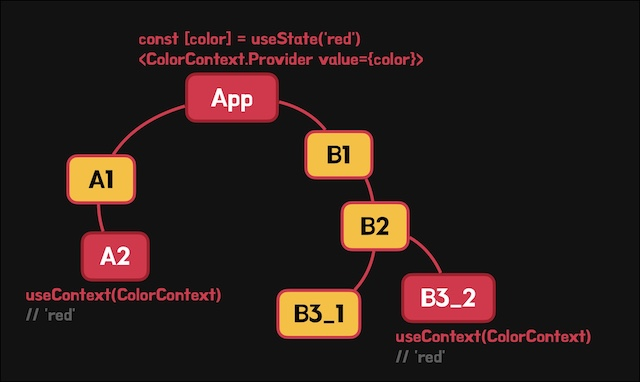
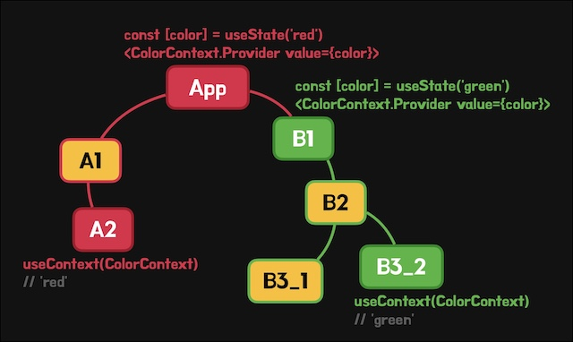
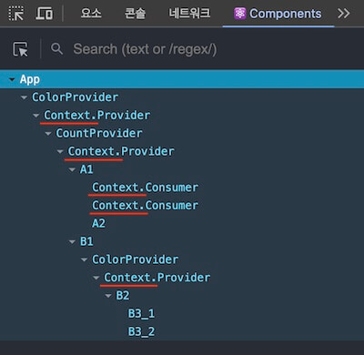
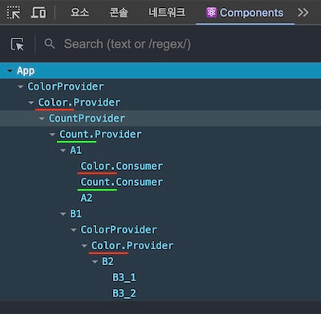

/// message-box --icon=info
이 글에서 제공하는 예제는 [React 프로젝트 시작하기 w. Vite](/p/6iFzkB) 에서 생성한 프로젝트를 기반으로 합니다.
///

React Context API는 프로젝트의 상위/하위 컴포넌트 간 데이터 공유 방식입니다.
다음의 프로젝트 구조에서 시작해 Context API의 개념과 사용법을 이해해 봅시다.

```plaintext --caption=프로젝트 구조
├─src
│  ├─components
│  │  ├─A1.tsx
│  │  ├─A2.tsx
│  │  ├─B1.tsx
│  │  ├─B2.tsx
│  │  ├─B3_1.tsx
│  │  └─B3_2.tsx
│  └─App.tsx
```



## Props

부모 컴포넌트가 자식 컴포넌트에게 데이터를 전달하는 방식으로 주로 Props를 사용합니다.
아주 간단히 데이터를 전달할 수 있지만, 자식 컴포넌트 이상으로 데이터를 전달하려면 중간 단계의 컴포넌트에서 불필요하게 데이터를 처리해야 하는 문제가 발생합니다.

이를 이해하기 위해 아래 예제를 살펴봅시다.
`App` 컴포넌트에서 관리하는 반응형 색상 데이터(`red`)를 `A2`와 `B3_2` 컴포넌트에서 사용하려고 합니다.
그러면 `App`과 `A2` 컴포넌트 사이의 `A1` 컴포넌트가 데이터를 전달해야 하고, 마찬가지로 `App`과 `B3_2` 컴포넌트 사이의 `B1`, `B2` 컴포넌트가 데이터를 전달해야 합니다.



이런 상황을 속성(데이터)이 여러 컴포넌트를 관통하는 것 같다고 해서 'Prop Drilling'이라고 부릅니다.


```tsx --path=/src/App.tsx --caption=Props로 데이터 전달
import { useState } from 'react'
import A1 from './components/A1'
import B1 from './components/B1'

export default function App() {
  const [color] = useState('red')
  return (
    <>
      <div>App</div>
      <A1 color={color} />
      <B1 color={color} />
    </>
  )
}
```

```tsx --path=/src/components/A1.tsx --caption=불필요한 데이터 처리
import A2 from './A2'

export default function A1({ color }: { color: string }) {
  return (
    <>
      <div>A1</div>
      <A2 color={color} />
    </>
  )
}
```

```tsx --path=/src/components/A2.tsx
export default function A2({ color }: { color: string }) {
  return <div style={{ color }}>A2</div>
}
```

```tsx --path=/src/components/B1.tsx --caption=불필요한 데이터 처리
import B2 from './B2'

export default function B1({ color }: { color: string }) {
  return (
    <>
      <div>B1</div>
      <B2 color={color} />
    </>
  )
}
```

```tsx --path=/src/components/B2.tsx --caption=불필요한 데이터 처리
import B3_1 from './B3_1'
import B3_2 from './B3_2'

export default function B2({ color }: { color: string }) {
  return (
    <>
      <div>B2</div>
      <B3_1 />
      <B3_2 color={color} />
    </>
  )
}
```

```tsx --path=/src/components/B3_1.tsx
export default function B3_1() {
  return <div>B3_1</div>
}
```

```tsx --path=/src/components/B3_2.tsx
export default function B3_2({ color }: { color: string }) {
  return <div style={{ color }}>B3_2</div>
}
```

## Context API

위에서 살펴본 Props 방식의 한계를 극복하기 위해 React에서는 Context API를 제공합니다.
Context API는 특정 컴포넌트에서 제공하는 데이터를 자식을 포함한 하위 컴포넌트에서 사용할 수 있게 합니다.

```tsx --caption=Context API
import { createContext, useContext } from 'react'


// 초깃값과 함께 컨텍스트 생성
const MyContext = createContext(데이터)


// 컨텍스트 생서자로 데이터 제공
<MyContext.Provider value={데이터}>
  {children}
</MyContext.Provider>


// 컨텍스트 사용으로 데이터 얻기
const 데이터 = useContext(MyContext)


// 컨텍스트 소비자로 데이터 얻기 (선택)
<MyContext.Consumer>
  {데이터 => <div>{데이터}</div>}
</MyContext.Consumer>


// 컨텍스트 이름 지정 (선택)
MyContext.displayName = 'MyContext'
```

이번에도 `App` 컴포넌트의 색상 데이터를 `A2`와 `B3_2` 컴포넌트에서 사용하려고 합니다.
이를 위해 Context API를 활용하여 `App` 컴포넌트에서 색상 데이터를 제공하고, 그 하위 컴포넌트에서 사용하는 방식으로 구현할 수 있습니다.



`App` 컴포넌트에서 `createContext` 함수를 호출하여 초깃값과 함께 컨텍스트를 생성합니다.
생성된 컨텍스트 객체의 `.Provider` 컴포넌트로 데이터를 제공할 하위 컴포넌트를 감싸고, `value` 속성으로 전달할 데이터를 제공합니다.
이제 하위 컴포넌트에서 데이터를 사용할 수 있습니다.

```tsx --path=/src/App.tsx --line-active=1,5,10
import { createContext } from 'react'
import A1 from './components/A1'
import B1 from './components/B1'

export const ColorContext = createContext('')

export default function App() {
  const [color] = useState('red') // 색상 데이터
  return (
    <ColorContext.Provider value={color}>
      <div>App</div>
      <A1 />
      <B1 />
    </ColorContext.Provider>
  )
}
```

Props 방식과 달리 제공된 데이터를 사용하지 않는 컴포넌트에서는 별도로 처리할 것이 없습니다.

```tsx --path=/src/components/A1.tsx --caption=처리할 것이 없음
import A2 from './A2'

export default function A1() {
  return (
    <>
      <div>A1</div>
      <A2 />
    </>
  )
}
```

데이터를 사용할 컴포넌트에서는 `useContext` 훅(Hook)을 통해 제공된 데이터를 얻을 수 있습니다.
`useContext` 훅 사용 시 컨텍스트 객체를 인자로 전달하면 됩니다.

```tsx --path=/src/components/A2.tsx --line-active=5
import { useContext } from 'react'
import { ColorContext } from '../App'

export default function A2() {
  const color = useContext(ColorContext) // 'red'
  return <div style={{ color }}>A2</div>
}
```

```tsx --path=/src/components/B1.tsx --caption=처리할 것이 없음
import B2 from './B2'

export default function B1() {
  return (
    <>
      <div>B1</div>
      <B2 />
    </>
  )
}
```

```tsx --path=/src/components/B2.tsx --caption=처리할 것이 없음
import B3_1 from './B3_1'
import B3_2 from './B3_2'

export default function B2() {
  return (
    <>
      <div>B2</div>
      <B3_1 />
      <B3_2 />
    </>
  )
}
```

```tsx --path=/src/components/B3_1.tsx --caption=처리할 것이 없음
export default function B3_1() {
  return <div>B3_1</div>
}
```

```tsx --path=/src/components/B3_2.tsx --line-active=5
import { useContext } from 'react'
import { ColorContext } from '../App'

export default function B3_2() {
  const color = useContext(ColorContext) // 'red'
  return <div style={{ color }}>B3_2</div>
}
```

### 컨텍스트 모듈화

컨텍스트를 제공하는 컴포넌트와 사용하는 컴포넌트를 분리하고 재사용할 수 있도록 모듈화할 수 있습니다.

`/src/providers` 폴더에 `color.tsx` 파일을 생성해 모듈화를 진행합니다.
`ColorProvider` 컴포넌트를 만들어 슬롯으로 전달된 내용(children)을 컨텍스트의 `.Provider` 컴포넌트로 감싸고, 색상 데이터를 전달받아 제공합니다.
그리고 제공된 데이터를 각 컴포넌트에서 더 쉽게 사용할 수 있도록 `useColor` 함수도 만듭니다.

```tsx --path=/src/providers/color.tsx --line-active=6,21
import { createContext, useContext } from 'react'

export const ColorContext = createContext('')

// 컨텍스트 제공
export function ColorProvider({
  children,
  color
}: {
  children: React.ReactNode
  color: string
}) {
  return (
    <ColorContext.Provider value={color}>
      {children}
    </ColorContext.Provider>
  )
}

// 컨텍스트 사용
export function useColor() {
  return useContext(ColorContext)
}
```

이제 App 컴포넌트에서 모듈화된 `ColorProvider` 컴포넌트로 데이터를 제공합니다.

```tsx --path=/src/App.tsx --line-active=9
import { useState } from 'react'
import { ColorProvider } from './providers/color'
import A1 from './components/A1'
import B1 from './components/B1'

export default function App() {
  const [color] = useState('red')
  return (
    <ColorProvider color={color}>
      <div>App</div>
      <A1 />
      <B1 />
    </ColorProvider>
  )
}
```

데이터를 사용하는 컴포넌트에서도 `useContext` 훅 대신 `useColor` 함수를 사용합니다.

```tsx --path=/src/components/A2.tsx --line-active=4
import { useColor } from '../providers/color'

export default function A2() {
  const color = useColor() // 'red'
  return <div style={{ color }}>A2</div>
}
```

```tsx --path=/src/components/B3_2.tsx --line-active=4
import { useColor } from '../providers/color'

export default function B3_2() {
  const color = useColor() // 'red'
  return <div style={{ color }}>B3_2</div>
}
```

### 하위 컴포넌트에서 데이터 수정

지금까지 살펴본 예제에서 반응형 색상 데이터는 `App` 컴포넌트가 소유하고 있고, 하위 컴포넌트는 데이터의 읽기만 가능했습니다.
만약 하위 컴포넌트에서 데이터를 수정할 수 있게 하려면, 수정 가능한 함수도 함께 제공해야 합니다.

우리는 `useState` 함수를 호출해 반환된 결과에서 배열 구조 분해 할당(Destructuring Assignment)으로 데이터와 수정 함수를 얻을 수 있습니다.
이번에는 이 수정 함수를 데이터와 함께 제공하여 하위 컴포넌트에서 사용할 수 있도록 해봅시다.

먼저, 컨텍스트를 생성합니다. 
초깃값을 `null`로 설정하되, 이후 제공할 데이터 타입도 만들어 유니온 타입으로 함께 지정(`<ColorState | null>`)합니다.
데이터 타입(`ColorState`)은 `useState` 함수의 반환 타입과 동일하게 합니다.

주의할 점은 초깃값을 `null`로 설정했기 때문에, `useContext` 훅의 반환값이 `null`일 수 있다는 것입니다.
따라서 타입 가드나 타입 단언을 사용해야 합니다.

```tsx --path=/src/providers/color.tsx --line-active=3,5,13,24
import { createContext, useContext } from 'react'

type ColorState = [string, React.Dispatch<React.SetStateAction<string>>]

export const ColorContext = createContext<ColorState | null>(null)

// 컨텍스트 제공
export function ColorProvider({
  children,
  color
}: {
  children: React.ReactNode
  color: ColorState
}) {
  return (
    <ColorContext.Provider value={color}>
      {children}
    </ColorContext.Provider>
  )
}

// 컨텍스트 사용
export function useColor() {
  return useContext(ColorContext)! // 타입 단언
}
```

`App` 컴포넌트에서는 색상 값뿐만 아니라 수정 함수를 포함하는 `useState`의 반환값을 그대로 제공합니다.

```tsx --path=/src/App.tsx --line-active=7,9
import { useState } from 'react'
import { ColorProvider } from './providers/color'
import A1 from './components/A1'
import B1 from './components/B1'

export default function App() {
  const colorState = useState('red')
  return (
    <ColorProvider color={colorState}>
      <div>App</div>
      <A1 />
      <B1 />
    </ColorProvider>
  )
}
```

이제 하위 컴포넌트에서 `useColor` 함수를 사용하면 색상 값과 수정 함수를 함께 얻을 수 있습니다.
다음과 같이 버튼을 클릭하여 색상을 변경하는 것이 가능합니다.

```tsx --path=/src/components/B3_2.tsx --line-active=4,8
import { useColor } from '../providers/color'

export default function B3_2() {
  const [color, setColor] = useColor()
  return (
    <>
      <div style={{ color }}>B3_2</div>
      <button onClick={() => setColor('blue')}>
        Change!
      </button>
    </>
  )
}
```

### 동일 컨텍스트 중첩

필요한 경우 동일한 컨텍스트를 중첩해서 사용할 수 있습니다.
동일한 컨텍스트를 중첩하면 특정 하위 컴포넌트는 자신과 가장 가까운 상위 컴포넌트의 제공 데이터를 사용합니다.



앞선 예제로 확인했듯, `App` 컴포넌트에서는 `ColorProvider`를 통해 빨간색을 제공하고 있습니다.
그리고 다음과 같이 `App`의 하위 컴포넌트인 `B1` 컴포넌트에서 추가로 `ColorProvider`를 사용해 초록색을 제공합니다.

```tsx --path=/src/B1.tsx --line-active=2,6,8
import { useState } from 'react'
import { ColorProvider } from '../providers/color'
import B2 from './B2'

export default function B1() {
  const colorState = useState('green')
  return (
    <ColorProvider color={colorState}>
      <div>B1</div>
      <B2 />
    </ColorProvider>
  )
}
```

이제 `B3_2` 컴포넌트에서 `useColor` 함수를 사용하면, 자신과 가장 가까운 상위 컴포넌트인 `B1`에서 제공하는 데이터(`green`)를 사용합니다.

```tsx --path=/src/components/B3_2.tsx --line-active=4,8
import { useColor } from '../providers/color'

export default function B3_2() {
  const [color, setColor] = useColor() // 'green'
  return (
    <>
      <div style={{ color }}>B3_2</div>
      <button onClick={() => setColor('blue')}>
        Change!
      </button>
    </>
  )
}
```

### 다중 컨텍스트 사용

하나의 프로젝트에서 여러 컨텍스트를 사용할 수 있습니다.

다음과 같이 새로운 `count.tsx` 모듈을 생성합니다.
이 모듈은 제공할 데이터를 외부에서 받지 않고 내부에서 관리합니다.

```tsx --path=/src/providers/count.tsx --line-active=17-19
import { createContext, useContext, useState } from 'react'

type Data = {
  count: number
  increase: () => void
  decrease: () => void
}

export const CountContext = createContext<Data>({} as Data)

// 컨텍스트 제공
export function CountProvider({ 
  children
}: { 
  children: React.ReactNode 
}) {
  const [count, setCount] = useState(0)
  const increase = () => setCount(c => c + 1)
  const decrease = () => setCount(c => c - 1)

  return (
    <CountContext.Provider
      value={{
        count,
        increase,
        decrease
      }}>
      {children}
    </CountContext.Provider>
  )
}

// 컨텍스트 사용
export function useCount() {
  return useContext(CountContext)
}
```

다음과 같이 `App` 컴포넌트에서 하위 컴포넌트를 감싸도록 컨텍스트를 제공할 수 있습니다.
중요한 점은 `ColorProvider`와 `CountProvider`가 서로 관련이 없는 컨텍스트이므로 위치는 전혀 상관없다는 것입니다.

```tsx --path=/src/App.tsx --line-active=10,11
import { useState } from 'react'
import { ColorProvider } from './providers/color'
import { CountProvider } from './providers/count'
import A1 from './components/A1'
import B1 from './components/B1'

export default function App() {
  const colorState = useState('red')
  return (
    <ColorProvider color={colorState}>
      <CountProvider>
        <div>App</div>
        <A1 />
        <B1 />
      </CountProvider>
    </ColorProvider>
  )
}
```

그리고 제공된 데이터에 맞게 하위 컴포넌트에서 적절히 사용합니다.

```tsx --path=/src/components/B3_1.tsx --line-active=4
import { useCount } from '../providers/count'

export default function B3_1() {
  const { count, increase, decrease } = useCount()
  return (
    <>
      <div>B3_1</div>
      <div>{count}</div>
      <button onClick={increase}>+</button>
      <button onClick={decrease}>-</button>
    </>
  )
}
```

### 컨텍스트 소비

컨텍스트의 제공 데이터는 `useContext` 훅을 사용해서 얻을 수 있었고, 이를 통해 `useColor`나 `useCount` 함수를 만들어 사용했습니다.
데이터를 얻는 또 다른 방법으로 `Consumer` 컴포넌트를 사용할 수도 있습니다.
컨텍스트 객체만 있을 때 별도의 함수를 가져오지 않고도 `Consumer` 컴포넌트로 바로 데이터를 얻어 렌더링(소비)할 수 있습니다.

`Consumer` 컴포넌트의 내용은 함수여야 하며, 매개변수로 제공 데이터를 받습니다.

```tsx --caption=Consumer 컴포넌트 패턴
<MyContext.Consumer>
  {데이터 => <div>{데이터}</div>}
</MyContext.Consumer>
```

```tsx --path=/src/components/A1.tsx --line-active=8-16
import { ColorContext } from '../providers/color'
import { CountContext } from '../providers/count'
import A2 from './A2'

export default function A1() {
  return (
    <>
      <ColorContext.Consumer>
        {colorState => {
          const [color] = colorState!
          return <div style={{ color }}>A1</div>
        }}
      </ColorContext.Consumer>
      <CountContext.Consumer>
        {({ count }) => <div>{count}</div>}
      </CountContext.Consumer>
      <A2 />
    </>
  )
}
```

### 컨텍스트 이름

[React Developer Tools](https://chromewebstore.google.com/detail/react-developer-tools/fmkadmapgofadopljbjfkapdkoienihi?hl=ko)를 사용하면 다음과 같이 컴포넌트 구조를 확인할 수 있습니다.
여기서 `.Provider` 컴포넌트는 기본적으로 `Context`라는 이름을 사용하기 때문에 여러 컨텍스트를 구분하기 어렵습니다.



컨텍스트 객체에서 `displayName` 속성을 사용해 컨텍스트의 이름을 지정할 수 있습니다.

```tsx --path=/src/providers/color.tsx --line-active=4
// ...

export const ColorContext = createContext<ColorState | null>(null)
ColorContext.displayName = 'Color'
```

```tsx --path=/src/providers/count.tsx --line-active=4
// ...

export const CountContext = createContext<Count>({} as Count)
CountContext.displayName = 'Count'
```

그러면 다음과 같이 `.Provider` 컴포넌트에 해당 이름이 표시됩니다.



