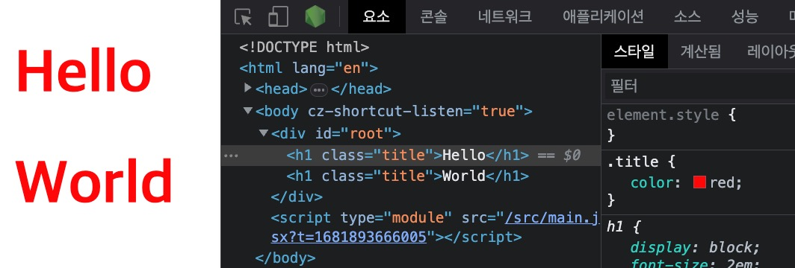
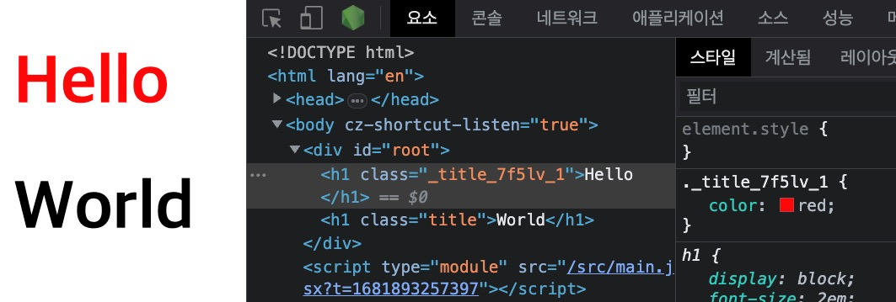

/// message-box --icon=info
이 글은 [Vite로 시작하는 React 프로젝트](/p/6iFzkB)를 기반으로 설명합니다.
///

## JSX 컴포넌트 구조

React 프로젝트에서 단일 `.jsx` 파일을 컴포넌트(Component)라고 부릅니다.
다음과 같은 기본 구조를 가지며, 컴포넌트 이름은 일반적으로 파스칼 케이스로 작성합니다.

```jsx --path=/src/App.jsx
export default function 컴포넌트이름() {
  return (
    // 템플릿(Template)
  )
}
```

React 17버전부터는 타입을 사용할 때 컴포넌트 상단에 `import React from ‘react’` 코드를 명시할 필요가 없습니다.
단, 일부 프로젝트의 개발 도구나 환경에 따라 해당 코드 명시가 필요할 수도 있습니다.

## JSX fragment

React 컴포넌트는 여러 최상위 요소를 지정할 수 없습니다.
다음과 같이 하나의 최상위 요소(`<div>`)만 지정해야 합니다.

```jsx --path=/src/App.jsx
export default function App() {
  return (
    <div>
      <header>HEADER</header>
      <main>MAIN</main>
      <footer>FOOTER</footer>
    </div>
  )
}
```

하지만 이것은 다음과 같이 요소들을 이중으로 묶는 불필요한 요소가 되기도 합니다.

```html --caption=출력된 결과.
<body>
  <div id="root">
    <div> <!-- 불필요한 div 요소 -->
      <header>HEADER</header>
      <main>MAIN</main>
      <footer>FOOTER</footer>
    </div>
  </div>
</body>
```

컴포넌트의 최상위 요소로 JSX fragment(`<></>`)를 사용하면, 별도의 요소를 생성하지 않고 여러 요소를 묶어 하나의 자식 요소처럼 출력할 수 있습니다.

```jsx --path=/src/App.jsx
export default function App() {
  return (
    <>
      <header>HEADER</header>
      <main>MAIN</main>
      <footer>FOOTER</footer>
    </>
  )
}
```

이제 다음과 같이 출력합니다.

```html --caption=출력된 결과.
<body>
  <div id="root">
    <!-- 중간 div 요소 없음 -->
    <header>HEADER</header>
    <main>MAIN</main>
    <footer>FOOTER</footer>
  </div>
</body>
```

만약 JSX fragment에 속성을 지정해야 하는 경우, 명시적으로 `<Fragment>` 컴포넌트를 사용해야 합니다.

```jsx --path=/src/App.jsx --line-active=1,5
import { Fragment } from 'react'

export default function App() {
  return (
    <Fragment key={'123'}>
      <header>HEADER</header>
      <main>MAIN</main>
      <footer>FOOTER</footer>
    </Fragment>
  )
}
```
## 데이터 보간

컴포넌트 템플릿(Template)에서 `{}` 기호를 사용해 데이터를 쉽게 출력할 수 있습니다.
이를 보간법(Interpolation)이라고 부릅니다.

```jsx --path=/src/App.jsx
export default function App() {
  const name = 'ParkYoungWoong'

  return (
    <h1>Hello, {name}!</h1>
  )
}
```

템플릿의 `{}` 기호 사이에서 간단한 표현식(Expression)을 사용할 수 있습니다.

```jsx --path=/src/App.jsx
export default function App() {
  const count = 1

  const getFullName = (firstName, lastName) => `${firstName} ${lastName}`

  return (
    <>
      <h2>{count + 7}</h2>
      <h2>{getFullName('YoungWoong', 'Park')}</h2>
    </>
  )
}
```

## 반응형 데이터

React에서 데이터가 변경될 때 그것이 연결된 화면(View)도 같이 변경되는 것을 데이터의 반응성(Reactivity)이라고 합니다. 
그리고 그 데이터를 반응형 데이터(Reactive state)라고 부르며, 줄여서 반응형이라고도 합니다.
다음과 같이 `useState` 함수를 사용해 반응형 데이터를 만들 수 있습니다.

```jsx
import { useState } from 'react'

// 반응형 데이터 선언
const [데이터이름, 데이터변경함수] = useState(기본값)

// 반응형 데이터 변경
데이터변경함수(변경할값)
```

```jsx --path=/src/App.jsx
import { useState } from 'react'

export default function App() {
  const [count, setCount] = useState(0)

  const increment = () => {
    setCount(count + 1)
  }

  return (
    <>
      <p>현재 카운트: {count}</p>
      <button onClick={increment}>카운트 증가</button>
    </>
  )
}
```

## 이벤트 핸들링

템플릿에서 `on` 키워드와 이벤트 이름을 조합해 요소의 속성으로 작성하고 실행할 함수를 연결합니다.
`on` 키워드와 조합된 이름은 `onClick`, `onKeyDown`과 같이 카멜 케이스로 작성해야 합니다.

```jsx
<div on이벤트이름={실행할함수}></div>

// 예시
<div onClick={handler}></div>
<div onChange={handler}></div>
<div onKeyDown={handler}></div>
```

```jsx --path=/src/App.jsx
import { useState } from 'react'

export default function App() {
  const [count, setCount] = useState(0)

  const increment = () => {
    setCount(count + 1)
  }

  return (
    <>
      <p>현재 카운트: {count}</p>
      <button onClick={increment}>카운트 증가</button>
    </>
  )
}
```

## HTML Class 바인딩

`class`는 자바스크립트에서 예약어(Reserved words)이므로 JSX 템플릿에서는 HTML 속성(Attribute)으로 `class` 대신 `className`을 사용해야 합니다.

```jsx --path=/src/App.jsx
import { useState } from 'react'
import './App.css'

export default function App() {
  const [active, setActive] = useState(false)

  return (
    <>
      <h1 className={`btn ${active ? 'active' : ''}`}>Hello world!</h1>
      <button onClick={() => setActive(!active)}>Toggle class name!</button>
    </>
  )
}
```

```css --path=/src/App.css
.active {
  color: red;
}
```

여러 클래스 이름을 데이터 여부로 출력하는 경우, 다음과 같이 불린 데이터를 기반으로 클래스 이름이 적용될 수 있도록 코드를 작성할 수도 있습니다.

```jsx --path=/src/App.jsx
import { useState } from 'react'
import './App.css'

export default function App() {
  const [btn, setBtn] = useState(false)
  const [active, setActive] = useState(false)
  const [size, setSize] = useState(false)

  const getClassNames = names =>
    Object.keys(names)
      .filter(name => names[name])
      .join(' ')

  const classNames = getClassNames({
    btn,
    active,
    size
  })

  return (
    <>
      <h1 className={classNames}>Hello world!</h1>

      <button onClick={() => setBtn(!btn)}>
        Toggle 'btn'
      </button>
      <button onClick={() => setActive(!active)}>
        Toggle 'active'
      </button>
      <button onClick={() => setSize(!size)}>
        Toggle 'size'
      </button>
    </>
  )
}
```

```css --path=/src/App.css
.btn {
  border: 4px solid;
}
.active {
  color: red;
}
.size {
  font-size: 16px;
}
```

## HTML Style 바인딩

`style` 속성으로 인라인 스타일을 적용할 수 있습니다.
객체 데이터로 작성할 수 있으며, 자바스크립트 표기법에 맞게 낙타 표기법(camelCase)로 CSS 속성(Properties)을 작성해야 합니다.

```jsx --path=/src/App.jsx
import { useState } from 'react'

export default function App() {
  const [size, setSize] = useState(16)

  const styles = {
    fontSize: `${size}px`, // 동적(dynamic) 값은 반응형 데이터로 관리합니다!
    fontWeight: '700' // 정적(static) 값은 별도의 CSS 파일로 관리하는 게 좋습니다.
  }

  return (
    <>
      <button onClick={() => setSize(size + 3)}>
        Size up!
      </button>
      <button onClick={() => setSize(size - 3)}>
        Size down!
      </button>
      
      <p style={styles}>
        Hello world!
      </p>
    </>
  )
}
```

## 조건부 렌더링

### 논리 연산자

조건에 따라 템플릿(HTML)을 출력하거나 출력하지 않습니다.

```jsx --path=/src/App.jsx
import { useState } from 'react'

export default function App() {
  const [message, setMessage] = useState('')

  return (
    <>
      <input 
        value={message}
        onChange={e => setMessage(e.target.value)}
      />
      {message.trim() && <div>입력된 내용이 있어요~</div>}
    </>
  )
}
```

### 삼항 연산자

조건에 따라 각자 다른 템플릿을 출력합니다.

```jsx --path=/src/App.jsx
import { useState } from 'react'

export default function App() {
  const [isActive, setIsActive] = useState(false)

  const toggle = () => {
    setIsActive(!isActive)
  }

  return (
    <>
      {isActive 
        ? <h1>활성화 - {String(isActive)}</h1> 
        : <h1>비활성화 - {String(isActive)}</h1>}
      <button onClick={toggle}>토글</button>
    </>
  )
}
```

### 더 복잡한 조건

조건에 따라 출력할 템플릿이 2개 이상인 경우, 표현식이 아닌 구문(Statement)을 템플릿에 직접 사용할 수 없기 때문에, 다음과 같이 별도 함수로 만들어 사용할 수 있습니다.

```jsx --path=/src/App.jsx
import { useState } from 'react'

export default function App() {
  const [state, setState] = useState('')

  const renderStateMessage = () => {
    if (state === 'loading') {
      return <h2>로딩 중입니다.</h2>
    } else if (state === 'success') {
      return <h2>성공적으로 완료되었습니다.</h2>
    } else {
      return <h2>대기 중입니다.</h2>
    }
  }

  return (
    <>
      <button onClick={() => setState('loading')}>
        로딩!
      </button>
      <button onClick={() => setState('success')}>
        성공!
      </button>
      
      {renderStateMessage()}
    </>
  )
}
```

## 리스트 렌더링

데이터를 기반으로 목록을 출력할 수 있습니다.
데이터의 변경사항이 있을 때 React가 반응성(Reactivity)을 효율적으로 관리할 수 있도록, 반복되는 각 요소에 `key` 속성과 함께 항목별 고유한 값을 작성해야 합니다.
`key` 속성의 고유한 값은 일반적으로 문자나 숫자 데이터를 권장합니다.

/// message-box --icon=warning
객체나 배열 데이터는 가변하는 참조형(Reference type)이므로, React가 `key` 속성을 통해 반응성을 관리할 수 없습니다.
///

```jsx --path=/src/App.jsx
export default function App() {
  const fruits = ['사과', '바나나', '체리']

  const renderFruits = fruits.map((fruit, index) => (
    <li key={index}>{fruit}</li>
  ))

  return (
    <>
      <h1>과일 리스트</h1>
      <ul>{renderFruits}</ul>
    </>
  )
}
```

별도의 함수를 만들지 않고 다음과 같이 템플릿에 직접 작성할 수도 있습니다.

```jsx --path=/src/App.jsx
export default function App() {
  const fruits = ['사과', '바나나', '체리']

  return (
    <>
      <h1>과일 리스트</h1>
      <ul>
        {fruits.map((fruit, index) => (
          <li key={index}>{fruit}</li>
        ))}
      </ul>
    </>
  )
}
```

## 계산된 데이터

`useMemo` 함수를 사용해 데이터가 변경될 때 그것을 기반으로 자동 계산되어(Computed) 업데이트되는 별도의 데이터를 만들 수 있습니다.
기반 데이터는 반응형이어야 합니다!

```jsx
import { useMemo } from 'react'

// 계산된 데이터 선언
const 계산된데이터 = useMemo(() => 새로운값, [기반데이터])
```

```jsx --path=/src/App.jsx
import { useState, useMemo } from 'react'

export default function App() {
  const [count, setCount] = useState(0)

  const double = useMemo(() => count * 2, [count])

  return (
    <>
      <h1>count: {count}</h1>
      <h2>double: {double}</h2>
      <button onClick={() => setCount(count + 1)}>증가</button>
    </>
  )
}
```

## 데이터 감시

`useEffect` 함수를 사용해 데이터가 변경될 때 그것을 감시(Watch)하여 자동으로 실행되는 함수(콜백)를 만들 수 있습니다.
감시할 데이터는 반응형이어야 합니다!

```jsx
import { useEffect } from 'react'

// 데이터 감시 선언
useEffect(실행할함수, [감시할데이터])
```

```jsx --path=/src/App.jsx
import { useState, useEffect } from 'react'

export default function App() {
  const [count, setCount] = useState(0)

  useEffect(() => {
    console.log('count 값이 변경되었습니다:', count)
  }, [count])

  return (
    <>
      <h1>카운트: {count}</h1>
      <button onClick={() => setCount(count + 1)}>증가</button>
    </>
  )
}
```

만약 `useEffect` 함수 콜백이 최초 렌더링 시 2번 연속으로 실행되는 경우, `<React.StrictMode>`를 사용하지 않는 것을 고려하세요.
이것은 프로젝트의 문제를 감지하고 경고해주는 도구로 의도적으로 2번의 렌더링을 사용할 수 있습니다.
단순히 개발 모드에서만 활성화되고 빌드 결과(제품)에는 영향을 끼치지 않으니 제거해도 좋습니다.

```jsx --path=/src/main.js --line-active=12-14 --line-error=6-8
import React from 'react'
import ReactDOM from 'react-dom/client'
import App from '~/App'

// ReactDOM.createRoot(document.getElementById('root')).render(
//   <React.StrictMode>
//     <App />
//   </React.StrictMode>
// )

ReactDOM.createRoot(document.getElementById('root')).render(
  <>
    <App />
  </>
)
```

## 양식 입력 바인딩

`input`이나 `textarea` 같은 양식(Form) 요소와 React의 반응형 데이터를 연결하는 여러 패턴의 예제를 소개합니다.

### 텍스트

```jsx
import { useState } from 'react'

export default function App() {
  const [text, setText] = useState('')

  return (
    <>
      <input
        value={text}
        onChange={(e) => setText(e.target.value)}
      />
      <h2>{text}</h2>
    </>
  )
}
```

### 여러 줄 텍스트

```jsx
import { useState } from 'react'

export default function App() {
  const [text, setText] = useState('')

  return (
    <>
      <textarea
        value={text}
        onChange={(e) => setText(e.target.value)}
      />
      <pre>{text}</pre>
    </>
  )
}
```

### 수정 가능 요소

일반 요소는 `contenteditable` 속성을 통해, 수정 가능 요소로 만들어 텍스트를 수정할 수 있습니다.

```html
<div contenteditable>Content!</div>
```

하지만 React에서 이 속성을 사용하면, 가상 DOM 충돌, 이벤트 점프 등의 문제가 발생할 수 있기 때문에, 일반적인 문제가 대부분 해결된 [react-contenteditable 라이브러리](https://www.npmjs.com/package/react-contenteditable?ref=blixt-dev)를 사용하는 것을 추천합니다.

```bash
npm i react-contenteditable
```

`<div>`, `<br/>` 같은 요소를 통해 줄바꿈 처리를 하므로, 입력된 값이 없으면 내용을 비웁니다.
`placeholder` 속성 대신 `aria-placeholder` 속성을 사용해 힌트를 제공할 수 있습니다.(CSS 코드를 같이 제공해야 합니다)

```tsx
import { useRef, useState } from 'react'
import ContentEditable from 'react-contenteditable'

export default function App() {
  const ref = useRef<HTMLElement>(null)
  const [text, setText] = useState('')
  function onChange() {
    if (ref.current && !ref.current.textContent) {
      setText('')
    }
  }

  return (
    <>
      <ContentEditable
        innerRef={ref}
        html={text}
        onChange={onChange}
        aria-placeholder="텍스트를 입력하세요!"
      />
    </>
  )
}
```

```css
[contenteditable]:empty::before {
  content: attr(aria-placeholder);
  color: #aaa;
}
```

### 단일 체크박스

```jsx
import { useState } from 'react'

export default function App() {
  const [checked, setChecked] = useState(false)

  return (
    <>
      <label>
        <input
          type="checkbox"
          checked={checked}
          onChange={(e) => setChecked(e.target.checked)}
        />
        동의합니다.
      </label>
      <h2>동의 여부: {checked ? '예' : '아니오'}</h2>
    </>
  )
}
```

### 다중 체크박스

```jsx
import { useState } from 'react'

export default function App() {
  const [checkedItems, setCheckedItems] = useState([])

  const handleCheckboxChange = event => {
    const { value, checked } = event.target
    checked
      ? setCheckedItems([...checkedItems, value]) // 체크한 경우
      : setCheckedItems(checkedItems.filter((item) => item !== value)) // 체크 해제한 경우
  }

  return (
    <>
      <p>좋아하는 음식을 모두 골라보세요~</p>
      <label>
        <input
          type="checkbox"
          value="사과"
          checked={checkedItems.includes('사과')}
          onChange={handleCheckboxChange}
        />
        사과
      </label>
      <br />
      <label>
        <input
          type="checkbox"
          value="바나나"
          checked={checkedItems.includes('바나나')}
          onChange={handleCheckboxChange}
        />
        바나나
      </label>
      <br />
      <label>
        <input
          type="checkbox"
          value="체리"
          checked={checkedItems.includes('체리')}
          onChange={handleCheckboxChange}
        />
        체리
      </label>
      <br />
      <h2>{checkedItems.join(', ')}</h2>
    </>
  )
}
```

### 라디오 버튼

```jsx
import { useState } from 'react'

export default function App() {
  const [text, setText] = useState('')

  return (
    <>
      <label>
        <input
          type="radio"
          value="사과"
          checked={text === '사과'}
          onChange={(e) => setText(e.target.value)}
        />
        사과
      </label>
      <label>
        <input
          type="radio"
          value="바나나"
          checked={text === '바나나'}
          onChange={(e) => setText(e.target.value)}
        />
        바나나
      </label>
      <h2>{text}</h2>
    </>
  )
}
```

### 단일 선택

```jsx
import { useState } from 'react'

export default function App() {
  const [selected, setSelected] = useState('')

  return (
    <>
      <select
        value={selected}
        onChange={e => setSelected(e.target.value)}>
        <option value="">선택하세요</option>
        <option>사과</option>
        <option>바나나</option>
        <option>체리</option>
      </select>
      <h2>{selected}</h2>
    </>
  )
}
```

### 다중 선택

```jsx
import { useState } from 'react'

export default function App() {
  const [selected, setSelected] = useState([])

  const handleChange = event => {
    const { options } = event.target
    const newSelected = []
    Array.from(options).forEach((option) => {
      if (option.selected) {
        newSelected.push(option.value)
      }
    })
    setSelected(newSelected)
  }

  return (
    <>
      <select
        multiple
        value={selected}
        onChange={handleChange}
        style={{ width: '100px' }}>
        <option>사과</option>
        <option>바나나</option>
        <option>체리</option>
        <option>오렌지</option>
        <option>딸기</option>
      </select>
      <h2>{selected.join(', ')}</h2>
    </>
  )
}
```

## 템플릿(요소) 참조

`document.querySelector`를 통해 요소를 검색하지 않고, 대신 `useRef` 함수를 사용해 템플릿(요소)을 바로 참조하도록 만들 수 있습니다.
기본값(Default value)은 요소를 찾지 못한 결과를 의미하는 `null`을 사용합니다. 
참조 요소는 다음 예제의 `inputRef.current`와 같이 `current` 속성으로 확인합니다.

```jsx --path=/src/App.jsx
import { useRef } from 'react'

export default function App() {
  const inputRef = useRef(null)

  return (
    <>
      <input
        type="text"
        ref={inputRef}
      />
      <button onClick={() => inputRef.current.focus()}>포커스!</button>
    </>
  )
}
```

## 컴포넌트

### 생명주기 훅

`input` 요소가 화면에 보이면 자동으로 포커스(Focus) 하기 위해 다음 예제와 같이 작성하면 에러가 발생합니다.
이것은 React 컴포넌트의 자바스크립트 코드가 동작하는 시점(Created)과 템플릿이 화면에 렌더링 되는 시점(Mounted)이 다르기 때문입니다.

```jsx
import { useRef } from 'react'

export default function App() {
  const inputRef = useRef(null)

  // input 요소에 포커스! 
  // Error - cannot read properties of null (reading 'focus')
  inputRef.current.focus()

  return (
    <>
      <input
        type="text"
        ref={inputRef}
      />
    </>
  )
}
```

다음과 같이 `useEffect` 함수를 사용하면, 템플릿이 화면에 렌더링 된 후 함수를 실행할 수 있습니다.
`useEffect` 함수는 데이터를 감시할 때도 사용하지만, 이렇게 ‘화면 준비 후’에 실행될 함수를 작성할 때도 사용합니다.
단, 감시할 데이터가 없기 때문에 두 번째 인수는 빈(Empty) 배열입니다.

```jsx
import { useEffect } from 'react'

useEffect(실행할함수, [])
```

이제 잘 동작합니다!

```jsx
import { useRef, useEffect } from 'react'

export default function App() {
  const inputRef = useRef(null)

  // 화면이 준비되면, input 요소에 포커스!
  useEffect(() => {
    inputRef.current.focus()
  }, [])

  return (
    <div>
      <input
        type="text"
        ref={inputRef}
      />
    </div>
  )
}
```

만약 다음과 같이 `useEffect` 함수의 두 번째 인수로 배열을 전달하지 않으면, 반응형 데이터 갱신 등의 영향으로 컴포넌트가 다시 렌더링 될 때마다 콜백이 실행됩니다.
일반적인 경우에 추천하는 방법은 아닙니다.

```jsx
// 컴포넌트가 다시 렌더링(Rerendering) 될 때마다 콜백이 실행
useEffect(() => {
  console.log('count 값이 변경되었습니다:')
})
```

### 부모와 자식 컴포넌트

컴포넌트는 다른 컴포넌트를 가져와서 사용할 수 있습니다.
가져온 컴포넌트는 나의 자식 컴포넌트라고 부르며, 나는 자식의 부모 컴포넌트라고 부릅니다.
다음 예제에서 `TextField.jsx`는 `App.jsx`의 자식 컴포넌트이고, `App.jsx`는 `TextField.jsx`의 부모 컴포넌트입니다.
HTML 요소의 부모/자식 관계 개념과 같습니다.

```jsx --path=/src/components/TextField.jsx
export default function TextField() {
  return (
    <>
      <input type="text" />
    </>
  )
}
```

Vite 프로젝트에서는 가져오기 경로의 `.jsx` 컴포넌트 확장자를 생략할 수 있습니다.

```jsx --path=/src/App.jsx
import TextField from './components/TextField'

export default function App() {
  return (
    <>
      <TextField />
      <TextField />
      <TextField />
    </>
  )
}
```

### Props

부모 컴포넌트에서 자식 컴포넌트로 데이터(반응형 데이터, 함수 등)를 전달할 수 있습니다.
이렇게 전달하는 데이터 혹은 그 속성을 Prop이라고 부릅니다.

```jsx --path=/src/components/TextField.jsx
export default function TextField({ label = '', hint = '', value, onChange }) {
  return (
    <div style={{ marginBottom: '10px' }}>
      <label>
        {label && `${label}::`}
        <input
          type="text"
          value={value}
          onChange={e => onChange(e.target.value)}
        />
      </label>
      {hint && (
        <div
          style={{
            marginTop: '4px',
            fontSize: '11px'
          }}>
          {hint}
        </div>
      )}
    </div>
  )
}
```

다음과 같이 컴포넌트(`<TextField>`)를 사용할 때, HTML 속성(Attribute)처럼 작성해 데이터를 전달합니다.

```jsx --path=/src/App.jsx
import { useState } from 'react'
import TextField from './components/TextField'

export default function App() {
  const [name, setName] = useState('')
  const [age, setAge] = useState('')
  const [email, setEmail] = useState('')
  return (
    <>
      <TextField
        name="이름"
        hint="한글 이름을 입력해야 합니다."
        value={name}
        onChange={setName}
      />
      <TextField
        name="나이"
        hint="만 나이를 입력해야 합니다."
        value={age}
        onChange={setAge}
      />
      <TextField
        name="이메일"
        value={email}
        onChange={setEmail}
      />
      <div>
        이름은 {name}이고 나이는 {age}세이고 이메일은 {email}입니다!
      </div>
    </>
  )
}
```

### 폴스루 속성

컴포넌트에서 Props로 정의하지 않았지만, 컴포넌트를 사용할 때 작성한 속성을 폴스루 속성(Fallthrough props)이라고 부릅니다.

```jsx --path=/src/App.jsx --line-active=13-18 --caption=Props로 정의하지 않는 여러 속성을 사용
import { useState } from 'react'
import TextField from './components/TextField'

export default function App() {
  const [email, setEmail] = useState('')

  return (
    <>
      <TextField
        label="이메일"
        value={email}
        onChange={setEmail}
        placeholder="이메일을 입력해주세요."
        name="Email"
        minlength="5"
        maxlength="24"
        autocomplete="email"
        required
        />
    </>
  )
}
```

다음과 같이, 전개 연산자(Spread operator, `...`)를 사용해 나머지 매개변수(Rest parameters)로 폴스루 속성을 원하는 요소에 연결할 수 있습니다.

```jsx --path=/src/components/TextField.jsx --line-active=1,7 --caption=...restProps
export default function TextField({ label = '', hint = '', value, onChange, ...restProps }) {
  return (
    <div style={{ marginBottom: '10px' }}>
      <label>
        {label && `${label}:`}
        <input
          {...restProps}
          value={value}
          onChange={e => onChange(e.target.value)}
        />
      </label>
      {hint && (
        <div
          style={{
            marginTop: '4px',
            fontSize: '11px'
          }}>
          {hint}
        </div>
      )}
    </div>
  )
}
```

### 슬롯

컴포넌트의 템플릿 특정 위치에 다른 컴포넌트나 요소를 삽입할 수 있는 기능을 슬롯(Slot)이라고 합니다.
`children`이라는 약속된 Prop을 사용해 슬롯을 구현할 수 있습니다.

```jsx --path=/src/components/Button.jsx
export default function Button({ children, loading = false, ...restProps }) {
  return (
    <button 
      className={loading ? 'loading' : ''} 
      {...restProps}>
      {children}
    </button>
  )
}
```

```jsx --path=/src/App.jsx
import { useState } from 'react'
import Button from './components/TextField'

export default function App() {
  const [loading, setLoading] = useState(false)
  return (
    <>
      <Button>취소</Button>
      <Button loading={loading}>확인</Button>
    </>
  )
}
```

### CSS 모듈(module)

특정 컴포넌트의 스타일을 개별적인 CSS 파일로 만들어 연결할 수 있지만, 기본적으로는 모듈이 아니기 때문에 전역으로 적용되어, 선택자만 일치하면 의도치 않게 엉뚱한 다른 컴포넌트 요소에 스타일이 적용될 수도 있습니다.
다음 예제는 `Hello.jsx`를 위해 작성한 스타일(`Hello.css`)이 `World.jsx`에도 적용되는 것을 보여줍니다.

```jsx --path=/src/components/Hello.jsx
import './Hello.css'

export default function Hello() {
  return <h1 className="title">Hello</h1>
}
```

```css --path=/src/components/Hello.css
.title {
  color: red;
}
```

```jsx --path=/src/components/World.jsx --line-active=2-3
export default function Hello() {
  // 빨간색 글자 색상이 적용됨!
  return <h1 className="title">World</h1>
}
```

```jsx --path=/src/App.jsx
import Hello from '~/components/Hello'
import World from '~/components/World'

export default function App() {
  return (
    <>
      <Hello />
      <World />
    </>
  )
}
```



React에서는 효율적으로 스타일을 관리하기 위해, 각 컴포넌트에만 개별적으로 대응하는 스타일을 만들 수 있습니다.
`Hello.css` 파일 이름을 `Hello.module.css`로 수정하면, 특정 컴포넌트에서만 유효한(Scoped) 스타일을 작성할 수 있습니다.

/// message-box --icon=info
화면에 출력하면, `.title` 선택자가 `._title_7f5lv_1`과 같이 새로운 선택자로 바뀌어 적용되는데, `_7f5lv_1`과 같이 선택자에 추가되는 접미사를 스타일 해시(Style Hash)라고 합니다.
///

```jsx --path=/src/components/Hello.jsx
import styles from './Hello.module.css'

export default function Hello() {
  return <h1 className={styles.title}>Hello</h1>
}
```

```css --path=/src/components/Hello.module.css
.title {
  color: red;
}
```



#### SCSS 구성

Vite 프로젝트는 `sass` 패키지만 설치하면, 별도 구성 없이도 바로 Sass 혹은 SCSS를 사용할 수 있습니다.
특히 SCSS 중첩(Nesting) 문법을 사용하면, 훨씬 유연하게 스타일을 관리할 수 있습니다.

```bash
npm i -D sass
```

```jsx --path=/src/components/Hello.jsx
import styles from './TextField.module.scss'

export default function Hello({ message = '' }) {
  return (
    <>
      <h1 className={styles.title}>
        <span>Hello</span> Component~
      </h1>
      <p className={styles.message}>
        {message}
      </p>
    </>
  )
}
```

```scss --path=/src/components/Hello.module.scss
.title {
  font-size: 40px;
  span {
    font-weight: bold;
    color: royalblue;
  }  
}
.message {
  font-size: 20px;
  opacity: .7;
}
```

#### 전역 스타일

만약 모듈 안에서 일부 전역 스타일을 적용하고 싶다면, 다음과 같이 `:global` 선택자를 사용할 수 있습니다.

```css --path=/src/components/Hello.module.css
.title {
  font-size: 40px;
  span {
    font-weight: bold;
    color: royalblue;
  } 
}
:global .message {
  font-size: 20px;
  opacity: .7;
}
```
