/// message-box --icon=info
이 글은 NextAuth.js(Auth.js) `5.0.0-beta.22` 버전을 기준으로 작성되었습니다.(`path-to-regexp@^7`)
NextAuth.js v5는 기존 v4에서 Next.js App Router가 우선 지원되는 새로운 버전으로, Next.js v14 이상을 필요로 합니다.
///

/// message-box --icon=info
현재 글과 관련된 프로젝트 저장소를 참고하세요.
https://github.com/ParkYoungWoong/nextjs-app--Authjs_Zustand_TanStackQuery
/// 

- v4 문서: https://next-auth.js.org/
- v5 문서: https://authjs.dev/

Auth.js(NextAuth.js)는 Next.js 프로젝트의 사용자 인증 및 세션 관리를 위한 라이브러리입니다.
Google, GitHub 등의 다양한 인증 공급자를 지원하며, Next.js의 서버와 클라이언트 측 모두에서 인증 및 세션 관리를 손쉽게 처리할 수 있습니다.

## 설치 및 구성

[Next.js 프로젝트 설치 및 구성](/p/n7JHmI#h3_%EC%84%A4%EC%B9%98_%EB%B0%8F_%EA%B5%AC%EC%84%B1)을 완료한 상태에서 시작합니다!

```bash
npm i next-auth@beta path-to-regexp
```

`AUTH_SECRET`은 토큰 및 이메일 확인 해시를 암호화하는 값으로 사용됩니다.
터미널에서 다음과 같이 입력하면, 자동으로 환경변수를 생성합니다.

```bash
npx auth secret
    # Secret generated. Copy it to your .env/.env.local file (depending on your framework):
    # AUTH_SECRET=1234...
```

```plaintext --path=/.env.local
AUTH_SECRET="1234..."
```

### 기본 구성

NextAuth() 호출로 반환되는 `handlers`, `signIn`, `signOut`, `auth`, `update`를 프로젝트에서 사용할 수 있습니다.

- `handlers`: 프로젝트의 인증 관리를 위한 API 라우트(`GET`, `POST` 함수) 객체입니다.
- `signIn`: 사용자 로그인을 시도하는 비동기 함수입니다.
- `signOut`: 사용자 로그아웃을 시도하는 비동기 함수입니다.
- `auth`: 세션 정보를 반환하는 비동기 함수입니다.
- `unstable_update(update)`: 세션 정보를 갱신하는 비동기 함수입니다.

/// message-box --icon=warning
`next-auth@beta`에서 `unstable_update` 함수는 Next.js 서버 코드(컴포넌트)에서 세션 정보를 갱신할 수 있는 실험적인 기능으로, 추후 `update` 이름으로 사용되거나 다른 방식으로 변경될 수 있습니다.
///

호출 옵션으로 다음과 같은 항목을 지정할 수 있습니다.
`providers`를 제외하면, 모두 선택 항목입니다.

- `providers`: Credentials, Google, GitHub 등의 인증 공급자를 지정합니다.
- `session`: 세션 관리 방식을 지정합니다.
- `pages`: 사용자 정의 페이지 경로를 지정하며, 로그인 페이지의 기본값은 `/auth/signin`입니다.
- `callbacks`: 인증 및 세션 관리 중 호출되는 각 핸들러를 지정합니다.
- `callbacks.signIn`: 사용자 로그인을 시도했을 때 호출되며, `true`를 반환하면 로그인 성공, `false`를 반환하면 로그인 실패로 처리됩니다.
- `callbacks.redirect`: 페이지 이동 시 호출되며, 반환하는 값은 리다이렉션될 URL입니다.
- `callbacks.jwt`: JWT가 생성되거나 업데이트될 때 호출되며, 반환하는 값은 암호화되어 쿠키에 저장됩니다.
- `callbacks.session`: `jwt` 콜백이 반환하는 `token`을 받아, 세션이 확인될 때마다 호출되며, 반환하는 값은 클라이언트에서 확인할 수 있습니다. (2번 이상 호출될 수 있습니다)

각 콜백의 호출 순서는 다음과 같습니다.

- 사용자가 로그인(회원가입) => `signIn` => (`redirect`) => `jwt` => `session`
- 세션 업데이트 => `jwt` => `session`
- 세션 확인 => `session`

```ts --path=/auth.ts
import NextAuth from 'next-auth'

export const {
  handlers,
  signIn,
  signOut,
  auth,
  unstable_update: update // Beta!
} = NextAuth({
  providers: [
    // ...
  ],
  session: {
    strategy: 'jwt', // JSON Web Token 사용
    maxAge: 60 * 60 * 24 // 세션 만료 시간(sec)
  },
  pages: {
    signIn: '/signin' // Default: '/auth/signin'
  },
  callbacks: {
    signIn: async () => {
      return true
    },
    jwt: async ({ token, user }) => {
      return token
    },
    session: async ({ session, token }) => {
      return session
    }
  }
})
```

콜백 URL(E.g, `?callbackUrl=/dashboard`)을 사용하는 경우, 다음과 같이 `redirect` 콜백을 지정할 수 있습니다.
그리고 주의할 점은, `signIn(공급자, 옵션)` 함수를 호출할 때 `redirectTo` 옵션을 사용하지 않아야 합니다.

```ts --path=/auth.ts
callbacks: {
  // `url`은 다음과 같을 수 있습니다.
  // '/abc'
  // '/abc?callbackUrl=/xyz'
  // 'https://heropy.dev/abc?callbackUrl=/xyz'
  // 'https://heropy.dev/abc?callbackUrl=https://heropy.dev/xyz'
  // ...
  redirect: async ({ url, baseUrl }) => {
    if (url.startsWith('/')) return `${baseUrl}${url}`
    if (url) {
      const { search, origin } = new URL(url)
      const callbackUrl = new URLSearchParams(search).get('callbackUrl')
      if (callbackUrl)
        return callbackUrl.startsWith('/')
          ? `${baseUrl}${callbackUrl}`
          : callbackUrl
      if (origin === baseUrl) return url
    }
    return baseUrl
  }
}
```

### 미들웨어 구성

특정 경로로 이동하기 전에 서버 측에서 실행되는 코드(미들웨어)를 제공해, 경로별 인증 여부 확인이 가능합니다.
다음과 같이 별도의 경로 매칭 함수를 작성해 사용하면, 더욱 구체적으로 경로별 인증 관리가 가능합니다.

```ts --path=/middleware.ts
import { NextResponse } from 'next/server'
import type { NextRequest } from 'next/server'
import { match } from 'path-to-regexp'
import { getSession } from '@/serverActions/auth' // import { auth } from '@/auth'

const matchersForAuth = [
  '/dashboard/*',
  '/myaccount/*',
  '/settings/*',
  '...'
]
const matchersForSignIn = [
  '/signup/*', 
  '/signin/*'
]
export async function middleware(request: NextRequest) {
  // 인증이 필요한 페이지 접근 제어!
  if (isMatch(request.nextUrl.pathname, matchersForAuth)) {
    return (await getSession()) // 세션 정보 확인
      ? NextResponse.next()
      : NextResponse.redirect(new URL('/signin', request.url))
      // : NextResponse.redirect(new URL(`/signin?callbackUrl=${request.url}`, request.url))
  }
  // 인증 후 회원가입 및 로그인 접근 제어!
  if (isMatch(request.nextUrl.pathname, matchersForSignIn)) {
    return (await getSession())
      ? NextResponse.redirect(new URL('/', request.url))
      : NextResponse.next()
  }
  return NextResponse.next()
}

// 경로 일치 확인!
function isMatch(pathname: string, urls: string[]) {
  return urls.some(url => !!match(url)(pathname))
}
```

### API 라우트 구성

Auth.js는 `/api/auth/` 이하 경로에서 인증을 처리합니다.
[모든 하위 경로의 동적 일치(Catch all API routes)](/p/n7JHmI#h3_동적_경로)로 라우트를 제공하고, 기본 구성에서 반환하는 `handlers` 객체로 라우트의 `GET`과 `POST` 함수를 매핑합니다.

```ts --path=/app/api/auth/[...nextauth]/route.ts
import { handlers } from '@/auth'

export const { GET, POST } = handlers
// export const runtime = 'edge' // Optional!
```

### 서버 액션 구성

프로젝트의 각 서버 및 클라이언트 컴포넌트에서 사용할 수 있도록, 로그인(회원가입)과 로그아웃을 서버 액션으로 작성합니다.

/// message-box --icon=info
Next.js App Router의 클라이언트 컴포넌트는 `'use server'` 선언의 모듈에서만 서버 액션을 사용할 수 있습니다.
///

```ts --path=/serverActions/auth.ts
'use server'
import { auth, signIn, signOut, update } from '@/auth'

export const signInWithCredentials = async (formData: FormData) => {
  await signIn('credentials', { /* 옵션 */ })
  // ...
}
export const signInWithGoogle = async () => {
  await signIn('google', { /* 옵션 */ })
  // ...
}
export const signInWithGitHub = async () => {
  await signIn('github', { /* 옵션 */ })
  // ...
}
export const signOutWithForm = async (formData: FormData) => {
  await signOut()
}
export {
  auth as getSession, 
  update as updateSession
}
```

### 테스트 구성

직접 인증 관련 테스트를 진행해 보려면, 다음과 같이 페이지와 컴포넌트 등을 구성할 수 있습니다.

```ts --path=/app/layout.tsx
import Header from '@/components/Header'

export default function RootLayout({
  children
}: Readonly<{
  children: React.ReactNode
}>) {
  return (
    <html lang="ko">
      <body>
        <Header />
        {children}
      </body>
    </html>
  )
}
```

```ts --path=/app/page.tsx
export default function HomePage() {
  return <h1>Home Page</h1>
}
```

```ts --path=/components/Header.tsx
import Link from 'next/link'

export default async function Header() {
  return (
    <header>
      <nav style={{ display: 'flex', gap: '10px' }}>
        <Link href="/">메인</Link>
        <Link href="/signin">로그인</Link>
        <Link href="/signup">회원가입</Link>
      </nav>
    </header>
  )
}
```

## Credentials 공급자

자격 증명 공급자(`Credentials`)를 사용해, 사용자 이름, 이메일, 비밀번호를 이용한 회원가입 및 로그인을 구현할 수 있습니다.

### 회원가입 및 로그인 구현

`signInWithCredentials` 서버 액션에서 `signIn` 메소드를 `'credentials'`로 호출해, 사용자가 입력한 회원가입 혹은 로그인 정보를 전달합니다.
그리고 회원가입 및 로그인이 성공하면 메인 페이지로 리다이렉션하도록 `redirectTo` 옵션을 제공할 수 있습니다.

/// message-box --icon=warning
`signIn('credentials')` 함수의 옵션에서 `displayName` 같은 각 속성의 값은 문자로 변환됩니다.
따라서 `formData.get('displayName')`이 `null`이면, `'null'` 문자로 전달되므로 주의해야 합니다.
///

```ts --path=/serverActions/auth.ts
'use server'
import { auth, signIn, signOut, update } from '@/auth'

export const signInWithCredentials = async (formData: FormData) => {
  await signIn('credentials', {
    displayName: formData.get('displayName') || '', // `'null'` 문자 방지
    email: formData.get('email') || '',
    password: formData.get('password') || '',
    // redirectTo: '/' // 로그인 후 메인 페이지로 이동!
  })
}
export const signOutWithForm = async (formData: FormData) => {
  await signOut()
}
export {
  auth as getSession, 
  update as updateSession
}
```

기본적인 공급자 옵션은 다음과 같습니다.

`authorize` 함수의 `credentials` 매개변수는 서버 액션에서 호출한 `signIn('credentials', 사용자정보)` 메소드의 두 번째 인수(`사용자정보`)입니다.
또한 `authorize` 함수는 회원가입 및 로그인에 성공한 경우, 사용자의 ID(`id`), 표시 이름(`name`), 이메일(`email`), 프로필 이미지(`image`)의 정해진 속성으로 정보를 반환해야 합니다.

```ts --path=/auth.ts --line-active=2,8-22
import NextAuth from 'next-auth'
import Credentials from 'next-auth/providers/credentials'

export const {
  // ...
} = NextAuth({
  providers: [
    Credentials({
      authorize: async credentials => {
        const { displayName, email, password } = credentials
        let user = { id: '', name: '', email: '', image: '' }

        // 사용자 이름이 있는 경우, 회원가입!
        if (displayName) {
          // <회원가입 로직 ...>
          return user
        }

        // <로그인 로직 ...>
        return user
      }
    })
  ],
  // ...
})
```

`<Header>` 컴포넌트는 다음과 같이 작성합니다.
`getSession` 서버 액션의 반환값은 사용자 세션 정보입니다.
로그아웃 후 `<Header>` 컴포넌트가 갱신되어야 하므로, `<form>` 요소에 `signOutWithForm` 서버 액션을 연결합니다.

```tsx --path=/components/Header.tsx
import Link from 'next/link'
import { getSession, signOutWithForm } from '@/serverActions/auth'

export default async function Header() {
  const session = await getSession()
  return (
    <header>
      {session?.user && <div>{session.user.name}</div>}
      <nav style={{ display: 'flex', gap: '10px' }}>
        <Link href="/">메인</Link>
        {session?.user ? (
          <>
            <form action={signOutWithForm}>
              <button type="submit">로그아웃</button>
            </form>
          </>
        ) : (
          <>
            <Link href="/signin">로그인</Link>
            <Link href="/signup">회원가입</Link>
          </>
        )}
      </nav>
    </header>
  )
}
```

그리고 각 회원가입과 로그인 페이지를 다음과 같이 작성합니다.

```ts --path=/app/signup/page.tsx --caption=회원가입 페이지
import { signInWithCredentials } from '@/serverActions/auth'

export default function SignUpPage() {
  return (
    <>
      <h1>회원가입</h1>
      <form
        action={signInWithCredentials}
        style={{
          display: 'flex',
          flexDirection: 'column',
          alignItems: 'start',
          gap: '10px'
        }}>
        <label>
          사용자 이름
          <input
            name="displayName"
            type="text"
          />
        </label>
        <label>
          이메일(ID)
          <input
            name="email"
            type="email"
          />
        </label>
        <label>
          비밀번호
          <input
            name="password"
            type="password"
          />
        </label>
        <button>회원가입</button>
      </form>
    </>
  )
}
```

```ts --path=/app/signin/page.tsx --caption=로그인 페이지
import { signInWithCredentials } from '@/serverActions/auth'

export default function SignInPage() {
  return (
    <>
      <h1>로그인</h1>
      <form
        action={signInWithCredentials}
        style={{
          display: 'flex',
          flexDirection: 'column',
          alignItems: 'start',
          gap: '10px'
        }}>
        <label>
          이메일(ID)
          <input
            name="email"
            type="email"
          />
        </label>
        <label>
          비밀번호
          <input
            name="password"
            type="password"
          />
        </label>
        <button>로그인</button>
      </form>
    </>
  )
}
```

### 액세스 토큰 관리

프로젝트에서 API를 액세스 토큰과 함께 요청해야 하는 경우, 사용자 세션 정보에 액세스 토큰을 추가할 수 있습니다.
`authorize` 함수에서 반환하는 사용자 정보에 `accessToken` 속성을 추가하고, 세션까지 전달해야 합니다.
`authorize` 함수에서 반환하는 사용자 정보는, 로그인이 성공하면 `callbacks.jwt` 함수의 `user` 변수로 전달되고, `callbacks.jwt` 함수에서 반환하는 토큰 정보는 `callbacks.session` 함수의 `token` 변수로 전달됩니다.
마지막으로 `callbacks.session` 함수에서 반환하는 세션 정보는 각 페이지에서 사용할 수 있습니다.

```ts --path=/auth.ts --line-active=18,25,37-39,43-45
import NextAuth from 'next-auth'
import Credentials from 'next-auth/providers/credentials'

export const {
  // ...
} = NextAuth({
  providers: [
    Credentials({
      authorize: async credentials => {
        const { displayName, email, password } = credentials
        let user = { id: '', name: '', email: '', image: '' }

        // 사용자 이름이 있는 경우, 회원가입!
        if (displayName) {
          // <회원가입 로직 ...>
          return {
            ...user,
            accessToken: '<ACCESS_TOKEN>'
          }
        }

        // <로그인 로직 ...>
        return {
          ...user,
          accessToken: '<ACCESS_TOKEN>'
        }
      }
    })
  ],
  // ...

  callbacks: {
    signIn: async () => {
      return true
    },
    jwt: async ({ token, user }) => {
      if (user?.accessToken) {
        token.accessToken = user.accessToken
      }
      return token
    },
    session: async ({ session, token }) => {
      if (token?.accessToken) {
        session.accessToken = token.accessToken
      }
      return session
    },
    // ...
  }
})
```

`accessToken` 속성은 `next-auth` 라이브러리에 정의되지 않은 타입이므로, 다음과 같이 별도 타입 정의를 추가합니다.

```ts --path=/types/auth.d.ts
export declare module 'next-auth' {
  interface User {
    accessToken: string
  }
  interface Session {
    accessToken: string
  }
}
export declare module '@auth/core/jwt' {
  interface JWT {
    accessToken: string
  }
}
```

이제, 세션 정보의 액세스 코드를 다음과 같이 활용할 수 있습니다.

```ts --path=/app/myaccount/page.tsx --line-active=13 --caption=액세스 코드와 함께 API 요청 예시
import { getSession } from '@/serverActions/auth'

interface ResponseValue {
  totalBalance: number
}

export default async function MyaccountPage() {
  const session = await getSession()
  const res = await fetch(`${process.env.HEROPY_API_URL}/banks/account`, {
    method: 'GET',
    headers: {
      'Content-Type': 'application/json',
      apikey: process.env.HEROPY_API_KEY as string,
      username: 'HEROPY',
      Authorization: `Bearer ${session.accessToken}`
    }
  })
  const account = (await res.json()) as ResponseValue
  return <div>{account?.totalBalance}</div>
}
```

### 세션 정보 갱신

사용자 정보가 변경되었을 때, 세션 정보를 갱신하려면 `updateSession` 서버 액션을 다음과 같이 호출할 수 있습니다.

```ts
import { updateSession } from '@/serverActions/auth'

await updateSession({
  user: {
    name: updatedUser.name,
    image: updatedUser.image
  }
})
```

`updateSession` 서버 액션이 호출되면, `callbacks.jwt` 콜백이 호출되며, `trigger`와 `session` 속성으로 정보가 전달됩니다.
`trigger`는 갱신 이벤트이고 `session`은 갱신된 세션 정보로, 다음과 같이 반환되는 토큰 정보에 갱신된 사용자 정보를 추가합니다.

```ts --path=/auth.ts --line-active=6-9
callbacks: {
  jwt: async ({ token, user, trigger, session }) => {
    if (user?.accessToken) {
      token.accessToken = user.accessToken
    }
    if (trigger === 'update' && session) {
      Object.assign(token, session.user)
      token.picture = session.user.image // 사진을 변경했을 때 반영!
    }
    return token
  }
}
```

구성이 완료되면, 아래 예시와 같이 사용자 이름을 변경할 수 있는 페이지를 제공할 수 있습니다.

```tsx --path=/app/myaccount/page.tsx
import { getSession } from '@/serverActions/auth'
import { updateUser } from '@/serverActions/user'

export default async function MyaccountPage() {
  const session = await getSession()
  return (
    <>
      <form action={updateUser}>
        <label>
          사용자 이름
          <input
            name="displayName"
            type="text"
            defaultValue={session?.user?.name || ''}
          />
        </label>
        <button type="submit">수정</button>
      </form>
    </>
  )
}
```

`updateUser` 서버 액션은 다음 예시처럼 작성할 수 있습니다.

```tsx --path=/serverActions/user.ts --line-active=22-27
'use server'
import { redirect } from 'next/navigation'
import { getSession, updateSession } from '@/serverActions/auth'

export async function updateUser(formData: FormData) {
  const session = await getSession()
  const res = await fetch(
    `${process.env.HEROPY_API_URL}/auth/user`,
    {
      method: 'PUT',
      headers: {
        'Content-Type': 'application/json',
        apikey: process.env.HEROPY_API_KEY as string,
        username: 'HEROPY',
        Authorization: `Bearer ${session?.accessToken}`
      },
      body: JSON.stringify({
        displayName: formData.get('displayName')
      })
    }
  )
  const updatedUser = await res.json()
  await updateSession({
    user: {
      name: updatedUser.displayName
    }
  })
  redirect('/myaccount') // 화면 출력 갱신
}
```

### 예외 처리

회원가입 및 로그인 과정에서 발생하는 에러를 처리하려면, 다음과 같이 에러를 반환(`throw`)합니다.

```ts --path=/auth.ts --line-active=14-16
// ...

export const { 
  // ...
} = NextAuth({
  providers: [
    Credentials({
      authorize: async credentials => {
        const { displayName, email, password } = credentials
        let user = { id: '', name: '', email: '', image: '' }

        try {
          // 회원가입 및 로그인 로직..
        } catch (error) {
          throw new Error(error.message)
        }
      }
    })
  ],
  // ...
})
```

만약 에러 메시지를 별도의 페이지(`error.tsx`)에 출력하려면, 로그인과 회원가입 서버 액션에서 다음과 같이 에러 객체를 반환합니다.

```tsx --path=/serverActions/auth.ts --line-active=12-15 --line-error=9,11
// ...

export const signInWithCredentials = async (formData: FormData) => {
  try {
    await signIn('credentials', {
      displayName: formData.get('displayName'),
      email: formData.get('email'),
      password: formData.get('password'),
      // redirectTo: '/'  <= 이 속성은 try 문 안에서 동작하지 않습니다! Beta?
    })
    // 로그인에 성공하면, 리다이렉션을 에러 캐치로 처리하므로 이 위치에 실행할 코드를 추가하지 마세요! Beta?
  } catch (error) {
    // @ts-ignore-next-line // 아직 해당 타입이 없어 무시합니다. // if (error instanceof CredentialsSignin)
    throw new Error(error.cause.err.message)
  }
  redirect('/') // 또는 return { message: '메시지!' }
}
// ...
```

```tsx --path=/app/error.tsx --caption=에러 페이지는 클라이언트 컴포넌트여야 합니다.
'use client'
export default function ErrorPage({ error }: { error: Error }) {
  return (
    <>
      <h1>Error Page</h1>
      <h2>{error.message}</h2>
    </>
  )
}
```

만약 에러 메시지를 페이지 이동 없이 회원가입 또는 로그인 페이지에서 그대로 출력하려면,
다음과 같이 `useFormState` 훅(Hook)으로 서버 액션을 연결하고 출력할 메시지를 상태로 관리합니다.
`useFormState` 훅(Hook)은 클라이언트 컴포넌트에서만 사용할 수 있습니다.

```tsx --path=/app/signup/page.tsx --line-active=1,2,4,7-9,13,15,43
'use client'
import { useFormState } from 'react-dom'
import { signInWithCredentials } from '@/serverActions/auth'
import SubmitButton from '@/components/SubmitButton'

export default function SignUpPage() {
  const [state, action] = useFormState(signInWithCredentials, {
    message: ''
  })
  return (
    <>
      <h1>회원가입</h1>
      <h2>{state.message}</h2>
      <form
        action={action}
        style={{
          display: 'flex',
          flexDirection: 'column',
          alignItems: 'start',
          gap: '10px'
        }}>
        <label>
          사용자 이름
          <input
            name="displayName"
            type="text"
          />
        </label>
        <label>
          이메일(ID)
          <input
            name="email"
            type="email"
          />
        </label>
        <label>
          비밀번호
          <input
            name="password"
            type="password"
          />
        </label>
        <SubmitButton name="회원가입" />
      </form>
    </>
  )
}
```

```tsx --path=/app/signin/page.tsx --line-active=1,2,4,7-9,13,36
'use client'
import { useFormState } from 'react-dom'
import { signInWithCredentials } from '@/serverActions/auth'
import SubmitButton from '@/components/SubmitButton'

export default function SignInPage() {
  const [state, action] = useFormState(signInWithCredentials, {
    message: ''
  })
  return (
    <>
      <h1>로그인</h1>
      <h2>{state.message}</h2>
      <form
        action={action}
        style={{
          display: 'flex',
          flexDirection: 'column',
          alignItems: 'start',
          gap: '10px'
        }}>
        <label>
          이메일(ID)
          <input
            name="email"
            type="email"
          />
        </label>
        <label>
          비밀번호
          <input
            name="password"
            type="password"
          />
        </label>
        <SubmitButton name="로그인" />
      </form>
    </>
  )
}
```

이제 `useFormStatus` 훅으로 비동기 상태를 관리할 수 있습니다.
회원가입 및 로그인 페이지에서 사용할 제출 버튼 컴포넌트를 다음과 같이 작성합니다.

```tsx --path=/components/SubmitButton.tsx --caption=type="submit" 필수!
'use client'
import { useFormStatus } from 'react-dom'

export default function SubmitButton({ name }: { name: string }) {
  const { pending } = useFormStatus()
  return (
    <button
      type="submit"
      disabled={pending}>
      {pending ? '로딩...' : name}
    </button>
  )
}
```

```ts --caption=useFormState와 useFormStatus Hook
const [state, formAction] = useFormState(액션함수, 상태초깃값)
const { pending, data, method, action } = useFormStatus()
```

이제 서버 액션을 `<form>` 요소에 직접 연결하지 않으므로, `useFormState` 훅의 인수 타입에 맞게 서버 액션을 수정해야 합니다.
그리고 서버 액션은 `initialState` 타입과 일치하는 데이터를 반환해야 합니다.

```tsx --path=/serverActions/auth.ts --line-active=4,13-16
// ...

export const signInWithCredentials = async (
  initialState: { message: string },
  formData: FormData
) => {
  try {
    await signIn('credentials', {
      displayName: formData.get('displayName'),
      email: formData.get('email'),
      password: formData.get('password')
    })
  } catch (error) {
    // @ts-ignore-next-line
    return { message: error.cause.err.message }
  }
  redirect('/')
}
// ...
```

### 활용 예시

좀 더 구체적인 활용 예시로, 다음과 같이 회원가입 및 로그인 API를 활용할 수도 있습니다.

```ts --path=/auth.ts
import NextAuth from 'next-auth'
import Credentials from 'next-auth/providers/credentials'

interface UserInfo {
  displayName?: string
  email: string
  password: string
}
interface ResponseValue {
  user: {
    email: string
    displayName: string
    profileImg: string | null
  }
  accessToken: string
}

export const {
  // ...
} = NextAuth({
  providers: [
    Credentials({
      authorize: async credentials => {
        const userInfo = credentials as unknown as UserInfo

        try {
          // 회원가입
          if (userInfo.displayName) {
            return _signIn('signup', userInfo)
          }
          // 로그인
          return _signIn('login', userInfo)
        } catch (error) {
          throw new Error(error.message)
        }
      }
    })
  ],
  // ...
})

async function _signIn(
  type: 'signup' | 'login',
  body: { displayName?: string; email: string; password: string }
) {
  const res = await fetch(`${process.env.HEROPY_API_URL}/auth/${type}`, {
    method: 'POST',
    headers: {
      'Content-Type': 'application/json',
      apikey: process.env.HEROPY_API_KEY,
      username: process.env.HEROPY_API_USERNAME
    },
    body: JSON.stringify(body)
  })
  const data = (await res.json()) as ResponseValue | string

  if (res.ok && typeof data !== 'string') {
    const { user, accessToken } = data
    return {
      id: user.email,
      email: user.email,
      name: user.displayName,
      image: user.profileImg,
      accessToken
    }
  }

  throw new Error(
    (data || '문제가 발생했습니다, 잠시 후 다시 시도하세요.') as string
  )
}
```

## Google 공급자

주로 '소셜 로그인'이라고 부르는 방식으로, `Google` 공급자를 통해 사용자의 구글 계정으로 회원가입 및 로그인을 구현할 수 있습니다.

### 클라이언트 ID 및 SECRET 발급

`Google` 공급자를 사용하려면, [Google Cloud Console](https://console.cloud.google.com/)로 접속해 프로젝트를 생성하고, OAuth 2.0 클라이언트 ID를 발급받아야 합니다.

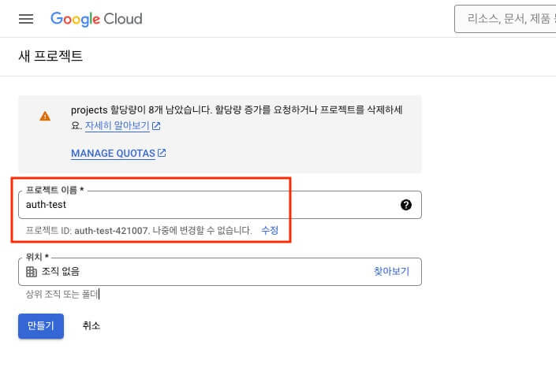

OAuth 동의 화면을 구성해야, 클라이언트 ID를 발급받을 수 있습니다.

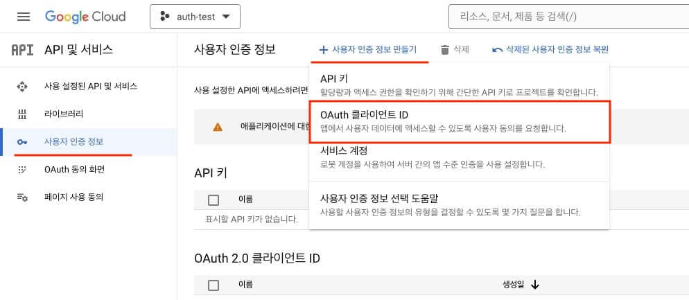

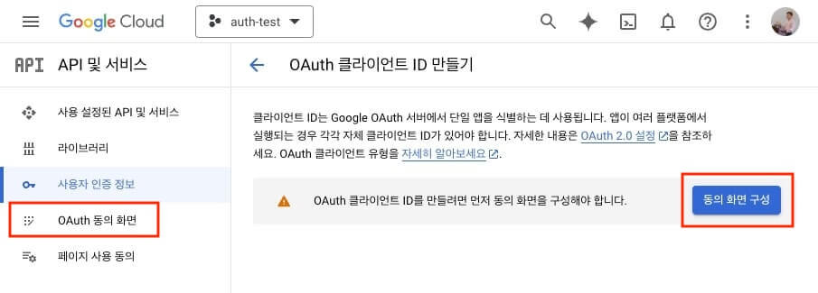

프로젝트의 사용자 타입을 선택합니다.
프로젝트에 누구나 회원가입이 가능하다면, `외부`로 선택합니다.

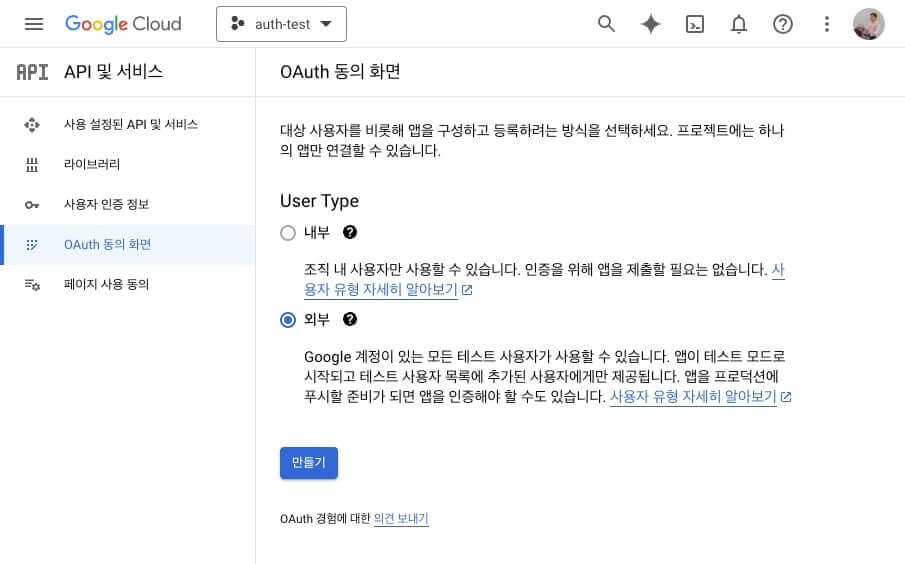

OAuth 동의 화면의 기본 정보를 입력합니다.
'앱 도메인'과 '승인된 도메인'은 당장 제공하지 않아도 됩니다.

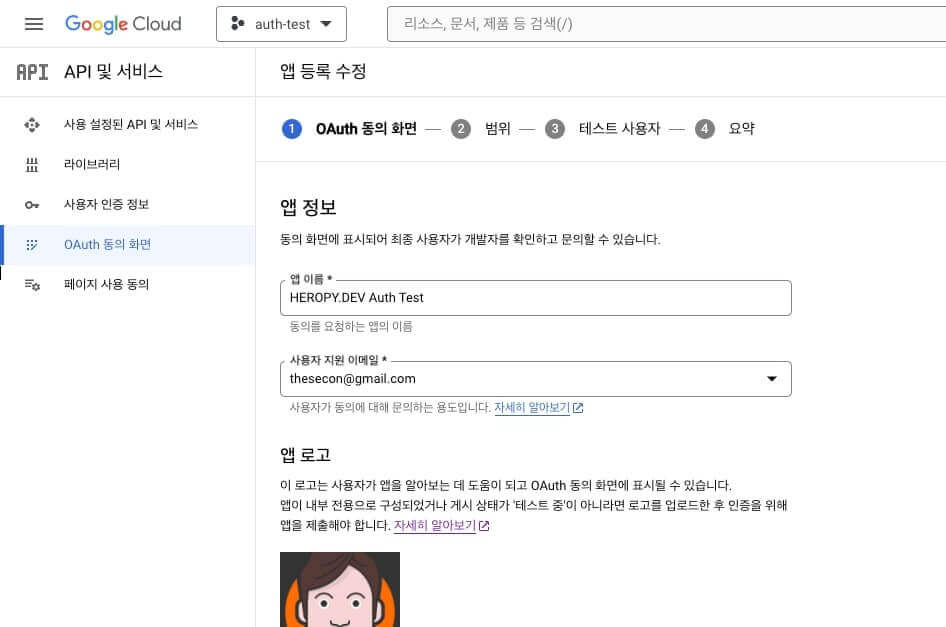

다음 단계에서는 사용자에게 요청하는 권한 범위를 설정합니다.
'민감하지 않은 범위'만 선택해도 기본적인 사용자 정보는 가져올 수 있습니다.

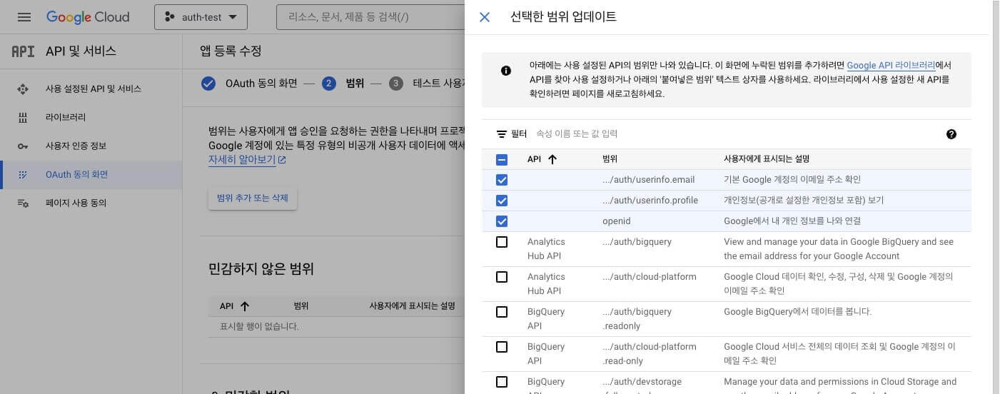

다음, 다음으로 동의 화면 구성을 마치면, 다음과 같은 화면을 볼 수 있습니다.

/// message-box --icon=info
'앱 게시'는 서비스를 최종 배포할 때 진행해야 하는 과정이며, 심사부터 승인까지 프로젝트 규모에 따라 1~4주 정도 소요됩니다.
///

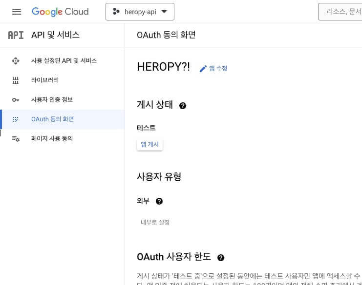

동의 화면 구성이 끝났으니, OAuth 클라이언트 ID를 발급받을 차례입니다.
'사용자 인증 정보 페이지'로 이동해, '사용자 인증 정보 만들기 / OAuth 클라이언트 ID'를 선택합니다.


'승인된 자바스크립트 원본'에는 인증을 통과할 수 있는 '프로토콜 + 도메인 + 포트'를 입력하며, 등록되지 않은 주소는 사용할 수 없습니다.
'승인된 리디렉션 URI'에는 로그인 후 리다이렉션될 페이지의 URL을 작성해야 하며, 다음 주소를 입력하세요!

```plaintext
http://localhost:3000/api/auth/callback/google
```

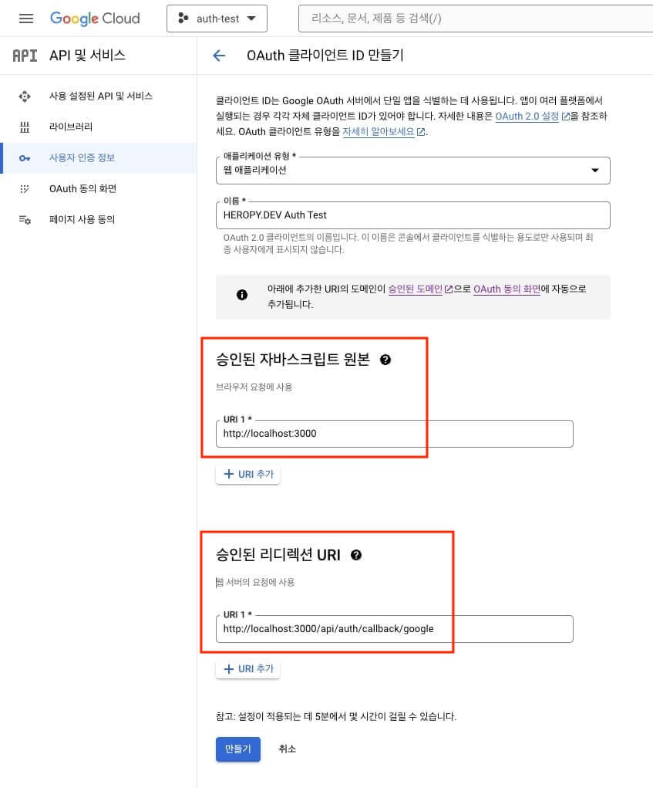

등록하지 않은 주소를 사용하면, 다음과 같은 오류가 발생합니다.
특히 포트 번호를 잘 확인해야 합니다!

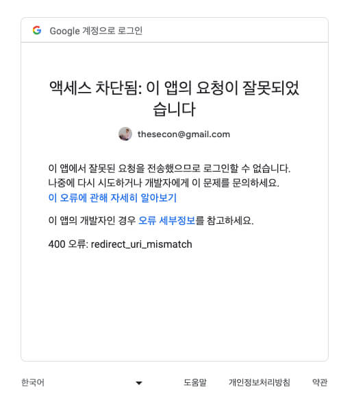

OAuth 클라이언트 만들기가 끝나면, 다음과 같이 클라이언트 ID와 SECRET 값을 확인할 수 있습니다.

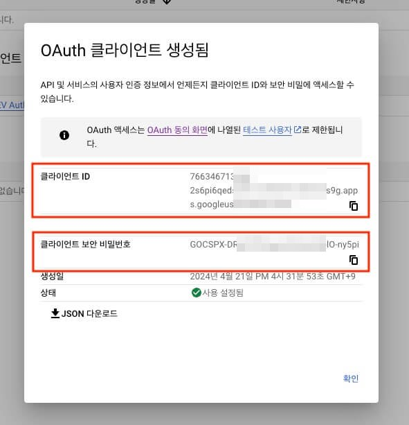

클라이언트 ID와 SECRET 값을 환경변수로 등록합니다.

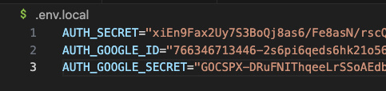

### 회원가입 및 로그인 구현

`signInWithGoogle` 서버 액션에서 `signIn` 메소드를 `'google'`로 호출합니다.
`redirectTo` 옵션을 사용해, 로그인 후 리다이렉션될 페이지를 지정할 수 있습니다.

```ts --path=/serverActions/auth.ts
'use server'
import { auth, signIn, signOut, update } from '@/auth'

export const signInWithGoogle = async () => {
  await signIn('google', { redirectTo: '/' })
}
export const signOutWithForm = async (formData: FormData) => {
  await signOut()
}
export {
  auth as getSession, 
  update as updateSession
}
```

Google OAuth를 사용하면, 별도의 회원가입 페이지를 제공하지 않아도 됩니다.
다음과 같이 로그인 페이지에서만 '구글 로그인' 버튼을 제공하고, 로그인 사용자의 DB 존재 여부에 따라 회원가입 또는 로그인을 처리합니다.

```tsx --path=/app/signin/page.tsx
import { signInWithGoogle } from '@/serverActions/auth'

export default function SignInPage() {
  return (
    <>
      <h1>로그인</h1>
      <form action={signInWithGoogle}>
        <button type="submit">구글 로그인</button>
      </form>
    </>
  )
}
```

`Google` 공급자를 사용해, 앞서 만든 클라이언트 ID와 SECRET 값을 제공합니다.
`signIn` 콜백에서 `account?.provider`가 `'google'`인 경우에, `Google` 공급자를 확인할 수 있으므로, 이때 회원가입이나 로그인을 처리합니다.
`profile?.email_verified`가 `true`인 경우에만 로그인이 성공 처리되며, 나머지는 실패 처리되도록 합니다.

[액세스 토큰 관리](/p/MI1Khc#h3_%EC%95%A1%EC%84%B8%EC%8A%A4_%ED%86%A0%ED%81%B0_%EA%B4%80%EB%A6%AC)와 [세션 정보 갱신](/p/MI1Khc#h3_%EC%84%B8%EC%85%98_%EC%A0%95%EB%B3%B4_%EA%B0%B1%EC%8B%A0)은 앞서 확인한 'Credentials' 내용과 같습니다.
만약 별도의 액세스 토큰 관리나 세션 정보 갱신이 필요치 않은 경우, `jwt`와 `session` 콜백에서 관련 코드를 제거하세요.

```ts --path=/auth.ts --line-active=8-16,26-32 --line-error=34-36,43-45
import NextAuth from 'next-auth'
import Google from 'next-auth/providers/google'

export const {
  // ...
} = NextAuth({
  providers: [
    Google({
      clientId: process.env.AUTH_GOOGLE_ID,
      clientSecret: process.env.AUTH_GOOGLE_SECRET,
      authorization: {
        params: {
          prompt: 'consent' // 사용자에게 항상 동의 화면을 표시하도록 강제!
        }
      }
    })
  ],
  session: {
    strategy: 'jwt',
    maxAge: 60 * 60 * 24 // 1 day
  },
  pages: {
    signIn: '/signin'
  },
  callbacks: {
    signIn: async ({ account, profile }) => {
      if (account?.provider === 'google') {
        // <사용자 확인 후 회원가입 또는 로그인...>
        return !!profile?.email_verified
      }
      return true
    },
    jwt: async ({ token, user, trigger, session }) => {
      if (user?.accessToken) {
        token.accessToken = user.accessToken
      }
      if (trigger === 'update' && session) {
        token = { ...token, ...session.user }
      }
      return token
    },
    session: async ({ session, token }) => {
      if (token?.accessToken) {
        session.accessToken = token.accessToken
      }
      return session
    }
  }
})
```

### 예외 처리

`signIn` 함수에서 `true`가 아닌 경로(문자)를 반환하면, 로그인에 실패하고 해당 경로로 리다이렉션됩니다.

```ts --path=/auth.ts --line-active=5-7
callbacks: {
  signIn: async ({ account, profile }) => {
    if (account?.provider === 'google') {
      // <사용자 확인 후 회원가입 또는 로그인...>
      if (error) {
        return `/error?message=${encodeURIComponent('<ERROR_MESSAGE>')}`
      }
      return !!profile?.email_verified
    }
    return true
  }
}
```

리다이렉션은 실제 에러가 발생한 것이 아니므로, 메시지를 쿼리스트링으로 받아 출력하는 별도 에러 페이지를 작성해야 합니다.

```tsx --path=/app/error/page.tsx
export default function ErrorPage({
  searchParams: { message }
}: {
  searchParams: { message: string }
}) {
  return (
    <>
      <h1>Error Page</h1>
      <h2>{message}</h2>
    </>
  )
}
```

### 활용 예시

좀 더 구체적인 활용 예시로, 다음과 같이 회원가입 및 로그인 등의 API를 활용할 수도 있습니다.

```ts --path=/auth.ts
import NextAuth from 'next-auth'
import Google from 'next-auth/providers/google'

interface ResponseValue {
  user: {
    email: string
    displayName: string
    profileImg: string | null
  }
  accessToken: string
}

export const {
  handlers,
  signIn,
  signOut,
  auth,
  unstable_update: update
} = NextAuth({
  providers: [
    Google({
      clientId: process.env.AUTH_GOOGLE_ID,
      clientSecret: process.env.AUTH_GOOGLE_SECRET,
      authorization: {
        params: {
          prompt: 'consent' // 사용자에게 항상 동의 화면을 표시하도록 강제!
        }
      }
    })
  ],
  session: {
    strategy: 'jwt',
    maxAge: 60 * 60 * 24 // 1 day
  },
  pages: {
    signIn: '/signin'
  },
  callbacks: {
    signIn: async ({ account, profile, user }) => {
      if (account?.provider === 'google') {
        try {
          // 사용자 확인
          const type = (await _existUser(user.email as string))
           ? 'oauth/login'
            : 'oauth/signup'
          // 회원가입 또는 로그인 
          const _user = await _signIn(type, {
            displayName: user.name as string,
            email: user.email as string,
            profileImg: user.image as string
          })
          Object.assign(user, _user) // jwt 콜백의 user 속성과 병합
          return !!profile?.email_verified
        } catch (error) {
          if (error instanceof Error) {
            return `/error?message=${encodeURIComponent(error.message)}`
          }
        }
      }
      return true
    },
    jwt: async ({ token, user, trigger, session }) => {
      if (user) {
        Object.assign(token, user)
      }
      if (trigger === 'update' && session) {
        Object.assign(token, session.user)
        token.picture = session.user.image // 사진을 변경했을 때 반영!
      }
      return token
    },
    session: async ({ session, token }) => {
      session = { ...session, ...token }
      return session
    }
  }
})

// 사용자 확인
async function _existUser(email: string) {
  const res = await fetch(`${process.env.HEROPY_API_URL}/auth/exists`, {
    method: 'GET',
    headers: {
      'Content-Type': 'application/json',
      apikey: process.env.HEROPY_API_KEY,
      username: process.env.HEROPY_API_USERNAME,
      email
    },
    cache: 'no-store'
  })
  return (await res.json()) as boolean
}

// 회원가입 또는 로그인
async function _signIn(
  type: 'oauth/signup' | 'oauth/login',
  body: { email: string; displayName?: string; profileImg?: string }
) {
  const res = await fetch(`${process.env.HEROPY_API_URL}/auth/${type}`, {
    method: 'POST',
    headers: {
      'Content-Type': 'application/json',
      apikey: process.env.HEROPY_API_KEY,
      username: process.env.HEROPY_API_USERNAME
    },
    body: JSON.stringify(body),
    cache: 'no-store'
  })
  const data = (await res.json()) as ResponseValue | string

  if (res.ok && typeof data !== 'string') {
    const { user, accessToken } = data
    return {
      email: user.email,
      name: user.displayName,
      image: user.profileImg,
      accessToken
    }
  }

  throw new Error(
    (data || '문제가 발생했습니다, 잠시 후 다시 시도하세요.') as string
  )
}
```

## 반응형 세션 확인

세션 정보를 매번 확인해 반응형 데이터로 만들어 사용하는 것은 상당히 번거러운 일입니다.
그래서 다음과 같이 커스텀 훅을 만들어서 사용하면 편리합니다.

다음 예시는 페이지를 이동할 때마다 세션 정보가 갱신하며, 반응형으로 사용할 수 있습니다.
만약 다른 상황에서 세션 정보를 갱신하길 원하면, `SessionProvider` 함수를 수정할 수 있습니다.

```tsx --path=/providers/session.tsx --line-active=20
'use client'
import { createContext, useContext, useEffect, useState } from 'react'
import { usePathname } from 'next/navigation'
import type { Session } from 'next-auth'
import { getSession } from '@/serverActions/auth'

const SessionContent = createContext<Session | null>(null)

export const SessionProvider = ({
  children
}: {
  children: React.ReactNode
}) => {
  const pathname = usePathname()
  const [session, setSession] = useState<Session | null>(null)
  useEffect(() => {
    getSession().then(res => {
      setSession(res)
    })
  }, [pathname]) // 페이지를 이동할 때마다 세션을 갱신
  return (
    <SessionContent.Provider value={session}>
      {children}
    </SessionContent.Provider>
  )
}

// 클라이언트 컴포넌트용 커스텀 훅
export const useSession = () => {
  return useContext(SessionContent)
}
```

`useSession` 커스텀 훅은 `<SessionProvider>` 컴포넌트 범위에서만 사용할 수 있습니다.
따라서 다음과 같이 전역 레이아웃이나 사용을 원하는 곳에서, `<SessionProvider>` 컴포넌트를 사용합니다.

```tsx --path=/app/layout.tsx --line-active=1,12,15
import { SessionProvider } from '@/providers/session'
import Header from '@/components/Header'

export default function RootLayout({
  children
}: Readonly<{
  children: React.ReactNode
}>) {
  return (
    <html lang="ko">
      <body>
        <SessionProvider>
          <Header />
          {children}
        </SessionProvider>
      </body>
    </html>
  )
}
```

서버 컴포넌트는 커스텀 훅을 사용할 수 없으므로, 클라이언트 컴포넌트로 선언(`'use client'`)해야 합니다.

```tsx --path=/components/Header.tsx --line-active=1,4,5,9 --line-error=3,8 --caption=이제 세션은 반응형입니다.
'use client'
import Link from 'next/link'
// import { getSession, signOutWithForm } from '@/serverActions/auth'
import { signOutWithForm } from '@/serverActions/auth'
import { useSession } from '@/providers/session'

export default function Header() {
  // const session = await getSession()
  const session = useSession()
  return (
    <header>
      {session?.user && <div>{session.user.name}</div>}
      <nav style={{ display: 'flex', gap: '10px' }}>
        <Link href="/">Home</Link>
        <Link href="/about">About</Link>
        {session?.user ? (
          <>
            <form action={signOutWithForm}>
              <button type="submit">로그아웃</button>
            </form>
          </>
        ) : (
          <>
            <Link href="/signin">로그인</Link>
            <Link href="/signup">회원가입</Link>
          </>
        )}
      </nav>
    </header>
  )
}
```