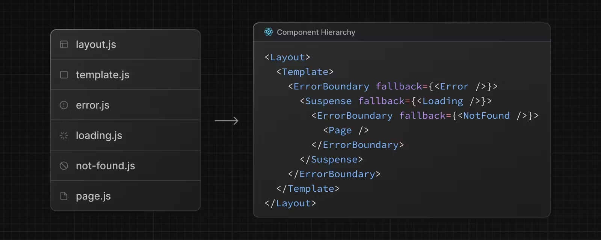
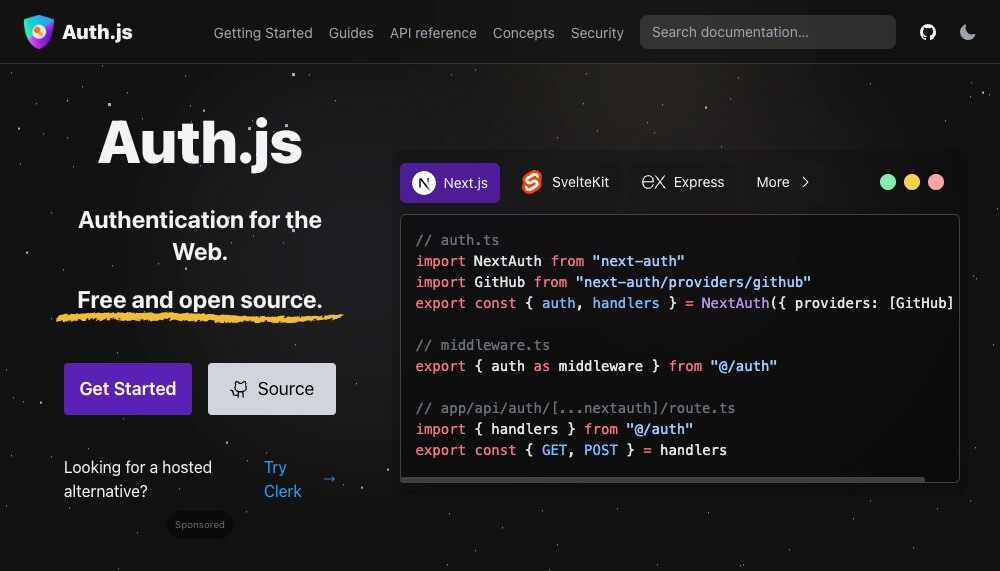
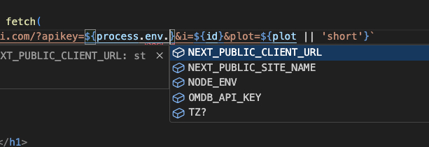

## 개요

/// message-box --icon=info
이 글은 Next.js `14.2.1` 버전을 기준으로 작성되었습니다.
Next.js의 최신 버전은 `create-next-app@latest`로, 카나리아 버전은 `create-next-app@canary`로 설치합니다.
카나리아 버전은 안정화 직전의 최신 라이브 테스트 버전으로, 일부 최신 기능이나 이슈 해결이 포함되어 있습니다.
///

### Next.js란?

[Next.js](Next.js)는 [Vercel](https://vercel.com/)에서 개발한 React 프레임워크로, 서버 사이드 렌더링(SSR), 클라이언트 사이드 렌더링(CSR), API 라우팅 등의 다양한 최적화 기능을 제공합니다.
Next.js을 사용하면, [React](https://react.dev/)의 기본 기능을 확장해, 보다 빠르고 안정적으로 웹 애플리케이션을 개발할 수 있습니다.

### 설치 및 구성

다음 명령으로 Next.js 프로젝트를 설치합니다.
각 질문에 `Yes` 또는 `No`로 답변하며, 여기에서는 TypeScript와 ESLint를 사용하고 Tailwind CSS는 사용하지 않습니다.

```bash
npx create-next-app@latest <프로젝트이름>
    ✔ Would you like to use TypeScript? … Yes  # 타입스크립트 사용 여부
    ✔ Would you like to use ESLint? … Yes  # ESLint 사용 여부
    ✔ Would you like to use Tailwind CSS? … No  # Tailwind CSS 사용 여부
    ✔ Would you like to use `src/` directory? … No  # src/ 디렉토리 사용 여부
    ✔ Would you like to use App Router? (recommended) … Yes  # App Router 사용 여부
    ✔ Would you like to customize the default import alias (@/*)? … No  # `@/*` 외 경로 별칭 사용 여부
```

/// message-box --icon=info
'App Router'는 Next.js 13버전부터 사용할 수 있게 된 방식으로, 보다 복잡한 라우팅 요구사항과 애플리케이션 상태 관리를 위해 설계되었습니다.
일부 장단점이 있지만, 대부분의 경우 Pages Router 보다 최신의 App Router를 사용하는 것을 추천합니다!
///

#### SCSS

Next.js에서 SCSS를 사용하기 위해 다음 패키지를 설치합니다.
설치 후 바로 `*.scss` 파일을 사용할 수 있습니다.

```bash
npm i -D sass
```

#### Prettier

다음 VS Code 확장 프로그램이 설치되어 있어야 합니다.

- [ESLint](https://marketplace.visualstudio.com/items?itemName=dbaeumer.vscode-eslint): 코드 품질 확인 및 버그, 안티패턴(Anti-pattern)을 감지
- [Prettier - Code formatter](https://marketplace.visualstudio.com/items?itemName=esbenp.prettier-vscode): 코드 스타일 및 포맷팅 관리, 일관된 코드 스타일을 적용 가능

Prettier 관련 패키지들을 설치합니다.

```bash
npm i -D prettier eslint-config-prettier
```

ESLint 구성을 다음과 같이 수정합니다.

```json --path=/.eslintrc.json
{
  "extends": [
    "next/core-web-vitals",
    "prettier"
  ]
}
```

추가로, 프로젝트 루트 경로에 `.prettierrc` 파일을 생성하고 다음처럼 원하는 규칙을 추가합니다.
자세한 규칙은 [Prettier / Options](https://prettier.io/docs/en/options) 에서 확인할 수 있습니다.

```json --path=/.prettierrc
{
  "semi": false,
  "singleQuote": true,
  "singleAttributePerLine": true,
  "bracketSameLine": true,
  "endOfLine": "lf",
  "trailingComma": "none",
  "arrowParens": "avoid"
}
```

##### 자동 포맷팅 설정

프로젝트의 루트 경로에 `.vscode/settings.json` 폴더와 파일을 생성해 다음과 같이 내용을 추가할 수 있습니다.

```json --path=/.vscode/settings.json --caption=자바스크립트인 경우.
{
  "[javascript]": {
    "editor.formatOnSave": true,
    "editor.defaultFormatter": "esbenp.prettier-vscode"
  },
  "[javascriptreact]": {
    "editor.formatOnSave": true,
    "editor.defaultFormatter": "esbenp.prettier-vscode"
  }
}
```

```json --path=/.vscode/settings.json --caption=타입스크립트인 경우.
{
  "[javascript]": {
    "editor.formatOnSave": true,
    "editor.defaultFormatter": "esbenp.prettier-vscode"
  },
  "[javascriptreact]": {
    "editor.formatOnSave": true,
    "editor.defaultFormatter": "esbenp.prettier-vscode"
  },
  "[typescript]": {
    "editor.formatOnSave": true,
    "editor.defaultFormatter": "esbenp.prettier-vscode"
  },
  "[typescriptreact]": {
    "editor.formatOnSave": true,
    "editor.defaultFormatter": "esbenp.prettier-vscode"
  }
}
```

```json --path=/.vscode/settings.json --caption=Module S?CSS를 사용하는 경우.
{
  "[css]": {
    "editor.formatOnSave": true,
    "editor.defaultFormatter": "esbenp.prettier-vscode"
  },
  "[scss]": {
    "editor.formatOnSave": true,
    "editor.defaultFormatter": "esbenp.prettier-vscode"
  }
}
```

### Server vs Client

Next.js에서는 서버 컴포넌트(Server Component)와 클라이언트 컴포넌트(Client Component)를 구분해 코드 일부가 서버 혹은 클라이언트에서 출력될 수 있도록 만들 수 있습니다.
기본적으로 생성하는 모든 컴포넌트는 서버 컴포넌트입니다! 
클라이언트 컴포넌트로 변경/사용하려면 다음과 같이 컴포넌트 최상단에 `'use client'` 선언이 필요하고, 해당 선언이 없으면 서버 컴포넌트입니다.

/// message-box --icon=info
클라이언트 컴포넌트 또한 일부 정적 요소는 서버에서 렌더링합니다.
따라서 클라이언트 컴포넌트는 '서버 + 클라이언트'의 하이브리드 컴포넌트로 이해해야 합니다!
///

```tsx --line-active=1
'use client'

export default function Component() {
  return null
}
```

서버 컴포넌트와 클라이언트 컴포넌트는 다음과 같이 사용할 수 있는 일부 API가 다릅니다.
이런 구분을 통해, 서버 컴포넌트에서는 보안이나 캐싱, 성능, SEO 등의 이점을, 클라이언트 컴포넌트에서는 상호작용(`'click'`, `'load'` 이벤트 등), 브라우저 API(`window`, `document` 등) 활용 등의 이점을 얻을 수 있습니다.

__서버 컴포넌트만 사용:__
- cookies
- headers
- redirect
- ...

__클라이언트 컴포넌트만 사용:__
- useState
- useEffect
- onClick
- onChange
- useRouter
- useParams
- ...

각 서버와 클라이언트 컴포넌트에서 서로 맞지 않는 API를 사용하면 다음 이미지와 같이, 바로 에러를 표시하기 때문에 금방 구분할 수 있게 됩니다.


## 라우팅

라우팅 기능을 사용하기 위해선 Next.js의 파일 규칙(File Conventions)을 이해해야 합니다.
기본 파일은 아래 표에서 `layout`부터 순서대로 계층 구조를 나타내며, 각 페이지를 출력하기 위해 기능에 맞게 사용합니다.
이러한 명시적 파일 규칙을 통해, 프로젝트 구조를 명확하게 유지할 수 있습니다.



기본 파일 | 확장자 | 설명
--- | --- | ---
`layout` | `.js`, `.jsx`, `.tsx` | 고정 레이아웃
`template` | `.js`, `.jsx`, `.tsx` | 변화 레이아웃(탐색 시)
`error` | `.js`, `.jsx`, `.tsx` | 에러 페이지
`loading` | `.js`, `.jsx`, `.tsx` | 로딩 페이지
`not-found` | `.js`, `.jsx`, `.tsx` | 찾을 수 없는(404) 페이지
`page` | `.js`, `.jsx`, `.tsx` | 기본 페이지

추가 파일 | 설명
--- | ---
`global-error` | `.js`, `.jsx`, `.tsx` | 전역 에러 UI
`default` | `.js`, `.jsx`, `.tsx` | 병렬 경로(Parallel)의 대체 페이지
`route` | `.js`, `.ts` | API 엔드포인트

### 페이지

Next.js는 폴더를 사용해 경로를 정의하는 파일 시스템 기반 라우터 방식을 사용하기 때문에, `/app` 폴더 내에 생성하는 각 폴더는 기본적으로 URL 경로를 의미합니다.
예를 들어, 프로젝트에 `/app/movies` 폴더를 생성하면 `/movies` 경로 즉, `http://localhost:3000/movies`로 접근할 수 있습니다.
그리고 접근한 그 경로에서 출력할 내용은 기본적으로 각 폴더의 `page.tsx` 컴포넌트에 작성합니다.

이렇게 매핑되는 각 경로 구간을 세그먼트(Segment)라고 합니다.


```plaintext --caption=프로젝트 구조
├─app
│  ├─movies
│  │  └─page.tsx
│  └─page.tsx
```

```tsx --path=/app/page.tsx --caption=http://localhost:3000/ 경로의 페이지 내용
export default function Home() {
  return <h1>Home page!</h1>
}
```

```tsx --path=/app/movies/page.tsx --caption=http://localhost:3000/movies 경로의 페이지 내용
export default function Movies() {
  return (
    <h1>Movies page!</h1>
    <ul>
      <li>Avengers</li>
      <li>Avatar</li>
      <li>Frozen</li>
    </ul>
  )
}
```

또한 위에서 살펴본 라우팅 파일 규칙에 해당하는 이름이 아닌 파일은, 경로로 정의되지 않기 때문에 같은 폴더 안에서 자유롭게 추가해 사용할 수 있습니다.
다음 이미지에서 `page.js`, `route.js` 파일을 제외한 나머지 파일은 경로로 정의되지 않습니다.(Not Routable)


### 레이아웃

여러 하위 경로에서 공통으로 사용하는 UI는, 각 라우팅 폴더의 `layout.tsx` 컴포넌트에 작성합니다.
슬롯(Slot) 방식으로 `children` Prop을 사용하며, `{children}` 부분에는 같은 레벨에 있는 `page.tsx` 컴포넌트를 출력합니다.
또한 레이아웃은 중첩해서 사용할 수 있습니다.

```plaintext --line-active=3,5,8 --caption=프로젝트 구조
├─app
│  ├─movies
│  │  ├─layout.tsx
│  │  └─page.tsx
│  ├─layout.tsx
│  └─page.tsx
├─components
│  └─Header.tsx
```

/// message-box --icon=info
앞서 우리는 Next.js의 설치 질문에서 `✔ Would you like to customize the default import alias (@/*)? … No` 입력을 통해, `@` 경로 별칭이 프로젝트의 루트 경로를 의미하도록 구성했습니다.
///

다음 코드의 `{children}` 부분에는 `/app/page.tsx` 컴포넌트가 출력됩니다.

```tsx --path=/app/layout.tsx --line-active=10 --caption=http://localhost:3000/ 경로의 레이아웃
import Header from '@/components/Header'

export default function RootLayout({
  children
}: Readonly<{ children: React.ReactNode }>) {
  return (
    <html lang="ko">
      <body>
        <Header />
        {children}
      </body>
    </html>
  )
}
```

다음 코드의 `{children}` 부분에는 `/app/movies/page.tsx` 컴포넌트가 출력됩니다.

```tsx --path=/app/movies/layout.tsx --line-active=6 --caption=http://localhost:3000/movies 경로의 레이아웃
export default function MoviesLayout({
  children
}: Readonly<{ children: React.ReactNode }>) {
  return (
    <section className="container">
      {children}
    </section>
  )
}
```

### 컴포넌트 방식의 탐색

Next.js에서는 페이지 이동을 위해 `<a>` 태그가 아닌 [`<Link>` 컴포넌트](https://nextjs.org/docs/app/building-your-application/routing/linking-and-navigating#link-component)를 사용합니다.
`<Link>` 컴포넌트는 이동하는 페이지 전체를 새로고침하지 않고 최적화된 번들만 일부 로드하거나 서버 렌더링 가능 등의 Next.js 프로젝트 내에서 최적화된 페이지 탐색을 제공합니다.
위에서 확인한, `/components/Header.tsx` 컴포넌트에서, 각 페이지로 이동할 수 있는 링크를 추가해봅시다.

```plaintext --line-active=8 --caption=프로젝트 구조
├─app
│  ├─movies
│  │  ├─layout.tsx
│  │  └─page.tsx
│  ├─layout.tsx
│  └─page.tsx
├─components
│  └─Header.tsx
```

```tsx --path=/components/Header.tsx --line-active=1
import Link from 'next/link'

export default function Header() {
  return (
    <header>
      <nav>
        <ul>
          <li>
            <Link href="/">Home</Link>
          </li>
          <li>
            <Link href="/movies">Movies</Link>
          </li>
        </ul>
      </nav>
    </header>
  )
}
```

#### 미리 가져오기

`<Link />` 컴포넌트는 `prefetch` 옵션을 통해 뷰포트에 보여질 때(`IntersectionObserver`), 연결된 경로(href)의 데이터를 미리 가져와 탐색 성능을 크게 향상시킬 수 있습니다.

- `null`(기본값): 정적 경로인 경우 모든 하위 경로를, 동적 경로인 경우 `loading.tsx`가 있는 가장 가까운 세그먼트까지 미리 가져옵니다.
- `true`: 정적 경로와 동적 경로 모두 미리 가져옵니다.
- `false`: 미리 가져오지 않습니다.

```tsx
export default function Links() {
  return (
    <>
      <Link href={someLink}>이동~</Link>
      <Link prefetch={true} href={someLink}>이동~</Link>
      <Link prefetch={false} href={someLink}>이동~</Link>
    </>
  )
}
```

/// message-box --icon=info
Prefetch 기능은 제품(Production) 모드에서만 활성화됩니다!
///

### 프로그래밍 방식의 탐색

상황에 따라 `<Link>` 컴포넌트를 사용하지 않고, 프로그래밍 방식으로 페이지를 이동해야 할 때가 있습니다.
그 때는 Next.js에서 제공하는 `useRouter` 훅(Hook)을 사용해 다음과 같이 페이지 이동을 구현할 수 있습니다.

/// message-box --icon=warning
`useRouter` 훅은 클라이언트 컴포넌트에서만 사용할 수 있습니다.
따라서 컴포넌트 상단에 `'use client` 선언이 필요합니다.
///

```tsx --path=/components/Header.tsx --line-active=1,3,6,19-21
'use client'
import Link from 'next/link'
import { useRouter } from 'next/navigation'

export default function Header() {
  const router = useRouter()
  return (
    <header>
      <nav>
        <ul>
          <li>
            <Link href="/">Home</Link>
          </li>
          <li>
            <Link href="/movies">Movies</Link>
          </li>
        </ul>
      </nav>
      <button onClick={() => router.push('/movies')}>
        Movies
      </button>
    </header>
  )
}
```

#### 미리 가져오기

기본적인 미리 가져오기는 자동으로 동작하는 `<Link>` 컴포넌트와 달리,
프로그래밍 방식의 탐색에서는 `useEffect` 훅과 `router.prefetch()` 메소드를 사용해 미리 가져오기를 구현할 수 있습니다.

```tsx --path=/components/Header.tsx --line-active=8-10
'use client'
import Link from 'next/link'
import { useEffect } from 'react'
import { useRouter } from 'next/navigation'

export default function Header() {
  const router = useRouter()
  useEffect(() => {
    router.prefetch('/movies')
  }, [router])
  return (
    <header>
      {/* 생략 */}
      <button onClick={() => router.push('/movies')}>
        MOVIES
      </button>
    </header>
  )
}
```

### 동적 경로

미리 정의할 수 없는 동적 경로는, 대괄호(`[]`)를 사용해 폴더 이름을 작성합니다.
그러면 URL의 세그먼트 값이, `params` Prop으로 전달되고, 대괄호 사이의 폴더 이름이 속성 이름이 됩니다.
만약 쿼리스트링(Query String)을 사용하는 경우, `searchParams` Prop으로 전달됩니다.

```plaintext --caption=프로젝트 구조
├─app
│  ├─movies
│  │  ├─[movieId]
│  │  │  └─page.tsx
```

```tsx --path=/app/movies/[movieId]/page.tsx --caption=http://localhost:3000/movies/tt4520988?plot=full 등의 경로와 일치하는 페이지 내용
type Movie = { // 응답 결과 타이핑
  Title: string
  Plot: string
}

export default async function MovieDetails({
  params,
  searchParams // 쿼리스트링
}: {
  params: { movieId: string }
  searchParams: { plot?: 'short' | 'full' }
}) {
  const res = await fetch(`https://omdbapi.com/?apikey=7035c60c&i=${params.movieId}&plot=${searchParams.plot || 'short'}`)
  const movie: Movie = await res.json()
  return (
    <>
      <h1>{movie.Title}</h1>
      <p>{movie.Plot}</p>
    </>
  )
}
```

```plaintext --caption=위 URL로 접근해보세요!
http://localhost:3000/movies/tt4520988?plot=full
http://localhost:3000/movies/tt4154796
http://localhost:3000/movies/tt1630029
```

앞서 살펴본 것처럼 `[이름]` 폴더로 단순한 동적 경로 일치도 가능하고, 다음 예시와 같이 모든 하위 경로의 동적 일치(`[...이름]`)나 선택적 동적 일치(`[[...이름]]`) 패턴도 사용할 수 있습니다.

폴더 구조 예시 | URL 예시 | `params` 값
--- | --- | ---
`app/movies/[hello]/page.tsx` | `/movies/foo` | `{ hello: 'foo' }`
`app/movies/[hello]/page.tsx` | `/movies/bar` | `{ hello: 'bar' }`
`app/movies/[hello]/[world]/page.tsx` | `/movies/foo/bar` | `{ hello: 'foo', world: 'bar' }`
`app/movies/[...hello]/page.tsx` | `/movies/foo` | `{ hello: ['foo'] }`
`app/movies/[...hello]/page.tsx` | `/movies/foo/bar` | `{ hello: ['foo', 'bar'] }`
`app/movies/[...hello]/page.tsx` | `/movies/foo/bar/baz` | `{ hello: ['foo', 'bar', baz] }`
`app/movies/[[...hello]]/page.tsx` | `/movies` | `{}`
`app/movies/[[...hello]]/page.tsx` | `/movies/foo` | `{ hello: ['foo'] }`
`app/movies/[[...hello]]/page.tsx` | `/movies/foo/bar` | `{ hello: ['foo', 'bar'] }`

### 로딩

페이지 출력을 준비하는 동안, 먼저 로딩 상태를 표시할 수 있습니다.
출력할 페이지와 같은 폴더에 `loading.tsx` 파일을 생성합니다.


```plaintext --caption=프로젝트 구조
├─app
│  ├─delay
│  │  ├─loading.tsx
│  │  └─page.tsx
```

```tsx --path=/app/delay/loading.tsx --caption=페이지 출력 전 로딩 UI
export default function Loading() {
  return <h2>로딩 중...</h2>
}
```

```tsx --path=/app/delay/page.tsx --caption=2초 후에 페이지를 출력
export default async function DelayPage() {
  await new Promise(resolve => setTimeout(resolve, 2000))
  return <h2>완료!</h2>
}
```

```plaintext --caption=위 URL로 접근해보세요!
http://localhost:3000/delay
```

### 에러

페이지 출력 중 에러가 발생하면, 에러 상태를 표시할 수 있습니다.
출력할 페이지와 같은 폴더에 `error.tsx` 파일을 생성합니다.

/// message-box --icon=warning
사용자 입력의 유효성 검사나 잘못된 API 요청 등 클라이언트에서 발생하는 에러 상황까지 처리하기 위해, `error.tsx`는 클라이언트 컴포넌트여야 합니다.
따라서 컴포넌트 상단에 `'use client'` 선언이 필요합니다.
///

```plaintext --caption=프로젝트 구조
├─app
│  ├─delay
│  │  ├─error.tsx
│  │  ├─loading.tsx
│  │  └─page.tsx
```

```tsx --path=/app/delay/error.tsx --line-active=1 --caption=페이지 출력 중 에러 발생 시 UI
'use client'

export default function Error({
  error
}: {
  error: Error & { digest?: string }
}) {
  return <h2>{error.message}</h2>
  // <h2>뭔가 문제가 있어요..</h2>
}
```

```tsx --path=/app/delay/page.tsx --line-active=7-9 --caption=2초 후에 페이지를 출력
export default async function DelayPage({
  searchParams
}: {
  searchParams: { ok: 'true' }
}) {
  await new Promise(resolve => setTimeout(resolve, 2000))
  if (searchParams.ok !== 'true') {
    throw new Error('뭔가 문제가 있어요..')
  }
  return <h2>완료!</h2>
}
```

```plaintext --caption=위 URL로 접근해보세요!
http://localhost:3000/delay?ok=true
http://localhost:3000/delay
```

### 찾을 수 없는 페이지

프로젝트에서 정의하지 않은 경로로 접근하면, `not-found.tsx` 파일로 별도의 페이지를 출력할 수 있습니다.

```plaintext --caption=프로젝트 구조
├─app
│  └─not-found.tsx
```

```tsx --path=/app/not-found.tsx --caption=404 페이지 내용
import Link from 'next/link'

export default function NotFound() {
  return (
    <>
      <h1>404, 찾을 수 없는 페이지입니다.</h1>
      <Link href="/">메인 페이지로 이동~</Link>
    </>
  )
}
```

```plaintext --caption=위 URL로 접근해보세요!
http://localhost:3000/helloworld
```

### 비동기 컴포넌트 스트리밍

다음 예제에서 `async/page.tsx` 파일은 3초 후에 페이지를 출력하는 비동기 컴포넌트이고, `Abc`와 `Xyz` 컴포넌트 또한 각각 5초와 2초 후에 내용을 출력하는 비동기 컴포넌트입니다.
그러면 이 페이지로 접근했을 때, `로딩 중...`이라는 메시지는 8초 동안 표시되고 그 후에 `Abc`와 `Xyz` 컴포넌트가 동시에 출력됩니다.
`Xyz` 컴포넌트는 2초 만에 출력할 수 있지만, `Abc` 컴포넌트의 영향으로 5초 후에 같이 출력됩니다.

```plaintext --caption=프로젝트 구조
├─app
│  ├─async
│  │  ├─Abc.tsx
│  │  ├─Xyz.tsx
│  │  ├─loading.tsx
│  │  └─page.tsx
```

```tsx --path=/app/async/A.tsx --caption=5초 후에 페이지를 출력하는 컴포넌트 Abc
export default async function A() {
  await new Promise(resolve => setTimeout(resolve, 5000))
  return <h2>Abc 컴포넌트!</h2>
}
```

```tsx --path=/app/async/B.tsx --caption=2초 후에 페이지를 출력하는 컴포넌트 Xyz
export default async function B() {
  await new Promise(resolve => setTimeout(resolve, 2000))
  return <h2>Xyz 컴포넌트!</h2>
}
```

```tsx --path=/app/async/loading.tsx --caption=페이지 출력 전 로딩 UI
export default function Loading() {
  return <h2>로딩 중...</h2>
}
```

```tsx --path=/app/async/page.tsx --caption=컴포넌트 Abc와 Xyz를 출력하는 페이지
import Abc from './Abc'
import Xyz from './Xyz'

export default async function Page() {
  await new Promise(resolve => setTimeout(resolve, 3000))
  return (
    <>
      <h1>페이지!</h1>
      <Abc />
      <Xyz />
    </>
  )
}
```

`<Suspense>` 컴포넌트를 사용해 비동기 컴포넌트를 스트리밍하면, 각 컴포넌트가 준비되는 대로 출력할 수 있습니다.
`fallback` Prop을 통해 각 비동기 컴포넌트의 로딩 UI를 출력할 수도 있습니다.
다음 예제는 `로딩 중...`이라는 메시지가 3초 동안 표시되고 그 후에 `Abc`와 `Xyz` 컴포넌트가 각각 2초와 5초 후에 따로 출력됩니다.

```tsx --path=/app/async/page.tsx --line-active=1,9-14 --caption=컴포넌트 Abc와 Xyz를 출력하는 페이지
import { Suspense } from 'react'
import Abc from './Abc'
import Xyz from './Xyz'

export default async function Page() {
  await new Promise(resolve => setTimeout(resolve, 3000))
  return (
    <>
      <h1>페이지!</h1>
      <Suspense fallback={<p>ABC 로딩 중..</p>}>
        <Abc />
      </Suspense>
      <Suspense fallback={<p>XYZ 로딩 중..</p>}>
        <Xyz />
      </Suspense>
    </>
  )
}
```

## 고급 라우팅 패턴

### 경로 그룹

`/app` 폴더 내 기본적인 폴더는 항상 URL 경로로 매핑되지만,
소괄호(`()`)를 사용해 URL 경로에 영향을 주지 않는 폴더(경로) 그룹을 만들 수 있습니다.
이 그룹은 특히, 각자의 레이아웃(`layout.tsx`)을 가질 수 있기 때문에, 경로에 맞는 여러 레이아웃 제공을 제공할 수 있습니다.

```plaintext --line-active=2,5,6,14,15 --caption=프로젝트 구조
├─app
│  ├─(about)
│  │  ├─about
│  │  │  └─page.tsx
│  │  └─layout.tsx  <== (about) 그룹에서만 동작하는 레이아웃
│  ├─(movie)
│  │  ├─movies
│  │  │  ├─[movieId]
│  │  │  │  └─page.tsx
│  │  │  └─page.tsx
│  │  ├─poster
│  │  │  └─[movieId]
│  │  │     └─page.tsx
│  │  └─layout.tsx  <== (movie) 그룹에서만 동작하는 레이아웃
│  ├─layout.tsx  <== 루트 레이아웃
│  └─page.tsx
```

```tsx --path=/app/(about)/layout.tsx
export default function Layout({
  children
}: {
  children: React.ReactNode
}) {
  return (
    <>
      <h1>About Group</h1>
      {children}
    </>
  )
}
```

```tsx --path=/app/(movie)/layout.tsx
export default function Layout({
  children
}: {
  children: React.ReactNode
}) {
  return (
    <>
      <h1>Movie Group</h1>
      {children}
    </>
  )
}
```

### 경로 병렬 처리

`@` 접두사의 폴더는 URL 경로에 영향을 주지 않는 페이지로, 하나의 레이아웃에서 동시에 처리(Parallel Routes)할 수 있습니다.
이는 '이름을 가진 슬롯' 방식으로, `page.tsx` 컴포넌트가 같은 레벨 `layout.tsx`의 `children` Prop으로 전달되는 것처럼, `@abc/page.tsx` 컴포넌트는 `layout.tsx`의 `abc` Prop으로, `@xyz/page.tsx` 컴포넌트는 `xyz` Prop으로 전달됩니다.


```plaintext --line-active=3-9 --caption=프로젝트 구조
├─app
│  ├─async
│  │  ├─@abc
│  │  │  ├─loading.tsx
│  │  │  └─page.tsx
│  │  ├─@xyz
│  │  │  ├─loading.tsx
│  │  │  └─page.tsx
│  │  ├─layout.tsx
│  │  ├─loading.tsx
│  │  └─page.tsx
```

```tsx --path=/app/async/@abc/loading.tsx
export default function Loading() {
  return <p>ABC 로딩 중..</p>
}
```

```tsx --path=/app/async/@abc/page.tsx --caption=layout.abc로 전달되는 페이지
export default async function Abc() {
  await new Promise(resolve => setTimeout(resolve, 5000))
  return <h2>ABC 컴포넌트!</h2>
}
```

```tsx --path=/app/async/@xyz/loading.tsx
export default function Loading() {
  return <p>XYZ 로딩 중..</p>
}
```

```tsx --path=/app/async/@xyz/page.tsx  --caption=layout.xyz로 전달되는 페이지
export default async function XYZ() {
  await new Promise(resolve => setTimeout(resolve, 2000))
  return <h2>XYZ 컴포넌트!</h2>
}
```

```tsx --path=/app/async/layout.tsx --line-active=3,4,7,8,13,14
export default function Layout({
  children,
  abc,
  xyz
}: {
  children: React.ReactNode
  abc: React.ReactNode
  xyz: React.ReactNode
}) {
  return (
    <>
      {children}
      {abc}
      {xyz}
    </>
  )
}
```

```tsx --path=/app/async/loading.tsx
export default function Loading() {
  return <h2>로딩 중...</h2>
}
```

```tsx --path=/app/async/page.tsx --caption=layout.children으로 전달되는 페이지
export default async function Page() {
  await new Promise(resolve => setTimeout(resolve, 3000))
  return <h1>페이지!</h1>
}
```

앞서 '비동기 컴포넌트 스트리밍'에서 살펴본 `<Suspense>` 컴포넌트 활용 예제와 비슷하지만,
경로를 컴포넌트처럼 활용한다는 점에서 차이가 있습니다. 

```tsx --path=/app/async/page.tsx --caption=컴포넌트 A와 B를 출력하는 페이지
import { Suspense } from 'react'
import Abc from './Abc'
import Xyz from './Xyz'

export default async function Page() {
  await new Promise(resolve => setTimeout(resolve, 3000))
  return (
    <>
      <h1>페이지!</h1>
      <Suspense fallback={<p>ABC 로딩 중..</p>}>
        <Abc />
      </Suspense>
      <Suspense fallback={<p>XYZ 로딩 중..</p>}>
        <Xyz />
      </Suspense>
    </>
  )
}
```

### 경로 가로채기

Next.js에서는 경로 가로채기(Intercepting Routes) 기능을 통해 현재 레이아웃에서 다른 URL 경로를 출력할 수 있습니다.

경로 가로채기의 `(..)` 같은 이름 규칙은, 상대 경로(`../`, `./`)와 유사하지만, 폴더가 아닌 세그먼트를 기준으로 합니다.
예를 들어 '경로 그룹'은 URL에 매핑되지 않으므로, `/app/a/b/(group)/(..)x` 폴더 경로는 `/a/x` URL 경로와 일치합니다.

폴더 경로 | URL 일치 | 설명
---|---|---
`/app/a/b/(.)x` | `/a/b/x` | 같은 레벨 세그먼트
`/app/a/b/(..)x` | `/a/x` | 상위 레벨 세그먼트
`/app/a/b/(...)x` | `/x` | 루트 레벨 세그먼트


/// message-box --icon=warning
만약 경로 가로채기 작업이 개발 서버에서 적용되지 않는 경우, `.next` 폴더 삭제 후 개발 서버를 재시작하는 것을 추천합니다.
///

```plaintext --caption=프로젝트 구조
├─app
│  ├─a
│  │  └─b
│  │     └─c
│  │        ├─(...)x
│  │        │  └─page.tsx
│  │        └─page.tsx
│  └─x
│    └─page.tsx
```

```tsx --path=/app/a/b/c/(...)x/page.tsx
export default function XPage() {
  return <h1>Intercepted X Page!!</h1>
}
```

```tsx --path=/app/a/b/c/page.tsx
import Link from 'next/link'

export default function CPage() {
  return (
    <>
      <h1>C Page</h1>
      <Link href="/x">가로채기!</Link>
    </>
  )
}
```

```tsx --path=/app/x/page.tsx
export default function XPage() {
  return <h1>X Page..</h1>
}
```

```plaintext --caption=위 URL로 접근해서, '가로채기!' 링크를 클릭해보세요!
http://localhost:3000/a/b/c
```

```plaintext --caption=프로젝트 구조
├─app
│  ├─a
│  │  └─b
│  │     └─c
│  │        ├─@xWrap
│  │        │  ├─(...)x
│  │        │  │  └─page.tsx
│  │        │  └─page.tsx
│  │        ├─layout.tsx
│  │        └─page.tsx
│  └─x
│    └─page.tsx
```

`..@xWrap/page.tsx`는 `null`을 반환해 화면에 따로 표시하지 않고, 가로챈 경로의 페이지(`@xWrap/(...)x/page.tsx`)를 출력하는 용도로 사용합니다.

```tsx --path=/app/a/b/c/@xWrap/page.tsx
export default function xWrap() {
  return null
}
```

```tsx --path=/app/a/b/c/layout.tsx
export default function CLayout({
  children,
  xWrap
}: {
  children: React.ReactNode
  xWrap: React.ReactNode
}) {
  return (
    <>
      {children}
      {xWrap}
    </>
  )
}
```

### 미들웨어

루트 경로에 생성하는 단일 `/middleware.ts` 파일을 통해, 특정 경로로 이동하기 전에 서버 측에서 실행되는 코드를 제공할 수 있습니다.
주로 인증 및 권한 확인이 필요한 페이지를 구분하는 데 사용되며, 응답 헤더 및 쿠키 설정, Redirect, Rewrite 등의 작업도 가능합니다.
그리고 미들웨어는 호출이 끝나야 경로 접근이 가능하기 때문에, 너무 복잡하거나 오래 걸리는 작업은 피해야 합니다.

```ts --path=/middleware.ts --caption=미들웨어 기본 구조
import { NextResponse } from 'next/server'
import type { NextRequest } from 'next/server'

export async function middleware(request: NextRequest) {
  // console.log('Middleware!')
  return NextResponse.next()
}
```

```ts --path=/middleware.ts --caption=미들웨어 예시
import { auth } from '@/auth'
import { NextResponse } from 'next/server'
import type { NextRequest } from 'next/server'

export async function middleware(request: NextRequest) {
  if (
    // 로그인(인증)이 필요한 페이지 확인
    isMatch(request.nextUrl.pathname, [
      '/dashboard',
      '/myaccount',
      '/settings'
    ])
  ) {
    const session = await auth()
    if (session) {
      return NextResponse.next()
    }
    return NextResponse.redirect(new URL('/signin', request.url))
  }
  return NextResponse.next()
}

// 일치하는 경로에서만 미들웨어가 호출됩니다.
// `config` 내보내기를 생략하면, 모든 경로에서 미들웨어가 호출됩니다.
export const config = {
  matcher: ['/dashboard/:path*', '/myaccount/:path*', '/settings/:path*'] // 특정 경로만 일치
  // matcher: ['/:path*'] // 명시적 모든 경로 일치
}

function isMatch(pathname: string, matchers: string[]) {
  return matchers.some(matcher => pathname.startsWith(matcher))
}
```

만약 더 복잡한 경로 매칭을 원한다면, `path-to-regexp` 라이브러리를 사용할 수 있습니다.

```bash
npm i path-to-regexp
```

```ts --path=/middleware.ts --line-active=7-9,17-19
// ...
import { match } from 'path-to-regexp'

export async function middleware(request: NextRequest) {
  if (
    isMatch(request.nextUrl.pathname, [
      '/dashboard/:path*',
      '/myaccount/:path+',
      '/settings/user/:userId'
    ])
  ) {
    // ...
  }
  return NextResponse.next()
}

function isMatch(pathname: string, urls: string[]) {
  return urls.some(url => !!match(url)(pathname))
}
```

### API

`/app/api` 폴더 내 구조를 통해 API 엔드포인트를 정의할 수 있고, `'GET'`이나 `'POST'` 등의 여러 HTTP 메소드 요청을 처리할 수 있습니다.
이 폴더 구조는 `page.tsx` 등의 기본 파일 규칙이 아닌, `route.ts` 파일을 사용합니다.


```plaintext --caption=프로젝트 구조
├─app
│  ├─api
│  │  ├─movies
│  │  │  └─[movieId]
│  │  │     └─route.ts
│  │  └─users
│  │     └─route.ts
```

```ts --path=/app/api/movies/[movieId]/route.ts --caption=영화 상세 정보 API
import type { NextRequest } from 'next/server'

type Context = {
  params: { movieId: string }
}

export async function GET(request: NextRequest, context: Context) {
  const { movieId } = context.params // 동적 경로
  const res = await fetch(`https://omdbapi.com/?apikey=7035c60c&i=${movieId}`)
  const data = await res.json()
  return Response.json(data)
}
```

```ts --path=/app/api/users/route.ts --caption=사용자 목록 API
import type { NextRequest } from 'next/server'

interface ResponseValue {
  total: number
  users: User[]
}
interface User {
  id: string
  name: string
  age: number
  isValid: boolean
  // ...
}

export async function POST(request: NextRequest) {
  // const body = await request.json() // 요청 바디
  const searchParams = request.nextUrl.searchParams // 쿼리스트링
  const sort = (searchParams.get('sort') || 'name') as keyof User

  // API: https://www.heropy.dev/p/5PlGxB
  const res = await fetch('https://api.heropy.dev/v0/users')
  const { users } = (await res.json()) as ResponseValue
  users.sort((a, b) => {
    const av = a[sort] || 0
    const bv = b[sort] || 0
    return av > bv ? 1 : -1
  })
  return Response.json(users)
}

```

```plaintext --caption=위 URL로 접근해보세요!
http://localhost:3000/api/movies/tt4520988
http://localhost:3000/api/users?sort=age
```

## 인증

Next.js 프로젝트에서 회원가입이나 로그인 등의 사용자 인증 및 세션 관리를 위해 `next-auth` 라이브러리를 사용할 수 있습니다.
인증과 관련된 자세한 내용은 [Auth.js(NextAuth.js) 핵심 정리](/p/MI1Khc)를 참고하세요.



## 데이터 가져오기 및 캐시

Next.js는 기본 `fetch` Web API를 확장해서, 서버에서 사용 가능하며 다양한 요청을 캐싱하거나 재검증하는 등의 추가 동작을 사용할 수 있습니다.

다음 예제에서 사용한 [API](https://www.heropy.dev/p/71PGfA)는 지정된 시간(1초) 후에 간단한 메시지(`message`)와 응답한 시간(`time`)을 반환합니다.
Next.js `fetch` 함수는 같은 엔드포인트에 대한 요청을 캐싱하기 때문에, 새로고침을 해도 계속 같은 시간이 출력됩니다.

```tsx --path=/app/delay/page.tsx
type ResponseValue = {
  message: string
  time: string // ISO 8601
}

export default async function AsyncPage() {
  const res = await fetch('https://api.heropy.dev/v0/delay?t=1000')
  const data: ResponseValue = await res.json()
  return <h1>{data.time}</h1>
  // 2024-04-02T17:47:09.678Z
}
```

```plaintext --caption=위 URL로 접근해보세요!
http://localhost:3000/delay
```

만약 캐싱을 비활성화하려면, `fetch` 함수의 `cache` 옵션을 사용할 수 있습니다.

```tsx --path=/app/delay/page.tsx --line-active=5
// 생략..

export default async function AsyncPage() {
  const res = await fetch('https://api.heropy.dev/v0/delay?t=1000', {
    cache: 'no-store' // 캐싱 비활성화!
  })
  const data: ResponseValue = await res.json()
  return <h1>{data.time}</h1>
}
```

만약 캐싱을 시간 기반으로 설정하려면, `fetch` 함수의 `next.revalidate` 옵션으로 초 단위의 시간을 설정할 수 있습니다.

```tsx --path=/app/delay/page.tsx --line-active=5
// 생략..

export default async function AsyncPage() {
  const res = await fetch('https://api.heropy.dev/v0/delay?t=1000', {
    next: { revalidate: 60 } // 1분마다 재검증!
  })
  const data: ResponseValue = await res.json()
  return <h1>{data.time}</h1>
}
```

만약 캐싱을 필요에 따라 제어하려면, `revalidatePath` 함수를 사용할 수 있습니다.
다음 예제는 쿼리스트링에 `revalidate=true`가 있을 때만, 재검증(Revalidate)합니다.

```tsx --path=/app/delay/page.tsx --line-active=1,14-16
import { revalidatePath } from 'next/cache'

type ResponseValue = {
  message: string
  time: string // ISO 8601
}

export default async function AsyncPage({
  searchParams
}: {
  searchParams: { revalidate?: 'true' }
}) {
  const endpoint = 'https://api.heropy.dev/v0/delay?t=1000'
  if (searchParams.revalidate === 'true') {
    revalidatePath(endpoint)
  }
  const res = await fetch(endpoint)
  const data: ResponseValue = await res.json()
  return <h1>{data.time}</h1>
}
```

```plaintext --caption=위 URL로 접근해보세요!
http://localhost:3000/delay?revalidate=true
http://localhost:3000/delay
```

### 서버 액션

Next.js는 서버에서만 실행되는 함수(Server Actions)를 작성할 수 있습니다.
다음과 같이, 모듈 상단에 `'use server'` 지시어를 추가하고 서버 액션를 작성합니다.

```ts --path=/serverActions/index.ts --line-active=1
'use server'

export async function wait(duration = 1000): Promise<{ message: string }> {
  console.log(`Run 'wait' function`)
  return new Promise(resolve =>
    setTimeout(() => resolve({ message: `Waited for ${duration}ms` }), duration)
  )
}
```

다음과 같이, 서버 컴포넌트에서 서버 액션(함수)를 가져와 사용할 수 있습니다.
`Run 'wait' function` 메시지는 서버 콘솔에만 출력됩니다.

```tsx --path=/app/server/page.tsx --line-active=1,4
import { wait } from '@/serverActions'

export default async function ServerPage() {
  const { message } = await wait(3000)
  return <h1>{message}</h1>
}
```

```tsx --path=/app/server/loading.tsx
export default function ServerLoading() {
  return <h1>Loading...</h1>
}
```

다음과 같이, 클라이언트 컴포넌트에서도 서버 액션를 가져와 사용할 수 있습니다.
역시, `Run 'wait' function` 메시지는 서버 콘솔에만 출력됩니다.

```tsx --path=/app/client/page.tsx --line-active=1,2,9
'use client'
import { wait } from '@/serverActions'
import { useState, useEffect } from 'react'

export default function ClientPage() {
  const [message, setMessage] = useState('')
  const [loading, setLoading] = useState(true)
  useEffect(() => {
    wait(3000).then(({ message }) => {
      setMessage(message)
      setLoading(false)
    })
  }, [])
  return <h1>{loading ? 'Loading...' : message}</h1>
}
```

특히, 서버 액션은 `<form>` 요소의 `action` 속성으로 호출하는 것이 가능해, 양식(Forms) 작업에서 유용합니다.

```tsx --path=/app/signin --line-active=7
import { signIn } from '@/serverActions'

export default function Page() {
  return (
    <>
      <h1>로그인</h1>
      <form action={signIn}>
        <label>
          Email
          <input
            name="email"
            type="email"
          />
        </label>
        <label>
          Password
          <input
            name="password"
            type="password"
          />
        </label>
        <button type="submit">SIGN IN!</button>
      </form>
    </>
  )
}
```

```ts --path=/serverActions/index.ts
'use server'
import { redirect } from 'next/navigation'

export async function signIn(formData: FormData) {
  const email = formData.get('email')
  const password = formData.get('password')
  console.log(email, password)
  
  // ...

  redirect('/') // 로그인 성공 시, 메인 페이지로 이동!
}
```

## 최적화

Next.js에는 애플리케이션 속도나 웹 바이탈을 향상시킬 수 있는 여러 최적화 기능이 내장되어 있습니다.
주로 사용하는 몇 가지 기능을 살펴봅시다.

### 이미지

`<Image />` 컴포넌트를 사용해 지연 로딩, 브라우저 캐싱, 크기 최적화 등의 기능을 아주 간단하게 사용할 수 있습니다.
`src`, `alt`, `width`, `height` 속성은 필수이며, 동일 소스 경로의 이미지는 자동으로 캐싱됩니다.

```tsx --path=/app/poster/[movieId]/page.tsx --line-active=1,18-23
import Image from 'next/image'

type Movie = { // 응답 결과 타이핑
  Title: string
  Poster: string
}

export default async function MoviePoster({
  params,
  searchParams // 쿼리스트링
}: {
  params: { movieId: string }
  searchParams: { plot?: 'short' | 'full' }
}) {
  const res = await fetch(`https://omdbapi.com/?apikey=7035c60c&i=${params.movieId}&plot=${searchParams.plot || 'short'}`)
  const movie: Movie = await res.json()
  return (
    <Image
      src={movie.Poster}
      alt={movie.Title}
      width="300"
      height="450"
    />
  )
}
```

만약 원격의 이미지 경로를 사용한다면, 애플리케이션 보호를 위해 `remotePatterns` 옵션을 프로젝트 구성으로 추가해야 합니다.
포트 번호(`port`)나 구체적인 하위 경로(`pathname`)를 명시하는 것도 가능합니다.

```mjs --path=/next.config.mjs --caption=원격 이미지 최적화 패턴 구성
/** @type {import('next').NextConfig} */
const nextConfig = {
  images: {
    remotePatterns: [
      { 
        protocol: 'https', 
        hostname: 'heropy.dev' 
      },
      {
        protocol: 'https', 
        hostname: 'm.media-amazon.com' // `movie.Poster` 경로의 도메인
      },
      {
        protocol: 'https',
        hostname: '**.example.com',
        port: '',
        pathname: '/account123/**',
      }
    ]
  }
}

export default nextConfig
```

`onLoad` 속성을 사용해 이미지 로딩이 완료되면 콜백을 호출할 수 있습니다.
단, `onLoad` 속성은 클라이언트 컴포넌트에서 사용해야 합니다.

```tsx --line-active=1,12
'use client'
// ...
export default function Page() {
  const [loaded, setLoaded] = useState(false)
  // ...
  return (
    <Image
      src={image.src}
      alt={image.name}
      width="100"
      height="200"
      onLoad={() => setLoaded(true)}
    />
  )
}
```

### 폰트

Next.js는 지원하는 모든 글꼴 파일에 대한 자체 호스팅(automatic self-hosting)이 내장되어 있습니다.
기본적으로 모든 [Google Fonts](https://fonts.google.com/)를 자체 호스팅으로 지원하며, 구글 API로 별도 요청을 전송하지 않습니다.

다음과 예제와 같이 내장 폰트 함수를 가져와 초기화합니다.

```ts --path=/styles/fonts.ts
import { Roboto, Oswald } from 'next/font/google'

export const roboto = Roboto({
  subsets: ['latin'], // 사용할 폰트 집합
  weight: ['400', '700'], // 사용할 폰트 두께
  display: 'swap', // 폰트 다운로드 전까지 기본 폰트 표시(성능 최적화)
  variable: '--font-roboto' // 사용할 CSS 변수 이름
})
export const oswald = Oswald({
  subsets: ['latin'],
  weight: ['500'],
  display: 'swap',
  variable: '--font-oswald'
})
```

각 요소의 `className` 속성으로 폰트를 적용할 수 있습니다.

```tsx --path=/components/Headline.tsx --caption
import { roboto, oswald } from '@/styles/fonts'

export default function Headline() {
  return (
    <>
      <h1 className={oswald.className}>
        OMDb API
      </h1>
      <p className={roboto.className}>
        The OMDb API is a RESTful web service to obtain movie information, all
        content and images on the site are contributed and maintained by our
        users. If you find this service useful, please consider making a
        one-time donation or become a patron.
      </p>
    </>
  )
}
```

CSS 변수를 사용해 폰트를 적용하는 방법도 있습니다.
우선 각 폰트의 CSS 변수를 루트 요소 등록합니다.

```tsx --path=/app/layout.tsx --line-active=1,2,12
import { roboto, oswald } from '@/styles/fonts'
import '@/styles/global.scss'

export default function RootLayout({
  children
}: Readonly<{
  children: React.ReactNode
}>) {
  return (
    <html
      lang="ko"
      className={`${roboto.variable} ${oswald.variable}`}>
      <body>
        {children}
      </body>
    </html>
  )
}
```

이제, CSS(SCSS)에서 CSS 변수를 사용할 수 있습니다.

```css --path=/styles/global.scss
body {
  font-family: var(--font-roboto);
}
h1, h2, h3 {
  font-family: var(--font-oswald);
}
```

#### Pretendard

[Pretendard](https://github.com/orioncactus/pretendard) 웹 폰트를 사용하는 경우, 다음과 같이 구성할 수 있습니다.

```bash
npm i pretendard
```

```ts --path=/app/layout.tsx
import 'pretendard/dist/web/variable/pretendardvariable-dynamic-subset.css'
import '@/styles/global.scss'
// ...
```

```scss --path=/styles/global.scss
html {
  --font-pretendard: 'Pretendard Variable', Pretendard, -apple-system,
    BlinkMacSystemFont, system-ui, Roboto, 'Helvetica Neue', 'Segoe UI',
    'Apple SD Gothic Neo', 'Noto Sans KR', 'Malgun Gothic', 'Apple Color Emoji',
    'Segoe UI Emoji', 'Segoe UI Symbol', sans-serif;
}
body {
  font-family: var(--font-pretendard);
}
```

### 메타데이터

검색 엔진 최적화(SEO)를 위한 메타데이터를 각 페이지마다 아주 쉽게 정의할 수 있습니다.

#### 정적 데이터 생성

각 경로의 `layout.tsx` 혹은 `page.tsx` 파일에서 `metadata` 객체를 내보내면 됩니다.

```tsx --path=/app/layout.tsx --line-active=3-14
import Header from '@/components/Header'

export const metadata = {
  title: '제목!',
  description: '설명..',
  openGraph: {
    title: '제목',
    // ...
  },
  twitter: {
    title: '제목',
    // ...
  }
}

export default function RootLayout({
  children
}: Readonly<{ children: React.ReactNode }>) {
  return (
    <html lang="ko">
      <body>
        <Header />
        {children}
      </body>
    </html>
  )
}
```

#### 동적 데이터 생성

동적 경로에서 메타데이터를 생성하려면, `generateMetadata` 함수를 사용해야 합니다.
`generateMetadata` 함수는 페이지와 같은 인수를 받아서 처리할 수 있기 때문에, API 요청으로 생성할 메타데이터를 가져올 수 있습니다.
`fetch` 함수의 GET 메소드 요청은 캐싱되므로, 다음 예제와 같이 API 요청을 사용해도 문제가 없습니다.

```tsx --path=/app/movies/[movieId]/page.tsx --line-active=13-31
import type DetailedMovie from '@/stores/movies'

type Context = {
  params: { movieId: string }
  searchParams: { plot?: 'short' | 'full' }
}

function fetchMovie(id: string, plot?: 'short' | 'full'): DetailedMovie {
  const res = await fetch(`https://omdbapi.com/?apikey=7035c60c&i=${id}&plot=${plot || 'short'}`)
  return await res.json()
}

export async function generateMetadata({
  params,
  searchParams
}: Context) {
  const movie = await fetchMovie(params.movieId, searchParams.plot)
  return {
    title: movie.Title,
    description: movie.Plot,
    openGraph: {
      title: movie.Title,
      description: movie.Plot,
      images: movie.Poster,
      url: `https://nextjs-movie-app-steel.vercel.app/movies/${movie.imdbID}`,
      type: 'website',
      siteName: 'Nextjs Movie App',
      locale: 'ko_KR'
    }
  }
}

export default async function MovieDetails({
  params,
  searchParams
}: Context) {
  const movie = await fetchMovie(params.movieId, searchParams.plot)
  return (
    <>
      <h1>{movie.Title}</h1>
      <p>{movie.Plot}</p>
    </>
  )
}
```

#### 템플릿 제공

`title`은 객체 타입으로 지정해 템플릿(`template`)과 기본값(`default`)을 제공할 수 있습니다.
이는 하위 경로에 정의된 제목에 사이트 이름 등을 접두사나 접미사로 추가할 때 유용합니다.
`%s` 치환 문자에 동적으로 값이 삽입됩니다.

```tsx --path=/app/layout.tsx --line-active=4-7
import Header from '@/components/Header'

export const metadata = {
  title: { 
    template: '%s | 사이트이름', 
    default: '사이트이름'
  },
  description: '설명..',
  openGraph: {
    title: '제목',
    // ...
  },
  twitter: {
    title: '제목',
    // ...
  }
}

// 생략..
```

### 정적 에셋

정적(Static) 에셋은 `/public` 폴더에 저장할 수 있습니다.
이 폴더에 저장된 파일은 `/` 경로로 접근할 수 있습니다.

```plaintext --line-active=8 --caption=프로젝트 구조
├─public
│  ├─images
│  │  ├─logo.png
│  │  └─main.jpg
│  ├─next.svg
│  ├─vercel.svg
```

```plaintext --caption=위 URL로 접근해보세요!
http://localhost:3000/images/logo.png
http://localhost:3000/images/main.jpg
http://localhost:3000/next.svg
http://localhost:3000/vercel.svg
```

### 환경변수

```plaintext --line-active=1,3 --caption=프로젝트 구조
├─.env.local
├─.eslintrc.json
├─.gitignore
├─.prettierrc
├─next.config.mjs
```

각 컴포넌트에서 `process.env.변수이름`으로 접근 가능한 환경변수는 `/.env.local` 파일에서 관리하며, 기본적으로 서버 컴포넌트에서만 접근할 수 있습니다.
만약 클라이언트 컴포넌트에서도 접근하도록 만들고 싶다면, 변수 이름에 `NEXT_PUBLIC_`을 접두사로 추가해야 합니다.

/// message-box --icon=warning
보안이 요구되는 API 키 등의 중요한 정보는 `NEXT_PUBLIC_` 접두사를 사용하지 않아야 합니다.
.env.local 파일은 Next.js 프로젝트의 `.gitignore`에 추가되어 있습니다.
///

```plaintext --caption=.env.local 예시
OMDB_API_KEY=7035c60c
NEXT_PUBLIC_SITE_NAME=Nextjs Movie App
```

```tsx --path=/app/movies/[movieId]/page.tsx --line-active=4
// 생략..

function fetchMovie(id: string, plot?: 'short' | 'full'): DetailedMovie {
  const res = await fetch(`https://omdbapi.com/?apikey=${process.env.OMDB_API_KEY}&i=${id}&plot=${plot || 'short'}`)
  return await res.json()
}

// 생략..
```

만약 환경변수를 자동완성하려면, 다음과 같이 타이핑합니다.

```ts --path=/types/env.d.ts
export declare global {
  namespace NodeJS {
    interface ProcessEnv {
      OMDB_API_KEY_KEY: string
      NEXT_PUBLIC_BASE_URL: string
      NEXT_PUBLIC_SITE_NAME: string
    }
  }
}
```




## 배포

Next.js 프로젝트는 AWS, GCP, Azure 등의 다른 클라우드 서비스로도 배포할 수 있지만,
Next.js는 [Vercel](https://vercel.com/) 팀에서 개발/관리하는 프레임워크이니, Vercel 서비스로 배포하는 것이 가장 효율적이며 추천되는 방법입니다.

우선 프로젝트를 원격 저장소(GitHub)에 업로드하고 Vercel에 로그인한 후 프로젝트를 추가합니다.


연결할 GitHub 저장소 검색한 후 해당 저장소에서 가져오기(`Import`)를 선택합니다.


특별히 추가하거나 수정할 내용 없이 배포를 진행하면, 약간의 시간이 지난 후 다음 이미지와 같이 배포가 완료됩니다.
바로 우측 상단에 `Visit` 버튼을 선택해 배포된 프로젝트를 확인할 수 있습니다.


만약 프로젝트에서 환경변수를 사용하는 경우, Vercel 프로젝트의 Settings에서 직접 환경변수를 추가해야 합니다.
프로젝트 `Settings` > `Environment Variables` 페이지로 이동해, `Key`와 `Value`로 환경변수 입력 후 저장(`Save`) 버튼을 선택합니다.

그리고 환경변수를 추가하거나 수정한 후 프로젝트에 반영하기 위해서는 다시 배포해야 합니다.
프로젝트 `Deployments` 페이지로 이동해 최신 배포 항목에서 `Redeploy` 메뉴를 선택합니다.


나타나는 모달에서 `Redeploy` 버튼을 선택하면, 환경변수가 적용된 새로운 배포가 진행됩니다.
배포가 완료되면, 다시 `Visit` 버튼을 선택해 배포된 사이트를 확인할 수 있습니다.


### 영화 검색 예제


이해를 돕기 위해, Next.js를 활용한 영화 검색 예제를 준비했습니다.
[배포된 예제 사이트](https://nextjs-movie-app-steel.vercel.app/)에 접속할 수 있고, [예제 코드(GitHub 저장소)](https://github.com/ParkYoungWoong/nextjs-movie-app)도 확인할 수 있습니다.
