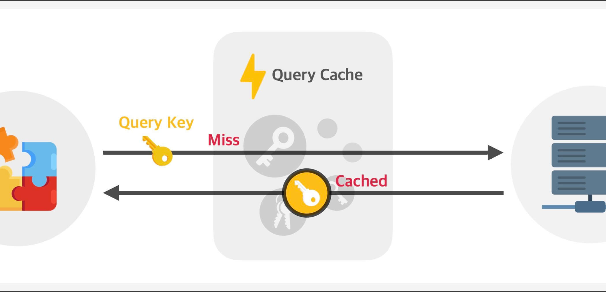
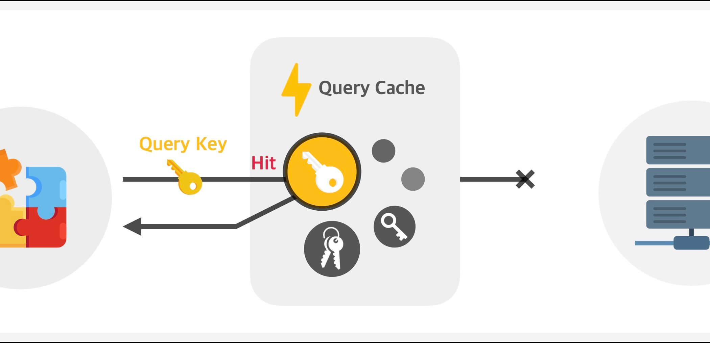
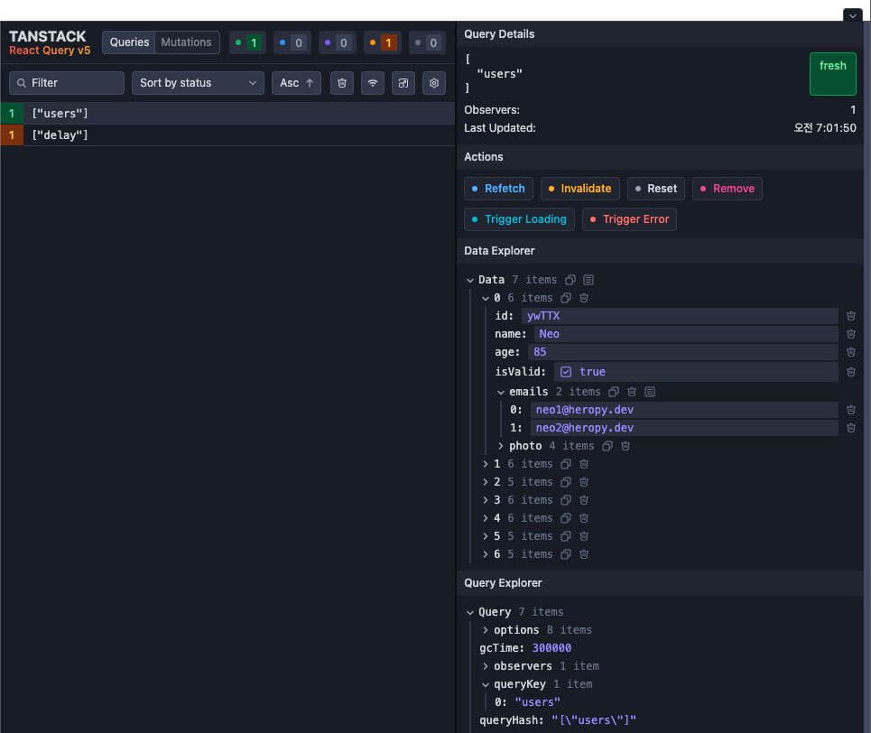

/// message-box --icon=info
이 글은 TanStack Query(React Query) `5.61.4` 버전을 기준으로 작성되었습니다.
///

## 개요

TanStack Query는 서버로부터 데이터 가져오기, 데이터 캐싱, 캐시 제어 등 데이터를 쉽고 효율적으로 관리할 수 있는 라이브러리입니다.
React Query라는 이름으로 시작했지만, v4부터 Vue나 Svelte 등의 다른 프레임워크에서도 활용할 수 있도록 기능이 확장되며 TanStack Query라는 이름으로 변경되었습니다.


대표적인 기능은 다음과 같습니다.

- 데이터 가져오기 및 캐싱
- 동일 요청의 중복 제거
- 신선한 데이터 유지
- 무한 스크롤, 페이지네이션 등의 성능 최적화
- 네트워크 재연결, 요청 실패 등의 자동 갱신

### 데이터 캐싱

TanStack Query를 활용해서 데이터를 가져올 때는 항상 쿼리 키(`queryKey`)를 지정하게 됩니다.
이 쿼리 키는 캐시된 데이터와 비교해 새로운 데이터를 가져올지, 캐시된 데이터를 사용할지 결정하는 기준이 됩니다.

```tsx --line-active=5
import { useQuery } from '@tanstack/react-query'

export default function DelayedData() {
  const { data } = useQuery({
    queryKey: ['delay'],
    queryFn: async () => (await fetch('https://api.heropy.dev/v0/delay?t=1000')).json()
  })
  return <div>{JSON.stringify(data)}</div>
}
```

다음 이미지는 쿼리 키와 일치하는 캐시된 데이터가 없을 때, 서버에서 새로운 데이터를 가져오는 과정을 보여줍니다.
서버에서 데이터를 가져오면 그 데이터는 캐시되고 그 이후 요청부터는 캐시된 데이터를 사용할 수 있습니다.



반대로 쿼리 키와 일치하는 캐시된 데이터가 있으면, 서버에 요청하지 않고 캐시된 데이터를 사용하게 됩니다.
따라서 같은 데이터를 가져오는 요청이 여러 번 발생해도, 캐시된 데이터를 사용하게 되어 중복 요청을 줄일 수 있습니다.
그렇다면 한번 캐시된 데이터가 있으면, 서버로는 더 이상 요청을 보낼 수 없는 걸까요?



### 데이터의 신선도

TanStack Query는 캐시한 데이터를 신선(Fresh)하거나 상한(Stale) 상태로 구분해 관리합니다.
캐시된 데이터가 신선하다면 캐시된 데이터를 사용하고, 만약 데이터가 상했다면 서버에 다시 요청해 신선한(새로운) 데이터를 가져옵니다.
일종의 데이터 유통기한 정도로 생각하면 이해하기 쉽습니다.


데이터가 상하는 데까지 걸리는 시간은 `staleTime` 옵션으로 지정할 수 있습니다.
그리고 신선한지 상했는지 여부는 `isStale`로 확인할 수 있습니다.

```tsx --line-active=4,7,11-12 --caption=화면에서 10초 후를 확인해 보세요!
import { useQuery } from '@tanstack/react-query'

export default function DelayedData() {
  const { data, isStale } = useQuery({
    queryKey: ['delay'],
    queryFn: async () => (await fetch('https://api.heropy.dev/v0/delay?t=1000')).json(),
    staleTime: 1000 * 10 // 10초 후 상함. 즉, 10초 동안 신선함.
  })
  return (
    <>
      <div>데이터가 {isStale ? '상했어요..' : '신선해요!'}</div>
      <div>{JSON.stringify(data)}</div>
    </>
  )
}
```

## 설치 및 구성

/// message-box --icon=info
기본 프로젝트는 [React 프로젝트 시작하기 w. Vite](https://www.heropy.dev/p/6iFzkB)를 참고하세요.
///

다음과 같이 TanStack Query를 설치합니다.
TanStack Query ESLint 플러그인을 사용할 수도 있습니다. 

```bash
npm i @tanstack/react-query
npm i -D @tanstack/eslint-plugin-query 
```

ESLint 플러그인의 권장 규칙을 사용하면, 일반적인 실수를 피하는 데 도움이 됩니다.
`extends` 옵션의 배열 아이템으로 `plugin:@tanstack/eslint-plugin-query/recommended`를 추가합니다.

```cjs --path=/.eslintrc.cjs --line-active=8 --line-error=18-21 --caption=ESLint 구성 예시
module.exports = {
  root: true,
  env: { browser: true, es2020: true },
  extends: [
    'eslint:recommended',
    'plugin:@typescript-eslint/recommended',
    'plugin:react-hooks/recommended',
    'plugin:@tanstack/eslint-plugin-query/recommended'
  ],
  ignorePatterns: ['dist', '.eslintrc.cjs'],
  parser: '@typescript-eslint/parser',
  plugins: ['react-refresh'],
  rules: {
    'react-refresh/only-export-components': [
      'warn',
      { allowConstantExport: true }
    ],
    // TanStack Query 권장 규칙! (plugin:@tanstack/eslint-plugin-query/recommended)
    // '@tanstack/query/exhaustive-deps': 'error',
    // '@tanstack/query/stable-query-client': 'error',
    // '@tanstack/query/no-rest-destructuring': 'warn'
  }
}
```

- `@tanstack/query/exhaustive-deps`: 쿼리 함수에서 사용하는 외부 변수는 쿼리 키에 추가하세요!
- `@tanstack/query/stable-query-client`: 애플리케이션에서 하나의 쿼리 클라이언트를 생성해 사용하세요!
- `@tanstack/query/no-rest-destructuring`: 쿼리의 반환에서 나머지 매개변수(`...rest`)를 사용하지 마세요!

프로젝트 범위를 `<QueryClientProvider>`로 랩핑하고, 사용할 `queryClient` 인스턴스를 연결합니다.
이제 사용할 준비가 끝났습니다!

```tsx --path=/src/App.tsx --line-active=7,11
import {
  QueryClient,
  QueryClientProvider,
} from '@tanstack/react-query'
import DelayedData from '~/components/DelayedData'

const queryClient = new QueryClient()

export default function App() {
  return (
    <QueryClientProvider client={queryClient}>
      <DelayedData />
    </QueryClientProvider>
  )
}
```

## 핵심 기능

### useQuery

가장 기본적인 쿼리 훅으로, 컴포넌트에서 데이터를 가져올 때 사용합니다.

```tsx
const 반환 = useQuery<데이터타입>(옵션)
```

다음 예제의 [지연 응답 API](https://www.heropy.dev/p/71PGfA)는 `t` 파라미터 값의 시간이 지난 후 응답합니다.
응답 데이터는 간단한 메시지(`message`)와 응답 시간(`time`)을 포함합니다.

```tsx --path=/src/components/DelayedData.tsx
import { useQuery } from '@tanstack/react-query'

type ResponseValue = {
  message: string
  time: string
}

export default function DelayedData() {
  const { data } = useQuery<ResponseValue>({
    queryKey: ['delay'],
    queryFn: async () => (await fetch('https://api.heropy.dev/v0/delay?t=1000')).json(),
    staleTime: 1000 * 10 // 10초
  })
  return <div>{data?.time}</div>
}
```

#### 옵션

다음은 알파벳 순으로 정렬한 목록입니다.

옵션 | 설명 | 기본값 | 타입
-- | -- | -- | --
`enabled` | 쿼리 자동 실행 여부.<br/>`false`인 경우, 대기 상태(`pending`)로 시작. | `true` | `boolean \| (query: Query) => boolean`
`gcTime` | 비활성 캐시 데이터(Inactive)가 메모리에 남아 있는 시간(ms). | `5 * 60 * 1000` | `number \| Infinity`
`initialData` | 쿼리가 생성되거나 캐시되기 전에 사용하는 초기 데이터. |  | `TData \| () => TData`
`initialDataUpdatedAt` | 초기 데이터의 마지막 업데이트 시간 지정. |  | `number \| (() => number \| undefined)`
`meta` | 활용할 추가 정보를 지정. |  | `Record<string, unknown>`
`networkMode` | 네트워크 모드 지정. | `'online'` | `'online' \| 'always' \| 'offlineFirst'`
`notifyOnChangeProps` | 컴포넌트 리랜더링을 위해 변경 여부를 확인할 쿼리의 특정 반환 속성 목록.<br/>예시: `['data', 'error']` | 컴포넌트에서 접근한 반환 속성 | `string[] \| "all" \| (() => string[] \| "all")`
`placeholderData` | 대기(Pending) 중인 상태에서 사용할 데이터. |  | `TData \| (previousValue: TData \| undefined, previousQuery: Query \| undefined) => TData`
`queryClient` | 커스텀 쿼리 클라인트 연결 |  | `QueryClient`
`queryFn` | 데이터를 가져오는 쿼리 함수로, 꼭 데이터를 반환하거나 오류를 던져야 함.<br/>기본 쿼리 함수가 지정되지 않은 경우에만 필수 옵션! |  | `(context: QueryFunctionContext) => Promise<TData>`
`queryKey` | 고유한 쿼리 키(식별자).<br/>필수 옵션! |  | `unknown[]`
`queryKeyHashFn` | 쿼리 키를 해시하는 함수. |  | `(queryKey: QueryKey) => string`
`refetchInterval` | 데이터 자동 갱신(다시 가져오기)의 시간 간격(ms). |  | `number \| false \| ((query: Query) => number \| false \| undefined)`
`refetchIntervalInBackground` | 백그라운드에서 데이터 자동 갱신 여부. | `false` | `boolean`
`refetchOnMount` | `useQuery` 연결 시 데이터 갱신 여부.<br/>- `true`: 연결 시 데이터가 상한 경우만 갱신.<br/>- `always`: 연결 시 데이터 항상 갱신. | `true` | `boolean \| "always" \| ((query: Query) => boolean \| "always")`
`refetchOnReconnect` | 네트워크 재연결 시 데이터 갱신 여부. | `true` | `boolean \| "always" \| ((query: Query) => boolean \| "always")`
`refetchOnWindowFocus` | 브라우저 화면 포커스 시 데이터 갱신 여부. | `true` | `boolean \| "always" \| ((query: Query) => boolean \| "always")`
`retry` | 쿼리 실패 시 재시도 횟수. | `3` | `boolean \| number \| (failureCount: number, error: TError) => boolean`
`retryDelay` | 재시도 시간 간격(ms). |  | `number \| (retryAttempt: number, error: TError) => number`
`retryOnMount` | `useQuery` 연결 시 재시도 여부. | `true` | `boolean`
`select` | 가져온 데이터를 변형(선택)하는 함수. |  | `(data: TData) => unknown`
`staleTime` | 데이터가 상하는데 걸리는 시간(ms). | `0` | `number \| ((query: Query) => number)`
`structuralSharing` | 데이터 구조의 재사용을 최적화해, 불변성을 유지하고 불필요한 리렌더링 방지. | `true` | `boolean \| (oldData: unknown \| undefined, newData: unknown) => unknown`
`throwOnError` | 쿼리 실패 시 오류를 던질지 여부. | `undefined` | `undefined \| boolean \| (error: TError, query: Query) => boolean`

##### queryKey

쿼리 키(`queryKey`)는 쿼리를 식별하는 고유한 값으로, 배열 형태로 지정합니다.
다중 아이템 쿼리 키를 사용할 때는, 아이템의 순서가 중요합니다.

```tsx
// 단일 아이템 쿼리 키
useQuery({ queryKey: ['hello'] })

// 다중 아이템 쿼리 키
useQuery({ queryKey: ['hello', 'world', 123, { a: 1, b: 2 }] })

// 서로 같은 쿼리
useQuery({ queryKey: ['hello', 'world', 123, { a: 1, b: 2 }] })
useQuery({ queryKey: ['hello', 'world', 123, { b: 2, c: undefined, a: 1 }] })

// 서로 다른 쿼리
useQuery({ queryKey: ['hello', 'world', 123, { a: 1, b: 2 }] })
useQuery({ queryKey: ['hello', 'world', 123, { a: 1, b: 2, c: 3 }] })
useQuery({ queryKey: ['hello', 'world'] })
useQuery({ queryKey: [123, 'world', { a: 1, b: 2, c: 3 }, 'hello'] })
```

다음 예제에서 `DelayedData` 컴포넌트의 `wait` Prop의 값이 다르면, 각각 별개의 요청을 전송합니다.

```tsx --path=/src/components/DelayedData.tsx --line-active=8,10,11
import { useQuery } from '@tanstack/react-query'

type ResponseValue = {
  message: string
  time: string
}

export default function DelayedData({ wait = 1000 }: { wait: number }) {
  const { data } = useQuery<ResponseValue>({
    queryKey: ['delay', wait],
    queryFn: async () => (await fetch(`https://api.heropy.dev/v0/delay?t=${wait}`)).json(),
    staleTime: 1000 * 10
  })
  return <div>{data?.time}</div>
}
```

```tsx --path=/src/App.tsx --line-active=11
import { QueryProvider } from './queryProvider'
import DelayedData from './components/DelayedData'

export default function App() {
  return (
    <QueryProvider>
      <DelayedData />
      <DelayedData wait={2000} />
      <DelayedData wait={3000} />
    </QueryProvider>
  )
}
```

기본적으로 쿼리 함수(`queryFn`)에서 사용하는 변수는 쿼리 키에 포함돼야 합니다.
그러면 변수가 변경될 때마다 자동으로 다시 가져올 수 있습니다.
그런데 만약 변수와는 상관없이 항상 하나의 쿼리로 처리하고 싶다면, ESLint `exhaustive-deps` 규칙을 비활성화할 수 있습니다.

```tsx --path=/src/components/DelayedData.tsx --line-active=4 --line-error=5
// ...
export default function DelayedData({ wait = 1000 }: { wait: number }) {
  const { data } = useQuery<ResponseValue>({
    // eslint-disable-next-line @tanstack/query/exhaustive-deps
    queryKey: ['delay'], // ESLint Error - The following dependencies are missing in your queryKey: wait
    queryFn: async () => (await fetch(`https://api.heropy.dev/v0/delay?t=${wait}`)).json(),
    staleTime: 1000 * 10
  })
  return <div>{data?.time}</div>
}
```

권장하지는 않지만, 프로젝트 전체에서 규칙을 비활성화할 수도 있습니다.

```cjs --path=/.eslintrc.cjs --line-active=4
module.exports = {
  // ...
  rules: {
    '@tanstack/query/exhaustive-deps': 'off'
  }
}
```

##### queryFn

쿼리 함수(`queryFn`)는 데이터를 가져오는 비동기 함수로, 꼭 데이터를 반환하거나 오류를 던져야 합니다.
던져진 오류는 반환되는 `error` 객체로 확인할 수 있습니다.
`error`는 기본적으로 `null`입니다.

```tsx --path=/src/components/DelayedData.tsx --line-active=9,15,17,24-25
import { useQuery } from '@tanstack/react-query'

type ResponseValue = {
  message: string
  time: string
}

export default function DelayedData() {
  const { data, error } = useQuery<ResponseValue>({
    queryKey: ['delay'],
    queryFn: async () => {
      const res = await fetch('https://api.heropy.dev/v0/delay?t=1000')
      const data = await res.json()
      if (!data.time) {
        throw new Error('문제가 발생했습니다!')
      }
      return data
    },
    staleTime: 1000 * 10,
    retry: 1
  })
  return (
    <>
      {data && <div>{JSON.stringify(data)}</div>}
      {error && <div>{error.message}</div>}
    </>
  )
}
```

##### select

선택 함수(`select`)를 사용하면 가져온 데이터를 변형(선택)할 수 있습니다.
쿼리 함수가 반환하는 데이터를 인수로 받아 선택 함수에서 처리하고 반환하면 최종 데이터가 됩니다.
최종 데이터의 타입은 `useQuery`의 3번째 제네릭 타입으로 선언할 수 있습니다.
2번째는 오류 타입(`Error`)입니다.

다음 예제의 사용한 API는 [사용자 정보 API](https://www.heropy.dev/p/5PlGxB)입니다.

```tsx --path=/src/components/UserNames.tsx --line-active=3,11,19
import { useQuery } from '@tanstack/react-query'

type Users = User[]
interface User {
  id: string
  name: string
  age: number
}

export default function UserNames() {
  const { data } = useQuery<Users, Error, string[]>({
    queryKey: ['users'],
    queryFn: async () => {
      const res = await fetch('https://api.heropy.dev/v0/users')
      const { users } = await res.json()
      return users
    },
    staleTime: 1000 * 10,
    select: data => data.map(user => user.name)
  })
  return (
    <>
      <h2>User Names</h2>
      <ul>{data?.map((name, i) => <li key={i}>{name}</li>)}</ul>
    </>
  )
}
```

쿼리 함수를 따로 선언해 제공하면, 선택 함수를 통한 최종 데이터의 타입을 추론할 수 있습니다.
다음 예제에서 쿼리 함수의 반환은 `Users` 타입이고, 최종 데이터(선택 함수의 반환)은 `string[]` 타입으로 추론됩니다.

```tsx --path=/src/components/UserNames.tsx --line-active=3-6,8,11
// ...

async function queryFn(): Promise<Users> {
  const res = await fetch('https://api.heropy.dev/v0/users')
  const { users } = await res.json()
  return users
}
export default function UserNames() {
  // data는 string[] 타입으로 추론
  const { data } = useQuery({
    queryKey: ['users'],
    queryFn,
    staleTime: 1000 * 10,
    select: data => data.map(user => user.name)
  })
  // ...
}
```

##### placeholderData

새로운 데이터를 가져오는 과정에서는 쿼리가 무효화되어 일시적으로 데이터가 없는 상태(`undefined`)가 되면 데이터 출력 화면이 화면이 깜빡일 수 있습니다.
이런 현상을 방지하기 위해 `placeholderData` 옵션을 사용하면, 쿼리 함수가 호출되는 대기 상태(Pending)에서 임시로 표시할 데이터를 미리 지정할 수 있습니다.
`placeholderData` 옵션에는 함수를 지정할 수 있으며, 이 함수는 새로운 데이터를 가져오기 직전의 이전(Previous) 데이터를 받을 수 있어서 이를 반환해 임시 데이터로 사용할 수 있습니다.

```tsx --path=/src/components/Movies.tsx --line-active=13
// ...

export default function Movies() {
  // ...
  
  const { data: movies } = useQuery<Movie[]>({
    queryKey: ['movies', searchText], // 검색어
    queryFn: async () => {
      const res = await fetch(`https://omdbapi.com?apikey=7035c60c&s=${searchText}`)
      const { Search: movies } = await res.json()
      return movies
    },
    placeholderData: prev => prev
  })
  
  // ...
}
```

##### structuralSharing

`structuralSharing` 옵션으로, 새로운 데이터를 가져올 때 이전 데이터와 비교해 변경되지 않은 부분은 이전 데이터를 재사용하도록 지정.할 수 있습니다.
이를 통해 메모리 사용량을 최적화하고 불필요한 리렌더링을 방지할 수 있습니다.

다음 예제와 같이 중첩된 객체의 이전 데이터와 새로운 데이터가 있습니다.
`structuralSharing` 옵션이 `true`이면 변경된 부분만 새롭게 업데이트하고 변경되지 않은 부분은 이전 데이터의 참조를 재사용합니다.
반대로 옵션이 `false`이면, 모든 객체가 새로운 참조로 생성됩니다.

```ts --line-active=10,24
// 이전 데이터
const prevUser = {
  id: 'abc123',
  name: 'Neo',
  age: 22,
  contact: {
    email: 'neo@gmail.com',
    address: {
      country: 'Korea',
      city: 'Seoul'
    }
  }
}

// 새로운 데이터
const newUser = {
  id: 'abc123',
  name: 'Neo',
  age: 22,
  contact: {
    email: 'neo@gmail.com',
    address: {
      country: 'Korea',
      city: 'Suwon' // 변경된 부분!
    }
  }
}
```

때로는 `structuralSharing` 옵션을 `false`로 지정.하는 것이 더 유리할 수 있습니다.
예를 들어, 매우 큰 중첩 객체를 다루는 경우 구조적인 비교 자체가 성능에 부담이 될 수 있습니다.
또한 데이터가 항상 새로운 참조여야 하거나 데이터가 단순해 깊은 비교가 필요하지 않은 경우에도 `false`로 지정.하는 게 좋습니다.

##### meta

`meta` 속성은 쿼리에 대한 추가 정보를 제공할 수 있습니다.

예를 들어, 쿼리 함수에서 발생한 오류 메시지 출력을 전역적으로 처리할 수 있습니다.
쿼리 클라이언트 생성의 `queryCache` 옵션에서 호출 쿼리의 추가 정보(`meta`)를 얻을 수 있습니다.

```tsx --path=/src/main.tsx --line-active=11
// ...
import {
  QueryClient,
  QueryClientProvider,
  QueryCache
} from '@tanstack/react-query'

const queryClient = new QueryClient({
  queryCache: new QueryCache({
    onError: (_error, query) => {
      alert(query.meta?.myErrorMessage) // 오류 메시지 출력!
    }
  })
})

// ...
```

```tsx --path=/src/components/Movies.tsx --line-active=13-15
// ...

export default function Movies() {
  // ...
  
  const { data: movies } = useQuery<Movie[]>({
    queryKey: ['movies', searchText], // 검색어
    queryFn: async () => {
      const res = await fetch(`https://omdbapi.com?apikey=7035c60c&s=${searchText}`)
      const { Search: movies } = await res.json()
      return movies
    },
    meta: {
      myErrorMessage: '영화를 검색할 수 없어요!'
    }
  })
  
  // ...
}
```

#### 반환

다음은 알파벳 순으로 정렬한 목록입니다.

반환 속성 | 설명 | 타입
-- | -- | --
`data` | 성공적으로 가져온 데이터. | `TData`
`dataUpdatedAt` | 최근에 데이터를 성공적으로 가져온 시간(유닉스 타임스탬프). | `number`
`error` | 오류가 발생했을 때의 오류 객체.<br>오류가 발생하지 않았다면 `null`. | `null \| TError`
`errorUpdateCount` | 모든 오류의 횟수. | `number`
`errorUpdatedAt` | 최근에 오류가 발생한 시간(유닉스 타임스탬프). | `number`
`failureCount` | 쿼리의 실패 횟수.<br>쿼리가 실패할 때마다 증가하고 쿼리가 성공하면 `0`으로 재지정. | `number`
`failureReason` | 쿼리의 재시도 실패 이유.<br/>쿼리가 성공하면 `null`로 재지정. | `null \| TError`
`fetchStatus` | `'fetching'`: 쿼리 함수가 실행 중.(첫 대기 및 백그라운드 다시 가져오기 포함, `isFetching`)<br/>`'paused'`: 쿼리 함수의 가져오기가 일시 중단됨.(`isPaused`)<br/>`'idle'`: 쿼리 함수가 동작 중이지 않음. | `'fetching'` \| `'paused'` \| `'idle'`
`isError` | 쿼리 함수에서의 오류 발생 여부. | `boolean`
`isFetched` | 쿼리의 첫 데이터 가져오기가 완료되었는지 여부. | `boolean`
`isFetchedAfterMount` | 컴포넌트 연결 후 가져오기가 완료되었는지 여부.<br/>컴포넌트 연결 전에 캐시된 데이터를 표시하지 않는 용도로 사용. | `boolean`
`isFetching` | 쿼리 함수가 실행 중.(첫 대기 및 백그라운드 다시 가져오기 포함) | `boolean`
`isLoading` | 쿼리 함수의 첫 번째 가져오기가 진행 중.<br/>`isFetching && isPending`와 같음. | `boolean`
`isLoadingError` | 쿼리 함수의 첫 번째 가져오기 중 실패 여부. | `boolean`
`isPaused` | 쿼리 가져오기가 일시 중단됨. | `boolean`
`isPending` | 캐시된 데이터가 없고 쿼리가 아직 완료되지 않은 상태. | `boolean`
`isPlaceholderData` | 표시된 데이터가 대체 데이터인지 여부. | `boolean`
`isRefetchError` | 쿼리가 다시 가져오기를 시도하는 중에 실패했는지 여부. | `boolean`
`isRefetching` | 백그라운드에서 다시 가져오기가 진행 중인지의 여부.<br/>`isFetching && !isPending`와 같음. | `boolean`
`isStale` | 캐시된 데이터가 무효화(Invalidated)되거나 `staleTime`이 경과된 여부. | `boolean`
`isSuccess` | 쿼리 데이터를 성공적으로 가져왔는지 여부. | `boolean`
`refetch` | 데이터를 새롭게 다시 가져오는 함수.<br>`throwOnError: true` 옵션을 사용해야 오류가 발생. | `(options: { throwOnError: boolean, cancelRefetch: boolean }) => Promise<UseQueryResult>`
`status` | `'pending'`: 캐시된 데이터가 없고 아직 완료되지 않은 상태.(`isPending`)<br>`'error'`: 오류가 발생한 상태.(`isError`)<br>`'success'`: 데이터를 성공적으로 가져온 상태.(`isSuccess`) | `'pending' \| 'error' \| 'success'`

##### 상태 확인

`isFetching`은 쿼리 함수(`queryFn`)가 실행 중인지의 여부로, 데이터를 가져오는 중을 나타냅니다.

`isPending`은 캐시된 데이터가 없고 쿼리가 아직 완료되지 않은 상태의 여부로, `initialData` 혹은 `placeholderData` 옵션으로 데이터를 제공하면 출력 대기(Pending)가 필요하지 않으므로 `false`를 반환합니다.
`enabled` 옵션을 `false`로 지정.하면, 쿼리가 대기 상태로 시작하므로 `isPending`는 `true`를 반환합니다.

`isLoading`은 `isFetching && isPending`와 같은 의미로, 쿼리의 첫 번째 가져오기가 진행 중인 경우를 나타냅니다.

```tsx --path=/src/components/DelayedData.tsx
// ...

export default function DelayedData() {
  const { data, isFetching, isPending, isLoading } = useQuery<ResponseValue>({
    queryKey: ['delay'],
    queryFn: async () => (await fetch('https://api.heropy.dev/v0/delay?t=1000')).json(),
    staleTime: 1000 * 10
  })
  return (
    <>
      <div>isFetching: {JSON.stringify(isFetching)}</div>
      <div>isPending: {JSON.stringify(isPending)}</div>
      <div>isLoading: {JSON.stringify(isLoading)}</div>
      <div>{data?.time}</div>
    </>
  )
}
```

아래의 [다시 가져오기](/p/HZaKIE#h5_다시_가져오기) 주제에서 설명하는 `refetch` 함수를 활용하면, 각 상태를 좀 더 쉽게 이해할 수 있습니다.

```tsx --path=/src/components/DelayedData.tsx
import { useQuery } from '@tanstack/react-query'

type ResponseValue = {
  message: string
  time: string
}

export default function DelayedData() {
  const { data, isStale, isFetching, isLoading, refetch } =
    useQuery<ResponseValue>({
      queryKey: ['delay'],
      queryFn: async () => (await fetch('https://api.heropy.dev/v0/delay?t=1000')).json(),
      staleTime: 1000 * 10
    })
  return (
    <>
      {isLoading ? (
        <div>로딩 중..</div>
      ) : (
        <>
          <div>{data?.time}</div>
          <div>데이터가 상했나요?: {JSON.stringify(isStale)}</div>
          <button
            disabled={isFetching}
            onClick={() => refetch()}>
            {isFetching ? '데이터 가져오는 중..' : '데이터 다시 가져오기!'}
          </button>
        </>
      )}
    </>
  )
}

```

##### 다시 가져오기

`refetch` 함수를 사용하면, 데이터를 항상 새롭게 다시 가져올 수 있습니다.

```tsx --path=/src/components/DelayedData.tsx --line-active=4,13
// ...

export default function DelayedData() {
  const { data, isStale, refetch } = useQuery<ResponseValue>({
    queryKey: ['delay'],
    queryFn: async () => (await fetch('https://api.heropy.dev/v0/delay?t=1000')).json(),
    staleTime: 1000 * 10
  })
  return (
    <>
      <div>{data?.time}</div>
      <div>데이터가 상했나요?: {JSON.stringify(isStale)}</div>
      <button onClick={() => refetch()}>데이터 가져오기!</button>
    </>
  )
}
```

만약 신선도(`staleTime`) 기반으로 데이터를 가져오려면, `queryClient.fetchQuery()` 메소드를 사용할 수 있습니다.
주의할 부분은, `queryKey`와 `staleTime`를 기존 쿼리와 동일하게 제공해야 합니다.(`queryFn` 생략 가능)

/// message-box --icon=info
`queryOptions` 함수를 사용해 옵션을 미리 정의하고 재사용할 수 있습니다.
///

```tsx --path=/src/components/DelayedData.tsx --line-active=1,4,11,12,15
import { useQuery, useQueryClient, queryOptions } from '@tanstack/react-query'
// ...

const options = queryOptions<ResponseValue>({
  queryKey: ['delay'],
  queryFn: async () => (await fetch('https://api.heropy.dev/v0/delay?t=1000')).json(),
  staleTime: 1000 * 10
})

export default function DelayedData() {
  const queryClient = useQueryClient()
  const { data, isStale } = useQuery(options)
  
  function fetchData() {
    const data = await queryClient.fetchQuery(options)
    console.log(data) // 캐시된 데이터 or 새로 가져온 데이터
  }
  return (
    <>
      <div>{data?.time}</div>
      <div>데이터가 상했나요?: {JSON.stringify(isStale)}</div>
      <button onClick={fetchData}>데이터 가져오기!</button>
    </>
  )
}
```

만약 캐시된 데이터가 필요하다면, `queryClient.getQueryData()` 메소드를 사용할 수 있습니다.
데이터가 상해도 새로 가져오지 않고, 캐시된 데이터만 반환합니다.
캐시된 데이터가 없는 경우, `undefined`를 반환합니다.

/// message-box --icon=info
`queryClient.getQueryData()` 대신 `queryClient.ensureQueryData()` 메소드를 사용하면, 캐시된 데이터가 없는 경우 `undefined`를 반환하지 않고, 자동으로 `queryClient.fetchQuery()` 메소드를 호출해 데이터를 가져옵니다.
///

`useQueryClient` 훅을 사용해 `queryClient` 객체를 가져온 후, `getQueryData` 메소드를 사용합니다.

```tsx --path=/src/components/DelayedData.tsx --line-active=1,5,13
import { useQuery, useQueryClient } from '@tanstack/react-query'
// ...

export default function DelayedData() {
  const queryClient = useQueryClient()
  const { data, isStale } = useQuery<ResponseValue>({
    queryKey: ['delay'],
    queryFn: async () => (await fetch('https://api.heropy.dev/v0/delay?t=1000')).json(),
    staleTime: 1000 * 10
  })
  
  function getCachedData() {
    const data = queryClient.getQueryData(['delay'])
    console.log(data) // 캐시된 데이터 or undefined
  }
  return (
    <>
      <div>{data?.time}</div>
      <div>데이터가 상했나요?: {JSON.stringify(isStale)}</div>
      <button onClick={getCachedData}>데이터 가져오기!</button>
    </>
  )
}
```

### useInfiniteQuery

'더 보기' 버튼으로 추가 데이터를 더 가져오거나 더 나아가 무한 스크롤 기능은 쉽게 찾아볼 수 있는 일반적인 UI입니다.
TanStack Query는 이런 UI 개발을 위해, `useInfiniteQuery` 훅을 제공합니다.

```tsx
const 반환 = useInfiniteQuery<페이지타입>(옵션)
```

#### 옵션

`useInfiniteQuery`는 앞서 살펴본 `useQuery`의 모든 옵션을 사용할 수 있으며, 추가로 다음의 옵션들을 사용할 수 있습니다.
다음은 알파벳 순으로 정렬한 목록입니다.

옵션 | 설명 | 기본값 | 타입
-- | -- | -- | --
`getNextPageParam` | 새로운 다음 페이지를 가져오면, 다음 페이지의 정보로 호출되는 함수.<br/>필수 옵션!<br/>다음 페이지 번호를 반환해야 함!<br/>다음 페이지가 없으면, `undefined` 또는 `null`을 반환해야 함! |  | `(lastPage: TPage, allPages: TPage[], lastPageParam: number, allPageParams: number[]) => TPageParam \| undefined \| null`
`getPreviousPageParam` | 새로운 이전 페이지를 가져오면, 이전 페이지의 정보로 호출되는 함수.<br/>이전 페이지 번호를 반환해야 함!<br/>이전 페이지가 없으면, `undefined` 또는 `null`을 반환해야 함! |  | `(firstPage: TPage, allPages: TPage[], firstPageParam: number, allPageParams: number[]) => TPageParam \| undefined \| null`
`initialPageParam` | 첫 번째 페이지의 번호.<br/>필수 옵션! |  | `TPageParam`
`maxPages` | 저장 및 출력할 최대 페이지의 수.<br/>페이지가 지나치게 많은 경우에 유용. | `Infinite` | `number`

#### 반환

그리고 역시 `useQuery`의 모든 반환 속성을 사용할 수 있으며, 추가로 다음의 반환 속성들을 사용할 수 있습니다.
다음은 알파벳 순으로 정렬한 목록입니다.

반환 속성 | 설명 | 타입
-- | -- | --
`fetchNextPage` | 다음 페이지를 가져오는 함수. | `(options?: FetchNextPageOptions) => Promise<UseInfiniteQueryResult>`
`fetchPreviousPage` | 이전 페이지를 가져오는 함수. | `(options?: FetchPreviousPageOptions) => Promise<UseInfiniteQueryResult>`
`hasNextPage` | 다음 페이지가 있는지 여부. | `boolean`
`hasPreviousPage` | 이전 페이지가 있는지 여부. | `boolean`
`isFetchingNextPage` | 다음 페이지를 가져오는 중인지의 여부. | `boolean`
`isFetchingPreviousPage` | 이전 페이지를 가져오는 중인지의 여부. | `boolean`

#### 예제

다음은 사용자가 입력한 영화 제목으로 영화 목록을 가져와 출력하고, '더 보기' 버튼을 선택해 추가 영화 목록을 가져올 수 있는 `useInfiniteQuery` 휵의 이해를 돕는 간단한 예제입니다.
쿼리 함수에서 반환하는 데이터는 `data.pages` 배열에 저장되는 것에 주의하세요.

```tsx --path=/src/components/MovieList.tsx
import React, { useState, useEffect, useCallback } from 'react'
import { useInfiniteQuery } from '@tanstack/react-query'

export interface Page {
  Search: Movie[] // 검색된 영화 목록
  totalResults: string // 검색된 모든 결과의 수
  Response: string // 'True' or 'False'
}
export interface Movie {
  Title: string
  Year: string
  imdbID: string
  Type: string
  Poster: string
}

export default function MovieList() {
  const [searchText, setSearchText] = useState('')
  const [queryText, setQueryText] = useState('')

  const {
    data, // 가져온 데이터
    isLoading, // 첫 페이지 가져오는 중
    isFetching, // 다음 페이지 가져오는 중
    isFetched, // 첫 페이지 가져오기 완료
    hasNextPage, // 다음 페이지가 있는지 여부
    fetchPreviousPage, // 이전 페이지 가져오기 함수
    fetchNextPage // 다음 페이지 가져오기 함수
  } = useInfiniteQuery<Page>({
    queryKey: ['movies', queryText], // 검색어로 쿼리 키 생성!
    queryFn: async ({ pageParam }) => {
      const res = await fetch(`https://omdbapi.com/?apikey=7035c60c&s=${queryText}&page=${pageParam}`)
      return res.json()
    },
    initialPageParam: 1, // 첫 페이지 번호 초기화!
    getNextPageParam: (lastPage, pages) => {
      // 한 페이지당 최대 10개까지의 영화 정보를 가져옴!
      // 마지막 페이지 번호 계산!
      const maxPage = Math.ceil(Number.parseInt(pages[0].totalResults, 10) / 10)

      // 다음 페이지가 있으면, 다음 페이지 번호 반환!
      if (lastPage.Response === 'True' && pages.length < maxPage) {
        return pages.length + 1
      }
      // 다음 페이지가 없으면 undefined | null 반환!
      return undefined
    },
    enabled: false, // 검색어 입력 전까지 대기!
    staleTime: 1000 * 60 * 5 // 5분
  })

  useEffect(() => {
    // 검색어가 변경될 때마다, 캐시된 데이터가 있어서 그 데이터의 다음 페이지를 가져오지 않도록 이미 캐시된 이전 페이지를 가져옴!
    if (queryText) fetchPreviousPage()
  }, [queryText, fetchPreviousPage])

  const handleSubmit = useCallback(
    (e: React.FormEvent) => {
      e.preventDefault()
      // 검색!
      if (searchText.trim()) {
        setQueryText(searchText)
      }
      // 초기화!
      if (!searchText.trim()) {
        setSearchText('')
        setQueryText('')
      }
    },
    [searchText]
  )

  return (
    <>
      <form onSubmit={handleSubmit}>
        <input
          type="text"
          value={searchText}
          placeholder="영화 제목을 입력하세요."
          onChange={e => setSearchText(e.target.value)}
        />
      </form>
      <div>
        {data?.pages.map((page, index) => (
          // 각 페이지의 출력 최적화를 위해, 페이지 단위 key 속성을 추가!
          <React.Fragment key={index}>
            {page.Search &&
              page.Search.map(movie => (
                <div key={movie.imdbID}>{movie.Title}</div>
              ))}
          </React.Fragment>
        ))}
      </div>
      {isLoading ? <div>로딩 중..</div> : null}
      {isFetched && hasNextPage && (
        <button
          disabled={isFetching}
          onClick={() => fetchNextPage()}>
          {isFetching ? '로딩 중..' : '더 보기!'}
        </button>
      )}
    </>
  )
}
```

위 예제를 무한 스크롤 기능으로 구현하면, 다음과 같이 수정할 수 있습니다.

/// message-box --icon=warning
TanStack Query 개발자 도구는 별도 창이 아닌 단순히 화면 안의 요소이기 때문에, 무한 스크롤을 화면에서 테스트할 때는 일시적으로 개발자 도구를 닫는 것을 추천합니다.
여기서 말하는 개발자 도구는 브라우저의 개발자 도구가 아닙니다!
///

```tsx --path=/src/components/MovieList.tsx --line-active=1,9,23-38,45-49 --line-error=13,15
import React, { useState, useEffect, useCallback, useRef } from 'react'
import { useInfiniteQuery } from '@tanstack/react-query'

// ...

export default function MovieList() {
  const [searchText, setSearchText] = useState('')
  const [queryText, setQueryText] = useState('')
  const observerEl = useRef<HTMLDivElement | null>(null)

  const {
    data,
    // isLoading,
    isFetching,
    // isFetched,
    hasNextPage,
    fetchPreviousPage,
    fetchNextPage
  } = useInfiniteQuery<Page>({
    // ...
  })

  useEffect(() => {
    const currentObserverEl = observerEl.current
    const io = new IntersectionObserver(entries => {
      if (entries[0].isIntersecting && hasNextPage) {
        fetchNextPage()
      }
    })
    if (currentObserverEl) {
      io.observe(currentObserverEl)
    }
    return () => {
      if (currentObserverEl) {
        io.disconnect()
      }
    }
  }, [hasNextPage, fetchNextPage])

  // ...

  return (
    <>
      {/* ... */}
      {isFetching ? <div>로딩 중..</div> : null}
      <div
        ref={observerEl}
        style={{ height: '20px' }}
      />
    </>
  )
}
```

좀 더 간결한 코드를 원한다면, [react-intersection-observer](https://github.com/thebuilder/react-intersection-observer) 라이브러리를 사용할 수 있습니다.
`ref` 속성을 관찰 요소와 연결하고, `inView` 속성을 사용해 요소가 화면에 보이는지 여부를 확인할 수 있습니다.

라이브러리를 설치하고 아래 예제와 같이 수정해 보세요.

```bash
npm i react-intersection-observer
```

```tsx --path=/src/components/MovieList.tsx --line-active=1,3,10,31-35,44 --line-error=14-29
import React, { useState, useEffec, useCallback } from 'react'
import { useInfiniteQuery } from '@tanstack/react-query'
import { useInView } from 'react-intersection-observer'

// ...

export default function MovieList() {
  const [searchText, setSearchText] = useState('')
  const [queryText, setQueryText] = useState('')
  const { ref, inView } = useInView()

  // ...

  // useEffect(() => {
  //   const currentObserverEl = observerEl.current
  //   const io = new IntersectionObserver(entries => {
  //     if (entries[0].isIntersecting && hasNextPage) {
  //       fetchNextPage()
  //     }
  //   })
  //   if (currentObserverEl) {
  //     io.observe(currentObserverEl)
  //   }
  //   return () => {
  //     if (currentObserverEl) {
  //       io.disconnect()
  //     }
  //   }
  // }, [hasNextPage, fetchNextPage])

  useEffect(() => {
    if (inView && hasNextPage) {
      fetchNextPage()
    }
  }, [inView, hasNextPage, fetchNextPage])

  // ...

  return (
    <>
      {/* ... */}
      {isFetching ? <div>로딩 중..</div> : null}
      <div
        ref={ref}
        style={{ height: '20px' }}
      />
    </>
  )
}
```

### useMutation

TanStack Query는 데이터 변경 작업(생성, 수정, 삭제 등)을 위한 `useMutation` 훅을 제공합니다.
이를 통해, 데이터 변경 작업을 처리하고 다양한 성공, 실패, 로딩 등의 상태를 얻을 수 있습니다.
그리고 요청 실패 시의 자동 재시도나 낙관적 업데이트 같은 고급 기능도 쉽게 처리할 수 있습니다.

쿼리(`useQuery`)는 '가져오기'에 집중하는 반면, 변이(`useMutation`)는 '보내기'에 집중하는 훅으로 이해하면 쉽습니다.

/// message-box --icon=info
낙관적 업데이트(Optimistic Update)는 서버 요청의 응답을 기다리지 않고, 먼저 UI를 업데이트하는 기능을 말합니다.
서버 응답이 느린 상황에서도 빠른 인터페이스를 제공할 수 있어 사용자 경험을 크게 향상시킬 수 있습니다.
///

```tsx
const 반환 = useMutation(옵션)
```

#### 옵션

`useMutation` 훅은 다음과 같은 옵션을 제공합니다.
다음은 알파벳 순으로 정렬한 목록입니다.

옵션 | 설명 | 기본값 | 타입
-- | -- | -- | --
`gcTime` | 비활성 캐시 데이터(Inactive)가 메모리에 남아 있는 시간(ms). |  | `number \| Infinity`
`meta` | 활용할 추가 정보를 지정. |  | `Record<string, unknown>`
`mutationFn` | 실행할 비동기 변이 함수.<br/>필수 옵션! |  | `(variables: TVariables) => Promise<TData>`
`mutationKey` | `queryClient.setMutationDefaults`의 기본값 상속을 위한 키 |  | `unknown[]`
`networkMode` | 네트워크 모드 지정. | `'online'` | `'online' \| 'always' \| 'offlineFirst'`
`onError` | 변이 중 오류가 발생할 때 호출되는 함수. |  | `(err: TError, variables: TVariables, context?: TContext) => Promise<unknown> \| unknown`
`onMutate` | 변이 함수가 실행되기 전에 호출되는 함수. |  | `(variables: TVariables) => Promise<TContext \| void> \| TContext \| void`
`onSettled` | 변이가 성공하거나 실패해도 항상 호출되는 함수. |  | `(data: TData, error: TError, variables: TVariables, context?: TContext) => Promise<unknown> \| unknown`
`onSuccess` | 변이가 성공할 때 호출되는 함수. |  | `(data: TData, variables: TVariables, context: TContext) => Promise<unknown> \| unknown`
`queryClient` | 커스텀 쿼리 클라인트 연결. |  | `QueryClient`
`retry` | 변이 실패 시 재시도 횟수. | `0` | `boolean \| number \| (failureCount: number, error: TError) => boolean`
`retryDelay` | 재시도 시간 간격(ms). |  | `number \| (retryAttempt: number, error: TError) => number`
`scope` | 동시 실행 범위 지정.<br/>같은 범위 ID를 가진 변이는 병렬이 아닌 직렬로 실행. |  | `{ id: string }`
`throwOnError` | 변이 실패 시 오류를 던질지 여부. | `undefined` | `undefined \| boolean \| (error: TError) => boolean`

#### 반환

다음은 알파벳 순으로 정렬한 목록입니다.

반환 속성 | 설명 | 타입
-- | -- | --
`data` | 성공적으로 가져온 데이터. | `undefined \| unknown`
`error` | 오류가 발생했을 때의 오류 객체.<br/>오류가 발생하지 않았다면 null. | `null \| TError`
`failureCount` | 변이의 실패 횟수.<br/>변이가 실패할 때마다 증가하고 변이가 성공하면 `0`으로 재지정. | `number`
`failureReason` | 변이의 재시도 실패 이유.<br/>쿼리가 성공하면 null로 재지정. | `null \| TError`
`isError` | 변이 함수에서의 오류 발생 여부. | `boolean`
`isIdle` | 변이 함수가 실행되기 전의 초기 상태인지 여부 | `boolean`
`isPaused` | 변이 함수가 일시 중단되었는지 여부 | `boolean`
`isPending` | 변이 함수가 실행 중인지 여부 | `boolean`
`isSuccess` | 데이터를 성공적으로 가져왔는지 여부. | `boolean`
`mutate` | 변이 실행 함수 | `(variables: TVariables, { onSuccess, onSettled, onError }) => void`
`mutateAsync` | 비동기 변이 실행 함수 | `(variables: TVariables, { onSuccess, onSettled, onError }) => Promise<TData>`
`reset` | 변이 내부 상태를 초기 상태로 재지정.하는 함수 | `() => void`
`status` | 변이의 현재 상태.<br/>`idle`: 초기 상태<br/>`pending`: 실행 중<br/>`error`: 오류 발생<br/>`success`: 성공 | `string`
`submittedAt` | 변이가 제출된 시간(유닉스 타임스탬프). | `number`
`variables` | 변이 실행 함수(`mutate`)에 전달된 데이터. | `undefined \| TVariables`

#### 예제

우선 다음과 같이, 사용자 목록을 가져오는 쿼리(`['users']`)가 있습니다.

```tsx --path=/src/components/Users.tsx
import { useQuery } from '@tanstack/react-query'

export type Users = User[]
export interface User {
  name: string
  age: number
  isValid?: boolean
  emails?: string[]
  photo?: {
    name: string
    data: string // Base64
  }
  id?: string
}

export default function Users() {
  const { data } = useQuery<Users>({
    queryKey: ['users'],
    queryFn: async () => {
      const res = await fetch('https://api.heropy.dev/v0/users') // GET
      const json = await res.json()
      return json.users
    },
    staleTime: 1000 * 60 * 5 // 5분
  })

  // ...
}
```

변이는 조회(Read)를 제외한 데이터 생성(Create)이나 수정(Update), 삭제(Delete) 작업을 수행합니다.
다음 예제는 입력한 사용자의 이름과 나이로 새로운 사용자를 추가하는 예제입니다.

```tsx --path=/src/components/AddUser.tsx
import React, { useState } from 'react'
import { useMutation, useQueryClient } from '@tanstack/react-query'
import type { Users, User } from './Users'

export default function AddUser() {
  const [name, setName] = useState('')
  const [age, setAge] = useState(0)
  const queryClient = useQueryClient()

  const { mutate, error, isPending, isError } = useMutation({
    mutationFn: async (newUser: User) => { // 
      const res = await fetch('https://api.heropy.dev/v0/users', {
        method: 'POST',
        body: JSON.stringify(newUser)
      })
      if (!res.ok) throw new Error('변이 중 에러 발생!') // 변이 실패!
      return res.json() // 변이 성공!
    },
    onMutate: async newUser => {
      // 낙관적 업데이트 전에 사용자 목록 쿼리를 취소해 잠재적인 충돌 방지!
      await queryClient.cancelQueries({ queryKey: ['users'] })

      // 캐시된 데이터(사용자 목록) 가져오기!
      const previousUsers = queryClient.getQueryData<Users>(['users'])

      // 낙관적 업데이트
      if (previousUsers) {
        queryClient.setQueryData<Users>(['users'], [...previousUsers, newUser])
      }

      // 각 콜백의 context로 전달할 데이터 반환!
      return { previousUsers }
    },
    onSuccess: (data, newUser, context) => {
      console.log('onSuccess', data, newUser, context)
      // 변이 성공 시 캐시 무효화로 사용자 목록 데이터 갱신!
      queryClient.invalidateQueries({ queryKey: ['users'] })
    },
    onError: (error, newUser, context) => {
      console.log('onError', error, newUser, context)
      // 변이 실패 시, 낙관적 업데이트 결과를 이전 사용자 목록으로 되돌리기!
      if (context) {
        queryClient.setQueryData(['users'], context.previousUsers)
      }
    },
    onSettled: (data, error, newUser, context) => {
      console.log('onSettled', data, error, newUser, context)
    },
    retry: 3, // 변이 실패 시 3번 재시도
    retryDelay: 500 // 0.5초 간격으로 재시도
  })

  const handleSubmit = (e: React.FormEvent) => {
    e.preventDefault()
    mutate({ name, age }) // 변이!
  }

  return (
    <form onSubmit={handleSubmit}>
      <input
        type="text"
        value={name}
        onChange={e => setName(e.target.value)}
        placeholder="사용자 이름"
      />
      <input
        type="number"
        value={age || ''}
        onChange={e => setAge(Number.parseInt(e.target.value, 10))}
        placeholder="사용자 나이"
      />
      <button
        type="submit"
        disabled={isPending}>
        {isPending ? '사용자 추가 중..' : '사용자 추가하기!'}
      </button>
      {isError && <p>에러 발생: {error.message}</p>}
    </form>
  )
}
```

## 개발자 도구 사용

TanStack Query 전용 개발자 도구를 활용할 수 있습니다.
이를 통해 쿼리의 상태나 데이터, 오류, 캐시 등을 쉽게 확인하고 디버깅할 수 있습니다.
우선 다음과 같이 개발자 도구 라이브러리를 설치합니다.

```bash
npm i @tanstack/react-query-devtools
```

쿼리 공급자(`<QueryClientProvider>`) 범위에서 개발자 도구 컴포넌트를 사용하면 됩니다.

```tsx --path=/src/App.tsx --line-active=5,14
import {
  QueryClient,
  QueryClientProvider,
} from '@tanstack/react-query'
import { ReactQueryDevtools } from '@tanstack/react-query-devtools'
import DelayedData from './components/DelayedData'

const queryClient = new QueryClient()

export default function App() {
  return (
    <QueryClientProvider client={queryClient}>
      <DelayedData />
      <ReactQueryDevtools />
    </QueryClientProvider>
  )
}
```

이제 개발 서버를 실행하고 브라우저를 확인하면, 다음 이미지와 같이 화면 우측 하단에 TanStack 로고 모양의 개발자 도구 버튼이 나타납니다.


버튼을 누르고 개발자 도구를 열어 사용하거나 도구 우측 상단의 버튼을 선택해 닫을 수도 있습니다.



## with Next.js

```bash
npm i @tanstack/react-query-next-experimental
```

다음과 같이 Provider를 구성합니다.
서버와 클라이언트 모두에서 사용해야 하므로, `'use client'`를 사용해야 합니다.

```tsx --path=/providers/query.tsx --line-active=1
'use client'
import {
  QueryClient,
  QueryClientProvider,
  isServer,
} from '@tanstack/react-query'
import { ReactQueryStreamedHydration } from '@tanstack/react-query-next-experimental'

function makeQueryClient() {
  return new QueryClient({
    defaultOptions: {
      queries: {
        // 클라이언트의 즉시 다시 요청에 대응하도록, 기본 캐싱 시간(min)을 지정.
        staleTime: 60 * 1000
      }
    }
  })
}

let browserQueryClient: QueryClient | undefined = undefined

function getQueryClient() {
  if (isServer) {
    return makeQueryClient()
  } else {
    if (!browserQueryClient) browserQueryClient = makeQueryClient()
    return browserQueryClient
  }
}

export function QueryProvider({ children }: { children: React.ReactNode }) {
  const queryClient = getQueryClient()
  return (
    <QueryClientProvider client={queryClient}>
      <ReactQueryStreamedHydration>
        {children}
      </ReactQueryStreamedHydration>
    </QueryClientProvider>
  )
}
```

그리고 루트 레이아웃에서 구성한 `<QueryProvider>`를 사용합니다.

```tsx --path=/app/layout.tsx --line-active=1,11
import { QueryProvider } from '@/providers/query'

export default function RootLayout({
  children
}: Readonly<{
  children: React.ReactNode
}>) {
  return (
    <html lang="ko">
      <body>
        <QueryProvider>{children}</QueryProvider>
      </body>
    </html>
  )
}
```

`useSuspenseQuery`를 사용하면, 서버 측 렌더링 단계에서 가져오기를 시도합니다.

/// message-box --icon=warning
Next.js 14버전까지 `fetch` 함수는 기본적으로 캐싱 기능이 활성화되어 있으므로, `cache: 'no-store'` 옵션을 사용해야 캐싱 기능을 비활성화할 수 있습니다.
Next.js 15버전부터 `fetch` 함수가 기본적으로 캐싱 기능이 비활성화되어 있으므로, 해당 옵션을 사용하지 않아도 됩니다.
///

```tsx --path=/components/DelayedData.tsx --line-active=1 --line-error=14
'use client'
import { useSuspenseQuery } from '@tanstack/react-query'

type ResponseValue = {
  message: string
  time: string
}

export default function DelayedData() {
  const { data } = useSuspenseQuery<ResponseValue>({
    queryKey: ['delay'],
    queryFn: async () => {
      const res = await fetch('https://api.heropy.dev/v0/delay?t=1000', {
        // cache: 'no-store'
      })
      return res.json()
    },
    staleTime: 1000 * 10
  })
  return <div>{data.time}</div>
}
```

```tsx --path=/app/page.tsx
import { Suspense } from 'react'
import DelayedData from '@/components/DelayedData'

export default function Page() {
  return (
    <Suspense fallback={<div>loading..</div>}>
      <DelayedData />
    </Suspense>
  )
}
```