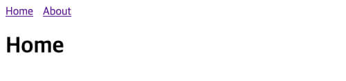
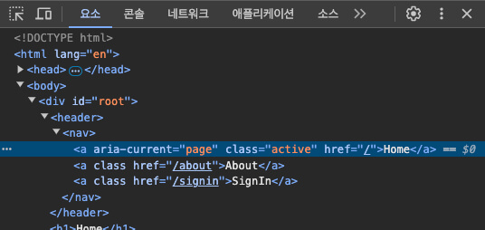
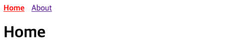
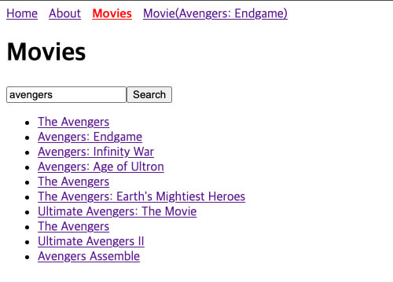
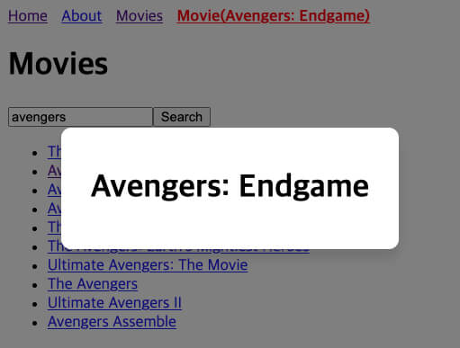
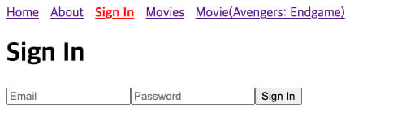

/// message-box --icon=info
이 글에서 제공하는 예제는 [React 프로젝트 시작하기 w. Vite](/p/6iFzkB) 에서 생성한 프로젝트를 기반으로 합니다.
///

React Router 라이브러리를 통해 React 애플리케이션에서 여러 페이지를 쉽게 관리하고 내비게이션을 구현할 수 있습니다. 
동적 라우팅, 중첩 라우팅, 여러 방식의 내비게이션 등 다양한 기능을 지원하는 React Router의 핵심 개념과 사용법을 살펴봅니다.

## 설치 및 구성

다음과 같이 `react-router-dom`을 설치합니다.

```bash
npm install react-router-dom
```

최상위 컴포넌트인 `App.tsx`는 더 이상 사용하지 않습니다.
다음의 폴더 및 파일 구조로 시작합니다.

```plaintext
├─src/
│  ├─routes/
│  │  ├─pages/
│  │  │  ├─About.tsx
│  │  │  └─Home.tsx
│  │  └─index.tsx
│  └─main.tsx
```

우선 사용할 페이지 컴포넌트를 준비합니다.
아직 특별한 내용은 없습니다.

```tsx --path=/src/routes/pages/Home.tsx
export default function Home() {
  return <h1>Home</h1>
}
```

```tsx --path=/src/routes/pages/About.tsx
export default function About() {
  return <h1>About</h1>
}
```

`/src/routes/index.tsx` 파일에서 프로젝트의 라우터를 구성합니다.

`createBrowserRouter` 함수는 프로젝트에서 관리할 각 라우트 정보를 배열로 전달받아 하나의 라우터 객체를 생성합니다.
각 라우트 정보의 `path` 속성은 라우트의 경로를 지정하고, `element` 속성은 라우트가 일치할 때 표시할 컴포넌트를 지정합니다.
즉, 다음 예제에서는 `/`, `/about` 주소로 접속할 수 있습니다.

`<RouterProvider>` 컴포넌트는 `router` 속성으로 라우터 객체를 전달받아, 프로젝트의 라우팅을 처리하고 화면에 렌더링합니다.

```tsx --path=/src/routes/index.tsx
import { createBrowserRouter, RouterProvider } from 'react-router-dom'
import Home from './pages/Home'
import About from './pages/About'

const router = createBrowserRouter([
  {
    path: '/',
    element: <Home />
  },
  {
    path: '/about',
    element: <About />
  }
])

export default function Router() {
  return <RouterProvider router={router} />
}
```

구성이 완료되면, 다음과 같이 최상위 컴포넌트로 `Router` 컴포넌트를 렌더링합니다.
이제 각 페이지로 이동할 수 있습니다.
`/`, `/about` 주소로 접속해 보세요.

```tsx --path=/src/main.tsx
import { StrictMode } from 'react'
import { createRoot } from 'react-dom/client'
import Router from './routes'

createRoot(document.getElementById('root')!).render(
  <StrictMode>
    <Router />
  </StrictMode>
)
```


## 레이아웃

```plaintext --line-active=2-3,5-6 --caption=이 주제에서 새롭게 생성하는 폴더와 파일
├─src/
│  ├─components/
│  │  └─TheHeader.tsx
│  ├─routes/
│  │  ├─layouts/
│  │  │  └─Default.tsx
│  │  ├─pages/
│  │  │  ├─About.tsx
│  │  │  └─Home.tsx
│  │  └─index.tsx
│  └─main.tsx
```

`<TheHeader>` 컴포넌트를 만들어 각 페이지로 이동할 수 있는 네비게이션 버튼을 제공하고 모든 페이지에서 표시할 수 있도록 해봅시다.
먼저 다음과 같이 `<TheHeader>` 컴포넌트를 만듭니다.

```tsx --path=/src/components/TheHeader.tsx
export default function TheHeader() {
  return (
    <header>
      <nav>
        <a href="/">Home</a>
        <a href="/about">About</a>
      </nav>
    </header>
  )
}
```

레이아웃 컴포넌트는 앞서 만든 `<TheHeader>` 컴포넌트를 포함하고, `<Outlet>` 컴포넌트를 사용해 그 위치에 자식 라우트를 렌더링하는 방식으로 구현할 수 있습니다.

```tsx --path=/src/routes/layouts/Default.tsx
import { Outlet } from 'react-router-dom'
import TheHeader from '@/components/TheHeader'

export default function DefaultLayout() {
  return (
    <>
      <TheHeader />
      <Outlet />
    </>
  )
}
```

그리고 기존의 라우트 정보 배열을, 별도 경로(`path`)를 지정하지 않은 최상위 라우트의 `children` 속성으로 전달합니다.
그러면 경로 일치를 통해 자식 라우트가 렌더링될 때, 부모인 `<DefaultLayout />` 컴포넌트도 같이 렌더링됩니다.

```tsx --path=/src/routes/index.tsx --line-active=2,8-9
import { createBrowserRouter, RouterProvider } from 'react-router-dom'
import DefaultLayout from './layouts/Default'
import Home from './pages/Home'
import About from './pages/About'

const router = createBrowserRouter([
  {
    element: <DefaultLayout />,
    children: [
      {
        path: '/',
        element: <Home />
      },
      {
        path: '/about',
        element: <About />
      }
    ]
  }
])

export default function Router() {
  return <RouterProvider router={router} />
}
```



## 스크롤 복원

`<ScrollRestoration>` 컴포넌트를 사용해 페이지 이동 시 스크롤 위치를 자동으로 처리하도록 만들 수 있습니다.
사용자가 뒤로 혹은 앞으로 가기를 할 때 페이지의 스크롤 위치를 복원하거나, 새로운 페이지의 스크롤 위치를 최상단으로 이동시킵니다.
이를 통해 사용자에게 더 나은 페이지 탐색 경험을 제공할 수 있습니다.

`<ScrollRestoration>` 컴포넌트는 최상위 레이아웃에 한 번만 추가하면 됩니다.

```tsx --path=/src/routes/layouts/Default.tsx --line-active=1,9
import { Outlet, ScrollRestoration } from 'react-router-dom'
import TheHeader from '@/components/TheHeader'

export default function DefaultLayout() {
  return (
    <>
      <TheHeader />
      <Outlet />
      <ScrollRestoration />
    </>
  )
}
```

## 탐색

페이지 전체를 로드하는 `<a>` 요소와 달리, React Router의 `<Link>`, `<NavLink>` 컴포넌트는 탐색 시 필요한 부분만 업데이트하여 더 나은 사용자 경험을 제공할 수 있습니다.
또는 `useNavigate` 훅을 사용해 프로그래밍 방식으로 페이지 이동을 구현할 수 있습니다.

### \<Link\>

`<Link>`는 가장 기본적인 탐색 컴포넌트로, 내용을 선택했을 때 `to` 속성에 지정된 경로로 이동할 수 있습니다.

다음과 같이 `<TheHeader>` 컴포넌트의 기존 `<a>` 요소를 대신해 `<Link>` 컴포넌트를 사용합니다.
이제는 경로를 이동할 때 페이지가 다시 로드되지 않고 필요한 부분만 업데이트됩니다.

```tsx --path=/src/components/TheHeader.tsx --line-active=7-8
import { Link } from 'react-router-dom'

export default function TheHeader() {
  return (
    <header>
      <nav>
        <Link to="/">Home</Link>
        <Link to="/about">About</Link>
      </nav>
    </header>
  )
}
```

만약 `history.replaceState` 같이 탐색 히스토리를 변경하지 않고 현재 항목을 대체하려면 `replace` 속성을 사용할 수 있습니다.
이는 로그인 페이지와 같이 사용자가 뒤로 가기를 눌렀을 때 이전 페이지로 돌아가지 않아야 하는 경우에 유용합니다.

```template --line-active=3
<Link 
  to="/about"
  replace>
  About
</Link>
```

### \<NavLink\>

`<NavLink>`는 현재 경로와 비교해 활성 상태를 지정할 수 있는 `<Link>` 컴포넌트의 확장형입니다.
`<NavLink>` 컴포넌트는 현재 경로와 일치하는 경우, 자동으로 `active` 클래스를 추가하여 활성 상태를 시각적으로 표시할 수 있습니다. 
이를 통해 사용자는 현재 위치한 페이지와 연결된 내비게이션 버튼을 한눈에 알아볼 수 있습니다.

```tsx --path=/src/components/TheHeader.tsx
import { NavLink } from 'react-router-dom'

export default function TheHeader() {
  return (
    <header>
      <nav>
        <NavLink to="/">Home</NavLink>
        <NavLink to="/about">About</NavLink>
      </nav>
    </header>
  )
}
```



스타일을 모듈화하거나 클래스 이름을 동적으로 지정하고 싶다면, `className` 속성에 함수를 전달하여 활성 상태에 따라 스타일을 다르게 적용할 수 있습니다. 
그리고 이 함수의 매개변수에서 `isActive` 속성을 활용하면 현재 링크의 활성 상태(Boolean)를 확인할 수 있습니다.
이를 통해 더 유연하고 동적인 스타일 지정이 가능해집니다.

```plaintext --line-active=3 --caption=이 주제에서 새롭게 생성하는 폴더와 파일
├─src/
│  ├─components/
│  │  ├─TheHeader.module.css
│  │  └─TheHeader.tsx
│  ├─routes/
│  │  ├─layouts/
│  │  │  └─Default.tsx
│  │  ├─pages/
│  │  │  ├─About.tsx
│  │  │  └─Home.tsx
│  │  └─index.tsx
│  └─main.tsx
```

```css --path=/src/components/TheHeader.module.css
.nav {
  display: flex;
  gap: 14px;
}
.active {
  color: red;
  font-weight: bold;
}
```

```tsx --path=/src/components/TheHeader.tsx --line-active=7,10,15
import { NavLink } from 'react-router-dom'
import styles from './TheHeader.module.css'

export default function TheHeader() {
  return (
    <header>
       <nav className={styles.nav}>
        <NavLink
          to="/"
          className={({ isActive }) => (isActive ? styles.active : '')}>
          Home
        </NavLink>
        <NavLink
          to="/about"
          className={({ isActive }) => (isActive ? styles.active : '')}>
          About
        </NavLink>
      </nav>
    </header>
  )
}
```

코드를 더 확장성 있고 간결하게 만들기 위해, 다음과 같이 내비게이션 항목을 데이터로 정의하고 리스트로 렌더링할 수 있습니다.
이렇게 하면 새로운 내비게이션 항목을 쉽게 추가하거나 수정할 수 있어 유지보수가 용이해집니다.

```tsx --path=/src/components/TheHeader.tsx --line-active=4-7
import { NavLink } from 'react-router-dom'
import styles from './TheHeader.module.css'

const navigations = [
  { to: '/', label: 'Home' },
  { to: '/about', label: 'About' }
]

export default function TheHeader() {
  return (
    <header>
      <nav className={styles.nav}>
        {navigations.map(nav => (
          <NavLink
            key={nav.to}
            to={nav.to}
            className={({ isActive }) => (isActive ? styles.active : '')}>
            {nav.label}
          </NavLink>
        ))}
      </nav>
    </header>
  )
}
```



만약 `<NavLink>` 컴포넌트 내부에서 활성 상태를 활용하고 싶다면, 함수를 `children`으로 전달하는 방법을 사용할 수도 있습니다. 
그러면 활성 상태에 따라 내부 요소를 동적으로 조정할 수 있습니다.

```template
<NavLink to="/about">
  {({ isActive }) => (
    <>
      <span className={isActive ? styles.active : ''}>About</span>
      페이지로 이동
    </>
  )}
</NavLink>
```

`<NavLink>` 컴포넌트에서 `end` 속성을 사용하면 현재 경로가 `to` 속성의 경로와 정확히 일치할 때만 활성 상태가 됩니다. 
이를 통해 더 세밀한 내비게이션 제어가 가능해집니다.

| 컴포넌트 사용 | 현재 URL | 활성화 여부 |
|--|--|--|
| `<NavLink to="/about" />` | `/about` | `true` |
| `<NavLink to="/about" />` | `/about/team` | `true` |
| `<NavLink to="/about" end />` | `/about` | `true` |
| `<NavLink to="/about" end />` | `/about/team` | `false` |
| `<NavLink to="/about/" end />` | `/about` | `false` |
| `<NavLink to="/about/" end />` | `/about/` | `true` |

또한 `caseSensitive` 속성을 활용해, 경로의 대소문자를 구분하도록 설정할 수도 있습니다.

| 컴포넌트 사용 | 현재 URL | 활성화 여부 |
|--|--|--|
| `<NavLink to="/about/A" />` | `/about/a` | `true` |
| `<NavLink to="/about/A" caseSensitive />` | `/about/a` | `false` |

### \<Navigate\>

`<Navigate>` 컴포넌트는 렌더링될 때 즉시 다른 경로로 리다이렉션합니다.
이는 조건부 렌더링 단계에서 특정 경로로 리다이렉션할 때 유용합니다.

```tsx
import { Navigate } from 'react-router-dom'

export default function PrivatePage({ isAuth }: { isAuth: boolean }) {
  if (!isAuth) {
    return <Navigate to="/signin" replace />
  }
  return <h1>비공개 내용</h1>
}
```

### navigate = useNavigate()

`useNavigate` 훅을 사용하면 프로그래밍 방식으로 페이지 이동을 구현할 수 있습니다. 
이 훅은 `navigate` 함수를 반환하며, 이 함수를 통해 페이지 간 이동을 제어할 수 있습니다.

`navigate` 함수에 호출할 때 인수로 전달한 경로로 페이지가 이동합니다.
경로는 문자열로 직접 지정하거나, 숫자 또는 객체를 사용할 수 있습니다.
숫자를 인수로 전달하면 해당 숫자만큼 브라우저 히스토리를 앞뒤로 이동합니다. 
예를 들어, `-1`은 '뒤로 가기', `1`은 '앞으로 가기' 기능을 수행합니다. 
이처럼 `navigate` 함수는 다양한 방식으로 페이지 이동을 구현할 수 있게 해줍니다.

```tsx --line-active=4
import { useNavigate } from 'react-router-dom'

export default function LoginButton() {
  const navigate = useNavigate()

  function push() {
    navigate('/about')
  }
  function replace() {
    navigate('/about', { replace: true })
  }
  function go(n: number) {
    navigate(n)
  }

  return (
    <>
      <button onClick={push}>페이지 이동</button>
      <button onClick={replace}>페이지 이동(뒤로가기 불가)</button>
      <button onClick={() => go(1)}>앞으로 가기</button>
      <button onClick={() => go(-1)}>뒤로 가기</button>
    </>
  )
}
```

쿼리스트링이나 해시를 더 편리하게 사용하고 싶다면, `navigate` 함수를 호출할 때 객체(`To` 타입)를 인수로 전달하는 방법을 활용할 수 있습니다. 
이 방식을 통해 URL의 여러 구성 요소를 보다 구조화된 형태로 관리할 수 있습니다.

```tsx --line-error=3-8
import { useNavigate } from 'react-router-dom'

// To 객체의 타입(참고용)
interface To {
  pathname?: string
  search?: string
  hash?: string
}

export default function GoTo() {
  const navigate = useNavigate()
  const query = {
    name: 'Neo',
    age: '85'
  }
  const hash = '#h1-title'

  // 직접 작성
  navigate('/signin?name=Neo&age=22#h1-title')
    
  // URLSearchParams 사용
  navigate(`/signin?${new URLSearchParams(query).toString()}${hash}`)

  // 객체 사용
  navigate({
    pathname: '/signin',
    search: new URLSearchParams(query).toString(),
    hash
  })

  // ...
}
```

### redirect

`redirect` 함수는 프로그래밍 방식으로 리다이렉션을 구현할 수 있습니다. 
특정 조건에 따라 사용자를 다른 페이지로 리다이렉트할 때 유용합니다.

다음은 라우트 정보의 `loader` 속성에서 사용할 사용자 정보를 확인하는 로더 예제입니다.

```tsx --line-active=1,18
import { redirect } from 'react-router-dom'

// 사용자 정보 요청 함수
async function getUser() {
  const token = localStorage.getItem('access_token')
  const res = await fetch('httsp://api.heropy.dev/user/me', {
    headers: { 'Authorization': `Bearer ${token}` }
  })
  return res.json()
}

// 로더(Loader) 함수
export async function requiresAuth() {
  const user = await getUser()
  if (!user) {
    return redirect('/signin')
  }
  return { user }
}
```

## 동적 세그먼트

동적 세그먼트(Dynamic Segments)는 URL의 일부를 변수처럼 활용할 수 있는 편리한 기능입니다. 
이를 통해 단일 라우트 컴포넌트로 다양한 페이지를 동적으로 관리할 수 있어 재사용성과 유연성이 크게 높아집니다. 

예를 들어, 영화 검색의 각 영화 상세 정보 페이지를 개별적으로 만들지 않고 하나의 컴포넌트로 모든 영화의 상세 정보를 효과적으로 표시할 수 있습니다. 

```plaintext --line-active=11 --caption=이 주제에서 새롭게 생성하는 폴더와 파일
├─src/
│  ├─components/
│  │  ├─TheHeader.module.css
│  │  └─TheHeader.tsx
│  ├─routes/
│  │  ├─layouts/
│  │  │  └─Default.tsx
│  │  ├─pages/
│  │  │  ├─About.tsx
│  │  │  ├─Home.tsx
│  │  │  └─MovieDetails.tsx
│  │  └─index.tsx
│  └─main.tsx
```

동적 세그먼트는 `:` 기호를 사용해 표현합니다.

```tsx --path=/src/routes/index.tsx --line-active=2,10,11
// ...
import MovieDetails from './pages/MovieDetails'

const router = createBrowserRouter([
  {
    element: <DefaultLayout />,
    children: [
      // ...
      {
        path: '/movies/:movieId',
        element: <MovieDetails />
      }
    ]
  }
])

export default function Router() {
  return <RouterProvider router={router} />
}
```

`useParams` 훅을 사용하면 동적 세그먼트 값을 쉽게 추출할 수 있습니다. 

다음은 동적 세그먼트를 통해 영화 ID를 추출하고 그에 맞는 정보를 가져와 표시하는 예제입니다. 
`'/movies/:movieId'` 경로에서 `:movieId` 부분의 값을 가져와 API 요청이나 데이터 처리에 사용할 수 있습니다.
이 예제에서는 [OMDb API](https://omdbapi.com/)를 사용하여 영화 정보를 가져옵니다.

```tsx --path=/src/routes/pages/MovieDetails.tsx --line-active=11,15,18 --caption=동적 세그먼트 :movieId 활용
import { useState, useEffect } from 'react'
import { useParams } from 'react-router-dom'

interface Movie {
  Title: string // 영화 제목
  Poster: string // 영화 포스터 URL
}

export default function MovieDetails() {
  const [movie, setMovie] = useState<Movie | null>(null)
  const { movieId } = useParams()

  useEffect(() => {
    fetchMovie()
  }, [movieId])

  async function fetchMovie() {
    const res = await fetch(`https://www.omdbapi.com/?apikey=7035c60c&i=${movieId}`)
    const movie = await res.json()
    setMovie(movie)
  }

  return <h1>{movie?.Title}</h1>
}
```

이제 `TheHeader` 컴포넌트에 영화 상세 페이지로 이동하는 내비게이션 항목을 추가해 봅시다.
다음과 같이 항목을 추가하고, 영화 상세 페이지로 이동해 보세요.

```tsx --path=/src/components/TheHeader.tsx --line-active=7
import { NavLink } from 'react-router-dom'
import styles from './TheHeader.module.css'

const navigations = [
  { to: '/', label: 'Home' },
  { to: '/about', label: 'About' },
  { to: '/movies/tt4154796', label: 'Movie(Avengers: Endgame)' }
]
// ...
```


## 중첩 라우팅

[레이아웃](#h2_레이아웃) 주제에서 살펴본 것처럼, 라우트의 `children` 속성과 `<Outlet>` 컴포넌트로 부모 라우트 안에서 자식 라우트를 정의하여 계층적인 구조를 만들 수 있습니다.
그러면 자식 라우트는 부모 라우트의 경로를 자동으로 상속받습니다.

```tsx --line-active=5,18
createBrowserRouter([
  {
    path: '/parent',
    element: <Parent />,
    children: [
      {
        path: 'child' // '/parent/child'
        element: <Child />
      }
    ]
  }
])

function Parent() {
  return (
    <>
      <h1>Parent</h1>
      <Outlet />
    </>
  )
}
function Child() {
  return <h2>Child</h2>
}
```

이번에는 영화 검색 기능을 추가하고, 검색 결과에서 특정 영화를 선택하면 해당 영화의 상세 정보를 모달 형태로 표시하는 기능을 구현해 보겠습니다.

```plaintext --line-active=11,13 --caption=이 주제에서 새롭게 생성하는 폴더와 파일
├─src/
│  ├─components/
│  │  ├─TheHeader.module.css
│  │  └─TheHeader.tsx
│  ├─routes/
│  │  ├─layouts/
│  │  │  └─Default.tsx
│  │  ├─pages/
│  │  │  ├─About.tsx
│  │  │  ├─Home.tsx
│  │  │  ├─MovieDetails.module.css
│  │  │  ├─MovieDetails.tsx
│  │  │  └─Movies.tsx
│  │  └─index.tsx
│  └─main.tsx
```

URL은 변경되지만 완전히 새로운 페이지를 로드하는 것이 아니라 현재 페이지의 일부만 업데이트하도록 구현하기 위해, 기존 라우트 구조를 수정해 영화 검색 페이지(`<Movies>`)의 자식 라우트로 영화 상세 정보 페이지(`<MovieDetails>`)를 추가합니다.

```tsx --path=/src/routes/index.tsx --line-active=10-19
// ...
import Movies from './pages/Movies'
import MovieDetails from './pages/MovieDetails'

const router = createBrowserRouter([
  {
    element: <DefaultLayout />,
    children: [
      // ...
      {
        path: '/movies',
        element: <Movies />,
        children: [
          {
            path: ':movieId', // '/movies/:movieId'
            element: <MovieDetails />
          }
        ]
      }
    ]
  }
])

export default function Router() {
  return <RouterProvider router={router} />
}
```

`<Movies>` 컴포넌트는 사용자가 영화 제목을 입력해 검색을 하면, 검색 결과를 목록으로 출력합니다.
그리고 출력된 목록에서 특정 영화를 선택하면 해당 영화의 상세 정보 페이지로 이동하도록 `<Link>` 컴포넌트를 사용합니다.
마지막으로 `<Outlet>` 컴포넌트를 사용해, 자식 라우트로 정의된 `<MovieDetails>` 컴포넌트를 렌더링할 위치를 지정합니다.

```tsx --path=/src/routes/pages/Movies.tsx --line-active=31,36
import { useState } from 'react'
import { Link, Outlet } from 'react-router-dom'

interface Movie {
  imdbID: string
  Title: string
  Poster: string
}

export default function Movies() {
  const [title, setTitle] = useState('')
  const [movies, setMovies] = useState<Movie[]>([])

  async function fetchMovies() {
    const res = await fetch(`https://www.omdbapi.com/?apikey=7035c60c&s=${title}`)
    const { Search: movies } = await res.json()
    setMovies(movies)
  }

  return (
    <>
      <h1>Movies</h1>
      <input
        value={title}
        onChange={e => setTitle(e.target.value)}
        onKeyDown={e => { if (e.key === 'Enter') fetchMovies() }}
      />
      <button onClick={fetchMovies}>Search</button>
      <ul>
        {movies.map(movie => (
          <li key={movie.imdbID}>
            <Link to={`/movies/${movie.imdbID}`}>{movie.Title}</Link>
          </li>
        ))}
      </ul>
      <Outlet />
    </>
  )
}
```

이제 `<MovieDetails>` 컴포넌트를 모달 형태로 표시하기 위해 다음과 같이 수정합니다.
Overlay는 모달 영역을 감싸는 배경을, Content는 모달의 내용을 의미합니다.

```tsx --path=/src/routes/pages/MovieDetails.tsx --line-active=2,8-16
// ...
import styles from './MovieDetails.module.css'

export default function MovieDetails() {
  // ...

  return (
    <div className={styles.modal}>
      <div
        className={styles.overlay}
        onClick={() => navigate(-1)}
      />
      <div className={styles.content}>
        <h1>{movie?.Title}</h1>
      </div>
    </div>
  )
}
```

컴포넌트에 적용하는 스타일은 다음과 같습니다.

```css --path=/src/routes/pages/MovieDetails.module.css
.modal {
  position: fixed;
  top: 0;
  left: 0;
  width: 100vw;
  height: 100vh;
  display: flex;
  justify-content: center;
  align-items: center;
}
.overlay {
  position: absolute;
  top: 0;
  left: 0;
  width: 100%;
  height: 100%;
  background-color: rgba(0, 0, 0, 0.5);
  cursor: pointer;
}
.content {
  position: relative;
  max-width: 500px;
  padding: 20px 30px;
  border-radius: 10px;
  box-shadow: 0 10px 10px rgba(0, 0, 0, 0.1);
  background-color: white;
}
```

영화 검색 페이지로 접근하기 위해 내비게이션 항목을 추가합니다.
그리고 `<NavLink>` 컴포넌트의 `end` 속성을 추가해 주소가 정확히 일치할 때만 내비게이션 버튼이 활성화되도록 설정합니다.

```tsx --path=/src/components/TheHeader.tsx --line-active=7,19
import { NavLink } from 'react-router-dom'
import styles from './TheHeader.module.css'

const navigations = [
  { to: '/', label: 'Home' },
  { to: '/about', label: 'About' },
  { to: '/movies', label: 'Movies' },
  { to: '/movies/tt4154796', label: 'Movie(Avengers: Endgame)' }
]

export default function TheHeader() {
  return (
    <header>
      <nav className={styles.nav}>
        {navigations.map(nav => (
          <NavLink
            key={nav.to}
            to={nav.to}
            end
            className={({ isActive }) => (isActive ? styles.active : '')}>
            {nav.label}
          </NavLink>
        ))}
      </nav>
    </header>
  )
}
```



이제 영화 검색 페이지에서 영화를 선택하면 영화 상세 정보 페이지가 모달 형태로 표시됩니다.



자식 라우트를 렌더링할 때는 주로 `<Outlet>` 컴포넌트를 사용하지만, 상황에 따라 `useOutlet` 훅을 활용할 수도 있습니다. 
`useOutlet` 훅은 렌더링할 (새로운 )자식 라우트를 반환하며, 이를 통해 페이지 전환을 쉽게 감지하고 애니메이션 효과를 적용하는 등의 더 유연한 처리가 가능해집니다.

```tsx --path=/src/routes/pages/Movies.tsx --line-active=2,6,12 --caption=useOutlet 훅을 사용하는 경우
import { useState } from 'react'
import { Link, useOutlet } from 'react-router-dom'
// ...

export default function Movies() {
  const outlet = useOutlet()
  // ...

  return (
    <>
      {/* ... */}
      {outlet}
    </>
  )
}
```

## 찾을 수 없는 페이지

```plaintext --line-active=14 --caption=이 주제에서 새롭게 생성하는 폴더와 파일
├─src/
│  ├─components/
│  │  ├─TheHeader.module.css
│  │  └─TheHeader.tsx
│  ├─routes/
│  │  ├─layouts/
│  │  │  └─Default.tsx
│  │  ├─pages/
│  │  │  ├─About.tsx
│  │  │  ├─Home.tsx
│  │  │  ├─MovieDetails.module.css
│  │  │  ├─MovieDetails.tsx
│  │  │  ├─Movies.tsx
│  │  │  └─NotFound.tsx
│  │  └─index.tsx
│  └─main.tsx
```

존재하지 않는 경로에 대한 처리를 위해 찾을 수 없는 페이지를 설정할 수 있습니다.
찾을 수 없는 페이지는 다른 라우트와 일치하지 않는 경우에만 렌더링되도록 가장 마지막에 위치해야 합니다.

```tsx --path=/src/routes/pages/NotFound.tsx
export default function NotFound() {
  return <h1>404 Page Not Found / 페이지를 찾을 수 없습니다.</h1>
}
```

```tsx --path=/src/routes/index.tsx --line-active=2,7-10
// ...
import NotFound from './NotFound'

const router = createBrowserRouter([
  // ...
  // 가장 마지막에 위치!
  {
    path: '*',
    element: <NotFound />
  }
])

export default function Router() {
  return <RouterProvider router={router} />
}
```


## 보호된 경로 설정

보호된 경로 설정(Protected Route)은 승인된 상태에서만 접근할 수 있는 페이지를 설정하는 개념입니다.
이 주제에서는 로그인 페이지를 제공하고 로그인한 사용자만 영화 검색 페이지에 접근할 수 있도록 설정합니다.

```plaintext --line-active=6-7,17 --caption=이 주제에서 새롭게 생성하는 폴더와 파일
├─src/
│  ├─components/
│  │  ├─TheHeader.module.css
│  │  └─TheHeader.tsx
│  ├─routes/
│  │  ├─loaders/
│  │  │  └─requiresAuth.ts
│  │  ├─layouts/
│  │  │  └─Default.tsx
│  │  ├─pages/
│  │  │  ├─About.tsx
│  │  │  ├─Home.tsx
│  │  │  ├─MovieDetails.module.css
│  │  │  ├─MovieDetails.tsx
│  │  │  ├─Movies.tsx
│  │  │  ├─NotFound.tsx
│  │  │  └─SignIn.tsx
│  │  └─index.tsx
│  └─main.tsx
```

먼저 로그인 페이지에서 사용할 `<SignIn>` 컴포넌트를 생성합니다.
로그인 API는 아직 없으니, 임시로 로그인 처리합니다.

```tsx --path=/src/routes/pages/SignIn.tsx
import { useSearchParams, useNavigate } from 'react-router-dom'

export default function SignIn() {
  const navigate = useNavigate()
  // 쿼리스트링 정보를 가져와 사용하기 쉽게 객체로 변환합니다.
  const [searchParams] = useSearchParams()
  const query = Object.fromEntries(searchParams)

  function handleSubmit(event: React.FormEvent<HTMLFormElement>) {
     // `<form>`의 새로고침(기본 동작)을 방지합니다.
    event.preventDefault()
     // `<form>`의 데이터를 가져와 사용하기 쉽게 객체로 변환합니다.
    const formData = new FormData(event.currentTarget)
    const { email, password } = Object.fromEntries(formData) as Record<string, string>
    // 로그인 정보가 모두 있으면, 임시로 로그인 처리합니다.
    if (email && password) { 
      localStorage.setItem('access_token', 'abcd1234')
      navigate(query.redirectTo || '/')
    }
  }

  return (
    <>
      <h1>Sign In</h1>
      <form onSubmit={handleSubmit}>
        <input
          type="email"
          name="email"
          placeholder="Email"
        />
        <input
          type="password"
          name="password"
          placeholder="Password"
        />
        <button type="submit">Sign In</button>
      </form>
    </>
  )
}
```

사용자가 페이지에 접근하면, 페이지를 렌더링하기 전에 Loader 함수를 통해 승인 여부를 확인할 수 있습니다.
Loader 함수는 접근 페이지의 요청 정보(`request`)를 받아서 사용할 수 있습니다.

```tsx --path=/src/routes/loaders/requiresAuth.ts --line-active=21-29
import { redirect } from 'react-router-dom'

export interface User {
  name: string
  age: number
}

async function getUser() {
  const token = localStorage.getItem('access_token')
  // const res = await fetch('httsp://api.heropy.dev/user/me', {
  //   headers: { 'Authorization': `Bearer ${token}` }
  // })
  // return res.json()
  
  // 토큰 정보가 있으면, 사용자 정보를 반환합니다.
  if (token) return { name: 'Neo', age: 22 } satisfies User
  return null
}

// 페이지 접근 시 호출되는 로더(Loader) 함수!
export async function requiresAuth({ request }: { request: Request }) {
  const user = await getUser()
  if (!user) {
    const url = new URL(request.url) // 요청 페이지의 URL 정보를 가져옵니다.
    const redirectTo = url.pathname + url.search // 요청 페이지의 경로 + 쿼리스트링
    return redirect(`/signin?redirectTo=${encodeURIComponent(redirectTo)}`) // 돌아갈 페이지 정보(`redirectTo`)와 함께 로그인 페이지로 이동합니다.
  }
  return user // 반환하는 데이터는 `useLoaderData` 훅으로 사용할 수 있습니다.
}
```

라우트 정보의 `loader` 속성에 Loader 함수를 전달합니다.
이제 `/movies`를 포함하는 하위 페이지로 접근하면 Loader 함수가 호출되어 승인 여부를 확인합니다.

```tsx --path=/src/routes/index.tsx --line-active=2-3,10-13,17
// ...
import SignIn from './pages/SignIn'
import { requiresAuth } from './loaders/requiresAuth'

const router = createBrowserRouter([
  {
    element: <DefaultLayout />,
    children: [
      // ...
      {
        path: '/signin',
        element: <SignIn />
      },
      {
        path: '/movies',
        element: <Movies />,
        loader: requiresAuth,
        children: [
          {
            path: ':movieId',
            element: <MovieDetails />
          }
        ]
      }
      // ...
    ]
  }
])

export default function Router() {
  return <RouterProvider router={router} />
}
```



Loader 함수에서 반환하는 데이터는 필요한 경우 `useLoaderData` 훅을 통해 컴포넌트에서 사용할 수 있습니다.

```tsx --path=/src/routes/pages/Movies.tsx --line-active=2,5
// ...
import type { User } from '@/routes/loaders/requiresAuth'

export default function Movies() {
  const user = useLoaderData() as User | undefined
  // ...
}
```

## 페이지 전환 애니메이션

[Framer Motion](https://framer.com/motion/) 라이브러리를 사용하면, 페이지가 바뀔 때마다 전환 애니메이션을 쉽게 추가할 수 있습니다.

```bash 
npm i framer-motion
```

Framer Motion의 `<motion.요소이름>` 컴포넌트로 애니메이션을 적용할 대상(요소나 컴포넌트)을 감싸 옵션(속성)을 지정할 수 있습니다.
`HTML요소이름`은 `<motion>` 컴포넌트가 대체될 실제 HTML 요소의 이름으로, 특별한 경우가 아니면 `div`를 사용합니다.

`<motion>` 컴포넌트의 `initial` 속성에는 애니메이션 시작 상태를, `animate` 속성에는 애니메이션 종료 상태를 지정하고, `transition` 속성에는 애니메이션의 타입(`type`), 지속 시간(`duration`), 반복 횟수(`repeat`) 등을 지정합니다.

```template
<motion.div
  initial={시작상태}
  animate={종료상태}
  transition={전환옵션}>
  {애니메이션 적용 대상}
</motion.div>
```

페이지가 전환되면, 이전 페이지 컴포넌트는 연결이 해제(Unmount)되고 새로운 페이지 컴포넌트가 연결(Mount)됩니다.
기본적으로 리액트 컴포넌트는 애니메이션이 완료된 후까지 연결 해제를 기다리지 않기 때문에, 페이지 전환의 이전 페이지에는 애니메이션을 적용할 수 없습니다.
여기서 Framer Motion의 `<AnimatePresence>` 컴포넌트를 사용하면, `<motion>` 컴포넌트의 `exit` 속성을 통해 페이지 전환의 이전 페이지에도 (사라지는 )애니메이션을 적용할 수 있습니다.
그리고 `key` 속성에 고유한 값을 전달해서 전환되는 페이지를 구분합니다.

```template --line-active=3,6
<AnimatePresence>
  <motion.div
    key={고유한값}
    initial={시작상태}
    animate={종료상태}
    exit={종료상태}
    transition={전환옵션}>
    {애니메이션 적용 대상}
  </motion.div>
</AnimatePresence>
```

모든 페이지에 전환 애니메이션을 적용하기 위해 레이아웃 컴포넌트를 수정합니다.

일반적으로 사용하는 `<Outlet>` 컴포넌트는 자신의 위치에 자식 라우트를 고정된 상태로 렌더링하기 때문에, `<AnimatePresence>` 컴포넌트가 페이지 변화를 감지하지 못할 수 있습니다.
반면에 `useOutlet` 훅은 렌더링할 자식 라우트를 데이터로 가져와 반응형으로 처리하기 때문에, `<AnimatePresence>` 컴포넌트가 페이지 변화를 감지하고 애니메이션을 트리거할 수 있습니다.

```tsx --path=/src/routes/layouts/Default.tsx --line-active=6,7,12-21
import { motion, AnimatePresence } from 'framer-motion'
import { useLocation, useOutlet, ScrollRestoration } from 'react-router-dom'
import TheHeader from '@/components/TheHeader'

export default function DefaultLayout() {
  const location = useLocation()
  const outlet = useOutlet()

  return (
    <>
      <TheHeader />
      <AnimatePresence>
        <motion.div
          key={location.pathname}
          initial={{ opacity: 0 }}
          animate={{ opacity: 1 }}
          exit={{ opacity: 0, position: 'absolute' }}
          transition={{ duration: 0.3 }}>
          {outlet}
        </motion.div>
      </AnimatePresence>
      <ScrollRestoration />
    </>
  )
}
```

페이지 전환 애니메이션이 적용되었는지 확인합니다.
애니메이션 적용을 쉽게 확인하려면 지속 시간(`duration`)을 1초 이상으로 늘려보세요.

## 배포

BrowserRouter(`createBrowserRouter`)를 사용하는 프로젝트를 배포할 때는, 모든 요청을 `index.html`로 리다이렉트해야 하는 서버 설정이 필요합니다.
이를 통해 사용자가 직접 URL을 입력하거나 페이지를 새로고침해도 애플리케이션이 정상적으로 작동합니다.
주요 호스팅 서비스별로 필요한 설정을 살펴봅시다.

### Vercel

Vercel 서비스로 배포하는 경우, 프로젝트의 루트 경로에 `vercel.json` 파일을 생성하고 다음 구성을 추가합니다.

```json --path=/vercel.json
{
  "rewrites": [{ "source": "/:path*", "destination": "/index.html" }]
}
```

### Netlify

Netlify 서비스로 배포하는 경우, 프로젝트의 공개 폴더(`/public`) 경로에 `_redirects` 파일을 생성하고 다음 구성을 추가합니다.

```plaintext --path=/public/_redirects
/*  /index.html  200
```

또는 프로젝트의 루트 경로에 `netlify.toml` 파일을 생성하고 다음 구성을 추가합니다.

```toml --path=/netlify.toml
[[redirects]]
  from = "/*"
  to = "/index.html"
  status = 200
```

### Firebase

Firebase 서비스로 배포하는 경우, 프로젝트의 루트 경로에 `firebase.json` 파일을 생성하고 다음 구성을 추가합니다.

```json --path=/firebase.json
{
  "hosting": {
    "public": "dist",
    "rewrites": [
      {
        "source": "**",
        "destination": "/index.html"
      }
    ]
  }
}
```