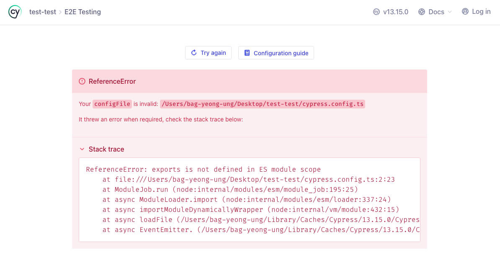
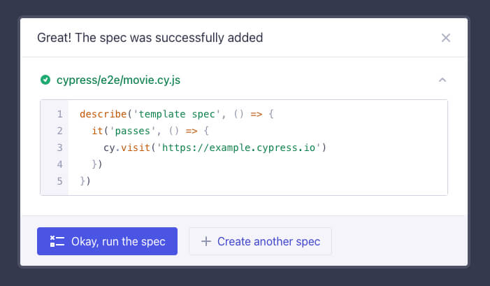

/// message-box --icon=info
이 글은 [Vite로 시작하는 React 프로젝트](/p/6iFzkB)를 기반으로 설명합니다.
///

React 프로젝트에서 테스트를 시작하는 기본적인 방법을 소개합니다. 
Vitest와 Testing Library를 사용한 단위 테스트, MSW를 활용한 API 모킹, 그리고 Cypress를 이용한 E2E 테스트의 핵심 개념과 간단한 예제를 통해 테스트 작성 방법을 이해해 봅니다.

## 단위 테스트

단위 테스트(유닛 테스트, Unit Test)란 상태나 함수, 모듈, 컴포넌트 등의 정의된 최소 단위들이 독립적으로 정상 동작하는지 확인하는 것을 말합니다.
이를 통해 프로그램 전체의 신뢰도를 향상하고 코드 리팩토링(Code Refactoring)의 부담을 줄일 수 있습니다.

- 정의된 최소 단위의 코드를 독립적으로 테스트합니다.
- 외부 의존성을 최소화하고 모의해서(Mocking) 테스트합니다.
- 빠르게 실행되며, 쉽게 자동화할 수 있습니다.
- 코드 변경 시 즉각적인 피드백을 제공합니다.
- 일반적으로 개발자가 직접 작성하고 관리합니다.

### 단위 테스트 이점

- 개발 초기에 문제점을 발견하여 수정 비용을 절감합니다.
- 변경사항의 영향을 즉시 확인할 수 있어 안정적인 개발이 가능합니다.
- 테스트 작성 과정에서 코드 구조와 설계가 자연스럽게 개선됩니다.(테스트하기 쉬운 코드는 대체로 잘 설계된 코드)
- 기능 변경이나 코드 개선 시 예상치 못한 부작용을 방지합니다.(모든 테스트 통과는 기존 기능의 정상 작동을 보장)
- 잘 작성된 단위 테스트는 실행 가능한 문서 역할을 합니다.(새로운 개발자가 시스템 동작을 빠르게 이해하는 데 도움)
- 단기적으로는 테스트 작성에 시간이 소요되지만, 장기적으로 버그 수정과 유지보수 시간을 줄여 전체 개발 속도를 향상시킵니다.

### Red-Green-Refactor

Red-Green-Refactor는 테스트 주도 개발(TDD, Test-Driven Development)의 핵심 사이클로, 테스트를 3단계로 나눠 반복적으로 수행하는 방법을 말합니다.

1. Red 단계: (아직 구현하지 않은 기능에 대한 )실패(Fail)하는 테스트를 작성합니다.
2. Green 단계: 최소한의 코드를 통해 품질보다 구현에 집중해서 빠르게 성공(Pass)하는 테스트를 작성합니다.
3. Refactor 단계: 가독성 향상, 중복 제거, 성능 최적화 등 코드를 개선합니다.

다음 예제는 실패하지만, 어떤 기능을 만들어야 하는지 알 수 있습니다.

/// message-box --icon=info
`describe` 함수는 테스트 그룹을 정의하고, `test` 함수는 테스트 케이스를 정의합니다.
`expect` 함수의 인수는 테스트 검증 대상이며, 체이닝으로 작성하는 메소드는 검증 방법을 정의합니다.
`toBe` 메소드는 값이 같은지 검증합니다.
///

```tsx --path=/src/add.ts
export function add() {}
```

```tsx --path=/src/__tests__/add.test.ts
import { add } from '../add'

describe('add', () => {
  test('1 더하기 2는 3이 돼야 합니다.', () => {
    expect(add(1, 2)).toBe(3)
  })
})
```


해당 기능을 만들어 다시 테스트를 하면, 테스트를 통과합니다.

```tsx --path=/src/add.ts
export function add(a: number, b: number) {
  return a + b
}
```


좀 더 간결하게 표현하도록 화살표 함수로 변경하고, 함수의 반환 타입을 명시할 수도 있습니다.

```tsx --path=/src/add.ts
export const add = (a: number, b: number): number => a + b
```

### Given-When-Then

Given-When-Then(혹은 Arrange-Act-Assert)은 테스트의 시나리오를 작성하는 방식으로, 테스트 코드를 준비 단계, 실행 단계 그리고 검증 단계로 나눠 코드의 가독성을 향상시키고 유지보수를 용이하게 합니다.

다음 예제는 Given-When-Then 패턴을 사용하는 테스트 코드입니다.
함수에 전달할 인수를 준비하고, 함수를 실행한 후, 결과를 검증합니다.

```tsx --path=/src/__tests__/add.test.ts
import { add } from '../add'

describe('add', () => {
  test('1 더하기 2는 3이 돼야 합니다.', () => {
    // Given(Arrange, 준비)
    const num1 = 1
    const num2 = 2

    // When(Act, 실행)
    const res = add(num1, num2)

    // Then(Assert, 검증)
    expect(res).toBe(3)
  })
})
```

### 테스트 도구


[Vitest](https://vitest.dev/)는 테스트 그룹(`describe`) 및 케이스(`test`), 검증, 테스트 러너(테스트 실행 및 결과 보고 등) 등을 제공하고, Vite 프로젝트와 완벽히 호환되는 테스트 프레임워크입니다.
[Jest API](https://jestjs.io/docs/api)를 대부분 사용할 수 있기 때문에, 이미 Jest 사용 경험이 있다면 보다 쉽게 이해하고 사용할 수 있습니다.


[Testing Library](https://testing-library.com/)는 사용자 중심의 테스트를 위한 간단하고 직관적인 테스트 유틸리티입니다.
”테스트가 소프트웨어 사용 방식과 유사할수록 테스트의 신뢰도가 높아집니다.” 라는 개발자의 말처럼, 실제 사용자의 행동을 모방하는 테스트 작성을 장려합니다.

### 테스트 환경 구성 w. Vitest, Testing Library

먼저 [Vite 프로젝트를 구성](/p/6iFzkB)한 후, 다음과 같이 필요한 패키지를 설치합니다.

```bash
npm i -D vitest jsdom @testing-library/react @testing-library/dom @testing-library/user-event @testing-library/jest-dom @types/jest
```

- __vitest__: Vite 기반의 빠르고 가벼운 유닛 테스트 프레임워크로, Jest와 유사한 API를 제공하면서도 Vite의 빠른 HMR(Hot Module Replacement)을 활용합니다.
- __jsdom__: 브라우저 환경을 Node.js에서 시뮬레이션하는 라이브러리로, 브라우저 없이도 DOM API를 활용해 테스트할 수 있습니다.
- __@testing-library/react__: React 컴포넌트를 테스트하기 위한 가벼운 유틸리티 함수 모음입니다.
- __@testing-library/dom__: DOM 노드를 테스트하기 위한 유틸리티 함수 모음으로, `@testing-library/react`의 기반이 되는 라이브러리입니다.
- __@testing-library/user-event__: 실제 사용자 이벤트를 시뮬레이션하는 유틸리티로, 키보드 입력이나 마우스 클릭 등 사용자 상호작용을 테스트할 수 있습니다.
- __@testing-library/jest-dom__: Jest의 expect 함수를 확장하여 DOM 관련 Matchers를 제공하며, `toBeInTheDocument()`, `toHaveTextContent()` 등의 DOM 특화 검증을 가능하게 합니다.
- __@types/jest__: Vitest(Jest)의 전역 함수를 import 없이 사용할 때, 타입 오류를 방지하기 위한 타입 정의입니다.

패키지 설치가 완료되면, 테스트 스크립트를 추가합니다.
터미널에서 `npm t`(`npm test`, `npm run test`)로 실행할 수 있습니다.

```json --path=/package.json
{
  "scripts": {
    "test": "vitest"
  }
}
```

다음으로 Vitest 구성을 추가합니다.

삼중 슬래시 지시자(Triple-slash directive, `///`)와 참조 태그(**`<reference />`**)를 통해 Vitest의 타입 정의를 포함해야 합니다.
`test.globals` 옵션은 테스트 파일의 전역 함수를 `import` 없이 사용할 수 있게 합니다.
`test.environment` 옵션은 테스트 환경을 지정합니다.
`test.setupFiles`는 테스트 전에 실행될 파일을 지정합니다.

```tsx --path=/vite.config.ts
/// <reference types="vitest" />
import { defineConfig } from 'vite'
import react from '@vitejs/plugin-react-swc'

// https://vitejs.dev/config/
export default defineConfig({
  plugins: [react()],
  test: {
    globals: true,
    environment: 'jsdom',
    setupFiles: ['setupTests.tsx']
  }
})
```

그리고 테스트 전에 실행될 내용을 추가할 수 있습니다.

`beforeEach` 함수로 각 테스트 케이스(`test` 함수) 실행 전에 수행할 작업을 정의할 수 있습니다.(`test.globals` 옵션을 통해, `beforeEach` 함수를 전역으로 사용할 수 있습니다.)
`cleanup` 함수는 React 컴포넌트를 정리하고 DOM을 초기화하는 역할을 합니다.
이를 통해 테스트 간의 독립성을 보장하고 이전 테스트가 다음 테스트에게 영향을 미치지 않도록 합니다.

```tsx --path=/setupTests.tsx
import { cleanup } from '@testing-library/react'

beforeEach(() => {
  cleanup()
})
```

### 첫 컴포넌트 테스트 코드 작성

아직 내용은 없지만, `MovieList` 컴포넌트에서 영화 목록을 출력하려고 합니다.

```tsx --path=/src/components/MovieList.tsx
export default function MovieList() {
  return <></>
}
```

처음으로 컴포넌트의 테스트 코드를 작성해 봅시다.
`render` 함수는 컴포넌트를 렌더링하고, `screen` 객체로 렌더링된 컴포넌트를 확인할 수 있습니다.
`getByText` 메소드는 특정 텍스트를 통해 요소를 찾아 반환합니다.
`toBeInTheDocument` 메소드는 `expect`의 반환 요소가 문서에 존재하는지 검증합니다.

/// message-box --icon=info
`MovieList.test.tsx`와 같이 `.test` 혹은 `.spec` 이름이 포함된 파일은 테스트 파일로 인식됩니다.
특정 파일을 테스트 파일로 인식되지 않게 하려면, [`test.exclude`](https://vitest.dev/config/#exclude) 옵션을 사용할 수 있습니다.
///

```tsx --path=/src/__tests__/MovieList.test.tsx
import { render, screen } from '@testing-library/react'
import '@testing-library/jest-dom'
import MovieList from '@/components/MovieList'

describe('MovieList', () => {
  test('영화 목록을 출력해야 합니다.', async () => {
    render(<MovieList />)
    expect(screen.getByText('Avengers: Infinity War')).toBeInTheDocument()
    expect(screen.getByText('Avengers: Endgame')).toBeInTheDocument()
  })
})
```

간단한 모의(가짜) 데이터(Mock Data)로 영화 목록을 출력합니다.

```tsx --path=/src/components/MovieList.tsx
import { useState } from 'react'

export interface Movie {
  id: string
  title: string
}

export default function MovieList() {
  const [movies] = useState<Movie[]>([
    { id: '1', title: 'Avengers: Infinity War' },
    { id: '2', title: 'Avengers: Endgame' }
  ])

  return (
    <>
      <h2>Movie List!</h2>
      {movies.map(movie => (
        <div key={movie.id}>{movie.title}</div>
      ))}
    </>
  )
}
```

### 렌더링 업데이트

검증을 위한 React 컴포넌트의 렌더링 후 업데이트를 수행하려면, `act` 함수를 사용할 수 있습니다. 
그러면 테스트 실행이 브라우저에서 React가 작동하는 방식과 더 가까워집니다.
특히, `useEffect`를 통해 실행되는 최초 비동기 호출을 테스트하는 경우에 유용합니다.

실제 영화 검색이 가능한 구조를 제공하기 위해, 다음과 같이 `fetchMovies` 함수를 추가하고 `useEffect` 콜백에서 호출합니다.
`useEffect`의 의존성 배열이 비어있기 때문에, `fetchMovies` 함수는 컴포넌트가 렌더링될 때 한 번만 호출되어 영화 목록을 초기화합니다.

```tsx --path=/src/components/MovieList.tsx --line-active=11-13,15
import { useEffect, useState } from 'react'

export interface Movie {
  id: string
  title: string
}

export default function MovieList() {
  const [movies, setMovies] = useState<Movie[]>([])

  useEffect(() => {
    fetchMovies()
  }, [])

  async function fetchMovies() {
    const movies = [
      { id: '1', title: 'Avengers: Infinity War' },
      { id: '2', title: 'Avengers: Endgame' }
    ]
    setMovies(movies)
  }

  return (
    <>
      <h2>Movie List!</h2>
      {movies.map(movie => (
        <div key={movie.id}>{movie.title}</div>
      ))}
    </>
  )
}
```

`useEffect`의 콜백에서 `fetchMovies` 비동기 함수가 완료되어야 영화 목록이 초기화되므로, `act` 함수를 사용하여 컴포넌트의 렌더링 후 업데이트를 기다려야 합니다.

/// message-box --icon=warning
`act` 함수의 인수는 비동기 함수여야 합니다.
`await act(async actFn)` 형태로 사용합니다.
///

```tsx --path=/src/__tests__/MovieList.test.tsx --line-active=8-10 --line-error=7
import { render, screen, act } from '@testing-library/react'
import '@testing-library/jest-dom'
import MovieList from '@/components/MovieList'

describe('MovieList', () => {
  test('영화 정보를 출력해야 합니다.', async () => {
    // render(<MovieList />)
    await act(async () => {
      render(<MovieList />)
    })
    expect(screen.getByText('Avengers: Infinity War')).toBeInTheDocument()
    expect(screen.getByText('Avengers: Endgame')).toBeInTheDocument()
  })
})
```

### 모의 작업

`MovieList` 컴포넌트가 실제 영화 목록을 출력하도록 API를 사용하는 구조로 다음과 같이 `Movie` 타입과 `fetchMovies` 함수를 수정합니다.
이제 실제 영화 목록을 잘 출력하지만, 컴포넌트 내부의 함수를 외부에서 테스트하기 어려운 구조입니다.

```tsx --path=/src/components/MovieList.tsx --line-active=4-5,16-17,25
import { useEffect, useState } from 'react'

export interface Movie {
  imdbID: string
  Title: string
}

export default function MovieList() {
  const [movies, setMovies] = useState<Movie[]>([])

  useEffect(() => {
    fetchMovies()
  }, [])

  async function fetchMovies() {
    const res = await fetch('https://omdbapi.com/?apikey=7035c60c&s=avengers')
    const { Search: movies } = await res.json()
    setMovies(movies)
  }

  return (
    <>
      <h2>Movie List!</h2>
      {movies.map(movie => (
        <div key={movie.imdbID}>{movie.Title}</div>
      ))}
    </>
  )
}
```

따라서 더 나은 테스트성과 재사용성을 위해 패칭 기능을 다음과 같이 모듈화합니다.
그러면 컴포넌트와 데이터 패칭 로직을 분리하므로, 각각 독립적으로 테스트할 수 있습니다.

```ts --path=/src/fetchers/movie.ts
export interface Movie {
  imdbID: string
  Title: string
}

export async function fetchMovies(title: string): Promise<Movie[]> {
  const res = await fetch(`https://omdbapi.com/?apikey=7035c60c&s=${title}`)
  const { Search } = await res.json()
  return Search
}
```

```tsx --path=/src/components/MovieList.tsx --line-active=2-3,9
import { useEffect, useState } from 'react'
import { fetchMovies } from '@/fetchers/movie'
import type { Movie } from '@/fetchers/movie'

export default function MovieList() {
  const [movies, setMovies] = useState<Movie[]>([])

  useEffect(() => {
    fetchMovies('avengers').then(setMovies)
  }, [])

  return (
    <>
      <h2>Movie List!</h2>
      {movies.map(movie => (
        <div key={movie.imdbID}>{movie.Title}</div>
      ))}
    </>
  )
}
```

테스트 환경에서는 실제 구현한 함수를 그대로 사용하기 어려운 경우가 많습니다.
예를 들어, 외부 API에 의존하는 함수는 네트워크 비용이 발생하고, 데이터베이스를 직접 조작한다면 테스트 실행 후 데이터베이스가 수정될 수 있습니다. 
또한, 복잡한 계산을 수행하는 함수는 실행 시간이 오래 걸려 테스트 속도를 저하시킬 수 있습니다.
이러한 외부 요인들은 테스트 자체에 집중하기 어렵게 만듭니다.

이런 상황에서 유용한 것이 바로 모의(Mock) 함수입니다.
모의 함수는 말 그대로 '가짜' 함수로, 개발자가 원하는 대로 조작할 수 있습니다.
네트워크 비용 없이 특정 결과를 즉시 반환하게 하거나, 의도적으로 에러를 발생시키거나, 함수가 몇 번 호출되었는지 감시하는 등 다양한 방식으로 활용할 수 있습니다.
이를 통해 테스트에 방해되는 요인을 최소화하고, 테스트하고자 하는 로직에만 온전히 집중할 수 있게 됩니다.

> [모의]: 실제의 것을 흉내 내어 그대로 해 봄.

`MovieList` 컴포넌트가 `@/fetchers/movie` 모듈에서 가져오는 `fetchMovies` 함수는 네트워크 요청을 통해야 영화 목록을 가져올 수 있는데, 해당 모듈이 반환하는 `fetchMovies` 함수를 모의 함수로 대체해서 모의 데이터를 반환하도록 만듭니다.
이렇게 모의 함수나 데이터를 만드는 것을 모의 작업(모킹, Mocking)이라 합니다.

`vi` 객체는 Vitest에서 제공하는 다양한 [유틸리티 기능](https://vitest.dev/api/vi.html)을 가지고 있습니다.
`vi.mock` 함수는 콜백의 반환 값으로 모듈을 대체합니다.
`vi.fn` 함수는 모의 함수를 생성하고, `mockResolvedValue` 메소드는 모의 함수의 비동기 반환 값을 지정합니다.

그리고 `MovieList` 컴포넌트를 렌더링하면, `fetchMovies` 함수가 모의 함수로 대체되어 모의 데이터를 반환합니다.

```tsx --path=/src/__tests__/MovieList.test.tsx --line-active=1,7-8,12-16
import { vi } from 'vitest'
import { render, screen, act } from '@testing-library/react'
import '@testing-library/jest-dom'
import MovieList from '@/components/MovieList'
import * as movie from '@/fetchers/movie'

vi.mock('@/fetchers/movie') // 모듈 모의 작업
const mockedMovie = vi.mocked(movie) // 실제 모듈의 타입에 맞게 모의 모듈 반환

describe('MovieList', () => {
  test('영화 정보를 출력해야 합니다.', async () => {
    // fetchMovies 함수 모의 작업
    mockedMovie.fetchMovies.mockResolvedValue([
      { imdbID: '1', Title: 'Avengers: Infinity War' },
      { imdbID: '2', Title: 'Avengers: Endgame' }
    ])
    await act(async () => {
      render(<MovieList />)
    })
    expect(screen.getByText('Avengers: Infinity War')).toBeInTheDocument()
    expect(screen.getByText('Avengers: Endgame')).toBeInTheDocument()
  })
})
```

모의 작업을 하지 않고, 다음과 같이 `vi.waitFor` 함수를 사용해 비동기 작업을 기다리는 것도 가능합니다.
그러나 이 방법은 네트워크 상태에 의존하기 때문에, 네트워크 상태가 정상적이지 않으면 비동기 작업이 완료되지 못하고 테스트가 실패할 수 있습니다.
따라서 외부 요인에 의존하는 테스트는 반드시 모의 작업을 통해 테스트 환경을 제어해야 합니다.

```tsx --path=/src/__tests__/MovieList.test.tsx --line-active=11
import { vi } from 'vitest'
import { render, screen, act } from '@testing-library/react'
import '@testing-library/jest-dom'
import MovieList from '@/components/MovieList'

describe('MovieList', () => {
  test('영화 정보를 출력해야 합니다.', async () => {
    await act(async () => {
      render(<MovieList />)
    })
    await vi.waitFor(() => {
      expect(screen.getByText('Avengers: Infinity War')).toBeInTheDocument()
      expect(screen.getByText('Avengers: Endgame')).toBeInTheDocument()
    })
  })
})
```

#### Mock Service Worker(MSW)


네트워크 요청/응답에 대한 모의 작업(Mocking)이 많은 경우, 이를 좀 더 쉽게 처리할 수 있는 방법이 있습니다.
Mock Service Worker(MSW)는 API Mocking 라이브러리로, 네트워크 요청을 가로채거나 관찰할 수 있으며 모의 응답을 반환합니다.
MSW를 사용하면 실제 API와 유사하게 테스트를 수행할 수 있어, 더욱 신뢰성 있는 테스트 결과를 얻을 수 있습니다.

```bash
npm i -D msw
```

`http.get` 메소드는 첫 번째 인수로 전달된 URL을 가로채고, 두 번째 콜백의 반환 값으로 응답을 반환합니다.
요청 종류(Request Method)에 따라서 `http.post`, `http.put`, `http.delete` 메소드 등을 사용할 수도 있습니다.
`HttpResponse.json` 메소드는 응답 본문을 JSON 형식으로 반환합니다.

```tsx --path=/src/__tests__/MovieList.test.tsx --line-active=2-3,7-10,22-26 --line-error=30-31
import { render, screen, act } from '@testing-library/react'
import { http, HttpResponse } from 'msw'
import { setupServer } from 'msw/node'
import MovieList from '@/components/MovieList'

describe('MovieList', () => {
  const server = setupServer() // 서버 생성
  beforeAll(() => server.listen()) // 모든 테스트 전에 서버 시작
  afterEach(() => server.resetHandlers()) // 각 테스트 후에 핸들러 재설정
  afterAll(() => server.close()) // 모든 테스트 후에 서버 종료

  test('영화 정보를 출력해야 합니다.', async () => {
    // OMDB API 응답 모의 작업
    const response = {
      Response: 'True',
      Search: [
        { imdbID: '1', Title: 'Avengers: Infinity War' },
        { imdbID: '2', Title: 'Avengers: Endgame' }
      ],
      totalResults: 2
    }
    server.use(
      http.get('https://omdbapi.com/', () => {
        return HttpResponse.json(response)
      })
    )
    await act(async () => {
      render(<MovieList />)
    })
    // expect(screen.getByText('Avengers: Infinity War').toBeInTheDocument()
    // expect(screen.getByText('Avengers: Endgame')).toBeInTheDocument()
    expect(screen.getByText(response.Search[0].Title)).toBeInTheDocument()
    expect(screen.getByText(response.Search[1].Title)).toBeInTheDocument()
  })
})
```

앞서 모듈화한 `fetchMovies` 함수도 MSW를 사용해 다음과 같이 테스트할 수 있습니다.

```tsx --path=/src/__tests__/movie.test.tsx --caption=모두 성공하는 테스트 케이스입니다.
import { http, HttpResponse } from 'msw' 
import { setupServer } from 'msw/node'
import { fetchMovies } from '@/fetchers/movie'

describe('fetchMovies', () => {
  const server = setupServer()
  beforeAll(() => server.listen())
  afterEach(() => server.resetHandlers())
  afterAll(() => server.close())

  test('영화를 성공적으로 가져옵니다.', async () => {
    const response = {
      Response: 'True',
      Search: [
        { imdbID: '1', Title: 'Avengers: Infinity War' },
        { imdbID: '2', Title: 'Avengers: Endgame' }
      ],
      totalResults: 2
    }
    server.use(
      http.get('https://omdbapi.com/', () => {
        return HttpResponse.json(response)
      })
    )

    const movies = await fetchMovies('avengers')
    expect(movies).toHaveLength(2)
    expect(movies[0]).toEqual(response.Search[0])
    expect(movies[1]).toEqual(response.Search[1])
  })

  test('영화를 가져오는데 실패합니다.', async () => {
    const response = {
      Error: 'Movie not found!',
      Response: 'False'
    }
    server.use(
      http.get('https://omdbapi.com/', () => {
        return HttpResponse.json(response)
      })
    )

    const movies = await fetchMovies('존재하지 않는 영화?!')
    expect(movies).toBeUndefined()
  })

  test('네트워크 오류가 발생합니다.', async () => {
    server.use(
      http.get('https://omdbapi.com/', () => {
        return HttpResponse.error()
      })
    )

    await expect(fetchMovies('avengers')).rejects.toThrow()
  })
})
```

### 사용자 이벤트

키보드 입력이나 마우스 클릭 등의 사용자의 상호작용을 시뮬레이션할 수 있습니다.
처음에 설치했던, `@testing-library/user-event` 라이브러리를 사용합니다.

영화 제목을 입력하고 엔터키를 누르면, 영화 목록을 출력하도록 `MovieList` 컴포넌트를 수정합니다.

```tsx --path=/src/components/MovieList.tsx --line-active=16-22
import { useEffect, useState } from 'react'
import { fetchMovies } from '@/fetchers/movie'
import type { Movie } from '@/fetchers/movie'

export default function MovieList() {
  const [movies, setMovies] = useState<Movie[]>([])
  const [title, setTitle] = useState('')

  useEffect(() => {
    fetchMovies('avengers').then(setMovies)
  }, [])

  return (
    <>
      <h2>Movie List!</h2>
      <input
        type="text"
        value={title}
        placeholder="영화 제목을 입력하세요!"
        onChange={e => setTitle(e.target.value)}
        onKeyDown={e => e.key === 'Enter' && fetchMovies(title).then(setMovies)}
      />
      {movies.map(movie => (
        <div key={movie.imdbID}>{movie.Title}</div>
      ))}
    </>
  )
}
```

`userEvent.setup` 함수는 사용자 이벤트를 시뮬레이션할 수 있는 객체를 반환합니다.
`user` 객체에서는 `click`, `dblClick`, `keyboard`, `type` 등의 여러 상호작용 메소드를 사용할 수 있습니다.
예를 들어, `type` 메소드는 텍스트 입력을 시뮬레이션합니다.
`type` 메소드의 첫 번째 인수로 텍스트를 입력할 요소를 전달하고, 두 번째 인수로 입력할 텍스트를 전달합니다.
입력할 텍스트에서 `{키이름}`을 사용하면, 키보드 입력을 시뮬레이션할 수 있습니다.

다음 예제에는 `영화 제목을 입력하세요!` 플레이스홀더가 있는 입력 요소에 텍스트를 입력하고, 엔터키를 누르는 것을 시뮬레이션합니다.

```tsx --path=/src/__tests__/MovieList.test.tsx --line-active=2,11,31-32
import { render, screen, act } from '@testing-library/react'
import userEvent from '@testing-library/user-event'
import { http, HttpResponse } from 'msw'
import { setupServer } from 'msw/node'
import MovieList from '@/components/MovieList'

describe('MovieList', () => {
  // ...

  test('영화 제목을 입력하고 엔터키를 누르면, 영화 목록을 출력합니다.', async () => {
    const user = userEvent.setup()
    const response = {
      Response: 'True',
      Search: [
        { imdbID: '1', Title: 'Batman Begins' },
        { imdbID: '2', Title: 'The Batman' }
      ],
      totalResults: 2
    }
    let requestUrl = ''
    server.use(
      http.get('https://omdbapi.com/', ({ request }) => {
        requestUrl = request.url
        return HttpResponse.json(response)
      })
    )
    await act(async () => {
      render(<MovieList />)
    })

    const searchInput = screen.getByPlaceholderText('영화 제목을 입력하세요!')
    await user.type(searchInput, 'batman{Enter}')

    expect(requestUrl).toBe(`https://omdbapi.com/?apikey=7035c60c&s=batman`)
  })
})
```

### 커버리지

커버리지(Coverage)는 테스트의 적용 범위를 말합니다.
커버리지 확인을 통해서 테스트가 프로젝트에서 얼만큼 적용되었는지 확인할 수 있습니다.

커버리지 확인을 위해서 다음과 같이 패키지를 설치합니다.

```bash
npm i -D @vitest/coverage-v8
```

패키지 설치가 완료되면, 커버리지 확인용 스크립트를 추가합니다.

```json --path=package.json --line-active=4
{
  "scripts": {
    "test": "vitest",
    "test:coverage": "vitest run --coverage"
  }
}
```

다음과 같이 스크립트를 실행하면 커버리지 결과를 확인할 수 있습니다.
앞서 `/src/components/MovieList.tsx` 파일과 `/src/fetchers/movie.ts` 파일의 테스트 코드를 작성했기 때문에 해당 파일들의 커버리지가 모두 100%로 표시되었습니다.
커버리지가 높으면 테스트가 적용된 범위가 넓고 그만큼 프로젝트의 신뢰성이 높아지는 것을 의미합니다. 
하지만 커버리지가 높다고 해서 반드시 모든 면에서 좋은 것은 아닙니다. 
잘못된 테스트 코드가 얼마든지 있을 수 있기 때문에, 테스트의 질과 효율성, 그리고 테스트 코드 작성에 드는 시간 등의 기회비용도 함께 고려해야 합니다.

```bash
npm run test:coverage
```


커버리지 결과표의 각 항목의 의미는 다음과 같습니다.

| 항목 | 설명 |
|---|---|
| Stmts(Statements) | 단순히 각 구문의 실행을 확인 |
| Branch | 조건문(If, Switch)의 각 분기 실행(가능한 모든 결과)을 확인 |
| Funcs(Functions) | 각 함수 호출을 확인 |
| Lines | 각 코드 라인의 실행을 확인 |
| Uncovered Line | 테스트를 통해 실행되지 않은 코드 라인을 표시 |

## E2E 테스트

E2E 테스트는 애플리케이션의 전체 흐름을 처음부터 끝까지 테스트하는 방법을 말합니다. 
단위 테스트가 함수나 컴포넌트 같은 최소 단위의 동작을 검증하는 것에 집중하는 반면, E2E 테스트는 실제 사용자의 관점에서 애플리케이션의 전체적인 기능과 성능을 검증합니다.
E2E 테스트의 목적은 애플리케이션이 의도한 대로 작동하는지 확인하고, 실제 사용 환경에서 발생할 수 있는 문제를 사전에 발견하는 것입니다.
이를 통해 애플리케이션의 품질과 신뢰성을 높일 수 있습니다.

- 실제 사용자가 애플리케이션을 사용하는 시나리오를 기반으로 테스트합니다.
- 프론트엔드부터 백엔드, 데이터베이스 등 프로젝트의 모든 구성 요소를 포함해 테스트합니다.
- 프로덕션 환경과 최대한 유사한 조건에서 테스트를 수행합니다.
- 여러 구성 요소 간의 상호작용과 데이터 흐름을 확인합니다.
- 반복적인 테스트를 자동화하여 효율성을 높일 수 있습니다.
- 개발자가 작성하기도 하지만, QA 엔지니어나 테스트 담당자가 작성하는 경우도 많습니다.

### E2E 테스트 이점

- 사용자 관점에서 전체 시스템의 동작을 확인할 수 있습니다.
- 여러 구성 요소 간의 상호작용에서 발생할 수 있는 문제를 찾아낼 수 있습니다.
- 전체 비즈니스 흐름이 의도대로 작동하는지 확인할 수 있습니다.
- 반복적인 테스트를 자동화하여 시간과 비용을 절약할 수 있습니다.
- 전체 시스템의 안정성과 신뢰성을 높일 수 있습니다.
- 다양한 브라우저, 디바이스, 운영 체제에서의 호환성을 확인할 수 있습니다.
- 테스트 시나리오가 시스템의 기능 명세 역할을 할 수 있습니다.

### 테스트 환경 구성 w. Cypress

Cypress는 여러 브라우저 환경에서 테스트를 진행할 수 있는 프레임워크입니다.
Cypress의 주요 특징은 다음과 같습니다.

- 테스트 코드 변경 시 자동으로 테스트를 다시 실행합니다.
- 요소가 표시될 때까지 자동으로 기다립니다.
- 테스트 실행 과정을 스냅샷과 비디오로 기록합니다.
- 필요한 경우, 네트워크 요청을 모의할 수 있습니다.
- 여러 브라우저에서 테스트를 실행할 수 있습니다.

```bash
npm i -D cypress
```

`cypress open` 명령으로 GUI 환경에서 테스트를 진행할 수 있습니다.
기본적인 테스트를 진행할 때 사용하는 명령입니다.

`cypress run` 명령으로 Headless 모드로 테스트를 진행하면, 테스트 결과를 확인할 수 있는 브라우저 창이 열리지 않습니다. 
시각적 피드백이 필요 없는 상황에서 테스트 실행 속도와 효율성을 높이는 데 도움이 되며, 다음과 같은 상황에서 유용합니다.

- CI/CD 파이프라인에서 자동화된 테스트를 실행할 때
- 서버 환경에서 GUI가 없는 경우
- 많은 수의 테스트를 빠르게 실행해야 할 때

```json --path=package.json
{
  "scripts": {
    "cy:open": "cypress open",
    "cy:run": "cypress run"
  }
}
```

패키지 설치와 스크립트 등록이 끝났으면, `npm run cy:open` 명령으로 GUI 환경에서 테스트를 시작합니다.
그러면 새로운 창이 열리면서 테스트 환경을 선택할 수 있습니다.
__'E2E Testing'__ 버튼을 선택합니다.


프로젝트에 자동으로 생성될 구성 파일을 목록으로 보여줍니다.
하단의 __'Continue'__ 버튼을 선택합니다.


만약 구성 파일을 생성하는 과정에서 다음과 같은 에러가 발생하면, 프로젝트 루트 경로에 `cypress.config.ts` 파일의 확장자를 `.js`로 변경해 보세요.([관련 이슈](https://github.com/cypress-io/cypress/issues/23552)가 있습니다)
그리고 화면에서 __'Try again'__ 버튼을 선택하거나 테스트를 종료하고 스크립트를 다시 실행해서 진행해 보세요.



정상적으로 구성 파일이 생성되면, 다음과 같이 테스트할 브라우저를 선택할 수 있습니다.
원하는 브라우저를 선택하고 __'Start E2E Testing in 브라우저'__ 버튼을 선택합니다.


처음에는 테스트 파일이 없으니, __'Create new spec'__ 버튼을 선택해서 새로운 테스트 파일을 생성합니다.


테스트 파일의 이름을 지정하고 __'Create spec'__ 버튼을 선택합니다.


단순히 `https://example.cypress.io/` 사이트로 접속하는 최소한의 테스트 코드가 포함되며, 파일이 생성됩니다.
__'Okay, run the spec'__ 버튼을 선택해서 마무리합니다.



기존에 작성한 `MovieList` 컴포넌트가 출력되는 페이지에서, 사용자가 접속하고 영화를 검색하는 시나리오를 테스트해 봅시다.
페이지 접속 시 기본 영화 목록이 올바르게 표시되는지, 검색 기능이 정상적으로 작동하는지 확인하는 테스트 코드를 작성합니다.
단위 테스트와는 달리 함수나 컴포넌트를 직접 가져와서 테스트하지 않고, 완성된 페이지에 접속해서 `cy.get` 함수로 요소를 찾고 화면의 내용을 확인하는 방식으로 테스트합니다.
`cy.wait` 함수를 사용하면 특정 시간 동안 기다릴 수 있어, 비동기 작업을 처리할 때 유용합니다.

```ts --path=/cypress/e2e/movie.cy.ts
describe('영화 목록 페이지', () => {
  beforeEach(() => {
    cy.visit('http://localhost:5173/')
  })

  it('페이지 접속 시 기본 영화 목록이 표시되어야 함.', () => {
    cy.wait(1000) // 영화 목록을 가져오기까지 1초 동안 기다림!
    cy.get('h2').should('contain', 'Movie List!') // <h2> 요소의 텍스트가 'Movie List!'이어야 함!
    cy.get('ul li').should('have.length.gt', 0) // <li> 요소가 1개 이상 있어야 함!
    cy.get('ul li').first().should('have.text', 'The Avengers') // 첫 번째 <li> 요소의 텍스트가 'The Avengers'이어야 함!
  })

  it('영화 제목 검색 시 해당 영화 목록이 표시되어야 함.', () => {
    cy.get('input[type="text"]').type('batman{Enter}') // 텍스트 입력 후 엔터키!
    cy.wait(1000)
    cy.get('ul li').should('have.length.gt', 0)
    cy.get('ul li').first().should('contain', 'Batman Begins')
  })
})
```

테스트 코드 작성이 끝나면, 화면에서 테스트를 진행할 파일을 선택합니다.


테스트를 실행하면 우측에서 실제 접속한 페이지를 확인할 수 있습니다. 
이 페이지에서 테스트 코드가 실행되며, 각 단계마다 테스트의 동작을 시각적으로 확인할 수 있습니다. 
테스트가 진행됨에 따라 좌측 패널에는 각 테스트 케이스의 성공 또는 실패 여부가 실시간으로 표시됩니다. 
이를 통해 테스트의 진행 상황을 쉽게 파악하고, 문제가 발생한 경우 빠르게 대응할 수 있습니다.


`cy.visit('http://localhost:5173/')`처럼 전체 URL을 사용할 수도 있지만, 하나의 사이트를 테스트한다면 `baseUrl` 속성을 사용해 기본 테스트 URL을 설정할 수 있습니다. 
이렇게 하면 테스트 코드가 많아지더라도 유지보수가 훨씬 쉬워집니다.
또한, 개발 환경과 프로덕션 환경에서 URL을 쉽게 전환할 수 있어 편리합니다.

`viewportWidth`와 `viewportHeight` 속성을 사용하면, 테스트 화면 크기를 설정할 수 있습니다.

```ts --path=/cypress.config.ts --line-active=5-7
import { defineConfig } from 'cypress'

export default defineConfig({
  e2e: {
    baseUrl: 'http://localhost:5173',
    viewportWidth: 1280,
    viewportHeight: 720,
    setupNodeEvents(on, config) {
      // implement node event listeners here
    }
  }
})
```

기본 URL을 설정했기 때문에, 이제 테스트 코드에서 전체 URL 대신 상대(하위) 경로만 사용하면 됩니다.

```ts --path=/cypress/e2e/movie.cy.ts --line-active=3
describe('영화 목록 페이지', () => {
  beforeEach(() => {
    cy.visit('/') // '/about', '/movies' 등
  })

  // ...
})
```

### 테스트 녹화

Cypress 구성에서 `video` 속성을 사용하면, Headless 모드로 테스트 실행 시 비디오 녹화를 자동으로 진행합니다.

```ts --path=/cypress.config.ts --line-active=5
import { defineConfig } from 'cypress'

export default defineConfig({
  e2e: {
    video: true,
    // ...
  }
})
```

```bash --caption=Run tests in headless mode
npm run cy:run
```


## 지속적인 통합

지속적 통합(CI, Continuous Integration) 구성으로, GitHub의 `main` 브랜치에 푸시하거나 PR을 생성할 때 자동으로 테스트를 실행할 수 있습니다. 
이를 통해 코드 변경 사항이 프로젝트의 안정성에 미치는 영향을 즉시 확인할 수 있으며, 개발 과정에서의 오류를 조기에 발견하고 수정할 수 있습니다.

```yml --path=/a.github/workflows/test.yml
# GitHub Action 이름 지정!
name: 테스트 실행!

# 이벤트 지정!
on:
  push:
    branches: [ "main" ]
  pull_request:
    branches: [ "main" ]

# 작업 지정!
jobs:
  test: # 작업 이름!
    runs-on: ubuntu-latest

    steps:
    - uses: actions/checkout@v4
    - name: Node.js 설정
      uses: actions/setup-node@v4
      with:
        node-version: '20'
        cache: 'npm'
    - name: 의존성 설치
      run: npm ci
    - name: 단위 테스트 실행
      run: npm test
    - name: Cypress 테스트 실행
      uses: cypress-io/github-action@v5
      with:
        start: npm run dev
        wait-on: 'http://localhost:5173'
    - name: Cypress 스크린샷 업로드
      uses: actions/upload-artifact@v3
      if: failure()
      with:
        name: cypress-screenshots
        path: cypress/screenshots
    - name: Cypress 비디오 업로드
      uses: actions/upload-artifact@v3
      if: failure()
      with:
        name: cypress-videos
        path: cypress/videos
```

