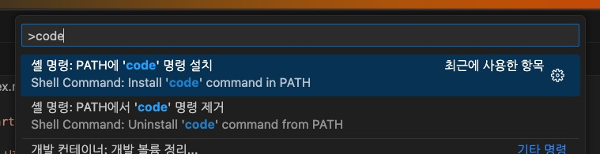
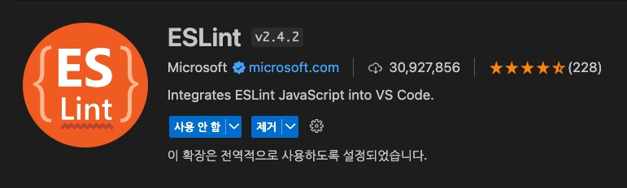
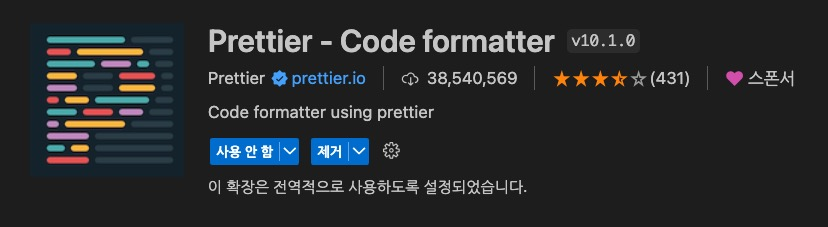
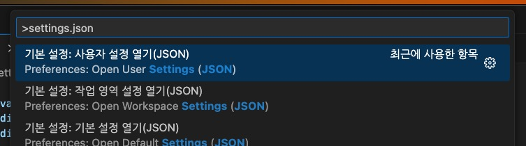

Vite.js 빌드 도구를 사용해 React 프로젝트를 시작하는 방법을 설명합니다.
자바스크립트와 타입스크립트 프로젝트에서의 구성을 구분하고 있습니다.

/// message-box --icon=info --color=success
Node.js 18버전, NPM 8버전 이상이 설치되어 있어야 합니다.
///

## Vite 프로젝트 생성

VS Code로 프로젝트 폴더를 열고 터미널에서 다음 명령을 순서대로 실행합니다.

```bash
# 현재 경로에 프로젝트 구성
npm create vite@latest .
  # > React 선택
  # > JavaScript + SWC 혹은 TypeScript + SWC 선택

# 의존성 패키지 설치
npm i
```

혹은. 터미널에서 프로젝트를 생성할 경로로 이동 후 다음 명령을 순서대로 실행합니다.

```bash
# 현재 경로에 프로젝트 폴더 생성 및 구성
npm create vite@latest <프로젝트_폴더_이름>
  # > React 선택
  # > JavaScript + SWC 혹은 TypeScript + SWC 선택

# 프로젝트 경로로 이동
cd <프로젝트_폴더_이름>

# 의존성 패키지 설치
npm i

# 현재 경로를 새로운 VS Code 창으로 열기
code .
# 혹은 현재 VS Code 창에서 열기
code . -r
# 혹은 수동으로 프로젝트 열기
```

/// message-box --icon=info --color=info
[SWC(Speedy Web Compiler)](https://swc.rs/)는 Rust 기반의 고성능 자바스크립트/타입스크립트 컴파일러입니다.
///

/// message-box --icon=info --color=info
`code` 명령은 다음 과정을 통해 설치 후 사용할 수 있습니다.
VS Code > 명령 팔레트(Ctrl(Cmd) + Shift + P) > `code` 검색 > `PATH에 'code' 명령 설치` 선택

///

```bash --caption=개발 서버 실행.
npm run dev
```

## ESLint + Prettier 구성

- [ESLint](https://marketplace.visualstudio.com/items?itemName=dbaeumer.vscode-eslint): 코드 품질 확인 및 버그, 안티패턴(Anti-pattern)을 감지
- [Prettier - Code formatter](https://marketplace.visualstudio.com/items?itemName=esbenp.prettier-vscode): 코드 스타일 및 포맷팅 관리, 일관된 코드 스타일을 적용 가능

### VS Code 확장 프로그램 설치

/// message-box --icon=warning --color=warning
이미 확장 프로그램을 설치한 경우, 이 단계는 생략하세요!
///

ESLint와 Prettier를 사용하기 위해 VS Code에서 각 확장 프로그램을 설치합니다.
설치 후에는 VS Code를 재시작하는 것이 좋습니다.

 



### 패키지 설치 및 구성

프로젝트에서 사용할 수 있도록, 각 의존성 패키지를 설치합니다.
각 패키지는 모두 런타임에서 필요치 않은 개발용이기 때문에, `-D` 플래그를 사용해 '개발 의존성 패키지(Dev Dependencies)'로 설치합니다.

```bash --caption=자바스크립트인 경우.
npm i -D eslint prettier eslint-plugin-react eslint-config-prettier eslint-plugin-prettier
```

```bash --caption=타입스크립트인 경우.
npm i -D eslint prettier eslint-plugin-react eslint-config-prettier eslint-plugin-prettier @typescript-eslint/eslint-plugin @typescript-eslint/parser
```

| 패키지 | 설명 | 비고 |
| --- | --- | --- |
| `eslint` | ESLint 코어 패키지 / 코드 품질 확인 및 버그, 안티패턴(Anti-pattern)을 감지 | |
| `prettier` | Prettier 코어 패키지 / 코드 스타일 및 포맷팅 관리, 일관된 코드 스타일을 적용 가능 | |
| `eslint-plugin-react` | React 지원 플러그인, 문법 분석 및 검사 지원 | |
| `eslint-config-prettier` | ESLint와 Prettier의 충돌 방지 | |
| `eslint-plugin-prettier` | Prettier 규칙을 ESLint 규칙으로 통합 | |
| `@typescript-eslint/eslint-plugin` | 타입스크립트 지원 플러그인 | |
| `@typescript-eslint/parser` | 타입스크립트 코드 분석 및 검사 지원 | |
| `eslint-plugin-react-hooks` | React Hooks 사용 규칙을 강제, 실수를 방지에 도움이 되는 규칙 제공 | Vite에 포함됨 |
| `eslint-plugin-react-refresh` | React Refresh 사용 규칙 제공 | Vite에 포함됨 |

설치가 완료되면, 프로젝트 루트 경로에 `.eslintrc.json` 파일을 생성하고 다음과 같이 내용을 추가합니다.

```json --path=/.eslintrc.json --line-active=5 --caption=자바스크립트인 경우.
{
  "extends": [
    "eslint:recommended",
    "plugin:react/recommended",
    "plugin:prettier/recommended"
  ],
  "plugins": [
    "react"
  ]
}
```

```json --path=/.eslintrc.json --line-active=6 --caption=타입스크립트인 경우.
{
  "extends": [
    "eslint:recommended",
    "plugin:@typescript-eslint/recommended",
    "plugin:react/recommended",
    "plugin:prettier/recommended"
  ],
  "plugins": [
    "react"
  ],
  "parserOptions": {
    "parser": "@typescript-eslint/parser"
  }
}
```

구성 파일이 `.eslintrc.json`이 아닌 `.eslintrc.cjs`인 경우, 다음과 같이 `extends` 옵션에 직접 내용을 추가합니다.

```cjs --path=/.eslintrc.cjs --line-active=9
// ...

export default tseslint.config(
  { ignores: ['dist'] },
  {
    extends: [
      js.configs.recommended,
      ...tseslint.configs.recommended,
      'plugin:prettier/recommended'
    ],
    // ...
  }
)
```

추가로, 프로젝트 루트 경로에 `.prettierrc` 파일을 생성하고 다음과 같이 내용을 추가합니다.
자세한 규칙은 [Prettier / Options](https://prettier.io/docs/en/options) 에서 확인할 수 있습니다.

```json --path=/.prettierrc
{
  "semi": false,
  "singleQuote": true,
  "singleAttributePerLine": true,
  "bracketSameLine": true,
  "endOfLine": "lf",
  "trailingComma": "none",
  "arrowParens": "avoid"
}
```

### 자동 포맷팅 설정

VS Code에서 자동 포맷팅을 사용하려면, 다음 옵션을 사용자 설정(`settings.json`)에 추가합니다.
같은 옵션을 중복 추가하지 않도록, 이미 설정되어 있는지 꼼꼼히 확인하세요.

```json
{
  "editor.codeActionsOnSave": {
    "source.fixAll.eslint": true
  }
}
```

사용자 설정(전역)은, 명령 팔레트에서 `settings.json`로 검색해 열 수 있습니다.



현재 프로젝트에서만 사용하는 사용자 설정(지역)을 통해 `*.jsx`, `*.tsx` 파일에 대한 자동 포맷팅을 사용할 수 있습니다.
프로젝트의 루트 경로에 `.vscode/settings.json` 폴더와 파일을 생성해 다음과 같이 내용을 추가할 수 있습니다.

```json --path=/.vscode/settings.json --caption=자바스크립트인 경우.
{
  "[javascript]": {
    "editor.formatOnSave": true,
    "editor.defaultFormatter": "esbenp.prettier-vscode"
  },
  "[javascriptreact]": {
    "editor.formatOnSave": true,
    "editor.defaultFormatter": "esbenp.prettier-vscode"
  }
}
```

```json --path=/.vscode/settings.json --caption=타입스크립트인 경우.
{
  "[javascript]": {
    "editor.formatOnSave": true,
    "editor.defaultFormatter": "esbenp.prettier-vscode"
  },
  "[javascriptreact]": {
    "editor.formatOnSave": true,
    "editor.defaultFormatter": "esbenp.prettier-vscode"
  },
  "[typescript]": {
    "editor.formatOnSave": true,
    "editor.defaultFormatter": "esbenp.prettier-vscode"
  },
  "[typescriptreact]": {
    "editor.formatOnSave": true,
    "editor.defaultFormatter": "esbenp.prettier-vscode"
  }
}
```

```json --path=/.vscode/settings.json --caption=Module S?CSS를 사용하는 경우.
{
  "[css]": {
    "editor.formatOnSave": true,
    "editor.defaultFormatter": "esbenp.prettier-vscode"
  },
  "[scss]": {
    "editor.formatOnSave": true,
    "editor.defaultFormatter": "esbenp.prettier-vscode"
  }
}
```

## 경로 별칭 구성

경로 별칭(Path Alias)을 사용하면, 프로젝트 내의 파일을 쉽게 참조할 수 있어 편리합니다.

```tsx --path=/vite.config.ts --line-active=7-12
import { defineConfig } from 'vite'
import react from '@vitejs/plugin-react'

// https://vitejs.dev/config/
export default defineConfig({
  plugins: [react()],
  resolve: {
    alias: [
      { find: '@', replacement: '/src' },
      { find: 'node_modules', replacement: '/node_modules' }
    ]
  }
})
```

이를 통해 복잡해질 수 있는 상대 경로를 사용하지 않고, 특정 경로 위치를 바로 참조할 수 있습니다.

```tsx --path=/src/components/a/b/c/MyComponent.tsx --line-active=2 --line-error=1 --caption=경로 별칭 사용 예시
// import type { Routes } from '../../../../routes'
import type { Routes } from '@/routes'
```

```scss --path=/src/components/a/b/c/MyComponent.module.scss --caption=경로 별칭 사용 예시
@import 'node_modules/swiper/scss';
@import 'node_modules/swiper/scss/autoplay';
```

타입스크립트에서도 경로 인식이 가능하도록, 다음과 같이 구성 옵션을 추가합니다.

```json --path=/tsconfig.json
{
  "compilerOptions": {
    // ...
    "baseUrl": ".",
    "paths": {
      "@/*": ["./src/*"],
      "node_modules/*": ["./node_modules/*"]
    }
  }
}
```

생성한 프로젝트의 `tsconfig.json` 파일에서 `tsconfig.app.json` 파일을 참조하는 경우, 해당 옵션을 `tsconfig.app.json` 파일에 추가합니다.

```json --path=/tsconfig.json --line-active=4
{
  "files": [],
  "references": [
    { "path": "./tsconfig.app.json" },
    { "path": "./tsconfig.node.json" }
  ]
}
```

```json --path=/tsconfig.app.json --line-active=5-10
{
  "compilerOptions": {
    // ...

    /* Path alias */
    "baseUrl": ".",
    "paths": {
      "@/*": ["./src/*"],
      "node_modules/*": ["./node_modules/*"]
    }
  }
}
```