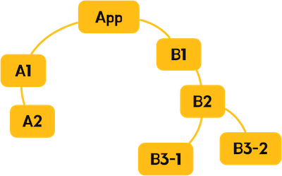
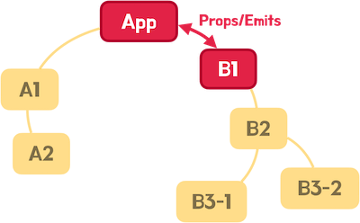
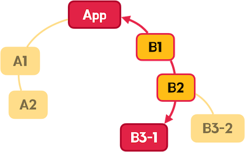
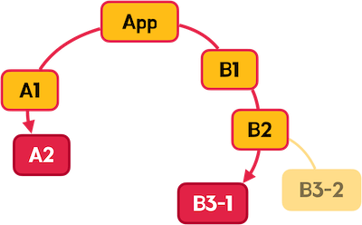
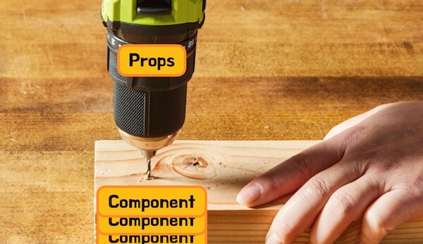
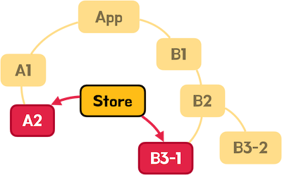
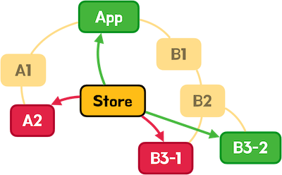
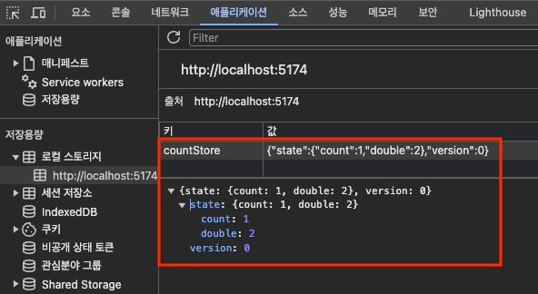
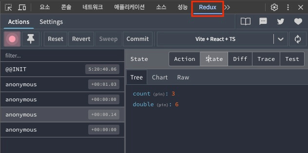

/// message-box --icon=info
이 글은 Zustand 5.0.3 버전을 기준으로 작성되었습니다.
///

다음은 v5의 주요 업데이트 내용입니다.

- React v18 이상 필요
- TypeScript v4.5 이상 필요
- UMD/SystemJS 지원 중단
- ES5 지원 중단
- 기본 내보내기(Default Export) 삭제
- Persist 미들웨어가 초기 상태를 바로 스토리지에 저장하지 않음
- `use-sync-external-store` 패키지가 피어 종속성으로 변경, 필요한 경우 직접 설치
- `setState`의 상태 대체(`replace`)가 더욱 엄격하게 동작

## 개요

[Zustand(주스탠드)](https://docs.pmnd.rs/zustand/getting-started/introduction)는 작고 빠르며 확장 가능한 React 프로젝트에서 사용하는 상태 관리(Store) 라이브러리입니다.

### 스토어란

스토어(Store)는 애플리케이션의 여러 상태(State)를 중앙에서 관리하는 패턴을 말합니다.(상태는 관리하는 데이터를 의미합니다)
이를 통해 컴포넌트 간 데이터를 쉽게 공유하고 데이터 변경을 감지해 자동으로 렌더링(반응성)할 수도 있습니다.

대부분의 애플리케이션은 다음과 같이, 최상위 컴포넌트(App)를 기준으로 하는 여러 하위 컴포넌트(A1, B1, B2 등)로 구성되어 있습니다.



만약 컴포넌트 간에 공유해야 하는 데이터가 있다면, 기본적으로 부모와 자식 컴포넌트 간 데이터 전달이 가능합니다.
그리고 이렇게 데이터를 전달하는 것을 Props(Emits) 방식이라고 부릅니다.



그런데 이러한 방식은 부모와 자식 관계 이상의 중첩된 컴포넌트 구조에서, 불필요하게 데이터를 취급하는 중간 단계의 컴포넌트가 생기고 그만큼 컴포넌트 간 결합도가 높아지며 유지/보수를 매우 어렵게 만듭니다.

다음 이미지에서, App 컴포넌트와 B3-1 컴포넌트 간 데이터를 공유하려면, 중간에 B1과 B2 컴포넌트를 거쳐야 하며,



더 나아가 다음과 같이 A2 컴포넌트와 B3-1 컴포넌트 간 데이터를 공유하려면, 훨씬 더 많은 중간 단계의 컴포넌트를 거쳐야 합니다.



이런 상황을, 속성(데이터)이 여러 컴포넌트를 관통하는 것 같다고 해서 'Prop Drilling'이라고 부릅니다.



그래서 우리는 스토어(Store)를 사용해, 컴포넌트 간 공유할 데이터를 중앙에서 관리할 수 있습니다.
이 방식은 데이터를 전달하는 중간 단계 컴포넌트가 필요치 않으므로, 컴포넌트 간 결합도를 낮추고 유지/보수를 쉽게 만듭니다.

다음 이미지에서 A2와 B3-1 컴포넌트 간 데이터는 스토어(Store)를 통해 공유하기 때문에, 다른 중간 단계 컴포넌트는 필요치 않습니다.





### 설치

기본 프로젝트 구성은 [React 프로젝트 시작하기 w. Vite](/p/6iFzkB)를 참고하세요.

다음과 같이 Zustand를 프로젝트에 설치합니다.

```bash
npm i zustand
```

### 기본 사용

`create` 함수로 스토어를 생성합니다.
`create` 함수의 콜백은 `set`, `get` 매개변수를 가지며, 이를 통해 상태를 변경하거나 조회할 수 있습니다.
`create` 함수의 콜백이 반환하는 객체에서의 속성은 상태(State)이고, 메소드는 액션(Action)이라고 부릅니다.
`create` 함수 호출에서 반환하는 스토어 훅(Hook)은, `useCountStore`와 같이 `use` 접두사와 `Store` 접미사로 명명해 각 컴포넌트에서 사용할 수 있습니다.

```ts --caption=스토어
import { create } from 'zustand'
export const use이름Store = create((set, get) => {
  return {
    상태: 초깃값,
    액션: 함수
  }
})
```

`set`, `get` 매개변수(함수)는 다음과 같이 각 액션에서 사용할 수 있습니다.
`get` 함수를 호출하면, 상태와 액션을 가진 스토어 객체(`state`)를 얻을 수 있습니다.
또한 `set` 함수를 호출(변경할 상태를 속성으로 포함한 객체를 전달)하면, 상태를 변경할 수 있습니다.

```ts --line-active=2,5-9
import { create } from 'zustand'
export const use이름Store = create((set, get) => {
  return {
    상태: 초깃값,
    액션: () => {
      const state = get()
      const { 상태 } = state
      set({ 상태: 상태 + 1 })
    }
  }
})
```

`set` 함수를 호출할 때 콜백을 사용하면, `get` 함수를 사용하지 않아도 바로 스토어 객체(`state`)를 얻을 수 있습니다.
변경할 상태를 속성으로 포함한 객체를 콜백에서 반환해야 합니다.

```ts --line-active=2,5-7
import { create } from 'zustand'
export const use이름Store = create(set => {
  return {
    상태: 초깃값,
    액션: () => {
      set(state => ({ 상태: state.상태 + 1 }))
    }
  }
})
```

컴포넌트에서 스토어 훅(`use이름Store`)을 가져와 호출하면, 상태와 액션을 가진 객체를 얻을 수 있습니다.
또한 상태는 반응형이기 때문에, 상태가 변경되면 컴포넌트가 다시 렌더링됩니다.

```tsx --line-active=3,4 --caption=컴포넌트 
import { use이름Store } from '~/store/스토어'
export default function 컴포넌트() {
  const 상태 = use이름Store(state => state.상태)
  const 액션 = use이름Store(state => state.액션)
  return (
    <>
      <h2>{상태}</h2>
      <button onClick={액션}>+</button>
    </>
  )
}
```

콜백 없이 스토어 훅을 호출하면 개별 상태나 액션이 아닌 스토어 객체를 얻을 수 있지만, 이는 사용하지 않는 상태가 변경돼도 컴포넌트가 다시 렌더링 되기 때문에 대부분은 권장하지 않는 방법입니다.

```tsx --line-error=3 --caption=권장하지 않는 방법
import { use이름Store } from '~/store/스토어'
export default function 컴포넌트() {
  const 스토어 = use이름Store()
  return (
    <>
      <h2>{스토어.상태}</h2>
      <button onClick={스토어.액션}>+</button>
    </>
  )
}
```

간단한 예제를 살펴보겠습니다.
기본적으로 프로젝트의 `store` 폴더에서 각 스토어를 생성합니다.
타입스크립트를 사용할 때는, `create` 함수의 제네릭으로 상태(State)와 액션(Action) 타입을 전달합니다.

```ts
create<타입>()
```

`get` 함수를 호출하면, 상태와 액션이 포함된 스토어 객체를 얻을 수 있습니다.
이를 통해, 각 액션에서 상태의 값을 얻을 수 있습니다.

```ts --path=/src/store/count.ts --caption=카운트를 관리하는 스토어
import { create } from 'zustand'

export const useCountStore = create<{
  count: number
  increase: () => void
  decrease: () => void
}>((set, get) => ({
  count: 1,
  increase: () => {
    const { count } = get()
    set({ count: count + 1 })
  },
  decrease: () => {
    const { count } = get()
    set({ count: count - 1 })
  }
}))
```

`get` 함수를 사용하지 않고, `set` 함수의 콜백을 사용하면 더 간결하게 상태를 변경할 수 있습니다.

```ts --path=/src/store/count.ts
import { create } from 'zustand'

export const useCountStore = create<{
  count: number
  increase: () => void
  decrease: () => void
}>(set => ({
  count: 1,
  increase: () => set(state => ({ count: state.count + 1 })),
  decrease: () => set(state => ({ count: state.count - 1 }))
}))
```

생성한 스토어를 다음과 같이 컴포넌트에서 사용할 수 있습니다.

```tsx --path=/src/App.tsx
import { useCountStore } from './store/count'

export default function App() {
  const count = useCountStore(state => state.count)
  const increase = useCountStore(state => state.increase)
  const decrease = useCountStore(state => state.decrease)
  return (
    <>
      <h2>{count}</h2>
      <button onClick={increase}>+1</button>
      <button onClick={decrease}>-1</button>
    </>
  )
}
```

### 액션 분리

만약 여러 컴포넌트에서 단일 스토어의 액션을 많이 사용한다면, 액션를 분리해 관리하는 패턴을 활용해 보세요.
다음과 같이 `actions` 객체 안에서 모든 액션을 관리하면, 각 컴포넌트에서 필요한 액션만 가져오기 쉽습니다.

```ts --path=/src/store/count.ts --line-active=5,11
import { create } from 'zustand'

export const useCountStore = create<{
  count: number
  actions: {
    increase: () => void
    decrease: () => void
  }
}>(set => ({
  count: 1,
  actions: {
    increase: () => set(state => ({ count: state.count + 1 })),
    decrease: () => set(state => ({ count: state.count - 1 }))
  }
}))
```

```tsx --path=/src/App.tsx --line-active=5
import { useCountStore } from './store/count'

export default function App() {
  const count = useCountStore(state => state.count)
  const { increase, decrease } = useCountStore(state => state.actions)
  return (
    <>
      <h2>{count}</h2>
      <button onClick={increase}>+1</button>
      <button onClick={decrease}>-1</button>
    </>
  )
}
```

### 상태 초기화

만약 상태를 초깃값으로 되돌리는 기능이 필요한 경우, 다음과 같이 `resetState` 함수를 추가해 사용할 수 있습니다.
액션을 제외한 상태만 초기화하는 것이니, 상태와 액션을 분리해서 타입과 초깃값을 작성합니다.

```ts  --path=/src/store/count.ts --line-active=28
import { create } from 'zustand'

interface State {
  count: number
  double: number
  min: number
  max: number
}
interface Actions {
  actions: {
    increase: () => void
    decrease: () => void
    resetState: () => void
  }
}

const initialState: State = {
  count: 1,
  double: 2,
  min: 0,
  max: 99
}
export const useCountStore = create<State & Actions>(set => ({
  ...initialState,
  actions: {
    increase: () => set(state => ({ count: state.count + 1 })),
    decrease: () => set(state => ({ count: state.count - 1 })),
    resetState: () => set(initialState)
  }
}))
```

전체 상태를 초기화하는 것에 더해 일부 상태도 초기화하려면, 다음과 같이 `resetState` 함수를 수정할 수 있습니다.

```ts  --path=/src/store/count.ts --line-active=13,28-38
import { create } from 'zustand'

interface State {
  count: number
  double: number
  min: number
  max: number
}
interface Actions {
  actions: {
    increase: () => void
    decrease: () => void
    resetState: (keys?: Array<keyof State>) => void
  }
}

const initialState: State = {
  count: 1,
  double: 2,
  min: 0,
  max: 99
}
export const useCountStore = create<State & Actions>(set => ({
  ...initialState,
  actions: {
    increase: () => set(state => ({ count: state.count + 1 })),
    decrease: () => set(state => ({ count: state.count - 1 })),
    resetState: keys => {
      // 전체 상태 초기화
      if (!keys) {
        set(initialState)
        return
      }
      // 일부 상태 초기화
      keys.forEach(key => {
        set(({ [key]: initialState[key] }))
      })
    }
  }
}))
```

다음과 같이 초기화 액션을 호출합니다.

```tsx --line-active=7,10
import { useCountStore } from './store/count'

export default function resetState() {
  const { resetState } = useCountStore(state => state.actions)
  return (
    <>
      <button onClick={() => resetState()}>
        Reset All!
      </button>
      <button onClick={() => resetState(['double', 'min'])}>
        Reset Double, Min!
      </button>
    </>
  )
}
```

### 상태 삭제

`set` 함수의 두 번째 인수(기본값 `false`)로 `true`를 전달하면, 상태를 병합하지 않고 덮어씁니다.
Lodash의 `omit` 함수는 특정 속성들을 제외한 새로운 객체를 반환합니다.
이를 조합하면, 특정 상태들을 삭제할 수 있습니다.

```bash
npm i lodash-es
npm i -D @types/lodash-es
```

```ts  --path=/src/store/count.ts --line-active=2,14,29-31
import { create } from 'zustand'
import { omit } from 'lodash-es'

interface State {
  count: number
  double: number
  min: number
  max: number
}
interface Actions {
  actions: {
    increase: () => void
    decrease: () => void
    deleteState: (keys: Array<keyof State>) => void
  }
}

const initialState: State = {
  count: 1,
  double: 2,
  min: 0,
  max: 99
}
export const useCountStore = create<State & Actions>(set => ({
  ...initialState,
  actions: {
    increase: () => set(state => ({ count: state.count + 1 })),
    decrease: () => set(state => ({ count: state.count - 1 })),
    deleteState: keys => {
      set((state) => omit(state, keys), true)
    }
  }
}))
```

다음과 같이 삭제할 상태 목록을 전달해 액션을 호출합니다.

```tsx --line-active=7
import { useCountStore } from './store/count'

export default function DeleteState() {
  const { deleteState } = useCountStore(state => state.actions)
  return (
    <>
      <button onClick={() => deleteState(['min', 'max'])}>
        Delete Min, Max!
      </button>   
    </>
  )
}
```

## 미들웨어

Zustand는 미들웨어(Middleware)라는 것을 사용해, 스토어의 추가 기능(타입 추론, 중첩 객체 변경 등)을 확장할 수 있습니다.
다중 미들웨어를 작성할 때는 일부 중첩 순서가 중요할 수 있습니다.

```ts
// 미들웨어 없이
create(콜백)

// 단일 미들웨어
import { 미들웨어 } from '미들웨어'
create(
  미들웨어(콜백)
)

// 다중 미들웨어
import { 미들웨어A } from '미들웨어A'
import { 미들웨어B } from '미들웨어B'
import { 미들웨어C } from '미들웨어C'
create(
  미들웨어A(
    미들웨어B(
      미들웨어C(콜백)
    )
  )
)

// 타입을 사용하는 경우
create(
  미들웨어A(
    미들웨어B(
      미들웨어C<타입>(콜백)
    )
  )
)
```

### 상태의 타입 추론 (Combine)

타입스크립트를 사용할 때, 상태 타입을 직접 작성하지 않고 추론하도록 `combine` 미들웨어를 사용할 수 있습니다.
`combine` 미들웨어는 첫 번째 인수로 추론할 상태를 받고, 두 번째 인수로 `set`, `get` 매개변수를 포함하는 액션 함수를 받습니다.

```ts
import { combine } from 'zustand/middleware'

const state = { ...상태 }
const actions = (set, get) => ({ ...액션 })
combine(state, actions)
```

앞서 살펴본 [상태 삭제](/p/n74Tgc#h3_상태_삭제) 예시에서 `combine` 미들웨어를 사용하면, 다음과 같이 작성할 수 있습니다.
다음 예제의 모든 상태는 숫자 타입(`number`)으로 추론합니다.

```ts --path=/src/store/count.ts
import { create } from 'zustand'
import { combine } from 'zustand/middleware'
import { omit } from 'lodash-es'

const initialState = {
  count: 1,
  double: 2,
  min: 0,
  max: 99
}
export const useCountStore = create(
  combine(
    initialState,
    set => ({
      actions: {
        increase: () => set(state => ({ count: state.count + 1 })),
        decrease: () => set(state => ({ count: state.count - 1 })),
        deleteState: (keys: Array<keyof typeof initialState>) => {
          set((state) => omit(state, keys), true)
        }
      }
    })
  )
)
```

추론 가능하지 않은 타입은 직접 작성해야 합니다.
[타입 만족(`satisfies`)](https://www.heropy.dev/p/WhqSC8#h3_타입_만족)이나 [타입 단언(`as`)](https://www.heropy.dev/p/WhqSC8#h3_타입_단언) 키워드를 활용해 타입을 작성하면 됩니다.

```ts --path=/src/store/user.ts --line-active=4-8,12 --line-error=11,27
import { create } from 'zustand'
import { combine } from 'zustand/middleware'

type User = {
  email: string
  displayName: string
  isValid: boolean
} | null

const initialState = {
  // user: {} satisfies User as User, // Error!
  user: null satisfies User as User,
  isLoggedIn: false
}

export const useUserStore = create(
  combine(
    initialState,
    set => ({
      actions: {
        login: () => {
          set({
            user: {
              email: 'thesecon@gmail.com',
              displayName: 'HEROPY',
              isValid: true,
              phone: 12345678 // Error!
            }
          })
        }
      }
    })
  )
)
```

#### 액션 호출 in 액션

액션 함수 내부에서 다른 액션을 호출할 때, `get()` 함수의 반환으로 액션을 가져와 호출할 수 있습니다.
하지만, `combine` 미들웨어를 사용하면, `get()` 함수가 액션 타입을 추론하지 못합니다.

다음 예제는 정상적으로 잘 동작하지만, 타입 에러가 발생합니다.

```ts --path=/src/store/count.ts --line-error=16
import { create } from 'zustand'
import { combine } from 'zustand/middleware'

const initialState = {
  count: 1,
  double: 2
}

export const useCountStore = create(
  combine(
    initialState,
    (set, get) => ({
      actions: {
        increase: () => {
          set(state => ({ count: state.count + 1 }))
          get().actions.increaseDouble() // Error - '{ count: number; double: number; }' 형식에 'actions' 속성이 없습니다.ts(2339)
        },
        increaseDouble: () => {
          set(state => ({ double: state.count * 2 }))
        }
      }
    })
  )
)
```

이를 해결하기 위해, 다음과 같이 액션을 별도 함수로 작성합니다.
그러면 함수 호이스팅을 활용하니, 액션 안에서 다른 액션을 쉽게 호출할 수 있습니다.

/// message-box --icon=info
현재 예제는 단순히 __'액션 호출 in 액션'__ 주제의 이해를 돕기 위해 작성되었습니다.
지금처럼 `double` 상태를 직접 변경하지 않고, `count` 상태의 변경을 감지해 `double` 상태의 값을 변경하는 방법은 [상태 구독](/p/n74Tgc#h3_%EC%83%81%ED%83%9C_%EA%B5%AC%EB%8F%85_subscribeWithSelector)에서 자세히 설명합니다.
///

```ts --path=/src/store/count.ts --line-active=9,16,17
// ...

export const useCountStore = create(
  combine(
    initialState,
    set => {
      function increase() {
        set(state => ({ count: state.count + 1 }))
        increaseDouble() // OK!
      }
      function increaseDouble() {
        set(state => ({ double: state.count * 2 }))
      }
      return {
        actions: {
          increase,
          increaseDouble
        }
      }
    }
  )
)
```


### 중첩된 객체 변경 (Immer)

다음 예시와 같이, `user` 객체(상태)에서 `displayName` 속성만 변경하는 액션을 작성할 수 있습니다.
여기서 `set` 함수는 상태 자체를 변경해야 하므로, 특정 객체에서 일부 속성만 변경하려면 새로운 객체를 할당하고 기존 속성은 복사해야 합니다.
그런데 만약 `user.relations[0].emails[0].domain`과 같이 다중 중첩 객체에서 특정 하위 속성을 변경하려면, 이러한 작업은 매우 복잡해집니다.

```ts --path=/src/store/user.ts --line-active=4-8,33-43
import { create } from 'zustand'

interface State {
  user: {
    email: string
    displayName: string
    isValid: boolean
  } | null
}
interface Actions {
  actions: {
    signIn: () => void
    setDisplayName: (name: string) => void
  }
}

const initialState: State = {
  user: null
}
export const useUserStore = create<State & Actions>(set => ({
  ...initialState,
  actions: {
    signIn: () => {
      set({
        user: {
          email: 'thesecon@gmail.com',
          displayName: 'HEROPY',
          isValid: true
        }
      })
    },
    setDisplayName: name => {
      set(state => {
        if (state.user) {
          return {
            user: {
              ...state.user,
              displayName: name
            }
          }
        }
        return {} // 병합할 상태, 상태 변경 없음!
      })
    }
  }
}))
```

Immer 미들웨어를 사용하면, 중첩된 객체 상태를 보다 쉽게 변경할 수 있습니다.
단, [Immer](https://immerjs.github.io/immer/) 라이브러리를 설치해야 합니다. 
이는 Zustand의 Immer 미들웨어를 사용하기 위해 설치해야 하는 피어 의존성(Peer Dependency)입니다.

```bash
npm i immer
```

다시 돌아와, Immer 미들웨어를 적용합니다.
이제 `set` 함수의 콜백에서 객체의 속성에 직접 접근해 값을 변경할 수 있으며, 병합할 상태 객체의 반환이 없어도 됩니다.
`user.relations[0].emails[0].domain = 'com'`과 같이 다중 중첩 객체의 속성도 쉽게 변경할 수 있습니다.

```ts --path=/src/store/user.ts --line-active=2,6,11-15
import { create } from 'zustand'
import { immer } from 'zustand/middleware/immer'

// ...
export const useUserStore = create(
  immer<State & Actions>(set => ({
    ...initialState,
    actions: {
      // ...
      setDisplayName: name => {
        set(state => {
          if (state.user) {
            state.user.displayName = name
          }
        })
      }
    }
  }))
)
```

앞서 살펴본 `combine`과 `immer` 미들웨어를 같이 사용하면, 다음과 예제와 같이 작성할 수 있습니다.

```ts --path=/src/store/count.ts --line-active=3,10,11,15,16
import { create } from 'zustand'
import { combine } from 'zustand/middleware'
import { immer } from 'zustand/middleware/immer'

const initialState = {
  count: 1,
  double: 2
}
export const useCountStore = create(
  immer(
    combine(
      initialState,
      set => ({
        actions: {
          increase: () => set(state => { state.count += 1 }),
          decrease: () => set(state => { state.count -= 1 })
        }
      })
    )
  )
)
```

### 상태 구독 (subscribeWithSelector)

스토어 훅에서 `subscribe` 함수를 사용하면, 스토어의 모든 상태 변경을 구독(상태를 감지해 리스너(Listener)를 호출)합니다.
그리고 `subscribe` 함수의 반환을 호출하면, 구독을 해제할 수 있습니다.

```ts
const listener = (newState, oldState) => {}
const unsubscribe = useCountStore.subscribe(listener)
unsubscribe() // 구독 해제
```

만약 모든 상태가 아닌 특정 상태 변경만 구독하려면, `subscribeWithSelector` 미들웨어를 사용합니다.
그러면 `subscribe` 함수는 선택자(Selector)와 리스너를 인수로 받을 수 있습니다.
선택자는 상태를 반환하는 함수를 말하며, 반환 값을 통해 어떤 상태를 구독할지 결정합니다.

```ts
const selector = state => state.구독할상태
const listener = (newValue, oldValue) => {}
const unsubscribe = useCountStore.subscribe(selector, listener)
unsubscribe() // 구독 해제
```

다음 예제는 `count` 상태를 구독해, `count` 상태가 변경될 때마다 `double` 상태를 변경하는 예제입니다.
일종의 계산된 상태(Computed State)를 관리할 수 있습니다.

```ts --path=/src/store/count.ts --line-active=2,10,25-32
import { create } from 'zustand'
import { combine, subscribeWithSelector } from 'zustand/middleware'
import { immer } from 'zustand/middleware/immer'

const initialState = {
  count: 1,
  double: 2
}
export const useCountStore = create(
  subscribeWithSelector(
    immer(
      combine(
        initialState,
        set => ({
          actions: {
            increase: () => set(state => { state.count += 1 }),
            decrease: () => set(state => { state.count -= 1 })
          }
        })
      )
    )
  )
)

// double getter
useCountStore.subscribe(
  state => state.count, // Selector
  count => { // Listener
    console.log(useCountStore.getState().double) // Getter
    useCountStore.setState(() => ({ double: count * 2 })) // Setter
  }
)
```

만약 단일 컴포넌트에서만 구독을 사용하는 경우, 다음과 같이 `useEffect` 훅을 사용해 구독을 시작하고 컴포넌트가 언마운트될 때 구독을 해제할 수 있습니다.

```tsx --path=/src/App.tsx --line-active=7-16,18-22
import { useEffect, useState } from 'react'
import { useCountStore } from './store/count'

export default function App() {
  const [double, setDouble] = useState(2)
  
  // 컴포넌트 언마운트 시 구독 해제
  useEffect(() => {
    const unsubscribe = useCountStore.subscribe(
      state => state.count,
      count => { setDouble(count * 2) }
    )
    return () => {
      unsubscribe()
    }
  }, [])

  // 컴포넌트 언마운트 시 구독 해제 (축약형)
  useEffect(() => useCountStore.subscribe(
    state => state.count,
    count => { setDouble(count * 2) }
  ), [])

  return <h2>{double}</h2>
}
```

### 스토리지 사용 (Persist)

Zustand는 `persist` 미들웨어를 사용해 스토리지에 상태를 저장하고 불러올 수 있습니다. 
이를 통해 페이지를 새로고침하거나 다시 방문했을 때에도 상태를 유지할 수 있습니다.

스토리지에 저장될 스토어의 고유한 이름을 필수 옵션(`name`)으로 제공해야 합니다.
또한 로컬 스토리지(`localStorage`)를 기본으로 사용하며, 필요하면 세션 스토리지(`sessionStorage`)나 커스텀 스토리지를 만들어 사용할 수도 있습니다.

기타 옵션은 [Zustand Persist Middleware(스토리지 사용)의 선택 옵션 정리](https://www.heropy.dev/s/70)에서 설명합니다.

/// message-box --icon=warning
JSON 형식으로 변환할 수 없는 상태는 저장할 수 없습니다.
[액션 분리](/p/n74Tgc#h3_액션_분리)에서 살펴본 `actions` 객체는 액션(함수)들만 가지므로, 단순히 빈 객체로 저장되어 각 액션(함수)을 사용할 수 없으니 주의합니다!
///

```ts --path=/src/store/count.ts --line-active=2,10,23-26 --line-error=16
import { create } from 'zustand'
import { combine, subscribeWithSelector, persist, createJSONStorage } from 'zustand/middleware'
import { immer } from 'zustand/middleware/immer'

const initialState = {
  count: 1,
  double: 2
}
export const useCountStore = create(
  persist(
    subscribeWithSelector(
      immer(
        combine(
          initialState,
          set => ({
            // actions: { // 스토리지(persist) 사용을 위해 제거!
            increase: () => set(state => { state.count += 1 }),
            decrease: () => set(state => { state.count -= 1 })
          })
        )
      )
    ),
    {
      name: 'countStore', // 스토리지에 저장될 고유한 이름!
      // storage: createJSONStorage(() => sessionStorage) // 기본값: localStorage
    }
  )
)
```



### 개발자 도구 (Devtools)

[Redux DevTools](https://chromewebstore.google.com/detail/redux-devtools/lmhkpmbekcpmknklioeibfkpmmfibljd)과 같이 Zustand의 상태를 모니터링할 수 있는 개발자 도구를 사용할 수 있습니다.
`devtools` 미들웨어를 사용하면, 개발자 도구가 활성화됩니다.

```ts --path=/src/store/count.ts --line-active=2,10
import { create } from 'zustand'
import { combine, subscribeWithSelector, persist, devtools } from 'zustand/middleware'
import { immer } from 'zustand/middleware/immer'

const initialState = {
  count: 1,
  double: 2
}
export const useCountStore = create(
  devtools(
    persist(
      subscribeWithSelector(
        immer(
          combine(
            initialState,
            set => ({
              increase: () => set(state => { state.count += 1 }),
              decrease: () => set(state => { state.count -= 1 })
            })
          )
        )
      ),
      { name: 'countStore' }
    )
  )
)
```


