## 기본 보간

`{ }`(중괄호)를 사용해 데이터를 속성/내용 등에 보간할 수 있습니다. 

[REPL에서 예제 보기 >](https://svelte.dev/repl/9517da43874346719d77658c1d5d9f32?version=3.29.4)

```svelte --path=App.svelte
<script>
  let href = 'https://heropy.blog'
  let name = 'Heropy'
  let value = 'New input value!'
  let isUpperCase = false
</script>

<!-- 속성과 내용의 단방향 연결 -->
<a {href}>{name}</a>

<!-- 입력 요소 양방향 연결 -->
<input 
  {value} 
  on:input={e => value = e.target.value} />

<!-- bind 지시어로 양방향 연결 -->
<input bind:value />

<!-- 표현식 -->
<div>{isUpperCase ? 'DIV' : 'div'}</div>
```

### 원시 HTML

기본 보간법은 데이터를 HTML이 아닌 일반 텍스트로 해석합니다.
실제 HTML을 출력하려면 `{@html}`를 사용해야 합니다.
단, 이는 [XSS 취약점](https://en.wikipedia.org/wiki/Cross-site_scripting)으로 이어질 수 있기 때문에, 신뢰할 수 있는 콘텐츠에서만 사용하세요!

[REPL에서 예제 보기 >](https://svelte.dev/repl/64013cecb696408bbf3d1c3b42274d4a?version=3.29.4)

```svelte --path=App.svelte
<script>
  let h1 = '<h1>Hello Heropy</h1>'
  let xss = '<iframe onload="alert(123)"></iframe>'
</script>

{@html h1}
{@html xss}
```

### 디버그

데이터가 변경되면 이를 감지해 로그를 작성합니다.
개발자 도구가 열려있는 경우엔 프로세스를 일시정시합니다.
HTML 구조에서 데이터 변경 감지를 작성할 때 유용하겠지만, 
개인적으로 자주 사용하고 있진 않습니다.

[REPL에서 예제 보기 >](https://svelte.dev/repl/9b819dbcaf0e4f21b48f49a0b05c939a?version=3.29.4)

```svelte --path=App.svelte
<script>
  let name = 'Heropy'
  let index = 0
</script>

{@debug index, name}
<h1 on:click={() => {index += 1}}>
  Hello {name}!
</h1>
```

## 반응성

### 할당

Svelte에서 반응성 갱신하려면 할당 연산자(`=`)를 사용해야 합니다!
`.push`나 `.splice` 같은 메소드 사용은 반응성을 갱신할 수 없습니다.

다음 예제에서 `user.numbers.push(3)`은 반응성이 갱신됩니다.
그러나 `assign` 함수에서 `user.name = 'Neo'`과 `user.depth.a = 'c'`를 제거하면 반응성은 갱신되지 않습니다.
이는 `user.name = 'Neo'`과 `user.depth.a = 'c'`가 동작하면서 각자 `user` 객체를 재할당하기 때문입니다.

[REPL에서 예제 보기 >](https://svelte.dev/repl/a19796ee05bc43a7b2aeb284ad01e00e?version=3.29.4)

```svelte --path=App.svelte
<script>
  let name = 'Heropy'
  let fruits = ['Apple', 'Banana', 'Cherry']
  let user = { 
    name: 'Heropy', 
    age: 85, 
    depth: { 
      a: 'b' 
    }, 
    numbers: [1, 2] 
  }
  let numbers = user.numbers
  let hello = 'world'
  
  function assign() {
    name = 'Neo'
  
    fruits.push('Orange') // ['Apple', 'Banana', 'Cherry', 'Orange']
    fruits = fruits
  
    user.name = 'Neo' // $$invalidate(2, user.name = "Neo", user)
    user.depth.a = 'c' // $$invalidate(2, user.depth.a = "c", user)
    user.numbers.push(3)
  
    numbers = numbers
  }
</script>

<button on:click={assign}>Assign!</button>

<h1>name: {name}</h1>
<h2>fruits: {fruits}</h2>
<h2>user name: {user.name} / {user.age}</h2>
<h2>user depth: {user.depth.a}</h2>
<h2>user numbers: {user.numbers}</h2>
<h2>numbers: {numbers}</h2>
<h2>{hello}</h2>
```

### 반응성 구문

`$:`은 Label 식별자(Identifier)가 `$`인 순수한 [자바스크립트 Label 구문](https://developer.mozilla.org/en-US/docs/Web/JavaScript/Reference/Statements/label)이며, 
Svelte는 이 구문에 <strong>특별한 의미를 부여하고 반응성을 자동으로 계측</strong>합니다.
`let` 선언을 사용하지 않는 것에 주의합시다.

데이터 변경이 아닌 반응성을 계측하는 것이기 때문에, 데이터의 변경이 즉각 반영되지 않습니다!
따라서 다음 예제와 같이 `tick` 라이프 사이클을 사용해 반응성을 기다릴 수 있습니다.

[REPL에서 예제 보기 >](https://svelte.dev/repl/2218611e49744987acec52df4ef3303f?version=3.29.4)

```svelte --path=App.svelte
<script>
  import { tick } from 'svelte'
  
  let count = 0
  $: double = count * 2
  
  async function assign() { 
    count += 1
    console.time('timer')
    await tick() // Wait for reactivity..
    console.timeEnd('timer') // 0.1~0.5ms
    console.log(double)
  }
</script>

<button on:click={assign}>Assign!</button>
<h2>{count}</h2>
<h2>{double}</h2>
```

#### 사용 패턴

다음 예제는 REPL에서 개발자 도구 콘솔을 꼭 확인해 보세요!

[REPL에서 예제 보기 >](https://svelte.dev/repl/f56ebc00bd2a49fbaae4943d036ed511?version=3.29.4)

```svelte --path=App.svelte --caption=콘솔을 확인해 보세요!
<script>
  let count = 0
  
  // 선언
  $: double = count * 2
  
  // 블록
  $: {
    console.log(count)
    console.log(double)
  }
  
  // 함수 실행
  $: count, log()  
  
  // 즉시 실행 함수(IIFE)
  $: count, (() => { 
    console.log('iife: Heropy') 
  })()
  
  // 조건문(If)
  $: if (count > 0) {
    console.log('if:', double)
  }
  
  // 반복문(For)
  $: for (let i = 0; i < 3; i += 1) {
    count
    console.log('for:', i)
  }
  
  // 조건문(Switch)
  $: switch (count) {
    case 1:
      console.log('switch: 1')
      break
    default:
      console.log('switch: default')
  }
  
  // 유효범위
  $: {
    function scope1() {
      console.log('scope1')
      function scope2() {
        console.log('scope2')
        function scope3() {
          console.log('scope3', count)
        }
        scope3()
      }
      scope2()
    }
    scope1()
  }
  
  function log() {
    console.log('fn: Heropy!')
  }
  function assign() {
    count += 1
  }
</script>

<button on:click={assign}>Assign!</button>
```

## 클래스와 스타일 

### 속성 바인딩

클래스와 스타일은 모두 기본 보간을 통해 데이터를 연결할 수 있습니다.
추가로 클래스는 `class` 지시어(Directive)를 제공하는데,
이를 통해 좀 더 단순한 문법으로 작성할 수 있습니다.

[REPL에서 예제 보기 >](https://svelte.dev/repl/90ae426e584a44069d9519ed7ac67ac4?version=3.29.4)

```svelte --path=App.svelte
<script>
  let active = false
  let color = 'tomato'
  let white = 'white'
  let letterSpacing = 'letter-spacing: 5px;'
</script>

<button on:click={() => {active = !active}}>
  Toggle!
</button>

<!-- <div class={active ? 'active' : ''}> -->
<div class:active={active}>
  Hello
</div>

<h2 style="
  background-color: {color}; 
  color: {white};
  {letterSpacing}">
  Heropy!
</h2>

<style>
  div {
    width: 120px;
    height: 200px;
    background: royalblue;
    border-radius: 10px;
    display: flex;
    justify-content: center;
    align-items: center;
    color: white;
    font-size: 20px;
    transition: .4s;
  }
  .active {
    width: 250px;
    background: tomato;  
  }
</style>
```

#### 사용 패턴

[REPL에서 예제 보기 >](https://svelte.dev/repl/9769c0776d6945b38eb45ac8abfb715f?version=3.29.4)

```svelte --path=App.svelte
<script>
  let active = true
  let valid = false
  let camelCase = true
  let color = {
    white: '#FFF',
    red: '#FF0000'
  }
  let bold = 'font-weight: bold;'
  
  function multiClass() {
    return 'active valid camel-case'
  }
</script>
 
<div class={active ? 'active' : ''}>
  3항 연산자 보간
</div>

<div class:active={active}>
  Class 지시어(Directive) 바인딩
</div>

<div class:active>
  Class 지시어 바인딩 단축 형태
</div>

<div 
  class:active
  class:valid
  class:camelCase
  class:camel-case={camelCase}>
  다중 Class 지시어 바인딩
</div>

<div class={multiClass()}>
  함수 실행
</div>

<div 
  class="style-binding"
  style="
    color: {color.white}; 
    background-color: {color.red}; 
    {bold}">
  스타일 바인딩
</div>
```

### 스타일 유효범위와 전역화 

Svelte 컴포넌트에서 작성하는 스타일을 더 쉽고 안전하게 관리할 수 있는 편리한 방법을 제공합니다.
`<style>`에 선언된 CSS는 기본적으로 해당 컴포넌트의 유효범위(Scoped)를 가집니다.
요소의 `class`속성에 Svelte-Hash가 추가됩니다.

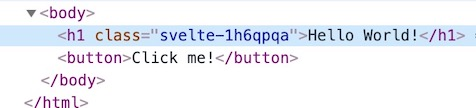
<div class="image-caption">Class 속성에 추가된 Svelte-Hash</div>

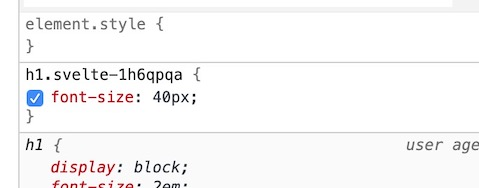
<div class="image-caption">Svelte-Hash가 적용된 선택자</div>

```svelte
<style>
  ul.container li.item {
    width: 100px;
  }
</style>
```

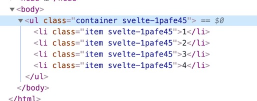
<div class="image-caption">일반 선택자 사용</div>

만약 유효범위 없이 선언하려면 `:global(선택자)` 수정자(Modifier)를 사용할 수 있습니다.

```svelte
<style>
  :global(ul.container li.item) {
    width: 100px;
  }
</style>
```

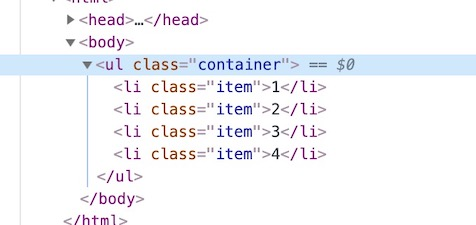
<div class="image-caption">:global() 사용</div>

### @keyframes 전역화

컴포넌트에서 정의한 Keyframes 규칙 또한 Svelte-Hash가 적용됩니다.
규칙 이름 앞에 `-global-` 수식어를 작성해 Keyframes 규칙을 전역화할 수 있습니다. 

[REPL에서 예제 보기 >](https://svelte.dev/repl/88c30c43aa49483199748090dc662f31?version=3.29.4)

```svelte --path=App.svelte
<div class="box"></div>

<style>
  :global(body) {
    padding: 50px;  
  }
  .box {
    width: 100px;Class & Style Binding: Pattern
    height: 100px;
    background: tomato;
    animation: zoom .4s infinite alternate;
  }
  /* -global- */
  @keyframes -global-zoom {
    0% {
      transform: scale(1);
    }
    100% {
      transform: scale(1.5);
    }
  }
</style>
```

## 요소 바인딩

### 일반 요소

DOM에서 검색하지 않아도 `bind:this`를 통해 바로 요소를 참조할 수 있습니다.

화면에 없던 요소를 데이터를 통해 출력하고 참조하기 위해, 
데이터가 변경되고 화면이 갱신될 때까지 기다리도록 `tick` 라이플 사이클을 사용할 수 있습니다. 

[REPL에서 예제 보기 >](https://svelte.dev/repl/76a65cdbd14f40a5818ab327c7b3105b?version=3.29.4)

```svelte --path=App.svelte
<script>
  import { tick, onMount } from 'svelte'
  
  let isShow = false
  let inputEl
  
  async function toggle() {
    isShow = !isShow
    await tick()
    // const inputEl = document.querySelector('input')
    console.log(inputEl)
    inputEl && inputEl.focus()
  }
</script>

<button on:click={toggle}>Edit!</button>
{#if isShow}
  <input bind:this={inputEl} />
{/if}
```

### 입력 요소

입력 요소는 기본적으로 `value` 속성을 통해 데이터를 연결(바인딩)하며, 많은 경우 양방향 데이터 연결을 위해 `bind` 지시어를 사용합니다.(`bind:value`)
Svelte에서는 'checkbox' 타입을 위해 `bind:checked`를, 
'radio' 타입 등의 여러 입력 요소를 위해 `bind:group`을 제공합니다.
아래 예제를 통해 다양한 사용 패턴을 확인하세요!

[REPL에서 예제 보기 >](https://svelte.dev/repl/3aca814fe08e49f08a42a7db3baed19a?version=3.29.4)

```svelte --path=App.svelte
<script>
  let text = ''
  let number = 3
  let checked = false
  let fruits = ['Apple', 'Banana', 'Cherry']
  let selectedFruits = []
  let group = 'Banana'
  let textarea = ''
  let select = 'Banana'
  let multipleSelect = ['Banana', 'Cherry']
</script>

<!-- let text = '' -->
<section>
  <h2>Text</h2>
  <input type="text" bind:value={text} />
</section>

<!-- let number = 3 -->
<section>
  <h2>Number/Range</h2>
  <div>
    <input type="number" bind:value={number} min="0" max="10" />
  </div>
  <div>
    <input type="range" bind:value={number} min="0" max="10" />
  </div>
</section>

<!-- let checked = false -->
<section>
  <h2>Checkbox</h2>
  <input type="checkbox" bind:checked={checked} /> Agree?
  <label>
    <input type="checkbox" bind:checked={checked} /> Agree?(label wrapping)
  </label>
</section>

<!-- let fruits = ['Apple', 'Banana', 'Cherry'] -->
<!-- let selectedFruits = [] -->
<section>
  <h2>Checkbox 다중 선택</h2>
  <strong>Selected: {selectedFruits}</strong>
  {#each fruits as fruit}
    <label>
      <input type="checkbox" value={fruit} bind:group={selectedFruits} />
      {fruit}
    </label>
  {/each}
</section>

<!-- let group = 'Banana' -->
<section>
  <h2>Radio</h2>
  <!--
  <input type="radio" value="Apple" name="my radio" />
  <input type="radio" value="Banana" name="my radio" />
  <input type="radio" value="Cherry" name="my radio" />
  -->
  <strong>Selected: {group}</strong>
  <label>
    <input type="radio" value="Apple" bind:group={group} /> Apple
  </label>
  <label>
    <input type="radio" value="Banana" bind:group={group} /> Banana
  </label>
  <label>
    <input type="radio" value="Cherry" bind:group={group} /> Cherry
  </label>
</section>

<!-- let textarea = '' -->
<section>
  <h2>Textarea</h2>
  <pre>{textarea}</pre>
  <textarea bind:value={textarea} />
</section>

<!-- let select = 'Banana' -->
<section>
  <h2>Select 단일 선택</h2>
  <strong>Seleced: {select}</strong>
  <div>
    <select bind:value={select}>
      <option disabled value="">Please select one!</option>
      <option>Apple</option>
      <option>Banana</option>
      <option>Cherry</option>
    </select>
  </div>
</section>

<!-- let multipleSelect = ['Banana', 'Cherry'] -->
<section>
  <h2>Select 다중 선택(Multiple)</h2>
  <strong>Seleced: {multipleSelect}</strong>
  <div>
    <select multiple bind:value={multipleSelect}>
      <option disabled value="">Please select one!</option>
      <option>Apple</option>
      <option>Banana</option>
      <option>Cherry</option>
    </select>
  </div>
</section>
```

### 편집 가능 요소

Svelte는 [Contenteditable(내용 수정이 가능한)](https://developer.mozilla.org/ko/docs/Web/HTML/Global_attributes/contenteditable) 요소에 연결할 수 있는, `innerHTML`과 `textContent` 속성을 제공합니다.
Contenteditable 요소도 하나의 입력 요소이기 때문에 `bind` 지시어를 통해서 양방향으로 데이터를 연결합니다.

[REPL에서 예제 보기 >](https://svelte.dev/repl/6a5a459c443844a3a15d16b33076396b?version=3.29.4)

```svelte --path=App.svelte
<script>
  let innerHTML = ''
  let textContent = 'Hello world!'
</script>

<div 
  contenteditable 
  bind:innerHTML
  bind:textContent>
  Hello world!
</div>
  
<div>{innerHTML}</div>
<div>{textContent}</div>
<div>{@html innerHTML}</div>

<style>
  div {
    border: 1px solid red;
    margin-bottom: 10px;
  }
</style>
```

## 조건 블록

If 조건에 따라 블록을 렌더링합니다.
조건이 true를 반환할 때만 렌더링 됩니다.

기본 형태는 다음과 같습니다.

```svelte
<script>
  let age = 90
</script>

{#if age > 70}
  <div>The old man!</div>
{/if}
```

### 사용 패턴

시작 블록은 `#`을,
중간 블록은 `:`을,
종료 블록은 `/`를 사용합니다. 

[REPL에서 예제 보기 >](https://svelte.dev/repl/7d2cffd5f49a4b279cfe720c96f51798?version=3.29.4)

```svelte --path=App.svelte
<script>
  let count = 0
</script>

<button on:click={() => { count += 1}}>증가!</button>
<button on:click={() => { count -= 1}}>감소!</button>

<h2>{count}</h2>

<section>
  <h2>if</h2>
  {#if count > 3}
    <div>count &gt; 3</div>
  {/if}
</section>

<section>
  <h2>if else</h2>
  {#if count > 3} 
    <div>count &gt; 3</div>
  {:else}
    <div>count &lt;= 3</div>
  {/if}
</section>

<section>
  <h2>if else if</h2>
  {#if count > 3}
    <div>count &gt; 3</div>
  {:else if count === 3}
    <div>count === 3</div>
  {:else}
    <div>count &lt; 3</div>
  {/if}
</section>

<section>
  <h2>다중 블록</h2>
  {#if count > 3}
    {#if count === 5}
      count === 5
    {:else}
      count &gt; 3
    {/if}
  {/if}
</section>

<style>
  section {
    border: 1px solid orange;
    margin-bottom: 10px;
    padding: 10px;
  }
  h2 {
    margin: 0;
    margin-bottom: 10px;
  }
</style>
```

## 반복 블록

Each 반복 블록은 배열 데이터를 기반으로 렌더링합니다.

기본 형태는 다음과 같습니다.

```svelte
<script>
  let fruits = ['Apple', 'Banana', 'Cherry']
</script>

{#each fruits as fruit}
  <div>{fruit}</div>
{/each}
``` 

### key

Svelte는 할당을 통해 반응성을 갱신하므로 반복 데이터 자체가 갱신되면 목록 전체가 다시 렌더링 됩니다.
이떄 Svelte가 변경되지 않은 데이터의 항목을 다시 렌더링하지 않도록 식별 가능한 고유 Key를 제공하는 것이 중요합니다. 
Key는 고유해야 합니다!

사용할 데이터 구조가 Key로 사용할 고유한 값을 가지도록 설계하는 것이 좋습니다. 
다음 예제의 출력 이름에 `Apple`이 중복되고 있지만, 
`id` 속성으로 식별 가능한 고유 Key를 제공했기 때문에 문제없이 동작합니다.

[REPL에서 예제 보기 >](https://svelte.dev/repl/552c012ffff549c3ba4a136f5dcc08db?version=3.29.4)

```svelte --path=App.svelte
<script>
  let fruits = [
    { id: '1', name: 'Apple' },
    { id: '2', name: 'Banana' },
    { id: '3', name: 'Cherry' },
    { id: '4', name: 'Apple' }
  ]

  function deleteFirst() {
    fruits = fruits.slice(1) // ['Banana', 'Cherry', 'Orange']
  }
</script>

<button on:click={deleteFirst}>
  Delete first fruit!
</button>

<ul>
  {#each fruits as fruit (fruit.id)}
    <li>{fruit.name}</li>
  {/each}
</ul>
```

### 사용 패턴

시작 블록은 `#`을,
중간 블록은 `:`을,
종료 블록은 `/`를 사용합니다. 

[REPL에서 예제 보기 >](https://svelte.dev/repl/b1f53749f8014e9c82fb8ea7d5d26825?version=3.29.4)

```svelte --path=App.svelte
<script>
  let fruits = [
    { id: 1, name: 'Apple' },
    { id: 2, name: 'Banana' },
    { id: 3, name: 'Cherry' },
    { id: 4, name: 'Apple' },
    { id: 5, name: 'Orange' }
  ]
  let todos = []
  let fruits2D = [
    [1, 'Apple'], 
    [2, 'Banana'], 
    [3, 'Cherry'], 
    [4, 'Orange']
  ]
  let user = {
    name: 'Heropy',
    age: 85,
    email: 'thesecon@gmail.com'
  }
</script>

<section>
  <h2>기본</h2>
  <!-- {#each 배열 as 속성} {/each} -->
  {#each fruits as fruit}
    <div>{fruit.name}</div>
  {/each}
</section>

<section>
  <h2>순서(index)</h2>
  <!-- {#each 배열 as 속성, 순서} {/each} -->
  {#each fruits as fruit, index}
    <div>{index} / {fruit.name}</div>
  {/each}
</section>

<section>
  <h2>아이템 고유화(key)</h2>
  <!-- {#each 배열 as 속성, 순서 (키)} {/each} -->
  {#each fruits as fruit, index (fruit.id)}
    <div>{index} / {fruit.name}</div>
  {/each}
</section>

<section>
  <h2>빈 배열 처리(else)</h2>
  <!-- {#each} {:else} {/each} -->
  {#each todos as todo (todo.id)}
    <div>{todo.name}</div>
  {:else}
    <div>아이템이 없어요!</div>
  {/each}
</section>

<section>
  <h2>구조 분해(destructuring)</h2>
  <!-- {#each 배열 as {id, name}} {/each} -->
  {#each fruits as {id, name} (id)}
    <div>{name}</div>
  {/each}
</section>

<section>
  <h2>2차원 배열</h2>
  <!-- {#each 배열 as [id, name]} {/each} -->
  {#each fruits2D as [id, name] (id)}
    <div>{name}</div>
  {/each}
</section>

<section>
  <h2>나머지 연산자(rest)</h2>
  <!-- {#each 배열 as {id, ...rest}} {/each} -->
  {#each fruits as {id, ...rest} (id)}
    <div>{rest.name}</div>
  {/each}
</section>

<section>
  <h2>객체 데이터</h2>
  {#each Object.entries(user) as [key, value] (key)}
    <div>{key}: {value}</div>
  {/each}
</section>

<style>
  section {
    border: 1px solid orange;
    margin-bottom: 10px;
    padding: 10px;
  }
  h2 {
    margin: 0;
  }
</style>
```

## 키 블록

키 블록은 연결된 데이터가 변경되면 블록 안의 내용을 화면에 다시 렌더링합니다.
블록 안에서 Svelte 컴포넌트를 사용하는 경우,
컴포넌트가 다시 초기화되고 연결(Mount)됩니다.

[REPL에서 예제 보기 >](https://svelte.dev/repl/454f0523049045e39dd647bac3c5fe05?version=3.31.0)

```svelte --path=App.svelte
<script>
  import Count from './Count.svelte'
  let reset = false
</script>

{#key reset}
  <Count />
{/key}

<button on:click={() => reset = !reset}>
  Reset!
</button>
```

```svelte --path=Count.svelte
<script>
  let count = 0
  setInterval(() => {
    count += 1
  }, 1000)
</script>

<h1>
  {count}
</h1>
```

## 비동기 블록

Await 비동기 블록은 [Promise 객체](https://developer.mozilla.org/ko/docs/Web/JavaScript/Reference/Global_Objects/Promise)를 사용해서 비동기 코드를 다음 상태로 분기할 수 있습니다.

- 대기(pending): '이행'하거나 '거부'되지 않은 초기 상태.
- 이행(fulfilled): 연산이 성공적으로 완료됨.
- 거부(rejected): 연산이 실패함.

다음의 간단한 영화 검색 예제를 테스트하기 위해 [OMDb API](http://www.omdbapi.com/)에서 API키를 무료로 발급받으세요.

[REPL에서 예제 보기 >](https://svelte.dev/repl/6f025fe7d28441c9a8267a6be38ea8f9?version=3.29.4)

```svelte --path=App.svelte
<script>  
  // Svelte REPL에서는 npm install을 사용할 수 없어요...
  // 자바스크립트 fetch 함수를 사용해도 되지만, 사용법이 일부 다릅니다.
  // VS Code에서는 Axios 모듈을 다음과 같이 설치하세요!!
  // npm i -D axios
  // import axios from 'axios'
  import axios from 'https://unpkg.com/axios/dist/axios.min.js'

  // http://www.omdbapi.com/apikey.aspx에서 API키를 무료로 발급 받을 수 있습니다.
  // 발급 받은 API키를 입력하고 테스트해 보세요!
  // 무료 API는 하루 1000개 데이터 제한이 있어요.
  let apikey = 'ENTER_YOUR_API_KEY'
  
  let title = ''
  // let promise = new Promise(resolve => resolve([]))
  let promise = Promise.resolve([])

  function searchMovies() {
    return new Promise(async (resolve, reject) => {
      try {
        const res = await axios(`https://www.omdbapi.com/?apikey=${apikey}&s=${title}`)
        console.log(res)
        resolve(res.data.Search)
      } catch (err) {
        console.log(err)
        reject(err)
      } finally {
        console.log('Done!')
      }
    })
  }
</script>

<input bind:value={title} />
<button on:click={() => promise = searchMovies()}>검색!</button>

{#await promise}
  <!-- pending(대기) -->
  <p style="color: royalblue;">loading...</p>
{:then movies}
  <!-- fulfilled(이행) -->
  <ul>
    {#each movies as movie}
      <li>{movie.Title}</li>
    {:else}
      <li>검색된 결과가 없어요...</li>
    {/each}
  </ul>
{:catch err}
  <!-- rejected(거부) -->
  <p style="color: red;">{err.message}</p>
{/await}
```

## 사용자 입력 핸들링

`on` 지시어를 사용해 DOM 이벤트를 작성합니다.

기본 형태는 다음과 같습니다.

```svelte
<script>
  let count = 0
</script>

<button on:click={() => count += 1}>
  Click me!
</button>

<h1>{count}</h1>
```

### 다중 이벤트 핸들러

한 요소에 같은 이벤트를 여러 개 연결할 수 있습니다.

[REPL에서 예제 보기 >](https://svelte.dev/repl/91a053c1a3ed4aa3ac73b0b0518bf20e?version=3.29.4)

```svelte --path=App.svelte
<script>
  let count = 0
  
  function increase() {
    count += 1
  }
  function current(e) {
    console.log(e.currentTarget)
  }
</script>

<button
  on:click={increase}
  on:click={current}
  on:click={() => console.log('click!')}>
  Click me!
</button>

<h1>{count}</h1>
```

### 이벤트 수식어

Svelte에서는 DOM 이벤트를 위한 여러 수식어를 제공합니다.
`|`(Vertical bar) 기호를 이용해 작성할 수 있으며, 체이닝이 가능합니다.

```svelte
<a 
  href="#" 
  on:click|preventDefault={() => console.log('link!')}>
  Internal link..
</a>

<div on:click|preventDefault|capture|self|once={() => console.log('!')}>
  Chaining..
</div>
```

다음과 같은 수식어를 사용할 수 있습니다.

수식어 | 설명
--|--
preventDefault | 기본 동작 방지
stopPropagation | 이벤트 버블링 방지
passive | 이벤트 처리를 완료하지 않고도 기본 속도로 화면을 스크롤
nonpassive | 명시적인 `passive: false`(보통 필요하지 않음)
capture | 캡쳐링에서 핸들러 실행
once | 최초 실행 후 핸들러 삭제
self | 이벤트의 `target`과 `currentTarget`이 일치하는 경우 핸들러 실행

[REPL에서 예제 보기 >](https://svelte.dev/repl/1ff9d07bc2fc45349874b1b1b2c013e4?version=3.29.4)

```svelte --path=App.svelte
<script>
  function clickHandler(event) {
    // console.log(event.target)
    console.log(event.currentTarget)
  }
  function wheelHandler(event) {
    console.log(event)
  }
</script>

<section>
  <!-- 기본 동작 방지 -->
  <!-- el.addEventListener('click', e => e.preventDefault()) -->
  <h2>preventDefault</h2>
  <a 
    href="https://naver.com"
    target="_blank"
    on:click|preventDefault={clickHandler}>
    Naver
  </a>
</section>

<section>
  <!-- 최초 실행 후 핸들러 삭제 -->
  <h2>Once</h2>
  <a 
    href="https://naver.com"
    target="_blank"
    on:click|preventDefault|once={clickHandler}>
    Naver
  </a>
</section>

<section>
  <!-- 이벤트 버블링 방지 -->
  <!-- el.addEventListener('click', e => e.stopPropagation()) -->
  <h2>stopPropagation</h2>
  <div 
    class="parent"
    on:click={clickHandler}>
    <div 
      class="child"
      on:click|stopPropagation={clickHandler}></div> 
  </div>
</section>

<section>
  <!-- 캡쳐링에서 핸들러 실행 -->
  <!-- el.addEventListener('click', e => {}, true) -->
  <!-- el.addEventListener('click', e => {}, {capture: true}) -->
  <h2>capture</h2>
  <div 
    class="parent"
    on:click|capture={clickHandler}>
    <div 
      class="child" 
      on:click={clickHandler}></div> 
  </div>
</section>

<section>
  <!-- event의 target과 currentTarget이 일치하는 경우 핸들러 실행 -->
  <h2>self</h2>
  <div 
    class="parent"
    on:click|self={clickHandler}>
    <div class="child"></div> 
  </div>
</section>

<section>
  <!-- 이벤트 처리를 완료하지 않고도 기본 속도로 화면을 스크롤 -->
  <!-- el.addEventListener('wheel', e => {}, {passive: true}) -->
  <h2>passive</h2>
  <div 
    class="parent wheel"
    on:wheel|passive={wheelHandler}>
    <div class="child"></div>   
  </div>
</section>

<style>
  section {
    border: 1px solid orange;
    padding: 10px;
    margin-bottom: 10px;
  }
  h2 {
    margin: 0;
    margin-bottom: 10px;
  }
  .parent {
    width: 160px;
    height: 120px;
    background: royalblue;
    padding: 20px;
  }
  .child {
    width: 100px;
    height: 100px;
    background: tomato;
  }
  .wheel.parent {
    overflow: auto;  
  }
  .wheel .child {
    height: 1000px;
  }
</style>
```

## 라이프 사이클

Svelte에서는 다음과 같은 라이프 사이클을 제공합니다. 

라이프 사이클 | 설명
--|--
onMount | 컴포넌트가 연결된 직후 콜백을 실행
onDestroy | 컴포넌트가 연결 해제되기 직전 콜백을 실행
beforeUpdate | 컴포넌트의 데이터가 업데이트되기 직전 콜백을 실행
afterUpdate | 컴포넌트의 데이터가 업데이트된 직후 콜백을 실행
tick | 변경된 데이터가 화면에 반영될 때까지 기다림

### onMount, onDestroy, beforeUpdate, afterUpdate

[REPL에서 예제 보기 >](https://svelte.dev/repl/28721203605a4ed7a398ef1955a8584d?version=3.29.4)

```svelte --path=App.svelte
<script>
  import { beforeUpdate, afterUpdate, onMount, onDestroy } from 'svelte'
  import Something from './Something.svelte'
  
  let toggle = false
  
  beforeUpdate(() => console.log('Before update!'))
  afterUpdate(() => console.log('After update!'))
  onMount(() => console.log('Mounted!'))
  onDestroy(() => console.log('Before Destroy!'))
</script>

<button on:click={() => {toggle = !toggle}}>
  Toggle
</button>

{#if toggle}
  <Something />
{/if}
```

```svelte --path=Something.svelte
<h1>
  Something
</h1>
```

### tick

반응성 데이터의 변경이 곧 화면의 갱신을 의미하지는 않습니다.
`tick`을 사용하면 데이터 변경 후 화면의 갱신까지 기다릴 수 있습니다.
단, 비동기로 처리해야 합니다.

[REPL에서 예제 보기 >](https://svelte.dev/repl/2a085acd47f547308fafbf463427e593?version=3.29.4)

```svelte --path=App.svelte
<script>
  import { tick } from 'svelte'
  
  let name = 'world'
  
  async function handler() {
    name = 'Heropy'
    await tick()
    const h1 = document.querySelector('h1')
    console.log(h1.innerText) // Hello Heropy!
  }
</script>

<h1 on:click={handler}>Hello {name}!</h1>
```

[REPL에서 예제 보기 >](https://svelte.dev/repl/acb036fc91794a15bb5cc70b4d3d1067?version=3.29.4)

```svelte --path=App.svelte
<script>
  import { tick } from 'svelte'

  let isShow = false
  let input

  async function showInput() {
    isShow = true
    await tick() // Wait..
    input && input.focus()
  }
</script>

<button on:click={showInput}>Show input..</button>

{#if isShow}
  <input 
    bind:this={input}
    type="text" />
{/if}
```

### 라이프 사이클 모듈화

Svelte의 라이프 사이클은 컴포넌트 외부에서도 정의할 수 있기 때문에, 모듈로 만들 수 있습니다.

[REPL에서 예제 보기 >](https://svelte.dev/repl/1d3a95f322544ad6a9e2214d3b08743d?version=3.29.4)

```svelte --path=App.svelte
<script>
  import { lifecycle, delayRender } from './lifecycle.js'
  import Something from './Something.svelte'
  
  let done = delayRender()
  lifecycle()
</script>

{#if $done}
  <h1>Hello Lifecycle!</h1>
{/if}

<Something />
```

```svelte --path=Something.svelte
<script>
  import { delayRender } from './lifecycle.js'
  
  let done = delayRender(1000)
</script>

{#if $done}
  <h1>Something...</h1>
{/if}
```

```js --path=lifecycle.js
import { onMount, onDestroy, beforeUpdate, afterUpdate } from 'svelte'
import { writable } from 'svelte/store'

export function lifecycle() {
  onMount(() => {
    console.log('Mounted!')
  })
  onDestroy(() => {
    console.log('Before destroy!')
  })
  beforeUpdate(() => {
    console.log('Before update!')
  })
  afterUpdate(() => {
    console.log('After update!')
  })
}

export function delayRender(delay = 3000) { // ms
  let render = writable(false)
  onMount(() => {
    setTimeout(() => {
      // $render = true
      console.log(render) // set, update, subscribe
      render.set(true)
    }, delay)
  })
  return render
}
```

## 컴포넌트

[REPL에서 예제 보기 >](https://svelte.dev/repl/49dba27ecdcc47e5a259b2246b939759?version=3.29.4)

```svelte --path=App.svelte
<script>
  import { onMount } from 'svelte'
  import Heropy from './Heropy.svelte'
  
  let heropy
  
  onMount(() => {
    // Error in REPL, Try in VS Code.
    // console.log(heropy)
    // console.log(heropy.title)
  })
</script>

<Heropy />
<Heropy title="Hello Heropy" />
<Heropy 
  title="Hello Neo"
  bind:this={heropy} />
```

```svelte --path=Heropy.svelte
<script>
  export let title = 'Default value!!'
  
  let name = 'Heropy'
  let age = 85
  let email = 'thesecon@gmail.com'
</script>

<h2>{title}</h2>
<div>{name}</div>
<div>{age}</div>
<div>{email}</div>
```

### Props

컴포넌트의 Props를 사용해 부모에서 자식 컴포넌트로 데이터를 전달할 수 있습니다.
기본적으로 단반향 연결입니다.
관련한 몇 가지 사용 패턴을 살펴보세요!

[REPL에서 예제 보기 >](https://svelte.dev/repl/0fdb93c27de942f5bdb88958247ec9f0?version=3.29.4)

```svelte --path=App.svelte
<script>
  import User from './User.svelte'

  let users = [
    {
      name: 'Neo',
      age: 85,
      email: 'neo@abc.com'
    },
    {
      name: 'Lewis',
      age: 30,
      email: 'lewis@abc.com'
    },
    {
      name: 'Evan',
      age: 52
    }
  ]
</script>

<section>
  {#each users as user}
    <User 
      name={user.name} 
      age={user.age}
      email={user.email} />
  {/each}
</section>

<section>
  {#each users as {name, age, email}}
    <User {name} {age} {email} />
  {/each}
</section>

<section>
  {#each users as user}
    <User {...user} />
  {/each}
</section>

<style>
  section {
    border: 1px solid orange;
    margin-bottom: 10px;
    padding: 10px;
  }
</style>
```

```svelte --path=User.svelte
<script>
  export let name
  export let age
  export let email = 'None...'
</script>

<ul>
  <li>{name}</li>
  <li>{age}</li>
  <li>{email}</li>
</ul>
```

#### 양방향 바인딩

자식 컴포넌트가 부모로부터 전달받은 Props를 내부에서 수정(할당)하는 경우, 부모 컴포넌트에선 반응성을 가지지 않습니다.
만약 자식에서 수정한 Props가 부모 컴포넌트에서도 반응성을 유지하려면 `bind` 지시어를 사용해 양방향으로 연결해야 합니다.

[REPL에서 예제 보기 >](https://svelte.dev/repl/5352578a0fc646929ca45a2f7f3365eb?version=3.29.4)

```svelte --path=App.svelte
<script>
  import Todo from './Todo.svelte'

  let todos = [
    { id: 1, title: 'Breakfast', done: false },
    { id: 2, title: 'Lunch', done: false },
    { id: 3, title: 'Dinner', done: false }
  ]
</script>

{#each todos as todo, index (todo.id)}
  <Todo 
    bind:todos 
    {todo} 
    {index} />
{/each}
```

```svelte --path=Todo.svelte
<script>
  export let todos
  export let todo
  export let index

  function deleteTodo() {
    todos.splice(index, 1)
    todos = todos
    console.log(todos)
  }
</script>

<div>
  <input type="checkbox" bind:value={todo.done} />
  {todo.title}
  <button on:click={deleteTodo}>X</button>
</div>
```

### Event Dispatcher

Props가 부모에서 자식으로 데이터를 전달하는 방법이라면,
Event Dispatcher는 자식에서 부모로 데이터(이벤트)를 전달하는 방법입니다.

자식 컴포넌트에서 데이터를 포함하는 이벤트를 발생시키고,
부모 컴포넌트에선 그 이벤트를 수신한 핸들러에서 데이터를 꺼내는 방식입니다. 

자식 컴포넌트(`Child.svelte`)에서 사용하는 기본 구조는 다음과 같습니다.

```svelte
<script>
  import { createEventDispatcher } from 'svelte'
  const dispatch = createEventDispatcher()
  
  const 전달할_데이터 = '나는 데이터!'
  dispatch('이벤트_이름', 전달할_데이터)
</script>
```

부모 컴포넌트에서 사용하는 기본 구조는 다음과 같습니다.

```svelte
<script>
  import Child from './Child.svelte'
</script>

<Child on:이벤트_이름={event => {
  console.log(event.detail) // '나는 데이터!' 
}} />
```

[REPL에서 예제 보기 >](https://svelte.dev/repl/43bfe9802c88462aac11b87025b9534d?version=3.29.4)

```svelte --path=App.svelte
<script>
  import Todo from './Todo.svelte'

  let todos = [
    { id: 1, title: 'Breakfast', done: false },
    { id: 2, title: 'Lunch', done: false },
    { id: 3, title: 'Dinner', done: false }
  ]

  function deleteTodo(event) {
    // event.detail => `new CustomEvent()`를 통해 이벤트를 초기화 할 때 전달 된 모든 데이터를 반환
    const todo = event.detail.todo
    const index = todos.findIndex(t => t.id === todo.id)
    console.log(todo)
    todos.splice(index, 1)
    todos = todos
  }
</script>

{#each todos as todo (todo.id)}
  <Todo 
    {todo} 
    on:deleteMe={deleteTodo} />
{/each}
```

```svelte --path=Todo.svelte
<script>
  import { createEventDispatcher } from 'svelte'

  export let todo

  const dispatch = createEventDispatcher()

  function deleteTodo() {
    // dispatch('deleteMe', todo)
    dispatch('deleteMe', {
      todo
    })
  }
</script>

<div>
  <input 
    type="checkbox" 
    bind:value={todo.done} />
  {todo.title}
  <button on:click={deleteTodo}>X</button>
</div>
```

#### Event Forwarding

이벤트 포워딩은 자식에서 부모 컴포넌트로 이벤트를 던져 올리는 방법으로,
이벤트 핸들러를 부모 컴포넌트에서 작성할 수 있습니다.

사용법은 아주 간단합니다.
단순히 이벤트의 핸들러를 명시하지 않으면 됩니다.

```svelte
<div on:click>
  Forwarding!
</div>
```

다음은 Child 컴포넌트에서 Parent 컴포넌트를 거쳐 App 컴포넌트로 `myEvent`라는 이벤트를 전달하는 예제입니다.
Parent 컴포넌트의 `click` 이벤트도 잘 확인해 보세요!

[REPL에서 예제 보기 >](https://svelte.dev/repl/053c93e397ab4ccd8921d2beca238ffe?version=3.29.4)

```svelte --path=App.svelte
<script>
  import Parent from './Parent.svelte'

  function handler(e) {
    console.log(e.currentTarget)
  }
  function myEventHandler(e) {
    console.log(e.detail.myName)
  }
</script>

<Parent
  on:click={handler} 
  on:myEvent={myEventHandler} />
```

```svelte --path=Parent.svelte
<script>
  import Child from './Child.svelte'
</script>

<h2>Parent!</h2>
<button on:click>
  Parent click!
</button>

<Child on:myEvent />
```

```svelte --path=Child.svelte
<script>
  import { createEventDispatcher } from 'svelte'

  const dispatch = createEventDispatcher()
</script>

<h2>Child!</h2>
<button on:click={() => {
  dispatch('myEvent', {
    myName: 'Heropy!!'
  })
}}>
  Child click!
</button>
```

### Context API

컴포넌트에서 `setContext`로 데이터를 지정하면,
그 컴포넌트를 포함한 모든 하위 컴포넌트에서 `getContext`로 그 정의된 데이터를 가져와 사용할 수 있습니다.
Props와 Store의 중간 개념 정도로 이해하면 쉽습니다.

Context API는 다음과 같이 Getter와 Setter로 구성되어 있습니다. 

API | 설명
--|--
getContext | 정의된 데이터를 가져옵니다.
setContext | 자신을 포함한 하위 컴포넌트에서 사용할 데이터를 정의합니다.

다음 예제를 통해 Context API가 동작하는 범위를 이해하세요!

[REPL에서 예제 보기 >](https://svelte.dev/repl/5f9b24be6cfa4faebe3bc549d2e0a132?version=3.29.4)

```svelte --path=App.svelte
<script>
  import { getContext } from 'svelte'
  import Heropy from './Heropy.svelte'
  import Lewis from './Lewis.svelte'
  import Evan from './Evan.svelte'

  const pocketMoney = getContext('heropy') // undefined
</script>

<h1>App({pocketMoney})</h1>
<div>
  <Heropy />
  <Lewis />
  <Evan />
</div>

<style>
  h1 {
    font-size: 50px;
  }
  div {
    padding-left: 50px;
  }
</style>
```

```svelte --path=Heropy.svelte
<script>
  import { getContext, setContext } from 'svelte'
  import Anderson from './Anderson.svelte'

  setContext('heropy', 10000)
  const pocketMoney = getContext('heropy') // 10000
</script>

<h1 style="color: red">
  Heropy({pocketMoney})
</h1>
<ul>
  <li>
    <Anderson />
  </li>
</ul>
```

```svelte --path=Lewis.svelte
<script>
  import { getContext } from 'svelte'

  const pocketMoney = getContext('heropy') // undefined
</script>

<h1>Lewis({pocketMoney})</h1>
```

```svelte --path=Evan.svelte
<script>
  import { getContext } from 'svelte'

  const pocketMoney = getContext('heropy') // undefined
</script>

<h1>Evan({pocketMoney})</h1>
```

```svelte --path=Anderson.svelte
<script>
  import { getContext } from 'svelte'
  import Neo from './Neo.svelte'
  import Emily from './Emily.svelte'

  const pocketMoney = getContext('heropy') // 10000
</script>

<h2>Anderson({pocketMoney})</h2>
<ul>
  <li>
    <Neo />
  </li>
  <li>
    <Emily />
  </li>
</ul>
```

```svelte --path=Neo.svelte
<script>
  import { getContext } from 'svelte'

  const pocketMoney = getContext('heropy') // 10000
</script>

<h3>Neo({pocketMoney})</h3>
```

```svelte --path=Emily.svelte
<script>
  import { getContext } from 'svelte'

  const pocketMoney = getContext('heropy') // 10000
</script>

<h3>Emily({pocketMoney})</h3>
```

### Module Context

다음과 같이 `context="module"` 속성/값을 가지는 SCRIPT 태그에 정의된 내용은,
컴포넌트를 사용하기 위해 **모듈로 처음 가져오는 상황에 전역으로 한 번 실행**됩니다.

이 블록 안에서 선언된 값은 해당 컴포넌트 내에서 접근 가능하지만, 
반대로 `<script context="module">`가 해당 컴포넌트의 다른 값에는 접근할 수 없습니다.

흥미로운 기능이지만 `<script context="module">` 내에서 선언된 변수는 값을 재할당해도 반응성(DOM 업데이트)이 없다는 점에 주의해야 합니다.
그리고 반응성이 없기 때문에 화면 갱신용이 아닌, 단순 전역 데이터로 사용하면 됩니다.

```svelte
<script context="module">
  let count = 0
</script>
```

컴포넌트 외부에서도 변수/함수 등을 참조할 수 있도록 `export`를 사용할 수 있습니다.

```svelte
<script context="module">
  export let count = 0
</script> 
```

[REPL에서 예제 보기 >](https://svelte.dev/repl/c414c6308f6e4cb2a3e6aba330a51e41?version=3.29.4)

```svelte --path=App.svelte
<script>
  import Fruit, { count } from './Fruit.svelte'

  let fruits = [
    'Apple', 
    'Banana', 
    'Cherry',
    'Mango',
    'Orange'
  ]
</script>

<button on:click={() => console.log(count)}>
  Total count log!
</button>

{#each fruits as fruit}
  <Fruit {fruit} />
{/each}
```

```svelte --path=Fruit.svelte
<script context="module">
  export let count = 0
  console.log('Module context!')
</script>

<script>
  export let fruit
  console.log('Each component init!')
</script>

<div on:click={() => {
  count += 1
  // console.log(count)
}}>
  {fruit}
</div>
```

다음은 공식 홈페이지의 예제를 이해하기 쉽도록 간소화한 예제입니다.
[Set 생성자](https://developer.mozilla.org/ko/docs/Web/JavaScript/Reference/Global_Objects/Set)에 대한 이해만 있으면 충분한데,
`new Set()`으로 만들어진 인스턴스는 `.add()`, `.forEach()` 같은 메소드를 사용할 수 있는 일종의 유사 배열입니다.
`.add()`는 `.push()`를 생각하면 쉽습니다.

`stopAll` 함수가 어떤 역할을 하는지 이해하는 것이 포인트입니다.

[REPL에서 예제 보기 >](https://svelte.dev/repl/316363bd1ea047639c9ffecfde84f741?version=3.29.4)

```svelte --path=App.svelte
<script>
  import AudioPlayer, { stopAll } from './AudioPlayer.svelte'

  let audioTracks = [
    'https://sveltejs.github.io/assets/music/strauss.mp3',
    'https://sveltejs.github.io/assets/music/holst.mp3',
    'https://sveltejs.github.io/assets/music/satie.mp3'
  ]
</script>

<button on:click={stopAll}>
  Stop all!
</button>

{#each audioTracks as src}
  <AudioPlayer {src} />
{/each}
```

```svelte --path=AudioPlayer.svelte
<script context="module">
  const players = new Set()

  export function stopAll() {
    players.forEach(p => p.pause())
  }
</script>

<script>
  import { onMount } from 'svelte'

  export let src
  
  let player

  onMount(() => {
    // Like players.push(player)
    players.add(player)
  })
</script>

<div>
  <audio
    bind:this={player}
    {src}
    controls>
    <track kind="captions" />
  </audio>
</div>
```

### $$props, $$restProps

Svelte는 컴포넌트가 전달받는 모든 Props의 정보를 가진 객체(`$$props`)를 제공합니다.
따라서 전달받을 Props를 모두 명시하지 않아도 사용할 수 있는 장점이 있습니다.
혹은 명시한 Props를 제외한 나머지만 다룰 수 있는 객체(`$$restProps`)도 제공합니다.

이름 | 설명
--|--
$$props | 컴포넌트에 전달된 모든 Props 정보를 가진 객체입니다.
$$restProps | 컴포넌트에 명시된 Props를 제외한, 나머지 Props 정보를 가진 객체입니다.

다음 예제에서 TextField 컴포넌트에 명시된 Props는 `value`와 `color`입니다.

`value`와 `color`를 포함한,
컴포넌트에 연결된 `type`, `placeholder` 같은 모든 Props 정보가 들어있는 객체는 `$$props`이고,

`value`와 `color`를 제외한,
컴포넌트에 연결된 `type`, `placeholder` 같은 Props 정보만 들어있는 객체가 `$$restProps`입니다.

[REPL에서 예제 보기 >](https://svelte.dev/repl/ac157035d0374176887a9e84e09fc13d?version=3.29.4)

```svelte --path=App.svelte
<script>
  import TextField from './TextField.svelte'

  let id = ''
  let pw = ''

  function submit() {
    // 
  }
</script>

<TextField 
  bind:value={id}
  color="yellowgreen"
  type="email"
  placeholder="ID!"
  maxlength="10"
  required />

<TextField
  bind:value={pw}
  color="tomato"
  type="password"
  placeholder="Password!"
  required />

<button on:click={submit}>
  Submit!
</button>

<!-- <div>{id} / {pw}</div> -->
```

```svelte --path=TextField.svelte
<script>
  export let value
  export let color
</script>

<div class="my-custom-input">
  <input 
    bind:value 
    style="color: {color};"
    {...$$restProps} />
    <!-- {...$$props} /> -->
</div>

<style>
  .my-custom-input input {
    border-radius: 100px;
    padding: 10px 20px;
  }
</style>
```

## 슬롯(Slot)

슬롯(Slot)은 컴포넌트의 내용(Content)입니다.
요소(Element)의 내용(Content)과 개념이 같습니다.

```svelte
<script>
  import Hello from './Hello.svelte'
</script>

<!--요소의 내용-->
<h1>Hello world!</h1>

<!--컴포넌트의 내용-->
<Hello>Hello world!</Hello>
```

단지 컴포넌트의 내용이 어디에 삽입(출력)될 것인지만 `<slot>`로 지정하면 됩니다.
다음은 위 예제에서 사용한 Hello 컴포넌트입니다.

```svelte
<h2>
  <!--내용은 <slot>에 삽됩니다!-->
  <slot></slot>
</h2>
<p>I'm 'Hello' Component.</p>
```

### 단일 슬롯과 Fallback Content

슬롯으로 들어오는 내용이 없는 경우 기본 내용을 지정할 수 있습니다.
이를 'Fallback Content'라고 합니다.
Fallback Content는 글자(문장)만 아니라 여러 요소 및 컴포넌트를 포함할 수 있습니다.

```svelte
<slot>Fallback content, 들어오는 내용이 없으면 이 문장을 출력합니다!</slot>
```

[REPL에서 예제 보기 >](https://svelte.dev/repl/d59c20f90ebd4985856f3fe168855674?version=3.29.4)

```svelte --path=App.svelte
<script>
  import Btn from './Btn.svelte'
</script>

<Btn></Btn>
<Btn>Submit!</Btn>
<Btn block>Submit!</Btn>
<Btn color="royalblue">Submit!</Btn>
<Btn 
  block 
  color="red">
  Danger!
</Btn>
```

```svelte --path=Btn.svelte
<script>
  export let block
  export let color
</script>

<button 
  class:block
  style="
    background-color: {color};
    color: {color ? 'white' : '' };">
    <slot>
      Default Button!
    </slot>
</button>

<style>
  button {
    background: lightgray;
    padding: 10px 20px;
    border: none;
    border-radius: 10px;
    cursor: pointer;
    transition: .2s;
  }
  button:hover {
    text-decoration: underline;  
  }
  button:active {
    transform: scale(1.05);
  }
  button.block {
    width: 100%;
    display: block;
  }
</style>
```

### 이름을 가지는 슬롯 

다음과 같이 내용에 슬롯 이름을 지정해 원하는 슬롯에 삽입할 수 있습니다.

```svelte
<div slot="슬롯_이름"></div>
```

슬롯에 지정된 이름으로 해당 내용이 삽입됩니다.

```svelte
<slot name="슬롯_이름"></slot>
```

[REPL에서 예제 보기 >](https://svelte.dev/repl/b0cde9c785db4dbf8f1e00203aec94ec?version=3.29.4)

```svelte --path=App.svelte
<script>
  import Card from './Card.svelte'
</script>

<Card>
  <div slot="age">85</div>
  <h2 slot="name">Heropy</h2>
  <div slot="email">thesecon@gmail.com</div>
</Card>

<Card>
  <span slot="email">neo@abc.com</span>
  <h3 slot="name">Neo</h3>
</Card>

<style>
  h2 {
    font-weight: 400;
  }
  h3 {
    color: red;
  }
</style>
```

```svelte --path=Card.svelte
<div class="card">
  <slot name="name"></slot>
  <slot name="age">??</slot>
  <slot name="email"></slot>
</div>

<style>
  .card {
    margin: 20px;
    padding: 12px;
    border: 1px solid gray;
    border-radius: 10px;
    box-shadow: 4px 4px 0 rgba(0,0,0,.1);
  } 
</style>
```

### 범위를 가지는 슬롯

범위를 가지는 슬롯으로 컴포넌트 내부에서 특정한 값을 꺼내서 사용할 수 있습니다.
다음과 같이 슬롯에 속성과 값을 포함합니다.

```svelte
<script>
  let message = 'Hello world!'
</script>

<slot myMsg={message}></slot>
```

그리고 컴포넌트에서 `let` 지시어를 통해 그 속성을 정의하고 범위 내에서 변수(데이터)처럼 사용할 수 있습니다. 

```svelte
<script>
  import Heropy from '~/components/Heropy.svelte'
</script>

<Heropy let:myMsg>
  <h2>{myMsg}</h2>
</Heropy>
``` 

[REPL에서 예제 보기 >](https://svelte.dev/repl/9078478b56b44e25af91275a6712173d?version=3.29.4)

```svelte --path=App.svelte
<script>
  import Wrap from './Wrap.svelte'
  
  let fruits = {
    apple: {
      value: '',
      options: {
        readonly: false,
        disabled: false,
        placeholder: 'placeholder A'
      }
    },
    banana: {
      value: 'BANANA',
      options: {
        disabled: false,
        placeholder: 'placeholder A'
      }
    }
  }
  function add(name) {
    console.log(name)
  }
  function update(name) {
    console.log(name)
  }
  function remove(name) {
    console.log(name)
  }
</script>

<Wrap 
  scopeName="apple"
  let:_name>
  <label
    class="fruits__{_name}"
    name="{_name}">
    <input
      bind:value={fruits[_name].value}
      readonly={fruits[_name].options.readonly}
      disabled={fruits[_name].options.disabled}
      placeholder={fruits[_name].options.placeholder}
      on:change={() => add(_name)} />
  </label>
</Wrap>

<Wrap 
  scopeName="banana"
  let:_name>
  <input
    bind:value={fruits[_name].value}
    disabled={fruits[_name].options.disabled}
    placeholder={fruits[_name].options.placeholder}
    on:click={() => update(_name)} />
</Wrap>

<Wrap
  scopeName="cherry"
  let:_name>
  <div
    class="hello-{_name}"
    name="{_name}"
    on:click={() => remove(_name)}>
    {_name}
  </div>
</Wrap>
```

```svelte --path=Wrap.svelte
<script>
  export let scopeName
</script>

<div>
  <slot _name={scopeName}></slot>
</div>
```

### 슬롯 포워딩

슬롯 포워딩은 부모 컴포넌트로부터 전달(Forwarding)받은 내용(Content)을 자식 컴포넌트의 내용으로 슬롯(Slot)을 이용해 전달하는 것을 의미합니다.
앞서 살펴본 단일 슬롯, 이름을 가지는 슬롯, 범위를 가지는 슬롯 모두 자식 컴포넌트로 전달할 수 있습니다.

[REPL에서 예제 보기 >](https://svelte.dev/repl/df846b646a364ce689f3dabda34e54be?version=3.31.0)

```svelte --path=App.svelte
<script>
  import Parent from './Parent.svelte'
</script>

<Parent let:scoped>
  <h2>Default slot..</h2>
  <h3 slot="named">Named slot..</h3>
  <h1 slot="scoped">Scoped slot.. {scoped}</h1>
</Parent>
```

```svelte --path=Parent.svelte
<script>
  import Child from './Child.svelte'
</script>

<Child let:scoped>
  <slot></slot>
  <slot 
    name="named" 
    slot="named"></slot>
  <slot
    name="scoped" 
    slot="scoped" 
    scoped={scoped}></slot>
</Child>
```

```svelte --path=Child.svelte
<script>
  let scoped = 'Scoped!!'
</script>

<slot 
  name="scoped" 
  scoped={scoped}></slot>
<slot name="named"></slot>
<slot></slot>
```

### $$slots

Svelte는 컴포넌트가 전달받은 내용(Content)의 정보를 가진 객체(`$$slots`)를 제공합니다.
슬롯으로 받을 내용이 존재하는지를 확인하는 데 유용합니다!

```svelte --path=App.svelte
<script>
  import UserCard from './UserCard.svelte'
</script>

<UserCard>
  <h2 slot="name">HEROPY</h2>
  <div slot="age">85</div>
  <div slot="email">thesecon@gmail.com</div>
</UserCard>

<UserCard>
  <h2 slot="name">Neo</h2>
  <div slot="email">neo@zillinks.com</div>
</UserCard>

<UserCard>
  <h2 slot="name">Evan</h2>
</UserCard>
```

```svelte --path=UserCard.svelte
<script>
  console.log($$slots)
</script>

<div class="user-card">
  <slot name="name"></slot>
  {#if $$slots.age}
    <hr />
    <slot name="age"></slot>
  {/if}
  {#if $$slots.email}
    <hr />
    <slot name="email"></slot>
  {/if}
</div>

<style>
  .user-card {
    width: 300px;
    margin: 20px 10px;
    padding: 0 10px 20px;
    border: 4px solid lightgray;
    border-radius: 10px;
    box-shadow: 8px 8px rgba(0,0,0,.03);
    position: relative;
  }
</style>
```

위 예제의 각 `UserCard.svelte` 컴포넌트에서 출력한 콘솔을 확인하면 다음과 같습니다.

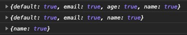

이름을 가지는 슬롯으로 받는 내용이 2개 이상이면 `default` 속성(단일 슬롯)이 자동으로 추가되는 것을 확인할 수 있는데,
이는 줄 바꿈으로 인한 공백 문자(띄어쓰기)가 내용으로 전달되면서 해석되는 것으로 확인했습니다.
따라서 다음과 같이 인라인으로 내용을 전달하면 `default` 속성(단일 슬롯)이 사라지게 됩니다.

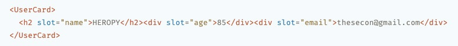
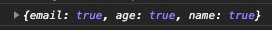

## 스토어

Svelte는 자체적으로 스토어(Store)를 지원합니다.
내장된 `svelte/store` 모듈을 사용하면 됩니다.

```js --filename=store.js
import { readable, writable, derived, get } from 'svelte/store';

export const r = readable(1);
export const w = writable(7);
export const d = derived(w, $w => $w + 1);

get(r) // 1
get(w) // 7
get(d) // 8
```

`readable`, `writable`, `derived`로 정의된 스토어 객체는 기본적으로 `subscribe` 메소드를 포함하며,
`writable`로 정의된 객체는 추가로 `set`과 `update` 메소드를 사용할 수 있습니다.

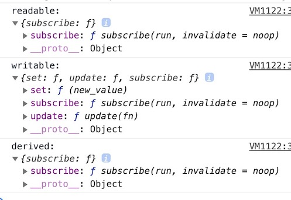

`subscribe` 메소드를 직접 사용해서 수동 구독을 만들 수 있습니다.

```svelte
<script>
  import { w } from './store.js';

  const data = w.subscribe(d => data = d)

  console.log(data) // 7
</script>
```

Svelte 컴포넌트에서는 각 메소드를 사용할 필요 없이 `$` 접두사로 스토어를 참조할 수 있습니다.
이를 자동 구독(Auto-subscription)이라고 합니다.
자동 구독을 통해 `set`과 `update` 메소드를 대신할 수 있어 편리합니다.
Svelte 컴포넌트에선 자동 구독(`$` 접두사) 사용을 권장합니다! 

```svelte
<script>
  import { w } from './store.js';

  console.log($w) // 7

  $w = 1;  // w.set(1)
  $w += 1;  // w.update(v => v + 1) // .update()의 콜백에서 반환하는 값이 지정됩니다. 

  console.log($w) // 2
</script>
```

Svelte 컴포넌트가 아니면(`.js`, `.ts` 파일 같은) 자동 구독을 사용할 수 없기 때문에,
`set`, `update`, `subscribe` 메소드를 직접 사용해야 합니다.

### 쓰기 가능 스토어

값을 읽거나 쓸 수 있는 스토어를 생성합니다.

```plaintext
writable(값)
writable(값, 콜백)
```

첫 번째 인수는 스토어의 값(초깃값)입니다.

두 번째 인수는 스토어 구독(자동, 수동)이 발생하면 실행될 콜백입니다.
콜백에서 반환하는 함수는 구독이 모두 취소되면(구독자가 모두 없어지면) 실행됩니다.

```js
import { writable } from 'svelte/store'

export let store = writable('값', () => {
  // 구독자가 1명 이상이 되면 실행!

  return () => {
    // 구독자가 0명이 되면 실행!
  }
})
```

#### 사용 패턴

[REPL에서 예제 보기 >](https://svelte.dev/repl/e47d56b83bea437b841a88186f8f61a5?version=3.29.4)

```svelte --path=App.svelte
<script>
  import WritableMethods from './WritableMethods.svelte'
  
  let toggle = true
</script>

<button on:click={() => toggle = !toggle}>
  Toggle
</button>

{#if toggle}
  <WritableMethods />
{/if}
```

```svelte --path=WritableMethods.svelte
<script>
  import { onDestroy } from 'svelte'
  import { get } from 'svelte/store'
  import { name, count } from './store.js'

  let number
  let userName

  // Store 객체
  // 사용 가능 메소드: set, update, subscribe
  console.log(name, count)
  
  // 구독하지 않고 Store 객체의 값만 얻기
  console.log(get(name), get(count))

  // count 구독자 추가!
  const unsubscribeCount = count.subscribe(c => {
    number = c
  })
  // count 구독자 추가!
  const unsubscribeCount2 = count.subscribe(() => {})
  // name 구독자 추가!
  const unsubscribeName = name.subscribe(n => {
    userName = n
  })

  function increase() {
    count.update(c => c + 1)
    try {
      unsubscribeCount() // Only once!
      unsubscribeCount2()
    } catch (e) {}
  }
  function changeName() {
    // name.update(() => 'Neo')
    name.set('Neo')
  }
  
  onDestroy(() => {
    unsubscribeCount()
    unsubscribeCount2()
    unsubscribeName()
  })
</script>

<button 
  on:click={increase}
  on:click={changeName}>
  Click me!
</button>

<h2>{number}</h2>
<h2>{userName}</h2>
```

```js --path=store.js
import { writable } from 'svelte/store'

export let name = writable('Heropy', () => {
  console.log('name 구독자가 1명 이상일 때!')
  return () => {
    console.log('name 구독자가 0명일 때...')
  }
})
export let count = writable(0, () => {
  console.log('count 구독자가 1명 이상일 때!')
  return () => {
    console.log('count 구독자가 0명일 때...')
  }
})
```

스토어 자동 구독을 통해 훨씬 간단하게 작성할 수 있습니다.

```svelte --path=WritableMethods.svelte
<script>
  import { name, count } from './store.js'
</script>

<button on:click={() => {
  $count += 1 // Increase
  $name = 'Neo' // Change name
}}>
  Click me!
</button>

<h2>{$count}</h2>
<h2>{$name}</h2>
```

### 읽기 전용 스토어

값을 읽을 수만 있는 스토어를 생성합니다.

```js
readable(값)
readable(값, 콜백)
```

첫 번째 인수는 스토어의 값(초깃값)입니다.

두 번째 인수는 스토어 구독(자동, 수동)이 발생하면 실행될 콜백입니다.
콜백에서 반환하는 함수는 구독이 모두 취소되면(구독자가 모두 없어지면) 실행됩니다.
읽을 수만 있는 스토어기 때문에 초깃값을 최초 한 번 수정할 수 있도록 콜백에서 `set` 함수(매개변수)를 사용할 수 있습니다.

```js
import { readable } from 'svelte/store'

export let store = writable('값', set => {
  // 구독자가 1명 이상이 되면 실행!

  set('값')
  return () => {
    // 구독자가 0명이 되면 실행!
  }
})
```

#### 사용 패턴

[REPL에서 예제 보기 >](https://svelte.dev/repl/e4840e62287f4b44b35388276b33cea7?version=3.29.4)

```svelte --path=App.svelte
<script>
  import Readable from './Readable.svelte'
  
  let toggle = true
</script>

<button on:click={() => toggle = !toggle}>
  Toggle
</button>

{#if toggle}
  <Readable />
{/if}
```

```svelte --path=Readable.svelte
<script>
  import { user } from './store.js'
  
  // 어떤 메소드를 가지는지 Readable 스토어 출력하기!
  console.log(user)
  console.log($user)
</script>

<button on:click={() => {$user.name = 'Neo'}}>
  Click!
</button>
<h1>{$user.name}</h1>
```

```js --path=store.js
import { readable } from 'svelte/store'

const userData = {
  name: 'Heropy',
  age: 85,
  email: 'thesecon@gmail.com',
  token: 'Ag1oy1hsdSDe'
}

export let user = readable(userData, (set) => {
  console.log('user 구독자가 1명 이상일 때!')
  delete userData.token
  set(userData)
  return () => {
    console.log('user 구독자가 0명일 때...')
  }
})
```

### 계산된 스토어

쓰기 가능(`writable`)하거나 읽기 전용(`readable`) 스토어를 통해 새롭게 계산한 값을 가지는 스토어를 생성합니다.

첫 번째 인수는 계산에 사용할 스토어이고,
계산할 스토어가 2개 이상인 경우 첫 번째 인수를 배열로 처리해야 합니다.

두 번째 인수는 스토어 구독(자동, 수동)이 발생하면 실행될 콜백입니다.
콜백에서 반환하는 함수는 구독이 모두 취소되면(구독자가 모두 없어지면) 실행됩니다.

세 번째 인수는 계산이 완료되기 전에(비동기 요청 등) 최초 한 번 출력할 초깃값입니다.

```js
derived(스토어, 콜백)
derived(스토어, 콜백, 초깃값)
derived([스토어1, 스토어2], 콜백)
derived([스토어1, 스토어2], 콜백, 초깃값)
```

콜백에서 스토어를 사용해 계산할 수 있습니다.

첫 번째 인수는 앞서 명시된 스토어의 값을 매개변수로 받습니다.
앞서 명시된 스토어가 배열로 처리되었다면, 값도 순서대로 배열로 받아야 합니다.

두 번째 인수는 `set` 매개변수입니다.
콜백에서 '계산된 값'을 반환하면 스토어(`derived`)에 반영되는데,
`set` 매겨변수가 명시되어 있으면, 반환되는 값은 '구독이 모두 취소되면 실행할 함수'가 됩니다.

다음 패턴에선 이해하기 쉽게 일반 함수을 사용했지만, 보통은 화살표 함수 사용을 권장합니다.

```js
function ($스토어) {
  // 계산..
  return 계산된_값
}
function ([$스토어1, $스토어2]) {
  // 계산..
  return 계산된_값
}
function ($스토어, set) {
  // 계산..
  set(계산된_값)
  return 구독이_모두_취소되면_실행할_함수
}
```

#### 사용 패턴

[REPL에서 예제 보기 >](https://svelte.dev/repl/dac9457f4e2a4ad082347ccf32d860b5?version=3.29.4)

```svelte --path=App.svelte
<script>
  import Derived from './Derived.svelte'
  
  let toggle = true
</script>

<button on:click={() => toggle = !toggle}>
  Toggle
</button>

{#if toggle}
  <Derived />
{/if}
```

```svelte --path=Derived.svelte
<script>
  import { count, double, total, initialValue } from './store.js'

  console.log(initialValue)
  console.log($count, $double)
  total.subscribe($total => {
    console.log($total)
  })
</script>

<button on:click={() => $count += 1}>
  Click!
</button>

<h1>total: {$total}</h1>
<h2>count: {$count}</h2>
<h2>double: {$double}</h2>
<h2>count+1(after 1s): {$initialValue}</h2>
```

```js --filename=store.js
import { writable, derived } from 'svelte/store'

export let count = writable(1)
export let double = derived(count, $count => $count * 2)
export let total = derived(
  [count, double],
  ([$count, $double], set) => {
    console.log('total 구독자가 1명 이상일 때!')
    set($count + $double)
    return () => {
      console.log('total 구독자가 0명일 때...')
    }
  }
)
export let initialValue = derived(
  count,
  ($count, set) => {
    setTimeout(() => set($count + 1), 1000)
  }, 
  '최초 계산 중...'
)
```

### 스토어 값 얻기

구독하지 않고도 스토어의 값을 얻을 수 있습니다.

[REPL에서 예제 보기 >](https://svelte.dev/repl/6e05a5d1d33642ff8ccc2d9b7af20379?version=3.29.4)

```svelte --path=App.svelte
<script>
  import { get } from 'svelte/store'
  import { count, double, user } from './store.js'
  
  console.log(get(count))
  console.log(get(double))
  console.log(get(user))
</script>
```

```js --path=store.js
import { writable, readable, derived } from 'svelte/store'

export let count = writable(1)
export let double = derived(count, $count => $count * 2)
export let user = readable({
  name: 'Heropy',
  age: 85,
  email: 'thesecon@gmail.com'
})
```

### 커스텀 스토어

스토어 객체의 메소드(`set`, `update`, `subscribe`)가 포함된 객체를 '커스텀 스토어'라고 합니다.
다른 속성이나 메소드를 사용할 수 있는 장점이 있습니다.
스토어의 수동/자동 구독을 위해서 `subscribe` 메소드는 필수로 포함해야 합니다!

```js
import { writable } from 'svelte/store'

const store = writable(7)

export let customStore = {
  subscribe: store.subscribe,
  a: () => {},
  b: () => {},
  x: 'abc',
  y: 123
}
```

```svelte
<script>
  import { customStore } from './store.js'
  
  // Auto-subscription
  console.log($customStore) // 7
</script>
```

[REPL에서 예제 보기 >](https://svelte.dev/repl/e2ac8a29dfdd4b7bb6cc782c8b91df1b?version=3.29.4)

```svelte --path=App.svelte
<script>
  import { fruits } from './fruits.js'
  
  let value
</script>

<input bind:value />
<button on:click={() => fruits.setItem(value)}>
  Add fruit!  
</button>
<button on:click={() => console.log(fruits.getList())}>
  Log fruit list!
</button>

<ul>
  {#each $fruits as {id, name} (id)}
    <li>{name}</li>
  {/each}
</ul>
```

```js --path=fruits.js
import { writable, get } from 'svelte/store'

const _fruits = writable([
  { id: 1, name: 'Apple' },
  { id: 2, name: 'Banana' },
  { id: 3, name: 'Cherry' }
])

export let fruits = {
  ..._fruits,
  getList: () => get(_fruits).map(f => f.name),
  setItem: (name) => _fruits.update(f => {
    f.push({
      id: f.length + 1,
      name
    })
    console.log(f)
    return f
  })
}
```

## 액션

`use` 지시어를 사용해 연결된 요소가 생성될 때 호출할 함수를 지정할 수 있습니다. 
이 함수를 '액션(Action)'이라고 합니다.
요소를 사용하는 플러그인(모듈)을 제작할 때 유용합니다.

```svelte
<요소 use:함수이름></요소>
<요소 use:함수이름={인수}></요소>
```

연결된 함수는 다음과 같은 구조를 가집니다.

```js
function 함수이름(요소, 인수) {
  // Logic..
  return {
    update(인수) {}, // '인수'가 변경되면 실행됩니다.
    destroy() {} // '요소'가 제거되면 실행됩니다.
  }
}
```

[REPL에서 예제 보기 >](https://svelte.dev/repl/11d88c715641499c92ec70cd4813e1c2?version=3.29.4)

```svelte --path=App.svelte
<script>
  let toggle = true
  let width = 200
  
  function hello(node, options = {}) {
    console.log('Init hello function!')
    const { 
      width = '100px', 
      height = '100px', 
      color = 'tomato' 
    } = options
    node.style.width = width
    node.style.height = height
    node.style.backgroundColor = color
  
    return {
      update: (opts) => {
        console.log('update!', opts)
      },
      destroy: () => {
        console.log('destroy!')
      }
    }
  }
</script>

<button on:click={() => toggle = !toggle}>
  Toggle!
</button>
<button on:click={() => width += 20}>
  Size up!
</button>

<div use:hello></div>
{#if toggle}
  <div use:hello={{
    width: `${width}px`,
    color: 'royalblue'
  }}></div>
{/if}
```

[REPL에서 예제 보기 >](https://svelte.dev/repl/2cf17ac3b4ea47a0ade11361c242e068?version=3.29.4)

```svelte --path=App.svelte
<script>
  import { zoom } from './zoom.js'
</script>

<div use:zoom></div>
<div use:zoom={0.7}></div>

<style>
  div {
    width: 100px;
    height: 100px;
    background-color: tomato;
  }
</style>
```

```js --path=zoom.js
export function zoom(node, scale = 1.5) {
  node.style.transition = '1s'

  function zoomIn() {
    node.style.transform = `scale(${scale})`
  }
  function zoomOut() {
    node.style.transform = 'scale(1)'
  }
  node.addEventListener('mouseenter', zoomIn)
  node.addEventListener('mouseleave', zoomOut)

  return {
    destroy() {
      node.removeEventListener('mouseenter', zoomIn)
      node.removeEventListener('mouseleave', zoomOut)
    }
  }
}
```

## 특별한 요소

### self

컴포넌트 자신을 재귀적으로 포함합니다.
A 컴포넌트 내부에서 다시 A 컴포넌트를 사용하는 방법입니다.

```svelte
<svelte:self />
```

다음의 재귀 함수와 같은 개념입니다.
무한루프에 빠지지 않도록 재귀 호출이 멈출 수 있는 조건이 붙어야 합니다.

```js
function self() {
  self()
}
self()
```

다음 예제의 `address` 데이터를 활용할 때와 같이,
같은 컴포넌트가 반복적으로 사용될 수 있는 구조에서 유용합니다.
어떤 조건으로 재귀 호출이 멈추는지 확인해 보세요!

[REPL에서 예제 보기 >](https://svelte.dev/repl/7114e7233bfd48e0b47b88f59e0b40de?version=3.29.4)

```svelte --path=App.svelte
<script>
  import Address from './Address.svelte'
  
  let address = {
    label: '대한민국',
    children: [
      {
        label: '경기도',
        children: [
          { label: '수원' },
          { label: '성남' }
        ]
      },
      {
        label: '강원도',
        children: [
          { label: '강릉' },
          { label: '속초' }
        ]
      }
    ]
  }
</script>

<Address {address} />
```

```svelte --path=Address.svelte
<script>
  export let address
</script>

<ul>
  <li>
    {address.label}
    {#if address.children}
      {#each address.children as address}
        <svelte:self {address} />  
      {/each}
    {/if}
  </li>
</ul>
```

### component

컴포넌트를 동적으로 렌더링할 때 사용합니다.
`this` 속성에 컴포넌트 객체를 연결해야 합니다.

```svelte
<script>
  import MyComp from './MyComp.svelte'
</script>

<svelte:component this={MyComp} />
```

[REPL에서 예제 보기 >](https://svelte.dev/repl/08f86ae2d1c54ab2bf5f9d1818695450?version=3.29.4)

```svelte --path=App.svelte
<script>
  import Heropy from './Heropy.svelte'
  import Neo from './Neo.svelte'
  import Anderson from './Anderson.svelte'
  
  let components = [
    { name: 'Heropy', comp: Heropy },
    { name: 'Neo', comp: Neo },
    { name: 'Anderson', comp: Anderson }
  ]
  let index = 2
  let selected = components[index - 1].comp
</script>

{#each components as {name, comp}, i (name)}
  <label>
    <input 
      type="radio" 
      value={comp} 
      bind:group={selected}
      on:change={() => index = i + 1} />
    {name}
  </label>
{/each}

<svelte:component 
  this={selected} 
  {index} />

<!-- <div>{selected}</div> -->
```

```svelte --path=Heropy.svelte
<script>
  export let index
</script>

<h2>{index}. Heropy!</h2>
```

```svelte --path=Neo.svelte
<script>
  export let index
</script>

<h2>{index}. Neo?</h2>
```

```svelte --path=Anderson.svelte
<h2>
  Anderson~
</h2>
```

### window

컴포넌트가 파괴(제거)될 때 같이 제거할 Window 이벤트를 추가하거나,
SSR에서 window 객체의 존재를 확인하지 않고도 이벤트를 추가할 때 사용합니다.
`bind` 지시어를 사용해 아래 명시된 속성들과 연결할 수 있습니다.

```svelte
<svelte:window 
  on:이벤트={핸들러}
  bind:속성={데이터} />
```

속성 | 특성 | 설명
--|--|--
innerWidth | 읽기 전용 | 뷰포트의 가로 너비
innerHeight | 읽기 전용 | 뷰포트의 가로 너비
outerWidth | 읽기 전용 | 브라우저 가로 너비
outerHeight | 읽기 전용 | 브라우저 가로 너비
online | 읽기 전용 | 네트워크 상태
scrollX | 쓰기 가능 | 스크롤 X좌표
scrollY | 쓰기 가능 | 스크롤 Y좌표

[REPL에서 예제 보기 >](https://svelte.dev/repl/aa24e0b95bad4d06a5c8d0d051b521b4?version=3.29.4)

```svelte --path=App.svelte
<script>
  let key = ''
  let innerWidth
  let innerHeight
  let outerWidth
  let outerHeight
  let online
  let scrollX
  let scrollY
  // window.addEventListener('keydown', event => {
  //   key += event.key
  // })
</script>

<svelte:window 
  on:keydown={e => key = e.key}
  bind:innerWidth={innerWidth}
  bind:innerHeight
  bind:outerWidth
  bind:outerHeight
  bind:online
  bind:scrollX
  bind:scrollY />

<h1>{key}</h1>
<div>innerWidth: {innerWidth}</div>
<div>innerHeight: {innerHeight}</div>
<div>outerWidth: {outerWidth}</div>
<div>outerHeight: {outerHeight}</div>
<div>online: {online}</div>
<div class="fixed">
  <input type="number" bind:value={scrollX} />
  <input type="number" bind:value={scrollY} />  
</div>
<div class="for-scroll"></div>

<style>
  .fixed {
    position: fixed;
    top: 10px;
    right: 10px;
  }
  .for-scroll {
    width: 2000px;
    height: 2000px;
  }
</style>
```

### head, body

`document.head`를 통해 정보 요소(META, LINK..)를 삽입하거나,
`document.body`에 이벤트를 추가할 수 있습니다.
해당 컴포넌트가 파괴(제거)될 때 같이 제거됩니다.

```svelte
<svelte:head></svelte:head>
<svelte:body />
```

[REPL에서 예제 보기 >](https://svelte.dev/repl/e02ef1d7e75d4657aa2bd62f9481f775?version=3.29.4)

```svelte --path=App.svelte
<script>
  import Heropy from './Heropy.svelte'

  let toggle = false
</script>

<button on:click={() => toggle = !toggle}>
  Toggle!
</button>

{#if toggle}
  <Heropy />
{/if}
```

```svelte --path=Heropy.svelte
<svelte:head>
  <link rel="stylesheet" href="./main.css" />
  <style>
    body {
      background-color: orange;
    }
  </style>
</svelte:head>

<svelte:body on:mousemove={e => console.log(e.clientX, e.clientY)} />
  
<h1>Heropy!</h1>
```

### options

```svelte
<svelte:options 속성={값} />
```

#### 불변성 선언(immutable)

가변성(같은 메모리 주소를 참조)을 가지는 객체 타입(object, array, function..)의 특성으로 인해,
Svelte의 할당은 불필요한 반응성(Reactive, DOM 업데이트)을 가질 수 있습니다.
컴포넌트가 전달받은 Props의 데이터 불변성(Immutable)을 선언합니다.

```svelte
<svelte:options immutable={true} />
<svelte:options immutable />
```

해당 Props의 불변성이 확인되면 Svelte는 기존 Props와 새로운 Props를 동등 연산자로 비교하고,
그 결과가 `false`가 되면 반응성을 갱신합니다.

```js
기존_Props === 새로운_Props
```

Fruit 컴포넌트의 옵션을 활성화하고 테스트해보세요!

[REPL에서 예제 보기 >](https://svelte.dev/repl/6392d60f17c44329b0d8087a651e4b0b?version=3.29.4)

```svelte --path=App.svelte
<script>
  import Fruit from './Fruit.svelte'
  
  let fruits = [
    { id: 1, name: 'Apple' },
    { id: 2, name: 'Banana' },
    { id: 3, name: 'Cherry' },
    { id: 5, name: 'Mango' },
    { id: 4, name: 'Orange' }
  ]
</script>

<button on:click={() => {
  fruits[0] = { id: 1, name: 'Apple' }
  fruits = fruits
}}>
  Update!
</button>

{#each fruits as fruit (fruit.id)}
  <Fruit {fruit} />
{/each}
```

```svelte --path=Fruit.svelte
<script>
  import { afterUpdate } from 'svelte'

  export let fruit
  // 기존 fruit === 새로운 fruit
  let updateCount = 0

  afterUpdate(() => {
    updateCount += 1
  })
</script>

<!-- <svelte:options immutable /> -->

<div>{fruit.name}({updateCount})</div>
```

#### 접근 허용(accessors)

외부에서 컴포넌트의 데이터 혹은 함수에 접근을 허용할 때 사용합니다.
단, 허용할 데이터나 함수에 `export`를 사용해야 합니다.

```svelte
<svelte:options accessors={true} />
<svelte:options accessors />
```

Heropy 컴포넌트의 옵션을 비활성화하고 테스트해보세요!

[REPL에서 예제 보기 >](https://svelte.dev/repl/811a7e65d9524b3ea20d5c5fe4d48649?version=3.29.4)

```svelte --path=App.svelte
<script>
  import Heropy from './Heropy.svelte'

  let heropy

  function handler() {
    console.log(heropy)
    console.log(heropy.name)
    console.log(heropy.getAge())
  }
</script>

<button on:click={handler}>
  Toggle!
</button>
<Heropy bind:this={heropy} />
```

```svelte --path=Heropy.svelte
<svelte:options accessors />

<script>
  let age = 85
  export let name = 'Heropy'
  export function getAge() {
    console.log(age)
  }
</script>

<h1 on:click={getAge}>{name}!</h1>
```

## 모션

### tweened

`tweened`는 지정된 값을 정해진 시간 동안 업데이트하는 재미있는 기능으로 스토어 객체를 반환하는 것에 주의해야 합니다.
다음과 같이 작성할 수 있습니다.

```js
import { tweened } from 'svelte/motion'

const store = tweened(1, { // 첫 번째 인수로 기본값 설정
  delay: 0, // 값을 업데이트 하기 전에 대기 시간
  duration: 400, // 값을 업데이트 하는 시간
  easing: t => t, // Same as `linear`, 타이밍 함수
  interpolate: (a, b) => t => value // 보간 함수
})
```

`tweened`가 스토어 객체를 반환하기 때문에 `number`을 업데이트하기 위해 `$`(`$number += 1`)를 사용합니다.
`number.update(n => n + 1)`과 같이 `update` 메소드를 사용할 수도 있습니다.

```svelte
<script>
  import { tweened } from 'svelte/motion'
  import { linear } from 'svelte/easing'

  const number = tweened(1, {
    duration: 1000,
    // easing: linear  // Default value!
  })

  $: fixedNumber = $number.toFixed(2)
</script>

<h1>
  {fixedNumber}
</h1>
<button on:click={() => $number += 1}>
  Increase!
</button>
```

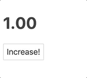
<div class="image-caption">Tweened Store 예제 결과</div>

## Router

[svelte-spa-router](https://github.com/ItalyPaleAle/svelte-spa-router)는 SPA(Single Page Application)을 위한 라우터 모듈입니다.
Svelte REPL에서도 사용할 수 있습니다.

[REPL에서 예제 보기 >](https://svelte.dev/repl/c35ccfc5a3914983b386929b0e3c82fd?version=3.29.4)

```bash
$ npm i -D svelte-spa-router
```

`routes.js`를 생성해 다음과 같이 Route로 정의할 컴포넌트를 연결합니다.
이 컴포넌트들은 `/routes` 디렉터리에 생성합니다.

```js --path=src/routes.js
import Home from './routes/Home.svelte'
import About from './routes/About.svelte'
import Blog from './routes/Blog.svelte'

const routes = {
  '/': Home,
  '/about': About,
  '/blog': Blog
}

export default routes
```

위 설정 파일을 `App.svelte`에서 가져와 다음과 같이 연결합니다.
각 경로로 이동할 수 있게 `Header.svelte` 컴포넌트도 같이 추가합니다.

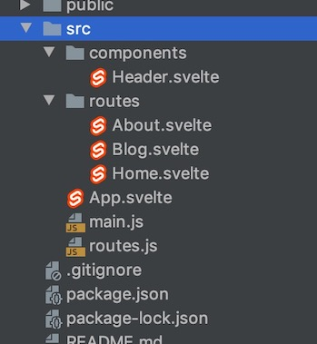

```svelte --path=src/App.svelte
<script>
  import Router from 'svelte-spa-router'
  import routes from './routes'
  import Header from './components/Header.svelte'
</script>

<Header />
<Router {routes} />
```

```svelte --path=src/components/Header.svelte
<script>
  import { link } from 'svelte-spa-router'
  import active from 'svelte-spa-router/active'
</script>

<header>
  <a 
    href="/"
    use:link
    use:active>
    Home
  </a>
  <a 
    href="/about"
    use:link
    use:active>
    About
  </a>
  <a 
    href="/blog"
    use:link
    use:active>
    Blog
  </a>
</header>

<style>
  :global(header a.active) {
    font-weight: bold;
    text-decoration: underline;
  }
</style>
```

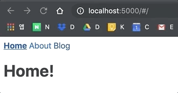

## Tools

### WebStorm plugin

https://plugins.jetbrains.com/plugin/12375-svelte/

WebStorm을 위한 Svelte 플러그인이 있네요.
WebStorm 버전에 따라 플러그인 버전도 차이가 있을 수 있습니다.

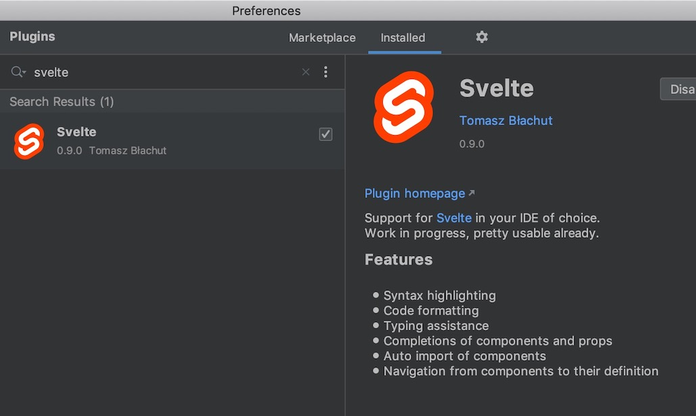

### VS Code plugin

https://marketplace.visualstudio.com/items?itemName=svelte.svelte-vscode

VS Code를 위한 플러그인도 있으니 확인해 보세요.

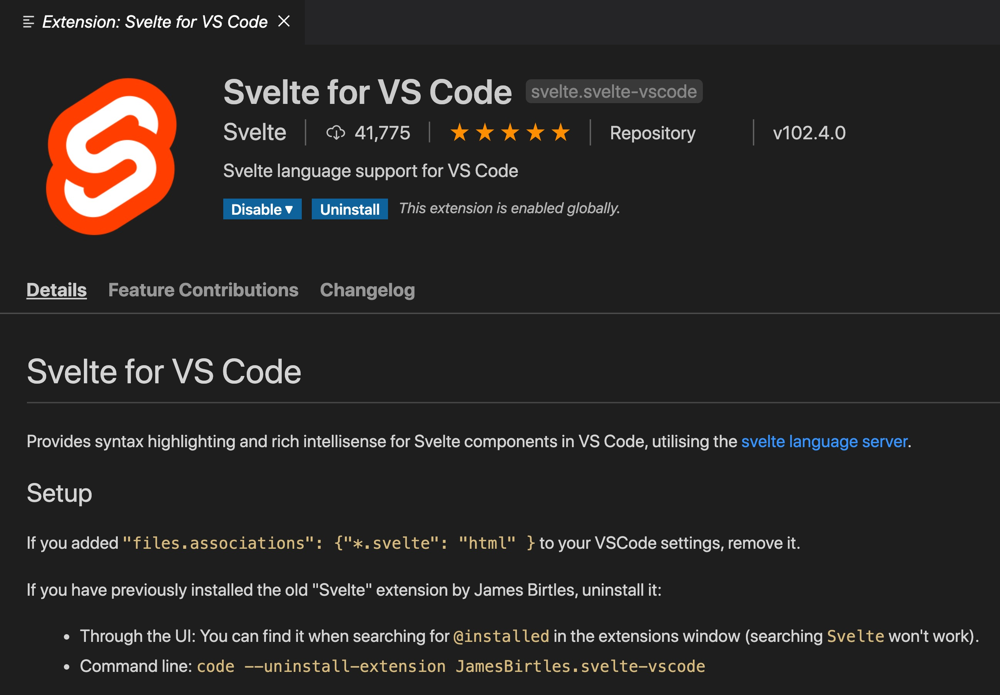

### Svelte Devtools

For Chrome
https://chromewebstore.google.com/detail/svelte-devtools/kfidecgcdjjfpeckbblhmfkhmlgecoff?hl=ko

For FireFox
https://addons.mozilla.org/en-US/firefox/addon/svelte-devtools/

Svelte 애플리케이션 디버깅을 위한 브라우저용 확장 프로그램입니다.
크롬과 파이어폭스 브라우저를 지원합니다.

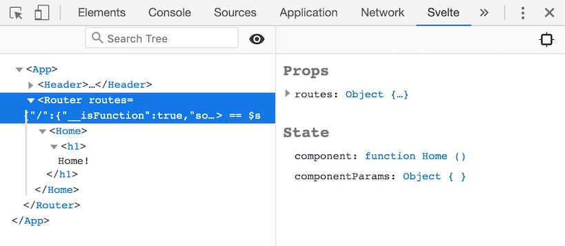

