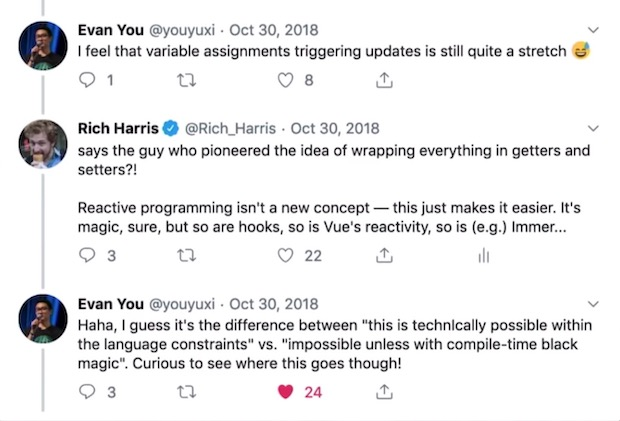
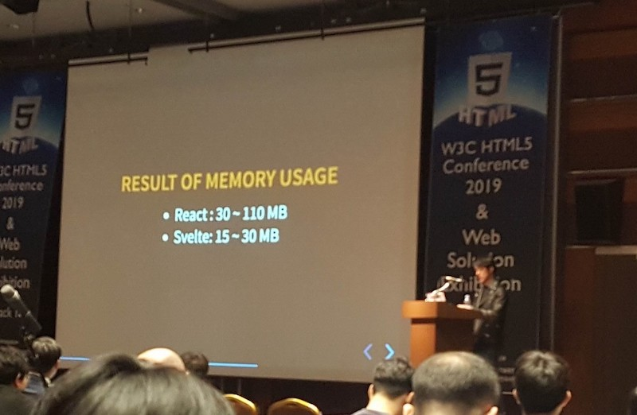

---
id: UKy78n
filename: svelte-get-starting
image: https://heropy.dev/postAssets/UKy78n/main.jpg
title: Svelte 개요 및 기본 문법
createdAt: 2019-09-29
updatedAt: 2024-05-12
video: 
  - https://inf.run/PXpNQ
group: Svelte
author:
  - ParkYoungWoong
tags:
  - Svelte
description:
  Svelte는 '프레임워크가 없는 프레임워크' 혹은 '컴파일러'라고 소개하는 새로운 방식의 프레임워크로, 가상 DOM이 없고 런타임에 로드할 프레임워크가 없습니다.
--- 

## 개요

[Svelte(스벨트)](https://svelte.dev/)는 [Rich Harris](https://twitter.com/rich_harris)가 제작한 새로운 접근 방식을 가지는 프론트엔드 프레임워크입니다.
Svelte는 자신을 '프레임워크가 없는 프레임워크' 혹은 <strong>'컴파일러'</strong>라고 소개합니다.
이는 Virtual(가상) DOM이 없고, Runtime(런타임)에 로드할 프레임워크가 없음을 의미합니다.
기본적으로 빌드 단계에서 구성 요소를 컴파일하는 도구이므로 페이지에 단일 번들(bundle.js)을 로드하여 앱을 렌더링할 수 있습니다.

다른 프레임워크와 Svelte의 주요 차이점을 알아봅시다.

<div style="position: relative; padding-bottom: 56.25%; height: 0; margin-bottom: 50px;">
<iframe style="position: absolute; top: 0; left: 0; width: 100%; height: 100%;" src="https://www.youtube.com/embed/nV-cpUd5R7Y?rel=0" frameborder="0" allow="accelerometer; autoplay; clipboard-write; encrypted-media; gyroscope; picture-in-picture" allowfullscreen></iframe>
</div>

Svelte는 높은 가독성을 유지하며 더 적은 코드를 작성할 수 있습니다.
다음의 Svelte 코드를 살펴보세요.

```svelte --path=App.svelte --caption=Svelte
<script>
  let a = 1
  let b = 2
</script>

<input type="number" bind:value={a} />
<input type="number" bind:value={b} />
<p>{a} + {b} = {a + b}</p>
```

위 코드는 [React](https://ko.reactjs.org/)와 [Vue](https://kr.vuejs.org/v2/guide/index.html)에서 다음과 같이 작성할 수 있습니다.

```jsx --path=App.jsx --caption=React
import React, { useState } from 'react'

export default function () {
  const [a, setA] = useState(1)
  const [b, setB] = useState(2)

  function handleChangeA(event) {
    setA(Number(event.target.value))
  }
  function handleChangeB(event) {
    setB(Number(event.target.value))
  }

  return (
    <div>
      <input type="number" value={a} onChange={handleChangeA} />
      <input type="number" value={b} onChange={handleChangeB} />
      <p>{a} + {b} = {a + b}</p>
    </div>
  )
}
```

```vue --path=App.vue --caption=Vue
<template>
  <div>
    <input type="number" v-model.number="a" />
    <input type="number" v-model.number="b" />
    <p>{{a}} + {{b}} = {{a + b}}</p>
  </div>
</template>

<script>
  export default {
    data: function() {
      return {
        a: 1,
        b: 2
      }
    }
  }
</script>
```

### No virtual DOM

Svelte는 [Virtual(가상) DOM](https://velopert.com/3236)을 사용하지 않습니다.
Virtual DOM은 **충분히 빠르고 유용하지만** 이는 기능이 아닌 수단일 뿐이며, 이를 사용하지 않고도 유사한 프로그래밍 모델을 얻을 수 있다고 Svelte는 설명합니다.
새로운 Virtual DOM을 이전 Snapshot과 비교하거나([Diffing](https://meetup.toast.com/posts/110)), 상태 변화에 따른 새로운 가상 요소 생성 등에 많은 [오버헤드](https://ko.wikipedia.org/wiki/%EC%98%A4%EB%B2%84%ED%97%A4%EB%93%9C)가 있을 수 있으며 최종적으론 실제 DOM을 업데이트해야 하므로 그 과정을 생략하는 것이 더욱 빠를 수 있다고 합니다.

이에 대한 더 자세한 내용은 [Virtual DOM is pure overhead](https://svelte.dev/blog/virtual-dom-is-pure-overhead#Where_does_the_overhead_come_from)에서 더 자세하게 확인할 수 있습니다.

### 반응성

반응성은 변경된 값이 DOM에 자동으로 반영됨을 의미합니다.
Svelte는 별도의 Setter 없이 값의 할당(assignments)만으로 업데이트를 트리거(Trigger)할 수 있습니다.

```svelte --path=./App.svelte
<script>
  let count = 0
</script>

<button on:click={() => count += 1}>
  {count}
</button>
```

컴파일 결과가 할당을 계측하고 DOM을 갱신합니다.

```js --caption=JS output
$$invalidate('count', count += 1)
```

이는 다음과 같이 Store 사용에도 굉장한 이점을 부여합니다.

```js --path=./store.js
import { writable } from 'svelte/store'

export const count = writable(0) // similar to `count = 0`
```

`count`는 `writable()`에서 반환된 쓰기용 객체 데이터이기 때문에,
`$` 접두사(`$count`)를 사용해 Store를 참조하겠다는 의미로 사용할 수 있습니다.

```svelte --path=./App.svelte
<script>
  import { count } from './store.js'
</script>

<button on:click={() => $count += 1}>
  {$count}
</button>
```



### 성능

W3C HTML5 Conf 2019에서 [변규현](https://novemberde.github.io/) 님의 Svelte와 React 퍼포먼스 비교 시연은 생각보다 놀라웠습니다.
메모리 사용량의 비교 결과를 보시면 차이가 확실히 느껴지는데, 컴파일 Output이 워낙 작기도 하고 가상 DOM Diffing이 없어서인지 훨씬 안정적으로 동작하고 있었습니다.

발표 자료는 [변규현 님의 블로그(Let's start SVELTE, goodbye React & Vue)](https://novemberde.github.io/javascript/2019/10/11/Svelte-revealjs.html)에서 확인하실 수 있습니다.



## 기본 문법

Svelte의 전반적인 내용을 비교적 가볍게 다뤄, 주요 특징을 빠르게 이해해 봅시다.

/// message-box --icon=warning
Svelte는 런타임 프레임워크가 아니기 때문에, CDN을 제공하지 않습니다!
///

### Svelte REPL

[Svelte REPL(레플)](https://svelte.dev/repl/)이 준비되어 있습니다.
'+' 버튼을 눌러 파일을 추가하고 상대경로(확장자를 작성해야 합니다)로 접근할 수 있습니다.

<iframe style="width: 100%; height: 600px;" src="https://svelte.dev/repl/hello-world?version=3.29.4" frameborder="0" allow="allowfullscreen"></iframe>

### 선언적 렌더링

- 보간법: 내용 / 속성 / 표현식 보간
- 반응성: 할당(`=`)
- 클래스와 스타일: 클래스와 스타일 속성 바인딩
- 요소 바인딩: 입력 요소 바인딩(Properties, group) 패턴 정리
- 사용자 입력 핸들링: 인라인 이벤트 핸들러

[REPL에서 예제 보기 >](https://svelte.dev/repl/a7baafe9e79347abb4f96e185c034cc5?version=3.29.4)

```svelte --path=./App.svelte
<script>
  let name = 'world'
  let age = 85
  function assign() {
    name = 'Heropy'
    age = 36
  }
</script>

<h1>Hello {name}!</h1>
<h2 class={age < 85 ? 'active': ''}>{age}</h2>


<input type="text" bind:value={name} />
<button on:click={assign}>Assign</button>

<style>
  h1 {
    color: red;
  }
  .active {
    color: blue;
  }
</style>
```

### 조건문과 반복문

- 조건과 반복: 조건 블록 패턴 정리, 반복 블록 패턴 정리

[REPL에서 예제 보기 >](https://svelte.dev/repl/18a4858a86f64f779f65bb4e52a03ad4?version=3.29.4)

```svelte --path=./If.svelte
<script>
  let name = 'world'
  let toggle = false
</script>

<button on:click={() => {toggle = !toggle}}>
  Toggle
</button>

{#if toggle}
  <h1>Hello {name}!</h1>
{:else}
  <div>No name!</div>
{/if}
```

<div class="filename">Each.svelte</div>

```svelte
<script>
  let name = 'Fruits'
  let fruits = ['Apple', 'Banana', 'Cherry', 'Orange', 'Mango']
  function deleteFruit() {
    fruits = fruits.slice(1)
  }
</script>

<h1>Hello {name}!</h1>
<ul>
  {#each fruits as fruit}
    <li>{fruit}</li>
  {/each}
</ul>
<button on:click={deleteFruit}>
  Eat it!
</button>
```

### 이벤트 핸들링

- 사용자 입력 핸들링: 인라인 이벤트 핸들러, 다중 이벤트 핸들러

[REPL에서 예제 보기 >](https://svelte.dev/repl/a452ad7129a640189023590680934e13?version=3.29.4)

```svelte --path=./EventHandling.svelte
<script>
  let name = 'world'
  let isRed = false
  
  function enter() {
    name = 'enter'
  }
  function leave() {
    name = 'leave'
  }
</script>

<h1>Hello {name}!</h1>
<div
  class="box"
  style="background-color: {isRed ? 'red' : 'orange'};"
  on:click={() => { isRed = !isRed }}
  on:mouseenter={enter}
  on:mouseleave={leave}>
  Box!
</div>

<style>
  .box {
    width: 300px;
    height: 150px;
    background-color: orange;
  }
</style>
```

```svelte --path=./BindingInput.svelte
<script>
  let text = ''
</script>

<h1>
  {text}
</h1>
<input 
  type="text" 
  value={text}
  on:input={e => {text = e.target.value}} />
<input 
  type="text"
  bind:value={text} />
<button on:click={() => {text = 'Heropy'}}>
  Click
</button>
```

### 컴포넌트

- 반응성: 데이터의 불변성과 가변성
- 컴포넌트: 컴포넌트 개요(with 컴포넌트 바인딩), 부모에서 자식으로(Props)

[REPL에서 예제 보기 >](https://svelte.dev/repl/a6bd6b5f01534d478df444f80b40ceb3?version=3.29.4)

```svelte --path=./App.svelte
<script>
  import Fruits from './Fruits.svelte'
  
  let fruits = ['Apple', 'Banana', 'Cherry', 'Orange', 'Mango']
</script>

<Fruits {fruits} />
<Fruits {fruits} reverse />
<Fruits {fruits} slice="-2" />
<Fruits {fruits} slice="0, 3" />
```

```svelte --path=./Fruits.svelte
<script>
  // Props
  export let fruits
  export let reverse
  export let slice
  
  let computedFruits = []
  let name = ''
  
  if (reverse) {
    computedFruits = [...fruits].reverse()
    name = 'reverse'
  } else if (slice) {
    computedFruits = fruits.slice(...slice.split(','))
    name = `slice ${slice}`
  } else {
    computedFruits = fruits  
  }
</script>

<h2>
  Fruits {name}
</h2>
<ul>
  {#each computedFruits as fruit}
    <li>{fruit}</li>
  {/each}
</ul>
```

### 스토어

- 스토어: 쓰기 가능 스토어(writable) & 수동 구독과 자동 구독

[REPL에서 예제 보기 >](https://svelte.dev/repl/61d85b0d98924e31a68e304fc17982f8?version=3.29.4)

```svelte --path=./App.svelte
<script>
  import { storeName } from './store.js'
  import Parent from './Parent.svelte'
  
  let name = 'world'
  // let $hello = '' // Error!
  $storeName = name
  // console.log(storeName) // 스토어 객체
  // console.log($storeName) // 스토어 값(데이터)
</script>

<h1>Hello {name}!</h1>
<Parent />
```

```svelte --path=./Parent.svelte
<script>
  import Child from './Child.svelte'
</script>

<div>
  Parent
</div>
<Child />
```

```svelte --path=./Child.svelte
<script>
  import { storeName } from './store.js'
</script>

<div>
  Child {$storeName}
</div>
```

```js --path=./store.js
import { writable } from 'svelte/store'

export let storeName = writable('Heropy')
```

## Todo 예제 만들기

[REPL에서 예제 보기 >](https://svelte.dev/repl/ef3dc9c2559847c0a8575712d25accc6?version=3.29.4)

```svelte --path=./App.svelte
<script>
  import { writable } from 'svelte/store'
  import Todo from './Todo.svelte'

  let title = ''
  let todos = writable([])
  let id = 0
  
  function createTodo() {
    if (!title.trim()) {
      title = ''
      return
    }
    $todos.push({
      id,
      title
    })
    $todos = $todos
    title = ''
    id += 1
  }
</script>

<input 
  bind:value={title}
  on:keydown={(e) => {e.key === 'Enter' && createTodo()}} />
<button on:click={createTodo}>
  Create Todo
</button>

{#each $todos as todo}
  <Todo {todos} {todo} />
{/each}
```

```svelte --path=./Todo.svelte
<script>
  export let todos // Store!
  export let todo
  
  let isEdit = false
  let title = ''
  
  function onEdit() {
    isEdit = true
    title = todo.title
  }
  function offEdit() {
    isEdit = false
  }
  function updateTodo() {
    todo.title = title
    $todos = $todos
    offEdit()
  }
  function deleteTodo() {
    $todos = $todos.filter(t => t.id !== todo.id)
  }
</script>

{#if isEdit}
  <div>
    <input 
       type="text" 
       bind:value={title}
       on:keydown={(e) => {e.key === 'Enter' && updateTodo()}} />  
    <button on:click={updateTodo}>OK</button>
    <button on:click={offEdit}>cancel</button>
  </div>
{:else}
  <div>
    <span>{todo.title}</span>
    <button on:click={onEdit}>Edit</button>
    <button on:click={deleteTodo}>Delete</button>
  </div>
{/if}
```
