## 개요

[타입스크립트(TypeScript)](https://www.typescriptlang.org/index.html)는 Microsoft에서 개발하고 유지/관리하는 [Apache 라이센스](https://ko.wikipedia.org/wiki/%EC%95%84%ED%8C%8C%EC%B9%98_%EB%9D%BC%EC%9D%B4%EC%84%A0%EC%8A%A4)가 부여된 오픈 소스입니다.
일반 자바스크립트로 컴파일되는 자바스크립트 Superset(상위 호환)으로 2012년 10월에 처음 릴리스 되었습니다.

### 왜 타입스크립트인가?

C#과 Java 같은 체계적이고 정제된 언어들에서 사용하는 강한 타입 시스템은 높은 가독성과 코드 품질 등을 제공할 수 있고 런타임이 아닌 컴파일 환경에서 에러가 발생해 치명적인 오류들을 더욱더 쉽게 잡아낼 수 있습니다.

반면 자바스크립트는 타입 시스템이 없는 동적 프로그래밍 언어로, 자바스크립트 변수는 문자열, 숫자, 불린 등 여러 타입의 값을 가질 수 있습니다.
이를 약한 타입 언어라고 표현할 수 있으며 비교적 유연하게 개발할 수 있는 환경을 제공하는 한편 런타임 환경에서 쉽게 에러가 발생할 수 있는 단점을 가집니다.

그리고 타입스크립트는 이러한 자바스크립트에 강한 타입 시스템을 적용해 대부분의 에러를 컴파일 환경에서 코드를 입력하는 동안 체크할 수 있습니다.

### 타입스크립트 사용법

자바스크립트가 `.js` 확장자를 가진 파일로 작성되는 것과 같이 타입스크립트는 `.ts` 확장자를 가진 파일로 작성할 수 있고, 작성 후 타입스크립트 컴파일러를 통해 자바스크립트 파일로 컴파일하여 사용하게 됩니다.

```bash
$ tsc sample.ts
## compiled to `sample.js`
```

### 타입스크립트의 기능

- <strong>크로스 플랫폼 지원</strong>: 자바스크립트가 실행되는 모든 플랫폼에서 사용할 수 있습니다.
- <strong>객체 지향 언어</strong>: 클래스, 인터페이스, 모듈 등의 강력한 기능을 제공하며, 순수한 객체 지향 코드를 작성할 수 있습니다.
- <strong>정적 타입</strong>: 정적 타입을 사용하기 때문에 코드를 입력하는 동안에 오류를 체크할 수 있습니다.(단 에디터 혹은 플러그인의 도움의 필요)
- <strong>DOM 제어</strong>: 자바스크립트와 같이 DOM을 제어해 요소를 추가하거나 삭제할 수 있습니다.
- <strong>최신 ECMAScript 기능 지원</strong>: ES6 이상의 최신 자바스크립트 문법을 손쉽게 지원할 수 있습니다.

### 개발환경

#### VSCode와 WebStorm

[VSCode(Visual Studio Code)](https://code.visualstudio.com/)와 [WebStorm](https://www.jetbrains.com/ko-kr/webstorm/)은 타입스크립트 지원 기능이 내장되어 있기 때문에 별도의 설정 없이도 타입스크립트 파일을(`.ts`, `tsconfig.json` 등) 인식할 수 있고 코드 검사, 빠른 수정, 실행 및 디버깅 등의 다양한 기능을 바로 사용할 수 있습니다.
단, 컴파일러는 포함되어 있지 않기 때문에 별도로 설치해야 합니다.(E.g. `npm install typescript`)

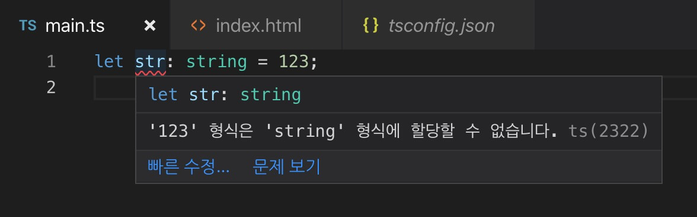
<div class="image-caption">Visual Studio Code</div>

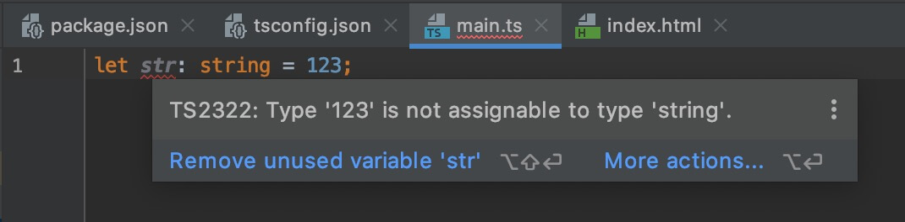
<div class="image-caption">WebStorm</div>

#### 컴파일러 설치

`tsc` 명령을 사용하기 위해 다음과 같이 타입스크립트를 전역 설치할 수 있습니다.
타입스크립트 파일을 경로로 지정하면 해당 파일을 컴파일합니다.

```bash
$ npm install -g typescript
$ tsc --version
$ tsc ./src/index.ts
```

혹은, 단일 프로젝트에서만 사용하길 희망하는 경우 일반 지역 설치 후 `npx tsc` 명령으로 실행할 수도 있습니다.

```bash
$ npm install -D typescript
$ npx tsc --version
$ npx tsc ./src/index.ts
```

##### 컴파일러 옵션

타입스크립트 [컴파일을 위한 다양한 옵션](https://www.typescriptlang.org/docs/handbook/compiler-options.html)을 지정할 수 있습니다.

```bash
$ tsc ./src/index.ts --watch --strict true --target ES6 --lib ES2015,DOM --module CommonJS
```

혹은 아래와 같이 `tsconfig.json` 파일로 옵션을 관리할 수 있습니다.
`"include"`와 `"exclude"` 옵션을 같이 추가해, 컴파일에 <strong>포함할 경로</strong>와 <strong>제외할 경로</strong>를 설정할 수 있습니다.

> VScode와 WebStorm을 사용하는 경우, `tsconfig.json` 파일을 프로젝트 루트 경로에 생성하면 에디터에 의해 구성 옵션이 분석됩니다.

```json
{
  "compilerOptions": {
    "strict": true,
    "target": "ES6",
    "lib": ["ES2015", "DOM"],
    "module": "CommonJS"
  },
  "include": [
    "src/**/*.ts"
  ],
  "exclude": [
    "node_modules"
  ]
}
```

```bash
$ tsc --watch
```

#### TypeScript Playground

https://typescriptlang.org/play

타입스크립트 공식 페이지에서 제공하는 REPL로, 작성한 내용이 컴파일러 옵션에 따라 어떻게 자바스크립트로 변환되는지 바로 확인할 수 있습니다.

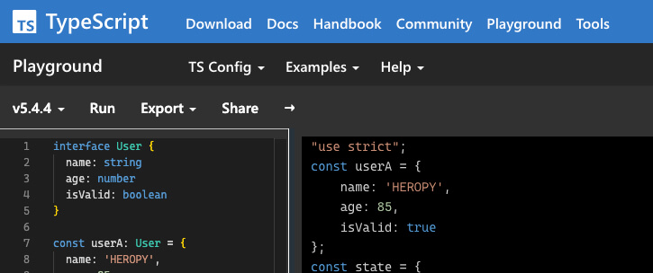

### Vite

타입스크립트를 빠르게 테스트하고 싶다면 [Vite](https://vitejs.dev/)가 좋은 선택입니다.
다음과 같이 간단하게 프로젝트를 구성합니다.

```bash
npm create vite@latest typescript-test
  ✔ Select a framework: Vanilla
  ✔ Select a variant: TypeScript
cd typescript-test
npm install
npm run dev
## Server running at http://localhost:5173
```

### Parcel

[Parcel 번들러](https://ko.parceljs.org/getting_started.html)를 통해서 처음부터 구성하는 것도 가능합니다.
다음과 같이 프로젝트를 구성합니다.

```bash
$ mkdir typescript-test
$ cd typescript-test
$ npm init -y
$ npm install -D parcel typescript
```

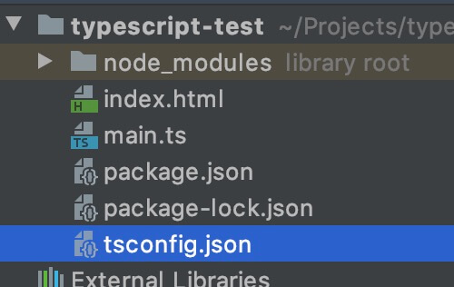

`tsconfig.json` 파일을 생성하고 원하는 옵션을 추가합니다.
다음은 예시입니다.

```json
{
  "compilerOptions": {
    "strict": true
  },
  "exclude": [
    "node_modules"
  ]
}
```

`main.ts` 파일을 생성하고 원하는 타입스크립트 코드를 입력합니다.

```ts
function add(a: number, b: number) {
  return a + b
}
const sum: number = add(1, 2)
console.log(sum)
```

`index.html` 파일을 생성하고 다음과 같이 `.js`가 아닌 `.ts` 파일을 연결합니다.
Parcel 번들러가 빌드시 자동으로 타입스크립트를 컴파일합니다.

```html
<!doctype html>
<html>
<head>
  <meta charset="UTF-8">
  <title>TypeScript Test</title>
</head>
<body>
  <script type="module" src="main.ts"></script>
</body>
</html>
```

마지막으로 다음과 같이 진입 파일로 `index.html`를 지정하고 Parcel 번들러로 빌드합니다.

```bash
$ npx parcel index.html
## Server running at http://localhost:1234
```

### TS Node

NodeJS 환경에서 테스트하고 싶다면 [TS Node](https://github.com/TypeStrong/ts-node)를 사용하세요.
다음과 같이 간단하게 프로젝트를 구성합니다.

```bash
$ mkdir typescript-test
$ cd typescript-test
$ npm init -y
$ npm install -D typescript @types/node ts-node
```

> [`@types/node`](https://github.com/DefinitelyTyped/DefinitelyTyped)는 Node.js API를 위한 타입 선언 모듈입니다.
> `@types`에 대한 자세한 내용은 '모듈' 파트를 참고하세요.

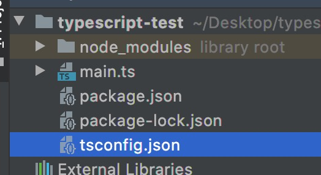

`tsconfig.json` 파일을 생성하고 원하는 옵션을 추가합니다.
다음은 예시입니다.

```json
{
  "compilerOptions": {
    "strict": true,
    "module": "CommonJS"
  },
  "exclude": [
    "node_modules"
  ]
}
```

`main.ts` 파일을 생성하고 원하는 타입스크립트 코드를 입력합니다.

```ts
console.log('TypeScript on NodeJS!')
```

TS Node를 사용해 `main.ts`를 실행합니다.

```bash
$ npx ts-node main.ts
## TypeScript on NodeJS!
```

## 타입

### 타입 지정

타입스크립트는 일반 변수, 매개 변수(Parameter), 객체 속성(Property) 등에 `: TYPE`과 같은 형태로 타입을 지정할 수 있습니다.

```ts
function someFunc(a: TYPE_A, b: TYPE_B): TYPE_RETURN {
  return a + b
}
let some: TYPE_SOME = someFunc(1, 2)
```

다음 예시를 보면,
`add` 함수의 매개 변수 `a`와 `b`는 `number` 타입이어야 한다고 지정했고,
그렇게 실행된 함수의 반환 값은 숫자로 추론(Inference)되기 때문에 변수 `sum`도 `number` 타입이어야 한다고 지정했습니다.

```ts
function add(a: number, b: number) {
  return a + b
}
const sum: number = add(1, 2)
console.log(sum) // 3
```

자바스크립트로 컴파일한 결과는 다음과 같습니다.

```js
"use strict";
function add(a, b) {
  return a + b;
}
const sum = add(1, 2);
console.log(sum);
```

### 타입 에러

만약 다음과 같이 변수 `sum`을 `number`가 아닌 `string` 타입이어야 한다고 지정했다면, 컴파일조차 하지 않고 코드를 작성하는 시점에서 에러가 발생합니다.

```ts --line-error=4
function add(a: number, b: number) {
  return a + b
}
const sum: string = add(1, 2)
console.log(sum)
```

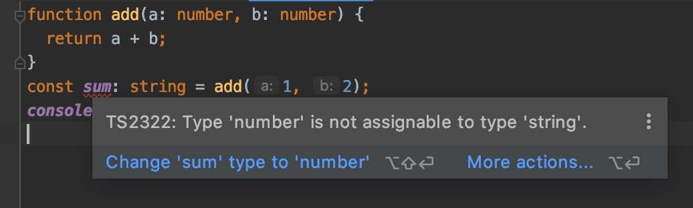
<div class="image-caption">TS2322 Error</div>

위 이미지에서 [TS2322](https://www.google.com/search?newwindow=1&sxsrf=ACYBGNQeWU6z1K7DXQ9oM0VR4gV-KPSd2Q%3A1580379601357&ei=0a0yXpuyFZyCr7wPi96owAU&q=TS2322&oq=TS2322&gs_l=psy-ab.3..35i39j0j0i203l4j0j0i203l3.15216190.15216190..15216895...0.0..0.114.321.1j2......0....2j1..gws-wiz.......0i67j0i7i30j0i7i10i30j0i5i30j0i5i10i30.1W9DJiS_O3c&ved=0ahUKEwjb3v7ljKvnAhUcwYsBHQsvClgQ4dUDCAs&uact=5)라는 에러 코드를 볼 수 있으며, 이를 검색하면 쉽게 에러 코드에 대한 정보를 얻을 수 있습니다.


### 타입 선언

#### Boolean

단순한 참(`true`)/거짓(`false`) 값을 나타냅니다.

```ts
let isBoolean: boolean
let isDone: boolean = false
```

#### Number

모든 부동 소수점 값을 사용할 수 있습니다.
ES6에 도입된 2진수 및 8진수 리터럴도 지원합니다.

```ts
let num: number
let integer: number = 6
let float: number = 3.14
let hex: number = 0xf00d // 61453
let binary: number = 0b1010 // 10
let octal: number = 0o744 // 484
let infinity: number = Infinity
let nan: number = NaN
```

#### String

문자열을 나타냅니다.
작은따옴표(`'`), 큰따옴표(`"`) 뿐만 아니라 ES6의 템플릿 문자열도 지원합니다.

```ts
let str: string
let red: string = 'Red'
let green: string = "Green"
let myColor: string = `My color is ${red}.`
let yourColor: string = 'Your color is' + green
```

#### Array

순차적으로 값을 가지는 일반 배열을 나타냅니다.
배열은 다음과 같이 두 가지 방법으로 타입을 선언할 수 있습니다.

```ts
// 문자열만 가지는 배열
let fruits: string[] = ['Apple', 'Banana', 'Mango']
// Or
let fruits: Array<string> = ['Apple', 'Banana', 'Mango']

// 숫자만 가지는 배열
let oneToSeven: number[] = [1, 2, 3, 4, 5, 6, 7]
// Or
let oneToSeven: Array<number> = [1, 2, 3, 4, 5, 6, 7]
```

유니언 타입(다중 타입)의 '문자열과 숫자를 동시에 가지는 배열'도 선언할 수 있습니다.

```ts
let array: (string | number)[] = ['Apple', 1, 2, 'Banana', 'Mango', 3]
// Or
let array: Array<string | number> = ['Apple', 1, 2, 'Banana', 'Mango', 3]
```

배열이 가지는 항목의 값을 단언할 수 없다면 `unknown`를 사용할 수 있습니다.

```ts
let someArr: unknown[] = [0, 1, {}, [], 'str', false]
```

인터페이스(Interface)나 커스텀 타입(Type)을 사용할 수도 있습니다.

```ts
interface IUser {
  name: string,
  age: number,
  isValid: boolean
}
let userArr: IUser[] = [
  {
    name: 'Neo',
    age: 85,
    isValid: true
  },
  {
    name: 'Lewis',
    age: 52,
    isValid: false
  },
  {
    name: 'Evan',
    age: 36,
    isValid: true
  }
]
```

유용하진 않지만, 다음과 같이 특정한 값으로 타입을 대신해 작성할 수도 있습니다.

```ts --line-error=4
let array = 10[]
array = [10]
array.push(10)
array.push(11) // Error - TS2345
```

읽기 전용 배열을 생성할 수도 있습니다.
`readonly` 키워드나 `ReadonlyArray` 타입을 사용하면 됩니다.

```ts --line-error=4,5,7,8
let arrA: readonly number[] = [1, 2, 3, 4]
let arrB: ReadonlyArray<number> = [0, 9, 8, 7]

arrA[0] = 123 // Error - TS2542: Index signature in type 'readonly number[]' only permits reading.
arrA.push(123) // Error - TS2339: Property 'push' does not exist on type 'readonly number[]'.

arrB[0] = 123 // Error - TS2542: Index signature in type 'readonly number[]' only permits reading.
arrB.push(123) // Error - TS2339: Property 'push' does not exist on type 'readonly number[]'.
```

#### Tuple

Tuple 타입은 배열과 매우 유사합니다.
차이점이라면 <strong>정해진 타입의 고정된 길이(length) 배열</strong>을 표현합니다.

```ts --line-error=3,4
let tuple: [string, number]
tuple = ['a', 1]
tuple = ['a', 1, 2] // Error - TS2322
tuple = [1, 'a'] // Error - TS2322
```

다음과 같이 데이터를 개별 변수로 지정하지 않고, 단일 Tuple 타입으로 지정해 사용할 수 있습니다.

```ts
// Variables
let userId: number = 1234
let userName: string = 'HEROPY'
let isValid: boolean = true

// Tuple
let user: [number, string, boolean] = [1234, 'HEROPY', true]
console.log(user[0]) // 1234
console.log(user[1]) // 'HEROPY'
console.log(user[2]) // true
```

나아가 위 방식을 활용해 다음과 같은 Tuple 타입의 배열(2차원 배열)을 사용할 수 있습니다.

```ts
let users: [number, string, boolean][]
// Or
// let users: Array<[number, string, boolean]>

users = [[1, 'Neo', true], [2, 'Evan', false], [3, 'Lewis', true]]
```

역시 값으로 타입을 대신할 수도 있습니다.

```ts --line-error=4
let tuple: [1, number]
tuple = [1, 2]
tuple = [1, 3]
tuple = [2, 3] // Error - TS2322: Type '2' is not assignable to type '1'.
```

Tuple은 <strong>정해진 타입의 고정된 길이 배열</strong>을 표현하지만, 이는 할당(Assign)에 국한됩니다.
`.push()`나 `.splice()` 등을 통해 값을 넣는 행위는 막을 수 없습니다.

```ts --line-error=6
let tuple: [string, number]
tuple = ['a', 1]
tuple = ['b', 2]
tuple.push(3)
console.log(tuple) // ['b', 2, 3]
tuple.push(true) // Error - TS2345: Argument of type 'true' is not assignable to parameter of type 'string | number'.
```

배열에서 사용한 것과 같이 `readonly` 키워드를 사용해 읽기 전용 튜플을 생성할 수도 있습니다.

```ts --line-error=2
let a: readonly [string, number] = ['Hello', 123]
a[0] = 'World' // Error - TS2540: Cannot assign to '0' because it is a read-only property.
```

#### Enum

Enum은 숫자 혹은 문자열 값 집합에 이름(Member)을 부여할 수 있는 타입으로, 값의 종류가 일정한 범위로 정해져 있는 경우 유용합니다.

기본적으로 `0`부터 시작하며 값은 `1`씩 증가합니다.

```ts
enum Week {
  Sun,
  Mon,
  Tue,
  Wed,
  Thu,
  Fri,
  Sat
}
```

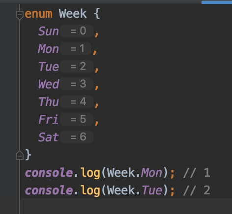
<div class="image-caption">WebStorm을 통해 보여지는 enum</div>

수동으로 값을 변경할 수 있으며, 값을 변경한 부분부터 다시 `1`씩 증가합니다.


Enum 타입의 재미있는 부분은 역방향 매핑(Reverse Mapping)을 지원한다는 것입니다.
이것은 열거된 멤버(`Sun`, `Mon` 같은)로 값에, 값으로 멤버에 접근할 수 있다는 것을 의미합니다.

`Week`를 콘솔로 출력합니다.

```ts
enum Week {
  // ...
}
console.log(Week)
console.log(Week.Sun) // 0
console.log(Week['Sun']) // 0
console.log(Week[0]) // 'Sun'
```

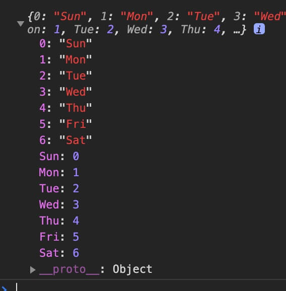
<div class="image-caption">역방향 매핑(Reverse Mapping)</div>

추가로, Enum은 숫자 값 열거뿐만아니라 다음과 같이 문자열 값으로 초기화할 수 있습니다.
이 방법은 역방향 매핑(Reverse Mapping)을 지원하지 않으며 개별적으로 초기화해야 하는 단점이 있습니다.

```ts
enum Color {
  Red = 'red',
  Green = 'green',
  Blue = 'blue'
}
console.log(Color.Red) // red
console.log(Color['Green']) // green
```

#### Any

Any는 모든 타입을 의미합니다.
따라서 일반적인 자바스크립트 변수와 동일하게 어떤 타입의 값도 할당할 수 있습니다.
외부 자원을 활용해 개발할 때 불가피하게 타입을 단언할 수 없는 경우, 유용할 수 있습니다.

```ts
let any: any = 123
any = 'Hello world'
any = {}
any = null
```

다양한 값을 포함하는 배열을 나타낼 때 사용할 수도 있습니다.

```ts
const list: any[] = [1, true, 'Anything!']
```

강한 타입 시스템의 장점을 유지하기 위해 Any 사용을 엄격하게 금지하려면, 컴파일 옵션 `"noImplicitAny": true`를 통해 Any 사용 시 에러를 발생시킬 수 있습니다.

#### Unknown

Any와 같이 최상위 타입인 Unknown은 알 수 없는 타입을 의미합니다.
Any와 같이 Unknown에는 어떤 타입의 값도 할당할 수 있지만, Unknown을 다른 타입에는 할당할 수 없습니다.

/// message-box --icon=info
Unknown은 [타입 단언](/p/WhqSC8#h3_%ED%83%80%EC%9E%85_%EB%8B%A8%EC%96%B8Assertions)이나 [타입 가드](/p/WhqSC8#h3_%ED%83%80%EC%9E%85_%EA%B0%80%EB%93%9CGuards)를 필요로 하기 때문에, Any 보다 더 안전합니다.
///

```ts
let a: any = 123
let u: unknown = 123

let v1: boolean = a // 모든 타입(any)은 어디든 할당할 수 있습니다.
let v2: number = u // 알 수 없는 타입(unknown)은 모든 타입(any)을 제외한 다른 타입에 할당할 수 없습니다.
let v3: any = u // OK!
let v4: number = u as number // 타입을 단언하면 할당할 수 있습니다.
```

#### Object

기본적으로 `typeof` 연산자가 `"object"`로 반환하는 모든 타입을 나타냅니다.

/// message-box --icon=info
컴파일러 옵션에서 엄격한 타입 검사(`strict`)를 `true`로 설정하면, `null`은 포함하지 않습니다.
///

```ts
let obj: object = {}
let arr: object = []
let func: object = function () {}
let nullValue: object = null
let date: object = new Date()
// ...
```

여러 타입의 상위 타입이기 때문에 그다지 유용하지 않습니다.
보다 정확하게 타입 지정을 하기 위해 다음과 같이 객체 속성(Properties)들에 대한 타입을 개별적으로 지정할 수 있습니다.

```ts --line-error=8,9
let userA: { name: string, age: number } = {
  name: 'HEROPY',
  age: 123
}

let userB: { name: string, age: number } = {
  name: 'HEROPY',
  age: false, // Error
  email: 'thesecon@gmail.com' // Error
}
```

재사용을 위해, `interface`나 `type`을 사용하는 것이 좋습니다.

```ts --line-error=13,14
interface IUser {
  name: string
  age: number
}

let userA: IUser = {
  name: 'HEROPY',
  age: 123
}

let userB: IUser = {
  name: 'HEROPY',
  age: false, // Error
  email: 'thesecon@gmail.com' // Error
}
```

#### Null, Undefined

기본적으로 Null과 Undefined는 모든 타입의 하위 타입으로, 다음과 같이 각 타입에 할당할 수 있습니다.
심지어 서로의 타입에도 할당 가능합니다.

```ts
let num: number = undefined
let str: string = null
let obj: { a: 1, b: false } = undefined
let arr: any[] = null
let und: undefined = null
let nul: null = undefined
let voi: void = null
// ...
```

이는 컴파일 옵션 `"strictNullChecks": true`을 통해 엄격하게 Null과 Undefined 서로의 타입까지 더 이상 할당할 수 없게 합니다.
단, Void에는 Undefined를 할당할 수 있습니다.

```ts
let voi: void = undefined // ok
```

#### Void

Void는 일반적으로 값을 반환하지 않는 함수에서 사용합니다.
`: void` 위치는 함수가 반환 타입을 명시하는 곳입니다.

/// message-box --icon=info
값을 반환하지 않는 함수를 보이드 함수(Void Function)라고 합니다.
///

```ts
function hello(msg: string): void {
  console.log(`Hello ${msg}`)
}
```

값을 반환하지 않는 함수는 실제로는 `undefined`를 반환합니다.

```ts
function hello(msg: string): void {
  console.log(`Hello ${msg}`)
}
const hi: void = hello('world') // Hello world
console.log(hi) // undefined
```

#### Never

Never은 <strong>절대 발생하지 않을 값</strong>을 나타내며, 어떠한 타입도 적용할 수 없습니다.

```ts
function error(message: string): never {
  throw new Error(message)
}
```

보통 다음과 같이 빈 배열을 타입으로 잘못 선언한 경우, Never를 볼 수 있습니다.

```ts --line-error=2
const never: [] = []
never.push(3) // Error - TS2345: Argument of type '3' is not assignable to parameter of type 'never'.
```

#### Union

2개 이상의 타입을 허용하는 경우, 이를 유니언(Union)이라고 합니다.
`|`(vertical bar)를 통해 타입을 구분하며, `()`는 선택 사항입니다.

```ts --line-error=4
let union: (string | number)
union = 'Hello type!'
union = 123
union = false // Error - TS2322: Type 'false' is not assignable to type 'string | number'.
```

#### Intersection


`&`(ampersand)를 사용해 2개 이상의 타입을 조합하는 경우, 이를 인터섹션(Intersection)이라고 합니다.
인터섹션은 새로운 타입을 생성하지 않고 기존의 타입들을 조합할 수 있기 때문에 유용하지만, 자주 사용되는 방법은 아닙니다.

> 위에서 살펴본 유니언을 마치 '또는(Or)'과 같이 이해할 수 있다면, 인터섹션은 '그리고(And)'와 같이 이해할 수 있습니다.

```ts --line-error=12
// 기존 타입들이 조합 가능하다면 인터섹션을 활용할 수 있습니다.
interface IUser {
  name: string
  age: number
}
interface IValidation {
  isValid: boolean
}
const heropy: IUser = {
  name: 'Heropy',
  age: 36,
  isValid: true // Error -  TS2322: Type '{ name: string; age: number; isValid: boolean; }' is not assignable to type 'IUser'.
}
const neo: IUser & IValidation = {
  name: 'Neo',
  age: 85,
  isValid: true
}
```

#### Function

함수는 선언과 동시에 타입을 지정할 수 있습니다.

```ts --line-active=1
function add(a: number, b: number): number {
  return a + b
}
```

필요한 경우, 다음과 같이 별도의 화살표 함수 방식으로 타입을 지정할 수도 있습니다.
인수의 타입과 반환 값의 타입을 입력합니다.

```ts --line-active=2,8
// myFunc는 2개의 숫자 타입 인수를 가지고, 숫자 타입을 반환하는 함수.
let myFunc: (arg1: number, arg2: number) => number
myFunc = function (x, y) {
  return x + y
}

// 인수가 없고, 반환도 없는 경우.
let yourFunc: () => void
yourFunc = function () {
  console.log('Hello world~')
}
```

비동기 함수는 Promise 인스턴스를 반환하기 때문에, 다음과 같이 제네릭으로 반환 타입을 지정합니다.

```ts --line-active=5
type Movie = {
  title: string
  poster: string
}
async function getMovie(title: string): Promise<Movie[]> {
  const res = fetch(`https://gettitles.movie/${title}`)
  return await res.json()
}
```

### 타입 추론

명시적으로 타입 선언이 되어있지 않은 경우, 타입스크립트는 타입을 추론(Inference)해 제공합니다!
개념은 매우 단순하지만, 아주 중요합니다!

> [추론]: 어떠한 판단을 근거로 삼아 다른 판단을 이끌어 냄.

```ts --line-error=2
let num = 12
num = 'Hello type!' // TS2322: Type '"Hello type!"' is not assignable to type 'number'.
```

변수 `num`을 초기화하면서 숫자 `12`를 할당해 Number 타입으로 추론되었고, 따라서 `'Hello type!'`이라는 String 타입의 값은 할당할 수 없기 때문에 에러가 발생합니다.

이렇게 타입스크립트가 타입을 추론하는 경우는 다음과 같습니다.

- 초기화된 변수
- 기본값이 설정된 매개 변수
- 반환 값이 있는 함수

```ts
// 초기화된 변수 `num`
let num = 12

// 기본값이 설정된 매개 변수 `b`
function add(a: number, b: number = 2): number {
  // 반환 값(`a + b`)이 있는 함수
  return a + b
}
```

/// message-box --icon=warning
타입 추론이 엄격하지 않은 타입 선언을 의미하는 것은 아닙니다.
따라서 이를 활용해 모든 곳에 타입을 명시할 필요는 없으며, 많은 경우 더 좋은 코드 가독성을 제공할 수 있습니다.
///

### 타입 단언

타입스크립트가 타입 추론을 통해 판단할 수 있는 타입의 범주를 넘는 경우, 더 이상 추론하지 않도록 지시할 수 있습니다.
이를 '타입 단언'(Type Assertions)이라고 하며, 이는 프로그래머가 타입스크립트보다 타입에 대해 더 잘 이해하고 있는 상황을 의미합니다.

> [단언]: 주저하지 아니하고 딱 잘라 말함.

다음 예제를 살펴봅시다.

함수의 매개 변수 `val`은 유니언 타입으로 문자열(String)이거나 숫자(Number)일 수 있습니다.
그리고 매개 변수 `isNumber`는 불린(Boolean)이며, 이름을 통해 숫자 여부를 확인하는 값이라는 것을 (우리는) 추론할 수 있습니다.
따라서 우리는 `isNumber`가 `true`일 경우 `val`은 숫자일 것이고, 이에 `toFixed`를 사용할 수 있음을 확실히 알 수 있습니다.
하지만 타입스크립트는 'isNumber'라는 이름만으로 위 내용을 추론할 수 없기 때문에 "`val`이 문자열인 경우 `toFixed`를 사용할 수 없다"고 (컴파일 단계에서) 다음과 같은 에러를 반환합니다.

```ts --line-error=4
function someFunc(val: string | number, isNumber: boolean) {
  // some logics
  if (isNumber) {
    val.toFixed(2) // Error - TS2339: ... Property 'toFixed' does not exist on type 'string'.
  }
}
```

따라서 우리는 `isNumber`가 `true`일 때 `val`이 숫자임을 다음과 같이 2가지 방식으로 단언할 수 있습니다.
두 번째 방식(`<number>val`)은 JSX를 사용하는 경우 특정 구문 파싱에서 문제가 발생할 수 있으며, 결과적으로 `.tsx` 파일에서는 전혀 사용할 수 없습니다.

```ts
function someFunc(val: string | number, isNumber: boolean) {
  // some logics
  if (isNumber) {
    // 1. 변수 as 타입
    (val as number).toFixed(2)
    // Or
    // 2. <타입>변수
    // (<number>val).toFixed(2)
  }
}
```

/// message-box --icon=warning
타입 단언은 프로그래머가 타입스크립트에게 __*"내가 타입을 확신하니까 나를 믿어!"*__ 라고 알려주는 것과 같습니다.
///

#### Non-null 단언 연산자

`!`를 사용하는 Non-null 단언 연산자(Non-null assertion operator)를 통해 피연산자가 Nullish(`null`이나 `undefined`) 값이 아님을 단언할 수 있는데, 변수나 속성에서 간단하게 사용할 수 있기 때문에 유용합니다.

다음 예제 중 `fnA` 함수를 살펴보면, 매개 변수 `x`는 함수 내에서 `toFixed`를 사용하는 숫자 타입으로 처리되지만 `null`이나 `undefined`일 수 있기 때문에 에러가 발생합니다.
이를 타입 단언이나 `if` 조건문으로 해결할 수도 있지만, 마지막 함수와 같이 `!`를 사용하는 Non-null 단언 연산자를 이용해 간단하게 정리할 수 있습니다.

```ts
// Error - TS2533: Object is possibly 'null' or 'undefined'.
function fnA(x: number | null | undefined) {
  return x.toFixed(2)
}

// if statement
function fnD(x: number | null | undefined) {
  if (x) {
    return x.toFixed(2)
  }
}

// Type assertion
function fnB(x: number | null | undefined) {
  return (x as number).toFixed(2)
}
function fnC(x: number | null | undefined) {
  return (<number>x).toFixed(2)
}

// Non-null assertion operator
function fnE(x: number | null | undefined) {
  return x!.toFixed(2)
}
```

특히 컴파일 환경에서 체크하기 어려운 DOM 사용에서 유용합니다.
물론 일반적인 타입 단언을 사용할 수도 있습니다.

```ts
// Error - TS2531: Object is possibly 'null'.
document.querySelector('.menu-item').innerHTML

// Type assertion
(document.querySelector('.menu-item') as HTMLDivElement).innerHTML
(<HTMLDivElement>document.querySelector('.menu-item')).innerHTML

// Non-null assertion operator
document.querySelector('.menu-item')!.innerHTML
```

### 타입 가드

다음 예제와 같이 `val`의 타입을 매번 보장하기 위해 타입 단언을 여러 번 사용하게 되는 경우가 있습니다.

```ts
function someFunc(val: string | number, isNumber: boolean) {
  if (isNumber) {
    (val as number).toFixed(2)
    isNaN(val as number)
  } else {
    (val as string).split('')
    (val as string).toUpperCase()
    (val as string).length
  }
}
```

이 경우 타입 가드를 제공하면 타입스크립트가 추론 가능한 특정 범위(scope)에서 타입을 보장할 수 있습니다.
타입 가드는 `NAME is TYPE` 형태의 <strong>타입 술부(Predicate)를 반환 타입으로 명시한 함수</strong>입니다.
다음 예제에서 타입 술부는 `val is number`입니다.
타입 단언이 없어지니 훨씬 깔끔합니다.

> [술부]: 주어의 상태, 성질 따위를 서술하는 말.

```ts
// 타입 가드
function isNumber(val: string | number): val is number {
  return typeof val === 'number'
}

function someFunc(val: string | number) {
  if (isNumber(val)) {
    val.toFixed(2)
    isNaN(val)
  } else {
    val.split('')
    val.toUpperCase()
    val.length
  }
}
```

위 방식뿐만 아니라 제공 가능한 타입 가드가 더 있습니다.
`typeof`, `in` 그리고 `instanceof` 연산자를 직접 사용하는 타입 가드입니다.
비교적 단순한 로직에서 추천되는 방식입니다.

> `typeof` 연산자는 `number`, `string`, `boolean`, 그리고 `symbol`만 타입 가드로 인식할 수 있습니다.
> `in` 연산자의 우변 객체(`val`)는 `any` 타입이어야 합니다.

```ts
// 기존 예제와 같이 `isNumber`를 제공(추상화)하지 않아도 `typeof` 연산자를 직접 사용하면 타입 가드로 동작합니다.
// https://developer.mozilla.org/ko/docs/Web/JavaScript/Reference/Operators/typeof
function someFuncTypeof(val: string | number) {
  if (typeof val === 'number') {
    val.toFixed(2)
    isNaN(val)
  } else {
    val.split('')
    val.toUpperCase()
    val.length
  }
}

// 별도의 추상화 없이 `in` 연산자를 사용해 타입 가드를 제공합니다.
// https://developer.mozilla.org/ko/docs/Web/JavaScript/Reference/Operators/in
function someFuncIn(val: any) {
  if ('toFixed' in val) {
    val.toFixed(2)
    isNaN(val)
  } else if ('split' in val) {
    val.split('')
    val.toUpperCase()
    val.length
  }
}

// 역시 별도의 추상화 없이 `instanceof` 연산자를 사용해 타입 가드를 제공합니다.
// https://developer.mozilla.org/ko/docs/Web/JavaScript/Reference/Operators/instanceof
class Cat {
  meow() {}
}
class Dog {
  woof() {}
}
function sounds(ani: Cat | Dog) {
  if (ani instanceof Cat) {
    ani.meow()
  } else {
    ani.woof()
  }
}
```

### 타입 만족

타입스크립트에서는 객체의 타입을 만족하는지 확인하는 `satisfies` 키워드를 제공합니다.
`name`과 `age` 속성이 필수인 `User` 인터페이스를 기준으로 몇 가지 예제를 살펴봅시다.

```ts
interface User {
  name: string
  age: number
}
```

다음 예제에서, `userA`에 할당하는 객체는 `User` 타입과 일치하지 않지만, 타입 단언으로 에러가 발생하지 않습니다.
`userB`는 선언을 통해 `User` 타입이어야 하므로, `User` 타입과 일치하지 않는 객체는 할당할 수 없어 에러가 발생합니다.
`userC`에 할당하는 객체는 `satisfies` 키워드로 `User` 타입을 만족하는지 확인하며, 만족하지 않기 때문에 에러가 발생합니다.
결국, 타입 단언은 개발자의 실수로 안전하지 않을 수 있고, 타입을 직접 선언하는 것이 가장 안전하며, `satisfies` 키워드는 타입 만족만 확인하니 그다지 유용해 보이지 않습니다.

```ts --line-error=7,14
// Pass.. 안전하지 않은 타입 '단언'..
const userA = { 
  name: 'Neo' 
} as User

// Error! 안전한 타입 '선언'!
const userB: User = {
  name: 'Neo' 
}

// Error! 안전한 타입 '만족'!
const userC = { 
  name: 'Neo' 
} satisfies User
```

다음 예제에서, `userD`의 `info` 속성에 할당하는 객체는 `User` 타입과 일치하지 않지만, 타입 단언으로 에러가 발생하지 않습니다.
`userE`는 `info` 속성이 `User` 타입이길 원하지만, 문법적으로 객체 속성에 직접 타입을 선언할 수는 없습니다.
`userF`는 `info` 속성에 할당하는 객체가 `satisfies` 키워드로 `User` 타입을 만족하는지 확인하며, 만족하지 않기 때문에 에러가 발생합니다.
결국, `satisfies` 키워드는 객체 내부 타입을 만족하는지 확인할 수 있기에 유용합니다.

```ts --line-error=26,27
// Pass.. 안전하지 않은 내부 객체 타입 '단언'..
const userD = { 
  info: { 
    name: 'Neo', 
    age: 85,
    isValid: true
  } as User, 
  photo: null 
}

// Pass.. 문법적으로 '선언'할 수 없는 내부 객체 타입..
const userE = { 
  info: { 
    name: 'Neo', 
    age: 85, 
    isValid: true 
  }, 
  photo: null 
}

// Error! 안전한 내부 객체 타입 '만족'!
const userF = { 
  info: { 
    name: 'Neo', 
    age: 85, 
    isValid: true 
  } satisfies User,
  photo: null 
}
```

주의할 점은 `satisfies` 키워드는 대상의 타입 만족을 확안할 뿐, 타입 지정하는 것은 아니기에 다음과 같이 사용할 수 있습니다.
`satisfies`는 타입 만족을 확인하며, `as`는 타입을 지정(단언)하는 역할을 합니다.

```ts --line-error=6,7
// Error! 안전한 내부 객체 타입 '만족'! 후 '단언'
const userF = { 
  info: { 
    name: 'Neo', 
    age: 85, 
    isValid: true 
  } satisfies User as User,
  photo: null 
}
```

## 인터페이스

인터페이스(Interface)는 타입스크립트 여러 객체를 정의하는 일종의 규칙이며 구조입니다.
다음과 같이 `interface` 키워드와 함께 사용합니다.

/// message-box --icon=info
'IUser'에서 'I'는 Interface를 의미하는 별칭으로 사용했습니다.
///

```ts --line-error=13
interface IUser {
  name: string
  age: number
  isAdult: boolean
}

let user1: IUser = {
  name: 'Neo',
  age: 123,
  isAdult: true
}

// Error - TS2741: Property 'isAdult' is missing in type '{ name: string; age: number; }' but required in type 'IUser'.
let user2: IUser = {
  name: 'Evan',
  age: 456
}
```

`;`, `,` 기호를 사용하거나 생략할 수 있습니다.

```ts
interface IUser {
  name: string,
  age: number
}
// Or
interface IUser {
  name: string;
  age: number;
}
// Or
interface IUser {
  name: string
  age: number
}
```

다음과 같이 속성에 `?`를 사용하면 선택적 속성으로 정의할 수 있습니다.
선택적 속성(Optional properties)에 대해선 Optional 파트에서 따로 설명하지만, 간단하게 표현하면 '필수가 아닌 속성으로 정의'하는 방법을 말합니다.

```ts
interface IUser {
  name: string
  age: number
  isAdult?: boolean // Optional property
}

// `isAdult`를 초기화하지 않아도 에러가 발생하지 않습니다.
let user: IUser = {
  name: 'Neo',
  age: 123
}
```

### 읽기 전용 속성

`readonly` 키워드를 사용하면 초기화된 값을 유지해야 하는 <strong>읽기 전용 속성을 정의</strong>할 수 있습니다.

```ts --line-error=13
interface IUser {
  readonly name: string
  age: number
}

// 초기화
let user: IUser = {
  name: 'Neo',
  age: 36
}

user.age = 85 // Ok
user.name = 'Evan' // Error - TS2540: Cannot assign to 'name' because it is a read-only property.
```

만약 모든 속성이 `readonly`일 경우, [유틸리티(Utility)](https://www.typescriptlang.org/docs/handbook/utility-types.html#readonlyt)나 단언(Assertion) 타입을 활용할 수 있습니다.

```ts --line-error=10,11,23,24,32,33
// All readonly properties
interface IUser {
  readonly name: string
  readonly age: number
}
let user: IUser = {
  name: 'Neo',
  age: 36
}
user.age = 85 // Error
user.name = 'Evan' // Error


// Readonly Utility
interface IUser {
  name: string
  age: number
}
let user: Readonly<IUser> = {
  name: 'Neo',
  age: 36
}
user.age = 85 // Error
user.name = 'Evan' // Error


// Type assertion
let user = {
  name: 'Neo',
  age: 36
} as const
user.age = 85 // Error
user.name = 'Evan' // Error
```

### 함수 타입

함수 타입을 인터페이스로 정의하는 경우, 호출 시그니처(Call signature)라는 것을 사용합니다.
호출 시그니처는 다음과 같이 함수의 매개 변수(parameter)와 반환 타입을 지정합니다.

```ts
interface IName {
  (PARAMETER: PARAM_TYPE): RETURN_TYPE // Call signature
}
```

간단한 예시를 살펴봅시다.
인터페이스 `IGetUser`를 통해 함수 타입을 정의했으며, 이는 `name` 매개 변수를 하나 가지며(이름이 일치할 필요는 없습니다), `IUser` 타입을 반환해야 합니다.

```ts
interface IUser {
  name: string
}
interface IGetUser {
  (name: string): IUser
}

// 매개 변수 이름이 인터페이스와 일치할 필요가 없습니다.
// 또한 타입 추론을 통해 매개 변수를 순서에 맞게 암시적 타입으로 제공할 수 있습니다.
const getUser: IGetUser = function (n) { // n is name: string
  // Find user logic..
  // ...
  return user
}
getUser('Heropy')
```

### 클래스 타입

인터페이스로 클래스를 정의하는 경우, `implements` 키워드를 사용합니다.

```ts
interface IUser {
  name: string
  getName(): string
}

class User implements IUser {
  constructor(public name: string) {}
  getName() {
    return this.name
  }
}

const neo = new User('Neo')
neo.getName() // Neo
```

기본적인 사용법은 어렵지 않습니다.
그런데 만약 정의한 클래스를 인수로 사용하는 경우 다음과 같은 문제가 발생할 수 있습니다.
다음 예제에서 인터페이스 `ICat`은 호출 가능한 구조가 아니기 때문입니다.

```ts --line-error=10
interface ICat {
  name: string
}

class Cat implements ICat {
  constructor(public name: string) {}
}

function makeKitten(c: ICat, n: string) {
  return new c(n) // Error - TS2351: This expression is not constructable. Type 'ICat' has no construct signatures.
}
const kitten = makeKitten(Cat, 'Lucy')
console.log(kitten)
```

이를 위해 구성 시그니처(Construct signature)를 제공할 수 있습니다.
구성 시그니처는 위에서 살펴본 호출 시그니처와 비슷하지만, `new` 키워드를 사용해야 합니다.

```ts
interface IName {
  new (PARAMETER: PARAM_TYPE): RETURN_TYPE // Construct signature
}
```

위에서 봤던 예제를 다음과 같이 수정합니다.
`ICatConstructor`라는 구성 시그니처를 가지는 호출 가능한 인터페이스를 정의하면, 문제없이 동작하는 것을 확인할 수 있습니다.

```ts
interface ICat {
  name: string
}
interface ICatConstructor {
  new (name: string): ICat
}

class Cat implements ICat {
  constructor(public name: string) {}
}

function makeKitten(c: ICatConstructor, n: string) {
  return new c(n) // ok
}
const kitten = makeKitten(Cat, 'Lucy')
console.log(kitten)
```

비슷하지만 좀 더 재미있는 예제를 준비했습니다.
에러가 발생하는 부분을 확인하고 내용을 이해했다면 충분합니다.

```ts --line-error=38
interface IFullName {
  firstName: string
  lastName: string
}
interface IFullNameConstructor {
  new(firstName: string): IFullName // Construct signature
}


function makeSon(c: IFullNameConstructor, firstName: string) {
  return new c(firstName)
}
function getFullName(son: IFullName) {
  return `${son.firstName} ${son.lastName}`
}


// Anderson family
class Anderson implements IFullName {
  public lastName: string
  constructor (public firstName: string) {
    this.lastName = 'Anderson'
  }
}
const tomas = makeSon(Anderson, 'Tomas')
const jack = makeSon(Anderson, 'Jack')
getFullName(tomas) // Tomas Anderson
getFullName(jack) // Jack Anderson


// Smith family?
class Smith implements IFullName {
  public lastName: string
  constructor (public firstName: string, agentCode: number) {
    this.lastName = `Smith ${agentCode}`
  }
}
const smith = makeSon(Smith, 7) // Error - TS2345: Argument of type 'typeof Smith' is not assignable to parameter of type 'IFullNameConstructor'.
getFullName(smith)
```

### 인덱싱 가능 타입

우리는 인터페이스를 통해 특정 속성(메소드 등)의 타입을 정의할 순 있지만, 수많은 속성을 가지거나 단언할 수 없는 임의의 속성이 포함되는 구조에서는 기존의 방식만으론 한계가 있습니다. 이런 상황에서 유용한 인덱스 시그니처(Index signature)에 대해서 살펴봅시다.

`arr[2]`와 같이 '숫자'로 인덱싱하거나 `obj['name']`과 같이 '문자'로 인덱싱하는, 인덱싱 가능 타입(Indexable types)들이 있습니다.
이런 인덱싱 가능 타입들을 정의하는 인터페이스는 인덱스 시그니처(Index signature)라는 것을 가질 수 있습니다.
인덱스 시그니처는 다음 구조와 같이, 인덱싱에 사용할 인덱서(Indexer)의 이름과 타입 그리고 인덱싱 결과의 반환 값을 지정합니다.
<strong>인덱서의 타입은 `string`과 `number`만 지정</strong>할 수 있습니다.

```ts
interface INAME {
  [INDEXER_NAME: INDEXER_TYPE]: RETURN_TYPE // Index signature
}
```

> 배열(객체)에서 위치를 가리키는 숫자(문자)를 인덱스(index)라고 하며, 각 배열 요소(객체 속성)에 접근하기 위하여 인덱스를 사용하는 것을 인덱싱(indexing)이라고 합니다.(배열을 구성하는 각각의 값은 배열 요소(element)라고 합니다)

이해를 돕기 위해 다음 예제를 살펴보면,
인터페이스 `IItem`은 인덱스 시그니처를 가지고 있으며, 그 `IItem`을 타입(인터페이스)으로 하는 `item`이 있고, 그 `item`을 `item[0]`이나 `item[1]`과 같이 숫자로 인덱싱할 때 반환되는 값은 `'a'`나 `b'` 같은 문자여야 합니다.
`item`을 `item['0']`과 같이 문자로 인덱싱하는 경우 에러가 발생합니다.

```ts --line-error=7
interface IItem {
  [itemIndex: number]: string // Index signature
}
let item: IItem = ['a', 'b', 'c'] // Indexable type
console.log(item[0]) // 'a' is string.
console.log(item[1]) // 'b' is string.
console.log(item['0']) // Error - TS7015: Element implicitly has an 'any' type because index expression is not of type 'number'.
```

참고로 인덱싱 결과의 반환 타입으로 유니온을 사용하면 다음과 같이 활용할 수 있습니다.

```ts
interface IItem {
  [itemIndex: number]: string | boolean | number[]
}
let item: IItem = ['Hello', false, [1, 2, 3]]
console.log(item[0]) // Hello
console.log(item[1]) // false
console.log(item[2]) // [1, 2, 3]
```

이번에는 문자로 인덱싱하는 예제를 살펴봅시다.
인터페이스 `IUser`는 인덱스 시그니처를 가지고 있으며, 그 `IUser`를 타입(인터페이스)로 하는 `user`가 있고, 그 `user`를 `user['name']`, `user['email']` 또는 `user['isValid']`와 같이 문자로 인덱싱할 때 반환되는 값은 `'Neo'`나 `'thesecon@gmail.com'` 같은 문자 혹은 `true` 같은 불린이어야 합니다.
또한 `user[0]`과 같은 숫자로 인덱싱하는 경우나 `user['0']`과 같이 문자로 인덱싱하는 경우 모두 인덱싱 전에 숫자가 문자열로 변환되기 때문에 다음과 같이 값을 반환할 수 있습니다.

```ts
interface IUser {
  [userProp: string]: string | boolean
}
let user: IUser = {
  name: 'Neo',
  email: 'thesecon@gmail.com',
  isValid: true,
  0: false
}
console.log(user['name']) // 'Neo' is string.
console.log(user['email']) // 'thesecon@gmail.com' is string.
console.log(user['isValid']) // true is boolean.
console.log(user[0]) // false is boolean
console.log(user[1]) // undefined
console.log(user['0']) // false is boolean
```

인덱스 시그니처를 사용하면 다음 예제와 같이 인터페이스에 정의되지 않은 속성들을 사용할 때 유용합니다.
단, 해당 속성이 인덱스 시그니처에 정의된 반환 값을 가져야 함에 주의해야 합니다.
다음 예제에서 `isAdult` 속성은 정의된 `string`이나 `number` 타입을 반환하지 않지 않기 때문에 에러가 발생합니다.

```ts --line-error=10
interface IUser {
  [userProp: string]: string | number
  name: string
  age: number
}
let user: IUser = {
  name: 'Neo',
  age: 123,
  email: 'thesecon@gmail.com',
  isAdult: true // Error - TS2322: Type 'true' is not assignable to type 'string | number'.
}
console.log(user['name']) // 'Neo'
console.log(user['age']) // 123
console.log(user['email']) // thesecon@gmail.com
```

#### keyof

인덱싱 가능 타입에서 `keyof`를 사용하면 속성 이름을 타입으로 사용할 수 있습니다.
인덱싱 가능 타입의 속성 이름들이 <strong>유니온 타입으로 적용</strong>됩니다.
간단한 예제를 살펴보겠습니다.

```ts --line-error=8
interface ICountries {
  KR: '대한민국'
  US: '미국'
  CP: '중국'
}
let country: keyof ICountries // 'KR' | 'US' | 'CP'
country = 'KR' // ok
country = 'RU' // Error - TS2322: Type '"RU"' is not assignable to type '"KR" | "US" | "CP"'.
```

또한 `keyof`를 통한 인덱싱으로 타입의 개별 값에도 접근할 수 있습니다.

```ts --line-error=8
interface ICountries {
  KR: '대한민국'
  US: '미국'
  CP: '중국'
}
let country: ICountries[keyof ICountries] // ICountries['KR' | 'US' | 'CP']
country = '대한민국'
country = '러시아' // Error - TS2322: Type '"러시아"' is not assignable to type '"대한민국" | "미국" | "중국"'.
```

배열 데이터를 다루는 경우에도 `keyof`를 사용할 수 있습니다.
다음 예제는 배열 데이터를 변하지 않는 상수로 정의하고, `keyof`과 함께 인덱스 시그니처를 사용해 배열 내 모든 요소 타입을 반환하도록 합니다.
그러면, 배열 데이터의 모든 요소를 유니온 타입으로 만들 수 있습니다.

```ts
const fruits = ['Apple', 'Banana', 'Cherry'] as const
type Fruit = typeof fruits[number]
// type Fruit = 'Apple' | 'Banana' | 'Cherry'
```

### 인터페이스 확장

인터페이스도 클래스처럼 `extends` 키워드를 활용해 상속할 수 있습니다.

```ts
interface IAnimal {
  name: string
}
interface ICat extends IAnimal {
  meow(): string
}

class Cat implements ICat { // Error - TS2420: Class 'Cat' incorrectly implements interface 'ICat'. Property 'name' is missing in type 'Cat' but required in type 'ICat'.
  meow() {
    return 'MEOW~'
  }
}
```

그리고 같은 이름의 인터페이스를 여러 개 만들 수도 있습니다.
기존에 만들어진 인터페이스에 내용을 추가하는 경우에 유용합니다.

```ts
interface IFullName {
  firstName: string
  lastName: string
}
interface IFullName {
  middleName: string
}

const fullName: IFullName = {
  firstName: 'Tomas',
  middleName: 'Sean',
  lastName: 'Connery'
}
```

## 타입 별칭

`type` 키워드를 사용해 새로운 타입 조합을 만들 수 있으며, 이를 타입 별칭(Type Alias)이라고 합니다.
하나 이상의 타입을 조합해 별칭(이름)을 부여하며, 정확히는 조합한 각 타입들을 참조하는 별칭을 만드는 것입니다.
일반적인 경우 둘 이상의 조합으로 구성하기 위해 유니온을 많이 사용합니다.

> TUser에서 T는 Type를 의미하는 별칭으로 사용했습니다.

```ts
type MyType = string
type YourType = string | number | boolean
type TUser = {
  name: string
  age: number
  isValid: boolean
} | [string, number, boolean]

let userA: TUser = {
  name: 'Neo',
  age: 85,
  isValid: true
}
let userB: TUser = ['Evan', 36, false]

function someFunc(arg: MyType): YourType {
  switch (arg) {
    case 's':
      return arg.toString() // string
    case 'n':
      return parseInt(arg) // number
    default:
      return true // boolean
  }
}
```

## 제네릭

제네릭(Generic)은 재사용을 목적으로 함수나 클래스의 선언 시점이 아닌, <strong>사용 시점에 타입을 선언</strong>할 수 있는 방법을 제공합니다.

> 타입을 인수로 받아서 사용한다고 이해하면 쉽습니다.

다음 예제는 `toArray` 함수가 인수로 받은 값을 배열로 반환하도록 작성되었습니다.
매개 변수가 Number 타입만 허용하기 때문에 String 타입을 인수로 하는 함수 호출에서 에러가 발생합니다.

```ts
function toArray(a: number, b: number): number[] {
  return [a, b]
}
toArray(1, 2)
toArray('1', '2') // Error - TS2345: Argument of type '"1"' is not assignable to parameter of type 'number'.
```

조금 더 범용적으로 만들기 위해 유니언 방식을 사용했습니다.
이제 String 타입을 인수로 받을 수 있지만, 가독성이 떨어지고 새로운 문제도 발생했습니다.
세 번째 호출을 보면 의도치 않게 Number와 String 타입을 동시에 받을 수 있게 되었습니다.

```ts
function toArray(a: number | string, b: number | string): (number | string)[] {
  return [a, b]
}
toArray(1, 2) // Only Number
toArray('1', '2') // Only String
toArray(1, '2') // Number & String
```

이번에는 Generic을 사용합니다.
함수 이름 우측에 `<T>`를 작성해 시작합니다.
`T`는 타입 변수(Type variable)로 사용자가 제공한 타입으로 변환될 식별자입니다.
이제 세 번째 호출은 의도적으로 Number와 String 타입을 동시에 받을 수 있습니다.(혹은 유니언을 사용하지 않으면 에러가 발생합니다)

> 타입 변수는 매개 변수처럼 원하는 이름으로 지정할 수 있습니다.

```ts
function toArray<T>(a: T, b: T): T[] {
  return [a, b]
}

toArray<number>(1, 2)
toArray<string>('1', '2')
toArray<string | number>(1, '2')
toArray<number>(1, '2') // Error
```

타입 추론을 활용해, 사용 시점에 타입을 제공하지 않을 수 있습니다.

```ts
function toArray<T>(a: T, b: T): T[] {
  return [a, b]
}

toArray(1, 2)
toArray('1', '2')
toArray(1, '2') // Error
```

### 제약 조건

인터페이스나 타입 별칭을 사용하는 제네릭을 작성할 수도 있습니다.
다음 예제는 별도의 제약 조건(Constraints)이 없어서 모든 타입이 허용됩니다.

```ts
interface MyType<T> {
  name: string
  value: T
}

const dataA: MyType<string> = {
  name: 'Data A',
  value: 'Hello world'
}
const dataB: MyType<number> = {
  name: 'Data B',
  value: 1234
}
const dataC: MyType<boolean> = {
  name: 'Data C',
  value: true
}
const dataD: MyType<number[]> = {
  name: 'Data D',
  value: [1, 2, 3, 4]
}
```

만약 타입 변수 `T`가 `string`과 `number`인 경우만 허용하려면 아래 예제와 같이 <strong>`extends` 키워드를 사용하는 제약 조건</strong>을 추가할 수 있습니다.
기본 문법은 다음과 같습니다.

```ts
T extends U
```

```ts
interface MyType<T extends string | number> {
  name: string
  value: T
}

const dataA: MyType<string> = {
  name: 'Data A',
  value: 'Hello world'
}
const dataB: MyType<number> = {
  name: 'Data B',
  value: 1234
}
const dataC: MyType<boolean> = { // TS2344: Type 'boolean' does not satisfy the constraint 'string | number'.
  name: 'Data C',
  value: true
}
const dataD: MyType<number[]> = { // TS2344: Type 'number[]' does not satisfy the constraint 'string | number'.
  name: 'Data D',
  value: [1, 2, 3, 4]
}
```

대표적으로 `type`과 `interface` 키워드를 사용하는 타입 선언은 다음 예제와 같이 `=` 기호를 기준으로 '식별자'와 '타입 구현'으로 구분할 수 있습니다.
제약 조건은 '식별자' 영역에서 사용하는 `extends`에 한합니다.

```ts
type U = string | number | boolean

// type 식별자 = 타입 구현
type MyType<T extends U> = string | T

// interface 식별자 { 타입 구현 }
interface IUser<T extends U> {
  name: string
  age: T
}
```

### 조건부 타입

제약 조건과 다르게 '타입 구현' 영역에서 사용하는 `extends`는 삼항 연산자(Conditional ternary operator)를 사용할 수 있습니다.
이를 조건부 타입(Conditional Types)이라고 하며 다음과 같은 문법을 가집니다.

```ts
T extends U ? X : Y
```

```ts
type U = string | number | boolean

// type 식별자 = 타입 구현
type MyType<T> = T extends U ? string : never

// interface 식별자 { 타입 구현 }
interface IUser<T> {
  name: string
  age: T extends U ? number : never
}
```

```ts
// `T`는 `boolean` 타입으로 제한.
interface IUser<T extends boolean> {
  name: string
  age: T extends true ? string : number // `T`의 타입이 `true`인 경우 `string` 반환, 아닌 경우 `number` 반환.
  isString: T
}

const str: IUser<true> = {
  name: 'Neo',
  age: '12', // String
  isString: true
}
const num: IUser<false> = {
  name: 'Lewis',
  age: 12, // Number
  isString: false
}
```

다음과 같이 삼항 연산자를 연속해서 사용할 수도 있습니다.

```ts
type MyType<T> =
  T extends string ? 'Str' :
  T extends number ? 'Num' :
  T extends boolean ? 'Boo' :
  T extends undefined ? 'Und' :
  T extends null ? 'Nul' :
  'Obj'
```

#### infer

`infer` 키워드를 사용해 <strong>타입 변수의 타입 추론(Inference) 여부</strong>를 확인할 수 있습니다.
기본 문법은 다음과 같습니다.

> `U`가 추론 가능한 타입이면 참, 아니면 거짓

```ts
T extends infer U ? X : Y
```

유용하진 않지만, 이해를 위한 아주 간단한 예제를 살펴봅시다.
기본 구조는 위에서 살펴본 조건부 타입과 같습니다.

```ts
type MyType<T> = T extends infer R ? R : null

const a: MyType<number> = 123
```

여기서 타입 변수 `R`은 `MyType<number>`에서 받은 타입 `number`가 되고 `infer` 키워드를 통해 타입 추론이 가능한지 확인합니다.
`number` 타입은 당연히 타입 추론이 가능하니 `R`을 반환하게 됩니다.(만약 `R`을 타입 추론할 수 없다면 `null`이 반환됩니다)
결과적으로 `MyType<number>`는 `number`를 반환하고 변수 `a`는 `123`을 할당할 수 있습니다.

이번에는 조금 더 복잡하지만 유용한 예제를 하나 살펴봅시다.
`ReturnType`는 함수의 반환 값이 어떤 타입인지 반환합니다.

> 'TS 유틸리티 타입 > ReturnType' 파트를 참고하세요.

```ts
type ReturnType<T extends (...args: any) => any> = T extends (...args: any) => infer R ? R : any

function fn(num: number) {
  return num.toString()
}

const a: ReturnType<typeof fn> = 'Hello'
```

위 예제에서 `typeof fn`은 `(num: number) => string`으로 반환 타입은 `string`입니다.
따라서 `R`은 `string`이고 역시 `infer` 키워드를 통해서 타입 추론이 가능하기 때문에 `R`을 반환합니다.
즉, `string`을 반환합니다.

- `infer` 키워드는 제약 조건 `extends`가 아닌 조건부 타입 `extends` 절에서만 사용 가능
- `infer` 키워드는 같은 타입 변수를 여러 위치에서 사용 가능
  - 일반적인 공변성(co-variant) 위치에선 유니언 타입으로 추론
  - 함수 인수인 반공변성(contra-variant) 위치에선 인터섹션 타입으로 추론
- 여러 호출 시그니처(함수 오버로드)의 경우 마지막 시그니처에서 추론

## 함수

기본적인 함수 사용에 대해선 위에서 살펴봤습니다.
여기서는 타입스크립트 함수의 주요 특징들에 대해서 살펴봅시다.

### this

함수를 다루는 데 있어 가장 중요한 내용 중 하나가 바로 `this`입니다.
함수 내 `this`는 전역 객체를 참조하거나(sloppy mode), `undefined`(strict mode)가 되는 등 우리가 원하는 콘텍스트(context)를 잃고 다른 값이 되는 경우들이 있습니다.

```ts
const obj = {
  a: 'Hello~',
  b: function () {
    console.log(this.a) // obj.a
    // Inner function
    function b() {
      console.log(this.a) // global.a
    }
  }
}
```

특히 '호출하지 않는 메소드'를 사용하는 경우에 `this`로 인한 문제가 발생합니다.
우선, 다음 예제를 살펴봅시다.
객체 데이터 `obj`에서 `b` 메소드는 `a` 속성을 `this`를 통해 참조하고 있습니다.

```ts
const obj = {
  a: 'Hello~',
  b: function () {
    console.log(this.a)
  }
}
```

위 객체를 기준으로 아래 예제와 같이 '호출하지 않는 메소드'를 사용(할당)하는 경우, `this`가 유효한 콘텍스트를 잃어버리고 `a`를 참조할 수 없게 됩니다.

> 많은 경우 콜백 함수가 해당합니다.

```ts
obj.b() // Hello~

const b = obj.b
b() // Cannot read property 'a' of undefined

function someFn(cb: any) {
  cb()
}
someFn(obj.b) // Cannot read property 'a' of undefined

setTimeout(obj.b, 100) // undefined
```

이런 상황에서 `this` 콘텍스트가 정상적으로 유지되어 `a` 속성을 참조할 수 있는 방법을 알아봅시다.

첫 번째는 [bind 메소드](https://developer.mozilla.org/ko/docs/Web/JavaScript/Reference/Global_Objects/Function/bind)를 사용해 `this`를 <strong>직접 연결</strong>해 주는 방법입니다.

> 타입스크립트에서 bind, call, apply 메소드는 기본적으로 인수 타입 체크를 하지 않기 때문에, 컴파일러 옵션에서 `strict: true`(혹은 `strictBindCallApply: true`)를 지정해 줘야 정상적으로 타입 체크를 하게 됩니다.

```ts
obj.b() // Hello~

const b = obj.b.bind(obj)
b() // Hello~

function someFn(cb: any) {
  cb()
}
someFn(obj.b.bind(obj)) // Hello~

setTimeout(obj.b.bind(obj), 100) // Hello~
```

두 번째는 화살표 함수를 사용하는 방법입니다.
다음과 같이 화살표 함수를 이용해 유효한 콘텍스트를 유지하면서 메소드를 <strong>호출</strong>합니다.

> 화살표 함수는 호출된 곳이 아닌 함수가 생성된 곳에서 `this`를 캡처합니다.

```ts
obj.b() // Hello~

const b = () => obj.b()
b() // Hello~

function someFn(cb: any) {
  cb()
}
someFn(() => obj.b()) // Hello~

setTimeout(() => obj.b(), 100) // Hello~
```

만약 클래스의 메소드 멤버를 정의하는 경우, 프로토타입(prototype) 메소드가 아닌 화살표 함수를 사용할 수 있습니다.

```ts
class Cat {
  constructor(private name: string) {}
  getName = () => {
    console.log(this.name)
  }
}
const cat = new Cat('Lucy')
cat.getName() // Lucy

const getName = cat.getName
getName() // Lucy

function someFn(cb: any) {
  cb()
}
someFn(cat.getName) // Lucy
```

여기서 주의할 점은 인스턴스를 생성할 때마다 개별적인 `getName`이 만들어지게 되는데, 일반적인 메소드 호출에서의 화살표 함수 사용은 비효율적이지만 만약에 메소드를 주로 콜백으로 사용하는 경우엔 프로토타입의 새로운 클로져 호출보다 화살표 함수의 생성된 `getName` 참조가 훨씬 효율적일 수 있습니다.

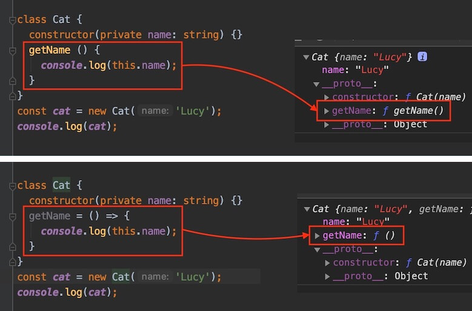

> 각 방법은 메모리와 성능에 대한 트레이드-오프(trade-off)입니다.
> 상황에 맞게 선택하는 것이 좋습니다.

#### 명시적 this

다음 예제를 살펴보면, `someFn` 함수 내 `this`가 캡처할 수 있는 `cat` 객체를 [call 메소드](https://developer.mozilla.org/ko/docs/Web/JavaScript/Reference/Global_Objects/Function/call)를 통해 전달 및 실행했지만, 엄격 모드에서 `this`는 암시적인(implicitly) `any` 타입이기 때문에 에러가 발생합니다.

> '엄격 모드'는 컴파일러 옵션에서 `strict: true`(혹은 `noImplicitThis: true`)인 경우를 말합니다.

```ts
interface ICat {
  name: string
}

const cat: ICat = {
  name: 'Lucy'
}

function someFn(greeting: string) {
  console.log(`${greeting} ${this.name}`) // Error - TS2683: 'this' implicitly has type 'any' because it does not have a type annotation.
}
someFn.call(cat, 'Hello') // Hello Lucy
```

이 경우 `this`의 타입을 명시적으로(explicitly) 선언할 수 있습니다.
다음과 같이 첫 번째 가짜(fake) 매개변수로 `this`를 선언합니다.

```ts
interface ICat {
  name: string
}

const cat: ICat = {
  name: 'Lucy'
}

function someFn(this: ICat, greeting: string) {
  console.log(`${greeting} ${this.name}`) // ok
}
someFn.call(cat, 'Hello') // Hello Lucy
```

### 오버로드

타입스크립트의 '함수 오버로드(Overloads)'는 이름은 같지만 매개변수 타입과 반환 타입이 다른 여러 함수를 가질 수 있는 것을 말합니다.
함수 오버로드를 통해 다양한 구조의 함수를 생성하고 관리할 수 있습니다.

아래 예제에서 `add` 함수는 2개의 선언부와 1개의 구현부를 가지고 있습니다.
주의할 점은 함수 선언부와 구현부의 매개변수 개수가 같아야 합니다.

> 함수 구현부에 `any`가 자주 사용됩니다.

```ts
function add(a: string, b: string): string // 함수 선언
function add(a: number, b: number): number // 함수 선언
function add(a: any, b: any): any { // 함수 구현
  return a + b
}

add('hello ', 'world~')
add(1, 2)
add('hello ', 2) // Error - No overload matches this call.
```

인터페이스나 타입 별칭 등의 메소드 정의에서도 오버로드를 활용할 수 있습니다.
타입 단언이나 타입 가드를 통해 함수 선언부의 동적인 매개변수와 반환 값을 정의할 수 있습니다.

```ts
interface IUser {
  name: string
  age: number
  getData(x: string): string[]
  getData(x: number): string
}

let user: IUser = {
  name: 'Neo',
  age: 36,
  getData: (data: any) => {
    if (typeof data === 'string') {
      return data.split('')
    } else {
      return data.toString()
    }
  }
}

user.getData('Hello') // ['h', 'e', 'l', 'l', 'o']
user.getData(123) // '123'
```

`HTMLDivElement` 같이 DOM 타입의 선언부를 살펴보면 다음과 같습니다.

```ts
/** Provides special properties (beyond the regular HTMLElement interface it also has available to it by inheritance) for manipulating <div> elements. */
interface HTMLDivElement extends HTMLElement {
    /**
     * Sets or retrieves how the object is aligned with adjacent text.
     */
    /** @deprecated */
    align: string;
    addEventListener<K extends keyof HTMLElementEventMap>(type: K, listener: (this: HTMLDivElement, ev: HTMLElementEventMap[K]) => any, options?: boolean | AddEventListenerOptions): void;
    addEventListener(type: string, listener: EventListenerOrEventListenerObject, options?: boolean | AddEventListenerOptions): void;
    removeEventListener<K extends keyof HTMLElementEventMap>(type: K, listener: (this: HTMLDivElement, ev: HTMLElementEventMap[K]) => any, options?: boolean | EventListenerOptions): void;
    removeEventListener(type: string, listener: EventListenerOrEventListenerObject, options?: boolean | EventListenerOptions): void;
}
```

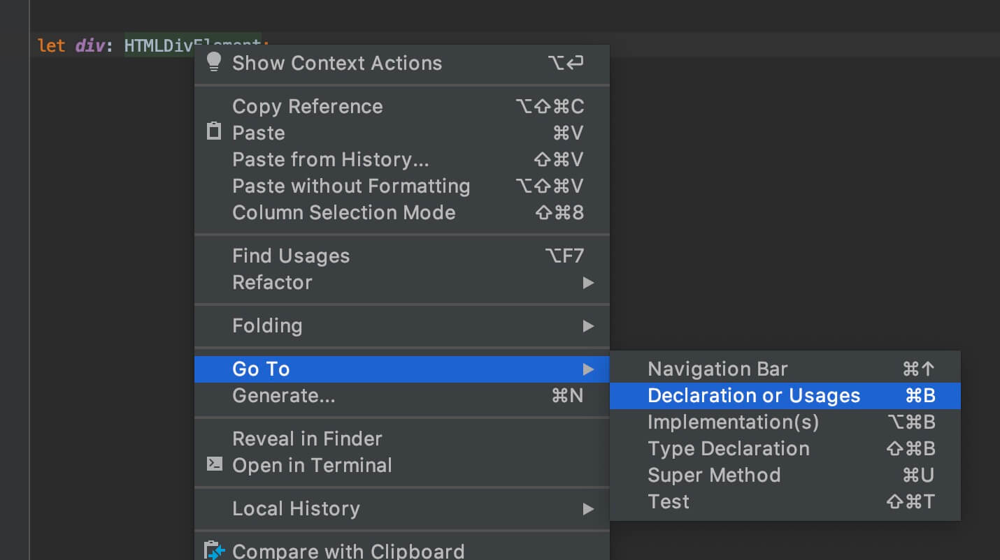
<div class="image-caption">Declaration or Usages in WebStorm</div>

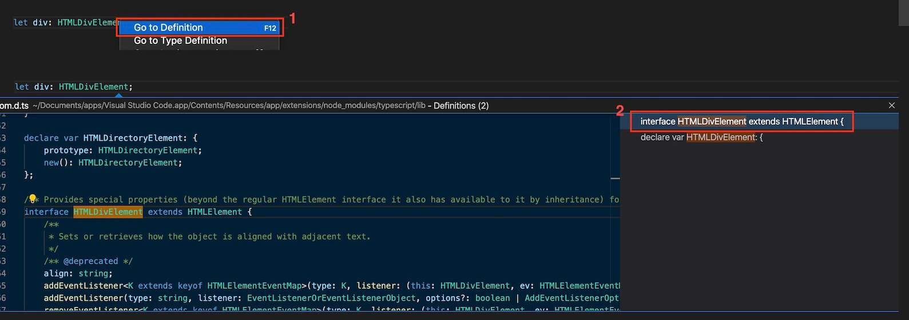
<div class="image-caption">Go to Definition in VSCode</div>

## 클래스

클래스의 생성자 메소드(`constructor`)와 일반 메소드(Methods) 멤버(Class member)와는 다르게, 속성(Properties)은 `name: string`와 같이 클래스 바디(Class body)에 별도로 타입을 선언합니다.

> 클래스 바디(Class body)는 중괄호 `{}`로 묶여 있는 영역을 의미합니다.

```ts
class Animal {
  name: string
  constructor(name: string) {
    this.name = name
  }
}
class Cat extends Animal {
  getName(): string {
    return `Cat name is ${this.name}.`
  }
}
let cat: Cat
cat = new Cat('Lucy')
console.log(cat.getName()) // Cat name is Lucy.
```

### 클래스 수식어

타입스크립트와 관련된 클래스 수식어(Modifiers)들을 살펴봅시다.

클래스 멤버(속성, 메소드)에서 사용할 수 있는 접근 제어자(Access Modifiers)들이 있습니다.
각 접근 제어자들의 차이점을 이해해 봅시다.

> 접근 제어자(Access Modifiers)는 클래스, 메서드 및 기타 멤버의 접근 가능성을 설정하는 객체 지향 언어의 키워드입니다.

접근 제어자 | 의미 | 범위
--|--|--
`public` | 어디서나 자유롭게 접근 가능(생략 가능) | 속성, 메소드
`protected` | 나와 파생된 후손 클래스 내에서 접근 가능 | 속성, 메소드
`private` | 내 클래스에서만 접근 가능 | 속성, 메소드

다음 수식어들은 위 접근 제어자와 함께 사용할 수 있습니다.
`static`의 경우 타입스크립트에서는 정적 메소드뿐만 아니라 정적 속성도 사용할 수 있습니다.

수식어 | 의미 | 범위
--|--|--
`static` | 정적으로 사용 | 속성, 일반 메소드
`readonly` | 읽기 전용으로 사용 | 속성

그럼 우선, 각 접근 제어자들의 차이점에 대해서 살펴봅시다.

다음 예제의 `Animal` 클래스의 `name` 속성은 `public`이기 때문에 파생된 자식 클래스(`Cat`)에서 `this.name`으로 참조하거나 인스턴스에서 `cat.name`으로 접근하는데 아무런 문제가 없습니다.
(어디서나 자유롭게 접근 가능(생략 가능))

```ts
class Animal {
  // public 수식어 사용(생략 가능)
  public name: string
  constructor(name: string) {
    this.name = name
  }
}
class Cat extends Animal {
  getName(): string {
    return `Cat name is ${this.name}.`
  }
}
let cat = new Cat('Lucy')
console.log(cat.getName()) // Cat name is Lucy.

cat.name = 'Tiger'
console.log(cat.getName()) // Cat name is Tiger.
```

다음 예제의 `Animal` 클래스의 `name` 속성은 `protected`이기 때문에 파생된 자식 클래스(`Cat`)에서 `this.name`으로 참조할 수는 있지만, 인스턴스에서 `cat.name`으로는 접근할 수 없습니다.
(나와 파생된 후손 클래스 내에서 접근 가능)

```ts
class Animal {
  // protected 수식어 사용
  protected name: string
  constructor(name: string) {
    this.name = name
  }
}
class Cat extends Animal {
  getName(): string {
    return `Cat name is ${this.name}.`
  }
}
let cat = new Cat('Lucy')
console.log(cat.getName()) // Cat name is Lucy.
console.log(cat.name) // Error - TS2445: Property 'name' is protected and only accessible within class 'Animal' and its subclasses.

cat.name = 'Tiger' // Error - TS2445: Property 'name' is protected and only accessible within class 'Animal' and its subclasses.
console.log(cat.getName())
```

다음 예제의 `Animal` 클래스의 `name` 속성은 `private`이기 때문에 파생된 자식 클래스(`Cat`)에서 `this.name`으로 참조할 수 없고, 인스턴스에서도 `cat.name`으로 접근할 수도 없습니다.
(내 클래스에서만 접근 가능)

```ts
class Animal {
  // private 수식어 사용
  private name: string
  constructor(name: string) {
    this.name = name
  }
}
class Cat extends Animal {
  getName(): string {
    return `Cat name is ${this.name}.` // Error - TS2341: Property 'name' is private and only accessible within class 'Animal'
  }
}
let cat = new Cat('Lucy')
console.log(cat.getName())
console.log(cat.name) // Error - TS2341: Property 'name' is private and only accessible within class 'Animal'.

cat.name = 'Tiger' // Error - TS2341: Property 'name' is private and only accessible within class 'Animal'.
console.log(cat.getName())
```

다음은 생성자 메소드(`constructor`)에 `protected`를 사용했기 때문에 인스턴스 생성에서 에러가 발생하는 예제입니다.

```ts
class Animal {
  name: string
  protected constructor(name: string) {
    this.name = name
  }
}
const cat = new Animal('Dog') // Error - TS2674: Constructor of class 'Animal' is protected and only accessible within the class declaration.
```

그리고 흥미로운 부분은 생성자 메소드에서 인수 타입 선언과 동시에 접근 제어자를 사용하면 바로 속성 멤버로 정의할 수 있습니다.
접근 제어자를 생략하지 않도록 주의하세요.

```ts
class Cat {
  constructor(public name: string, protected age: number) {}
  getName() {
    return this.name
  }
  getAge() {
    return this.age
  }
}

const cat = new Cat('Neo', 2)
console.log(cat.getName()) // Neo
console.log(cat.getAge()) // 2
```

이번엔 `static`과 `readonly`에 대해서 살펴봅시다.

ES6에서는 `static`으로 정적 메소드만 생성할 수 있었는데, 타입스크립트에서는 정적 속성도 생성할 수 있습니다.
정적 속성은 클래스 바디에서 속성의 타입 선언과 같이 사용하며, 정적 메소드와 다르게 클래스 바디에서 값을 초기화할 수 없기 때문에 `constructor` 혹은 메소드에서 초기화가 필요합니다.

```ts
class Cat {
  static legs: number
  constructor() {
    Cat.legs = 4 // Init static property.
  }
}
console.log(Cat.legs) // undefined
new Cat()
console.log(Cat.legs) // 4

class Dog {
  // Init static method.
  static getLegs() {
    return 4
  }
}
console.log(Dog.getLegs()) // 4
```

`readonly`을 사용하면 해당 속성은 '읽기 전용'입니다.

```ts
class Animal {
  readonly name: string
  constructor(n: string) {
    this.name = n
  }
}
let dog = new Animal('Charlie')
console.log(dog.name) // Charlie
dog.name = 'Tiger' // Error - TS2540: Cannot assign to 'name' because it is a read-only property.
```

그리고 `static`과 `readonly`는 접근 제어자와 같이 사용할 수 있습니다.
접근 제어자를 먼저 작성해야 합니다.

```ts
class Cat {
  public readonly name: string
  protected static eyes: number
  constructor(n: string) {
    this.name = n
    Cat.eyes = 2
  }
  private static getLegs() {
    return 4
  }
}
```

### 추상 클래스

추상(Abstract) 클래스는 다른 클래스가 파생될 수 있는 기본 클래스로, 인터페이스와 굉장히 유사합니다.
`abstract`는 클래스뿐만 아니라 속성과 메소드에도 사용할 수 있습니다.
추상 클래스는 직접 인스턴스를 생성할 수 없기 때문에 파생된 후손 클래스에서 인스턴스를 생성해야 합니다.

```ts
// Abstract Class
abstract class Animal {
  abstract name: string // 파생된 클래스에서 구현해야 합니다.
  abstract getName(): string // 파생된 클래스에서 구현해야 합니다.
}
class Cat extends Animal {
  constructor(public name: string) {
    super()
  }
  getName() {
    return this.name
  }
}
new Animal() // Error - TS2511: Cannot create an instance of an abstract class.
const cat = new Cat('Lucy')
console.log(cat.getName()) // Lucy

// Interface
interface IAnimal {
  name: string
  getName(): string
}
class Dog implements IAnimal {
  constructor(public name: string) {}
  getName() {
    return this.name
  }
}
```

추상 클래스가 인터페이스와 다른 점은 속성이나 메소드 멤버에 대한 세부 구현이 가능하다는 점입니다.

```ts
abstract class Animal {
  abstract name: string
  abstract getName(): string
  // Abstract class constructor can be made protected.
  protected constructor(public legs: string) {}
  getLegs() {
    return this.legs
  }
}
```

## Optional

`?` 키워드를 사용하는 여러 선택적(Optional) 개념에 대해서 살펴봅시다.

### 매개 변수

우선, 타입을 선언할 때 선택적 매개 변수(Optional Parameter)를 지정할 수 있습니다.
다음 예제를 보면 `?` 키워드를 사용해 `y`를 선택적 매개 변수로 지정했습니다.
따라서 `y`가 받을 인수가 없어도 에러가 발생하지 않습니다.

```ts
function add(x: number, y?: number): number {
  return x + (y || 0)
}
const sum = add(2)
console.log(sum)
```

위 예제는 정확히 다음 예제와 같습니다.
즉, `?` 키워드 사용은 `| undefined`를 추가하는 것과 같습니다.

```ts
function add(x: number, y: number | undefined): number {
  return x + (y || 0)
}
const sum = add(2, undefined)
console.log(sum)
```

### 속성과 매소드

`?` 키워드를 속성(Properties)과 메소드(Methods) 타입 선언에도 사용할 수 있습니다.
다음은 인터페이스 파트에서 살펴봤던 예제입니다.
`isAdult`를 선택적 속성으로 선언하면서 더 이상 에러가 발생하지 않습니다.

```ts
interface IUser {
  name: string
  age: number
  isAdult?: boolean
}

let user1: IUser = {
  name: 'Neo',
  age: 123,
  isAdult: true
}

let user2: IUser = {
  name: 'Evan',
  age: 456
}
```

Type이나 Class에서도 사용할 수 있습니다.

```ts
interface IUser {
  name: string
  age: number
  isAdult?: boolean
  validate?(): boolean
}
type TUser = {
  name: string
  age: number
  isAdult?: boolean
  validate?(): boolean
}
abstract class CUser {
  abstract name: string
  abstract age: number
  abstract isAdult?: boolean
  abstract validate?(): boolean
}
```

## 모듈

타입스크립트의 모듈을 이해하기 위해선 자바스크립트 모듈에 대한 이해가 선행되어야 합니다.
타입스크립트 공식 문서의 많은 부분이 이 자바스크립트 모듈에 대한 설명을 포함하고 있는데, 여기서는 타입스크립트가 가지는 모듈 개념의 차이점에 대해서만 살펴보려고 합니다.

### 내보내기와 가져오기

자바스크립트 모듈의 내보내기(export)와 가져오기(import)에 대해 이해가 부족하다면 다음 MDN 문서를 우선 참고하시길 바랍니다.
https://developer.mozilla.org/ko/docs/Web/JavaScript/Reference/Statements/export
https://developer.mozilla.org/ko/docs/Web/JavaScript/Reference/Statements/import

타입스크립트는 일반적인 변수나 함수, 클래스뿐만 아니라 다음과 같이 인터페이스나 타입 별칭도 모듈로 내보낼 수 있습니다.

```ts
// myTypes.ts

// 인터페이스 내보내기
export interface IUser {
  name: string
  age: number
}

// 타입 별칭 내보내기
export type MyType = string | number
```

```ts
// 선언한 모듈(myTypes.ts) 가져오기
import type { IUser, MyType } from './myTypes'

const user: IUser = {
  name: 'HEROPY',
  age: 85
}

const something: MyType = true // Error - TS2322: Type 'true' is not assignable to type 'MyType'.
```

타입스크립트는 CommonJS/AMD/UMD 모듈을 위해 `export = ABC`, `import ABC = require('abc')`와 같은 내보내기와 가져오기 문법을 제공합니다.
이는 ES6 모듈의 `export default` 같이 하나의 모듈에서 하나의 객체만 내보내는 Default Export 기능을 제공합니다.

결국 타입스크립트에서 CommonJS/AMD/UMD 모듈은 다음과 같이 가져올 수 있습니다.
추가로, 컴파일 옵션에 `"esModuleInterop": true`를 제공하면, ES6 모듈의 Default Import 방식도 같이 사용할 수 있습니다.

```ts
// CommonJS/AMD/UMD
import ABC = require('abc')
// or
import * as ABC from 'abc'
// or `"esModuleInterop": true`
import ABC from 'abc'
```

### 모듈의 타입 선언

타입스크립트의 외부 자바스크립트 모듈 사용에 대해서 알아봅시다.
간단한 프로젝트를 생성하고 외부 모듈로 [Lodash](https://lodash.com/)를 설치해 사용해 보겠습니다.

> '모듈' 파트의 타입스크립트 프로젝트 생성은 '개발환경 / TS Node' 파트를 참고하세요.

```bash
$ npm install lodash
```

`main.ts`에서 Lodash 모듈의 `camelCase` API를 사용해 콘솔 출력하는 아주 단순한 코드를 작성합니다.
하지만 다음과 같이 '가져오기(import)' 단계에서 에러가 발생합니다.
이는 타입스크립트 컴파일러가 확인할 수 있는 모듈의 타입 선언이 없기 때문입니다.

```ts
// main.ts

import * as _ from 'lodash' // Error - TS2307: Cannot find module 'lodash'.

console.log(_.camelCase('import lodash module'))
```

<strong>모듈 구현(implement)과 타입 선언(declaration)이 동시에 이뤄지는 타입스크립트</strong>와 달리, 구현만 존재하는 자바스크립트 모듈(E.g. Lodash)을 사용하는 경우, 컴파일러가 이해할 수 있는 모듈의 타입 선언이 필요하며, 이를 대부분 `.d.ts`파일로 만들어 제공하게 됩니다.

그럼 이제 Lodash에 대한 타입 선언을 해봅시다.
다음과 같이 루트 경로에 `lodash.d.ts` 파일을 생성합니다.

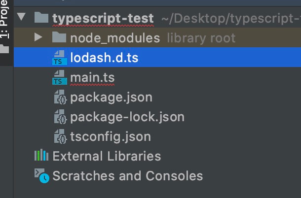

기본 구조는 단순합니다.
모듈 가져오기(Import)가 가능하도록 `module` 키워드를 사용해 모듈 이름을 명시합니다.
그리고 그 범위 안에서, 타입(`interface`)을 가진 변수(`_`)를 선언하고 내보내기(Export)만 하면 됩니다.

> 타입스크립트 컴파일러가 이해할 수 있도록 `declare` 키워드를 통해 선언해야 합니다!

```ts
// lodash.d.ts

// 모듈의 타입 선언(Ambient module declaration)
declare module 'lodash' {
  // 1. 타입(인터페이스) 선언
  interface ILodash {
    camelCase(str?: string): string
  }

  // 2. 타입(인터페이스)을 가지는 변수 선언
  const _: ILodash

  // 3. 내보내기(CommonJS)
  export = _
}
```

그리고 이 타입 선언이 컴파일 과정에 포함될 수 있도록 다음과 같이 `///`(삼중 슬래시 지시자, Triple-slash directive)를 사용하는 <strong>참조 태그(`<reference />`)</strong>와 `path` 속성을 사용합니다.
넘어가기 전, 참조 태그의 특징에 대해서 몇 가지 살펴보면,

- 참조 태그로 가져오는 것은 모듈 구현이 아니라 타입 선언이기 때문에, `import` 키워드로 가져오지 않아야 합니다.
- 삼중 슬래시 지시자는 자바스크립트로 컴파일되면 단순 주석입니다.
- `path` 속성은 가져올 타입 선언의 상대 경로를 지정하며, 확장자를 꼭 입력해야 합니다.
- `types` 속성은 `/// <reference types="lodash" />`와 같이 모듈 이름을 지정하며, 이는 컴파일 옵션 `typeRoots` 와 Definitely Typed(`@types`)를 기준으로 합니다.

> 컴파일 옵션 `typeRoots`와 Definitely Typed(`@types`)는 뒤에서 살펴봅니다.

```ts
// 참조 태그(Triple-slash directive)
/// <reference path="./lodash.d.ts" />

import * as _ from 'lodash'

console.log(_.camelCase('import lodash module'))
```

정상적으로 콘솔 출력되는지 확인합니다.

```bash
$ npx ts-node main.ts
## importLodashModule
```

#### Definitely Typed(@types)

이전 파트에서 Lodash의 `camelCase` 메소드를 사용했고, 이번엔 추가로 `snakeCase`도 사용하려고 합니다.
하지만 우리는 `lodash.d.ts`에 `snakeCase`에 대한 타입 선언을 하지 않았기 때문에 다음과 같이 에러가 발생합니다.

```ts
// main.ts

/// <reference path="./lodash.d.ts" />

import * as _ from 'lodash'

console.log(_.camelCase('import lodash module'))
console.log(_.snakeCase('import lodash module')) // Error - TS2339: Property 'snakeCase' does not exist on type 'ILodash'.
```

이는 `lodash.d.ts`에 `snakeCase`에 대한 타입 선언을 하면 간단히 해결할 수 있습니다.

```ts
// lodash.d.ts

declare module 'lodash' {
  interface ILodash {
    camelCase(str?: string): string
    snakeCase(str?: string): string // 타입 선언 추가
  }

  const _: ILodash
  export = _
}
```

하지만, 프로젝트에서 사용하는 모든 모듈에 대해 매번 직접 타입 선언을 작성하는 것(타이핑, Typing)은 매우 비효율적입니다.
그래서 우리는 여러 사용자들의 기여로 만들어진 [Definitely Typed](https://github.com/DefinitelyTyped/DefinitelyTyped)을 사용할 수 있습니다.
수 많은 모듈의 타입이 정의되어 있으며, 지속적으로 추가되고 있습니다.

`npm install -D @types/모듈이름`으로 설치해 사용합니다.
`npm info @types/모듈이름`으로 검색하면 원하는 모듈의 타입 선언이 존재하는지 확인할 수 있습니다.

다음과 같이 Lodash 타입 선언을 설치합니다.

```bash
$ npm i -D @types/lodash
```

이제, 더 이상 필요치 않으니 `lodash.d.ts`를 삭제합니다!
`main.ts`의 참조 태그(Triple-slash directive)도 같이 삭제합니다!
별도 설정이 없어도, 다양한 Lodash API를 사용할 수 있습니다.

```ts
// main.ts

import * as _ from 'lodash'

console.log(_.camelCase('import lodash module'))
console.log(_.snakeCase('import lodash module'))
console.log(_.kebabCase('import lodash module'))
```

```bash
$ npx ts-node main.ts
## importLodashModule
## import_lodash_module
## import-lodash-module
```

동작 원리는 간단합니다.
타입 선언 모듈(`@types/lodash`)은 `node_modules/@types`경로에 설치되며,
이 경로의 모든 타입 선언은 <strong>모듈 가져오기(Import)를 통해 컴파일에 자동으로 포함</strong>됩니다.

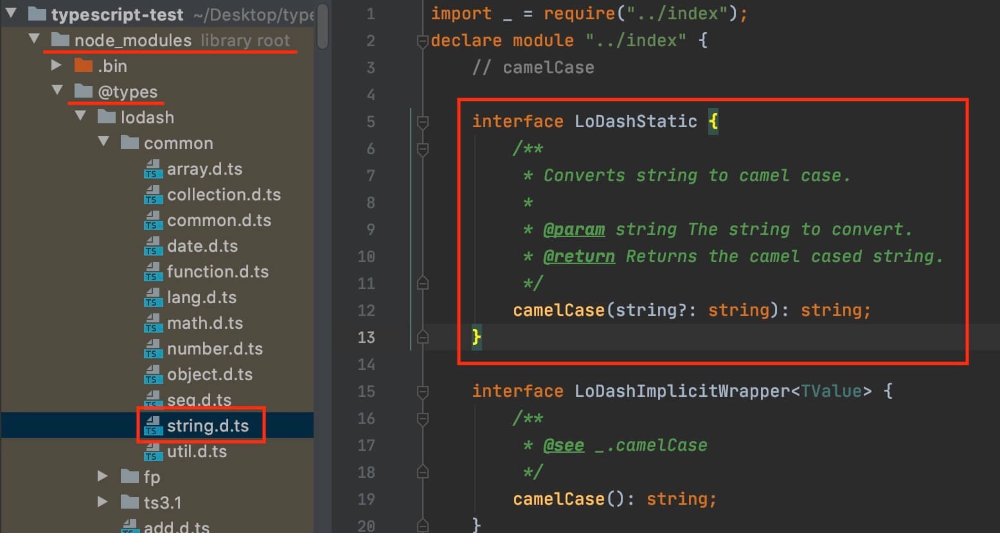

## TS 유틸리티 타입

유틸리티 타입은 기본 타입을 변환하거나 조작하는데 사용되는 타입스크립트의 내장 타입입니다.
이해를 돕기 위한 간단한 예제를 별도 작성해서 포함했습니다.
더 자세한 내용은 [Utility Types](https://www.typescriptlang.org/docs/handbook/utility-types.html)를 참고하세요.

> 타입 변수 `T`는 타입(Type), `U`는 또 다른 타입, `K`는 속성(key)을 의미하는 약어입니다.
> 이해를 돕기 위해 타입 변수를 `T`는 `TYPE` 또는 `TYPE1`, `U`는 `TYPE2`, `K`는 `KEY`로 명시했습니다.

유틸리티 이름 | 설명 (대표 타입) | 타입 변수
--|--|--
`Partial` | `TYPE`의 모든 속성을 선택적으로 변경한 새로운 타입 반환 (인터페이스) | `<TYPE>`
`Required` | `TYPE`의 모든 속성을 필수로 변경한 새로운 타입 반환 (인터페이스) | `<TYPE>`
`Readonly` | `TYPE`의 모든 속성을 읽기 전용으로 변경한 새로운 타입 반환 (인터페이스) | `<TYPE>`
`Record` | `KEY`를 속성으로, `TYPE`를 그 속성값의 타입으로 지정하는 새로운 타입 반환 (인터페이스) | `<KEY, TYPE>`
`Pick` | `TYPE`에서 `KEY`로 속성을 선택한 새로운 타입 반환 (인터페이스) | `<TYPE, KEY>`
`Omit` | `TYPE`에서 `KEY`로 속성을 생략하고 나머지를 선택한 새로운 타입 반환 (인터페이스) | `<TYPE, KEY>`
`Exclude` | `TYPE1`에서 `TYPE2`를 제외한 새로운 타입 반환 (유니언) | `<TYPE1, TYPE2>`
`Extract` | `TYPE1`에서 `TYPE2`를 추출한 새로운 타입 반환 (유니언) | `<TYPE1, TYPE2>`
`NonNullable` | `TYPE`에서 `null`과 `undefined`를 제외한 새로운 타입 반환 (유니언) | `<TYPE>`
`Parameters` | `TYPE`의 매개변수 타입을 새로운 튜플 타입으로 반환 (함수, 튜플) | `<TYPE>`
`ConstructorParameters` | `TYPE`의 매개변수 타입을 새로운 튜플 타입으로 반환 (클래스, 튜플) | `<TYPE>`
`ReturnType` | `TYPE`의 반환 타입을 새로운 타입으로 반환 (함수) | `<TYPE>`
`InstanceType` | `TYPE`의 인스턴스 타입을 반환 (클래스) | `<TYPE>`
`ThisParameterType` | `TYPE`의 명시적 `this` 매개변수 타입을 새로운 타입으로 반환 (함수) | `<TYPE>`
`OmitThisParameter` | `TYPE`의 명시적 `this` 매개변수를 제거한 새로운 타입을 반환 (함수) | `<TYPE>`
`ThisType` | `TYPE`의 `this` 컨텍스트(Context)를 명시, 별도 반환 없음! (인터페이스) | `<TYPE>`

<script src="https://gist.github.com/ParkYoungWoong/d033592b4b3cb09c182033d783dd0e5a.js"></script>

#### Partial

`TYPE`의 모든 속성을 선택적(`?`)으로 변경한 새로운 타입을 반환합니다.

> 'Optional > 속성과 메소드' 파트를 참고하세요.

```ts
Partial<TYPE>
```

```ts
interface IUser {
  name: string
  age: number
}

const userA: IUser = { // TS2741: Property 'age' is missing in type '{ name: string }' but required in type 'IUser'.
  name: 'A'
}
const userB: Partial<IUser> = {
  name: 'B'
}
```

위 예제의 `Partial<IUser>`은 다음과 같이 이해할 수 있습니다.

```ts
interface INewType {
  name?: string
  age?: number
}
```

#### Required

`TYPE`의 모든 속성을 필수로 변경한 새로운 타입을 반환합니다.

```ts
Required<TYPE>
```

```ts
interface IUser {
  name?: string
  age?: number
}

const userA: IUser = {
  name: 'A'
}
const userB: Required<IUser> = { // TS2741: Property 'age' is missing in type '{ name: string }' but required in type 'Required<IUser>'.
  name: 'B'
}
```

위 예제의 `Required<IUser>`은 다음과 같이 이해할 수 있습니다.

```ts
interface IUser {
  name: string
  age: number
}
```

#### Readonly

`TYPE`의 모든 속성을 읽기 전용(`readonly`)으로 변경한 새로운 타입을 반환합니다.

> '인터페이스 > 읽기 전용 속성' 파트를 참고하세요.

```ts
Readonly<TYPE>
```

```ts
interface IUser {
  name: string
  age: number
}

const userA: IUser = {
  name: 'A',
  age: 12
}
userA.name = 'AA'

const userB: Readonly<IUser> = {
  name: 'B',
  age: 13
}
userB.name = 'BB' // TS2540: Cannot assign to 'name' because it is a read-only property.
```

위 예제의 `Readonly<IUser>`는 다음과 같이 이해할 수 있습니다.

```ts
interface INewType {
  readonly name: string
  readonly age: number
}
```

#### Record

`KEY`를 속성(Key)으로, `TYPE`를 그 속성값의 타입(Type)으로 지정하는 새로운 타입을 반환합니다.

```ts
Record<KEY, TYPE>
```

```ts
type TName = 'neo' | 'lewis'

const developers: Record<TName, number> = {
  neo: 12,
  lewis: 13
}
```

위 예제의 `Record<TName, number>`는 다음과 같이 이해할 수 있습니다.

```ts
interface INewType {
  neo: number
  lewis: number
}
```

#### Pick

`TYPE`에서 `KEY`로 속성을 선택한 새로운 타입을 반환합니다.
`TYPE`은 속성을 가지는 인터페이스나 객체 타입이어야 합니다.

```ts
Pick<TYPE, KEY>
```

```ts
interface IUser {
  name: string
  age: number
  email: string
  isValid: boolean
}
type TKey = 'name' | 'email'

const user: Pick<IUser, TKey> = {
  name: 'Neo',
  email: 'thesecon@gmail.com',
  age: 22 // TS2322: Type '{ name: string; email: string; age: number; }' is not assignable to type 'Pick<IUser, TKey>'.
}
```

위 예제의 `Pick<IUser, TKey>`은 다음과 같이 이해할 수 있습니다.

```ts
interface INewType {
  name: string
  email: string
}
```

#### Omit

위에서 살펴본 `Pick`과 반대로,
`TYPE`에서 `KEY`로 속성을 생략하고 나머지를 선택한 새로운 타입을 반환합니다.
`TYPE`은 속성을 가지는 인터페이스나 객체 타입이어야 합니다.

```ts
Omit<TYPE, KEY>
```

```ts
interface IUser {
  name: string
  age: number
  email: string
  isValid: boolean
}
type TKey = 'name' | 'email'

const user: Omit<IUser, TKey> = {
  age: 22,
  isValid: true,
  name: 'Neo' // TS2322: Type '{ age: number; isValid: true; name: string; }' is not assignable to type 'Pick<IUser, "age" | "isValid">'.
}
```

위 예제의 `Omit<IUser, TKey>`은 다음과 같이 이해할 수 있습니다.

```ts
interface INewType {
  // name: string
  age: number
  // email: string
  isValid: boolean
}
```

#### Exclude

유니언 `TYPE1`에서 유니언 `TYPE2`를 제외한 새로운 타입을 반환합니다.

```ts
Exclude<TYPE1, TYPE2>
```

```ts
type T = string | number

const a: Exclude<T, number> = 'Only string'
const b: Exclude<T, number> = 1234 // TS2322: Type '123' is not assignable to type 'string'.
const c: T = 'String'
const d: T = 1234
```

#### Extract

유니언 `TYPE1`에서 유니언 `TYPE2`를 추출한 새로운 타입을 반환합니다.

```ts
Extract<TYPE1, TYPE2>
```

```ts
type T = string | number
type U = number | boolean

const a: Extract<T, U> = 123
const b: Extract<T, U> = 'Only number' // TS2322: Type '"Only number"' is not assignable to type 'number'.
```

#### NonNullable

유니언 `TYPE`에서 `null`과 `undefined`를 제외한 새로운 타입을 반환합니다.

```ts
NonNullable<TYPE>
```

```ts
type T = string | number | undefined

const a: T = undefined
const b: NonNullable<T> = null // TS2322: Type 'null' is not assignable to type 'string | number'.
```

#### Parameters

함수 `TYPE`의 매개변수 타입을 새로운 튜플(Tuple) 타입으로 반환합니다.

```ts
Parameters<TYPE>
```

```ts
function fn(a: string | number, b: boolean) {
  return `[${a}, ${b}]`
}

const a: Parameters<typeof fn> = ['Hello', 123] // Type 'number' is not assignable to type 'boolean'.
```

위 예제의 `Parameters<typeof fn>`은 다음과 같이 이해할 수 있습니다.

```ts
[string | number, boolean]
```

#### ConstructorParameters

클래스 `TYPE`의 매개변수 타입을 새로운 튜플 타입으로 반환합니다.

```ts
ConstructorParameters<TYPE>
```

```ts
class User {
  constructor (public name: string, private age: number) {}
}

const neo = new User('Neo', 12)
const a: ConstructorParameters<typeof User> = ['Neo', 12]
const b: ConstructorParameters<typeof User> = ['Lewis'] // TS2741: Property '1' is missing in type '[string]' but required in type '[string, number]'.
```

위 예제의 `ConstructorParameters<typeof User>`은 다음과 같이 이해할 수 있습니다.

```ts
[string, number]
```

#### ReturnType

함수 `TYPE`의 반환(Return) 타입을 새로운 타입으로 반환합니다.

```ts
ReturnType<TYPE>
```

```ts
function fn(str: string) {
  return str
}

const a: ReturnType<typeof fn> = 'Only string'
const b: ReturnType<typeof fn> = 1234 // TS2322: Type '123' is not assignable to type 'string'.
```

#### InstanceType

클래스 `TYPE`의 인스턴스 타입을 반환합니다.

```ts
InstanceType<TYPE>
```

```ts
class User {
  constructor(public name: string) {}
}

const neo: InstanceType<typeof User> = new User('Neo')
```

#### ThisParameterType

함수 `TYPE`의 명시적 `this` 매개변수 타입을 새로운 타입으로 반환합니다.
함수 `TYPE`에 명시적 `this` 매개변수가 없는 경우 알 수 없는 타입(Unknown)을 반환합니다.

> '함수 > this > 명시적 this' 파트를 참고하세요.

```ts
ThisParameterType<TYPE>
```

```ts
// https://www.typescriptlang.org/docs/handbook/utility-types.html#thisparametertype

function toHex(this: Number) {
    return this.toString(16)
}

function numberToString(n: ThisParameterType<typeof toHex>) {
    return toHex.apply(n)
}
```

위 예제에서 함수 `toHex`의 명시적 `this` 타입은 `Number`이고,
그 타입을 참고해서 함수 `numberToString`의 매개변수 `n`의 타입을 선언합니다.
따라서 `toHex`에 다른 타입의 `this`가 바인딩 되는 것을 방지할 수 있습니다.

#### OmitThisParameter

함수 `TYPE`의 명시적 `this` 매개변수를 제거한 새로운 타입을 반환합니다.

```ts
OmitThisParameter<TYPE>
```

```ts
function getAge(this: typeof cat) {
  return this.age
}

// 기존 데이터
const cat = {
  age: 12 // Number
}
getAge.call(cat) // 12

// 새로운 데이터
const dog = {
  age: '13' // String
}
getAge.call(dog) // TS2345: Argument of type '{ age: string }' is not assignable to parameter of type '{ age: number }'.
```

위 예제에서 데이터 `cat`을 기준으로 설계한 함수 `getAge`는 일부 다른 타입을 가지는 새로운 데이터 `dog`를 `this`로 사용할 수 없습니다.
하지만 `OmitThisParameter`를 통해 명시적 `this`를 제거한 새로운 타입의 함수를 만들 수 있기 때문에,
`getAge`를 직접 수정하지 않고 데이터 `dog`를 사용할 수 있습니다.

```ts
const getAgeForDog: OmitThisParameter<typeof getAge> = getAge
getAgeForDog.call(dog) // '13'
```

> `this.age`에는 이제 어떤 값도 들어갈 수 있음을 주의합니다.

#### ThisType

`TYPE`의 `this` 컨텍스트(Context)를 명시하고 별도의 타입을 반환하지 않습니다.

```ts
ThisType<TYPE>
```

```ts
interface IUser {
  name: string
  getName: () => string
}

function makeNeo(methods: ThisType<IUser>) {
  return { name: 'Neo', ...methods } as IUser
}
const neo = makeNeo({
  getName() {
    return this.name
  }
})

neo.getName() // Neo
```

함수 `makeNeo`의 인수로 사용되는 메소드 `getName`은 내부에서 `this.name`을 사용하고 있기 때문에 `ThisType`을 통해 명시적으로 `this` 컨텍스트를 설정해 줍니다.
단, `ThisType`은 별도의 타입을 반환하지 않기 때문에 `makeNeo` 반환 값(`{ name: 'Neo', ...methods }`)에 대한 타입이 정상적으로 추론(Inference)되지 않습니다.
따라서 `as IUser`와 같이 따로 타입을 단언(Assertions)해야 `neo.getName`을 정상적으로 호출할 수 있습니다.
