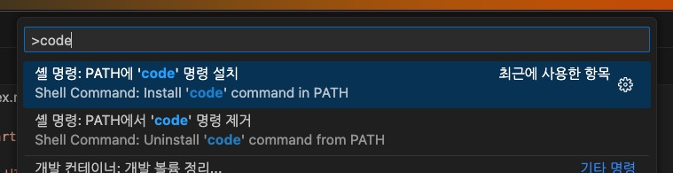
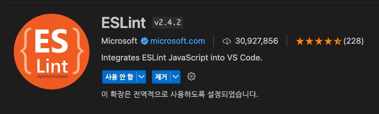
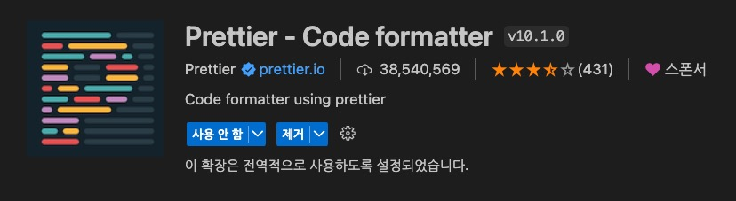
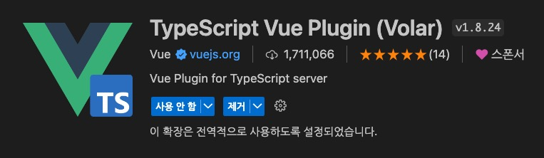
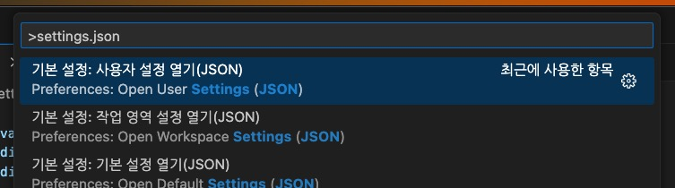

# Vite로 시작하는 Vue 프로젝트

Vite.js 빌드 도구를 사용해 Vue 프로젝트를 시작하는 방법을 설명합니다.
자바스크립트와 타입스크립트 프로젝트에서의 구성을 구분하고 있습니다.

/// message-box --icon=info --color=success
Node.js 18버전, NPM 8버전 이상이 설치되어 있어야 합니다.
///

## Vite 프로젝트 생성

VS Code로 프로젝트 폴더를 열고 터미널에서 다음 명령을 순서대로 실행합니다.

```bash
# 현재 경로에 프로젝트 구성
$ npm create vite@latest .
  # > Vue 선택
  # > JavaScript 혹은 TypeScript 선택

# 의존성 패키지 설치
$ npm i
```

혹은. 터미널에서 프로젝트를 생성할 경로로 이동 후 다음 명령을 순서대로 실행합니다.

```bash
# 현재 경로에 프로젝트 폴더 생성 및 구성
$ npm create vite@latest <프로젝트_폴더_이름>
  # > Vue 선택
  # > JavaScript 혹은 TypeScript 선택

# 프로젝트 경로로 이동
$ cd <프로젝트_폴더_이름>

# 의존성 패키지 설치
$ npm i

# 현재 경로를 새로운 VS Code 창으로 열기
$ code .
# 혹은 현재 VS Code 창에서 열기
$ code . -r
# 혹은 수동으로 프로젝트 열기
```

/// message-box --icon=info --color=info
`code` 명령은 다음 과정을 통해 설치 후 사용할 수 있습니다.
VS Code > 명령 팔레트(Ctrl(Cmd) + Shift + P) > `code` 검색 > `PATH에 'code' 명령 설치` 선택

///

```bash --caption=개발 서버 실행.
$ npm run dev
```

## ESLint + Prettier 구성

- [ESLint](https://marketplace.visualstudio.com/items?itemName=dbaeumer.vscode-eslint): 코드 품질 확인 및 버그, 안티패턴(Anti-pattern)을 감지
- [Prettier](https://marketplace.visualstudio.com/items?itemName=esbenp.prettier-vscode): 코드 스타일 및 포맷팅 관리, 일관된 코드 스타일을 적용 가능


### VS Code 확장 프로그램 설치

/// message-box --icon=warning --color=warning
이미 확장 프로그램을 설치한 경우, 이 단계는 생략하세요!
///

ESLint와 Prettier를 사용하기 위해 VS Code에서 각 확장 프로그램을 설치합니다.
설치 후에는 VS Code를 재시작하는 것이 좋습니다.

 

Vue 프로젝트이므로, 다음 확장 프로그램도 추가로 설치해 도움을 받을 수 있습니다.

- [Vue Language Features (Volar)](https://marketplace.visualstudio.com/items?itemName=Vue.volar): Vue 프로젝트의 문법 강조, 자동 완성, 오류 검사 등을 지원
- [TypeScript Vue Plugin (Volar)](https://marketplace.visualstudio.com/items?itemName=Vue.vscode-typescript-vue-plugin): TS 서버가 `*.vue` 파일(SFC)을 인식할 수 있도록 지원

 

### 패키지 설치 및 구성

프로젝트에서 사용할 수 있도록, 각 의존성 패키지를 설치합니다.
각 패키지는 모두 런타임에서 필요치 않은 개발용이기 때문에, `-D` 플래그를 사용해 '개발 의존성 패키지(Dev Dependencies)'로 설치합니다.

```bash --caption=자바스크립트인 경우.
$ npm i -D eslint prettier eslint-plugin-vue eslint-config-prettier eslint-plugin-prettier
```

```bash --caption=타입스크립트인 경우.
$ npm i -D eslint prettier eslint-plugin-vue eslint-config-prettier eslint-plugin-prettier @typescript-eslint/eslint-plugin @typescript-eslint/parser
```

설치가 완료되면, 프로젝트 루트 경로에 `.eslintrc.json` 파일을 생성하고 다음과 같이 내용을 추가합니다.

```json --path=/.eslintrc.json --caption=자바스크립트인 경우.
{
  "extends": [
    "eslint:recommended",
    "plugin:vue/vue3-recommended",
    "plugin:prettier/recommended"
  ],
  "rules": {
    // ...
  }
}
```

```json --path=/.eslintrc.json --caption=타입스크립트인 경우.
{
  "extends": [
    "eslint:recommended",
    "plugin:@typescript-eslint/recommended",
    "plugin:vue/vue3-recommended",
    "plugin:prettier/recommended"
  ],
  "parserOptions": {
    "parser": "@typescript-eslint/parser"
  },
  "rules": {
    // ...
  }
}
```

필요한 경우, `*.vue` 파일의 `<template>`이나 `<script>` 등에서 사용할 커스텀 규칙을 덮어쓸 수 있습니다.
자세한 규칙은 [ESLint plugin for Vue.js / Rules](https://eslint.vuejs.org/rules/) 에서 확인할 수 있습니다.

```json --path=/.eslintrc.json --caption=Vue 커스텀 규칙을 추가.
{
  // ...
  "rules": {
    "vue/html-closing-bracket-newline": ["error", {
      "singleline": "never",
      "multiline": "never"
    }],
    "vue/html-self-closing": ["error", {
      "html": {
        "void": "always",
        "normal": "never",
        "component": "always"
      },
      "svg": "always",
      "math": "always"
    }],
    "vue/comment-directive": "off",
    "vue/multi-word-component-names": "off",
    "vue/no-v-html": "off"
  }
}
```

추가로, 프로젝트 루트 경로에 `.prettierrc` 파일을 생성하고 다음과 같이 내용을 추가합니다.
자세한 규칙은 [Prettier / Options](https://prettier.io/docs/en/options) 에서 확인할 수 있습니다.

```json --path=/.prettierrc
{
  "semi": false,
  "singleQuote": true,
  "singleAttributePerLine": true,
  "bracketSameLine": true,
  "endOfLine": "lf",
  "trailingComma": "none",
  "arrowParens": "avoid"
}
```

### 자동 포맷팅 설정

VS Code에서 자동 포맷팅을 사용하려면, 다음 옵션을 사용자 설정(`settings.json`)에 추가합니다.
같은 옵션을 중복 추가하지 않도록, 이미 설정되어 있는지 꼼꼼히 확인하세요.

```json
{
  "editor.codeActionsOnSave": {
    "source.fixAll.eslint": true
  }
}
```

사용자 설정(전역)은, 명령 팔레트에서 `settings.json`로 검색해 열 수 있습니다.



## 경로 별칭 구성

경로 별칭(Path Alias)을 사용하면, 프로젝트 내의 파일을 쉽게 참조할 수 있어 편리합니다.

```ts --path=/vite.config.ts
import { defineConfig } from 'vite'
import vue from '@vitejs/plugin-vue'

// https://vitejs.dev/config/
export default defineConfig({
  plugins: [vue()],
  resolve: {
    alias: [
      { find: '~', replacement: '/src' },
      { find: 'node_modules', replacement: '/node_modules' }
    ]
  }
})
```

```vue --path=/src/components/a/b/c/MyComponent.vue --line-active=3 --line-error=2 --caption=경로 별칭 사용
<script setup lang="ts">
// import { useMovieStore } from '../../../../store/movie'
import { useMovieStore } from '~/store/movie'
</script>

<style scoped lang="scss">
@import 'node_modules/swiper/scss';
@import 'node_modules/swiper/scss/autoplay';
</style>
```

타입스크립트에서도 경로 인식이 가능하도록, 다음과 같이 구성 옵션을 추가합니다.

```json --path=/tsconfig.json
{
  "compilerOptions": {
    // ...
    "baseUrl": "./",
    "paths": {
      "~/*": ["./src/*"],
      "node_modules/*": ["./node_modules/*"]
    }
  }
}
```