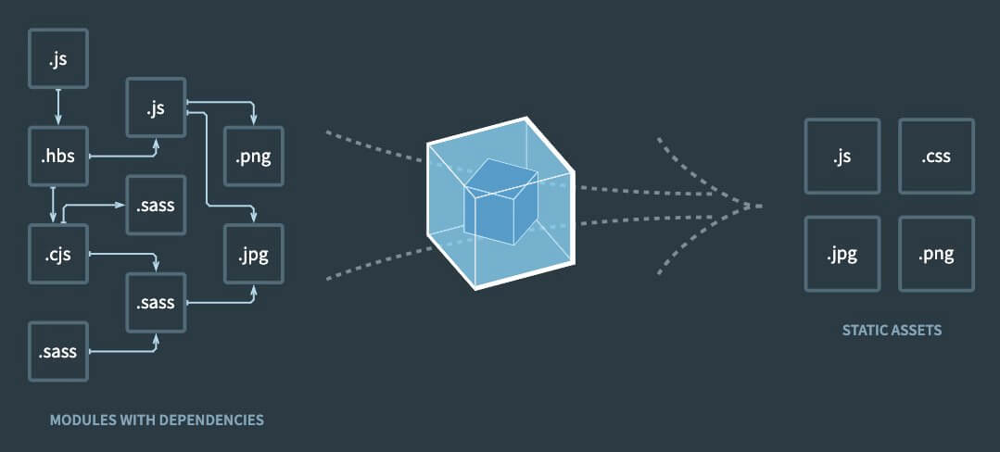
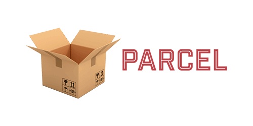

Webpack이나 Parcel, Rollup 등의 번들러(Bundler)는 현대적인 웹 개발의 필수적인 도구입니다.
최근 들어 번들러의 직접적인 사용보다는, Vite.js이나 Snowpack.js 같은 빌드 도구 혹은 Next.js, Nuxt, Sveltekit 등 프레임워크를 통해 간접적으로 사용하는 경우가 많아졌지만, 번들러의 기본 개념과 동작 원리를 이해하는 것은 여전히 중요합니다.
이 글에서는, 번들러의 기본 개념과 함께 동작 원리를 이해하기 위한 간단한 예제를 살펴보고, 추가로 빌드 도구에 대해서도 알아보겠습니다.

## 번들러

브라우저 모듈 시스템(Module system)이 아직 표준화되지 않았던 시기에는, 여러 자바스크립트 파일을 단순하게 HTML `<script>` 태그로 연결하는 방식을 사용했는데, 이러한 방식은 전역 오염이나 의존성 관리가 어려워지는 등의 여러 문제가 있었습니다.
그래서 CommonJS, AMD, UMD 등의 모듈 시스템이 등장했고, 이러한 모듈 시스템을 효율적으로 브라우저에서 사용하기 위해 번들러가 등장했습니다.

번들러(Bundler)는 웹 애플리케이션을 개발하기 위해 필요한 HTML, CSS, JS 등의 파편화된(모듈화된) 자원들을 모아서, 하나 혹은 최적의 소수 파일로 결합(번들링)하는 도구입니다.
그리고 결합을 위해 프로젝트를 해석하는 과정에서, 불필요한 주석이나 공백 제거, 난독화, 파일 압축 등의 기본적인 작업뿐만 아니라, 최신 문법이나 기타 개발에 편리한 특수 기능 등을 브라우저가 지원하는 형태로 변환하는 작업도 수행할 수 있도록 확장되었습니다.
결국, 현대의 번들러는 개발자의 작업 효율성을 높이고 브라우저의 호환성이나 성능 등을 개선하는데 크게 도움을 줍니다.

> __bundle__ - 묶다.

브라우저는 기본적으로 HTML, CSS, 자바스크립트(JS)를 표준으로 지원하며, 이를 통해 우리는 웹 애플리케이션을 구현할 수 있습니다.
이러한 표준 언어를 사용해 개발하는 것은 기본적이고 직관적이지만, 프로젝트의 규모가 커질수록 관리의 복잡성과 어려움이 크게 증가합니다.

다음 예제에서 사용하는 각 자바스크립트 파일은 모두 동일한 `title` 변수를 사용하고 있으며, 하나의 HTML 파일에 모두 연결되어 있기 때문에, `title` 변수가 중복 선언되어 오류가 발생합니다.

```html --path=/index.html
<link rel="stylesheet" href="./main.css">
<script defer src="./containerH1.js"></script>
<script defer src="./containerH2.js"></script>

<div class="container">
  <button>Toggle!</button>
  <h1></h1>
</div>
<div class="container">
  <h2></h2>
</div>
```

```css --path=/main.css
.container {
  max-width: 1200px;
  margin: 0 auto;
}
.container h1 {
  font-weight: bold;
}
```

```js --path=/containerH1.js
let title = 'JavaScript!'
const h1El = document.querySelector('.container h1')
h1El.textContent = title

let isShow = true
const buttonEl = document.querySelector('.container button')
buttonEl.addEventListener('click', () => {
  isShow = !isShow
  isShow
    ? h1El.style.display = 'block'
    : h1El.style.display = 'none'
})
```

```js --path=/containerH2.js --line-error=1
let title = 'Bundler!' // Error: Identifier 'title' has already been declared
const h2El = document.querySelector('.container h2')
h2El.textContent = title
```

간단하게는 다음과 같이 즉시실행함수(IIFE)를 사용하는 지역화를 통해 변수의 중복 선언은 피할 수 있지만, 규모가 조금만 확장돼도 프로젝트에서 모든 파일을 이와 같은 방식으로 관리하긴 어렵습니다.

```js --path=/containerH1.js
;(() => {
  let title = 'JavaScript!'
  const h1El = document.querySelector('.container h1')
  h1El.textContent = title

  let isShow = true
  const buttonEl = document.querySelector('.container button')
  buttonEl.addEventListener('click', () => {
    isShow = !isShow
    isShow
      ? h1El.style.display = 'block'
      : h1El.style.display = 'none'
  })
})()
```

```js --path=/containerH2.js
;(() => {
  let title = 'Bundler!' // OK!
  const h2El = document.querySelector('.container h2')
  h2El.textContent = title
})()
```

그러면 다시 즉시실행함수를 사용하기 전으로 돌아가서, 이번에는 번들러를 사용하는 코드로 변경해 봅시다.
HTML에는 주 스크립트 파일(`main.js`)만 연결하고, 그 파일에서 필요한 각 파일을 가져오도록 작성합니다.
이제 번들러를 사용하기 때문에 자바스크립트(`*.js`) 파일뿐만 아니라, 구성하기에 따라 `*.css`, `*.scss`, `*.vue`, `*.ts` 등의 다양한 파일을 가져와 사용할 수도 있습니다.

/// message-box --icon=info
`import` 키워드로 가져오는 스크립트 파일은 모듈로 인식되어, 각 파일의 최상위 범위(Top level scope) `title` 변수는 전역(Global)으로 선언되지 않고, 모듈 내부에서만 유효한 지역(Local) 변수로 선언됩니다.
///

```html --path=/index.html
<script src="./main.js"></script>

<div class="container">
  <button>Toggle!</button>
  <h1></h1>
</div>
<div class="container">
  <h2></h2>
</div>
```

```js --path=/main.js
import './main.css'
import './containerH1.js'
import './containerH2.js'
//
import { fade } from './animate.ts'
import App from './App.vue'
import data from './data.json'
// ...
```

이렇게 번들러를 사용하는 환경에서는 예를 들어, `.vue` 확장자를 가진 특수 파일(SFC, Single File Component)을 사용해, 다음과 같이 빠르게 타입스크립트나 SCSS를 적용할 수 있고 컴포넌트를 통해 각 구성 요소를 프로젝트에서 쉽게 생산하고 재활용하며 효율적으로 관리할 수 있습니다.

```vue --path=/Main.vue
<script setup lang="ts">
  import { ref } from 'vue'
  const title = ref('Hello World!')
  const isShow = ref(true)
</script>

<template>
  <div class="container">
    <button @click="isShow = !isShow">
      Toggle!
    </button>
    <h1 v-show="isShow">
      {{ title }}
    </h1>
  </div>
</template>

<style scoped lang="scss">
  .container {
    max-width: 1200px;
    margin: 0 auto;
    h1 {
      font-weight: bold;
    }
  }
</style>
```

```vue --path=/Sub.vue
<script setup lang="ts">
  import { ref } from 'vue'
  const title = ref('Bundler!')
</script>

<template>
  <div class="container">
    <h2>{{ title }}</h2>
  </div>
</template>
```

하지만, 브라우저는 `.vue` 파일이나 타입스크립트, SCSS 등을 직접 지원하지 않기 때문에, `.vue` 파일을 브라우저가 이해할 수 있는 표준(HTML, CSS, JS)으로 변환해야 합니다!

이러한 개념은 [Webpack 번들러의 홈페이지](https://webpack.kr/)에서 다음과 같이 그림으로 잘 표현하고 있습니다.



### Webpack


[Webpack(웹팩)](https://webpack.kr/)은 대표적인 자바스크립트 번들러로, 많은 기능과 확장성으로 좀 더 복잡한 프로젝트에서도 효율적으로 모듈을 관리할 수 있도록 도와줍니다.
Webpack은 크게 다음과 같은 기능을 제공합니다.

- 모듈 번들링(Module Bundling): 진입점에 연결된 파일을 단일 파일로 묶어줍니다.
- 번들 최적화(Automatic Bundle Optimization): 번들 최적화를 통해, 보다 더 작은 번들을 생성하고 그만큼 빠르게 로딩할 수 있습니다.
- 코드 스플리팅(Code Splitting): 모듈을 청크(chunk)로 분리하여, 동적으로 필요한 모듈만 로딩할 수 있습니다.
- 트리 쉐이킹(Tree Shaking): 사용되지 않는 코드를 제거해 번들의 크기를 줄이고 성능을 향상시킬 수 있습니다.
- 개발 서버 실행(Development Server): 코드가 변경될 때마다 브라우저에 반영(HMR)되는 개발용 서버를 실행할 수 있습니다.

다음과 같은 React 프로젝트를 시작하기 위해, Webpack 기반으로 구성해 봅시다.

/// message-box --icon=info
Webpack 구성의 최종 결과는 [여기](https://github.com/ParkYoungWoong/Bundle_Build_Compare--vite-webpack-parcel/tree/webpack)에서 확인할 수 있습니다.
///

```plaintext --caption=프로젝트 기본 구조
├─src/
│  ├─App.jsx
│  ├─index.html
│  ├─main.js
│  └─main.scss
├─static/
│  ├─favicon.ico
│  └─favicon.png
├─.swcrc
├─package.json
├─package-lock.json
└─webpack.config.js
```

```html --path=/src/index.html
<!DOCTYPE html>
<html lang="ko">
<head>
  <meta charset="UTF-8">
  <meta name="viewport" content="width=device-width, initial-scale=1.0">
  <title>React x Webpack</title>
  <script defer src="main.js"></script>
</head>
<body>
  <div id="app"></div>
</body>
</html>
```

```js --path=/src/main.js
import { createRoot } from 'react-dom/client'
import App from './App.jsx'
import './main.scss'

const root = createRoot(document.querySelector('#app'))
root.render(<App />)
```

```jsx --path=/src/App.jsx
import { useState } from 'react'

export default function App() {
  const [count, setCount] = useState(0)
  return (
    <>
      <button onClick={() => setCount(count + 1)}>증가!</button>
      <h1>Count: {count}</h1>
    </>
  )
}
```

```scss --path=/src/main.scss
$color: red;
h1 {
  color: $color;
}
```

먼저, Webpack 번들러를 사용하기 위한 기본 패키지를 설치합니다.

- `webpack`: 모듈(패키지) 번들러의 핵심 패키지
- `webpack-cli`: 터미널에서 Webpack 명령(CLI)을 사용할 수 있음
- `webpack-dev-server`: 개발용으로 Live Server를 실행(HMR)

```bash
npm i -D webpack webpack-cli webpack-dev-server
```

Webpack을 실행할 스크립트를 다음과 같이 `package.json` 파일에 추가합니다.

```json --path=/package.json --line-numbers
{
  "scripts": {
    "dev": "webpack serve --mode development --open",
    "build": "webpack --mode production"
  }
}
```

Webpack은 `webpack.config.js` 파일을 통해 프로젝트의 구성(Configuration)을 설정합니다.
다양한 구성 옵션이 있지만, 기본적으로 다음과 같은 옵션이 있습니다.

- 진입점(Entry)
- 출력(Output)
- 로더(Loaders)
- 플러그인(Plugins)

/// message-box --icon=info
`webpack.config.js` 파일은 프로젝트 루트(Root) 경로 위치해야 하며, 브라우저가 아닌 Node.js 환경에서 실행되기 때문에 CommonJS 모듈 방식으로 작성합니다.
///

```js --path=/webpack.config.js
module.exports = {
  entry: '', // 진입점
  output: {}, // 출력
  module: { // 로더(모듈)
    rules: []
  },
  plugins: [], // 플러그인
  // 기타 옵션...
}
```

#### 진입점

진입점(Entry point)은, Webpack이 프로젝트를 해석하기 시작하는 위치(파일)를 말합니다.
`entry` 속성을 통해 진입점을 설정할 수 있으며, 기본적으로 자바스크립트 파일입니다.

```js --path=/webpack.config.js
module.exports = {
  entry: './src/main.js'
}
```

필요한 경우, 다중 진입점을 사용할 수도 있습니다.

```js --path=/webpack.config.js
module.exports = {
  entry: {
    main: './src/main.js',
    sub: './src/sub.js',
    hi: './src/hi.js',
    // ...
  }
}
```

#### 출력

출력(Output)은 Webpack이 생성하는 번들 파일의 이름과 경로를 설정하는 옵션입니다.

/// message-box --icon=info
`__dirname`은 Node.js CommonJS 모듈 시스템에서 제공하는 전역 변수로, 현재 파일의 절대 경로를 반환합니다.
///

/// message-box --icon=info
`dist`는 distribution(배포)의 약어로, '배포될 최종 결과물이 담긴 폴더'라는 의미를 가집니다.
///

```js --path=/webpack.config.js
module.exports = {
  output: {
    // 기본값,
    // path: path.resolve(__dirname, 'dist'), // 현재 파일의 절대 경로를 기준, dist 폴더에 결과 생성
    // filename: '[name].js', // [name]을 통해 진입점의 파일 이름이 그대로 적용
    clean: true // 결과 생성 전, 기존 결과물 삭제
  }
}
```

#### 로더

로더(Loaders)는 Webpack이 `*.js` 파일 외 기타 모듈(파일)을 처리하는 기능으로, `module` 속성을 통해 구성합니다.
`module.rules` 속성에 배열 형태로 작성하며, 각 규칙은 기본적으로 `test`, `use` 속성을 가집니다.

`test` 속성을 정규표현식(RegExp)으로 작성해, 일치하는 파일을 처리할 수 있도록 지정하고,
`use` 속성을 통해 해당 파일을 처리할 로더를 명시합니다.

/// message-box --icon=info
대부분의 로더는 `npm i -D <name>`으로 설치하는 외부 패키지입니다.
///

다음은 SCSS, CSS, JSX 파일과 여러 이미지 파일을 처리할 수 있도록 구성한 예제입니다.

- `style-loader`: 로드된 스타일(CSS)을 `<style>`로 `<head>`에 삽입
- `css-loader`: CSS 파일을 로드
- `sass-loader`: SCSS/Sass 파일을 로드
- `sass`: SCSS/Sass 문법을 해석(스타일 전처리기)
- `swc-loader`: JS/JSX 파일 로드
- `@swc/core`: JS/JSX 파일 해석(트렌스파일)

```bash
npm i -D style-loader css-loader sass-loader sass swc-loader @swc/core
```

```js --path=/webpack.config.js
module.exports = {
  module: {
    rules: [
      {
        test: /\.s?css$/,
        use: [
          // 순서 중요!
          'style-loader',
          'css-loader',
          'sass-loader'
        ]
      },
      {
        test: /\.jsx?$/,
        use: 'swc-loader'
      },
      {
        test: /\.(png|jpe?g|svg|gif|webp)$/i, // i 옵션 - 대소문자 구분 없음
        type: 'asset/resource' // type을 통해 Webpack에 내장된 로더(Builtin Loader) 명시
      }
    ]
  }
}
```

SWC를 통해 JS/JSX 파일을 해석할 때 필요한 옵션을 제공할 수 있습니다.
`"runtime": "automatic"`을 통해, React 17버전 이상에서 일부 코드(`import React from 'react'`)를 생략하고 JSX를 사용할 수 있습니다.

/// message-box --icon=info
[SWC(Speedy Web Compiler)](https://swc.rs/)는 고성능 자바스크립트/타입스크립트 트랜스파일러입니다.
[Rust](https://www.rust-lang.org/)로 작성되어, 기존의 [Babel](https://babeljs.io/) 보다 더 빠르고 자원을 효율적으로 병렬 처리(멀티 쓰레드)할 수 있습니다.
///

```json --path=/.swcrc
{
  "jsc": {
    "parser": {
      "syntax": "ecmascript",
      "jsx": true
    },
    "transform": {
      "react": {
        "runtime": "automatic"
      }
    }
  }
}
```

#### 플러그인

번들링된 결과물을 처리하는 역할의 외부 플러그인(Plugins)을 연결할 수 있습니다.
기본적으로 로더가 파일 단위로 처리해 번들 결과를 만드는 것과 다르게, 플러그인은 번들된 결과를 처리합니다.

다음은 번들링된 결과물을 HTML 파일에 연결하고, `static` 폴더의 파일을 복사해 결과에 추가하고, `React`를 전역 변수로 사용할 수 있도록 설정한 예제입니다.

- `html-webpack-plugin`: 최초 실행될 HTML 파일(템플릿)을 연결
- `copy-webpack-plugin`: 정적 파일(파비콘, 이미지 등)을 제품(dist) 폴더로 복사

```bash
npm i -D html-webpack-plugin copy-webpack-plugin
```

```js --path=/webpack.config.js
const HtmlPlugin = require('html-webpack-plugin')
const CopyPlugin = require('copy-webpack-plugin')

module.exports = {
  plugins: [
    new HtmlWebpackPlugin({
      template: './src/index.html'
    }),
    new CopyPlugin({
      patterns: [{ from: 'static' }]
    })
  ]
}
```

### Parcel



[Parcel(파셀)](https://parceljs.org/)은 Webpack과 달리 별도의 구성 파일 없이 간단하게 사용할 수 있는 번들러로, 최소한의 구성(Zero config)을 지향합니다.
주로 사용하는 기능이나 필요한 기능을 자동으로 설치하고 처리하기 때문에 쉽고 빠르게 프로젝트를 구성할 수 있습니다.

/// message-box --icon=warning
Parcel 번들러를 통해, 작은 규모의 프로젝트를 빠르게 시작하기 좋습니다.
하지만, 규모가 크거나 복잡한 구조의 프로젝트에서는 원하는 상세한 구성을 제공하기 어려워 효율적이지 않습니다.
///

다음과 같은 React 프로젝트를 시작하기 위해, Parcel 기반으로 구성해 봅시다.

/// message-box --icon=info
Parcel 구성의 최종 결과는 [여기](https://github.com/ParkYoungWoong/Bundle_Build_Compare--vite-webpack-parcel/tree/parcel)에서 확인할 수 있습니다.
///

```plaintext --caption=프로젝트 기본 구조
├─src/
│  ├─App.jsx
│  ├─index.html
│  ├─main.scss
│  └─main.js
├─static/
│  ├─favicon.ico
│  └─favicon.png
├─.parcelrc
├─package.json
└─package-lock.json
```

```bash
npm i -D parcel
```

#### 진입점

Parcel은 기본적으로 자바스크립트가 아닌 HTML 파일을 진입점으로 사용합니다.

```json --path=/package.json
{
  "scripts": {
    "dev": "parcel ./src/index.html",
    "build": "parcel build ./src/index.html"
  }
}
```

Parcel 번들러는 최소 구성을 위해, `index.html`에 SCSS, JS, JSX, TS 파일 등을 직접 연결하는 방식을 가지며, 모두 자동으로 처리됩니다.

```html --path=/src/index.html --line-active=7-8
<!DOCTYPE html>
<html lang="ko">
<head>
  <meta charset="UTF-8">
  <meta name="viewport" content="width=device-width, initial-scale=1.0">
  <title>React + Parcel</title>
  <link rel="stylesheet" href="./main.scss">
  <script type="module" defer src="./main.js"></script>
</head>
<body>
  <div id="app"></div>
</body>
</html>
```

```js --path=/src/main.js --line-error=3
import { createRoot } from 'react-dom/client'
import App from './App.jsx'
// import './main.scss'

const app = document.querySelector('#app')
const root = createRoot(app)
root.render(<App />)
```

#### 출력

출력(Output) 또한 별도의 구성이 필요하지 않습니다.
기본적으로 `dist` 폴더에 결과물을 생성하며, 만약 다른 폴더를 사용하고 싶으면, `--out-dir` [CLI 옵션](https://parceljs.org/features/cli/)을 사용할 수 있습니다.

```json --path=/package.json
{
  "scripts": {
    "dev": "parcel ./src/index.html",
    "build": "parcel build ./src/index.html --out-dir hello-world"
  }
}
```

#### 플러그인

Parcel에서 자동으로 처리하는 않는 기능은, 플러그인으로 추가할 수 있습니다.
대표적으로 `static` 폴더의 파일을 복사하는 플러그인을 사용할 수 있습니다.

/// message-box --icon=info
Parcel의 자바스크립트 컴파일러는 SWC를 기반으로 구축되어 있으므로 별도 구성이 필요없습니다.
///

- `parcel-reporter-static-files-copy`: 정적 파일(파비콘, 이미지 등)을 `dist` 폴더로 복사

```bash
npm i -D parcel-reporter-static-files-copy
```

플러그인을 사용할 때는, 다음과 같이 프로젝트 루트 경로에 `.parcelrc` 파일을 생성하고, 기본 구성을 제공해야 합니다.
`"..."` 코드를 제거하지 마세요!

```json --path=.parcelrc
{
  "extends": ["@parcel/config-default"],
  "reporters":  ["...", "parcel-reporter-static-files-copy"]
}
```

## 빌드 도구

번들러는 여러 자원들을 모아서, 하나 혹은 최적의 소수 파일로 결합(번들링)합니다.
빌드 도구(Build tool)는 프로젝트 빌드 과정의 전체적인 흐름을 관리하기 위한 도구로, 보통 번들러를 기본 포함하고 개발 서버나 린팅, 테스트 등의 추가로 개발에 필요한 여러 도구를 가지고 있습니다.

### Vite


[Vite(비트)](https://vitejs.dev/)는 Vue.js 창시자인 Evan You가 만든 빌드 도구로, 처음에는 Vue.js 프로젝트를 위해 시작되었지만, React나 Svelte 같은 다른 프레임워크에서도 사용할 수 있도록 확장되었습니다.

- 프로젝트 크기와 상관없이 최고의 빠른 속도를 유지하는 개발 서버를 제공(HMR)합니다.
- JSX, TS, TSX, SCSS 등을 추가 구성없이도 즉시 지원합니다.
- 개발 서버와 제품 빌드 간의 차이가 없도록 최적화되어 있습니다.

/// message-box --icon=warning
ESM 방식은 대부분의 브라우저 환경에서 지원되지만, 개발 모드가 아닌 제품 모드에서 ESM 방식만 사용하는 것은 중첩 가져오기 등의 문제로 비효율적입니다.
코드 스플리팅, 트리 쉐이킹 등의 기능을 위해, 제품 모드에서는 여전히 번들링이 필요하며, Vite 내부적으로 [Rollup](https://rollupjs.org/) 번들러를 사용하고 있습니다.
///

다음 이미지에서 볼 수 있는 것처럼, 번들 방식은 변경된 내용이 있는 경우, 전체를 다시 빌드해야 하므로 프로젝트가 커질수록 빌드 시간이 늘어납니다.
하지만, 브라우저의 Native ESM 방식을 사용하면, 변경된 모듈만 바로 반영할 수 있으므로 프로젝트 크기에 상관없이 빠르게 개발할 수 있습니다.

/// message-box --icon=info
라우트(Route)는 웹 페이지나 세부 화면(View) 등을 구분하는 기준 경로를 말합니다.
단순히 '페이지'로 이해하면 쉽습니다.
///


React 프로젝트를 시작하기 위해, 간단하게 Vite 기반으로 구성해 봅시다.
SCSS 사용을 위해, `sass` 패키지도 함께 설치합니다, 별도 구성은 필요하지 않습니다.

/// message-box --icon=info
Vite 구성의 최종 결과는 [여기](https://github.com/ParkYoungWoong/Bundle_Build_Compare--vite-webpack-parcel/tree/vite)에서 확인할 수 있습니다.
///

```bash
npm create vite@latest .
  # > React 선택
  # > JavaScript + SWC 선택

# 의존성 패키지 설치
npm i
npm i -D sass
```

Vite는 프로젝트의 기본 구조를 가지고 시작하고 있습니다.
따라서 기존의 Webpack이나 Parcel 번들러 프로젝트 같이 수정하면, 다음과 같은 구조를 가질 수 있습니다.
바로 개발 서버를 실행할 수 있는 샘플 코드이므로, 원하는 대로 수정하고 사용하면 됩니다.

```plaintext --caption=프로젝트 구조
├─src/
│  ├─App.jsx
│  ├─main.jsx
│  └─main.scss
├─public/
│  ├─favicon.ico
│  └─favicon.png
├─index.html
├─package.json
├─package-lock.json
└─vite.config.js
```

/// message-box --icon=lightbulb
Vite 프로젝트의 좀 더 자세한 구성은 [React 프로젝트 시작하기 w. Vite](/p/6iFzkB) 혹은 [Vue 프로젝트 시작하기 w. Vite](/p/aBLqC5) 글을 참고하세요.
///