GA4 Query Explorer와 Google Analytics Data API를 활용해, Google Analytics에서 웹사이트의 트래픽 정보를 가져오는 방법을 알아봅니다.
(GA4 쿼리 익스플로러, 구글 애널리틱스 데이터 API)

## GA4 Query Explorer

[GA4(Google Analytics 4) Query Explorer](https://ga-dev-tools.google/ga4/query-explorer/)는 데이터를 쿼리하고 탐색할 수 있는 사이트입니다.
이 사이트에서 Google Analytics Data API를 직접 호출하지 않고도, 다양한 트래픽 데이터를 조회하거나 분석할 수 있습니다.

GA4 Query Explorer는 OAuth 2.0 인증을 사용하므로, Google 계정으로 로그인한 후에 사용할 수 있습니다.

/// message-box --icon=warning
GA4 Query Explorer를 사용하기 위해서는 자신이 보유한 사이트에 대한 Google Analytics 4 데이터가 있어야 하며, 사용 권한이 있는 계정으로 로그인해야 합니다.
///

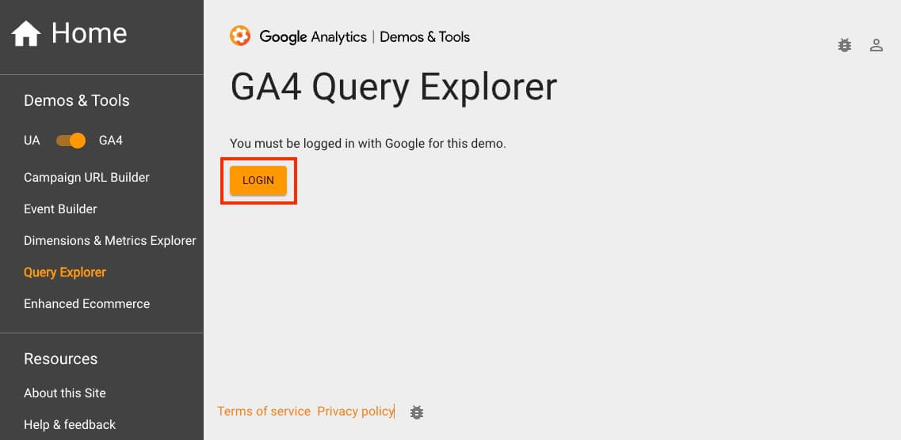

### 어제의 활성 사용자

간단한 테스트를 위해 어제 날짜의 '활성 사용자' 데이터를 가져오는 쿼리를 작성해봅시다.
다음 이미지와 같이 `account`(계정), `property`(애플리케이션) 항목의 값을 선택하고, `date ranges`(조회 기간), `metrics`(측정 항목) 항목에 각각 `yesterday`(어제)와 `activeUsers`(활성 사용자) 값을 입력합니다.

| 항목 | 값 |
| --- | --- |
| `account` | `GA4 계정` |
| `property` | `GA4 애플리케이션` |
| `dateRanges.startDate` | `yesterday` |
| `dateRanges.endDate` | `yesterday` |
| `metrics` | `activeUsers` |

/// message-box --icon=warning
`property` 항목에서 선택 가능한 값이 없는 경우, GA4 데이터가 없거나 사용 권한이 없을 수 있으니 확인해보세요.
///

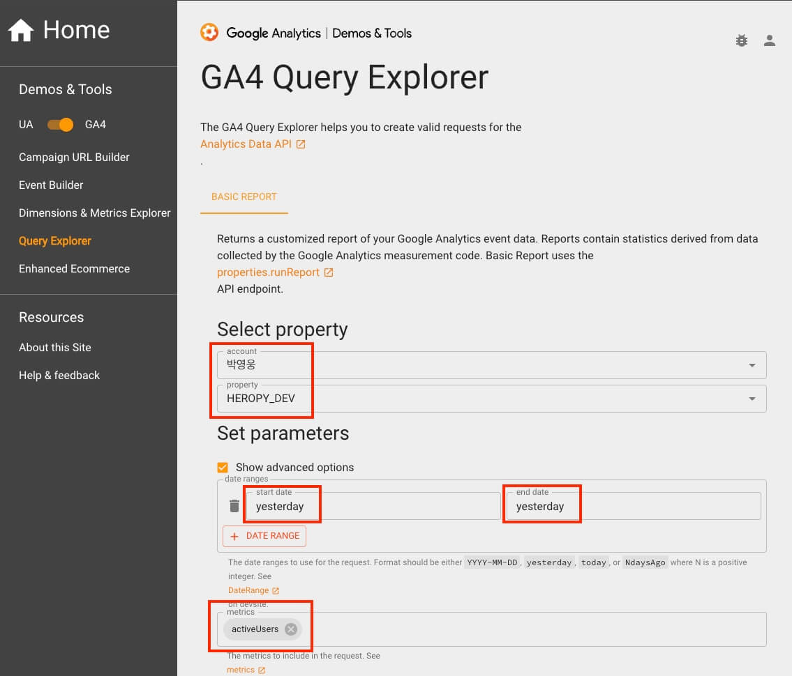

이제 화면 하단의 `MAKE REQUEST` 버튼을 선택해 데이터를 요청합니다.
`Show request JSON` 항목을 선택하면, 요청하는 데이터 구조를 JSON 형태로 확인할 수 있습니다.
이는 우리가 뒤에서 확인할 Google Analytics Data API의 요청 데이터와 같으니 참고하기에 아주 좋습니다.

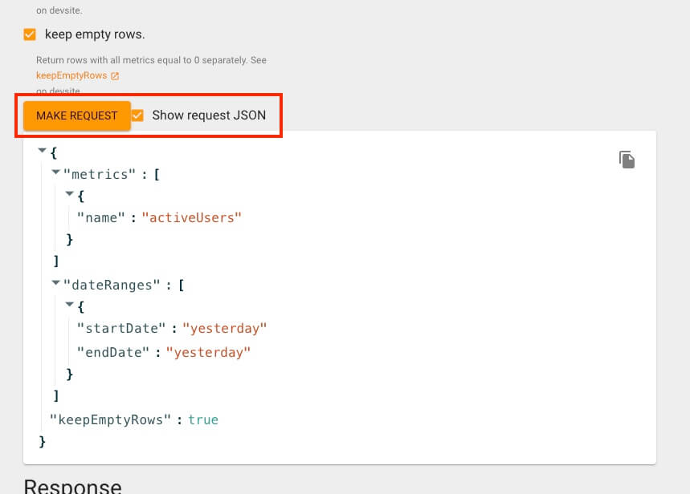

그러면 다음 이미지와 같이, 가져오는 데이터를 JSON이나 TABLE 형태로 확인할 수 있습니다.
역시 JSON 형태는 Google Analytics Data API의 응답 데이터와 같습니다.
`response.rows[0].metricValues[0].value` 값이 활성 사용자 수이고 타입은 `string`입니다.
어제 날짜의 활성 사용자는 830명이네요.

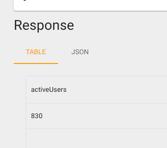

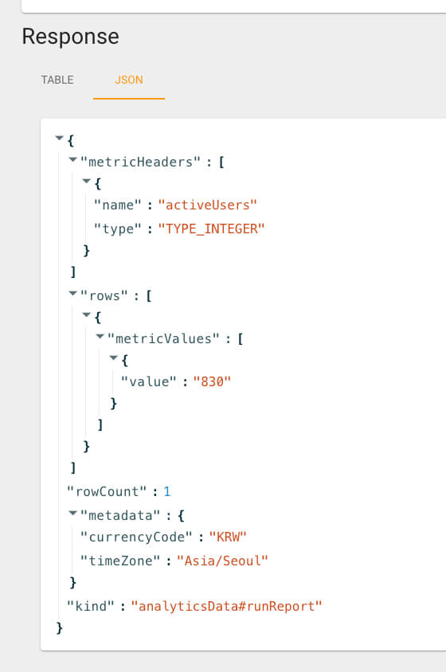

### 특정 기간의 활성 사용자 합계

이번에는 특정 기간(일주일)의 '활성 사용자' 데이터를 가져오는 쿼리를 작성해봅시다.
다음과 같이 기간과 측정 항목을 입력합니다.

| 항목 | 값 |
| --- | --- |
| `dateRanges.startDate` | `2024-03-20` |
| `dateRanges.endDate` | `2024-03-26` |
| `metrics` | `activeUsers` |

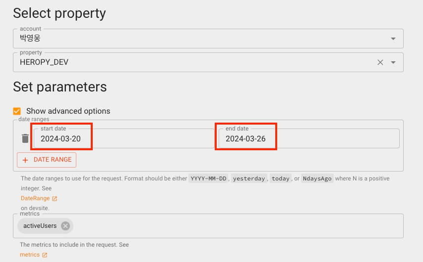

입력을 완료하면, 화면 하단의 `MAKE REQUEST` 버튼을 선택해 데이터를 다시 요청합니다.
불필요한 정보가 포함되지 않았는지, 요청 데이터 구조를 잘 확인하는 것이 좋습니다.

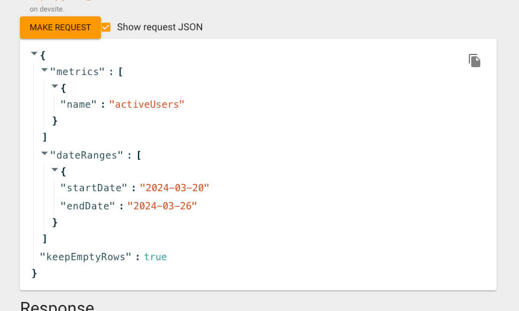

응답 결과를 확인하면, 다음과 같이 특정 기간의 활성 사용자 수 합계가 확인됩니다.

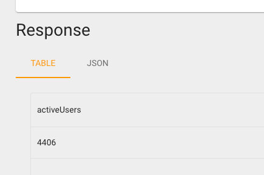

### 날짜별 활성 사용자 및 조회수

만약 합계가 아닌 날짜 단위로 결과를 확인하고 싶다면, `dimensions`(측정 기준) 항목에 `date`(`YYYYMMDD` 형식의 날짜)를 입력합니다.
그리고 조회수와 활성 사용자를 같이 확인할 수도 있습니다, `metrics` 항목에 `screenPageViews` 값을 추가로 입력합니다.

| 항목 | 값 |
| --- | --- |
| `dateRanges.startDate` | `2024-03-20` |
| `dateRanges.endDate` | `2024-03-26` |
| `metrics` | `activeUsers`, `screenPageViews` |
| `dimensions` | `date` |

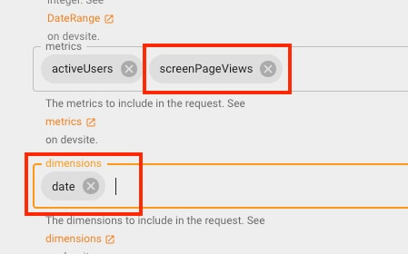

다시 요청을 보내면, 이제 날짜별 조회수 데이터를 확인할 수 있습니다.
그런데, 자세히 보면 날짜가 순서대로 정렬되어 있지 않습니다.

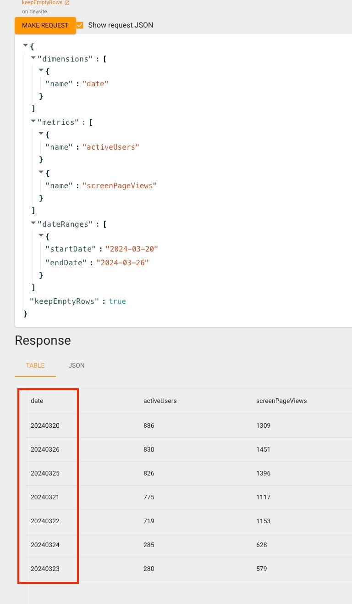

### 응답 결과 정렬

응답 결과를 날짜 순으로 정렬하려면, `order by` 항목에서 DIMENSION 버튼을 선택한 후 `date`를 입력합니다.
그리고 우측 화살표 버튼으로, 오름차순(Ascending) 또는 내림차순(Descending)을 선택할 수 있습니다.

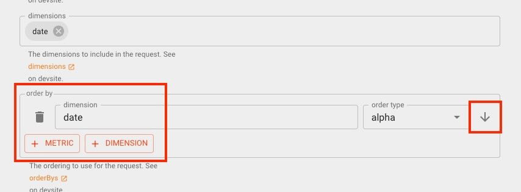

다시 요청을 보내면, 이제 날짜 순서대로 정렬된 결과를 확인할 수 있습니다.

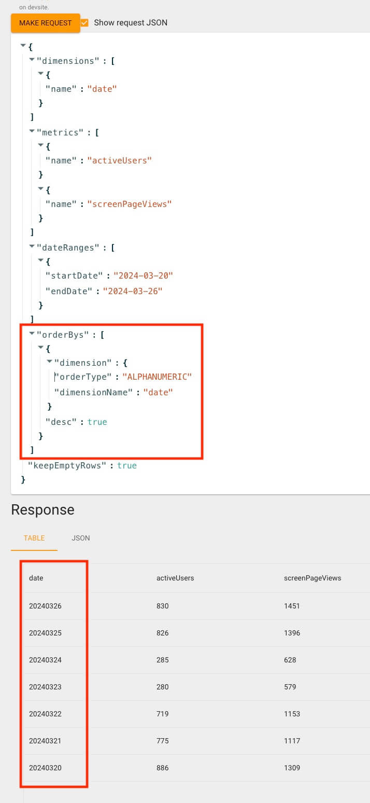

### 특정 페이지의 결과 확인

만약 사이트 내 모든 페이지의 데이터가 아닌 특정 페이지의 데이터만 확인하고 싶다면, `dimensionFilter` 항목을 사용할 수 있습니다.
현재 블로그, [개발자 소개](https://heropy.dev/about) 페이지(`/about`)의 데이터를 확인해 보겠습니다.

먼저 `dimensions` 항목에 `pagePath`를 추가로 입력합니다. 
그리고 `dimensionFilter` 항목의 `FILTER` 버튼을 선택합니다. 

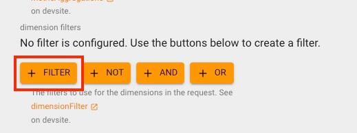

그리고 다음과 같이 필터 조건을 입력합니다.
정규식을 사용하는 것이 명확한 결과를 지정하는 데 도움이 됩니다.
`^`는 문자열의 시작을 의미하고, `$`는 문자열의 끝을 의미합니다.
즉, 경로가 `/about`으로 시작하고 끝나는 페이지 주소를 필터링하는 것입니다.

| 항목 | 값 |
| --- | --- |
| `dateRanges.startDate` | `2024-03-20` |
| `dateRanges.endDate` | `2024-03-26` |
| `metrics` | `activeUsers`, `screenPageViews` |
| `dimensions` | `date`, `pagePath` |
| `dimensionFilter.dimension` | `pagePath` |
| `dimensionFilter.filterType` | `string` |
| `dimensionFilter.matchType` | `regexp` |
| `dimensionFilter.value` | `^/about$` |

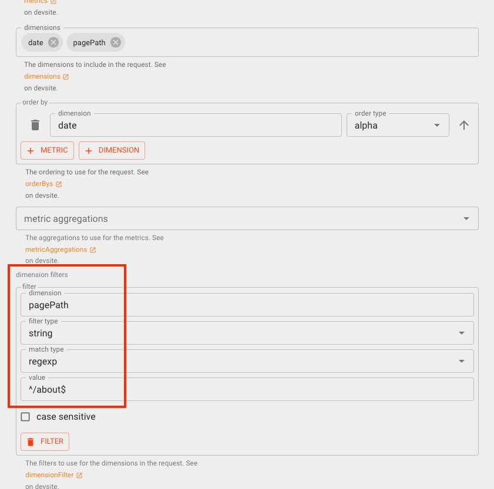

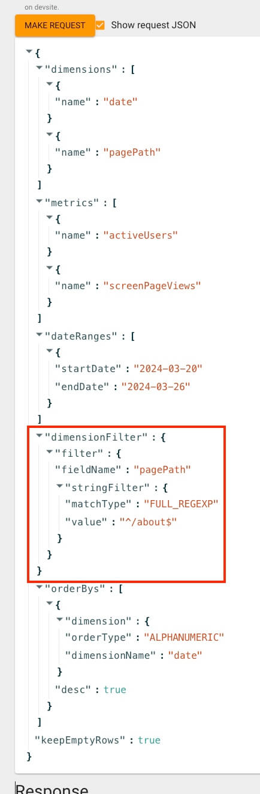

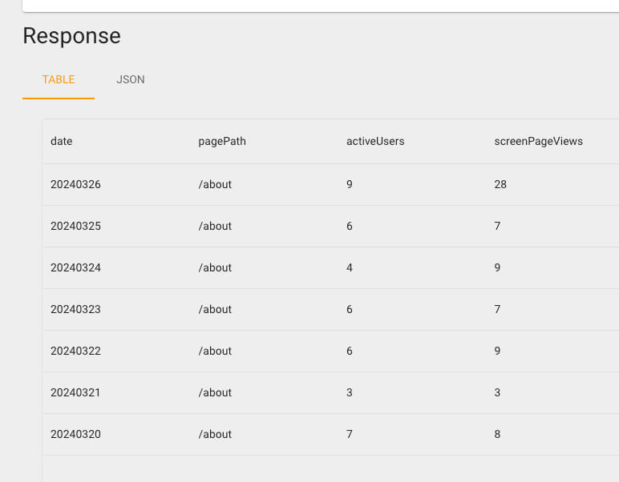

응답 데이터의 JSON 구조는 복잡해 보이지만, 어렵지 않습니다.
기본적인 데이터 구조는 다음과 같으니, 아래 이미지와 비교해서 확인해보세요.

| 항목 | 설명 |
| --- | --- |
| `response.dimensionHeaders[0].name` | 날짜(`date`) |
| `response.dimensionHeaders[1].name` | 페이지 주소(`pagePath`) |
| `response.metricHeaders[0].name` | 활성 사용자 수(`activeUsers`) |
| `response.metricHeaders[1].name` | 조회수(`screenPageViews`) |
| `response.rows[0]` | 2024년 3월 26일 날짜의 데이터 |
| `response.rows[0].dimensionValues[0].value` | 날짜 |
| `response.rows[0].dimensionValues[1].value` | 페이지 주소 |
| `response.rows[0].metricValues[0].value` | 활성 사용자 수 |
| `response.rows[0].metricValues[1].value` | 조회수 |
| `response.rows[1]` | 2024년 3월 25일 날짜의 데이터 |
| `response.rows[2]` | 2024년 3월 24일 날짜의 데이터 |
| `response.rows[3]` | 2024년 3월 23일 날짜의 데이터 |
| . . . |  |

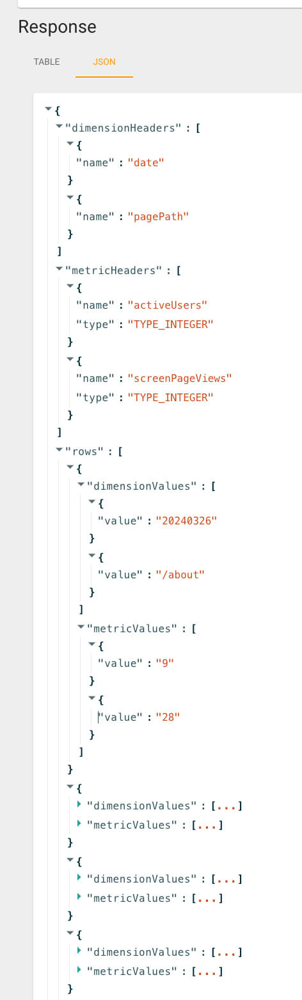

### API 측정 기준 및 측정 항목

지금까지 우리가 사용한 측정 기준(Dimensions)과 측정 항목(Metrics)은 다음과 같습니다.

- 측정 기준(Dimensions)
  - `date`: 날짜
  - `pagePath`: 페이지 주소
- 측정 항목(Metrics)
  - `activeUsers`: 활성 사용자 수
  - `screenPageViews`: 페이지뷰 수

Google Analytics Data API에서 사용할 수 있는 측정 기준과 측정 항목의 더 자세한 내용은 [API 측정 기준 및 측정 항목](https://developers.google.com/analytics/devguides/reporting/data/v1/api-schema?hl=ko) 가이드 문서를 참고하세요.


## Google Analytics Data API

GA4 Query Explorer 사이트에서 어떤 데이터를 가져올지 확인했다면, 이제는 Google Analytics Data API를 사용해 데이터를 가져오는 방법을 알아봅시다.

Google Analytics Data API의 사용 방식은 크게 두 가지로, REST API와 라이브러리 사용 방식으로 나뉩니다.
REST API 방식은 GA4 Query Explorer와 같이 OAuth 2.0 클라이언트 생성을 통해 액세스 토큰을 얻어야 합니다.
따라서 일반적인 Node.js 서버 환경에서 데이터 수집용으로 사용하기에는 불편하고, 대신 `@google-analytics/data` 라이브러리를 사용해 인증 정보(credentials)를 제공하면 쉽게 사용할 수 있습니다.

/// message-box --icon=warning
보안을 위해, 인증 정보(credentials)는 서버 환경에서만 사용하고, 클라이언트 환경에서는 직접 사용하지 않아야 합니다!
///

### API 사용 설정

Google Analytics Data API를 사용하려면, [Google Cloud Console](https://console.cloud.google.com/)에서 프로젝트를 생성하고 사용을 승인하는 등 여러 작업이 필요합니다.
이 과정을 거치지 않고 바로 시작하는 좋은 방법이 있습니다. 
먼저 Google Analytics Date [API 빠른 시작](https://developers.google.com/analytics/devguides/reporting/data/v1/quickstart-client-libraries?hl=ko) 가이드 문서 페이지로 이동해, 다음 이미지에서 보이는 것처럼 `Google Analytics Data API v1 사용 설정` 버튼을 선택합니다.

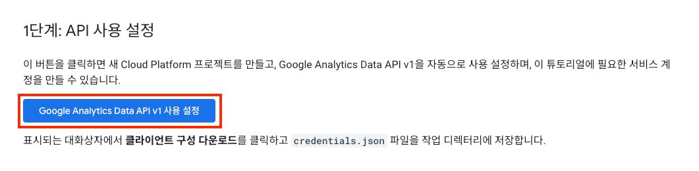

모달이 열리면, 프로젝트의 이름을 입력하고 `NEXT` 버튼을 선택합니다.

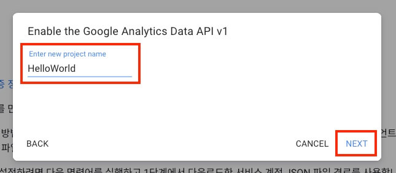

잠시 후 다음과 같이 프로젝트 생성 결과가 나타나면, `DOWNLOAD PRIVATE KEY AS JSON` 버튼을 선택해 서비스 계정 키를 다운로드합니다.

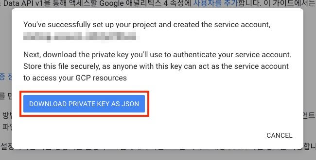

다운로드한 파일을 확인하면, 다음과 같은 구조의 JSON 파일입니다.
우선 확인할 정보는 `client_email` 속성이고 그 값을 복사해두세요.

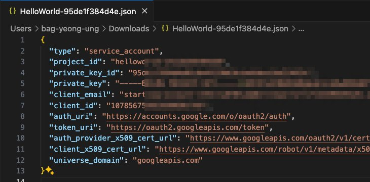

### 서비스 계정 추가

Google Analytics 계정 액세스 관리에서 서비스 계정을 추가해야, 해당 애널리틱스 애플리케이션의 Google Analytics Data API를 사용할 수 있습니다.

먼저 Google Analytics 계정에 로그인한 후, 해당 애널리틱스 애플리케이션의 `관리` 메뉴로 이동합니다.
그리고 '계정 설정 > 계정 > 계정 액세스 관리' 메뉴를 선택합니다.

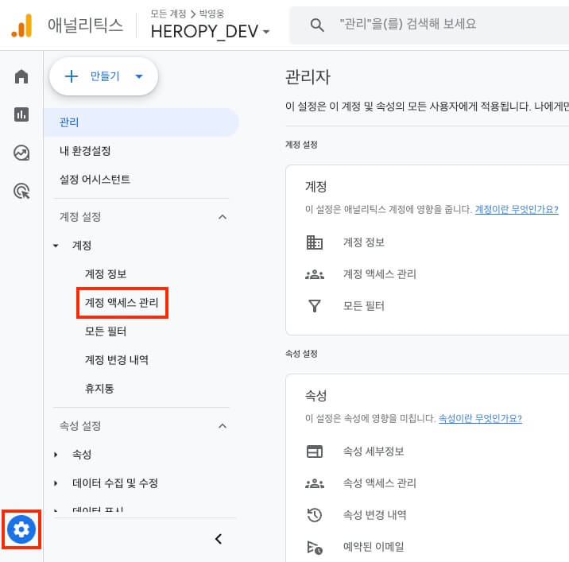

우측 상단의 `+` 버튼에서 `사용자 추가` 항목을 선택합니다.

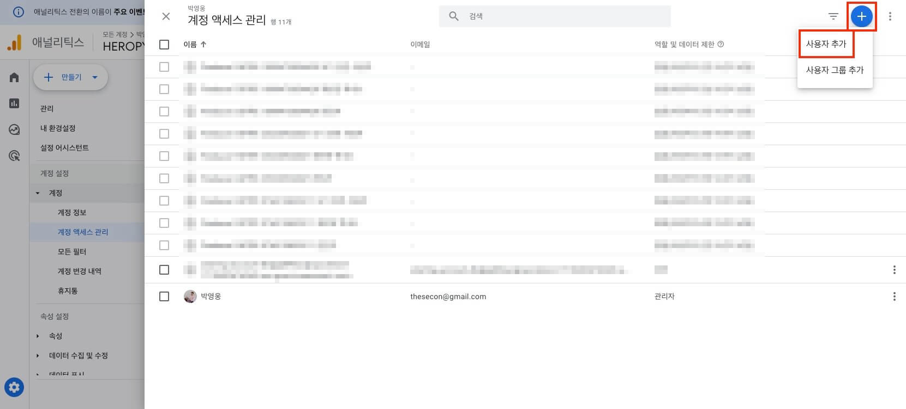

앞에서 복사한 `client_email` 속성의 값을 붙여넣고, 원하는 표준 역할을 선택합니다.
단순히 '뷰어'로 선택해도 무방합니다.
그리고 우측 상단의 `추가` 버튼을 선택해 서비스 계정 추가를 완료합니다.

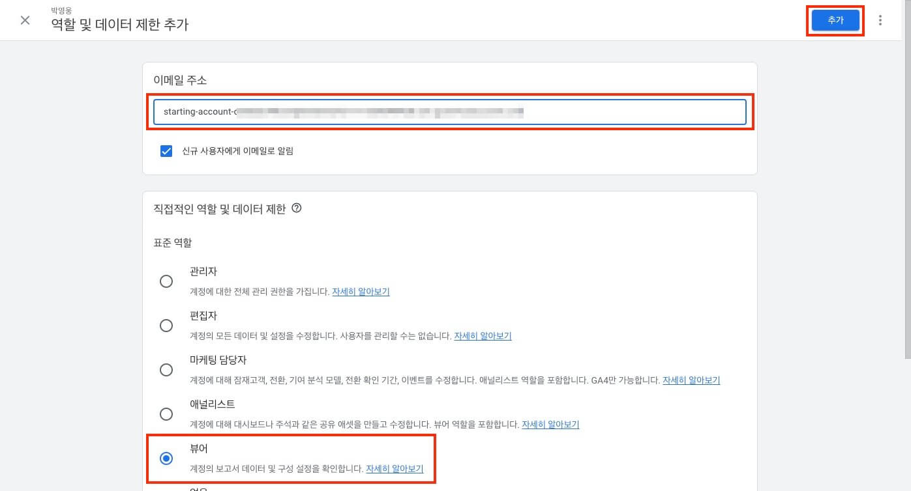

### 프로젝트 구성

이제 Google Analytics Data API를 사용할 프로젝트를 구성해보겠습니다.
빈 프로젝트를 생성하고, `dotenv`, `@google-analytics/data` 라이브러리를 설치합니다.

```bash
mkdir google-analytics-api
cd google-analytics-api
code .
npm init -y
npm install dotenv @google-analytics/data
```

루트 경로에 `.env` 파일을 추가해 다음과 같이 환경 변수를 입력합니다.
`GOOGLE_APPLICATION_CREDENTIALS`는 앞에서 다운로드한 키 파일(JSON)의 값을 복사해 붙여넣고 인라인으로 작성합니다.(한 줄로 작성되도록 모든 줄바꿈을 제거)

/// message-box --icon=info
`GOOGLE_APPLICATION_CREDENTIALS` 변수에는 단순히 키 파일의 경로를 입력해도 되지만, 이후 코드 배포 등을 고려하면 환경 변수로 사용하는 것을 추천합니다.
///

```plaintext --path=/.env
GOOGLE_APPLICATION_CREDENTIALS={ "type": "service_account", "project_id": "helloworld-1711...
GOOGLE_ANALYTICS_PROPERTY="412883001"
```

`GOOGLE_ANALYTICS_PROPERTY`는 Google Analytics 속성 ID를 입력합니다.
속성 ID는 간단하게 GA4 Query Explorer에서 확인하거나, Google Analytics 관리 페이지에서도 확인할 수 있습니다.

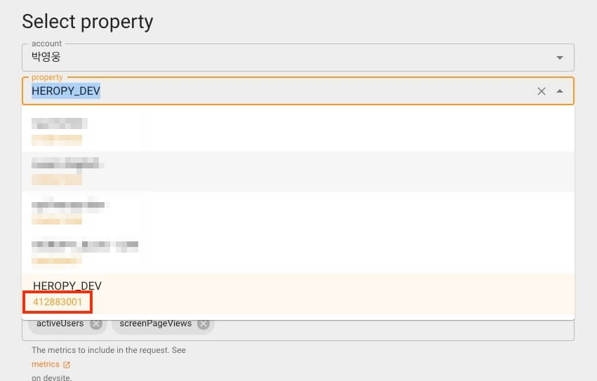

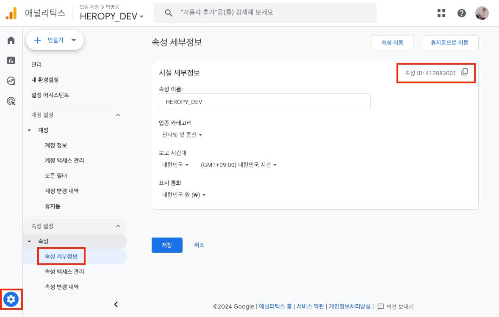

### API 호출

이제 Google Analytics Data API를 사용해 데이터를 가져오는 코드를 작성해봅시다.
루트 경로에 `analytics.js` 파일을 생성하고 다음과 같이 코드를 작성합니다. 

`.runReport()` 메서드의 요청 데이터를 작성할 때, 위의 GA4 Query Explorer에서 확인한 데이터 구조를 참고하면 좋습니다.
그리고 가져온 데이터는 원하는 형식으로 가공한 후, 파일이나 DB 등에 저장하거나 기타 활용할 수 있습니다.

```js --path=/analytics.js
import fs from 'fs'
import { config } from 'dotenv'
import { BetaAnalyticsDataClient } from '@google-analytics/data'

config() // 환경 변수 로드!
const { GOOGLE_APPLICATION_CREDENTIALS, GOOGLE_ANALYTICS_PROPERTY } = process.env

const client = new BetaAnalyticsDataClient({
  credentials: JSON.parse(GOOGLE_APPLICATION_CREDENTIALS || '')
})

// Google Analytics Data API 호출!
;(async () => {
  const [response] = await client.runReport({
    property: `properties/${GOOGLE_ANALYTICS_PROPERTY}`,
    dateRanges: [
      {
        startDate: '2024-03-20',
        endDate: '2024-03-26'
      }
    ],
    metrics: [
      { name: 'activeUsers' }, // 활성 사용자
      { name: 'screenPageViews' } // 페이지뷰
    ],
    dimensions: [
      { name: 'date' }, // 날짜
      { name: 'pagePath' } // 페이지 주소
    ],
    dimensionFilter: {
      filter: {
        fieldName: 'pagePath',
        stringFilter: {
          matchType: 'FULL_REGEXP', // 정규표현식
          value: `^/about$`
        }
      }
    },
    orderBys: [
      {
        dimension: {
          orderType: 'ALPHANUMERIC',
          dimensionName: 'date'
        },
        desc: true
      }
    ],
    keepEmptyRows: true, // 빈 행(Row) 조회
    // returnPropertyQuota: true // 할당량 확인
  })

  // 원하는 형식의 데이터로 가공!
  const result =
    response.rows?.reduce((acc, row) => {
      acc[row.dimensionValues[0].value] = {
        activeUsers: Number(row.metricValues[0].value) || 0,
        screenPageViews: Number(row.metricValues[1].value) || 0
      }
      return acc
    }, {}) || {}

  // 파일로 저장!
  fs.writeFileSync('analytics.json', JSON.stringify(result, null, 2))
})()
```

코드 작성이 끝나면, 터미널에서 다음 명령으로 코드를 실행합니다.

```bash
node analytics.js
```

그리고 생성된 `analytics.json` 파일을 확인하면, 다음과 같습니다.

```json --path=/analytics.json --caption=생성된 JSON 파일
{
  "20240320": {
    "activeUsers": 7,
    "screenPageViews": 8
  },
  "20240321": {
    "activeUsers": 3,
    "screenPageViews": 3
  },
  "20240322": {
    "activeUsers": 6,
    "screenPageViews": 9
  },
  "20240323": {
    "activeUsers": 6,
    "screenPageViews": 7
  },
  "20240324": {
    "activeUsers": 4,
    "screenPageViews": 9
  },
  "20240325": {
    "activeUsers": 6,
    "screenPageViews": 7
  },
  "20240326": {
    "activeUsers": 9,
    "screenPageViews": 28
  }
}
```

### 할당량

각 API 요청은 주어진 [할당량](https://developers.google.com/analytics/devguides/reporting/data/v1/quotas?hl=ko) 안에서만 수행되고, 할당량이 소진되면 해당 속성의 모든 요청이 차단됩니다.
'표준 속성 한도'(무료)를 기준으로 할당량은 다음과 같습니다.

- 하루당 200,000개 토큰 사용 가능
- 시간당 40,000개 토큰 사용 가능

대부분의 요청은 10개 이하의 토큰을 사용한다고 합니다.
위에서 작성한 예제의 요청은 1개의 토큰을 사용했습니다.
사용한 토큰 수를 확인하려면, 요청 데이터에 `.runReport()` 메소드의 옵션으로 `returnPropertyQuota: true`를 추가하면 됩니다.
그러면 다음과 같이 응답 데이터의 `propertQuota` 속성으로 할당량 정보가 포함됩니다.

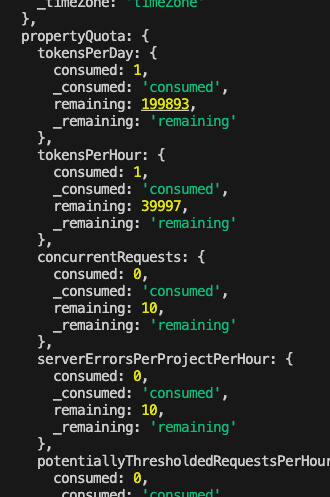

