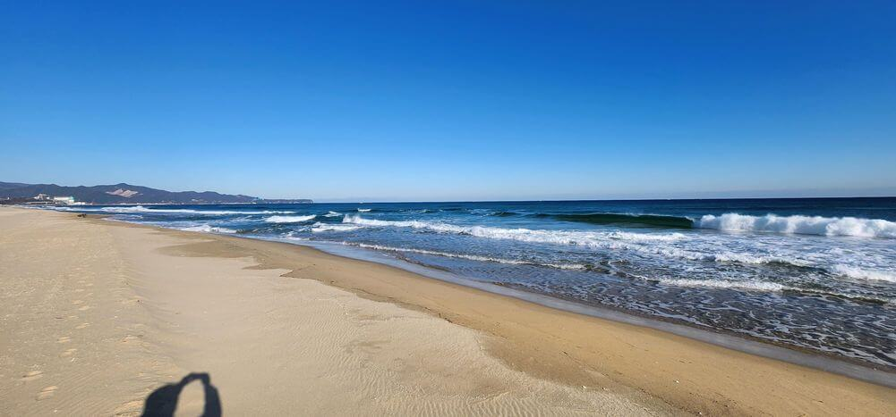
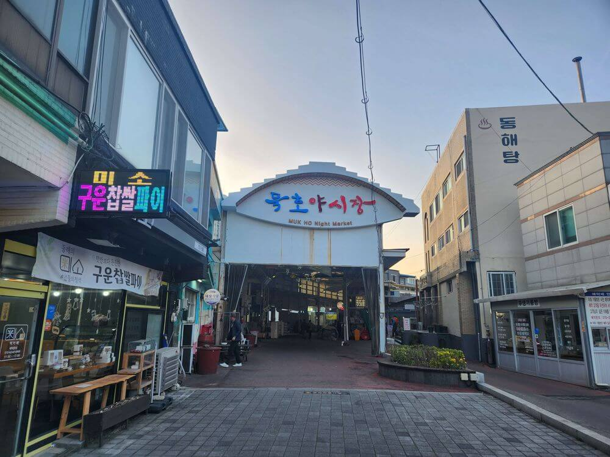
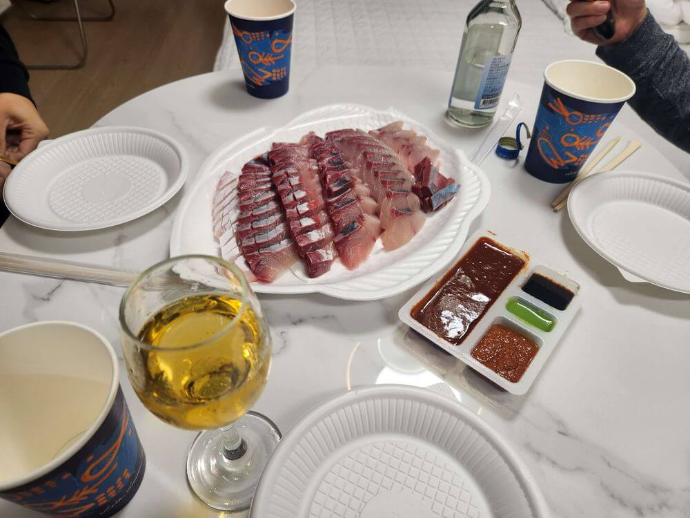

/// message-box --icon=info
자세한 워케이션 신청 방법은 [양양 쏠비치 워케이션 신청 방법](/p/eU4fA8#h2_워케이션_신청_방법)을 참고해 주세요!
///

이번에도 [서울경제진흥원(SBA)](https://www.sba.seoul.kr/)에서 지원하는 워케이션을 신청했어요.
12월 10일(화)부터 13일(금)까지 [동해 망상오토캠핑리조트](https://naver.me/x2jQ4ASo)으로 다녀왔어요.
비용은 3박 4일 총 5만 원이에요.
이번에는 회사 동료들과 같이 가는 워케이션이라 대표님이 신청했어요!

## 1일 차

### 망상 해수욕장

저는 6시에 수원에서 출발해서 9시 정도에 도착했어요.
우선 도착 기념으로 망상 해수욕장에서 바다 사진 한 장!

### 공유 오피스

공유 오피스는 망상오토캠핑리조트 중앙에 있는 [3층 건물(관리동)](https://naver.me/IItcGMJ3)에 있어요.
1층에서 가볍게 안내를 받고 2층 공유 오피스로 올라가서 창가로 자리를 잡았습니다.
절반 정도의 책상이 모션 데스크라서 높이를 조절할 수 있어요.
앞으로는 바다가 보이고 모션 데스크까지, 일하기에 완벽한 조건이에요!👍

점심시간이 되어서 근처에 있는 [산호가든](https://naver.me/IFgdPQ1T)이라는 한식뷔페(9천)로 이동했어요

메인 메뉴 말고 간장 게장도 있고 반찬 개수도 많아요.
아주 맛있게 먹었어요!
시원한 식혜도 있어서 식사를 마치고 한 잔 마셨습니다.

오후 3시 입실이라 1층으로 내려와서 체크인을 했어요.
은행처럼 대기표를 뽑고 차례가 되면 체크인을 하는 방식이에요.

### 숙소

바로 앞에 바다가 보이는 방을 받았어요!
오 대만족! 😍

깨끗한 화장실도 만족!

좀 더 넓은 복층 구조의 방도 있어요.
저녁 식사 때는 여기에서 모일 예정입니다.

가볍게 짐을 풀고 동해페이를 발급받기 위해서 [동해시청](https://naver.me/xiqu9XHJ)으로 이동합니다.
워케이션 기간 중 3만 원 이상 충전/사용하면, 최대 3만 원까지 페이백이 가능해요.
인센티브 10% 적립도 있으니 사용하지 않을 이유가 없겠죠?!
그리고 워케이션 기간 중에 사용하지 못한 금액은 앱에서 쉽게 환불 처리할 수 있습니다.
(전체메뉴 > 카드환불신청/조회 > 카드선택)

먼저 동해시청 4층에 경제과로 방문합니다. 
[그리고](https://play.google.com/store/apps/details?id=com.konai.konadure&hl=ko&pli=1)라는 앱을 설치하고 인증 및 카드 등록 후 충전/사용하면 됩니다.
시청 방문 전에 미리 앱을 설치하고 회원가입을 해두면 좋아요.

### 묵호항

저녁으로 뭘 먹을까 고민하다가 일단 [묵호야시장](https://naver.me/Fw734fDJ)에 들렀어요.
시장을 가볍게 둘러봤는데, 아쉽게도 시장에서 특별히 먹을만한 것을 찾지 못했어요.

회를 먹을까 싶어 주변에 [묵호항활어판매센터](https://naver.me/G1wSi35k)로 다시 이동!

대방어 철이라 [묵호원조대게](https://naver.me/Fuz5btft) 가게에서 대방어 한 마리를 잡았어요.

대방어 한 마리로 두 접시가 나왔는데, 한 접시는 바로 먹고 나머지 한 접시는 냉장고에 넣어두고 다음 날까지 숙성해서 먹으면 더 맛있다고 해요.
초장세트는 가게에서, 채소와 음료는 근처 마트에서 전부 동해페이로 결제했어요.

<iframe width="1920" height="1080" src="https://www.youtube.com/embed/X10GUYwvfVo" title="동해 대방어" frameborder="0" allow="accelerometer; autoplay; clipboard-write; encrypted-media; gyroscope; picture-in-picture; web-share" referrerpolicy="strict-origin-when-cross-origin" allowfullscreen></iframe>

사장님의 대방어 손질을 기다리고 있었는데, 하늘에서 비행기가 날아가네요.🛩️
멋있어서 사진 한 장!

숙소로 돌아와서 바로 저녁을 먹었습니다.
기대 이상으로 엄청 맛있는 대방어! 🐟
대방어 부속으로 끓인 매운탕과 라면까지 맛있게 먹었습니다.

## 2일 차

대표님이 워케이션 중에 사용할 수 있는 조식 쿠폰(1.2만)을 프린트해서 가져왔어요.
한 사람당 3장씩 사용할 수 있으니 마지막 날 아침 식사까지 해결할 수 있겠네요.
7시부터 오픈하는 [베이커리카페 클램](https://naver.me/5vcHo8wn)이라는 곳에서 사용할 수 있고, 혹시 값이 초과하면 추가 결제를 하면 됩니다.

맛있는 빵이 가득! 🥐

아침 일찍이라 사람이 없어요.
바다가 보이는 창가에 자리를 잡았습니다.

커피와 함께 아침 식사! ☕️
잘 먹겠습니다!

아침을 먹고 오피스로 이동해서 일을 하고 있는데, 점심 먹기 전부터 비가 많이 왔습니다.

점심을 먹고 돌아오니 비가 잠시 그쳐서 해안가로 산책을 나왔어요.
비가 온 뒤라 파도가 거세게 치는 바다의 모습이 정말 장관이었습니다.

저녁 식사를 준비하는 중에도 열심히 일하는 종학 님!

전날부터 냉장고에서 숙성된 대방어와 고기도 구워서 같이 먹었습니다.

한주 님이 챙겨온 디아블로 소주에요.
저는 맥주파라서 가볍게 한 잔만 맛보고 끝!

## 3일 차

비가 와서 그런지 다음 날 아침에는 날씨가 엄청 좋았어요.

숙소 근처에 [망상해변한옥마을](https://naver.me/G58gEs6l)이 있어서 산책을 나왔어요.

### 정동진 해수욕장

공유 오피스에서 일하다가 해가 지기 전에 구경거리를 찾아 잠시 나왔어요.
먼저 크루즈 리조트를 구경하려고 [정동진 조각공원 주차장](https://naver.me/xtgp3UiM)에 왔어요.
주차장에서는 기대하는 멋진 경치가 보이지 않아서 아쉬웠어요.

크루즈 리조트 주차장에서 정동진 해수욕장 방향으로 차량으로 이동하면 정동진 바다전망대를 만날 수 있어요.
최근에 생긴 시설이라 아직 네이버 지도에는 표시되어 있지 않지만, 전망대에서 바라보는 바다 풍경이 정말 멋있어요! 🤩

전망대에서 보는 크루즈 리조트가 멋있어요.

전망대가 바다 위에 있어서 해변을 바라보고 사진을 찍으니 드론으로 찍은 것 같이 멋있네요.

전망대에서 [모래시계 공원](https://naver.me/5yPnhrhw)으로 걸어서 이동했어요.

기차를 개조한 [정동진 시간 박물관](https://naver.me/GPdo1ieG)도 있어요.
입장료가 9천 원이라 그냥 나오긴 했는데, 나중에 리뷰를 보니 평이 좋네요.
다음에는 관람하는 걸로!

다시 숙소로 돌아왔어요.

저녁 식사는 소세지 야채 볶음과 모듬회입니다.
한주 님 요리 솜씨가 대단해요! 👍

고양이 한 마리가 놀러와서 식사를 대접했어요.

## 4일 차

마지막 날 아침에도 조식 쿠폰으로 빵과 커피를 사 왔어요.
오후 수료식 참여가 있어 점심 먹을 시간이 없을 것 같아 남기지 않고 다 먹었어요.

오후에는 서울로 이동해서 패스트캠퍼스 DFE 1기 수료식에 참석했어요.
수개월 동안 고생한 모든 수강생분 수료 축하해요~❤️

이번 워케이션은 신청부터 증빙 사진 제출까지 모두 대표님이 처리했어요.
서류는 워케이션 참여 기업 단위로 한 번만 처리하면 됩니다.

다음 주에는 24년 마지막으로 태백 워케이션을 다녀올 거에요.