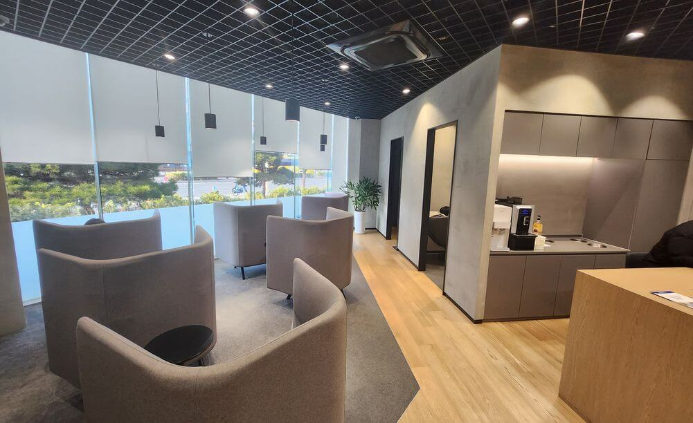
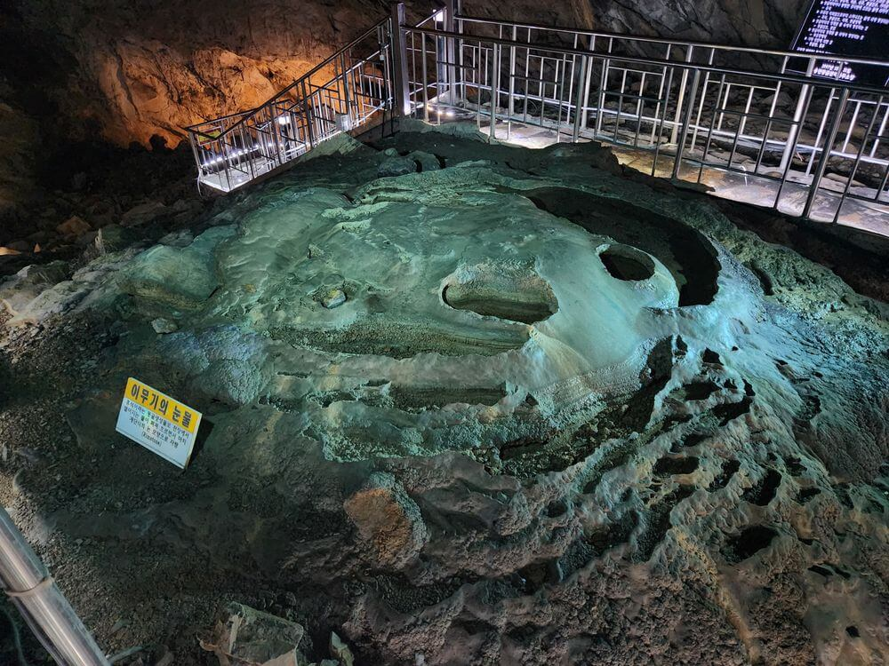
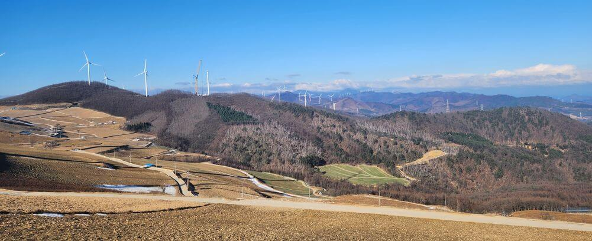
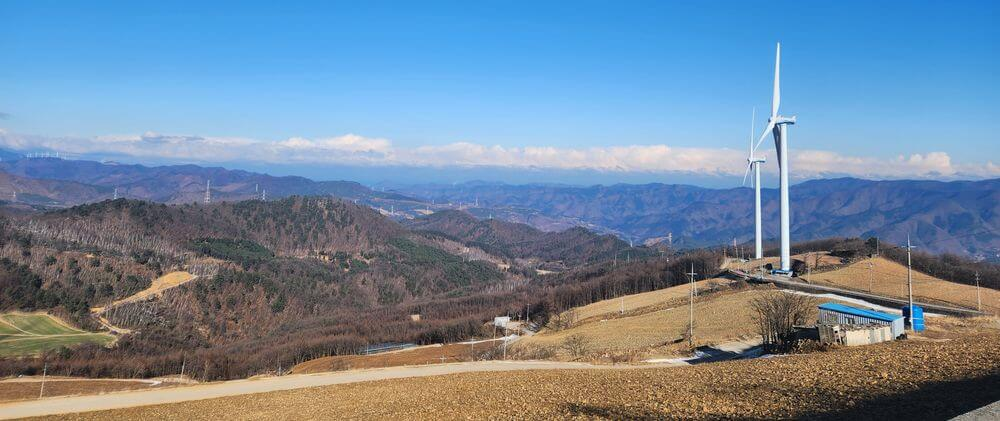
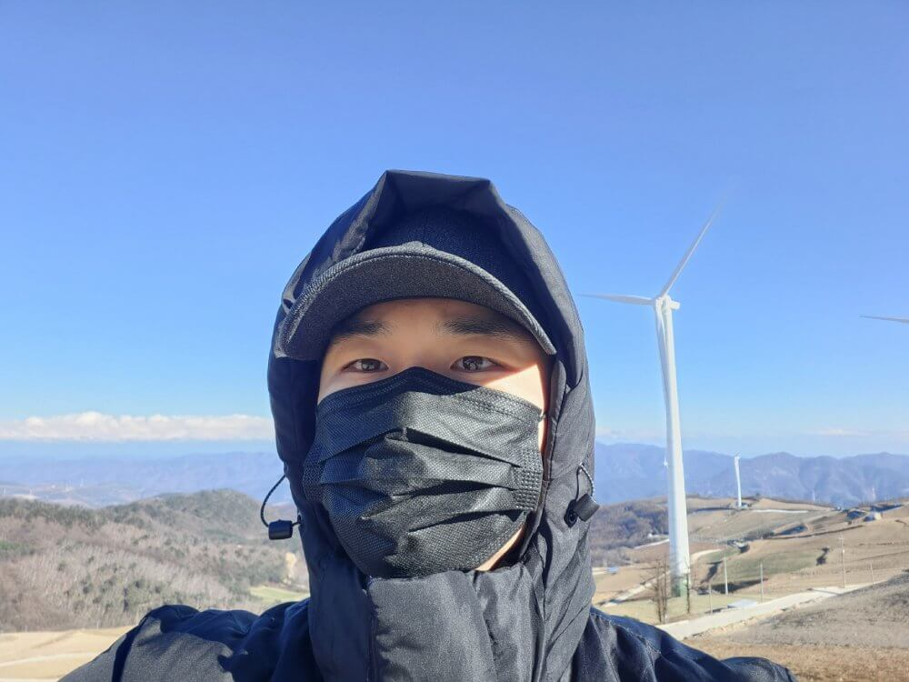
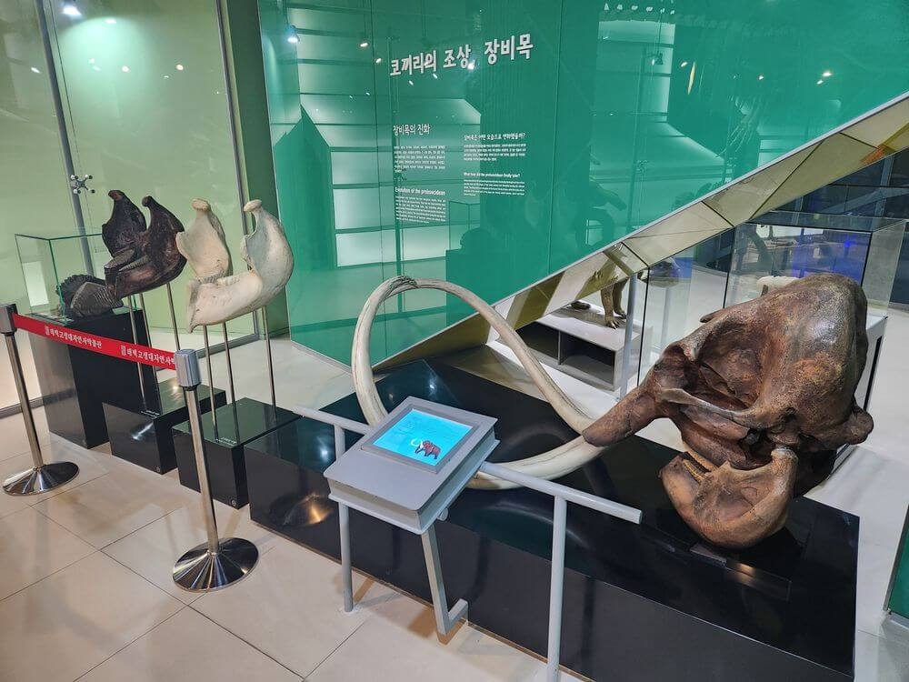

/// message-box --icon=info
자세한 워케이션 신청 방법은 [양양 쏠비치 워케이션 신청 방법](/p/eU4fA8#h2_워케이션_신청_방법)을 참고해 주세요!
///

[서울경제진흥원(SBA)](https://www.sba.seoul.kr/)에서 지원하는 24년 마지막 워케이션을 신청했어요.
2024년 올해는 지원자가 적어서 두 번 이상 지원할 수 있었습니다.
12월 17일(화)부터 20일(금)까지 [태백 오투리조트](https://naver.me/GKUJ48of)로 다녀왔습니다.
비용은 3박 4일 총 1만 원이에요, 엄청 저렴하죠?!

## 1일 차

앞서 두 번이나 장거리를 뛰었더니 엔진 오일을 교체할 때가 됐어요.
태백을 다녀오면 교체 시기가 많이 지날 듯해서 아침 일찍 첫 번째 손님으로 수원 [블루핸즈](https://naver.me/Fnm031f9)에서 오일을 교체했어요.

여기 블루핸즈는 1층과 2층 모두 커피머신이 있는 휴게실이 있고 안마 의자도 여러 대라서 기다리기에 지루하지 않아요.

엔진오일 교체 후 바로 출발!
가는 길에 충주 산업단지에 있는 [만석골 한식부페](https://naver.me/FJbYbxIj)(7천)에서 점심을 먹었어요.
친구와 친구 어머니가 함께 운영하는 식당인데, 저렴하고 맛있어요!
오투리조트는 2시 입실이라 늦지 않도록, 식사 후 가볍게 인사만 하고 바로 나왔어요.

### 오투리조트

약 2시간을 달려서 태백에 도착했고, 산꼭대기에 있는 오투리조트가 저 멀리 보이기 시작했습니다.

리조트 입구에서 처음 만나는 주차장(제1주차장)을 지나 리조트 건물 앞까지 가면 주차장 또 있어요.
잘 몰라서 건물에서 한참 먼 곳에 주차할 뻔했네요.

먼저 1층 로비에서 안내를 받고 방으로 이동했습니다.

30평형인데, 주방 벽에 5명 정원의 골드 방이라고 쓰여 있네요.
1박 기준 33만 원짜리 방을 혼자 쓰게 되었어요.
넓어서 좋긴 한데, 귀신 안 나오겠지?! 🫣

발코니에서 밖을 보면, 골프장이 보여요.

복도로 나와서 끝까지 가면, 창문 밖으로 주차장과 함께 태백 시내가 보입니다.
산꼭대기에서 보는 풍경이 정말 좋아요!

건물 뒷편으로는 스키장이 보입니다.

공유 오피스는 1층 로비 옆에 있어요.
단순히 회의실인데, 문제는 콘센트와 와이파이가 없어요!
사실상 공유 오피슨는 사용할 수 없는 걸로 이해하면 될 듯해요.

서류 제출용 사진만 촬영하고 다시 방으로 돌아왔어요.
방에는 와이파이가 있으니 워케이션 기간 동안 방에서 일을 해야 할 것 같아요.
창밖으로 보이는 하늘이 핑크색이네요! 💖

저녁으로는 오투리조트 근처에 있는 [미전](https://naver.me/FPnrF5Uu)이라는 곳에서 돈까스 정식(1.4만)을 포장해서 먹었어요.
참고로 여기는 산꼭대기라서 운전해서 시내로 나가기에 부담이 있어요. 
중간 크기의 냉장고가 있으니 먹을 음식을 미리 사 오는 게 좋아요.

발코니에서 보는 멋진 야경!

## 2일 차

아침에 산책을 나왔다가 스키장 뒤편 저 멀리 풍력발전기가 보였어요.
검색을 해보니 차로 갈 수 있는 [바람의 언덕](https://naver.me/FgHIANxy)이라는 곳이 있더라고요.

### 용연동굴

바람의 언덕으로 가기 전에 다른 가볼 만한 곳을 찾다가 [용연동굴](https://naver.me/FUhsSpsh)을 발견해서 바로 출발!

용연동굴로 가는 길에 매표소가 있어요.
먼저 매표소에서 관람권(3.5천)과 주차료(2천)를 계산했습니다.
주차료를 내지 않으면 산을 타고 동굴 입구까지 1km 이상 걸어서 올라가거나 버스를 기다렸다가 타야 해요.
길이 꽤 가파르니까 되도록 차로 이동하는 게 좋아요.

동굴 입구에서 안내원분께 안전모를 받아 쓰고 들어갔어요.
동굴 내부 온도는 평균 10도라고 하는데, 옷을 가볍게 입는 게 좋을 듯해요.
내부가 꽤 습하기도 하고 계단이 많아서 금방 더워져요.

동굴로 내려가니 바로 _"우와"_ 소리가 절로 나왔어요.
저는 좁은 통로를 따라가는 것만 생각했는데, 엄청 넓은 공간이 나왔거든요.
거대한 용이 살 것 같은 공간이었어요.

갑자기 '사랑 참?' 뭐지?

기대 이상으로 재밌게 구경하고 나왔어요.

바람의 언덕으로 가는 길에 [이마트](https://naver.me/513NaW4Q)가 있어서 숙소에서 먹을 음식을 샀어요.
이마트가 아담해서 귀여워요!
그래서 있을 건 다 있어요, 수원 이마트보다 훨씬 나은 듯!

점심은 [태백순두부](https://naver.me/GG7PBQpJ)에서 순두부(9천)를 먹었어요.
고기반찬은 없지만, 강된장과 비지찌개에 밥을 비벼서 먹으면 정말 맛있어요!

맛있게 잘 먹었습니다.
반찬이 적어 보여도 실제로는 엄청 많아요.
다른 테이블은 아깝게 다들 남기더라고요.
그래서 사장님께 말씀드렸는데, 별로 신경 안 쓰시는 듯.

### 바람의 언덕

이제 [바람의 언덕](https://naver.me/FgHIANxy)으로 이동합니다.
차로 한참을 올라가야 하는데, 도로 상태로 좋지 않아서 천천히 조심조심 운전했어요.

경치는 말로 표현할 수 없을 만큼 훌륭합니다! 

### 황지연못

[황지연못](https://naver.me/5EUB4whm)에 왔어요.
황지연못이 낙동강 발원지로 알려져 있었는데, 지금은 너덜샘이라는 곳으로 바뀌었다고 해요.
작은 광장도 있고 주변에 카페들도 있어서 가볍게 구경하기 좋아요.

5년도 더 전에 코워킹 스페이스 투어를 하며 들렸던 [무브노드](https://naver.me/GRoZ57Ez)에도 왔어요.
오랜만에 대표님께 인사드리려고 했는데, 지금은 작가분들이 사용하는 공간으로 바뀌었다고 하더라고요.
대표님은 근처 다른 곳에 계시고 이번에 출장까지 가셔서 안부 메시지만 남기고 다시 이동했습니다.

### 구문소

무브노드 근처에 있는 [구문소](https://naver.me/5tJCD5G9)에 들렀어요.

### 고생대 자연사 박물관

구문소 옆에 있는 [고생대 자연사 박물관](https://naver.me/54LbxsFz)도 구경했어요.
입장료는 2천 원이에요.

숙소로 돌아와서 저녁으로 이마트에서 산 햄버거와 콜라를 먹었습니다.

## 3일 차

어제는 종일 돌아다녔으니 오늘은 숙소에서 일만 해야 해요.
가볍게 아침 산책을 하려고 리조트 주변을 돌아다녔어요.

1층 로비에는 게임기가 있는데, 스트리트 파이터 2! 👀
과연 누가 할까?

자기 전에도 가볍게 산책을 했어요.
저 멀리 달이 보이는데, 마치 태양 같죠?!

수도권에서는 절대 볼 수 없는 수 밤하늘!
별이 엄청 많은데, 사진에 잘 담기지 않아서 아쉽네요.

## 4일 차

이제 돌아갈 시간입니다.
아침 일찍 짐을 챙겨서 퇴실하고 수원으로 출발!

수원에 도착해서 점심으로 [콩나물국밥](https://naver.me/5YFd4nCi)(6천)을 먹었습니다.

3주 연속 워케이션으로 구경도 많이 하고 1년 치 스트레스를 다 날린 듯해서 홀가분해요!
다시 또 바빠지겠지만, 열심히 일하고 내년에도 또 갈 거에요~ 🤩

중소기업에 다녀도 좋은 혜택이 많이 있으니까 다들 잘 활용하면 좋겠어요.
모두 화이팅하시고 2025년 새해 복 많이 받으세요! 💰