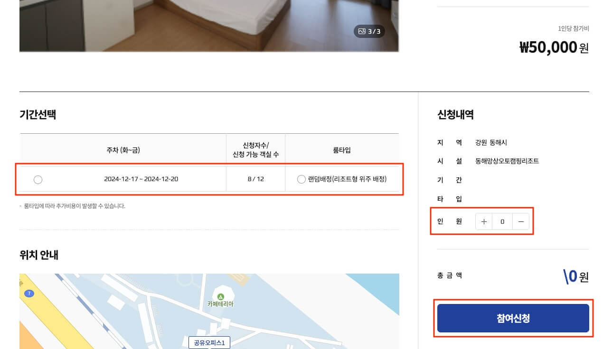
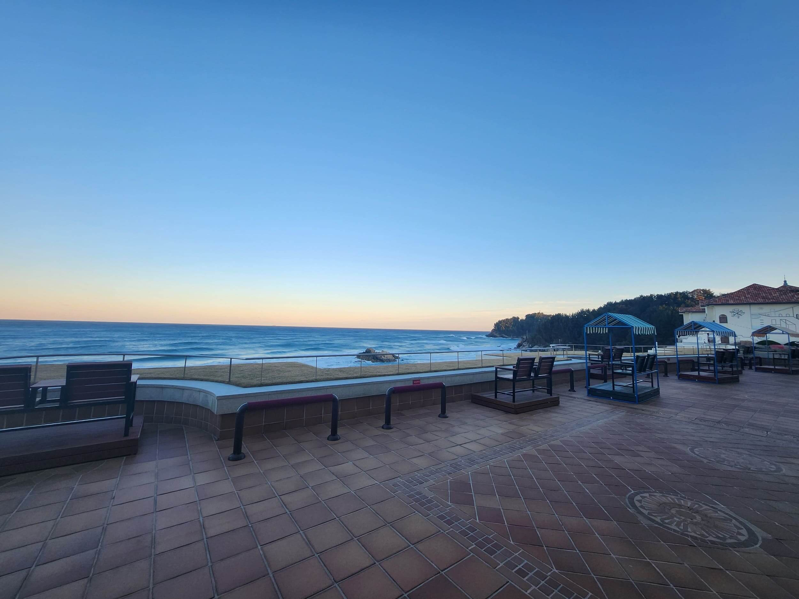

서울 소재 [중소기업](https://ko.wikipedia.org/wiki/%EC%A4%91%EC%86%8C%EA%B8%B0%EC%97%85)에 재직 중이라면 [서울경제진흥원(SBA)](https://www.sba.seoul.kr/)에서 지원하는 [퇴근만큼 즐거운 출근](https://worcation.sba.kr/) 사이트에서 워케이션을 신청할 수 있습니다.
근로의욕 제고와 기업의 새로운 복지 제공을 목적으로 하고 있는데, 저렴한 비용으로 각 지역의 질 좋은 숙소와 공유 오피스를 이용할 수 있어요.
색다른 장소에서 일할 수 있고, 퇴근 후 바로 여행 온 것처럼 즐길 수 있어요.
기본적으로 1년에 2번까지 지원이 가능해요.(변동 가능성이 있어요)

원격 업무가 가능한 회사에 재직 중이시라면 적극 추천합니다.

<iframe style="width: 100%; aspect-ratio: 16/9;" src="https://www.youtube.com/embed/68NxMuUiQJs" title="양양 쏠비치 워케이션 (SBA 어촌체험휴양마을 워케이션, 12월 3일~6일)" frameborder="0" allow="accelerometer; autoplay; clipboard-write; encrypted-media; gyroscope; picture-in-picture; web-share" referrerpolicy="strict-origin-when-cross-origin" allowfullscreen></iframe>

## 워케이션 신청 방법

워케이션은 휴가가 아니라 출장 같은 개념이에요.
그래서 회사가 승인을 해줘야 하는데, 회사 측에 발생하는 비용은 전혀 없으니 혹시나 걱정하지 않아도 됩니다.
물론 워케이션 기간 중에 발생하는 비용은 이용자 부담이니 법인 카드를 받아올 수 있으면 아주 좋겠죠.

신청은 보기보다 간단합니다.
참여신청 페이지에서 원하는 위치의 워케이션을 선택하고, 기간과 인원을 고른 후 '참여신청'을 버튼을 누릅니다.
간혹 기간을 선택할 수 없는 경우가 있는데, 그러면 신청 자체가 안 되더라고요.

그리고 필요한 서류를 제출해야 하는데, 개인회원의 경우 제출할 서류는 다음과 같습니다.
'지원기업 참여제한 확인 및 임직원 근로장소 변경 확인서'는 회사 대표 서명이 필요하고, 나머지는 직접 작성하시면 됩니다.
양식은 홈페이지에서 다운로드 받을 수 있습니다.

- 재직증명서 혹은 4대보험 가입내역
- 개인정보 제공 동의서
- 근로복지공단 필수 신청 양식
- 지원기업 참여제한 확인 및 임직원 근로장소 변경 확인서

그리고 본인이 맞는지 확인하는 전자문서를 발송해야 합니다.
하나는 신청한 참가자 개개인에게 발송되고, 또 하나는 회사 대표에게 발송됩니다.
카톡이나 메일로 받은 문서에 확인/서명하면 됩니다.

- 참가자별 개인정보동의 요청보내기(전자문서)
- 대표자 참여제한 확인 및 임직원 근로장소 변경 확인서 요청보내기(전자문서)

모든 서류를 제출하고 기다리면(1~2일 정도), 검토 후에 승인이 됩니다.

승인 후에 해당 지역 워케이션 관리 업체에서 메일이 하나 오는데, 참가비를 입금하라고 해요.
참가비는 개인이 입금해도 되고, 회사가 입금해도 됩니다.
참고로 메일에 자세한 참여 방법이 적혀 있진 않아서, 궁금한 점은 해당 업체에 문의하면 됩니다.

쉽게는 정해진 날짜와 시간에 맞춰 준비 후 출발하면 됩니다.
단, 숙소 입실과 공유 오피스 이용 시간은 꼭 확인하고 출발하세요!
일찍 도착하면 공유 오피스 이용 후 입실, 늦게 도착하면 바로 입실하면 됩니다.

## 1일 차

### 워케이션 출발

저는 12월 3일(화)부터 6일(금)까지 양양 쏠비치로 워케이션을 다녀왔어요.
비용은 3박 4일 총 12만 원이고, 4성급 호텔 숙박비로는 엄청 저렴하지만 워케이션 중에서는 비싼 편이에요.

두근두근!😘 새벽 5시 반에 일어나 바로 양양으로 출발했습니다.
12월이라 그런지 7시쯤 돼야 밝아지네요.

수원에서 약 3시간 반 정도 운전해서 오전 8시 정도에 [공유 오피스](https://naver.me/GTn376OY)에 도착했어요.
공유 오피스는 9시 오픈이기 때문에 우선 주변을 둘러보기로 했습니다.
오피스 앞에는 요트 선착장이 있어요.

선착장 안쪽으로 들어가면 '수산~동호간 해안생태탐방로'가 있어요.
네이버 지도에는 보이지 않는 길이라 궁금해서 들어가 봤어요.

조금만 걸으면 전망대가 나오고 아래로 두꺼비 바위가 보이는데, 정말 두꺼비 뒷모습 같네요.

두꺼비 바위가 보이는 전망대에서 온 길을 돌아보면 요트 선착장이 한눈에 들어옵니다.

선착장 초입에는 멋진 다리도 있어요.

주변을 둘러봤는데도 아직 공유 오피스 오픈 시간이 남아서 아침을 먹으려 양양 시내로 이동했어요.
양양 터미널 주변에 [기사 식당](https://naver.me/xTT67GlR)에서 백반을 먹었습니다.
제육볶음을 먹으려고 했는데, 아침에는 백반만 가능하더라고요.

### 수산어촌체험마을 공유 오피스

아침을 든든하게 먹고 공유 오피스로 돌아왔어요.
건물 1층은 카페이고 2층에 오피스가 있어요.

선착장이 보이는 창가에 자리를 잡았어요.
창가 자리에는 책상마다 모니터가 하나씩 마련되어 있습니다.
서브 모니터를 하나 가져왔는데, 모니터가 있는 줄 알았으면 안 가져왔을 거예요.

워케이션이 승인되고 나서 이메일로 할인 쿠폰을 받을 수 있어요. 
주의할 점이 있는데 필히 인쇄해서 사용해야 한대요.
그래서 오피스 프린터로 쿠폰을 인쇄하고 잘라서 사용했어요.
칼이나 가위가 없어서 열심히 손으로 잘랐는데, 지금 내가 뭐 하는 건가 싶어서 한참 웃었네요.
쿠폰 하나로 1층 카페에서 아메리카노 한 잔을 무료로 마실 수 있어요.
아메리카노 가격 기준으로 추가 금액을 지불하면 다른 음료를 마실 수도 있어요.

카페는 깔끔하고 좋아요.
이른 아침이라 사람이 없지만, 오후가 되면 사람이 많아지더라고요.

메리메리 아메리카노가 아니라 카페라떼를 마셨습니다.
날씨가 추워서 금방 식더라고요.

공유 오피스에서 일하면서 인증샷 한방!
워케이션 중에 공유 오피스와 숙소, 카페 등의 이용 사진을 찍어서 서류로 제출해야 해요.
잊어먹지 않게 미리미리 잘 찍어둬야 합니다.

저는 각 도시의 명소를 소개하는 간판이 있으면 항상 사진을 찍어둬요. 
사는 동안 한 번씩은 다 가봐야겠죠?!

### 쏠비치 양양 호텔(숙소)

숙소는 [쏠비치 양양 호텔](https://naver.me/GfCsZSWV)이에요.
공유 오피스에서 일을 하다가 3시 입실을 위해 숙소로 이동했어요.

로비에서 안내를 받아 방으로 향했습니다.

마루과 카펫 방 중에 선택할 수 있는데, 저는 마루를 선택했어요.

미니바가 있고, 미니바 하단에 작은 냉장고에는 미니 맥주, 탄산음료, 물이 2개씩 있어요.
냉장고가 작아서인지 온도 조절을 해도 시원하지 않았어요.
이 부분은 조금 아쉬웠는데, 다행히 겨울인지라 냉장고 대신 테라스에 물과 음료를 내놓으니 충분히 시원해졌어요.

화장실은 깨끗하고 좋아요.
사진에는 안 보이지만, 문 뒤에 샤워 공간이 있고 충분히 넓어요.

멋진 풍경과 함께 테라스 난간의 이국적인 인테리어가 휴양지에 온 듯한 기분을 느끼게 해주네요.

아트리움 구조에 복도형이라 방에서 나오면 바로 1층(로비, 카페 등)이 보여서 아주 멋져요.

저녁 식사로 양양시장 근처에 [양양회포장](https://naver.me/G386s3SR)이라는 곳에서 광어막회1인(2.5만)와 야채+물회소스(7천)를 포장해서 숙소로 가져왔어요.
먼저 광어회를 먹고 나머지를 물회로 먹으면 됩니다.
양이 엄청 많아서, 간단히 식사를 하고 2명이 술안주로 먹어도 좋을 것 같아요.

저녁을 먹고 테라스에서 시원하게 바람을 쐬다가 산책을 다녀올지 생각했어요. 

화려하게 빛나는 베누스 광장이 보입니다.
사진보다 훨씬 멋있어요.

베누스 광장 한쪽으로 쏠비치(해변)가 보여요.
우측으로 가면 쏠비치로 내려가는 길이 있어요.

## 2일 차

푹 자고 일어났어요.
준비하고 다시 공유 오피스로 이동했습니다.

점심은 [보릿고개](https://naver.me/GSDAihtS)에서 보리밥정식(1만)을 먹었어요.
푸짐하고 아주 맛있습니다.
막걸리가 어울리지만, 운전을 해야 하니 아쉽게도 패스!

맛있게 잘 먹었습니다.

소화를 시킬 겸 공유 오피스 옆 해안생태탐방로에서 산책을 했어요.
바다 경치와 함께하는 산책은 언제나 좋아요.

날이 어둑어둑해지는 게 퇴근할 시간이 다가옵니다.
아무도 없는 오피스에서 불 끄고 혼자 일하는 뿌듯함!👍
공유 오피스는 오후 6시까지 이용할 수 있어요.

퇴근하고 숙소로 돌아와서 저녁 식사로 빙수를 먹었어요.🍨
지하주차장에서 호텔로 이어지는 길에 '더몰'이라는 부대시설에 설빙이 있더라고요.

## 3일 차

다음 날에는 점심으로 [피노키오수제돈까스전문점](https://naver.me/GOPeujhv)이란 곳에서 경양식 돈까스를 먹었어요.
식전 뜨끈한 수프가 나와요.

수프를 다 먹을 즈음 돈까스가 나와서 맛있게 먹었어요.
밥을 접시에 납작하게 펴서 주는 게 조금 신기했어요.

### 낙산, 송전 해수욕장

점심 먹고 산책 겸 [낙산 해수욕장](https://naver.me/52R5llOB)으로 이동했어요.

그리고 [송전 해수욕장](https://naver.me/GBFHffxy)도 방문했어요.

### 오산리 선사유적박물관
[오산리 선사유적박물관](https://naver.me/GgWkWQJU)(무료)도 방문했어요.
주차 후에 유적지탐방로를 지나 박물관으로 이동했어요.

선사시대 친구들과 사진 한 방!

실감영상관(12분 소요)에서 벽과 바닥까지 모두 영상으로 보여주는 게 신기했어요.
특히 파도치는 건 진짜 같았어요.

영상 다 보고 전시실로 이동합니다.

구석기시대부터 철기시대까지 다양한 유적이 전시되어 있어요.

옛날에 태어났으면 코딩 대신 도자기 굽고 있을 듯..🤣

곰오양 토우는 실제로 AA 건전지 크기 정도입니다.
토기 복원 체험용은 엄청 크게 만들어 놨는데, 귀여워서 한 컷!

박물관을 나와서 쌍호탐방로를 걸었어요.
길도 잘 정리되어 있고 조용해서 가볍게 산책하기 아주 좋은 곳이에요.

다시 오피스로 돌아와서 일하다가 6시가 되어 퇴근합니다.
퇴근할 때 소등하는 뿌듯함!👍
주변이 밝아서 혼자라도 별로 안 무서워요.

저녁 식사로 [굴나라](https://naver.me/xSFaFK72)에서 굴국밥(9천)을 먹었어요.
바로 옆 테이블 아저씨들의 굴보쌈 회식이 너무 부러웠습니다.

돌아오는 길에 [호떡 가게](https://naver.me/GOPePvUC)에서 호떡 3개(4.5천)를 포장했어요.
이 집은 양양 방문할 때마다 가는 곳인데, 호떡을 거의 튀기듯이 구워줍니다. 
숙소까지 가져와서도 눅눅하지 않고 바삭바삭 아주 맛이 좋았습니다.
냉장고에 있던 미니 맥주와 함께 먹으며 하루 마무리!

## 4일 차

### 양양시장

마지막 날 아침, 숙소 퇴실하고 가볍게 기념 선물(양양샌드)을 사러 [양양 시장](https://naver.me/FLyTeuK8)으로 이동했어요.

양양 시장 중간에 2층(연애공원)으로 올라가는 계단이 있습니다.

연애공원이라 연어가 있는 건가?
기념사진 한 장!

복도 끝에 [문화카페](https://naver.me/GubwbtTL)가 있습니다.

카페에 도착하기 직전에 2층 공원에서 걷다가 돌부리에 걸려서 슬라이딩을 했어요.
왼쪽 손목이 아작났는데, 피를 철철 흘리며 카페로 들어가 샌드를 주문하니 사장님 기겁!😱
일단 주문부터 하고 가까운 [성모의원](https://naver.me/x67yxTV9)으로 갔어요.
다행히 상처가 깊지는 않아서 가볍게 처치 후 카페로 돌아왔습니다.
(집에 돌아와서 보니 팔꿈치랑 무릎도.. 어쩐지 아프더라..😭)

불쌍했는지 사장님이 샌드 하나를 공짜로 주셨어요.
먹어보니 기대 이상 맛있었습니다!
양양샌드(1.5만)는 차게 먹으면 더 맛있다고 해요.

손모가지랑 등가교환한 양양샌드 싣고 이제 집으로 출발!

3시간 넘게 운전해 수원에 도착!
점심으로 [양평해장국](https://naver.me/5MVzVJ8k)을 먹었어요.

다음 주에 증빙 사진(숙소, 카페, 오피스 이용)을 메일로 전송하고, 설문 조사를 완료하면 워케이션 끝!

운전을 많이 해서 조금 피곤하지만, 아주 좋은 경험이었어요~🥰
벌써 또 가고 싶다!
